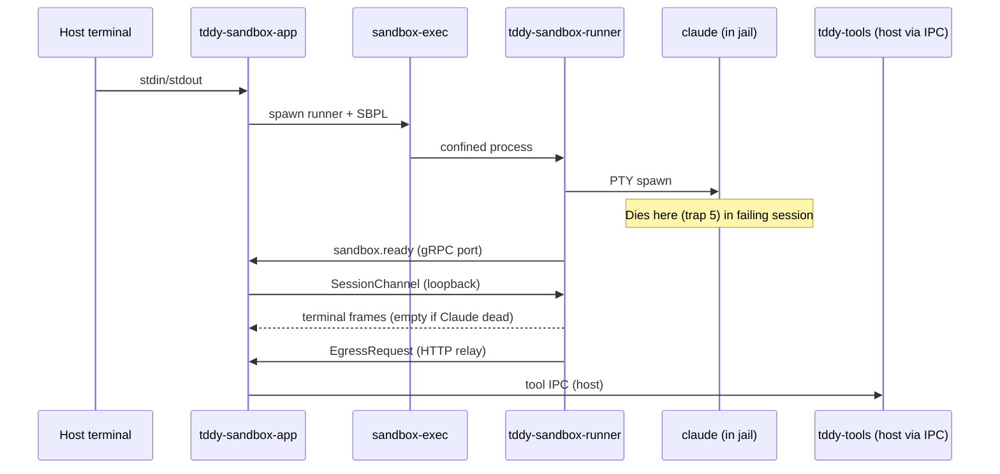

# Investigation: `tddy-sandbox-app` — blank terminal / Claude dies in Seatbelt jail

**Status:** **P0 trap 5 + P1 egress RESOLVED 2026-06-28** — Claude boots in jail and reaches the network via an in-jail HTTPS_PROXY CONNECT tunnel relayed over SessionChannel (host does the real outbound TCP). Acceptance test green; pending final real-`claude` end-to-end run against `~/Code/llm-tests`.  
**Date:** 2026-06-28  
**Reporter session:** `019f0d09-efe6-7a62-9e2c-1c8ba9c571db`  
**Repo under test:** `~/Code/llm-tests`  
**Platform:** macOS (darwin Seatbelt / `sandbox-exec`)

---

## Context docs (read before continuing)

Use these as the authoritative background for **intent**, **architecture**, and **intended behavior**. This investigation doc covers **current breakage** on the `tddy-sandbox-app` path only.

### Product requirements (`docs/ft/` — WHAT)

| Doc | Relevance |
|-----|-----------|
| [claude-cli-session.md](../../ft/daemon/claude-cli-session.md) | PRD for claude-cli sessions; **§ Darwin sandbox mode** defines `StartSessionRequest.sandbox = true`, SessionChannel, resume/delete, non-macOS `failed_precondition` |
| [remote-codebase-mode.md](../../ft/daemon/remote-codebase-mode.md) | **§ Local sandbox sibling** — same tool model as remote codebase, but agent in jail + host `tool_engine` on worktree (no remote daemon) |
| [claude-cli-permission-mode.md](../../ft/daemon/claude-cli-permission-mode.md) | Permission modes passed through to in-jail `claude` (`auto`, etc.) |

### Cross-package changeset

| Doc | Relevance |
|-----|-----------|
| [docs/dev/changesets.md](../changesets.md) | **2026-06-27** entry: Darwin-sandboxed Claude CLI (PR [#241](https://github.com/uppin/tddy-coder/pull/241)) — crate split, SessionChannel proto, `(deny network*)` + host-relayed egress |
| [tddy-sandbox changesets](../../packages/tddy-sandbox/docs/changesets.md) | `SandboxSpec`, `SandboxContextDir`, `Unsupported` on non-darwin |
| [tddy-sandbox-darwin changesets](../../packages/tddy-sandbox-darwin/docs/changesets.md) | SBPL template, spawn, troubleshooting doc |

### Technical implementation (`packages/*/docs/` — HOW)

| Doc | Relevance |
|-----|-----------|
| [tddy-sandbox architecture](../../packages/tddy-sandbox/docs/architecture.md) | `SandboxSpec` fields, context dir (selective copy + `REMOTE_APPENDIX`), consumers |
| [connection-service.md § Sandboxed claude-cli](../../packages/tddy-daemon/docs/connection-service.md#sandboxed-claude-code-cli-sessions) | Daemon spawn → `dial_and_bridge`, SessionChannel frame types, egress relay, resume/delete |
| [tddy-sandbox-darwin troubleshooting](../../packages/tddy-sandbox-darwin/docs/troubleshooting.md) | Historical Seatbelt blockers (dyld `/`, localhost vs `127.0.0.1`, PTY, fork, IPC path canonicalization) |

### Agent skill

| Doc | Relevance |
|-----|-----------|
| [darwin-sandbox SKILL.md](../../.agents/skills/darwin-sandbox/SKILL.md) | Debugging playbook, acceptance test commands, **superseded designs** (do not reintroduce host HTTPS proxy). **Note:** skill code map still names `tddy-tools/src/sandbox_runner.rs` — runner lives in **`tddy-sandbox-darwin/src/runner.rs`** (binary `tddy-sandbox-runner`); MCP allowlist in **`tddy-sandbox/src/claude_spawn.rs`**. |

### Proto & wire format

| Path | Relevance |
|------|-----------|
| [packages/tddy-service/proto/sandbox.proto](../../packages/tddy-service/proto/sandbox.proto) | `SessionChannel` bidi RPC, `SessionFrame` (terminal / tool exec / egress) |
| [packages/tddy-service/proto/connection.proto](../../packages/tddy-service/proto/connection.proto) | `StartSessionRequest.sandbox`, daemon terminal RPCs |

### Documented path vs this investigation

| Path | Entry | Host process |
|------|-------|--------------|
| **Production (documented)** | Web / RPC → `tddy-daemon` `StartSession` with `sandbox: true` | Daemon spawns jail + `dial_and_bridge` |
| **This bug (dev tool)** | `tddy-sandbox-app --repo …` | **No daemon** — host binary spawns jail directly, reuses `sandbox_session` helpers as a library |

Both paths should share the same in-jail runner, SBPL template, SessionChannel protocol, and tool/egress relay semantics. Fixes to profile or runner apply to both; **`tddy-sandbox-app`-only UX** (blank terminal, early failure poll) is local to `packages/tddy-sandbox-app/`.

### Acceptance tests (from skill + investigation)

```bash
./dev cargo test -p tddy-sandbox-darwin
./dev cargo test -p tddy-sandbox-darwin --test sandbox_runner_behavior_acceptance
./dev cargo test -p tddy-daemon --test sandbox_runner_spawn_smoke
./dev cargo test -p tddy-daemon --test sandboxed_claude_cli_acceptance
./dev cargo test -p tddy-daemon --test sandboxed_session_lifecycle_acceptance
```

Use **`--test sandbox_runner_spawn_smoke`** (not bare `-p tddy-daemon <test_name>`) — a package-wide name filter runs 0 tests across unrelated binaries.

---

## UPDATE 2026-06-28 — trap 5 fixed, egress is the new wall

**P0 trap 5: RESOLVED and validated.** Root cause confirmed: rendered profile lacked the read relaxation. Profile-level isolation test (session `019f0d09` profile vs. patched copy, `claude --version`):

| Profile | Result |
|---------|--------|
| Original (tight read list) | `error: An internal error occurred (EPERM)` |
| `+ (allow file-read*)` | **`2.1.195 (Claude Code)`** ✅ |
| `+ (allow dynamic-code-generation)` only | EPERM (no help on its own) |

→ **`(allow file-read*)` is the rule that unblocks startup.** `dynamic-code-generation` is kept for real JIT execution but is not what fixes `--version`. Both are in the template now (`sandbox-claude.sb.tmpl:66-67`) and the rendering unit test asserts them (`profile.rs:123-124`, passing). A fresh app run (session `019f0d29`) reached `Welcome to Claude Code v2.1.195` — Claude boots and stays alive.

**P1 network egress: now the active blocker.** New session shows:

```text
Unable to connect to Anthropic services
Failed to connect to api.anthropic.com: ECONNREFUSED
```

Root cause (confirmed by code read):

1. **No proxy/base-url env is set for Claude.** `grep -rni 'HTTPS_PROXY|HTTP_PROXY|proxy'` across `tddy-sandbox*`/`sandbox_session.rs` → zero hits. Boot env in the session log has no `*_PROXY` and no `ANTHROPIC_BASE_URL`. So Claude attempts a **direct** TCP connect to `api.anthropic.com:443`, which `(deny network*)` refuses → ECONNREFUSED.
2. **The in-jail egress shim is probe-only.** `runner.rs:handle_egress_shim_connection` answers **only** `GET /probe` (relays one fixed `TDDY_EGRESS_PROBE_URL` via `relay.call_egress`); every other request → `404`. It is not a forward proxy and does not implement `CONNECT`.
3. The egress wire format (`sandbox.proto` `EgressRequest`/`EgressResponse`) is **unary** (method+url+headers+body → status+headers+body, host does one outbound fetch). Good for buffered HTTP; **does not stream** (relevant for Claude's SSE responses).

**Answer to "is HTTPS_PROXY provided / enabled via the gRPC stream?":** No on both counts — no proxy env is set, and the gRPC egress relay exists but the in-jail shim that would feed it only handles `GET /probe`.

### CHOSEN DIRECTION (2026-06-28) — in-jail CONNECT proxy + host TCP relay

Empirically confirmed: `HTTPS_PROXY=http://127.0.0.1:<port> claude -p …` makes Claude emit
`CONNECT api.anthropic.com:443 HTTP/1.1` to the proxy (captured via a loopback `nc`). Claude does
its own TLS end-to-end. **Decision:** `tddy-sandbox-runner` acts as the `HTTPS_PROXY` endpoint inside
the jail, accepts `CONNECT`, and tunnels the raw (still-encrypted) bytes over the **already-open
`SessionChannel`** to the host; the **host opens the real TCP connection** to the target and pumps
bytes both ways. Host never sees plaintext or the OAuth token (TLS stays end-to-end); SSE streaming
works natively because it's a byte tunnel.

This requires **new streaming tunnel frames** on `SessionChannel` — the existing unary
`EgressRequest`/`EgressResponse` (host `reqwest` fetch, full-body buffer) cannot carry a `CONNECT`
tunnel and is retained only for the probe. Note: this does **not** reintroduce the "superseded host
HTTPS proxy" — that was a *host-side* proxy the jail dialed out to; here the proxy is *in-jail* on
loopback and the jail still has `(deny network*)`.

#### IMPLEMENTED 2026-06-28

- `sandbox.proto`: `TunnelOpen`/`TunnelOpenAck`/`TunnelData`/`TunnelClose` on the `SessionFrame` oneof (9–12).
- `runner.rs`: egress shim now an in-jail CONNECT proxy; `HTTPS_PROXY`/`HTTP_PROXY` exported to the claude PTY; `SandboxSessionRelay` gains a push-based outbound sender + tunnel registry.
- `sandbox_session.rs`: host `spawn_tunnel` dials the real socket and pumps bytes both ways; legacy `EgressRequest` kept only for `GET /probe`.
- Tests: `sandbox_runner_tunnels_https_proxy_connect_via_session_channel` (green) + `write_connect_proxy_claude_script` fixture (uses `curl --proxytunnel` to force CONNECT).
- Empirically confirmed claude emits `CONNECT api.anthropic.com:443` under `HTTPS_PROXY`.
- **Remaining:** run real `claude` against `~/Code/llm-tests` to confirm a live LLM round-trip; fold the daemon `start_sandboxed_claude_cli_session` path in (shared helpers already updated). Latency note: jail→host tunnel bytes are pushed immediately; host→jail go through the shared bounded(64) client channel — fine for API throughput, tune if needed.

#### Earlier-considered options (superseded by the above)

| Option | How | Pros | Cons |
|--------|-----|------|------|
| **1. `ANTHROPIC_BASE_URL` → in-jail HTTP shim → unary `EgressRequest`** | Set `ANTHROPIC_BASE_URL=http://127.0.0.1:<shim>`; rewrite shim from probe-only to a real reverse proxy that packages each request as `EgressRequest`; host does the real HTTPS fetch | Smallest change; reuses existing unary proto; no TLS MITM; loopback shim is on-architecture (line 19) | Unary `EgressResponse` **buffers** SSE → token streaming not incremental; risk of client timeouts on long generations; only covers `api.anthropic.com` base (OAuth/other hosts need handling) |
| **2. `HTTPS_PROXY` → in-jail CONNECT shim → new bidi byte-stream egress frames → host raw TCP** | Shim handles `CONNECT`; new streaming frame types on `SessionChannel`; host pumps raw TLS bytes to the real target | True streaming; transparent for any host (OAuth refresh, telemetry); no base-url override; no MITM | New proto frames + bidirectional pumping in runner & host relay; larger change |
| **3. Relax SBPL to allow `api.anthropic.com` directly** | Add network allow rule | Trivial | **Violates core invariant** ("sandbox never dials out"); rejected by design |

Note: the skill's "do not reintroduce host HTTPS proxy" refers to a **host-side** loopback proxy the jail dials out to (breaks `(deny network*)`). An **in-jail** shim on loopback (Options 1/2) is the intended path and does not conflict.

---

## Executive summary

The new **`tddy-sandbox-app`** host binary successfully spawns a Seatbelt-confined `tddy-sandbox-runner`, reaches the gRPC ready marker, and attaches a terminal bridge. The user sees a **blank screen** because **Claude Code exits immediately inside the jail** (~5 s after spawn) with:

```text
pty: claude exited Terminated by Trace/BPT trap: 5
```

This is a **Seatbelt sandbox violation** (SIGTRAP from the sandbox subsystem), not a host networking or gRPC failure.

Two fixes are **implemented in the working tree but were not present in the failing session's rendered profile**:

1. Relax read confinement for the V8/Node Claude binary: `(allow file-read*)` + `(allow dynamic-code-generation)` in `sandbox-claude.sb.tmpl`.
2. Seed host `~/.claude/.credentials.json` (and settings) into the jail scratch `HOME`.

Even after Claude survives startup, **real LLM API traffic** may still fail: outbound network is `(deny network*)` and only a minimal egress shim exists today.

---

## What was built (context for the next agent)

### `tddy-sandbox-app` (new package)

Host-only terminal app — **no `tddy-daemon` process**. Reuses `tddy-daemon` as a library for spawn helpers and the tool engine.

```bash
RUST_LOG='info,tddy_sandbox_app=debug,tddy_daemon::sandbox_session=debug,tddy_sandbox_darwin=debug,hyper=warn,h2=warn,tower=warn,tonic=warn' \
  ./dev cargo run -p tddy-sandbox-app -- \
  --verbose \
  --repo ~/Code/llm-tests \
  --claude-binary "$(which claude)"
```

**Flow:**

1. Host prepares session dir under `~/.tddy/sessions/<uuid>/`.
2. Copies selective repo context (not full tree) into `sandbox/context/`.
3. Renders SBPL → `sandbox/sandbox.sb`.
4. Spawns `sandbox-exec` → `tddy-sandbox-runner`.
5. Waits for `sandbox/sandbox.ready` (loopback gRPC port).
6. Polls `egress/sandbox-runner.failure` for 5 s (early Claude PTY failure).
7. Dials `SessionChannel` on loopback; proxies terminal + relays tools/egress on host.

**Key files:**

| Path | Role |
|------|------|
| `packages/tddy-sandbox-app/src/main.rs` | CLI, `--verbose` log filter |
| `packages/tddy-sandbox-app/src/spawn.rs` | Context prep, spawn, credential seeding |
| `packages/tddy-sandbox-app/src/bridge.rs` | SessionChannel + raw terminal; Ctrl-C intercept |
| `packages/tddy-sandbox-darwin/profiles/sandbox-claude.sb.tmpl` | Seatbelt policy template |
| `packages/tddy-sandbox-darwin/src/runner.rs` | In-jail gRPC + Claude PTY + egress shim |
| `packages/tddy-daemon/src/sandbox_session.rs` | Shared spawn/env/egress relay helpers |

### Related prior work

Darwin sandbox + daemon path landed in PR [#241](https://github.com/uppin/tddy-coder/pull/241). `tddy-sandbox-app` is a **standalone host attach path** that bypasses the daemon HTTP/gRPC front door.

---

## Reproduction (confirmed failing case)

```bash
./dev cargo run -p tddy-sandbox-app -- \
  --verbose \
  --repo ~/Code/llm-tests \
  --claude-binary "$(which claude)"
```

**Observed host output (healthy through attach):**

```text
session_id=019f0d09-efe6-7a62-9e2c-1c8ba9c571db
…
sandbox ready — attaching terminal (blank screen until Claude starts is normal)
connecting SessionChannel on loopback…
terminal bridge active (Ctrl-C or Ctrl-D to disconnect)
```

**User experience:** blank terminal; no Claude prompt; Ctrl-C eventually disconnects (after fix for raw-mode `\x03` forwarding).

---

## What works (verified)

| Stage | Evidence |
|-------|----------|
| Context copy (selective, not full repo) | `spawn.trace.log`: "context ready" |
| Claude binary resolution | Resolved to `/Users/mantasi/.local/share/claude/versions/2.1.195` |
| `sandbox-exec` spawn | `tddy_sandbox_darwin::spawn` pid logged |
| In-jail gRPC + tool IPC | `boot: tool ipc server ready`, `gRPC listening on localhost:51261` |
| Ready marker | Written before host attach |
| Host SessionChannel attach | `SessionChannel open … terminal=206x59` |
| Credential seeding (host → jail HOME) | `sandbox/.work/home/.claude/.credentials.json` present in session dir |
| Acceptance tests with **`tddy-demo-tui`** (not real Claude) | `sandbox_runner_streams_demo_tui_dimensions_on_session_channel` passes when run |

---

## Primary failure

### Symptom

`sandbox-runner.log` (in-jail):

```text
[INFO] pty: claude spawned
[INFO] pty: claude exited Terminated by Trace/BPT trap: 5
```

No `sandbox-runner.failure` file in this run (failure happens **after** ready marker, outside the 5 s early poll window).

### Failing session's rendered profile (smoking gun)

File: `~/.tddy/sessions/019f0d09-…/sandbox/sandbox.sb`

The rendered profile ends with network rules and IPC socket literals. It **does not** contain:

```sbpl
(allow file-read*)
(allow dynamic-code-generation)
```

Those lines **are** present in the current template (`packages/tddy-sandbox-darwin/profiles/sandbox-claude.sb.tmpl` lines 66–67) but were **not compiled into the session under test** — likely the binary was not rebuilt before the run, or the run predates the template edit.

Manual repro (from prior debugging in this thread):

- Tight SBPL (explicit read list only) → Claude `--version` → **EPERM** / trap
- Same profile + `(allow file-read*)` → Claude `--version` → **works**

---

## Issue inventory

### P0 — Claude SIGTRAP under Seatbelt (active blocker)

| | |
|---|---|
| **Symptom** | `Trace/BPT trap: 5` immediately after PTY spawn |
| **Likely cause** | Claude Code is a bundled V8/Node binary; it reads OS caches, timezone data, dyld state, and user config from paths outside the explicit SBPL read allow-list |
| **Fix in tree** | `(allow file-read*)` + `(allow dynamic-code-generation)` appended after the tight list in `sandbox-claude.sb.tmpl` |
| **Verify** | Rebuild, new session; `grep 'dynamic-code-generation' ~/.tddy/sessions/<id>/sandbox/sandbox.sb`; runner log should **not** show immediate `pty: claude exited` |
| **Risk** | Broad read relaxes confinement (writes still denied to project/scratch/egress only) |

### P0 — Ready marker race → blank screen UX

| | |
|---|---|
| **Symptom** | Host attaches successfully; user sees blank terminal |
| **Cause** | `run_sandbox_runner` writes `sandbox.ready` **after** spawning the Claude PTY thread but **before** confirming Claude stayed alive. Claude can die between ready marker and host attach |
| **Code** | `packages/tddy-sandbox-darwin/src/runner.rs`: `spawn_claude_pty` → then bind gRPC → then `write(ready_marker)` |
| **Partial mitigation** | `tddy-sandbox-app` polls `sandbox-runner.failure` for 5 s post-ready — misses late deaths |
| **Proper fix** | Defer ready marker until PTY thread signals "Claude alive" (or write failure marker + don't write ready) |

### P1 — LLM network egress not fully wired for real Claude sessions

| | |
|---|---|
| **Symptom** | Even if Claude starts, API calls may hang or fail |
| **Cause** | `(deny network*)` in SBPL; only loopback ports for gRPC + egress shim allowed |
| **Architecture** | Claude HTTP should go through in-jail egress shim → `EgressRequest` on `SessionChannel` → host `relay_egress_request` |
| **Current state** | Egress relay path exists and passes acceptance test with a **probe script** (`sandbox_runner_relays_claude_llm_egress_via_session_channel`), not real Claude |
| **Gap** | Real Claude may use HTTPS to `api.anthropic.com` (or OAuth refresh endpoints) — needs `HTTPS_PROXY` pointing at shim and shim forwarding all required paths/headers, or explicit network allow (rejected by design) |

### P2 — Bridge does not surface in-session Claude death

| | |
|---|---|
| **Symptom** | User stays on blank screen after Claude dies |
| **Cause** | `bridge.rs` only watches Ctrl-C / channel close; no poll of `sandbox-runner.failure` or PTY EOF message during session |
| **Fix sketch** | Background task watching failure marker or SessionChannel terminal-close with stderr hint |

### P3 — Credential seeding completeness

| | |
|---|---|
| **Implemented** | `seed_claude_home_config()` copies `.credentials.json`, `settings.json`, `settings.local.json` from host `~/.claude` to scratch `HOME/.claude` |
| **Locations** | `packages/tddy-daemon/src/sandbox_session.rs`; called from `tddy-sandbox-app/src/spawn.rs` and `connection_service.rs` |
| **Unknown** | Whether Claude needs additional paths (`~/.config`, keychain access, OAuth browser cache, etc.) — keychain access is **unlikely** inside clean-env jail |

### Fixed earlier (for reference)

| Issue | Fix |
|-------|-----|
| Hang during context copy (symlink cycles) | Selective context copy via `SandboxContextDir`; bounded `copy_tree` |
| `claude` not found in jail PATH | Resolve to absolute path via `which` before spawn |
| Verbose mode spammed h2/hyper | `--verbose` sets tddy=debug, hyper/h2/tower/tonic=warn |
| Ctrl-C didn't exit | Intercept `\x03` + `tokio::signal::ctrl_c()` in bridge |
| dyld SIGABRT at startup | `(literal "/")` in read allow-list (documented in troubleshooting) |
| PTY / fork / IPC bind failures | `(allow process-fork)`, PTY read rules, canonical paths, short IPC socket path |

---

## Fix attempts (chronological)

| # | Attempt | Result |
|---|---------|--------|
| 1 | Full repo context copy | **Failed** — hung on symlinks; replaced with selective copy |
| 2 | Pass `claude` as PATH name | **Failed** — jail PATH is `/usr/bin:/bin`; fixed with `which` → absolute path |
| 3 | Poll `sandbox-runner.failure` 5 s after ready | **Partial** — catches early spawn failures; missed session `019f0d09` death timing |
| 4 | `(allow file-read*)` + `(allow dynamic-code-generation)` in SBPL template | **Implemented, not verified end-to-end** on real Claude in this thread |
| 5 | `seed_claude_home_config()` | **Implemented** — credentials present in failing session dir; Claude still died (profile issue) |
| 6 | Bridge failure-marker polling during session | **Started, reverted** — incomplete edit; not shipped |

---

## Hypotheses ranked (for next agent)

1. **Most likely — SBPL read policy (CONFIRMED for session `019f0d09`):** Rendered profile lacked blanket read + JIT allow. Rebuild and confirm new `sandbox.sb` contains both rules before testing.

2. **Likely — Claude needs paths beyond `.credentials.json`:** Even with read* and credentials, Claude may require writable scratch under `~/.claude` (cache, session state). Writes to scratch HOME are allowed via `@SCRATCH_DIR@`; verify Claude actually uses `HOME` for writes.

3. **Likely — network/OAuth after startup:** Claude may reach API or token refresh endpoints. Without working egress proxy for all URLs, session may start then stall (different symptom from trap 5).

4. **Possible — MCP / tddy-tools spawn inside Claude:** Runner passes long `--allowedTools` / `--mcp-config` argv. If Claude forks `tddy-tools --mcp`, that binary must be in `process-exec*` allow-list (resolved via `@ALLOW_READ_PATHS@` / canonical binary dir).

5. **Possible — nix-shell TMPDIR IPC path:** Tool IPC socket was `/private/tmp/nix-shell.*/tddy-*.sock`. Profile adds explicit read/write for that literal. Unlikely cause of trap 5 (IPC server already "ready").

6. **Less likely — wrong Claude binary architecture or corrupted install:** Host `claude` works outside sandbox; same resolved path fails only inside jail → points to sandbox policy not binary corruption.

---

## Debugging playbook

### Log locations (per session)

```text
~/.tddy/sessions/<session-id>/
  spawn.trace.log              # host steps (always)
  sandbox/sandbox.sb           # rendered Seatbelt profile — INSPECT THIS FIRST
  sandbox/sandbox.ready        # gRPC port
  egress/sandbox-runner.log    # in-jail runner + PTY lifecycle
  egress/sandbox-runner.failure # PTY/spawn error message (if written)
  egress/sandbox-exec.stderr.log
  egress/sandbox-exec.stdout.log
  egress/sandbox.spawn.json    # spawn manifest
```

### Quick checks

```bash
# 1. Profile includes Claude fixes?
grep -E 'dynamic-code-generation|\(allow file-read\*\)$' \
  ~/.tddy/sessions/<id>/sandbox/sandbox.sb

# 2. Claude died when?
tail -20 ~/.tddy/sessions/<id>/egress/sandbox-runner.log

# 3. Credentials seeded?
ls -la ~/.tddy/sessions/<id>/sandbox/.work/home/.claude/

# 4. macOS sandbox denials
log show --predicate 'sender == "Sandbox"' --last 5m

# 5. Profile-level repro (see packages/tddy-sandbox-darwin/docs/troubleshooting.md)
sandbox-exec -f /path/to/sandbox.sb /path/to/claude --version
```

### Tests to run after fixes

```bash
./dev cargo test -p tddy-sandbox-darwin profile::tests
./dev cargo test -p tddy-sandbox-darwin --test sandbox_runner_behavior_acceptance sandbox_runner_streams_demo_tui
./dev cargo test -p tddy-daemon --test sandbox_runner_spawn_smoke sandbox_runner_writes_ready_marker_inside_seatbelt
# Manual:
./dev cargo run -p tddy-sandbox-app -- --verbose --repo ~/Code/llm-tests \
  --claude-binary "$(which claude)"
```

---

## Recommended next steps

### Immediate (unblock blank terminal)

1. **Rebuild** `tddy-sandbox-app` and `tddy-sandbox-runner` (`tddy-sandbox-darwin` package).
2. **Confirm** new session's `sandbox.sb` contains `(allow file-read*)` and `(allow dynamic-code-generation)`.
3. **Re-run** against `~/Code/llm-tests`; inspect `sandbox-runner.log` for sustained "claude spawned" without immediate exit.
4. If still trap 5: capture Sandbox log denials; try `sandbox-exec -f sandbox.sb $(which claude) --version` from session dir.

### Short-term (UX + correctness)

5. **Defer ready marker** until Claude PTY confirms running (or write failure marker and abort).
6. **Bridge**: poll `sandbox-runner.failure` / detect terminal stream EOF and print actionable error instead of blank screen.
7. **Extend `wait_for_runner_failure_or_settle`** window or watch until first terminal output.

### Medium-term (functional Claude session)

8. **Egress**: verify real Claude HTTPS targets; ensure `HTTPS_PROXY` / shim forwards all required paths; add integration test with mock Anthropic server.
9. **Seatbelt tests**: update `seatbelt_confinement_acceptance.rs` if `(allow file-read*)` changes expected confinement behavior.
10. **Document** trade-off: broad read allow vs. true read confinement for Node-based agents.

---

## Architecture diagram (current)



---

## Open questions

- Does Claude Code require **write** access to paths outside `@SCRATCH_DIR@` / `@PROJECT_ROOT@` (e.g. global npm cache, `~/.cache`)?
- Is **`(allow dynamic-code-generation)`** sufficient for V8 JIT, or are additional Seatbelt rules needed (`allow mach-*`, `allow iokit-*`)?
- Should **`tddy-sandbox-app`** share one code path with daemon `start_sandboxed_claude_cli_session` to avoid drift?
- Are **acceptance tests with real `claude`** desirable ( flaky / needs credentials ), or should we use a Claude-shaped stub binary?

---

## Related docs

See **Context docs (read before continuing)** above for the full index. Quick links:

- [claude-cli-session.md § Darwin sandbox](../../ft/daemon/claude-cli-session.md#darwin-sandbox-mode-startsessionrequestsandbox--true)
- [remote-codebase-mode.md § Local sandbox sibling](../../ft/daemon/remote-codebase-mode.md#local-sandbox-sibling-darwin-same-host)
- [tddy-sandbox architecture](../../packages/tddy-sandbox/docs/architecture.md)
- [connection-service — sandboxed sessions](../../packages/tddy-daemon/docs/connection-service.md#sandboxed-claude-code-cli-sessions)
- [Seatbelt troubleshooting](../../packages/tddy-sandbox-darwin/docs/troubleshooting.md)
- [darwin-sandbox skill](../../.agents/skills/darwin-sandbox/SKILL.md)
- [dev changesets — 2026-06-27 darwin sandbox](../changesets.md)
