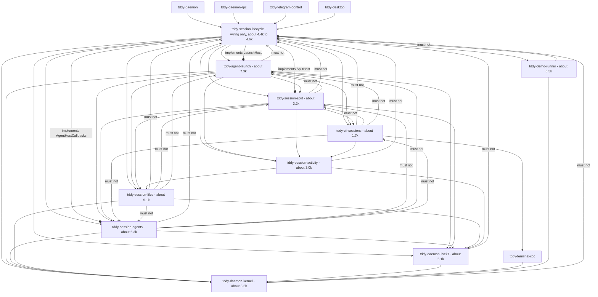
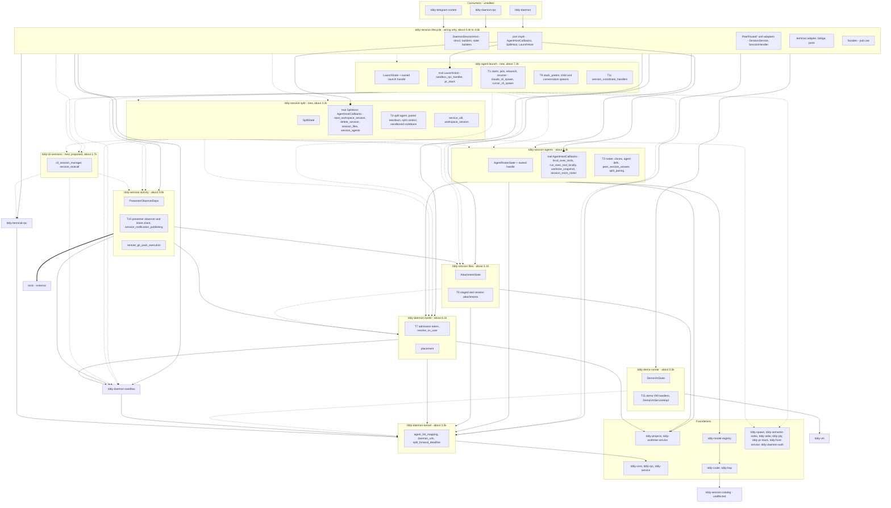

# Changeset: `tddy-session-lifecycle` becomes a wiring crate: every converted topic moves into its receiver with the restructure engine

**Date**: 2026-09-26
**Status**: 📋 Planned. Awaiting the developer's review of the edge approvals, D4, D5, D7, D12, D13, D14 and the `test_util` item
**Type**: Refactor (crate extraction by engine moves; no behaviour change)
**Stack**: `#carve` 21/21, branch `feature/carve/lifecycle-moves`, on top of `#carve` 20
(`feature/carve/lifecycle-ports-launch-start`). Plan label **17**, the move node

Nodes are named by their plan label: 16a–16e are the five in-place conversion nodes (`#carve`
16–20), and 17 (this) is the move node (`#carve` 21).

## Affected Packages

- **`tddy-session-lifecycle`**: left with only wiring: host construction and builders, the state
  builders, the three callback-trait impls, `PeerRouted*` and the port adapters, the
  `SessionHandler` / `SessionService` impls, the terminal adapter and bridge, and `pub use` facades.
  About 4.4k–4.6k production lines (D13).
- **New crates:** `tddy-agent-launch` (T1, T9, T1c), `tddy-session-split` (T4, `service_util`,
  `workspace_session`), `tddy-cli-sessions` (the PTY runtime; proposed, D4).
- **Existing receivers:** `tddy-session-agents` (T3), `tddy-session-files` (T8), `tddy-session-activity`
  (T10, the notification publishing half, `remote_git_pack_execution`), `tddy-daemon-livekit` (T7,
  `placement`), `tddy-daemon-kernel` (`agent_list_mapping`, `daemon_urls`), `tddy-demo-runner` (T11, D12).
- **Consumers** (`tddy-daemon-rpc`, `tddy-daemon`, `tddy-telegram-control`, `tddy-desktop`): **none is
  edited**, except a test that reads lifecycle source by path. They resolve through facades.

## Related Feature Documentation

None: this is a behaviour-preserving extraction. There is no PRD.

## Summary

At the start of this node, `tddy-session-lifecycle` holds about 20.3k production lines, of which
~15.3k are **movable topic modules**: 16a–16e converted every `impl DaemonSessionHost` method outside
the wiring into functions (or handle methods) over per-topic state and three callback ports, so no
topic module names the host, a wiring module, or a topic above it, and every one names its
foundations by their defining crate.

This node moves each topic into its receiver **with the `tddy-tools restructure` engine**
(`move_module_to_crate`, `move_cluster_to_crate`), bottom-up, one receiver per milestone, and leaves a
`pub use` facade for every public path. Lifecycle ends as a wiring crate that depends on its receivers
and implements their callback traits; **no receiver depends on lifecycle**, and every crate stays at or
under 10k production lines.

| Topic | Production lines | Destination |
|---|---:|---|
| T1 agent launch (M7a 3,742 + M7b 1,755) | 5,500 | `tddy-agent-launch` (new) |
| T9 stack spawns | 902 | `tddy-agent-launch` |
| T1c session coordinate handlers | 766 | `tddy-agent-launch` |
| CLI PTY runtime | 1,709 | `tddy-cli-sessions` (new, proposed, D4) |
| T4 split and sandboxed-codebase sessions | 2,485 | `tddy-session-split` (new) |
| `service_util`, `workspace_session` | 293 + 266 | `tddy-session-split` (D5) |
| T3 agents | 2,054 | `tddy-session-agents` |
| `LocalExecTools` | 231 | **stays** (D7-A), or `tddy-session-agents` (D7-B) |
| T8 attachments | 370 | `tddy-session-files` |
| T10 presenter, `session_notification_publishing`, `remote_git_pack_execution` | 265 + ~70 + 86 | `tddy-session-activity` |
| T7 admission token, `resolve_os_user`; `placement` | 58 + 155 | `tddy-daemon-livekit` |
| `agent_list_mapping`, `daemon_urls` | 48 | `tddy-daemon-kernel` |
| T11 demo VM | 313 | `tddy-demo-runner` (D12) |
| `test_util` | 366 | gated behind a feature, or moved to a testkit (open item) |
| Wiring | ~4,400 | **stays** |

## Background

`#carve` shrinks `tddy-session-lifecycle` into a wiring crate. `#carve` 14 destructured it in place;
`#carve` 15 moved the host-free leaves out and showed, in its port-move pilot, that the engine cannot
move a host method: its head, its host calls and its `self.clone()` hand-offs bind it to the host
(`E0116`). On 2026-09-26 the developer split the remaining work into an in-place conversion (16a–16e,
reviewed as a restructure and guarded by the baseline) and this move node, which carries the wiring
target.

What 16a–16e left, per topic:
- T11 over `DemoVmState`; T10 over `PresenterObserverDeps`; T7 as a free function of `config` and
  `session_admissions`; T8 over `AttachmentState` (16a);
- T3 over `tddy_session_agents::AgentRosterState` (12 fields) and its owned handle, with
  `trait AgentHostCallbacks` (16b);
- T4/SU/WS over `SplitState` and its handle, with `trait SplitHost: AgentHostCallbacks` (16c);
- T9, T1 and T1c over `LaunchState` (16 fields) and its handle, with `trait LaunchHost` =
  {`sandbox_rpc_handler`, `pr_stack`} (16d, 16e);
- the three traits each defined in their topic's ports module and implemented once on
  `DaemonSessionHost` in lifecycle's wiring ports file;
- the four mixed parent/child files re-parented (16a), so a module move no longer drags another
  topic's child with it.

**This node is one node** (decided 2026-09-26). It could be cut one receiver per node later, and that
cut is cheap: moves review faster than conversions.

## Responsibility

- Move every converted topic module into its receiver with the engine, bottom-up (see Scope), creating
  `tddy-agent-launch`, `tddy-session-split` and (D4) `tddy-cli-sessions`.
- Add exactly the approved crate edges, and no other ("New crate edges").
- Leave a `pub use` facade in lifecycle for every public `tddy_session_lifecycle::…` path that a
  consumer or a lifecycle test names, so no consumer is edited.
- Widen `pub(crate)` → `pub` where an item now crosses a crate, and nothing else.
- Keep lifecycle's callback-trait impls, state builders and handle builders; re-point their `use`
  lines to the receivers.
- Carry each topic's tests with it (inline `#[cfg(test)]` modules and the `connection_service/*_tests.rs`
  files that test only moved code); keep in lifecycle the integration suites that construct
  `DaemonSessionHost`.
- Decide and apply D7 (`LocalExecTools`), D12 (T11's receiver), D14 (unused dependencies) and the
  `test_util` item, as the developer rules.
- Hold the per-crate baseline (B7), and B1–B6.

## Boundaries

- **Moves only with the `tddy-tools restructure` engine.** No `git mv` of a module across crates. **A
  refusal means stop and ask**; no workaround, no hand move. Hand edits after a move are **build
  corrections only** (a `use` path, a `pub(crate)` → `pub`, a manifest line the engine missed), each
  with a todo filed per new cause in `docs/dev/todo/`.
- **No behaviour change.** Tests move with their code; the baseline is the per-crate sum (see
  "Baseline").
- **Public `tddy_session_lifecycle::…` paths stay reachable** through facades. Consumers are unedited
  (`tddy-daemon-rpc`, `tddy-daemon`, `tddy-telegram-control`, `tddy-desktop`), except a test that
  reads lifecycle source by path.
- **No receiver depends on lifecycle**, normal or dev, and **each receiver is ≤ 10k** production lines,
  with no file ≥ 500.
- **New edges need approval.** Every edge this node adds is in "New crate edges"; an edge not in the
  approved table is a stop-and-ask.
- **No conversion here.** A topic module that still names the host, a wiring module or an upward
  topic is a defect of 16a–16e: stop and report it upward, do not convert it here.
- **No deduplication, no functional refactor, no signature change** beyond visibility.
- **`PeerRouted*`, the port adapters, the terminal adapter and bridge stay** in lifecycle (the
  developer's 2026-09-25 ruling); moving them is a later node (D13).

## Dependencies

What each parent PR delivers that this PR consumes. These surfaces are **theirs to create**.
Implementing one here collides with the PR that owns it.

| Parent node | What it delivers | How this PR consumes it | This PR does NOT |
|---|---|---|---|
| **16e** `#carve` 20, lifecycle-ports-launch-start (`feature/carve/lifecycle-ports-launch-start`) | the start/resume half of T1 and T1c converted; `LaunchState` complete (16 fields); the `SessionHandler` / `SessionService` impls and the `SplitHost` impl on the launch handle; no `impl DaemonSessionHost` outside wiring | moves `launch_ports` and every T1/T9/T1c module into `tddy-agent-launch` | convert, re-sign or re-shape any launch function; add a `LaunchHost` method |
| **16d** `#carve` 19, lifecycle-ports-launch-spawns | `launch_ports` (`LaunchState`, launch handle, `trait LaunchHost`), T9 and the jail/CLI-spawn half of T1 converted, `impl StackParentHost` on the handle | moves them with the launch cluster | merge the three sandboxed launches (DRY #1 stays deferred) |
| **16c** `#carve` 18, lifecycle-ports-split | `split_ports` (`SplitState`, split handle, `trait SplitHost: AgentHostCallbacks`), T4/SU/WS converted, CLI imports re-pointed | moves the split cluster into `tddy-session-split` and the CLI cluster into `tddy-cli-sessions` | change `SplitHost` |
| **16b** `#carve` 17, lifecycle-ports-agents | `agent_host_callbacks` (`trait AgentHostCallbacks`, roster handle), T3 converted, `AgentRosterState` with 12 fields | moves T3 and `agent_host_callbacks` into `tddy-session-agents` | change `AgentRosterState` or `AgentHostCallbacks` |
| **16a** `#carve` 16, lifecycle-ports (#531) | T7, T8, T10, T11 converted; `peer_session_answer`, `daemon_urls`, `session_notification_publishing`; four files re-parented; the host-constructing split-context test in its own lifecycle file | moves each leaf topic into its receiver | re-parent or re-split a file |

## Draft PR contract

This is a mechanical move, the first of the pr-stack skill's two named exceptions ("a purely
mechanical rename / move / extraction with no behaviour change"). The draft is this plan. There are
no new failing tests. The contract is:
- the per-crate baseline (B7), re-run after every receiver milestone;
- the acceptance checks B1–B7 (see "Acceptance graph — after this node").

Those checks are `cargo tree`, the line counter, `git diff` and the test runs. They become a shape
test only if the developer reverses the 2026-09-25 "no shape tests" decision (D11).

## Green wave

**Wave:** after 16e.
**Greenable independently:** **no.** It moves only what 16a–16e made movable; a topic module that still
names the host cannot cross a crate (`E0116`), and the import shape A4 removed is exactly what makes
the engine refuse a move.
**Concurrent with:** nothing.
**Blocks:** nothing. This is the top of the stack.

Real dependency edges: `16a → 16b → 16c → 16d → 16e → 17`. Inside this node the receivers are
independent except in the order of their edges (kernel, livekit, files, activity, demo-runner, agents,
cli-sessions, split, agent-launch).

## Prerequisites

The scan followed `deferred-work/references/planning-cross-check.md`. No record in
`packages/tddy-session-lifecycle/docs/code-issues/` carries `Claimed by:`.

### Code issues (`packages/tddy-session-lifecycle/docs/code-issues/`)

| Item | Verdict | What this change does about it |
|---|---|---|
| All ten records on moved code (`complexity-cursor-cli-spawn-…`, `complexity-split-claude-cli-start-…`, `complexity-svc-paired-codebase-teardown-…`, `complexity-svc-resolve-listed-worktree-…`, `complexity-svc-resume-claude-cli-session-…`, `complexity-svc-resume-session-…`, `complexity-svc-spawn-split-agent-…`, `complexity-svc-start-sandboxed-claude-cli-session-…`, `complexity-svc-start-session-core-…`, `crap-svc-start-sandboxed-cursor-cli-session.md`) | ⚠ **During** | A move does not change them. Each record moves with its code: re-measured in the receiver, and re-filed under the receiver's `docs/code-issues/` (via `/analyze-code-issues` on each receiver), then deleted from lifecycle's |
| `complexity-daemon-rpc-handler-handle-rpc.md` | — Unrelated | Wiring that stays |

### TODOs (`docs/dev/todo/`)

| Item | Verdict | What this change does about it |
|---|---|---|
| [move-to-crate reads an import reaching the destination as an edge](../todo/2026-09-25-restructure-move-to-crate-reads-an-import-reaching-the-destination-as-an-edge.md) | ⛔ **Blocking**; mitigated by 16a–16e | Check A4 in every conversion node removed that shape. If the engine still refuses, stop and ask |
| [glob facade re-exports a name the origin shadows](../todo/2026-09-25-restructure-glob-facade-re-exports-a-name-the-origin-shadows.md), [destination's own extern name](../todo/2026-09-25-restructure-move-to-crate-leaves-the-destinations-own-extern-name.md), [follows a facade back](../todo/2026-09-25-restructure-move-to-crate-follows-a-facade-back-to-the-destination.md), [crate named only in a body path](../todo/2026-09-25-restructure-move-to-crate-misses-a-crate-named-only-in-a-body-path.md), [nested module's parent glob dangling](../todo/2026-09-25-restructure-move-to-crate-leaves-a-nested-modules-parent-glob-dangling.md), [test module's use lines](../todo/2026-09-25-restructure-move-to-crate-skips-the-use-lines-of-the-moved-files-test-module.md), [test binary cannot see through a glob facade](../todo/2026-09-25-restructure-test-binary-move-cannot-see-through-a-glob-facade.md) | ⚠ **During** | Known cross-crate move defects. Met as known build corrections; no new todo unless a new cause appears |
| [restructure defects from the first cross-crate move](../todo/2026-09-09-restructure-defects-from-the-first-cross-crate-move.md) (item 3: `pub(crate)` → `pub`) | ⚠ **During** | This node widens what crosses a crate, and nothing else |
| [check misses a module name the destination already has](../todo/2026-09-25-restructure-check-misses-a-module-name-the-destination-already-has.md) | ⚠ **During** | The only collision, `session_notifications`, was renamed in 16a (`session_notification_publishing`). None of the modules arriving in agents, files, livekit or kernel shares a name with theirs (near-misses: agents' `ports`, the kernel's `agent_tool_socket` and `peer_forwarding`) |
| [check misses a body path to a module staying behind](../todo/2026-09-25-restructure-check-misses-a-body-path-to-a-module-staying-behind.md) | ⚠ **During** | Checks A2/A4 of 16a–16e were the manual version; the compile gate catches the rest |
| [lifecycle modules to re-parent by hand](../todo/2026-09-24-lifecycle-modules-to-re-parent-by-hand.md) | ✅ resolved in 16a | — |
| [2026-09-09 untested complexity hotspots](../todo/2026-09-09-tddy-daemon-untested-complexity-hotspots.md) | ⚠ **During** | Re-measured per owning crate after the moves |
| [lifecycle files over the 400-line target](../todo/2026-09-24-lifecycle-files-over-the-400-line-target.md), [functions over 150](../todo/2026-09-24-lifecycle-functions-still-over-150-lines.md) | ⚠ **During** | Entries move with their files; re-homed to the receiving crate's name at wrap |
| [restructure verify cannot exit zero for an extract module](../todo/2026-09-18-restructure-verify-cannot-exit-zero-for-an-extract-module.md) | ⚠ **During** | `verify --against` accounted by hand per receiver |

**Packages without `docs/code-issues/`:** `tddy-session-agents` and the three new crates. Run
`/analyze-code-issues` on each once code lands there.

## Scope

Bottom-up, one receiver per milestone. Each: engine plan → `check` → `apply` → build corrections →
per-crate baseline → B-checks for that receiver.

- [ ] **R0 approvals**: the edge table, D4, D5, D7, D12, D13, D14 and `test_util` decided; baselines
  recorded on 16e's tip for lifecycle and every receiver
- [ ] **R1 `tddy-daemon-kernel`**: `agent_list_mapping`, `daemon_urls` (`move_module_to_crate`); zero new edges
- [ ] **R2 `tddy-daemon-livekit`**: T7 (the admission-token module, the `resolve_os_user` module; each
  moved individually, nested under wiring's builders) and `placement` (`move_module_to_crate`); zero new edges
- [ ] **R3 `tddy-session-files`**: T8's two modules; new edge `tddy-session-files` → `tddy-daemon-livekit`
- [ ] **R4 `tddy-session-activity`**: T10 cluster (`presenter_observer_spawn`, `presenter_observer_task`,
  `presenter_intent_client`), `session_notification_publishing`, `remote_git_pack_execution`; `tonic`
  (approved)
- [ ] **R5 `tddy-demo-runner`** (D12): T11 cluster (`demo_vm_coordinate_handlers`, `activity_hub`,
  `DemoVmServiceImpl`); `demo_vm_entry` stays; new edges → kernel, core, rpc, service
- [ ] **R6 `tddy-session-agents`**: T3 cluster + `agent_host_callbacks` (+ `LocalExecTools` and
  `ExecToolRoute` under D7-B, with their four edges)
- [ ] **R7 `tddy-cli-sessions`** (new, D4): `cli_session_manager` (anchor) with its 9 children and
  `session_toolcall` (`move_cluster_to_crate`); facade for `tddy-desktop`'s
  `tddy_session_lifecycle::cli_session_manager::CliSessionManager`
- [ ] **R8 `tddy-session-split`** (new): `split_ports`, the T4 cluster, `service_util`, `workspace_session`;
  facades for `resolve_tddy_tools_path`, `service_util`'s two `pub use`, `workspace_session`
- [ ] **R9 `tddy-agent-launch`** (new): `launch_ports`, the T1/T9/T1c cluster; facades for
  `effective_spawn_branch`, `connection_service::*` and the rest daemon-rpc names
- [ ] **R10 lifecycle's manifest**: drop dependencies nothing names any more, as D14 rules; `test_util`
  as ruled
- [ ] **B1–B7** pass (see "Acceptance graph — after this node")
- [ ] `restructure verify --against <16e tip>` per receiver: every statement accounted for

**Status indicators**: `[ ]` not started · `[~]` in progress · `[x]` complete ✅

## Technical changes

### State A (16e's tip)

`tddy-session-lifecycle` at about 20.3k–20.4k production lines, 110+ production files. Every topic
module is host-free; no `impl DaemonSessionHost` block outside wiring. The receivers at their
`#carve` 15 sizes: `tddy-session-agents` 4,132 (+ the two fields), `tddy-session-files` 4,716,
`tddy-session-activity` 2,541, `tddy-daemon-livekit` 5,863, `tddy-daemon-kernel` 3,409,
`tddy-demo-runner` 156.

### State B (after this node)

Lifecycle is wiring only (~4.4k–4.6k, D13). The receivers are as in "Receiver budget". The crate graph
is "Final design" below.

### What moves, by engine operation

The columns are:
- **This node**: what this node does. It names the state the body reads and the callback methods it
  calls. "No change" means the file is already free of the host.
- **Node 17**: the engine operation in the move node (`#carve 21/21`).
- **Blockers**: what stands in the way.

Abbreviations: **LS** `LaunchState`, **AR** `AgentRosterState` (with its owned handle), **SS**
`SplitState`, **AS** `AttachmentState`; **LH** `LaunchHost`, **AHC** `AgentHostCallbacks`, **SH**
`SplitHost`. Paths are under `packages/tddy-session-lifecycle/src/`, and `cs/` is
`connection_service/`. Line counts are production lines at `9d464a8e` (any line of a `src/` file
outside an inline `#[cfg(test)] mod x { … }` block; `connection_service/*_tests.rs` files count as
test code).

| Topic and files | Lines | Node 17 operation | Destination | Blockers |
|---|---:|---|---|---|
| `agent_list_mapping.rs`, `daemon_urls.rs` | 26 + 22 | `move_module_to_crate` | `tddy-daemon-kernel` | none: zero edges |
| T7: `svc_host_builders/first_admission_token.rs`, the `resolve_os_user` module | 46 + 12 | `move_module_to_crate`, each individually (nested under wiring's builders) | `tddy-daemon-livekit` | public facade `connection_service::resolve_os_user` |
| `cs/placement.rs` | 155 | `move_module_to_crate` | `tddy-daemon-livekit` | public facade `connection_service::*` (daemon-rpc tests) |
| T8: `svc_materialize_staged_attachment.rs`, `session_attachment_materialization.rs` | 245 + 125 | `move_module_to_crate` | `tddy-session-files` | new edge session-files → `tddy-daemon-livekit` (`PeerRoute`, `local_instance_id_for_config`) |
| T10: `presenter_observer_spawn.rs`, `presenter_observer_task.rs`, `presenter_intent_client.rs` | 47 + 120 + 98 | `move_cluster_to_crate` | `tddy-session-activity` | `tonic` on activity (approved) |
| `session_notification_publishing.rs` | ~70 | `move_module_to_crate`; lifecycle's `session_notifications` facade (~26) keeps `crate::session_notifications::X` | `tddy-session-activity` | name collision avoided by 16a's rename |
| `remote_git_pack_execution.rs` | 86 | `move_module_to_crate` | `tddy-session-activity` | none: zero edges |
| T11: `demo_vm_coordinate_handlers.rs`, `activity_hub.rs`, `DemoVmServiceImpl` (from `svc_demo_vm_ports.rs`) | 241 + 19 + 53 | `move_cluster_to_crate` | `tddy-demo-runner` (D12) | new edges (D12); `tddy-daemon/src/runtime.rs` names `DemoVmServiceImpl` and `demo_vm_entry()`: facade kept, `demo_vm_entry` stays |
| T3: `agent_host_callbacks`, `svc_provision_agent_clone`, `svc_ensure_session_room_for_agents` (T3 part), `svc_start_hosted_agent_clone`, `svc_resolve_listed_worktree` (T3 part) + `session_dir_lookup` + `session_room_opening`, `svc_turn_end_reporter`, `agent_roster` (T3 part), `seeded_clone_guard`, `seed_codebase`, `roster_replacement`, `peer_session_answer` | 2,054 | `move_cluster_to_crate` | `tddy-session-agents` | #526's pilot import refusal (A4 mitigated) |
| CLI: `cli_session_manager.rs` + 9 children, `session_toolcall.rs` | 1,709 | `move_cluster_to_crate` (anchor `cli_session_manager`) | `tddy-cli-sessions` (D4) | new crate; `tddy-desktop` facade |
| T4/SU/WS: `split_ports`, `svc_spawn_split_agent` + teardown, `split_claude_cli_start`, split context (T4 part), `svc_start_sandboxed_codebase_session`, `split_start`, `svc_resolve_tddy_tools_path`, `split_session` + 2 children, the extracted `resume_split_wiring` and `provision_workspace_tool_sandbox` modules, `attached_initial_prompt`, T4's `hooks_and_urls` group, `service_util`, `workspace_session` | 3,044 | `move_cluster_to_crate` | `tddy-session-split` (new) | facades (`resolve_tddy_tools_path`, `service_util`, `workspace_session`) |
| T1/T9/T1c: `launch_ports`, the M7a and M7b files, the T9 files, `session_coordinate_handlers` + 2 children | 7,168 | `move_cluster_to_crate` | `tddy-agent-launch` (new) | facades (`effective_spawn_branch`, `connection_service::*`, `claude_cli_session`) |

### Receiver budget

The projection is the topic lines, plus about 1 % for module headers, plus the state and trait
definitions. `#carve` 15's whole-module moves came in at ~1:1 (T5 −960/+968, livekit −455/+454).

| Receiver | Production lines now | Arrives | State/port defs (est.) | Projected | ≤ 10k |
|---|---:|---:|---:|---:|---|
| `tddy-session-agents` | 4,132 | 2,054 (+231 if D7-B) | ~80 | **~6.3k** (~6.5k) | ✅ |
| `tddy-session-split` (new) | 0 | 3,044 | ~120 | **~3.2k** | ✅ |
| `tddy-agent-launch` (new) | 0 | 7,168 | ~150 | **~7.3k** | ✅, 2.7k headroom |
| `tddy-cli-sessions` (new, proposed) | 0 | 1,709 | 0 | **~1.7k** | ✅ |
| `tddy-session-files` | 4,716 | 370 | ~25 | **~5.1k** | ✅ |
| `tddy-session-activity` | 2,541 | ~421 | ~15 | **~3.0k** | ✅ |
| `tddy-daemon-livekit` | 5,863 | 213 | 0 | **~6.1k** | ✅ |
| `tddy-daemon-kernel` | 3,409 | ~53 (48 + `split_forward_deadline` if it follows `PEER_FORWARD_TIMEOUT`) | 0 | **~3.5k** | ✅ |
| `tddy-demo-runner` | 156 | 313 | ~20 | **~0.5k** | ✅ |
| `tddy-vm` (the alternative for T11) | 7,233 | 313 | ~20 | ~7.6k | ✅, but not recommended (D12) |

**If D4 is declined and the PTY runtime folds into split,** split becomes ~4.9k (✅). Folding it into
agent-launch instead (~9.0k) is **impossible**: split → launch is a cycle.

### Lifecycle's projected end state

| What stays | Lines |
|---|---:|
| Ports: `svc_activity_ports` 384, session-agents ports 113 + 278 + 277, session-files ports 200 + 358, `svc_session_lifecycle_ports` 166, `svc_terminal_ports` 176, `demo_vm_entry` 8 | 1,960 |
| Builders: `svc_host_builders` 367, `rpc_activity` 8, `handler_state` 114 | 489 |
| Host struct and `mod` declarations: `connection_service.rs` | 490 |
| `lib.rs` 158, `handler` 61, `service` 101, `daemon_rpc_handler` 165, `rpc_families` 66 | 551 |
| Terminal adapter 213 and bridge 59 | 272 |
| Routing delegations and `context_globs` 157, `local_exec_tool_dispatch` 25, `agent_roster` port impls 44, `svc_shut_down_children` 32, `family_proto_bridge` 14, facades (`session_agent_clone` 31, `pr_stack_rpc` 7, `claude_cli_session` 6) | 316 |
| **Wiring as it was at `#carve` 15's close** | **4,078** |
| + `session_notifications` facade residue | ~26 |
| + 16a–16e's new wiring: state builders (~90), three callback-trait impls (~110), delegators (~70), handle plumbing (~30) | ~300 |
| + `LocalExecTools` if D7-A keeps it | 231 |
| − `test_util` gated or moved to a testkit | −366 → 0 |
| + this node's facade lines | ~50 |
| **Projected end** | **~4.4k** (D7-B) to **~4.6k** (D7-A) |

**The ~3.4k target cannot be reached with `PeerRouted*` staying** (the developer's ruling of
2026-09-25). `PeerRouted*` behind a forwarding port (≈ −0.8k → ~3.6k–3.8k) plus the port adapters as
receiver-side impls (−277 → ~3.3k–3.5k) would reach it; that is D13.

### New crate edges (all need approval unless marked)

The cycle check ran over `cargo metadata --offline` at `9d464a8e`: the workspace's normal-dependency
graph, with every edge below added. **The graph stays acyclic.** Each edge was checked individually:
none has its target reaching its source. Re-run at R0 on 16e's tip.

| From | To | Status |
|---|---|---|
| `tddy-session-lifecycle` | `tddy-agent-launch`, `tddy-session-split` | **new crates planned in `#carve` 15** (plan approved); edges need approval with them |
| `tddy-session-lifecycle` | `tddy-cli-sessions` | **needs approval** (new crate, D4) |
| `tddy-agent-launch` | `tddy-session-split`, `tddy-cli-sessions`, `tddy-session-agents`, `tddy-session-files`, `tddy-session-activity`, `tddy-daemon-livekit`, `tddy-daemon-kernel`, `tddy-daemon-sandbox`, `tddy-spawn`, `tddy-host-service` (`HostSessionService`), `tddy-pr-stack` (`LaunchHost::pr_stack`'s type), `tddy-core`, `tddy-projects`, `tddy-worktree-service`, `tddy-semantic-index`, `tddy-stdio`, `tddy-sandbox`, `tddy-discovery`, `tddy-workflow-recipes`, `tddy-task`, `tddy-rpc`, `tddy-service` (22) | **needs approval**. All are already lifecycle's, so no binary's graph grows |
| `tddy-session-split` | `tddy-cli-sessions`, `tddy-session-agents`, `tddy-session-files`, `tddy-session-activity`, `tddy-daemon-livekit`, `tddy-daemon-kernel`, `tddy-daemon-sandbox`, `tddy-daemon-auth` (`SessionTokens`), `tddy-github`, `tddy-livekit`, `tddy-core`, `tddy-projects`, `tddy-worktree-service`, `tddy-semantic-index` (`service_util`), `tddy-sandbox`, `tddy-sandbox-recipes`, `tddy-discovery`, `tddy-workflow-recipes`, `tddy-task`, `tddy-rpc`, `tddy-service` (21) | **needs approval** |
| `tddy-cli-sessions` | `tddy-terminal-rpc`, `tddy-session-activity` (`signal_pid`), `tddy-daemon-sandbox` (`SessionScopedResource`), `tddy-stdio`, `tddy-pty`, `tddy-livekit`, `tddy-core`, `tddy-task`, `tddy-rpc`, `tddy-service` (10) | **needs approval** |
| `tddy-session-files` | `tddy-daemon-livekit` | **needs approval** |
| `tddy-demo-runner` | `tddy-daemon-kernel`, `tddy-core`, `tddy-rpc`, `tddy-service` | **needs approval** (D12) |
| `tddy-session-agents` | `tddy-daemon-sandbox`, `tddy-sandbox-runner`, `tddy-tool-engine`, `tddy-task` | **needs approval, only under D7-B** |
| `tddy-session-activity` | `tonic` (external) | ✅ approved (2026-09-25, for T10) |
| `tddy-session-agents` | none for T3: `tddy-spawn`, the pilot's blocker, is not needed (`ensure_project_available_for_start` is T1) | — |
| `tddy-daemon-livekit`, `tddy-daemon-kernel` | none: `placement`, T7, `agent_list_mapping` and `daemon_urls` name only what they already have | — |
| any receiver | `tddy-session-lifecycle` | **must not exist**, normal or dev |

**The `tddy-bsp` note.** `tddy-session-agents` → `tddy-model-registry` (approved) → `tddy-coder` →
`tddy-bsp`, so every crate above agents carries `tddy-coder` and `tddy-bsp` in its graph. Lifecycle
already does, so no binary grows. **Lifecycle declares seven normal dependencies that nothing in
`src/` or `tests/` names** (`tddy-coder`, `tddy-bsp`, `tddy-demo-runner`, `tddy-lsp`,
`tddy-lsp-executor`, `tddy-screen-sharing`, `tddy-actions`); `tddy-connectrpc` and `tddy-session-sync`
are named only by tests. See D14.

### Callers and visibility

| | |
|---|---|
| External importers | none edited. Every path they name resolves through a lifecycle facade: `connection_service::*` (daemon-rpc), `cli_session_manager::CliSessionManager` (`tddy-desktop`), `DemoVmServiceImpl` and `demo_vm_entry()` and `workspace_session::resolve_worktree_root_for_session` (`tddy-daemon/src/runtime.rs`), `service_util`'s two, `resolve_tddy_tools_path`, `effective_spawn_branch`, `session_notifications::X` |
| Facade | one named `pub use` per public path moved; no new glob facade (the glob-facade todos) |
| Visibility | `pub(crate)` → `pub` on items that now cross a crate, and nothing else; each listed in the commit |
| Lifecycle's wiring | its `impl AgentHostCallbacks / SplitHost / LaunchHost for DaemonSessionHost`, the state and handle builders, and the adapters re-point their `use` lines to the receivers |

### Baseline

The tests move with their code, so the baseline is the **per-crate sum**. Record on 16e's tip, before
R1:

```bash
./dev cargo test -p tddy-session-lifecycle --no-fail-fast -- --test-threads=1 \
  --skip sandboxed_bash_pty_action_streams_output
./dev cargo test -p <receiver> --no-fail-fast -- --test-threads=1   # each existing receiver
```

Lifecycle's expected: **562 passed, 22 failed, 1 ignored**, the same 22 by name. The flaky
`session_room_acceptance::the_first_connect_makes_the_sessions_terminal_drivable_over_livekit` passes
when re-run alone. The 22 known red (macOS):

| Suite | Known red (macOS) | Cause |
|---|---|---|
| `sandbox_behavior_acceptance` (5) | `sandboxed_session_streams_demo_tui_dimensions_in_terminal`, `sandboxed_session_spawn_manifest_records_session_channel_egress`, `sandboxed_session_relays_claude_llm_egress_via_session_channel`, `sandboxed_session_denies_direct_outbound_network_from_jail`, `sandboxed_session_child_is_alive_after_demo_tui_start` | `sandbox RPC bridge not installed — runtime must call install_sandbox_rpc_bridge` |
| `sandboxed_claude_cli_acceptance` (5) | `sandboxed_claude_cli_start_persists_metadata_and_empty_livekit`, `sandboxed_claude_cli_connect_session_returns_empty_livekit`, `sandboxed_claude_cli_terminal_io_round_trips`, `sandboxed_claude_cli_tool_exec_via_ipc_reads_host_worktree`, `sandboxed_claude_cli_start_wires_specialized_agents_env_and_metadata` | same |
| `sandboxed_cursor_cli_acceptance` (4) | `sandboxed_cursor_cli_start_persists_metadata_and_empty_livekit`, `sandboxed_cursor_cli_connect_session_returns_empty_livekit`, `sandboxed_cursor_cli_terminal_io_round_trips`, `sandboxed_cursor_cli_start_wires_specialized_agents_env_and_metadata` | same |
| `sandboxed_session_lifecycle_acceptance` (2) | `delete_sandbox_session_stops_child_and_removes_directory`, `resume_sandbox_session_respawns_and_updates_pid` | same |
| `session_sync_livekit_acceptance` (6) | `mirrors_a_file_the_agent_wrote_without_a_commit`, `mirrors_an_edit_to_an_existing_file`, `removes_a_file_the_agent_deleted`, `mirrors_binary_content_byte_for_byte`, `follows_the_session_head_when_the_agent_commits`, `restores_a_mirror_that_was_corrupted_by_hand` | `tddy-remote-git-repo is not built`, then `Once instance has previously been poisoned` |

These 22 live in lifecycle's `tests/` integration suites, which construct `DaemonSessionHost`; they are
expected to **stay** in lifecycle. The tests that move are inline `#[cfg(test)]` modules and the
`connection_service/*_tests.rs` files that exercise only moved code.

**After every receiver milestone:** for lifecycle plus every touched receiver, passed(after) summed =
passed(before) summed; failed = the same 22 by name (in whichever crate they now run); ignored = 1.
Each moved test's name appears once, in its new crate. Scope each run to the touched crates, and read
whole-workspace health from CI (`scripts/ci-status.sh --failures`), including Linux's sandboxed
suites, which exercise the paths macOS cannot.

## Acceptance graph — after this node

Crate level: lifecycle wiring-only. Edge legend: `-->` depends on; `--o` lifecycle implements the
receiver's callback trait; `--x` **must not exist** (acceptance).



### Final design, the same end state with each crate's contents

Edge legend: `-->` existing; `==>` new and **approved**; `-.->` new and **needs approval**; `--o`
"implements" (lifecycle's host implements a receiver's callback trait). There is deliberately **no
edge into `tddy-session-lifecycle` from any receiver**.



`activity ==> tonic` is the one approved new edge, and `tonic` is external. Lines inside the boxes are
the budget projections above.

### Acceptance criteria for node 17, and how each is checked

| # | Criterion | How to check |
|---|---|---|
| B1 | No receiver depends on lifecycle, normal or dev | `cargo tree -i tddy-session-lifecycle -e normal,dev --workspace` lists only `tddy-daemon`, `tddy-daemon-rpc`, `tddy-desktop`, `tddy-telegram-control` (and the existing dev users `tddy-model-registry`, `tddy-tool-engine`, `tddy-worktree-service`) |
| B2 | The edge set is the approved table, and nothing more | the new crates' and each touched receiver's `Cargo.toml` diffed against "New crate edges" as approved |
| B3 | No reverse edge between receivers: split ↛ agent-launch; agents ↛ split / agent-launch / cli-sessions; cli-sessions ↛ split / agent-launch / agents; files ↛ agents / split / agent-launch | `cargo tree -p <receiver> -e normal,dev` per receiver, grepped for the forbidden names |
| B4 | Every receiver ≤ 10k production lines, and no file ≥ 500 | the counter (any line of a `src/` file outside an inline `#[cfg(test)] mod x { … }` block; `*_tests.rs` modules declared behind `#[cfg(test)]` count as test), run per crate |
| B5 | Lifecycle meets the wiring definition (no function beyond construction, delegation and port impls) at the size the developer restates in D13 | counter, plus a review of the remaining files against the "stays" table |
| B6 | Every public `tddy_session_lifecycle::…` path resolves, and consumers are unedited | `git diff <16e tip> -- packages/tddy-daemon-rpc packages/tddy-daemon packages/tddy-telegram-control packages/tddy-desktop` is empty (except a source-by-path test, listed); `cargo check --all-targets` clean on the first three (`tddy-desktop` on CI) |
| B7 | Baseline, moved tests accounted | lifecycle's count falls by exactly the tests that moved, and each receiver's rises by the same, same names; the 22 known failures unchanged by name; 1 ignored |

## Decisions & trade-offs

Settled by the developer (2026-09-26), carried here:
- The work is cut into five in-place conversion nodes, 16a–16e (`#carve` 16–20), and **this one move
  node** (`#carve` 21). **This node could be cut one receiver per node later** (R1–R9 are already
  independent milestones); it stays one node for now.
- Engine moves only across crates, and a refusal means stop and ask.
- New edges need approval. No receiver may depend on lifecycle.
- Each crate stays at or under 10k. Consumers stay unedited. Facades are kept.
- `AgentHostCallbacks` = {`worktree_snapshot`, `run_exec_tool_locally`, `local_exec_tools`} is approved.
- `PeerRouted*` stays.
- `tddy-session-activity` → `tonic` is approved (2026-09-25).

### Open decisions this node needs

- **Edge approvals (all of them).** Every row marked "needs approval" in "New crate edges":
  lifecycle → agent-launch, split, cli-sessions; agent-launch's 22; split's 21; cli-sessions' 10;
  session-files → daemon-livekit; demo-runner's 4 (D12); session-agents' 4 (only under D7-B). Nothing
  is added until approved.
- **D1 (carried, as settled for 16a–16e).** Under Recipe B the per-topic handle types move with their
  methods (`impl` blocks move with the type, no `E0116`); under Recipe A the free functions and state
  structs move. Either way this node only moves them.
- **D4: a new crate `tddy-cli-sessions`** for the PTY runtime (1,709 lines).
  - Why: split names `CliSessionManager` and `PtyHandle`, and split sits below launch.
  - The alternative: fold the runtime into `tddy-session-split` (~4.9k). Simpler, but a
    split-session crate owning the daemon's PTY runtime is a misleading home.
  - `tddy-terminal-rpc` is not an option: it would drag the sandbox stack and activity into
    `tddy-coder`.
  - **Recommended: the new crate.**
- **D5: `service_util` and `workspace_session` → `tddy-session-split`.** Both are used by launch above
  and T4; `split_start` names `PairedAgentSession`. The alternative home for `service_util` is
  `tddy-worktree-service`, which would gain `tddy-semantic-index` and `chrono`. **Recommended: split.**
- **D7: `LocalExecTools`.**
  - **A (the default under the approved callbacks):** it stays in lifecycle (+231 wiring).
  - **B:** it moves to `tddy-session-agents`, taking `ExecToolRoute` with it. Agents gains
    `tddy-daemon-sandbox`, `tddy-sandbox-runner`, `tddy-tool-engine` and `tddy-task`, and the
    `local_exec_tools` and `run_exec_tool_locally` callbacks become unnecessary.
  - **Recommended: A** (no new edges; B is a trait change as well as a move).
- **D11: shape tests.** B1–B7 are commands and counts by default. A shape test would make B1/B3 a
  regression CI catches. Recommended: a `cargo tree`-based CI check for B1 is worth a follow-up todo.
- **D12: T11's receiver.** `tddy-demo-runner` (156 lines today) needs `tddy-daemon-kernel`, `tddy-core`,
  `tddy-rpc` and `tddy-service`. `tddy-vm` (7.2k, a low-level crate that `tddy-vm-build` and
  `-testkit` consume) would push daemon-kernel into their graphs. **Recommended: demo-runner.**
- **D13: the size target.** The code says **~4.4k–4.6k** with `PeerRouted*` staying. ~3.4k needs
  `PeerRouted*` behind a forwarding port (→ ~3.6k–3.8k) plus the adapters as receiver-side impls
  (→ ~3.3k–3.5k). The choice: accept ~4.5k as this node's target (B5), or approve those two moves as a
  later node. **Recommended: accept ~4.5k here.**
- **D14: lifecycle's unused dependencies.** Seven unused normal dependencies (`tddy-coder`, `tddy-bsp`,
  `tddy-demo-runner`, `tddy-lsp`, `tddy-lsp-executor`, `tddy-screen-sharing`, `tddy-actions`), two
  test-only (`tddy-connectrpc`, `tddy-session-sync`); after the moves, lifecycle may also no longer
  need `tddy-vm`, `tddy-semantic-index`, `tddy-stdio` and others. The choice: drop them here (R10),
  file a todo, or leave them. **Recommended: drop them here** — it is manifest hygiene, verified by the
  compile gate, and the moves already rewrite the manifest.
- **`test_util` (366 lines; no D-number in the master plan).** Gate it behind a feature, or move it to a
  testkit crate. It counts toward B5's size. **Recommended: a `test-util` feature**, since its users are
  lifecycle's own integration suites.
- **D8 alternative (closed in 16a).** 16a re-parented the four mixed files; if the developer had
  declined, this node would move each nested module individually, which is untested for a parent that
  itself moves.

## Validation results

(Empty. Filled per receiver milestone during `/green`.)

## TODO

- [x] Create changeset: this document
- [ ] USER REVIEW: the edge approvals, D4, D5, D7, D12, D13, D14, `test_util`
- [ ] Rebase onto 16e once it is green
- [ ] R0: re-run the cycle check on 16e's tip; record the per-crate baselines
- [ ] R1–R10
- [ ] `/analyze-code-issues` on every receiver that gained code
- [ ] `/validate-changes`
- [ ] `/pr-wrap`
- [ ] Wrap documentation (`/wrap-context-docs`)

## Final Checklist

Tasks executed at wrap:

**Node 17 acceptance**
- [ ] B1: `cargo tree -i tddy-session-lifecycle -e normal,dev --workspace` shows no receiver
- [ ] B2: the edge set matches the approved table, and nothing more
- [ ] B3: no reverse edge between receivers (`cargo tree` per receiver)
- [ ] B4: every receiver ≤ 10k, and no file ≥ 500 (counter per crate)
- [ ] B5: lifecycle meets the wiring definition at the target D13 restates
- [ ] B6: public paths resolve; consumers unedited (`git diff` empty; `cargo check --all-targets` clean)
- [ ] B7: per-crate baseline with moved tests accounted; the 22 known failures unchanged by name
- [ ] Every hand edit after an engine move is a build correction, and each new cause has a todo

**Documentation**
- [ ] `packages/tddy-session-lifecycle/docs/`: wiring-only layout, the facades (via the changeset workflow)
- [ ] `docs/` for each new crate (`tddy-agent-launch`, `tddy-session-split`, `tddy-cli-sessions`) and each receiver that gained a topic
- [ ] Code-issue records re-homed to their receivers; lifecycle's deleted once re-filed
- [ ] Release-note entry with the before and after numbers per crate

## Successor PRs

None. This is the top of the `#carve` stack.
