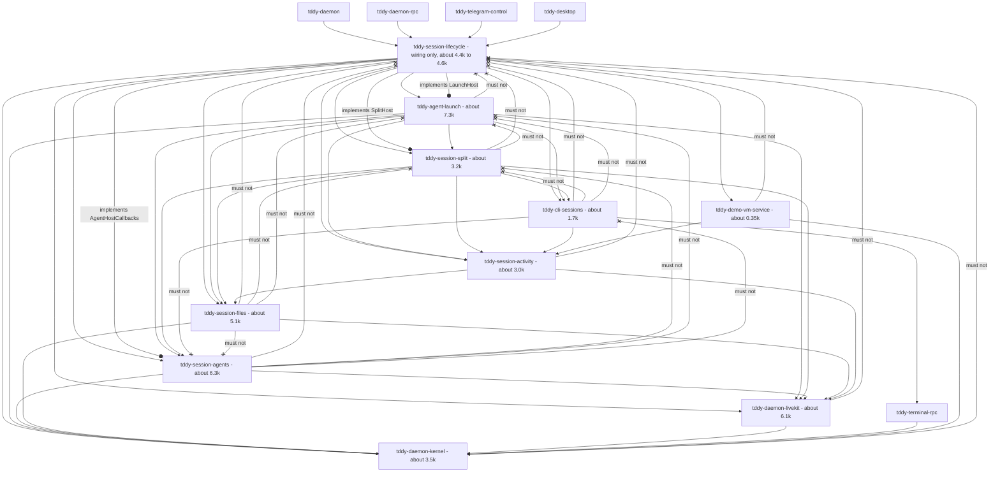
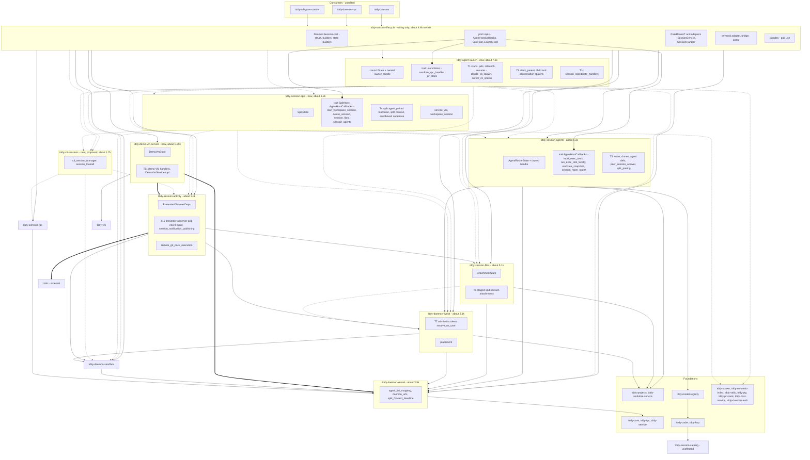

# Changeset: `tddy-session-lifecycle` becomes a wiring crate: every converted topic moves into its receiver with the restructure engine

**Date**: 2026-09-26
**Status**: Implemented on the branch, CI green on `1712a9305`: R1-R10 (R5 as R5a/R5b) done; B1-B4, B6, B7 pass (B4 with the approved `cursor_cli_spawn.rs` deferral); **B5 is ~1k over its target and `test_util` is not gated, awaiting the developer's call**. The two tests the final gates found broken by path were fixed in `1712a9305`. The developer's rulings of 2026-10-08 are recorded under Decisions and "Developer overrides"
**Type**: Refactor (crate extraction by engine moves; no behaviour change)
**Stack**: `#carve` 21/21, branch `feature/carve/lifecycle-moves`, on top of `#carve` 20
(`feature/carve/lifecycle-ports-launch-start`). Plan label **17**, the move node

Nodes are named by their plan label: 16a–16e are the five in-place conversion nodes (`#carve`
16–20), and 17 (this) is the move node (`#carve` 21).

## Affected Packages

- **`tddy-session-lifecycle`**: left with only wiring: host construction and builders, the state
  builders, the three callback-trait impls, `PeerRouted*` and the port adapters, the
  `SessionHandler` / `SessionService` impls, the terminal adapter and bridge, and `pub use` facades.
  Target about 4.4k–4.6k production lines (D13); **as landed 5,587** (about 5.5k; `test_util`, 366 lines, is not gated, see B5
  and [the todo](../todo/2026-10-08-session-lifecycle-test-util-is-not-gated-behind-a-test-util-feature.md)).
- **New crates:** `tddy-agent-launch` (T1, T9, T1c), `tddy-session-split` (T4, `service_util`,
  `workspace_session`), `tddy-cli-sessions` (the PTY runtime; proposed, D4), `tddy-demo-vm-service` (T11; D12 as changed 2026-10-08).
- **Existing receivers:** `tddy-session-agents` (T3), `tddy-session-files` (T8), `tddy-session-activity`
  (T10, the notification publishing half, `remote_git_pack_execution`), `tddy-daemon-livekit` (T7,
  `placement`), `tddy-daemon-kernel` (`agent_list_mapping`, `daemon_urls`). `tddy-demo-runner` is **not** a receiver: T11 went to the new `tddy-demo-vm-service`.
- **Consumers** (`tddy-daemon-rpc`, `tddy-daemon`, `tddy-telegram-control`, `tddy-desktop`): resolve through facades and
  are not edited, **except two `tddy-daemon` call sites** (`src/runtime.rs`, `tests/local_token_uds.rs`) that follow the approved
  `DemoVmServiceImpl::new(state)` signature change (see "Developer overrides, 2026-10-08").

## Related Feature Documentation

None: this is a behaviour-preserving extraction. There is no PRD.

## Summary

At the start of this node, `tddy-session-lifecycle` holds about 20.3k production lines, of which
~15.3k are **movable topic modules**: 16a–16e converted every `impl DaemonSessionHost` method outside
the wiring into functions (or handle methods) over per-topic state and three callback ports, so no
topic module names the host, a wiring module, or a topic above it, and every one names its
foundations by their defining crate.

This node moves each topic into its receiver **with the `tddy-tools restructure` engine**
(`move_module_to_crate`, `move_cluster_to_crate`), bottom-up, one receiver per milestone, and leaves a
`pub use` facade for every public path. Lifecycle ends as a wiring crate that depends on its receivers
and implements their callback traits; **no receiver depends on lifecycle**, and every crate stays at or
under 10k production lines.

| Topic | Production lines | Destination |
|---|---:|---|
| T1 agent launch (M7a 3,742 + M7b 1,755) | 5,500 | `tddy-agent-launch` (new) |
| T9 stack spawns | 902 | `tddy-agent-launch` |
| T1c session coordinate handlers | 766 | `tddy-agent-launch` |
| CLI PTY runtime | 1,709 | `tddy-cli-sessions` (new, proposed, D4) |
| T4 split and sandboxed-codebase sessions | 2,485 | `tddy-session-split` (new) |
| `service_util`, `workspace_session` | 293 + 266 | `tddy-session-split` (D5) |
| T3 agents | 2,054 | `tddy-session-agents` |
| `LocalExecTools` | 231 | **stays** (D7-A), or `tddy-session-agents` (D7-B) |
| T8 attachments | 370 | `tddy-session-files` |
| T10 presenter, `session_notification_publishing`, `remote_git_pack_execution` | 265 + ~70 + 86 | `tddy-session-activity` |
| T7 admission token, `resolve_os_user`; `placement` | 58 + 155 | `tddy-daemon-livekit` |
| `agent_list_mapping`, `daemon_urls` | 48 | `tddy-daemon-kernel` |
| T11 demo VM | 313 | `tddy-demo-vm-service` (new; D12 as changed 2026-10-08) |
| `test_util` | 366 | gated behind a feature, or moved to a testkit (open item) |
| Wiring | ~4,400 | **stays** |

## Background

`#carve` shrinks `tddy-session-lifecycle` into a wiring crate. `#carve` 14 destructured it in place;
`#carve` 15 moved the host-free leaves out and showed, in its port-move pilot, that the engine cannot
move a host method: its head, its host calls and its `self.clone()` hand-offs bind it to the host
(`E0116`). On 2026-09-26 the developer split the remaining work into an in-place conversion (16a–16e,
reviewed as a restructure and guarded by the baseline) and this move node, which carries the wiring
target.

What 16a–16e left, per topic:
- T11 over `DemoVmState`; T10 over `PresenterObserverDeps`; T7 as a free function of `config` and
  `session_admissions`; T8 over `AttachmentState` (16a);
- T3 over `tddy_session_agents::AgentRosterState` (12 fields) and its owned handle, with
  `trait AgentHostCallbacks` (16b);
- T4/SU/WS over `SplitState` and its handle, with `trait SplitHost: AgentHostCallbacks` (16c);
- T9, T1 and T1c over `LaunchState` (16 fields) and its handle, with `trait LaunchHost` =
  {`sandbox_rpc_handler`, `pr_stack`} (16d, 16e);
- the three traits each defined in their topic's ports module and implemented once on
  `DaemonSessionHost` in lifecycle's wiring ports file;
- the four mixed parent/child files re-parented (**not done in 16a**; the engine delivered it afterwards, see "Carried from 16a"), so a module move no longer drags another
  topic's child with it.

**This node is one node** (decided 2026-09-26). It could be cut one receiver per node later, and that
cut is cheap: moves review faster than conversions.

## Responsibility

- Move every converted topic module into its receiver with the engine, bottom-up (see Scope), creating
  `tddy-agent-launch`, `tddy-session-split` and (D4) `tddy-cli-sessions`.
- Add exactly the approved crate edges, and no other ("New crate edges").
- Leave a `pub use` facade in lifecycle for every public `tddy_session_lifecycle::…` path that a
  consumer or a lifecycle test names, so no consumer is edited.
- Widen `pub(crate)` → `pub` where an item now crosses a crate, and nothing else.
- Keep lifecycle's callback-trait impls, state builders and handle builders; re-point their `use`
  lines to the receivers.
- Carry each topic's tests with it (inline `#[cfg(test)]` modules and the `connection_service/*_tests.rs`
  files that test only moved code); keep in lifecycle the integration suites that construct
  `DaemonSessionHost`.
- Decide and apply D7 (`LocalExecTools`), D12 (T11's receiver), D14 (unused dependencies) and the
  `test_util` item, as the developer rules.
- Hold the per-crate baseline (B7), and B1–B6.

## Boundaries

- **Moves only with the `tddy-tools restructure` engine.** No `git mv` of a module across crates. **A
  refusal means stop and ask**; no workaround, no hand move. Hand edits after a move are **build
  corrections only** (a `use` path, a `pub(crate)` → `pub`, a manifest line the engine missed), each
  with a todo filed per new cause in `docs/dev/todo/`. *(Overridden 2026-10-08: hand pre-move edits, and hand-move commits with a todo each, are allowed.)*
- **No behaviour change.** Tests move with their code; the baseline is the per-crate sum (see
  "Baseline").
- **Public `tddy_session_lifecycle::…` paths stay reachable** through facades. Consumers are unedited
  (`tddy-daemon-rpc`, `tddy-daemon`, `tddy-telegram-control`, `tddy-desktop`), except a test that
  reads lifecycle source by path. *(Exception 2026-10-08: two `tddy-daemon` call sites follow the `DemoVmServiceImpl::new(state)` change.)*
- **No receiver depends on lifecycle**, normal or dev, and **each receiver is ≤ 10k** production lines,
  with no file ≥ 500.
- **New edges need approval.** Every edge this node adds is in "New crate edges"; an edge not in the
  approved table is a stop-and-ask.
- **No conversion here.** A topic module that still names the host, a wiring module or an upward
  topic is a defect of 16a–16e: stop and report it upward, do not convert it here. *(Lifted 2026-10-08 for the host-block moves only.)*
- **No deduplication, no functional refactor, no signature change** beyond visibility. *(One exception, 2026-10-08: `DemoVmServiceImpl::new(state: DemoVmState)`.)*
- **`PeerRouted*`, the port adapters, the terminal adapter and bridge stay** in lifecycle (the
  developer's 2026-09-25 ruling); moving them is a later node (D13).

**Three of the bullets above were overridden on 2026-10-08** (the "hand edits are build corrections only" rule, "no conversion
here" and "no signature change", and with the last one "consumers are unedited"): see the next section, which is the authority.

### Developer overrides, 2026-10-08

The developer lifted three of the Boundaries above, for exactly what is listed, and kept everything in this PR (#536), with no inserted node and no split:
- **Hand workarounds are allowed** when the engine refuses or mis-applies a move: pre-move edits of `use` lines, `mod` declarations and visibility, and post-move build corrections, each filed as a `docs/dev/todo/2026-10-08-*` entry and listed here; a hand **move** goes in its own commit.
- **"No conversion here" is lifted** for the host-block moves only: each `impl DaemonSessionHost` block still sitting in a launch-topic module (`session_worktree_observer.rs`, `session_acting_identity.rs`, `conversation_worktree_op.rs`, plus any other the R9 check finds) moves with the engine's `move_item` into a wiring module in lifecycle (behaviour-preserving, own commit).
- **"No signature change" is lifted** for exactly one signature: `DemoVmServiceImpl::new(state: DemoVmState)` (R5b). The two `tddy-daemon` call sites (`src/runtime.rs`, `tests/local_token_uds.rs`) follow it; that is the node's only consumer edit.

## Dependencies

What each parent PR delivers that this PR consumes. These surfaces are **theirs to create**.
Implementing one here collides with the PR that owns it.

| Parent node | What it delivers | How this PR consumes it | This PR does NOT |
|---|---|---|---|
| **16e** `#carve` 20, lifecycle-ports-launch-start (`feature/carve/lifecycle-ports-launch-start`) | the start/resume half of T1 and T1c converted; `LaunchState` complete (16 fields); the `SessionHandler` / `SessionService` impls and the `SplitHost` impl on the launch handle; no `impl DaemonSessionHost` outside wiring | moves `launch_ports` and every T1/T9/T1c module into `tddy-agent-launch` | convert, re-sign or re-shape any launch function; add a `LaunchHost` method |
| **16d** `#carve` 19, lifecycle-ports-launch-spawns | `launch_ports` (`LaunchState`, launch handle, `trait LaunchHost`), T9 and the jail/CLI-spawn half of T1 converted, `impl StackParentHost` on the handle | moves them with the launch cluster | merge the three sandboxed launches (DRY #1 stays deferred) |
| **16c** `#carve` 18, lifecycle-ports-split | `split_ports` (`SplitState`, split handle, `trait SplitHost: AgentHostCallbacks`), T4/SU/WS converted, CLI imports re-pointed | moves the split cluster into `tddy-session-split` and the CLI cluster into `tddy-cli-sessions` | change `SplitHost` |
| **16b** `#carve` 17, lifecycle-ports-agents | `agent_host_callbacks` (`trait AgentHostCallbacks`, roster handle), T3 converted, `AgentRosterState` with 12 fields | moves T3 and `agent_host_callbacks` into `tddy-session-agents` | change `AgentRosterState` or `AgentHostCallbacks` |
| **16a** `#carve` 16, lifecycle-ports (#531) | T7, T8, T10, T11 converted; `peer_session_answer`, `daemon_urls`, `session_notification_publishing`; four files re-parented; the host-constructing split-context test in its own lifecycle file | moves each leaf topic into its receiver | re-parent or re-split a file |

## Carried from 16a (2026-10-04) — superseded

16a (#531) deferred four items until the engine could do them. **All of them are delivered by the engine in this node's base or in this node**
(R0 found M0.1 and M0.6 already present on 16e's tip; M0.4 came with the engine's `reparent_module`, #584, and R6/R8 used it for the two
modules still nested). Nothing in this section blocks the node any more; it stays only because "Background" and the Prerequisites table link here.

| 16a item | State now |
|---|---|
| **M0.4** re-parent the four mixed parent/child files (D8) | Delivered by the engine (`reparent_module`); `session_dir_lookup` and `first_admission_token` sit directly under `connection_service` on 16e's tip. R6 and R8 each re-parented one more by the engine |
| **M0.1** the `peer_session_answer` module | Present on 16e's tip, with the four items; moved in R6 |
| **M0.6** the `seeded_clone_guard.rs` split | Present on 16e's tip (`ExecToolRoute` is no longer in that file); `seeded_clone_guard` moved in R6 |
| the T4 half of M0.2 | Carried by 16c; done |

**Baseline.** This document once carried 562, then 575 passed. **Both are superseded: the baseline measured on 16e's tip is 658 passed, the same 22 failures
by name, 1 ignored** (R0 below).

## Draft PR contract

This is a mechanical move, the first of the pr-stack skill's two named exceptions ("a purely
mechanical rename / move / extraction with no behaviour change"). The draft is this plan. There are
no new failing tests. The contract is:
- the per-crate baseline (B7), re-run after every receiver milestone;
- the acceptance checks B1–B7 (see "Acceptance graph — after this node").

Those checks are `cargo tree`, the line counter, `git diff` and the test runs. They become a shape
test only if the developer reverses the 2026-09-25 "no shape tests" decision (D11).

## Green wave

**Wave:** after 16e.
**Greenable independently:** **no.** It moves only what 16a–16e made movable; a topic module that still
names the host cannot cross a crate (`E0116`), and the import shape A4 removed is exactly what makes
the engine refuse a move.
**Concurrent with:** nothing.
**Blocks:** nothing. This is the top of the stack.

Real dependency edges: `16a → 16b → 16c → 16d → 16e → 17`. Inside this node the receivers are
independent except in the order of their edges (kernel, livekit, files, activity, demo-vm-service, agents,
cli-sessions, split, agent-launch).

## Prerequisites

The scan followed `deferred-work/references/planning-cross-check.md`. No record in
`packages/tddy-session-lifecycle/docs/code-issues/` carries `Claimed by:`.

### Code issues (`packages/tddy-session-lifecycle/docs/code-issues/`)

| Item | Verdict | What this change does about it |
|---|---|---|
| All ten records on moved code (`complexity-cursor-cli-spawn-…`, `complexity-split-claude-cli-start-…`, `complexity-svc-paired-codebase-teardown-…`, `complexity-svc-resolve-listed-worktree-…`, `complexity-svc-resume-claude-cli-session-…`, `complexity-svc-resume-session-…`, `complexity-svc-spawn-split-agent-…`, `complexity-svc-start-sandboxed-claude-cli-session-…`, `complexity-svc-start-session-core-…`, `crap-svc-start-sandboxed-cursor-cli-session.md`) | ⚠ **During** | A move does not change them. Each record moves with its code: re-measured in the receiver, and re-filed under the receiver's `docs/code-issues/` (via `/analyze-code-issues` on each receiver), then deleted from lifecycle's |
| `complexity-daemon-rpc-handler-handle-rpc.md` | — Unrelated | Wiring that stays |

### TODOs (`docs/dev/todo/`)

| Item | Verdict | What this change does about it |
|---|---|---|
| [move-to-crate reads an import reaching the destination as an edge](../todo/2026-09-25-restructure-move-to-crate-reads-an-import-reaching-the-destination-as-an-edge.md) | ⛔ **Blocking**; mitigated by 16a–16e | Check A4 in every conversion node removed that shape. If the engine still refuses, stop and ask |
| [glob facade re-exports a name the origin shadows](../todo/2026-09-25-restructure-glob-facade-re-exports-a-name-the-origin-shadows.md), [destination's own extern name](../todo/2026-09-25-restructure-move-to-crate-leaves-the-destinations-own-extern-name.md), [follows a facade back](../todo/2026-09-25-restructure-move-to-crate-follows-a-facade-back-to-the-destination.md), [crate named only in a body path](../todo/2026-09-25-restructure-move-to-crate-misses-a-crate-named-only-in-a-body-path.md), [nested module's parent glob dangling](../todo/2026-09-25-restructure-move-to-crate-leaves-a-nested-modules-parent-glob-dangling.md), [test module's use lines](../todo/2026-09-25-restructure-move-to-crate-skips-the-use-lines-of-the-moved-files-test-module.md), [test binary cannot see through a glob facade](../todo/2026-09-25-restructure-test-binary-move-cannot-see-through-a-glob-facade.md) | ⚠ **During** | Known cross-crate move defects. Met as known build corrections; no new todo unless a new cause appears |
| [restructure defects from the first cross-crate move](../todo/2026-09-09-restructure-defects-from-the-first-cross-crate-move.md) (item 3: `pub(crate)` → `pub`) | ⚠ **During** | This node widens what crosses a crate, and nothing else |
| [check misses a module name the destination already has](../todo/2026-09-25-restructure-check-misses-a-module-name-the-destination-already-has.md) | ⚠ **During** | The only collision, `session_notifications`, was renamed in 16a (`session_notification_publishing`). None of the modules arriving in agents, files, livekit or kernel shares a name with theirs (near-misses: agents' `ports`, the kernel's `agent_tool_socket` and `peer_forwarding`) |
| [check misses a body path to a module staying behind](../todo/2026-09-25-restructure-check-misses-a-body-path-to-a-module-staying-behind.md) | ⚠ **During** | Checks A2/A4 of 16a–16e were the manual version; the compile gate catches the rest |
| [lifecycle modules to re-parent by hand](../todo/2026-09-24-lifecycle-modules-to-re-parent-by-hand.md) | ✅ **Delivered** (engine `reparent_module`, #584; D8 ruled 2026-10-08) | see "Carried from 16a" |
| [2026-09-09 untested complexity hotspots](../todo/2026-09-09-tddy-daemon-untested-complexity-hotspots.md) | ⚠ **During** | Re-measured per owning crate after the moves |
| [lifecycle files over the 400-line target](../todo/2026-09-24-lifecycle-files-over-the-400-line-target.md), [functions over 150](../todo/2026-09-24-lifecycle-functions-still-over-150-lines.md) | ⚠ **During** | Entries move with their files; re-homed to the receiving crate's name at wrap |
| [restructure verify cannot exit zero for an extract module](../todo/2026-09-18-restructure-verify-cannot-exit-zero-for-an-extract-module.md) | ⚠ **During** | `verify --against` accounted by hand per receiver |

**Packages without `docs/code-issues/`:** `tddy-session-agents` and the three new crates. Run
`/analyze-code-issues` on each once code lands there.

## Scope

Bottom-up, one receiver per milestone. Each: engine plan → `check` → `apply` → build corrections →
per-crate baseline → B-checks for that receiver.

- [x] **R0 approvals**: the edge table, D4, D5, D7, D12, D13, D14 and `test_util` decided; baselines
  recorded on 16e's tip for lifecycle and every receiver
- [x] **R1 `tddy-daemon-kernel`** (`daemon_hook_urls` after a hand pre-move widening, see Validation results): `agent_list_mapping`, `daemon_urls` (`move_module_to_crate`); zero new edges
- [x] **R2 `tddy-daemon-livekit`**: T7 (the admission-token module, the `resolve_os_user` module; each
  moved individually, nested under wiring's builders) and `placement` (`move_module_to_crate`); zero new edges
- [x] **R3 `tddy-session-files`**: T8's two modules; new edge `tddy-session-files` → `tddy-daemon-livekit`
- [x] **R4 `tddy-session-activity`**: T10 cluster (`presenter_observer_spawn`, `presenter_observer_task`,
  `presenter_intent_client`), `session_notification_publishing`, `remote_git_pack_execution`; `tonic`
  (approved)
- [x] **R5a `tddy-demo-vm-service`** (new, D12 as changed): `activity_hub`, `demo_vm_coordinate_handlers` (`move_cluster_to_crate`)
- [x] **R5b**: `DemoVmServiceImpl` after the constructor fix `new(state)` (developer-approved signature exception), in this PR
- [x] **R6 `tddy-session-agents`**: T3 cluster + `agent_host_callbacks` (+ `LocalExecTools` and
  `ExecToolRoute` under D7-B, with their four edges)
- [x] **R7 `tddy-cli-sessions`** (new, D4): `cli_session_manager` (anchor) with its 9 children and
  `session_toolcall` (`move_cluster_to_crate`); facade for `tddy-desktop`'s
  `tddy_session_lifecycle::cli_session_manager::CliSessionManager`
- [x] **R8 `tddy-session-split`** (new): `split_ports`, the T4 cluster, `service_util`, `workspace_session`;
  facades for `resolve_tddy_tools_path`, `service_util`'s two `pub use`, `workspace_session`
- [x] **R9 `tddy-agent-launch`** (hand pre-move edits and build corrections filed; four test modules hand-moved) (new): `launch_ports`, the T1/T9/T1c cluster; facades for
  `effective_spawn_branch`, `connection_service::*` and the rest daemon-rpc names
- [~] **R10 lifecycle's manifest** (D14 done; `test_util` not gated: consumers' manifests would change, see Validation results): drop dependencies nothing names any more, as D14 rules; `test_util`
  as ruled
- [~] **B1–B7**: B1, B2, B3, B4 (one approved deferral: `cursor_cli_spawn.rs`), B6 and B7 (1,257 of 1,257) pass; **B5 is ~1k over its target** (`test_util` ungated; **not yet approved by the developer**). Same state as the Final Checklist
- [x] `restructure verify --against <16e tip>`: every statement accounted for (workspace-wide, see "Node-level checks": 24 lost and 29 gained, all re-spelled paths, rustfmt wrapping, facade doc comments and the constructor)

**Status indicators**: `[ ]` not started · `[~]` in progress · `[x]` complete ✅

## Technical changes

### State A (16e's tip)

`tddy-session-lifecycle` at about 20.3k–20.4k production lines, 110+ production files. Every topic
module is host-free; no `impl DaemonSessionHost` block outside wiring. The receivers at their
`#carve` 15 sizes: `tddy-session-agents` 4,132 (+ the two fields), `tddy-session-files` 4,716,
`tddy-session-activity` 2,541, `tddy-daemon-livekit` 5,863, `tddy-daemon-kernel` 3,409.
(`tddy-demo-runner`, 156, is not a receiver: T11 goes to the new `tddy-demo-vm-service`.)

### State B (after this node)

Lifecycle is wiring only (target ~4.4k–4.6k, D13; 5,587 as landed). The receivers are as in "Receiver budget". The crate graph
is "Final design" below.

### What moves, by engine operation

The columns are:
- **This node**: what this node does. It names the state the body reads and the callback methods it
  calls. "No change" means the file is already free of the host.
- **Node 17**: the engine operation in the move node (`#carve 21/21`).
- **Blockers**: what stands in the way.

Abbreviations: **LS** `LaunchState`, **AR** `AgentRosterState` (with its owned handle), **SS**
`SplitState`, **AS** `AttachmentState`; **LH** `LaunchHost`, **AHC** `AgentHostCallbacks`, **SH**
`SplitHost`. Paths are under `packages/tddy-session-lifecycle/src/`, and `cs/` is
`connection_service/`. Line counts are production lines at `9d464a8e` (any line of a `src/` file
outside an inline `#[cfg(test)] mod x { … }` block; `connection_service/*_tests.rs` files count as
test code).

| Topic and files | Lines | Node 17 operation | Destination | Blockers |
|---|---:|---|---|---|
| `agent_list_mapping.rs`, `daemon_urls.rs` | 26 + 22 | `move_module_to_crate` | `tddy-daemon-kernel` | none: zero edges |
| T7: `svc_host_builders/first_admission_token.rs`, the `resolve_os_user` module | 46 + 12 | `move_module_to_crate`, each individually (nested under wiring's builders) | `tddy-daemon-livekit` | public facade `connection_service::resolve_os_user` |
| `cs/placement.rs` | 155 | `move_module_to_crate` | `tddy-daemon-livekit` | public facade `connection_service::*` (daemon-rpc tests) |
| T8: `svc_materialize_staged_attachment.rs`, `session_attachment_materialization.rs` | 245 + 125 | `move_module_to_crate` | `tddy-session-files` | new edge session-files → `tddy-daemon-livekit` (`PeerRoute`, `local_instance_id_for_config`) |
| T10: `presenter_observer_spawn.rs`, `presenter_observer_task.rs`, `presenter_intent_client.rs` | 47 + 120 + 98 | `move_cluster_to_crate` | `tddy-session-activity` | `tonic` on activity (approved) |
| `session_notification_publishing.rs` | ~70 | `move_module_to_crate`; lifecycle's `session_notifications` facade (~26) keeps `crate::session_notifications::X` | `tddy-session-activity` | name collision avoided by 16a's rename |
| `remote_git_pack_execution.rs` | 86 | `move_module_to_crate` | `tddy-session-activity` | none: zero edges |
| T11: `demo_vm_coordinate_handlers.rs`, `activity_hub.rs`, `DemoVmServiceImpl` (from `svc_demo_vm_ports.rs`) | 241 + 19 + 53 | `move_cluster_to_crate`, then (R5b) `move_item` + `move_module_to_crate` for `DemoVmServiceImpl` | `tddy-demo-vm-service` (new; D12 as changed) | new crate and its seven approved edges; `tddy-daemon/src/runtime.rs` names `DemoVmServiceImpl` and `demo_vm_entry()`: facade kept, `demo_vm_entry` stays; two `tddy-daemon` call sites follow `new(state)` |
| T3: `agent_host_callbacks`, `svc_provision_agent_clone`, `svc_ensure_session_room_for_agents` (T3 part), `svc_start_hosted_agent_clone`, `svc_resolve_listed_worktree` (T3 part) + `session_dir_lookup` + `session_room_opening`, `svc_turn_end_reporter`, `agent_roster` (T3 part), `seeded_clone_guard`, `seed_codebase`, `roster_replacement`, `peer_session_answer` | 2,054 | `move_cluster_to_crate` | `tddy-session-agents` | #526's pilot import refusal (A4 mitigated) |
| CLI: `cli_session_manager.rs` + 9 children, `session_toolcall.rs` | 1,709 | `move_cluster_to_crate` (anchor `cli_session_manager`) | `tddy-cli-sessions` (D4) | new crate; `tddy-desktop` facade |
| T4/SU/WS: `split_ports`, `svc_spawn_split_agent` + teardown, `split_claude_cli_start`, split context (T4 part), `svc_start_sandboxed_codebase_session`, `split_start`, `svc_resolve_tddy_tools_path`, `split_session` + 2 children, the extracted `resume_split_wiring` and `provision_workspace_tool_sandbox` modules, `attached_initial_prompt`, T4's `hooks_and_urls` group, `service_util`, `workspace_session` | 3,044 | `move_cluster_to_crate` | `tddy-session-split` (new) | facades (`resolve_tddy_tools_path`, `service_util`, `workspace_session`) |
| T1/T9/T1c: `launch_ports`, the M7a and M7b files, the T9 files, `session_coordinate_handlers` + 2 children | 7,168 | `move_cluster_to_crate` | `tddy-agent-launch` (new) | facades (`effective_spawn_branch`, `connection_service::*`, `claude_cli_session`) |

### Receiver budget

The projection is the topic lines, plus about 1 % for module headers, plus the state and trait
definitions. `#carve` 15's whole-module moves came in at ~1:1 (T5 −960/+968, livekit −455/+454).

| Receiver | Production lines now | Arrives | State/port defs (est.) | Projected | ≤ 10k |
|---|---:|---:|---:|---:|---|
| `tddy-session-agents` | 4,132 | 2,054 (+231 if D7-B) | ~80 | **~6.3k** (~6.5k) | ✅ |
| `tddy-session-split` (new) | 0 | 3,044 | ~120 | **~3.2k** | ✅ |
| `tddy-agent-launch` (new) | 0 | 7,168 | ~150 | **~7.3k** | ✅, 2.7k headroom |
| `tddy-cli-sessions` (new, proposed) | 0 | 1,709 | 0 | **~1.7k** | ✅ |
| `tddy-session-files` | 4,716 | 370 | ~25 | **~5.1k** | ✅ |
| `tddy-session-activity` | 2,541 | ~421 | ~15 | **~3.0k** | ✅ |
| `tddy-daemon-livekit` | 5,863 | 213 | 0 | **~6.1k** | ✅ |
| `tddy-daemon-kernel` | 3,409 | ~53 (48 + `split_forward_deadline` if it follows `PEER_FORWARD_TIMEOUT`) | 0 | **~3.5k** | ✅ |
| `tddy-demo-vm-service` (new; replaces `tddy-demo-runner` as T11's receiver, which stays at 156) | 0 | 313 | ~20 | **~0.35k** | ✅ |
| `tddy-vm` (the alternative for T11) | 7,233 | 313 | ~20 | ~7.6k | ✅, but not recommended (D12) |

**If D4 is declined and the PTY runtime folds into split,** split becomes ~4.9k (✅). Folding it into
agent-launch instead (~9.0k) is **impossible**: split → launch is a cycle.

### Lifecycle's projected end state

| What stays | Lines |
|---|---:|
| Ports: `svc_activity_ports` 384, session-agents ports 113 + 278 + 277, session-files ports 200 + 358, `svc_session_lifecycle_ports` 166, `svc_terminal_ports` 176, `demo_vm_entry` 8 | 1,960 |
| Builders: `svc_host_builders` 367, `rpc_activity` 8, `handler_state` 114 | 489 |
| Host struct and `mod` declarations: `connection_service.rs` | 490 |
| `lib.rs` 158, `handler` 61, `service` 101, `daemon_rpc_handler` 165, `rpc_families` 66 | 551 |
| Terminal adapter 213 and bridge 59 | 272 |
| Routing delegations and `context_globs` 157, `local_exec_tool_dispatch` 25, `agent_roster` port impls 44, `svc_shut_down_children` 32, `family_proto_bridge` 14, facades (`session_agent_clone` 31, `pr_stack_rpc` 7, `claude_cli_session` 6) | 316 |
| **Wiring as it was at `#carve` 15's close** | **4,078** |
| + `session_notifications` facade residue | ~26 |
| + 16a–16e's new wiring: state builders (~90), three callback-trait impls (~110), delegators (~70), handle plumbing (~30) | ~300 |
| + `LocalExecTools` if D7-A keeps it | 231 |
| − `test_util` gated or moved to a testkit | −366 → 0 |
| + this node's facade lines | ~50 |
| **Projected end** | **~4.4k** (D7-B) to **~4.6k** (D7-A) |

**The ~3.4k target cannot be reached with `PeerRouted*` staying** (the developer's ruling of
2026-09-25). `PeerRouted*` behind a forwarding port (≈ −0.8k → ~3.6k–3.8k) plus the port adapters as
receiver-side impls (−277 → ~3.3k–3.5k) would reach it; that is D13.

### New crate edges (all need approval unless marked)

The cycle check ran over `cargo metadata --offline` at `9d464a8e`: the workspace's normal-dependency
graph, with every edge below added. **The graph stays acyclic.** Each edge was checked individually:
none has its target reaching its source. Re-run at R0 on 16e's tip.

| From | To | Status |
|---|---|---|
| `tddy-session-lifecycle` | `tddy-agent-launch`, `tddy-session-split` | **new crates planned in `#carve` 15** (plan approved); edges need approval with them |
| `tddy-session-lifecycle` | `tddy-cli-sessions` | **needs approval** (new crate, D4) |
| `tddy-agent-launch` | `tddy-session-split`, `tddy-cli-sessions`, `tddy-session-agents`, `tddy-session-files`, `tddy-session-activity`, `tddy-daemon-livekit`, `tddy-daemon-kernel`, `tddy-daemon-sandbox`, `tddy-spawn`, `tddy-host-service` (`HostSessionService`), `tddy-pr-stack` (`LaunchHost::pr_stack`'s type), `tddy-core`, `tddy-projects`, `tddy-worktree-service`, `tddy-semantic-index`, `tddy-stdio`, `tddy-sandbox`, `tddy-discovery`, `tddy-workflow-recipes`, `tddy-task`, `tddy-rpc`, `tddy-service` (22) | **needs approval**. All are already lifecycle's, so no binary's graph grows |
| `tddy-session-split` | `tddy-cli-sessions`, `tddy-session-agents`, `tddy-session-files`, `tddy-session-activity`, `tddy-daemon-livekit`, `tddy-daemon-kernel`, `tddy-daemon-sandbox`, `tddy-daemon-auth` (`SessionTokens`), `tddy-github`, `tddy-livekit`, `tddy-core`, `tddy-projects`, `tddy-worktree-service`, `tddy-semantic-index` (`service_util`), `tddy-sandbox`, `tddy-sandbox-recipes`, `tddy-discovery`, `tddy-workflow-recipes`, `tddy-task`, `tddy-rpc`, `tddy-service` (21) | **needs approval** |
| `tddy-cli-sessions` | `tddy-terminal-rpc`, `tddy-session-activity` (`signal_pid`), `tddy-daemon-sandbox` (`SessionScopedResource`), `tddy-stdio`, `tddy-pty`, `tddy-livekit`, `tddy-core`, `tddy-task`, `tddy-rpc`, `tddy-service` (10) | **needs approval** |
| `tddy-session-files` | `tddy-daemon-livekit` | **needs approval** |
| `tddy-demo-vm-service` (new) and lifecycle → it | `tddy-daemon-kernel`, `tddy-core`, `tddy-rpc`, `tddy-service`, `tddy-session-activity`, `tddy-vm`, `tddy-workflow-recipes` | ✅ approved 2026-10-08 (D12, as changed). Replaces the `tddy-demo-runner` row |
| `tddy-session-agents` | `tddy-daemon-sandbox`, `tddy-sandbox-runner`, `tddy-tool-engine`, `tddy-task` | **needs approval, only under D7-B** |
| `tddy-session-activity` | `tonic` (external) | ✅ approved (2026-09-25, for T10) |
| `tddy-session-agents` | none for T3: `tddy-spawn`, the pilot's blocker, is not needed (`ensure_project_available_for_start` is T1) | — |
| `tddy-daemon-livekit`, `tddy-daemon-kernel` | none: `placement`, T7, `agent_list_mapping` and `daemon_urls` name only what they already have | — |
| `tddy-agent-launch` | `tddy-sandbox-runner`, `tddy-subagent-worktree`, `tddy-accounts`, `tddy-credentials` (named by `launch_ports`'s `HostRpcHandler`, `conversation_worktree_op`, `session_acting_identity`) | ✅ approved 2026-10-08, beyond the 22 above |
| `tddy-agent-launch` | `tddy-workflow` (`session_coordinate_handlers` → `artifact_paths::list_session_attachments`; `tddy-core` does not expose it) | ✅ approved 2026-10-08, conditional on that check; the check was done and the edge added |
| `tddy-session-agents` | `tddy-subagent-worktree` (`agent_roster`, `peer_session_answer`) | ✅ approved 2026-10-08; `tddy-sandbox-runner` was **not** approved and is avoided (D7-A) |
| any receiver | `tddy-session-lifecycle` | **must not exist**, normal or dev |

**Plan correction (2026-10-08, developer-approved):** `family_proto_bridge` (14 lines, host-free, named by `session_coordinate_handlers`) moves with the launch cluster, not with the staying wiring, and `hooks_and_urls` moves with it, not with split (every user is a launch module).

**The `tddy-bsp` note.** `tddy-session-agents` → `tddy-model-registry` (approved) → `tddy-coder` →
`tddy-bsp`, so every crate above agents carries `tddy-coder` and `tddy-bsp` in its graph. Lifecycle
already does, so no binary grows. **Lifecycle declares seven normal dependencies that nothing in
`src/` or `tests/` names** (`tddy-coder`, `tddy-bsp`, `tddy-demo-runner`, `tddy-lsp`,
`tddy-lsp-executor`, `tddy-screen-sharing`, `tddy-actions`); `tddy-connectrpc` and `tddy-session-sync`
are named only by tests. See D14.

### Callers and visibility

| | |
|---|---|
| External importers | none edited. Every path they name resolves through a lifecycle facade: `connection_service::*` (daemon-rpc), `cli_session_manager::CliSessionManager` (`tddy-desktop`), `DemoVmServiceImpl` and `demo_vm_entry()` and `workspace_session::resolve_worktree_root_for_session` (`tddy-daemon/src/runtime.rs`), `service_util`'s two, `resolve_tddy_tools_path`, `effective_spawn_branch`, `session_notifications::X` |
| Facade | one named `pub use` per public path moved; no new glob facade (the glob-facade todos) |
| Visibility | `pub(crate)` → `pub` on items that now cross a crate, and nothing else; each listed in the commit |
| Lifecycle's wiring | its `impl AgentHostCallbacks / SplitHost / LaunchHost for DaemonSessionHost`, the state and handle builders, and the adapters re-point their `use` lines to the receivers |

### Baseline

The tests move with their code, so the baseline is the **per-crate sum**. Record on 16e's tip, before
R1:

```bash
./dev cargo test -p tddy-session-lifecycle --no-fail-fast -- --test-threads=1 \
  --skip sandboxed_bash_pty_action_streams_output
./dev cargo test -p <receiver> --no-fail-fast -- --test-threads=1   # each existing receiver
```

Lifecycle's expected: **658 passed (measured at R0; this document first said 575), 22 failed, 1 ignored**, the same 22 by name. The flaky
`session_room_acceptance::the_first_connect_makes_the_sessions_terminal_drivable_over_livekit` passes
when re-run alone. The 22 known red (macOS):

| Suite | Known red (macOS) | Cause |
|---|---|---|
| `sandbox_behavior_acceptance` (5) | `sandboxed_session_streams_demo_tui_dimensions_in_terminal`, `sandboxed_session_spawn_manifest_records_session_channel_egress`, `sandboxed_session_relays_claude_llm_egress_via_session_channel`, `sandboxed_session_denies_direct_outbound_network_from_jail`, `sandboxed_session_child_is_alive_after_demo_tui_start` | `sandbox RPC bridge not installed — runtime must call install_sandbox_rpc_bridge` |
| `sandboxed_claude_cli_acceptance` (5) | `sandboxed_claude_cli_start_persists_metadata_and_empty_livekit`, `sandboxed_claude_cli_connect_session_returns_empty_livekit`, `sandboxed_claude_cli_terminal_io_round_trips`, `sandboxed_claude_cli_tool_exec_via_ipc_reads_host_worktree`, `sandboxed_claude_cli_start_wires_specialized_agents_env_and_metadata` | same |
| `sandboxed_cursor_cli_acceptance` (4) | `sandboxed_cursor_cli_start_persists_metadata_and_empty_livekit`, `sandboxed_cursor_cli_connect_session_returns_empty_livekit`, `sandboxed_cursor_cli_terminal_io_round_trips`, `sandboxed_cursor_cli_start_wires_specialized_agents_env_and_metadata` | same |
| `sandboxed_session_lifecycle_acceptance` (2) | `delete_sandbox_session_stops_child_and_removes_directory`, `resume_sandbox_session_respawns_and_updates_pid` | same |
| `session_sync_livekit_acceptance` (6) | `mirrors_a_file_the_agent_wrote_without_a_commit`, `mirrors_an_edit_to_an_existing_file`, `removes_a_file_the_agent_deleted`, `mirrors_binary_content_byte_for_byte`, `follows_the_session_head_when_the_agent_commits`, `restores_a_mirror_that_was_corrupted_by_hand` | `tddy-remote-git-repo is not built`, then `Once instance has previously been poisoned` |

These 22 live in lifecycle's `tests/` integration suites, which construct `DaemonSessionHost`; they are
expected to **stay** in lifecycle. The tests that move are inline `#[cfg(test)]` modules and the
`connection_service/*_tests.rs` files that exercise only moved code.

**After every receiver milestone:** for lifecycle plus every touched receiver, passed(after) summed =
passed(before) summed; failed = the same 22 by name (in whichever crate they now run); ignored = 1.
Each moved test's name appears once, in its new crate. Scope each run to the touched crates, and read
whole-workspace health from CI (`scripts/ci-status.sh --failures`), including Linux's sandboxed
suites, which exercise the paths macOS cannot.

## Acceptance graph — after this node

Crate level: lifecycle wiring-only. Edge legend: `-->` depends on; `--o` lifecycle implements the
receiver's callback trait; `--x` **must not exist** (acceptance).


```mermaid
graph TD
  daemon["tddy-daemon"] --> lc
  drpc["tddy-daemon-rpc"] --> lc
  tgc["tddy-telegram-control"] --> lc
  desk["tddy-desktop"] --> lc
  lc["tddy-session-lifecycle - wiring only, about 4.4k to 4.6k"]
  lc --> al["tddy-agent-launch - about 7.3k"]
  lc --> sp["tddy-session-split - about 3.2k"]
  lc --> cs["tddy-cli-sessions - about 1.7k"]
  lc --> ag["tddy-session-agents - about 6.3k"]
  lc --> fi["tddy-session-files - about 5.1k"]
  lc --> ac["tddy-session-activity - about 3.0k"]
  lc --> lk["tddy-daemon-livekit - about 6.1k"]
  lc --> kn["tddy-daemon-kernel - about 3.5k"]
  lc --> dm["tddy-demo-vm-service - about 0.35k"]
  lc --o|implements LaunchHost| al
  lc --o|implements SplitHost| sp
  lc --o|implements AgentHostCallbacks| ag
  al --> sp
  al --> cs
  al --> ag
  al --> fi
  al --> ac
  al --> lk
  al --> kn
  sp --> cs
  sp --> ag
  sp --> fi
  sp --> ac
  sp --> lk
  cs --> ac
  cs --> tr["tddy-terminal-rpc"]
  ag --> lk
  ag --> kn
  fi --> lk
  fi --> kn
  ac --> fi
  ac --> lk
  lk --> kn
  tr --> kn
  dm --> kn
  dm --> ac
  al --x|must not| lc
  sp --x|must not| lc
  cs --x|must not| lc
  ag --x|must not| lc
  fi --x|must not| lc
  ac --x|must not| lc
  lk --x|must not| lc
  kn --x|must not| lc
  dm --x|must not| lc
  sp --x|must not| al
  ag --x|must not| sp
  ag --x|must not| al
  ag --x|must not| cs
  cs --x|must not| sp
  cs --x|must not| al
  cs --x|must not| ag
  fi --x|must not| ag
  fi --x|must not| sp
  fi --x|must not| al
```

### Final design, the same end state with each crate's contents

Edge legend: `-->` existing; `==>` new and **approved**; `-.->` new and **needs approval**; `--o`
"implements" (lifecycle's host implements a receiver's callback trait). There is deliberately **no
edge into `tddy-session-lifecycle` from any receiver**.


```mermaid
graph TD
  subgraph consumers["Consumers - unedited"]
    daemon["tddy-daemon"]
    drpc["tddy-daemon-rpc"]
    tgc["tddy-telegram-control"]
  end

  subgraph lc["tddy-session-lifecycle - wiring only, about 4.4k to 4.6k"]
    host["DaemonSessionHost - struct, builders, state builders"]
    impls["port impls - AgentHostCallbacks, SplitHost, LaunchHost"]
    routed["PeerRouted* and adapters - SessionService, SessionHandler"]
    term["terminal adapter, bridge, ports"]
    fac["facades - pub use"]
  end

  subgraph al["tddy-agent-launch - new, about 7.3k"]
    al_state["LaunchState + owned launch handle"]
    al_host["trait LaunchHost - sandbox_rpc_handler, pr_stack"]
    al_t1["T1 starts, jails, relaunch, resume - claude_cli_spawn, cursor_cli_spawn"]
    al_t9["T9 stack_parent, child and conversation spawns"]
    al_t1c["T1c session_coordinate_handlers"]
  end

  subgraph split["tddy-session-split - new, about 3.2k"]
    sp_state["SplitState"]
    sp_host["trait SplitHost: AgentHostCallbacks - start_workspace_session, delete_session, session_files, session_agents"]
    sp_t4["T4 split agent, paired teardown, split context, sandboxed codebase"]
    sp_su["service_util, workspace_session"]
  end

  subgraph cli["tddy-cli-sessions - new, proposed, about 1.7k"]
    cli_m["cli_session_manager, session_toolcall"]
  end

  subgraph agents["tddy-session-agents - about 6.3k"]
    ag_state["AgentRosterState + owned handle"]
    ag_cb["trait AgentHostCallbacks - local_exec_tools, run_exec_tool_locally, worktree_snapshot, session_room_roster"]
    ag_t3["T3 roster, clones, agent defs, peer_session_answer, split_pairing"]
  end

  subgraph files["tddy-session-files - about 5.1k"]
    fi_state["AttachmentState"]
    fi_t8["T8 staged and session attachments"]
  end

  subgraph activity["tddy-session-activity - about 3.0k"]
    ac_deps["PresenterObserverDeps"]
    ac_t10["T10 presenter observer and intent client, session_notification_publishing"]
    ac_leaf["remote_git_pack_execution"]
  end

  subgraph livekit["tddy-daemon-livekit - about 6.1k"]
    lk_t7["T7 admission token, resolve_os_user"]
    lk_pl["placement"]
  end

  subgraph kernel["tddy-daemon-kernel - about 3.5k"]
    kn["agent_list_mapping, daemon_urls, split_forward_deadline"]
  end

  subgraph demo["tddy-demo-vm-service - new, about 0.35k"]
    dm_state["DemoVmState"]
    dm_t11["T11 demo VM handlers, DemoVmServiceImpl"]
  end

  sandbox["tddy-daemon-sandbox"]
  trpc["tddy-terminal-rpc"]
  vm["tddy-vm"]
  catalog["tddy-session-catalog - unaffected"]
  tonic["tonic - external"]

  subgraph found["Foundations"]
    core["tddy-core, tddy-rpc, tddy-service"]
    projects["tddy-projects, tddy-worktree-service"]
    mreg["tddy-model-registry"]
    coder["tddy-coder, tddy-bsp"]
    misc["tddy-spawn, tddy-semantic-index, tddy-stdio, tddy-pty, tddy-pr-stack, tddy-host-service, tddy-daemon-auth"]
  end

  daemon --> lc
  drpc --> lc
  tgc --> lc

  lc -.-> al
  lc -.-> split
  lc -.-> cli
  lc --> agents
  lc --> files
  lc --> activity
  lc --> livekit
  lc --> kernel
  lc --> demo
  lc --> sandbox
  lc --> trpc

  impls --o al_host
  impls --o sp_host
  impls --o ag_cb

  al -.-> split
  al -.-> cli
  al -.-> agents
  al -.-> files
  al -.-> activity
  al -.-> livekit
  al -.-> kernel
  al -.-> sandbox
  al -.-> misc

  split -.-> cli
  split -.-> agents
  split -.-> files
  split -.-> activity
  split -.-> livekit
  split -.-> sandbox
  split -.-> misc

  cli -.-> trpc
  cli -.-> activity
  cli -.-> sandbox

  agents --> livekit
  agents --> kernel
  agents --> mreg
  agents --> projects

  files -.-> livekit
  files --> kernel
  files --> projects

  activity --> files
  activity --> livekit
  activity --> sandbox
  activity ==> tonic

  livekit --> sandbox
  livekit --> kernel
  livekit --> projects

  demo --> vm
  demo ==> kernel
  demo ==> activity

  sandbox --> kernel
  trpc --> kernel
  kernel --> core
  mreg --> coder
  coder --> catalog
```

`activity ==> tonic` is the one approved new edge, and `tonic` is external. Lines inside the boxes are
the budget projections above.

### Acceptance criteria for node 17, and how each is checked

| # | Criterion | How to check |
|---|---|---|
| B1 | No receiver depends on lifecycle, normal or dev | `cargo tree -i tddy-session-lifecycle -e normal,dev --workspace` lists only `tddy-daemon`, `tddy-daemon-rpc`, `tddy-desktop`, `tddy-telegram-control` (and the existing dev users `tddy-model-registry`, `tddy-tool-engine`, `tddy-worktree-service`) |
| B2 | The edge set is the approved table, and nothing more | the new crates' and each touched receiver's `Cargo.toml` diffed against "New crate edges" as approved |
| B3 | No reverse edge between receivers: split ↛ agent-launch; agents ↛ split / agent-launch / cli-sessions; cli-sessions ↛ split / agent-launch / agents; files ↛ agents / split / agent-launch | `cargo tree -p <receiver> -e normal,dev` per receiver, grepped for the forbidden names |
| B4 | Every receiver ≤ 10k production lines, and no file ≥ 500 | the counter (any line of a `src/` file outside an inline `#[cfg(test)] mod x { … }` block; `*_tests.rs` modules declared behind `#[cfg(test)]` count as test), run per crate |
| B5 | Lifecycle meets the wiring definition (no function beyond construction, delegation and port impls) at the size the developer restates in D13 | counter, plus a review of the remaining files against the "stays" table |
| B6 | Every public `tddy_session_lifecycle::…` path resolves, and consumers are unedited | `git diff <16e tip> -- packages/tddy-daemon-rpc packages/tddy-daemon packages/tddy-telegram-control packages/tddy-desktop` is empty (except a source-by-path test, listed); `cargo check --all-targets` clean on the first three (`tddy-desktop` on CI) |
| B7 | Baseline, moved tests accounted | lifecycle's count falls by exactly the tests that moved, and each receiver's rises by the same, same names; the 22 known failures unchanged by name; 1 ignored |

## Decisions & trade-offs

Settled by the developer (2026-09-26), carried here:
- The work is cut into five in-place conversion nodes, 16a–16e (`#carve` 16–20), and **this one move
  node** (`#carve` 21). **This node could be cut one receiver per node later** (R1–R9 are already
  independent milestones); it stays one node for now.
- Engine moves only across crates, and a refusal means stop and ask.
- New edges need approval. No receiver may depend on lifecycle.
- Each crate stays at or under 10k. Consumers stay unedited. Facades are kept.
- `AgentHostCallbacks` = {`worktree_snapshot`, `run_exec_tool_locally`, `local_exec_tools`} is approved.
- `PeerRouted*` stays.
- `tddy-session-activity` → `tonic` is approved (2026-09-25).

### Developer's ruling, 2026-10-08

The developer said, on 2026-10-08: **take the changeset's recommendations for every open decision**, and
treat the recommended option as approved. That settles:

| Decision | Ruling (the recommended option) |
|---|---|
| Edge approvals (the "New crate edges" table, all rows marked "needs approval") | **Approved**, except the rows marked "only under D7-B", which fall with D7-A. An edge the table does not name is still a stop-and-ask |
| D4 | **A new crate `tddy-cli-sessions`** for the PTY runtime |
| D5 | **`service_util` and `workspace_session` → `tddy-session-split`** |
| D7 | **A: `LocalExecTools` stays in lifecycle** (so `tddy-session-agents` gains no `tddy-daemon-sandbox`, `tddy-sandbox-runner`, `tddy-tool-engine`, `tddy-task` edges) |
| D11 | Shape tests: not now; a `cargo tree`-based CI check for B1 is a follow-up todo |
| D12 | **Changed by a later ruling (2026-10-08): T11 → a NEW crate `tddy-demo-vm-service`** (`tddy-demo-runner` keeps the QEMU orchestration and is untouched). Approved edges: `tddy-daemon-kernel`, `tddy-core`, `tddy-rpc`, `tddy-service`, `tddy-session-activity`, `tddy-vm`, `tddy-workflow-recipes`, and lifecycle → `tddy-demo-vm-service`; nothing else, no edge to lifecycle |
| D13 | **Accept ~4.5k** as this node's target (B5) |
| D14 | **Drop lifecycle's unused dependencies here** (R10) |
| `test_util` | **A `test-util` feature** |
| D8 | **Re-parent the four mixed files with the engine's `reparent_module`** (it exists now) |

This is the developer's ruling on this date. It does not widen the Boundaries: moves are the engine's only,
a refusal still means stop and report, and hand edits after a move are build corrections only, each filed as
a todo.

### Open decisions this node needs (all ruled on 2026-10-08, above)

- **Edge approvals (all of them).** Every row marked "needs approval" in "New crate edges":
  lifecycle → agent-launch, split, cli-sessions; agent-launch's 22; split's 21; cli-sessions' 10;
  session-files → daemon-livekit; demo-vm-service's 7 (D12, as changed 2026-10-08); session-agents' 4 (only under D7-B). Nothing
  is added until approved.
- **D1 (carried, as settled for 16a–16e).** Under Recipe B the per-topic handle types move with their
  methods (`impl` blocks move with the type, no `E0116`); under Recipe A the free functions and state
  structs move. Either way this node only moves them.
- **D4: a new crate `tddy-cli-sessions`** for the PTY runtime (1,709 lines).
  - Why: split names `CliSessionManager` and `PtyHandle`, and split sits below launch.
  - The alternative: fold the runtime into `tddy-session-split` (~4.9k). Simpler, but a
    split-session crate owning the daemon's PTY runtime is a misleading home.
  - `tddy-terminal-rpc` is not an option: it would drag the sandbox stack and activity into
    `tddy-coder`.
  - **Recommended: the new crate.**
- **D5: `service_util` and `workspace_session` → `tddy-session-split`.** Both are used by launch above
  and T4; `split_start` names `PairedAgentSession`. The alternative home for `service_util` is
  `tddy-worktree-service`, which would gain `tddy-semantic-index` and `chrono`. **Recommended: split.**
- **D7: `LocalExecTools`.**
  - **A (the default under the approved callbacks):** it stays in lifecycle (+231 wiring).
  - **B:** it moves to `tddy-session-agents`, taking `ExecToolRoute` with it. Agents gains
    `tddy-daemon-sandbox`, `tddy-sandbox-runner`, `tddy-tool-engine` and `tddy-task`, and the
    `local_exec_tools` and `run_exec_tool_locally` callbacks become unnecessary.
  - **Recommended: A** (no new edges; B is a trait change as well as a move).
- **D11: shape tests.** B1–B7 are commands and counts by default. A shape test would make B1/B3 a
  regression CI catches. Recommended: a `cargo tree`-based CI check for B1 is worth a follow-up todo.
- **D12: T11's receiver.** *(Changed by the developer on 2026-10-08: a new crate `tddy-demo-vm-service`; see the ruling above.)*
  The original options: `tddy-demo-runner` (156 lines then) would need `tddy-daemon-kernel`, `tddy-core`,
  `tddy-rpc` and `tddy-service`, and `tddy-vm` (7.2k, a low-level crate that `tddy-vm-build` and
  `-testkit` consume) would push daemon-kernel into their graphs. The recommendation then was demo-runner; it is **superseded**.
- **D13: the size target.** The code says **~4.4k–4.6k** with `PeerRouted*` staying. ~3.4k needs
  `PeerRouted*` behind a forwarding port (→ ~3.6k–3.8k) plus the adapters as receiver-side impls
  (→ ~3.3k–3.5k). The choice: accept ~4.5k as this node's target (B5), or approve those two moves as a
  later node. **Recommended: accept ~4.5k here.**
- **D14: lifecycle's unused dependencies.** Seven unused normal dependencies (`tddy-coder`, `tddy-bsp`,
  `tddy-demo-runner`, `tddy-lsp`, `tddy-lsp-executor`, `tddy-screen-sharing`, `tddy-actions`), two
  test-only (`tddy-connectrpc`, `tddy-session-sync`); after the moves, lifecycle may also no longer
  need `tddy-vm`, `tddy-semantic-index`, `tddy-stdio` and others. The choice: drop them here (R10),
  file a todo, or leave them. **Recommended: drop them here** — it is manifest hygiene, verified by the
  compile gate, and the moves already rewrite the manifest.
- **`test_util` (366 lines; no D-number in the master plan).** Gate it behind a feature, or move it to a
  testkit crate. It counts toward B5's size. **Recommended: a `test-util` feature**, since its users are
  lifecycle's own integration suites.
- **D8 (open, deferred from 16a).** 16a did not re-parent the four mixed files (2026-10-04); until it
  is done, or the engine gains `reparent_module`, this node would move each nested module individually, which is untested for a parent that
  itself moves.

## Validation results

Filled per receiver milestone during `/green`. Counts below are from `cargo test --no-fail-fast … -- --test-threads=1
--skip sandboxed_bash_pty_action_streams_output` in the same environment `./test` builds (the binaries it builds
first are what the jail suites need; without them 13 more tests fail with a jailed child exiting 127).

### R0: cycle check and baselines (2026-10-08, on 16e's tip `27288bcb1`)

- **Cycle check.** `cargo metadata --offline --no-deps` over the workspace's normal-dependency graph, with every row
  of "New crate edges" added: **61 edges checked, 0 cycles.** Dependents of lifecycle: `tddy-daemon`, `tddy-daemon-rpc`,
  `tddy-desktop`, `tddy-telegram-control`; dev dependents: `tddy-model-registry`, `tddy-tool-engine`,
  `tddy-worktree-service` (the B1 expected set).
- **Baseline, before R1** (`tddy-session-lifecycle`, `-daemon-kernel`, `-daemon-livekit`, `-session-files`,
  `-session-activity`, `-demo-runner`, `-session-agents`):

  | Crate | passed | failed | ignored |
  |---|---:|---:|---:|
  | `tddy-session-lifecycle` | **658** | **22** | 1 (doc) |
  | `tddy-daemon-kernel` | 126 | 0 | 0 |
  | `tddy-daemon-livekit` | 178 | 0 | 0 |
  | `tddy-session-files` | 160 | 0 | 0 |
  | `tddy-session-activity` | 45 | 0 | 0 |
  | `tddy-demo-runner` | 15 | 0 | 0 |
  | `tddy-session-agents` | 75 | 0 | 0 |
  | **sum** | **1,257** | **22** | **1** |

  The 22 failures are the 22 known ones **by name** (the table in "Baseline"). **The figure in "Baseline" above,
  575 passed, does not reproduce on this tree: 658 do, with the same 22 failures and 1 ignored.** The 22 and the 1
  are the contract; this document's counts after R0 use 658.
- **State on 16e's tip differs from the plan in three places, all in the plan's favour.** `peer_session_answer`
  exists with the four items (M0.1 delivered), `seeded_clone_guard.rs` no longer holds `ExecToolRoute` (M0.6
  delivered), and `session_dir_lookup` and `first_admission_token` already sit directly under `connection_service`
  (M0.4, engine `reparent_module`, #584). `daemon_urls` is `connection_service/daemon_hook_urls.rs` and is declared
  `pub(crate)`.

### R1: `tddy-daemon-kernel` (done; second module after a hand pre-move edit)

- **Applied:** `agent_list_mapping` (`move_module_to_crate`, `reexport: glob`, one operation). Lifecycle's `lib.rs` now has
  `pub use tddy_daemon_kernel::{agent_list_mapping, config};`; no consumer is edited (`git diff` over `tddy-daemon-rpc`,
  `tddy-daemon`, `tddy-telegram-control`, `tddy-desktop` is empty). The engine wrote `use crate::config::DaemonConfig;`
  in the moved file (the origin's `tddy_daemon_kernel::config` path re-rooted); no hand edit was needed.
- **Refused, not applied:** `daemon_hook_urls` (`pub(crate) mod daemon_hook_urls;`): `plan is malformed:
  packages/tddy-session-lifecycle/src/connection_service.rs declares no `mod daemon_hook_urls``. The engine reads
  only `mod x;` and `pub mod x;`. Filed: [`2026-10-08-restructure-move-to-crate-does-not-read-a-restricted-mod-declaration`](../todo/2026-10-08-restructure-move-to-crate-does-not-read-a-restricted-mod-declaration.md).
  No workaround was made.
- **After:** `tddy-session-lifecycle` 658 passed / 22 failed (same names) and `tddy-daemon-kernel` 126 passed: the sum of
  both is 784, as before. `cargo check -p tddy-daemon-rpc -p tddy-daemon -p tddy-telegram-control -p tddy-model-registry
  --all-targets` clean; `cargo clippy -p tddy-daemon-kernel -p tddy-session-lifecycle -- -D warnings` clean; `cargo fmt --check`
  clean. Zero new crate edges (`tddy-daemon-kernel` already depends on `tddy-discovery` and `tddy-service`).
- **Second module, after the developer's 2026-10-08 ruling allowing hand workarounds:** `daemon_hook_urls`.
  **Hand edit (own commit, before the move):** `connection_service.rs:568` `pub(crate) mod daemon_hook_urls;` →
  `pub mod daemon_hook_urls;` (visibility only). Filed: [`2026-10-08-hand-widened-mod-declarations-before-engine-moves`](../todo/2026-10-08-hand-widened-mod-declarations-before-engine-moves.md).
  Then the engine move (`glob`): facade `pub use tddy_daemon_kernel::daemon_hook_urls;`, two re-rooted paths in the moved file,
  **no build correction needed**. After: `tddy-session-lifecycle` 658 passed / the same 22 failed / 1 ignored (doc), `tddy-daemon-kernel`
  126 passed; sum 784 as before; doc tests ran (R1's earlier doc-test gap closed); clippy `--all-targets -D warnings` and fmt clean;
  consumers' diff empty.
- **Engine output worth a reviewer's eye:** the apply's `rustfmt` pass also reordered unrelated `pub use` lines in
  lifecycle's `lib.rs` (17-line diff for one facade line). Filed:
  [`2026-10-08-restructure-apply-rustfmt-reorders-unrelated-reexports-in-the-origin-root`](../todo/2026-10-08-restructure-apply-rustfmt-reorders-unrelated-reexports-in-the-origin-root.md).

### R2: `tddy-daemon-livekit` (done)

- **Engine:** one plan, three `move_module_to_crate` (`reexport: glob`): `first_admission_token`, `os_user_resolution` (the child of the
  wiring file `svc_resolve_os_user`, which stays), `placement`. Facades: `pub use tddy_daemon_livekit::{first_admission_token, placement};`
  in `connection_service.rs`, `pub use tddy_daemon_livekit::os_user_resolution;` in `svc_resolve_os_user.rs`. Zero new crate edges.
- **Engine failure (the compile gate):** `3 of 3 operation(s) were applied, and the tree no longer compiles` (`E0603`). Cause: below.
- **Hand edits after the move (build corrections only):**
  1. `packages/tddy-daemon-livekit/src/first_admission_token.rs:9`: `pub(crate) fn mint_first_admission_token` → `pub fn` (its caller
     `svc_provision_agent_clone.rs:60` stayed). Filed: [`2026-10-08-restructure-move-to-crate-leaves-a-pub-crate-fn-the-facade-caller-needs`](../todo/2026-10-08-restructure-move-to-crate-leaves-a-pub-crate-fn-the-facade-caller-needs.md).
  2. `cargo fmt -p tddy-daemon-livekit` over the moved `first_admission_token.rs` (whitespace in one `use` group): the apply's own `rustfmt`
     pass does not run when the compile gate fails. Recorded in the same todo.
- **After:** lifecycle 658 passed / the same 22 failed / 1 ignored; `tddy-daemon-livekit` 178 passed; sum 836 as before (no test moved).
  `cargo clippy -p tddy-daemon-livekit -p tddy-session-lifecycle --all-targets -D warnings` clean; fmt clean; consumers
  (`tddy-daemon-rpc`, `tddy-daemon`, `tddy-telegram-control`, `tddy-model-registry`) `cargo check --all-targets` clean; their diff is empty.

### R3: `tddy-session-files` (done)

- **Engine:** the new edge `tddy-session-files` → `tddy-daemon-livekit` (approved) was written to the manifest by the engine (and `Cargo.lock`).
  1. One `move_module_to_crate` of `svc_materialize_staged_attachment` (preflight: `no findings`) stranded the directory child
     `session_attachment_materialization` (`E0583`). Rolled back. 2. The same module and its child as one `move_cluster_to_crate`
     moved both (as siblings at the destination's root) and left a dangling self re-export at line 1 of the moved parent.
- **Hand edits after the move (build corrections only):**
  1. `tddy-session-files/src/svc_materialize_staged_attachment.rs`: deleted lines 1-2 (`pub use tddy_session_files::session_attachment_materialization;`).
  2. `pub(crate)` → `pub`: `AttachmentState` and its four fields (`svc_materialize_staged_attachment.rs:29-33`), and the methods
     `prepare_session_attachments` / `materialize_session_attachments` (`session_attachment_materialization.rs:25,38`).
  3. `cargo fmt` over the two moved files.
  Filed: [`…module-move-strands-its-directory-child-and-the-cluster-leaves-a-dangling-self-reexport`](../todo/2026-10-08-restructure-module-move-strands-its-directory-child-and-the-cluster-leaves-a-dangling-self-reexport.md),
  [`…move-to-crate-leaves-pub-crate-items-the-origin-still-uses`](../todo/2026-10-08-restructure-move-to-crate-leaves-pub-crate-items-the-origin-still-uses.md).
- **After:** lifecycle 658 passed / the same 22 failed / 1 ignored; `tddy-session-files` 160 passed; sum 818 as before.
  clippy `--all-targets -D warnings`, fmt clean; `cargo check --all-targets` clean on `tddy-daemon-rpc`, `tddy-daemon`, `tddy-telegram-control`; consumer diff empty.

### R4: `tddy-session-activity` (done)

- **Hand edit before the move (own commit, visibility only):** `presenter_observer_task.rs:8` and `session_notifications.rs:14`,
  `pub(crate) mod` → `pub mod` (the engine does not read a restricted declaration). Filed:
  [`2026-10-08-hand-widened-mod-declarations-before-engine-moves`](../todo/2026-10-08-hand-widened-mod-declarations-before-engine-moves.md).
- **Engine:** one `move_cluster_to_crate` (anchor `presenter_observer_task`; `also`: its child `presenter_observer_spawn`, `presenter_intent_client`,
  `session_notification_publishing`) and one `move_module_to_crate` (`remote_git_pack_execution`), `reexport: glob`. The approved external edge
  `tonic` was written to `tddy-session-activity/Cargo.toml` by the engine. The cluster flattened the child to a root sibling (as in R3).
- **Hand edits after the move (build corrections only):**
  1. `tddy-session-activity/src/presenter_observer_task.rs:8`: `pub use tddy_session_activity::presenter_observer_spawn;` → `pub use crate::presenter_observer_spawn;`
     (the engine's self-referencing re-export; kept so `crate::presenter_observer_task::presenter_observer_spawn::PresenterObserverDeps` in lifecycle still resolves).
  2. `pub(crate)` → `pub`: `PresenterObserverDeps`, its four fields and `maybe_spawn_presenter_observer` (`presenter_observer_spawn.rs:6-10,23`).
  3. `cargo fmt` (the facade line in lifecycle's `lib.rs`).
  Filed (appended to the R3 todos): the dangling-self-reexport file and the `pub(crate)` items file.
- **After:** lifecycle **656** passed / the same 22 failed / 1 ignored, `tddy-session-activity` **47** passed: the 2 tests that moved are
  `remote_git_pack_execution`'s inline tests; sum 703 = 658 + 45 as before. clippy `--all-targets -D warnings`, fmt clean; `cargo check --all-targets`
  clean on `tddy-daemon-rpc`, `tddy-daemon`, `tddy-telegram-control`; consumer diff empty. Doc tests ran (1 ignored, as before).

### R5a: `tddy-demo-vm-service` (done; new crate; commit `7976d2880`)

- **By hand:** the crate skeleton (`Cargo.toml`, `src/lib.rs`, a `members` line in the root `Cargo.toml`): a plan whose `to` is not a crate is refused.
- **Engine:** one `move_cluster_to_crate` (anchor `activity_hub`, also `demo_vm_coordinate_handlers`, `reexport: glob`); `check --deep` `no findings`. Facade `pub use tddy_demo_vm_service::{activity_hub, demo_vm_coordinate_handlers};`
  in `connection_service.rs`; edge lifecycle → `tddy-demo-vm-service`. The manifest gained the approved seven (`tddy-daemon-kernel`, `tddy-core`, `tddy-rpc`, `tddy-service`, `tddy-session-activity`, `tddy-vm`, `tddy-workflow-recipes`) plus `log` and `tokio`; no lifecycle, no `tddy-demo-runner`.
- **Hand edits after the move (build corrections, visibility only):** `DemoVmHandle`, `DemoVmState` and its 5 fields, and the three `*_demo_vm_at_coordinate` methods `pub(crate)` → `pub`; `cargo fmt`. Filed (appended): [`…move-to-crate-leaves-pub-crate-items-the-origin-still-uses`](../todo/2026-10-08-restructure-move-to-crate-leaves-pub-crate-items-the-origin-still-uses.md); note: [`2026-10-08-demo-vm-service-impl-constructor-ruling-update`](../todo/2026-10-08-demo-vm-service-impl-constructor-ruling-update.md).
- **`DemoVmServiceImpl` and `demo_vm_entry` stay in lifecycle for now** (R5b follows the constructor fix).
- **After** (the milestone run, recorded in that commit): lifecycle 610 passed / the same 22 failed / 1 ignored; `tddy-demo-vm-service` 0 (no test moved); sum 610 as before.

### Host-block node (inside #536, developer override 2026-10-08; commit `9f8fa241c`)

- **Engine, own commit:** three `move_item` operations (`items` anchor `<DaemonSessionHost>`, `name` = a new module under `connection_service`, `reexport: outside`): `session_worktree_observer.rs` → `svc_worktree_observer_wiring` (`with_worktree_observer`),
  `session_acting_identity.rs` → `svc_session_identity_wiring` (`project_account_assignments`, `session_account_access`, `session_identity`), `conversation_worktree_op.rs` → `svc_conversation_worktree_wiring` (`conversation_worktree_from_jail`).
  A grep of `^impl.*DaemonSessionHost` found no other host block in a launch-topic module (the others are the wiring files). The three new wiring modules are 15, 57 and 48 lines.
- **Hand edits after the move (build corrections):** `svc_session_identity_wiring.rs`: `super::tddy_session_split::service_util::` → `super::service_util::` (the engine spelled a path through lifecycle's facade as if it were a child of `super`); the 17 unused imports left in the source and new modules removed by `cargo fix` (a machine edit), `cargo fmt`.
  Filed: [`2026-10-08-restructure-move-item-miswrites-a-facade-path-in-a-moved-impl-block`](../todo/2026-10-08-restructure-move-item-miswrites-a-facade-path-in-a-moved-impl-block.md).
- **After** (that commit's run): lifecycle 610 passed / the same 22 failed / 1 ignored (unchanged).

### R5b: `DemoVmServiceImpl` → `tddy-demo-vm-service` (done; the developer's signature exception; commits `6c9f5b2b2`, `b6ebf108a`, `8eaab155a`)

- **Hand edit before the move (own commit `6c9f5b2b2`, the approved exception):** `DemoVmServiceImpl::new(host: Arc<DaemonSessionHost>)` → `new(state: DemoVmState)`; `demo_vm_entry` calls `new(self.demo_vm_service_state())`; `DaemonSessionHost::demo_vm_service_state` is now `pub`.
  **Two consumer call sites follow and were edited** (the one place B6's "consumers unedited" does not hold): `tddy-daemon/src/runtime.rs` and `tddy-daemon/tests/local_token_uds.rs` now call `DemoVmServiceImpl::new(connection.demo_vm_service_state())`. An inherent constructor taking the host cannot stay in lifecycle once the type is in another crate (`E0116`).
- **Engine, step one (own commit `b6ebf108a`):** `move_item` (`name` = `demo_vm_service`, `reexport: none`) gathers `DemoVmServiceImpl` and its two impls out of the wiring file `svc_demo_vm_ports.rs` (`demo_vm_entry` stays). With `reexport: none` the engine **re-pointed two `tddy-daemon` paths** to the new module path; they were reverted by hand so `connection_service::DemoVmServiceImpl` still resolves through the facade:
  [`2026-10-08-restructure-move-item-reexport-none-edits-other-packages-callers`](../todo/2026-10-08-restructure-move-item-reexport-none-edits-other-packages-callers.md).
- **Engine, step two (`8eaab155a`):** `move_module_to_crate` (`reexport: glob`) of `demo_vm_service`; the facade `pub use crate::connection_service::demo_vm_service::DemoVmServiceImpl` keeps the old path.
- **Hand edit after the move (build correction):** `async-trait = "0.1"` added to `tddy-demo-vm-service/Cargo.toml` (the engine missed a crate named only by `#[async_trait]`; lifecycle already depends on it; not one of the seven approved internal edges):
  [`2026-10-08-restructure-move-to-crate-misses-a-crate-named-only-by-an-attribute-macro`](../todo/2026-10-08-restructure-move-to-crate-misses-a-crate-named-only-by-an-attribute-macro.md); `cargo fmt`. No visibility widening was needed.
- **After** (the milestone run, recorded in the commits): lifecycle 610 passed / the same 22 failed / 1 ignored; `tddy-demo-vm-service` 0 (no test moved); sum 610 as before. Clippy and `cargo check --all-targets` were clean on the touched crates and on `tddy-daemon`, `tddy-daemon-rpc`, `tddy-telegram-control`.

### R6: `tddy-session-agents` (done; D7-A kept, one approved edge)

- **Developer's ruling, 2026-10-08:** `tddy-session-agents` → `tddy-subagent-worktree` approved (leaf crate, no cycle); `tddy-sandbox-runner` **not** approved (D7-A: it falls).
- **Hand edits before the move (own commits, imports and visibility only):** `agent_host_callbacks.rs:19`, `svc_ensure_session_room_for_agents.rs:1`, `svc_start_hosted_agent_clone.rs:7` split into one `use` per
  path; `SeededAgentClones` named through its defining module (`agent_host_callbacks.rs:21`; through the glob facade `check --deep` read it as staying behind although `seed_codebase` was in the cluster);
  `connection_service.rs` `pub(crate) mod peer_session_answer;` → `pub mod`; and `agent_host_callbacks.rs:30` `use tddy_sandbox_runner::ExecuteToolResponse;` →
  `use tddy_service::proto::exec_tools::ExecuteToolResponse;` (`tddy_sandbox_runner` re-exports that very type, `tddy-sandbox-runner/src/lib.rs:28`; the trait signature is unchanged, and without the edit the engine wrote the
  unapproved `tddy-session-agents → tddy-sandbox-runner` edge). Filed: [`…hand-split-grouped-use-lines-before-the-agents-cluster-move`](../todo/2026-10-08-hand-split-grouped-use-lines-before-the-agents-cluster-move.md), [`…hand-widened-mod-declarations-before-engine-moves`](../todo/2026-10-08-hand-widened-mod-declarations-before-engine-moves.md).
- **Engine, own commit:** `reparent_module` (`reexport: outside`) of the T4 child `svc_provision_workspace_tool_sandbox` out of `svc_ensure_session_room_for_agents/` to `connection_service`. No hand edit.
- **Engine, the cluster:** one `move_cluster_to_crate` of 12 modules (`agent_host_callbacks` anchor; `svc_provision_agent_clone`, `svc_start_hosted_agent_clone`, `svc_turn_end_reporter`, `agent_roster`,
  `seeded_clone_guard`, `seed_codebase`, `roster_replacement`, `peer_session_answer`, `svc_resolve_listed_worktree`, `session_dir_lookup`, `svc_ensure_session_room_for_agents`), `reexport: glob`; 27 files; `check --deep` `no findings`.
  The manifest gained **only** `tddy-subagent-worktree`. The compile gate failed on visibility, below.
- **Hand edits after the move (build corrections, visibility only):** about 35 items `pub(crate)` → `pub` in `tddy-session-agents/src/` (`AgentRoster` and its fields, `AgentHostCallbacks`, `DaemonSeedCloneClaimant`, 5 functions in `agent_roster.rs`,
  2 in `peer_session_answer.rs`, `SeededAgent`, `ClaimedAgentClone`, 22 `AgentRoster` methods); `cargo fmt`. Itemised in the todo [`…move-to-crate-leaves-pub-crate-items-the-origin-still-uses`](../todo/2026-10-08-restructure-move-to-crate-leaves-pub-crate-items-the-origin-still-uses.md).
- **After:** lifecycle **647** passed / the same 22 failed / 1 ignored; `tddy-session-agents` **75** passed; sum 722 as before (no test moved). clippy `--all-targets -D warnings` and fmt clean; consumers `cargo check --all-targets` clean, diff empty.
  `cargo tree -p tddy-session-agents -e normal`: no `tddy-sandbox-runner`, no lifecycle.

### R7: `tddy-cli-sessions` (done; new crate, one hand move)

- **By hand (needed by the engine):** the crate skeleton (`Cargo.toml`, `src/lib.rs`, a `members` line in the root `Cargo.toml`): a plan whose `to` is not a crate is refused.
- **Engine, own commit:** one `move_cluster_to_crate` (anchor `cli_session_manager`, `also` `session_toolcall` and the nine children, `reexport: glob`); edge lifecycle → `tddy-cli-sessions`
  (approved) and the destination's dependencies on the parent's crates were written. **It moved only the parent and `session_toolcall`**; the nine children named in `also` stayed behind (`E0583` ×9). That commit does not build alone.
- **Hand move, own commit (build correction):** `git mv packages/tddy-session-lifecycle/src/cli_session_manager packages/tddy-cli-sessions/src/cli_session_manager`
  (nine files, nesting kept, no path edits); and the manifest lines the engine missed because it never read the children (`anyhow`, `async-trait`, `bytes`, `libc`, `log`, `portable-pty`, `prost`, `uuid`
  and the approved `tddy-livekit`, `tddy-service`, `tddy-session-activity`). `cargo fmt` over the moved files. Filed: [`…move-cluster-ignores-also-members-that-are-directory-children-and-their-crates`](../todo/2026-10-08-restructure-move-cluster-ignores-also-members-that-are-directory-children-and-their-crates.md).
- **After:** lifecycle **647** passed / the same 22 failed / 1 ignored, `tddy-cli-sessions` **9** passed (the PTY runtime's inline tests moved): sum 656 = lifecycle before 656. clippy `--all-targets -D warnings`
  and fmt clean; `cargo check --all-targets` clean on `tddy-daemon-rpc`, `tddy-daemon`, `tddy-telegram-control`; consumer diff empty (`tddy-desktop` resolves `cli_session_manager::CliSessionManager` through the facade; it builds on CI only).
  The crate's edges are the approved ten plus the external crates; none reaches lifecycle.

### R8: `tddy-session-split` (done; new crate)

- **By hand (needed by the engine):** the crate skeleton (`Cargo.toml`, `src/lib.rs`, a `members` line).
- **Engine, own commit:** `reparent_module` (`reexport: outside`) of `svc_resume_split_wiring` out of the T1 module `svc_resume_claude_cli_session/`. No hand edit.
- **Hand edits before the move (own commit; imports and visibility only):** itemised in the section "R8" of [`…hand-split-grouped-use-lines-before-the-agents-cluster-move`](../todo/2026-10-08-hand-split-grouped-use-lines-before-the-agents-cluster-move.md):
  one `use` per path in `svc_start_sandboxed_codebase_session.rs`; `AttachmentProgressSink`, `SplitStartFailure`, `AttachmentState` and `service_util` items named through their defining crate or module;
  `attached_initial_prompt`: `pub(in crate::connection_service)` → `pub`; `mod service_util;` → `pub mod service_util;`.
- **Plan correction (not a hand edit):** `hooks_and_urls` was **left out**. The changeset assigns it to T4, but every user of it is a launch (T1) module and `StartingClaudeCliSession` names `stack_parent::SpawnStackParent` (T9), so it moves with R9; moving it here would make split name launch.
- **Engine, the cluster:** one `move_cluster_to_crate` of 17 modules (anchor `split_ports`; `svc_spawn_split_agent` + `svc_paired_codebase_teardown`, `split_start` + `split_claude_cli_start`, `svc_split_context_from_codebase_host`,
  `svc_start_sandboxed_codebase_session`, `svc_resolve_tddy_tools_path`, `attached_initial_prompt`, `service_util`, `svc_provision_workspace_tool_sandbox`, `svc_resume_split_wiring`, `split_session` + `agent_argv` + `agent_credentials`,
  `workspace_session`), `reexport: glob`, 37 files; children named in `also` were flattened to root siblings. The manifest gained exactly the approved edges (cli-sessions, agents, files, activity, livekit, kernel, daemon-sandbox, daemon-auth, github, livekit, core, projects, worktree-service, semantic-index, sandbox, sandbox-recipes, discovery, task, rpc, service); no launch, no lifecycle.
- **Hand edits after the move (build corrections):** the three self-referencing re-exports `tddy_session_split::` → `crate::`; three body paths `crate::connection_service::…starting_session_metadata` → `crate::service_util::…`; about 35 items `pub(crate)`/private → `pub` and `mod pty_handle;` → `pub mod pty_handle;` in `tddy-cli-sessions`; `cargo fmt`.
  Filed: [`…cluster-move-misses-body-paths-and-writes-self-referencing-test-reexports`](../todo/2026-10-08-restructure-cluster-move-misses-body-paths-and-writes-self-referencing-test-reexports.md), [`…move-to-crate-leaves-pub-crate-items-the-origin-still-uses`](../todo/2026-10-08-restructure-move-to-crate-leaves-pub-crate-items-the-origin-still-uses.md).
- **After:** lifecycle **610** passed / the same 22 failed / 1 ignored, `tddy-session-split` **37**, `tddy-cli-sessions` 9: sum 656 as before (647 + 9). clippy `--all-targets -D warnings` and fmt clean; consumers `cargo check --all-targets` clean, diff empty;
  `cargo tree -p tddy-session-split`: no `tddy-agent-launch`, no lifecycle.

### R9: `tddy-agent-launch` (done; new crate)

- **Developer's approvals, 2026-10-08:** `tddy-agent-launch` → `tddy-sandbox-runner`, `tddy-subagent-worktree`, `tddy-accounts`, `tddy-credentials`; and `tddy-workflow` **conditionally** (checked: `tddy-core` does not expose `artifact_paths::list_session_attachments`, so the edge is added). `family_proto_bridge` joins the launch cluster.
  Recorded in the edge table below. A cycle check over the final manifests is the successful build: `cargo check --all-targets` over the 14 touched and consuming packages is clean.
- **By hand:** the crate skeleton (`Cargo.toml`, `src/lib.rs`, a `members` line).
- **Hand edits before the move (own commit; imports, paths and visibility only):** 14 flat grouped `use` lines and one nested group split; about 100 paths through the origin's glob facades re-spelled through their defining module or crate; `mod worktree_source;`, `mod hooks_and_urls;`, `mod stack_parent;` → `pub mod`;
  `pub(crate) mod host_session_socket;` and `session_acting_identity` → `pub mod`; `pub(in crate::connection_service)` → `pub` (21). Itemised in [`…hand-split-grouped-use-lines-before-the-agents-cluster-move`](../todo/2026-10-08-hand-split-grouped-use-lines-before-the-agents-cluster-move.md), section R9.
- **Engine, own commit:** one `move_cluster_to_crate` (`reexport: glob`) of 46 modules, written as 46 module files (children flattened to root siblings; `lib.rs` is the by-hand skeleton): anchor `launch_ports`; `claude_cli_spawn` + steps, `cursor_cli_spawn` + `chat` + `resume`, the claude and cursor starts with their jail children, resume and relaunch, `managed_launch`, `jail_relaunch`, `stack_parent`, `stack_child_spawn`, `child_spawn_handler`,
  `conversation_spawn`, `conversation_spawn_handler`, `conversation_worktree_op`, `svc_start_session_core` + 5, `svc_ensure_project_available_for_start`, `session_coordinate_handlers` + 2, `hooks_and_urls`, `worktree_source`, `stack_seed_validation`, `host_session_socket`, `inherited_host_sockets`,
  `svc_index_workspace_worktree`, `svc_pr_status_for_caller`, `session_acting_identity`, `session_worktree_observer`, `family_proto_bridge`. The manifest gained exactly the 22 + 5 approved internal edges (and `chrono`, `prost`, `serde_json`, `tonic`, `uuid`, `anyhow`, `async-trait`, `log`, `tokio` already in lifecycle).
- **Hand build corrections after the move:** self-referencing re-exports `tddy_agent_launch::` → `crate::` (6 files); `pub use tool_spawn_plan::*` → `crate::tool_spawn_plan::*`; 166 `pub(crate)`/private items and fields → `pub` (a line-pair count over `git diff -M -U0`; 275 across the node); a `pub` wrongly written onto a trait method removed; `libc` and a `tempfile` dev-dependency added to the manifest;
  eight stale glob re-exports and one orphan doc line in `connection_service.rs` (three deleted, four gated `#[cfg(test)]`); `cargo fmt`. Filed: [`…cluster-move-leaves-unused-reexports-and-an-orphan-doc-in-the-origin`](../todo/2026-10-08-restructure-cluster-move-leaves-unused-reexports-and-an-orphan-doc-in-the-origin.md), [`…move-to-crate-leaves-pub-crate-items-the-origin-still-uses`](../todo/2026-10-08-restructure-move-to-crate-leaves-pub-crate-items-the-origin-still-uses.md).
- **Hand moves, own commit:** four test modules of the moved code (`claude_cli_spawn_steps_tests`, `conversation_spawn_wiring_tests`, `host_session_socket_tests`, `session_acting_identity_tests`) → `tddy-agent-launch/src`, which then holds 51 `.rs` files (`lib.rs`, the 46 modules, these 4); `stack_child_spawn_tests` stays (it builds a `DaemonSessionHost`).
  Filed: [`…cluster-move-strands-test-modules-of-the-moved-code`](../todo/2026-10-08-restructure-cluster-move-strands-test-modules-of-the-moved-code.md). (The engine commit alone does not build test targets; the next commit does.)
- **After:** lifecycle **564** passed / the same 22 failed / 1 ignored; `tddy-agent-launch` **46** passed: sum 610 = lifecycle before (610). clippy `--all-targets -D warnings` (launch, lifecycle) and fmt clean; consumers `cargo check --all-targets` clean, diff empty.

### R10: lifecycle's manifest (D14 done; `test_util` not gated)

- **D14, hand edit (manifest only):** 19 dependencies nothing in lifecycle's `src/` or `tests/` names any more removed: `tddy-actions`, `tddy-bsp`, `tddy-demo-runner`, `tddy-lsp`, `tddy-lsp-executor`, `tddy-pty`, `tddy-sandbox-recipes`, `tddy-screen-sharing`, `tddy-vm`, `base64`, `chrono`, `clap`, `glob`, `portable-pty`, `rsa` (the `=0.9.10` pin: its user moved with `host_keypair`), `hyper-util`, `tower`, and the dev-dependencies `assert_cmd`, `rstest`.
  Kept: `tddy-coder` (named by lifecycle code), `tddy-semantic-index` (the `local-model` feature forwards to it; `tddy-daemon` forwards that). `tddy-connectrpc` and `tddy-session-sync` are still named by tests and stay as normal dependencies. `cargo check --all-targets` clean on lifecycle and the six crates that depend on it.
- **`test_util` stays ungated, a deviation from the recommendation.** The changeset assumed its users are lifecycle's own integration suites. They are not: `tddy-daemon-rpc`'s `src/test_util.rs` (non-test source) and ~35 test files of `tddy-daemon` and `tddy-daemon-rpc` name `tddy_session_lifecycle::test_util`, so a `test-util` feature needs feature lines in those crates' manifests
  (a consumer edit, and a normal dependency in `tddy-daemon-rpc`). Not done here; 366 lines stay in lifecycle's count.

### Node-level checks, 2026-10-08

- **B1** `cargo tree -i tddy-session-lifecycle -e normal,dev --workspace`: `tddy-daemon`, `tddy-daemon-rpc`, `tddy-desktop`, `tddy-telegram-control`, plus the dev users `tddy-model-registry`, `tddy-tool-engine`, `tddy-worktree-service`. No receiver. ✅
- **B2** the manifests of the four new crates (`tddy-cli-sessions`, `tddy-session-split`, `tddy-demo-vm-service`, `tddy-agent-launch`) and every touched receiver hold only the approved internal edges (the changeset's table, the developer's D12 change and the five R9 approvals), plus external crates lifecycle already depended on. Two additions to the approved wording: `async-trait` for `tddy-demo-vm-service`, and `tddy-session-agents` → `tddy-subagent-worktree` (approved by the developer for R6). ✅
- **B3** `cargo tree -e normal,dev` per receiver: agents, files, activity, livekit, kernel reach none of {lifecycle, agent-launch, split, cli-sessions} that they must not; split reaches cli-sessions, agents, files; launch reaches split, cli-sessions, agents, files; no receiver reaches lifecycle; `tddy-session-split` does not reach `tddy-agent-launch`. ✅
- **B4** ⚠ **one accepted exception** (below). Production lines (the counter, `#[cfg(test)] mod` blocks and `*_tests.rs` excluded; re-measured at wrap): `tddy-agent-launch` 9,213; `tddy-session-agents` 6,606; `tddy-daemon-livekit` 6,337; `tddy-session-files` 5,143; `tddy-daemon-kernel` 3,586; `tddy-session-split` 3,361; `tddy-session-activity` 3,000; `tddy-cli-sessions` 1,738; `tddy-demo-vm-service` 329. All ≤ 10k. ✅
  Files ≥ 500: the new crates have one, `tddy-agent-launch/src/cursor_cli_spawn.rs`: **563 by this counter (549 before the move)**; `/pr-wrap`'s step 3.5 script, which counts to the first `#[cfg(test)]`, says 548 → 562. The receivers' large files are inherited (`session_room.rs` 2,876, `livekit_peer_discovery.rs` 1,659, `config.rs` 1,529, `session_agent_clone.rs` 1,158, `service.rs` 1,150, `host_documents.rs` 822, …).
  ⚠ **Accepted exception, with the developer's consent to defer its split in this PR:** `cursor_cli_spawn.rs` is the T1 file this node moves whole. Its +14 lines are paths re-spelled through their defining crate, the `rustfmt` wrapping those longer paths cause, and `mod chat; mod resume;` becoming `pub use crate::{chat, resume};`; no statement changed.
  Filed: [`2026-10-08-cursor-cli-spawn-rs-in-tddy-agent-launch-is-563-production-lines`](../todo/2026-10-08-cursor-cli-spawn-rs-in-tddy-agent-launch-is-563-production-lines.md).
- **`restructure verify --against 468b368f9`** (16e's tip = `origin/master`), run 2026-10-09 on the branch tip with the debug `tddy-tools`; it compares the whole tree, not one receiver at a time, so it is the per-receiver check made once. `371,133 statements before, 371,138 after`; 100 re-pointed through a module qualifier, 272 visibility-normalised, 88 `cfg(test)` gate lines excused; **exit 1, "24 statement(s) the tree lost and 29 it gained"**, and every one of the 53 is accounted for by hand: (a) paths re-spelled through their defining crate and the rustfmt wrapping they cause (`crate::connection_service::peer_session_answer::…` → `crate::peer_session_answer::…` / `tddy_session_agents::…`, `daemon_hook_urls`, `staging_root_for`, `prompt_with_attached_changeset`, the two `spawn_*_cli_process` signatures, `Arc<tddy_cli_sessions::…::PtyHandle>`, the `session_notification_bus` field); (b) the four `include_str!` / `source_of` paths of the two path-reading tests (`1712a9305`); (c) the approved `DemoVmServiceImpl::new(host)` → `new(state)` constructor and its three call sites, with `state: host.demo_vm_service_state()` / `Self { state }`; (d) the four crate-level `//!` doc lines and the one `/// … must request the stdio transport` line that name the new crates. No statement was lost or invented outside those. (The earlier per-receiver normalised-identity result, 100 of 103 files identical and the three host blocks byte-identical in wiring files, agrees. The todo this rested on, `restructure-verify-cannot-exit-zero-for-an-extract-module`, was closed by #539, which is why its link above no longer resolves.)
- **B5** lifecycle end state: **5,587 production lines** (from 20.3k), against the ~4.4k–4.6k target. The ~1k over is the 366-line `test_util` (not gated, above; [todo](../todo/2026-10-08-session-lifecycle-test-util-is-not-gated-behind-a-test-util-feature.md)), the three wiring modules the host-block node created (15 + 57 + 48 = 120 lines), the facade lines for each receiver, and `PeerRouted*` (stays by the developer's ruling of 2026-09-25; D13 accepted ~4.5k, so it is part of the target, not of the overshoot). The wiring definition holds: no topic module remains
  (`cargo` shows only `svc_*_ports`, builders, `handler_state`, delegators, `daemon_rpc_handler`, the terminal adapter and bridge, `local_exec_tools` (D7-A), `svc_resolve_os_user` (wiring), `svc_demo_vm_ports` (`demo_vm_entry`), and facades). Largest file: `connection_service.rs`, 525. ⚠ over the target by ~1k; ✅ for the wiring definition.
- **B6** consumers: no edit, except the two `tddy-daemon` call sites forced by the approved `DemoVmServiceImpl::new(state)` change. `cargo check --all-targets` clean on `tddy-daemon`, `tddy-daemon-rpc`, `tddy-telegram-control`, `tddy-model-registry`, `tddy-tool-engine`, `tddy-worktree-service`. ✅ with that exception. (`tddy-desktop` builds on CI only.)
  ⚠ **Qualified by the final gates:** the consumers compile, but a test in `tddy-daemon-sandbox` (not a consumer) no longer compiles because it `include_str!`s moved lifecycle files; see "Open: two tests …".
- **B7** per-crate baseline: before R1, lifecycle 658 + kernel 126 + livekit 178 + files 160 + activity 45 + demo-runner 15 + agents 75 = **1,257**. *(This paragraph originally claimed the same sum after R9, taking kernel's 126 from the R0 baseline instead of running it. That was wrong; it is superseded by the measured run.)*
  **Measured at the end (tip `93b12a429`):** 564 + 125 + 178 + 160 + 47 + 15 + 75 + 37 + 9 + 0 + 46 = **1,256 passed**, 22 known failures by name **plus one new** (`tddy-daemon-kernel`'s `telegram_extraction_shape`), 1 ignored. ❌ See "Final scoped gates" and "Open: two tests …".
  **Re-measured after `1712a9305` (2026-10-09), `./test -p tddy-daemon-kernel`: 126 passed, 0 failed** (the sum of every `test result` line in `.verify-result.txt`). Every other crate is unchanged from the table below (that commit touched only two test files, in `tddy-daemon-kernel` and `tddy-daemon-sandbox`). The sum is therefore 564 + **126** + 178 + 160 + 47 + 15 + 75 + 37 + 9 + 0 + 46 = **1,257 passed**, lifecycle's 22 known failures by name, 1 ignored: the expected 1,257. ✅ The per-crate figures other than the kernel's are the 2026-10-08/09 measurements, not re-run on `1712a9305`, which does not touch their sources.

### Final scoped gates (`/pr-wrap` step 6, run 2026-10-08/09 on tip `93b12a429`; scoped to the touched packages, never the workspace)

- **`cargo fmt --check`** on the 11 touched crates and the three consumers (`-p tddy-session-lifecycle -p tddy-agent-launch -p tddy-session-split -p tddy-cli-sessions -p tddy-demo-vm-service -p tddy-session-agents -p tddy-session-files -p tddy-session-activity -p tddy-daemon-livekit -p tddy-daemon-kernel -p tddy-demo-runner -p tddy-daemon -p tddy-daemon-rpc -p tddy-telegram-control`): clean, nothing to commit.
- **`cargo clippy -p <the 11 touched crates> --all-targets -- -D warnings`:** exit 0, no warning.
- **`cargo check --all-targets -p tddy-daemon-rpc -p tddy-daemon -p tddy-telegram-control -p tddy-model-registry`:** exit 0, no warning.
- **Tests**, one package at a time, in the environment `./test` builds (the same `cargo build` of the jail binaries and `scripts/ssh-exec-test-fixture.sh`, then `cargo test --no-fail-fast -p <pkg> -- --test-threads=1 --skip sandboxed_bash_pty_action_streams_output`; `./test` hard-codes its trailing arguments, so the skip is passed by a wrapper that runs the same steps):

  | Crate | passed | failed | ignored | R0 baseline |
  |---|---:|---:|---:|---:|
  | `tddy-session-lifecycle` | **564** | **22** | 1 (doc) | 658 / 22 / 1 |
  | `tddy-agent-launch` | 46 | 0 | 0 | (new) |
  | `tddy-session-split` | 37 | 0 | 0 | (new) |
  | `tddy-cli-sessions` | 9 | 0 | 0 | (new) |
  | `tddy-demo-vm-service` | 0 | 0 | 0 | (new) |
  | `tddy-session-agents` | 75 | 0 | 0 | 75 |
  | `tddy-session-files` | 160 | 0 | 0 | 160 |
  | `tddy-session-activity` | 47 | 0 | 0 | 45 |
  | `tddy-daemon-livekit` | 178 | 0 | 0 | 178 |
  | `tddy-daemon-kernel` | **125** | **1** | 0 | 126 / 0 / 0 |
  | `tddy-demo-runner` | 15 | 0 | 0 | 15 |
  | **sum** | **1,256** | **23** | **1** | **1,257 / 22 / 1** |

  Lifecycle's 22 failures are the 22 known ones **by name** (the table in "Baseline"; compared name by name against it). **The expected sum of 1,257 was not reached: 1,256 passed, plus one new failure, in `tddy-daemon-kernel`.**

### `/pr-wrap` steps 2, 3, 3.5 and 4 (report only: this is a move PR, so none of these was fixed here)

- **Step 2, tests.** The PR changed four hand-moved test files (`claude_cli_spawn_steps_tests`, `conversation_spawn_wiring_tests`, `host_session_socket_tests`, `session_acting_identity_tests`) by three lines in all (three paths re-spelled through their defining crate), plus one call site, `tddy-daemon/tests/local_token_uds.rs`. No test body, assertion or name changed; no new anti-pattern.
- **Step 3, production readiness.** No `TODO`/`FIXME`/`dbg!`/`println!`/mock/`#[allow]` line was added to code (one doc comment mentioning "a stub" moved with its test). Open, for the developer: four `#[cfg(test)]`-gated `pub(crate)` glob re-exports in `connection_service.rs` (`service_util::*` at 43-44, `agent_roster::*` at 252-253, `stack_child_spawn::*` at 261-262, `conversation_spawn::*` at 287-288), and
  37 named facade modules in its `pub use tddy_*::{…}` blocks (lines 78, 218-242, 308, 504-505, plus `svc_resolve_os_user.rs:129`) that nothing else in lifecycle (`src/`, `tests/`) or in a consumer names. They are the node's public facade by contract, so they are kept; a developer's call whether each is still wanted. The ones named in `lib.rs` all have users.
- **Step 3.5, file length** (`/pr-wrap`'s script, base `origin/master`, merge-base `468b368f9`; production lines before → after): `cursor_cli_spawn.rs` 548 → 562 (**new in `tddy-agent-launch`, moved whole: accepted, todo filed**); `tddy-daemon/src/runtime.rs` 1,781 → 1,781 (pre-existing, two lines edited, same length);
  `session_acting_identity_tests.rs` 651 → 651 (a `*_tests.rs` file the script cannot tell from production; test code, not a finding). With the changeset's counter, which excludes `#[cfg(test)] mod` blocks, `tddy-session-files/src/lib.rs` is 547 → 549 (pre-existing, **+2 lines: the two `pub mod` declarations the move needs**) and lifecycle's `connection_service.rs` 582 → 525 (pre-existing, shrank).
  `tddy-session-files/src/lib.rs` grew while over 500, which the gate's table would call "decompose now"; it was not touched, because the growth is the move's own declarations.
- **Step 4, clean-code metrics** (functions over 100 lines; moved code is deliberately unchanged, so these are the inherited numbers): `tddy-agent-launch` 174 functions, 12 over 100 and 7 over 150, the longest `start_sandboxed_cursor_cli_session` 429, `start_session_core` 386, `start_sandboxed_claude_cli_session` 344, `spawn_claude_cli_session_inner` 280, `spawn_cursor_cli_session_reporting` 267;
  `tddy-session-split` 75 functions, 4 over 100, none over 150 (longest 149); `tddy-cli-sessions` none over 100 (longest 84); `tddy-demo-vm-service` one over 100 (`start_demo_vm_at_coordinate`, 132); lifecycle one over 150 (`daemon_rpc_handler.rs:26 handle_rpc`, 185, wiring, not moved). The new files are the three wiring modules (15, 48 and 57 lines), `demo_vm_service.rs` (43) and the four `lib.rs` skeletons.

### ⚠ Open: two tests outside the moved code read moved files by path (found by the final gates; not fixed here)

Both name a lifecycle source file that this node moved, so both are damage from this PR, not noise. `./test -p` and `cargo check --all-targets` on the three consumers do not reach the second one,
because it is in a package the node did not list.

1. **`tddy-daemon-kernel`: `telegram_extraction_shape::the_only_consumer_of_the_field_goes_through_the_port` fails** (`packages/tddy-daemon-kernel/tests/telegram_extraction_shape.rs:204-207`; baseline 126, now 125 + this one):
   ```
   thread 'the_only_consumer_of_the_field_goes_through_the_port' panicked at packages/tddy-daemon-kernel/tests/telegram_extraction_shape.rs:36:29:
   …/packages/tddy-session-lifecycle/src/connection_service/svc_resolve_tddy_tools_path.rs is unreadable: No such file or directory (os error 2) — has it moved?
   ```
   Cause: R8 moved `svc_resolve_tddy_tools_path` to `tddy-session-split/src/svc_resolve_tddy_tools_path.rs`. The test reads it by package and path; this is the "test that reads lifecycle source by path" the node's B6 expected, and the one `./test -p tddy-daemon-kernel` surfaces. It was not re-run at R8 (R8 ran lifecycle, split and cli-sessions only).
2. **`tddy-daemon-sandbox`: the test target `sandbox_session_stdio_acceptance` does not compile** (`cargo check -p tddy-daemon-sandbox --test sandbox_session_stdio_acceptance`):
   `include_str!` at `packages/tddy-daemon-sandbox/tests/sandbox_session_stdio_acceptance.rs:204-216` names `tddy-session-lifecycle/src/connection_service/{svc_start_sandboxed_claude_cli_session,svc_start_sandboxed_cursor_cli_session,svc_relaunch_sandboxed_runner}.rs`, which R9 moved to `tddy-agent-launch/src/`:
   `error: couldn't read …/tddy-session-lifecycle/src/connection_service/svc_start_sandboxed_claude_cli_session.rs: No such file or directory`, three times, then `E0282` ×2 from the missing sources; `could not compile tddy-daemon-sandbox (test "sandbox_session_stdio_acceptance") due to 5 previous errors`.
   Every test in that target is lost, not only the one that reads the files. This package is not one of the node's receivers or consumers, so none of the node's gates built it.

   Found by a grep of the workspace's tests for the paths of the 103 moved or deleted lifecycle files (string literals `connection_service/<file>.rs` and `session-lifecycle/src/<file>.rs`); `tddy-daemon-rpc`'s `rpc_handlers_shape` (10 passed) and `tddy-daemon-auth`'s `login_time_token_store_is_retired` (4 passed) also scan lifecycle's sources and pass.
   **Not found by that grep, so unverified:** a test that builds such a path from parts, and the other workspace tests that were not run.

#### Resolution (2026-10-09, commit `1712a9305` and a re-run)

1. **`tddy-daemon-kernel` fixed.** `telegram_extraction_shape.rs` reads the file at its new path (`tddy-session-split`); `./test -p tddy-daemon-kernel`: **126 passed, 0 failed**, the R0 baseline. ✅
2. **`tddy-daemon-sandbox` compiles again** as far as this PR is concerned: `sandbox_session_stdio_acceptance.rs` now names `tddy-agent-launch/src/` (`cargo test -p tddy-daemon-sandbox --test sandbox_session_stdio_acceptance`: the target builds, 1 passed, 1 failed). The failure and a second target are **pre-existing on macOS, not caused by this PR**, checked against `origin/master` (`468b368f9`, the merge-base: #535) in a scratch worktree, removed afterwards:
   - `real_daemon_session_drives_a_seatbelt_jailed_sandbox_runner_entirely_over_stdio` (`sandbox_session_stdio_acceptance.rs:186`) **fails identically on `origin/master`**, same line, same panic, with the same `tddy-sandbox-runner` and `tddy-tools` binaries (the test was pointed at them with `CARGO_BIN_EXE_*`): `tool dispatch timed out: Elapsed(())`. That is the macOS Seatbelt harness (the jailed runner never answers the tool IPC call in time), not a moved path: the file's only differences from master are the four re-spelled `include_str!` paths. The sibling test `sandboxed_session_spawn_argv_carries_stdio_and_no_grpc_flags` passes on both.
   - `sandbox_stdio_seatbelt_acceptance` **does not compile on `origin/master` either** (`error[E0425]: cannot find type SandboxHandle in this scope`, x3). This PR does not touch that file (its last change is #560, `5d250a7ba`); the missing import is #560's. Not fixed here (unrelated file). A bare `cargo test -p tddy-daemon-sandbox` therefore stops at that target on macOS, on master and on this branch alike; run the targets one by one to see the rest.

### Preflight of R2–R6 (`check --deep`, nothing written), 2026-10-08

Run on the tree after R1's `agent_list_mapping`, to learn every refusal in one go. **No milestone after R1 was applied**
(the rule: stop at the first refusal).

| Milestone | Result |
|---|---|
| R2 `tddy-daemon-livekit`: `first_admission_token`, `os_user_resolution` (the child module, anchored on `svc_resolve_os_user/os_user_resolution.rs`; the parent `svc_resolve_os_user` is wiring and stays), `placement` | `no findings` |
| R3 `tddy-session-files`: `svc_materialize_staged_attachment` (takes `session_attachment_materialization`) | `no findings` |
| R4 `tddy-session-activity`: `presenter_observer_task` + `presenter_intent_client` (cluster), `session_notification_publishing`, `remote_git_pack_execution` | **Refused**: `session_notification_publishing` and `presenter_observer_spawn` are declared `pub(crate) mod` (same defect as R1); and the order must change: `presenter_observer_task` names `session_notification_publishing`, so it must go in the same cluster |
| R5 (planned at the time into `tddy-demo-runner`; the receiver became `tddy-demo-vm-service`, see R5a): `activity_hub` + `demo_vm_coordinate_handlers` (cluster) | `no findings`; but `DemoVmServiceImpl::new(host)` still names the host ([todo](../todo/2026-10-08-demo-vm-service-impl-constructor-still-names-the-host.md)), and the cluster names `tddy_session_activity::user_sessions_path`, an edge (`tddy-demo-runner` → `tddy-session-activity`) that the D12 row does not list |
| R6 `tddy-session-agents`: the 12-module T3 cluster | **Refused**: one `use` writes several paths that need different qualifiers (`agent_host_callbacks.rs:19`); `peer_session_answer` is declared `pub(crate) mod`; `svc_ensure_session_room_for_agents` still carries a T4 child (`svc_provision_workspace_tool_sandbox`, `impl SplitSessions`) that must be re-parented first ([todo](../todo/2026-10-08-restructure-move-cluster-refuses-a-grouped-use-the-conversion-nodes-left.md)) |
| R7–R9 | not preflighted: `tddy-cli-sessions`, `tddy-session-split` and `tddy-agent-launch` do not exist yet (a plan that names a destination that is not a crate is refused) |

## TODO

- [x] Create changeset: this document
- [x] USER REVIEW: the edge approvals, D4, D5, D7, D12, D13, D14, `test_util` (developer's ruling, 2026-10-08: the recommendations)
- [x] Rebase onto 16e once it is green
- [x] R0: re-run the cycle check on 16e's tip; record the per-crate baselines
- [x] R1–R10 (R5 as R5a/R5b; `test_util` gating not done)
- [x] Fix the two path-reading tests the final gates found (`tddy-daemon-kernel/tests/telegram_extraction_shape.rs:204`, `tddy-daemon-sandbox/tests/sandbox_session_stdio_acceptance.rs:204-216`): fixed in `1712a9305`; kernel 126/0, see "Resolution"
- [ ] `/analyze-code-issues` on every receiver that gained code
- [ ] `/validate-changes`
- [ ] `/pr-wrap`
- [ ] Wrap documentation (`/wrap-context-docs`)

## Final Checklist

Tasks executed at wrap:

**Node 17 acceptance**
- [x] B1: `cargo tree -i tddy-session-lifecycle -e normal,dev --workspace` shows no receiver
- [x] B2: the edge set matches the approved table, and nothing more
- [x] B3: no reverse edge between receivers (`cargo tree` per receiver)
- [x] B4: every receiver ≤ 10k ✅; no file ≥ 500 in the new crates except `cursor_cli_spawn.rs` (563, was 549): **approved deferral** — the developer consented to defer its split in this PR (the file moves whole, +14 lines are re-spelled paths and rustfmt wrapping, no statement changed); todo filed
- [~] B5: lifecycle meets the wiring definition (yes) at 5.6k, ~1k over the D13 target (`test_util` ungated, see Validation results)
- [x] B6: public paths resolve; consumers compile (`cargo check --all-targets` clean) and are unedited except the two `DemoVmServiceImpl::new(state)` call sites; the two path-reading tests are fixed (`1712a9305`); the residue is **pre-existing on `origin/master` on macOS** (the seatbelt stdio test times out identically; `sandbox_stdio_seatbelt_acceptance` lacks a `SandboxHandle` import since #560) and is not this PR's, see "Resolution"
- [x] B7: per-crate baseline with moved tests accounted: **1,257 passed of 1,257 expected** (kernel re-measured 126/0 after `1712a9305`; the other crates as measured 2026-10-08/09), the 22 known failures by name, 1 ignored
- [x] Every hand edit after an engine move is a build correction, and each new cause has a todo (the developer's overrides of 2026-10-08 also allowed pre-move hand edits, host-block moves and the one constructor signature)

**Documentation**
- [ ] `packages/tddy-session-lifecycle/docs/`: wiring-only layout, the facades (via the changeset workflow)
- [ ] `docs/` for each new crate (`tddy-agent-launch`, `tddy-session-split`, `tddy-cli-sessions`) and each receiver that gained a topic
- [ ] Code-issue records re-homed to their receivers; lifecycle's deleted once re-filed
- [ ] Release-note entry with the before and after numbers per crate

## Successor PRs

None. This is the top of the `#carve` stack.
