# Changeset: `tddy-session-lifecycle`'s agent topic (T3) runs over `AgentRosterState` and an `AgentHostCallbacks` port, in place

**Date**: 2026-09-26
**Status**: 📋 Planned. Awaiting the developer's review of D1, D2, D3 (claimant) and D7
**Type**: Refactor (in-place port restructure; no crate moves; no behaviour change)
**Stack**: `#carve` 17/21, branch `feature/carve/lifecycle-ports-agents`, on top of `#carve` 16
(`feature/carve/lifecycle-ports`, #531). Plan label **16b** (M4)

Nodes are named by their plan label: 16a–16e are the five in-place conversion nodes (`#carve`
16–20), and 17 is the move node (`#carve` 21).

## Affected Packages

- **`tddy-session-lifecycle`**: every T3 `impl DaemonSessionHost` method is converted in place onto
  the agents state and its owned handle. The `AgentHostCallbacks` trait is defined in a T3 ports
  module and implemented once on the host in a wiring file. The session-agents port adapters are
  re-pointed. Public API and facades are unchanged.
- **`tddy-session-agents`**: `AgentRosterState` (created there by `#carve` 15) gains two fields,
  `session_admissions` and `model_registry`. Nothing else in the crate changes, and nothing moves
  into it.
- **Consumers** (`tddy-daemon-rpc`, `tddy-daemon`, `tddy-telegram-control`, `tddy-desktop`): **none
  is edited.**

## Related Feature Documentation

None: this is a behaviour-preserving restructure. There is no PRD.

## Summary

T3 is the daemon's agent-clone and roster topic: provisioning and tearing down agent clones, the
roster, the hosted clones and their codebase access, the session room for agents, and agent-def
resolution (2,054 production lines at `9d464a8e`). Today every one of those bodies is an
`impl DaemonSessionHost` method, so none can leave `tddy-session-lifecycle` (`E0116`).

This node converts T3 **in place**:
- its bodies read the host's fields through `tddy_session_agents::AgentRosterState` (widened by two
  fields) or its owned handle;
- the four host capabilities that are not fields go through a new callback trait,
  `AgentHostCallbacks` = {`worktree_snapshot`, `run_exec_tool_locally`, `local_exec_tools`} (approved)
  + `session_room_roster` (D2, awaiting approval);
- the five `self.clone()` hand-offs clone the owned roster handle instead;
- the session-agents port adapters call T3 through the handle.

After it, no T3 module names `DaemonSessionHost`, a wiring module, or any topic above it (T4, T1,
T9, T1c, CLI). Node 17 can then move T3 into `tddy-session-agents` as a plain module move.

## Background

`#carve` shrinks `tddy-session-lifecycle` into a wiring crate. `#carve` 14 destructured it,
`#carve` 15 moved the host-free leaves out and created `AgentRosterState` with the 11 T3 functions
(`clone_readiness`, `agent_clone_lookup`, `spawn_agent_def`, `hosted_clone_start`, …) in
`tddy-session-agents`. Its pilot showed that the rest of T3 cannot be moved by the engine: each
method's head, its host calls and its `self.clone()` hand-offs bind it to the host.

On 2026-09-26 the developer split the remaining work into an in-place conversion, reviewed as a
restructure and guarded by the baseline, and a move node. The conversion is cut by topic into five
linear nodes, leaves first:
- 16a: the port-free cuts and the leaf topics (T7 admission token, T8 attachments, T10 presenter,
  T11 demo VM);
- **16b (this): T3 agents**;
- 16c: T4 split, `service_util`, `workspace_session`;
- 16d: T9 stack spawns and the jail and CLI-spawn half of T1;
- 16e: the start/resume half of T1 and T1c.

## Responsibility

- Convert every T3 `impl DaemonSessionHost` method (the files in "Technical changes"), in place, onto
  `AgentRosterState` and its owned handle (D1).
- Widen `tddy_session_agents::AgentRosterState` by `session_admissions` and `model_registry`, and
  extend lifecycle's `agent_roster_state()` builder to fill them.
- Define `AgentHostCallbacks` once, in a T3 ports module (`agent_host_callbacks`), with the approved
  methods plus `session_room_roster` if D2 is approved; implement it once on `DaemonSessionHost` in
  the wiring ports file.
- Define the owned roster handle and turn T3's five `self.clone()` hand-offs into handle clones.
- `extract_module` the wiring part of `agent_roster.rs` (`impl RemoteSnapshotSource for
  DaemonSessionHost`, `DaemonSeedCloneClaimant`) out of the T3 file, and make `DaemonSeedCloneClaimant`
  hold the agents handle (D3).
- Re-point the session-agents port adapters (15 call sites) to the handle; keep a delegator, in a
  wiring file, for every public or test-called T3 host method (`agent_clone_divergences`,
  `agent_clone_worktree_path`, `agent_def_for_spawn`, `resolvable_agent_defs`,
  `session_room_participant_identities`, and the `pub(crate)` `local_agent_codebase_access`,
  `resolve_specialized_agent_defs`, `seeded_roster_records` that in-`src` unit tests call).
- Hold the baseline, and the acceptance checks for 16a's topics plus T3.

## Boundaries

- **No crate moves.** Nothing leaves `tddy-session-lifecycle`, and no module is re-exported from
  another crate. Moving is node 17's (`#carve 21`), and only with the `tddy-tools restructure` engine: a refusal
  means stop and ask; hand edits after a move are build corrections only, with a todo per new cause.
- **No behaviour change.** The node holds the baseline on its own: 562 passed, the same 22 failures by
  name, 1 ignored (see "Baseline").
- **Public `tddy_session_lifecycle::…` paths stay reachable.** No consumer crate is edited
  (`tddy-daemon-rpc`, `tddy-daemon`, `tddy-telegram-control`, `tddy-desktop`). The exception is a
  test that reads lifecycle source by path.
- **No receiver may depend on lifecycle, and each stays at or under 10k** production lines (checked
  in node 17; nothing is added to a receiver here beyond what this node's Scope names).
- **No new crate edges.** A new edge needs the developer's approval; none is added in this node.
- **`PeerRouted*`, the port adapters, the terminal adapter and bridge stay** in lifecycle as wiring.
- **The engine is used where it can do the extraction.** Hand conversion is allowed, because this
  node **is** the restructure. It is still restricted:
  - it may re-point a field read (`self.x` → `state.x`) or a host call (`self.m(…)` →
    `host.m(…)` or a topic function);
  - it may change a signature to take the state and port, and turn a host hand-off into a handle clone;
  - it never re-types logic, never reorders statements and never drops a comment.
- **No deduplication and no functional refactor.** DRY #1 (the shared jail launch) stays deferred.
- **Receiver edit limited to `AgentRosterState`'s two new fields** (and its constructors). No new crate
  is created.
- **Not in 16b:** T4, `service_util`, `workspace_session` and the CLI imports (16c); T9 and the jail and
  CLI-spawn half of T1 (16d); the start/resume half of T1 and T1c (16e). Their host methods stay host
  methods; where they call T3 they go through the handle the host builds. `SplitHost` and
  `LaunchHost` are **not defined** here.
- **Not re-done here:** 16a's M0 cuts, re-parenting and leaf topics.

## Dependencies

What each parent PR delivers that this PR consumes. These surfaces are **theirs to create**.
Implementing one here collides with the PR that owns it.

| Parent node | What it delivers | How this PR consumes it | This PR does NOT |
|---|---|---|---|
| **16a** `#carve` 16, lifecycle-ports (#531, `feature/carve/lifecycle-ports`) | M0: the free `mint_first_admission_token` over `config` and `session_admissions`, the free `split_forward_deadline` and `session_dir_for` (host methods kept as wiring delegators); the T3 module `peer_session_answer` holding `peer_has_no_such_session`, `split_pairing`, `resolve_worktree_root_for_session`, `resolve_exec_tool_worktree`; `daemon_urls` with `advertise_daemon_url`; `svc_turn_end_reporter.rs` no longer parents `jail_env_builders` (re-parented); `ExecToolRoute` beside `LocalExecTools`. M3: T8's `AttachmentState` | T3 bodies call the three free functions, `peer_session_answer` and `daemon_urls` directly, and never through the host | re-do any M0 cut, re-parent a file, convert T7/T8/T10/T11, or touch `SessionStdioEndpoint` / `ExecToolRoute` |
| `#carve` 15 lifecycle-split (#526) | `tddy_session_agents::AgentRosterState<'a>` (10 fields), lifecycle's `agent_roster_state()` builder, and the 11 T3 functions in `tddy-session-agents` | T3 bodies call the 11 functions with the (widened) state | move a function into `tddy-session-agents`, or change the 11 functions' signatures |

## Draft PR contract

This is a mechanical restructure, the first of the pr-stack skill's two named exceptions ("a purely
mechanical rename / move / extraction with no behaviour change"). The draft is this plan. There are
no new failing tests. The contract is:
- the baseline, re-run after every milestone of this node at the same numbers by name;
- the 16b acceptance checks A1–A9 (see "Acceptance graph — after this node").

Those checks are greps plus a scripted run. They become a shape test only if the developer reverses
the 2026-09-25 "no shape tests" decision (D11).

## Green wave

**Wave:** after 16a.
**Greenable independently:** **no.** T3's converted bodies call 16a's free admission-token function
and the `peer_session_answer` group; without 16a they would have to call the host (A1 fails). Its
baseline is the one 16a holds.
**Concurrent with:** nothing.
**Blocks:** 16c (T4's `start_split_claude_cli_session` resolves defs through the agents state, and
`SplitHost: AgentHostCallbacks` extends this node's trait), and through it 16d, 16e and 17.

Real dependency edges: `16a → 16b → 16c → 16d → 16e → 17`.

## Prerequisites

The scan followed `deferred-work/references/planning-cross-check.md`. No record in
`packages/tddy-session-lifecycle/docs/code-issues/` carries `Claimed by:`. The rows below are those
that touch T3.

| Item | Verdict | What this change does about it |
|---|---|---|
| [lifecycle files over the 400-line target](../todo/2026-09-24-lifecycle-files-over-the-400-line-target.md) | ⚠ **During** | Conversions add a few lines per file. No file may reach 500. `svc_provision_agent_clone.rs` (382) is the largest T3 file |
| [restructure has no operation to read a method's fields through a state parameter](../todo/2026-09-25-restructure-has-no-operation-to-read-a-methods-fields-through-a-state-parameter.md) | ℹ **Answered** | This node does that edit by hand, as the restructure. The todo stays open as an engine capability |
| [restructure has no signature operations](../todo/2026-09-24-restructure-has-no-signature-operations.md) | ⚠ **During** | Every conversion changes a signature (or, under Recipe B, an `impl` header) by hand. Each change is listed in the commit |
| [move-to-crate reads an import reaching the destination as an edge](../todo/2026-09-25-restructure-move-to-crate-reads-an-import-reaching-the-destination-as-an-edge.md) | ⛔ **Blocking for node 17**; mitigated here | It blocked three T3 methods in #526's pilot. **Check A4** makes every T3 module import foundations and lower topics by their defining crate, so node 17's move does not present that shape |
| [extract drops comments and writes clippy-failing signatures](../todo/2026-09-24-restructure-extract-drops-comments-and-writes-clippy-failing-signatures.md) | ⚠ **During** | Where the engine extracts, comments are restored and signatures reshaped. Hand conversion keeps every comment |
| [apply leaves the lint gate red](../todo/2026-09-24-restructure-apply-leaves-the-lint-gate-red.md) | ⚠ **During** | clippy `-D warnings` and `fmt --check` on lifecycle and `tddy-session-agents` after the milestone |
| [extract-method: a return before a unit-`if` tail](../todo/2026-09-25-restructure-extract-method-accepts-a-return-before-a-unit-if-tail.md), [function-local `use` left behind](../todo/2026-09-25-restructure-extract-method-leaves-a-function-local-use-behind.md), [extract-variable hoists a borrowed field by value](../todo/2026-09-25-restructure-extract-variable-hoists-a-borrowed-field-by-value.md), [extract-variable waits for ever on `&`](../todo/2026-09-25-restructure-extract-variable-waits-forever-on-a-range-opening-with-a-borrow.md) | ⚠ **During** | Known engine traps (the pilot hit the early-return one on `report_shadowed_agent_def`). Avoided or corrected; no new todo unless a new cause appears |
| [topic files to fold into siblings](../todo/2026-09-24-lifecycle-topic-files-to-fold-into-existing-siblings.md) | — Unrelated | `roster_replacement` stays beside its sibling in T3; folding is not needed for correctness |
| [restructure verify cannot exit zero for an extract module](../todo/2026-09-18-restructure-verify-cannot-exit-zero-for-an-extract-module.md) | ⚠ **During** | `verify --against` is accounted by hand (the `agent_roster.rs` wiring extract) |

**Packages without `docs/code-issues/`:** `tddy-session-agents` has none. Run `/analyze-code-issues`
on it once node 17 lands T3 there.

## Scope

- [ ] **M4.1 state and port**: add `session_admissions` and `model_registry` to `AgentRosterState`
  and its builder; define the owned roster handle (D1) and `AgentHostCallbacks` (approved three +
  `session_room_roster`, D2) in `connection_service/agent_host_callbacks.rs`; implement the trait on
  `DaemonSessionHost` in the wiring ports file
- [ ] **M4.2 wiring extract**: `extract_module` `agent_roster.rs`'s wiring part (44 lines:
  `impl RemoteSnapshotSource for DaemonSessionHost`, `DaemonSeedCloneClaimant`) into a wiring file;
  `DaemonSeedCloneClaimant` holds the agents handle (D3)
- [ ] **M4.3 convert** the T3 files in the inventory below: `svc_provision_agent_clone`,
  `svc_ensure_session_room_for_agents` (T3 part), `svc_start_hosted_agent_clone`,
  `svc_resolve_listed_worktree` (T3 part) with `session_dir_lookup` and `session_room_opening`,
  `svc_turn_end_reporter`, `seeded_clone_guard` (`SeededCloneRelease.service` → the handle)
- [ ] **M4.4 hand-offs**: the five `self.clone()` sites become handle clones
- [ ] **M4.5 re-point** the session-agents adapters (`svc_session_agent_ports.rs`,
  `svc_peer_routed_session_agents.rs`, `svc_session_agent_port_adapters.rs`) and
  `session_agent_clone::clone_worktree_path`; keep the delegators listed in Responsibility, in wiring
- [ ] **M4.6 imports**: every T3 file names foundations by their defining crate (A4); the free T3 files
  (`agent_roster` T3 part, `seed_codebase`, `roster_replacement`, `peer_session_answer`) get imports only
- [ ] **Baseline** after the milestone: 562 / 22 / 1, the same 22 by name; `tddy-session-agents` 72
  passed. clippy and fmt clean on lifecycle and `tddy-session-agents`. `cargo check --all-targets`
  clean on lifecycle, `tddy-session-agents`, `tddy-daemon-rpc`, `tddy-daemon`, `tddy-telegram-control`
- [ ] **Acceptance checks** A1–A8 for 16a's topics plus T3
- [ ] `restructure verify --against <16a tip>`: every statement accounted for

**Status indicators**: `[ ]` not started · `[~]` in progress · `[x]` complete ✅

## Technical changes

### State A (16a's tip)

- `tddy-session-lifecycle` at about 20.1k production lines. T7, T8, T10, T11 and the host-free leaves
  are converted; the M0 cuts are in; T3 is still `impl DaemonSessionHost` methods.
- `AgentRosterState<'a>` has 10 fields: `config`, `tddy_data_dir`, `user_resolver`, `peer_routing`,
  `room_roster`, `session_rooms`, `session_agent_rosters`, `session_agent_clones`,
  `hosted_agent_clones`, `roster_keepalive_interval`.
- No callback trait exists.

### State B (after this node)

About 20.2k production lines (+~100: the handle, the trait, its impl, the delegators). No T3 module
names the host. The layout is the acceptance graph below.

### Per-file inventory: T3 → `tddy-session-agents` (2,054 lines)

The columns are:
- **This node**: what this node does. It names the state the body reads and the callback methods it
  calls. "No change" means the file is already free of the host.
- **Node 17**: the engine operation in the move node (`#carve 21/21`).
- **Blockers**: what stands in the way.

Abbreviations: **LS** `LaunchState`, **AR** `AgentRosterState` (with its owned handle), **SS**
`SplitState`, **AS** `AttachmentState`; **LH** `LaunchHost`, **AHC** `AgentHostCallbacks`, **SH**
`SplitHost`. Paths are under `packages/tddy-session-lifecycle/src/`, and `cs/` is
`connection_service/`. Line counts are production lines at `9d464a8e` (any line of a `src/` file
outside an inline `#[cfg(test)] mod x { … }` block; `connection_service/*_tests.rs` files count as
test code).

| File | Lines | This node | Node 17 | Blockers |
|---|---:|---|---|---|
| `cs/svc_provision_agent_clone.rs` | 382 | 12 methods → AR:<br>• `provision_agent_clone` → `peer_routing.common_room_slot`, `mint_first_admission_token` (free fn over `config` and `session_admissions`), `split_forward_deadline` (free) and `daemon_urls::advertise_daemon_url`;<br>• `delete_clone_on_peer` and `tear_down_agent_clone` use `peer_session_answer`;<br>• `hosted_clone_for` and `run_hosted_clone_tool` → **AHC `local_exec_tools`** ✅ | cluster → session-agents | #526's pilot import refusal (A4 mitigates) |
| `cs/svc_ensure_session_room_for_agents.rs` (T3 part) | 366 | 6 methods → AR:<br>• `claim_agent_clone`: `self.clone()` into `tokio::spawn`;<br>• `claim_co_located_seed_clones`: `self.clone()` into `SeededCloneGuard`;<br>both become an owned-handle clone. The file's T4 part (`provision_workspace_tool_sandbox`, 27) and T1 part (`index_workspace_worktree`, 22) stay host methods: 16c and 16e | in the cluster | `self.clone()` (D1); mixed file |
| `cs/svc_start_hosted_agent_clone.rs` | 334 | 9 methods → AR:<br>• `owned_`/`local_agent_codebase_access`: `'static` closures holding `self.clone()` → owned handle; they call **AHC `run_exec_tool_locally`** ✅ and `local_exec_tools` ✅, and `resolve_exec_tool_worktree` is the free fn over AR fields;<br>• the `start_hosted_agent_clone` head's `workspace_session` call → T3's own `resolve_worktree_root_for_session` | in the cluster | `self.clone()` (D1) |
| `cs/svc_resolve_listed_worktree.rs` (T3 part) | 248 | `report_shadowed_agent_def`, `resolvable_agent_defs` (method and free fn), `agent_def_for_spawn`, `resolve_specialized_agent_defs`, `seeded_roster_records`, `roster_session_dir` → AR (+ `model_registry`). The T1 part (`ensure_project_available_for_start`, `spawn_project_clone`, 185) stays: 16e | in the cluster | the engine refused `report_shadowed_agent_def` (early return); hand conversion is fine here; mixed file |
| `cs/svc_resolve_listed_worktree/session_dir_lookup.rs` | 23 | `session_dir_for` is already a free fn over `tddy_data_dir` (16a); the host method is a wiring delegator | in the cluster | — |
| `cs/svc_resolve_listed_worktree/session_room_opening.rs` | 41 | `ensure_session_room` → AR (`config`, `session_rooms`), **AHC `session_room_roster`** (D2) for `Arc::new(self.clone()).session_room_roster()` | in the cluster | unapproved callback (D2) |
| `cs/svc_turn_end_reporter.rs` | 158 | 4 methods → AR. `remote_roster_record_for` → `peer_routing.common_room_slot` and `.eligible_instance_ids` | in the cluster | — (its T1 child was re-parented in 16a) |
| `cs/agent_roster.rs` (T3 part) | 198 | free functions: no change except imports. The wiring part (44) is extracted (M4.2) | in the cluster | — |
| `cs/seeded_clone_guard.rs` | ~115 | `SeededCloneRelease.service: DaemonSessionHost` → the owned handle (`SessionStdioEndpoint` and `ExecToolRoute` left in 16a) | in the cluster | — |
| `cs/seed_codebase.rs` | 98 | no change (`SeedCodebase`, `SeededAgentClones` trait) | in the cluster | — |
| `cs/roster_replacement.rs` | 24 | no change | in the cluster | — |
| `peer_session_answer` (from 16a: `peer_has_no_such_session`, `split_pairing`, `resolve_worktree_root_for_session`, `resolve_exec_tool_worktree`) | 46 | imports only | in the cluster | — |

Wiring touched (stays in lifecycle):

| File | Lines | This node |
|---|---:|---|
| `cs/svc_session_agent_ports.rs` + `…/svc_peer_routed_session_agents.rs` + `…/svc_session_agent_port_adapters.rs` | 113 + 278 + 277 | the adapters' 15 T3 host calls (`claim_agent_clone`, `open_local_agent_session`, …) → re-pointed to the agents handle (or a delegator, D1) |
| `cs/handler_state.rs` | 114 | `agent_roster_state()` fills the two new fields; gains the owned-handle builder |
| `cs/agent_roster.rs` (wiring part) → its own wiring file | 44 | `impl RemoteSnapshotSource for DaemonSessionHost` (the AHC `worktree_snapshot` source); `DaemonSeedCloneClaimant` holds the agents handle |
| `cs/svc_resolve_os_user/local_exec_tool_dispatch.rs`, `cs/local_exec_tools.rs` | 25 + 231 | unchanged: the AHC `run_exec_tool_locally` and `local_exec_tools` sources (D7) |
| `cs/svc_session_files_ports.rs` | 200 | unchanged: `session_room_roster`, the AHC `session_room_roster` source |
| `session_agent_clone.rs` | 31 | `clone_worktree_path` re-points to T3's `resolve_worktree_root_for_session` |
| the wiring ports file (new) | ~40 | `impl AgentHostCallbacks for DaemonSessionHost` |

### `AgentRosterState` and `AgentHostCallbacks`

Every field and callback below comes from grepping the bodies for `self.<field>`, `self.<method>(`,
and the same through a cloned handle (`service.…`, `self.service.…`, across line breaks). ✅ approved,
❌ not approved.

| | Content |
|---|---|
| Fields today (10) | `config`, `tddy_data_dir`, `user_resolver`, `peer_routing`, `room_roster`, `session_rooms`, `session_agent_rosters`, `session_agent_clones`, `hosted_agent_clones`, `roster_keepalive_interval` |
| Fields the bodies also read (added here) | **`session_admissions`** (`tear_down_agent_clone`, and the admission-token fn) and **`model_registry`** (`resolvable_agent_defs`, `agent_def_for_spawn`; #526's pilot hoisted it as a parameter) |
| Owned variant | needed. `claim_agent_clone` (`tokio::spawn`), `claim_co_located_seed_clones` (`SeededCloneGuard`), `owned_`/`local_agent_codebase_access` (`'static` closures) and `ensure_session_room` (room-roster closure) hand `self.clone()` to something `'static`. A borrowed state cannot go there (D1) |
| AHC `local_exec_tools` ✅ | `hosted_clone_for`, `run_hosted_clone_tool` |
| AHC `run_exec_tool_locally` ✅ | `local_agent_codebase_access`'s closure |
| AHC `worktree_snapshot` ✅ | **no T3 body calls it.** The caller is T4's `join_split_livekit_room` (16c), through `SplitHost: AgentHostCallbacks`. Defined here so the trait is complete; implemented from `impl RemoteSnapshotSource for DaemonSessionHost` |
| AHC `session_room_roster` ❌ **new** | `ensure_session_room` (`|| Arc::new(self.clone()).session_room_roster()`). The service-entry list is wiring (D2) |

The **seven further host methods** #526's pilot listed are not callbacks. Six are state reads or free
functions of state fields, and the seventh reduces to `session_room_roster`:

| Pilot's candidate | Call sites | Becomes |
|---|---|---|
| `common_room_slot` ❌ | `provision_agent_clone`, `delete_clone_on_peer`, `tear_down_agent_clone`, `forward_open_…`, `forward_cancel_…`, `remote_roster_record_for` | `state.peer_routing.common_room_slot(…)`. The host method is a one-line delegation |
| `eligible_instance_ids` ❌ | `refuse_departed_daemon`, `remote_roster_record_for` | `state.peer_routing.eligible_instance_ids()` |
| `session_dir_for` ❌ | `agent_clone_for`, `roster_session_dir` | the free fn over `tddy_data_dir` (16a) |
| `mint_first_admission_token` ❌ | `provision_agent_clone` | the free fn over `config` and `session_admissions` (16a). `session_admissions` joins the state |
| `split_forward_deadline` ❌ | `provision_agent_clone` | the free fn over `config` (16a). The host method stays: a lifecycle test calls it |
| `resolve_exec_tool_worktree` ❌ | `local_agent_codebase_access` | the free fn (`config`, `user_resolver`, `tddy_data_dir`: all in the state), in `peer_session_answer` |
| `ensure_session_room` ❌ | `ensure_session_room_for_agents`, and T1c's `connect_…` | a T3 function over the state, whose only host need is **`session_room_roster`** |

### Cross-topic calls this node must leave

| From | To | Allowed after 16b |
|---|---|---|
| T3 | T7 (`mint_first_admission_token`), `daemon_urls`, `peer_session_answer`, `placement`, `agent_list_mapping`, the 11 `tddy_session_agents` functions | ✔ (all below T3) |
| T3 | T4 / `service_util` / `workspace_session` / T1 / T9 / T1c / CLI | ✗ must not exist |
| T3 | wiring (`common_room_slot`, `eligible_instance_ids`, `resolve_exec_tool_worktree`, `session_dir_for`) | → state reads or free fns |
| T3 | wiring (`local_exec_tools`, `run_exec_tool_locally`, `session_room_roster`) | → **AHC** |
| wiring (adapters) | T3 | ✔ 15 calls, through the handle |
| T1 / T1c / T4 host methods (not converted yet) | T3 | ✔ they call the T3 handle's methods, built by the host |

### Conversion recipe

1. **Define the topic's state** (borrowed, plus an owned variant or handle where a hand-off needs
   `'static`) **and its callback trait**, in a ports module of that topic. They are hand-written.
2. **Implement the trait on `DaemonSessionHost`** in the wiring ports file (one file for every
   callback-trait impl), and **add the builder** to `connection_service/handler_state.rs`.
3. **Convert each method.** Try the engine first (`extract_method` over the `self`-free tail, then
   `extract_variable` hoists). Otherwise convert by hand under Boundaries' edit rule:
   - `self.<field>` → `state.<field>` (or, under D1's Recipe B, `self.<field>` on the handle,
     unchanged);
   - a routing delegation → `state.peer_routing.<m>(…)`;
   - a cross-topic host call → the topic function with its state;
   - a wiring capability → `host.<callback>(…)`;
   - `self.clone()` into a task → a handle clone.
4. **Re-point wiring callers** (adapters, `SessionHandler`) to the topic function. Keep a
   `DaemonSessionHost` delegator, in a wiring file, only where a consumer or a test calls the method.
5. **Re-point imports** to defining crates (A4).
6. **Gates:** `cargo check --all-targets` on lifecycle, `tddy-session-agents`, `tddy-daemon-rpc`,
   `tddy-daemon` and `tddy-telegram-control`; clippy (`-D warnings`) and `fmt --check` on lifecycle;
   the baseline; the acceptance checks for the topics converted so far; `restructure verify`.

### Callers and visibility

| | |
|---|---|
| External importers | none change. No path moves here |
| Facade | none added. Existing `pub use` lines are untouched |
| Delegators kept | `agent_clone_divergences`, `agent_clone_worktree_path`, `agent_def_for_spawn`, `resolvable_agent_defs`, `session_room_participant_identities` (consumers); `local_agent_codebase_access`, `resolve_specialized_agent_defs`, `seeded_roster_records` (in-`src` unit tests). Each is a one-line forward to the handle, in a wiring file |
| Visibility | nothing widens across a crate except the two new `AgentRosterState` fields, which are `pub` like the other ten. Inside lifecycle, a T3 function another topic calls may need `pub(crate)` where the host method was `pub(in crate::connection_service)`; each widening is listed in the commit |

### Baseline

Recorded on 16a's tip, and the acceptance criterion after the milestone:

```bash
./dev cargo test -p tddy-session-lifecycle --no-fail-fast -- --test-threads=1 \
  --skip sandboxed_bash_pty_action_streams_output
```

Expected: **562 passed, 22 failed, 1 ignored**, the same 22 by name. The flaky
`session_room_acceptance::the_first_connect_makes_the_sessions_terminal_drivable_over_livekit`
passes when re-run alone, so it is not a regression.

| Suite | Known red (macOS) | Cause |
|---|---|---|
| `sandbox_behavior_acceptance` (5) | `sandboxed_session_streams_demo_tui_dimensions_in_terminal`, `sandboxed_session_spawn_manifest_records_session_channel_egress`, `sandboxed_session_relays_claude_llm_egress_via_session_channel`, `sandboxed_session_denies_direct_outbound_network_from_jail`, `sandboxed_session_child_is_alive_after_demo_tui_start` | `sandbox RPC bridge not installed — runtime must call install_sandbox_rpc_bridge` |
| `sandboxed_claude_cli_acceptance` (5) | `sandboxed_claude_cli_start_persists_metadata_and_empty_livekit`, `sandboxed_claude_cli_connect_session_returns_empty_livekit`, `sandboxed_claude_cli_terminal_io_round_trips`, `sandboxed_claude_cli_tool_exec_via_ipc_reads_host_worktree`, `sandboxed_claude_cli_start_wires_specialized_agents_env_and_metadata` | same |
| `sandboxed_cursor_cli_acceptance` (4) | `sandboxed_cursor_cli_start_persists_metadata_and_empty_livekit`, `sandboxed_cursor_cli_connect_session_returns_empty_livekit`, `sandboxed_cursor_cli_terminal_io_round_trips`, `sandboxed_cursor_cli_start_wires_specialized_agents_env_and_metadata` | same |
| `sandboxed_session_lifecycle_acceptance` (2) | `delete_sandbox_session_stops_child_and_removes_directory`, `resume_sandbox_session_respawns_and_updates_pid` | same |
| `session_sync_livekit_acceptance` (6) | `mirrors_a_file_the_agent_wrote_without_a_commit`, `mirrors_an_edit_to_an_existing_file`, `removes_a_file_the_agent_deleted`, `mirrors_binary_content_byte_for_byte`, `follows_the_session_head_when_the_agent_commits`, `restores_a_mirror_that_was_corrupted_by_hand` | `tddy-remote-git-repo is not built`, then `Once instance has previously been poisoned` |

Also run: `./dev cargo test -p tddy-session-agents` (72 passed on #526's base; any test this stack adds
there is counted on top).

**What the baseline cannot guard.** The 16 sandboxed failures above never execute the sandboxed
start, relaunch and delete paths on macOS. Where this node converts one of them, its preservation is
argued from:
- compiling;
- the edit rule (Boundaries);
- **Linux CI's run** of the same suites (`scripts/ci-status.sh --failures` on the PR).

## Acceptance graph — after this node

Lifecycle's module layout after 16b. Nothing has moved crate. Edge legend: `-->` direct call
(allowed); `-.->` through a state or port; `--o` implements; `--x` **must not exist**.

```mermaid
graph TD
  subgraph lc["tddy-session-lifecycle after carve 16b - about 20.2k, nothing moved"]
    subgraph W["wiring - stays"]
      host["DaemonSessionHost"]
      builders["state builders in handler_state.rs - agent_roster_state, roster handle"]
      impls["port impls - impl AgentHostCallbacks for DaemonSessionHost"]
      adapters["session-agents port adapters, PeerRoutedSessionAgents"]
      claimant["DaemonSeedCloneClaimant, impl RemoteSnapshotSource"]
      dele["delegators for public and test-called T3 methods"]
    end

    subgraph A["agents topic T3 - converted in 16b"]
      a_ports["agent_host_callbacks - trait AgentHostCallbacks, owned roster handle"]
      a_t3["T3 modules - svc_provision_agent_clone, svc_start_hosted_agent_clone, T3 part of svc_ensure_session_room_for_agents and svc_resolve_listed_worktree, svc_turn_end_reporter, seeded_clone_guard, agent_roster, seed_codebase"]
      a_psa["peer_session_answer"]
    end

    subgraph DONE["converted in 16a"]
      t7["T7 admission token"]
      t8["T8 AttachmentState"]
      t10["T10 PresenterObserverDeps"]
      t11["T11 DemoVmState"]
      leaves["leaves - placement, agent_list_mapping, daemon_urls, remote_git_pack_execution"]
    end

    subgraph TODO["not converted yet - host methods"]
      t4["T4, service_util, workspace_session - 16c"]
      cli["CLI PTY runtime - imports in 16c"]
      t1["T1, T9, T1c launch - 16d and 16e"]
    end
  end

  ars["tddy_session_agents::AgentRosterState - 12 fields"]
  agfns["tddy_session_agents - the 11 T3 functions"]

  impls --o a_ports
  builders -.-> ars
  builders -.-> a_ports
  adapters -.-> a_t3
  claimant -.-> a_t3
  dele -.-> a_t3
  a_t3 -.-> a_ports
  a_t3 -.-> ars
  a_t3 --> agfns
  a_t3 --> a_psa
  a_t3 --> t7
  a_t3 --> leaves
  t4 -.-> a_t3
  t1 -.-> a_t3

  a_t3 --x host
  a_psa --x host
  a_t3 --x t4
  a_t3 --x t1
  a_t3 --x cli
  a_t3 --x adapters
  t7 --x host
  t8 --x host
  t10 --x host
  t11 --x host
```



`a_t3 --x adapters` means no T3 module names a wiring module (A2): the adapters call T3, never the
reverse. `t4 -.-> a_t3` and `t1 -.-> a_t3` are the not-yet-converted host methods calling T3 through
the handle the host builds.

### Acceptance criteria for 16b, and how each is checked

The **converted file set** is 16a's (T7, T8, T10, T11, the leaves) plus T3's: every T3 file in the
inventory, and the T3 parts of `svc_ensure_session_room_for_agents.rs` and
`svc_resolve_listed_worktree.rs` (the other topics' methods in those two mixed files are excluded by
item range until 16c and 16e convert them).

| # | Criterion: what must **not** exist | How to check |
|---|---|---|
| A1 | No file in 16a's topics or T3 names `DaemonSessionHost`, as a type, an `impl` or a method call. Delegators live only in wiring files | `grep -n 'DaemonSessionHost' <files> \| grep -v '^\S*:\s*//'` is empty |
| A2 | No file in 16a's topics or T3 names a wiring module: `connection_service`'s own items, `svc_*_ports`, `handler_state`, `svc_host_builders`, `rpc_families`, `PeerRouted*`, `DaemonRpcHandler`, or `test_util` outside `#[cfg(test)]` | a grep of each file for `super::(super::)?(DaemonRpcHandler\|PeerRouted\|handler_state\|svc_host_builders\|…)`, `crate::rpc_families` and `crate::test_util` outside test modules; empty |
| A3 | No upward topic edge: T3 ↛ T4 / `service_util` / `workspace_session` / T1 / T9 / T1c / CLI; T7, T8, T10, T11 and the leaves ↛ any other topic (T10 → `session_notification_publishing` allowed) | a scripted grep: for each converted topic's files, collect `crate::…`, `super::…` and `crate::connection_service::…` module targets, map each to its topic by the inventory, and fail on any pair outside the allowed DAG. Optionally `cargo modules dependencies --lib -p tddy-session-lifecycle`, if installed |
| A4 | Files in 16a's topics or T3 name foundations and receivers **by their defining crate** (`tddy_daemon_kernel::config::…`, `tddy_daemon_livekit::session_room::…`), never through a lifecycle facade; a lower topic is named by its own module path | `grep -nE 'crate::(config\|relay_idle\|livekit_peer_discovery\|session_room\|peer_routing\|session_admission_service\|context_files\|context_sync\|session_attachments\|session_reader\|session_deletion\|user_sessions_path\|session_agent_[a-z]+\|project_storage\|branch_intent\|pty_runtime\|host_session_service)\b' <files>` is empty |
| A5 | No file in 16a's topics or T3 clones the host. Hand-offs clone the topic's owned handle | follows from A1, plus `grep -n 'Arc::new(self.clone())'` in those files is empty |
| A6 | `AgentHostCallbacks` is defined once, in `agent_host_callbacks`, and implemented once, on `DaemonSessionHost`, in the wiring ports file. It holds exactly {`worktree_snapshot`, `run_exec_tool_locally`, `local_exec_tools`} + `session_room_roster` if D2 is approved. `SplitHost` and `LaunchHost` do not exist yet | `grep -rn 'trait AgentHostCallbacks'` gives one hit; `grep -rn 'impl .*AgentHostCallbacks for DaemonSessionHost'` gives one hit, in wiring; the trait's method list matches; `grep -rn 'trait SplitHost\|trait LaunchHost'` is empty |
| A7 | The public API is unchanged: no consumer edit, and every facade still resolves | `git diff <base> -- packages/tddy-daemon-rpc packages/tddy-daemon packages/tddy-telegram-control packages/tddy-desktop` is empty, and `cargo check --all-targets` is clean on lifecycle, `tddy-session-agents`, `tddy-daemon-rpc`, `tddy-daemon` and `tddy-telegram-control` (`tddy-desktop` on CI: it embeds the web bundle) |
| A8 | Behaviour: the baseline | 562 passed, the same 22 by name, 1 ignored, after M4; `tddy-session-agents` at its count. `restructure verify --against <base>` accounted |
| A9 | `AgentRosterState` has exactly the 12 fields, and `tddy-session-agents` changed nowhere else | `git diff <base> --stat -- packages/tddy-session-agents` lists only `agent_roster_state.rs` (plus any in-crate test constructing it); `./dev cargo test -p tddy-session-agents` at 72 passed |

## Decisions & trade-offs

Settled by the developer (2026-09-26), carried here:
- The work is cut into five in-place conversion nodes, 16a–16e (`#carve` 16–20), and one move node,
  17 (`#carve` 21). Node 17 could be cut one receiver per node later.
- Engine moves only across crates, and a refusal means stop and ask.
- New edges need approval. No receiver may depend on lifecycle.
- Each crate stays at or under 10k. Consumers stay unedited. Facades are kept.
- `AgentHostCallbacks` = {`worktree_snapshot`, `run_exec_tool_locally`, `local_exec_tools`} is
  approved. The seven further methods the pilot listed are not.
- `PeerRouted*` stays.

### Open decisions this node needs

- **D1: how the conversion is shaped, and the `self.clone()`-to-task hand-offs.** Twelve methods in
  the whole conversion hand the whole host to something `'static`:
  - T3: `claim_agent_clone`, `claim_co_located_seed_clones`, `owned_agent_codebase_access`,
    `local_agent_codebase_access`, `ensure_session_room`;
  - T4: `join_split_livekit_room` ×2, `session_files_of_this_daemon`;
  - T1: three spawn handlers and the host-session socket;
  - T1c: `stream_start_session`.

  Two options:
  - **Recipe A:** free functions over a borrowed state (`AgentRosterState<'a>`, #526's pilot shape),
    plus an owned handle (Arc clones, a `DaemonConfig` clone and `Arc<dyn …Callbacks>`) for hand-offs.
    It adds `state` and `host` parameters to every function, and it **worsens two code issues**
    (`resume_claude_cli_session`, `spawn_split_agent`: 9 → 11 parameters).
  - **Recipe B (recommended):** methods on a per-topic **owned handle** whose fields have the host's
    names, for example `impl AgentRoster { … }`. Moving a method from `impl DaemonSessionHost` to
    the handle's `impl` changes only the `impl` header. `self.config` stays `self.config`, and
    `let service = self.clone(); tokio::spawn(…)` stays **textually identical**, because the handle
    is `Clone`. Parameter counts are unchanged. Node 17 moves the type with its methods (no `E0116`).

  Recipe B's cost is building a handle per call: a `DaemonConfig` clone, which a host `self.clone()`
  already does today. Two ways to avoid even that: (i) the host keeps the handles as fields, but the
  `with_*`/`set_*` builders mutate `room_roster`, `session_rooms`, `staging_base_dir`, …, so each
  builder must update the handle too (a behaviour risk); (ii) the host's `config` becomes
  `Arc<DaemonConfig>`, a field-type change across the host.

  **Recommended: B, built per call.** Once decided for the stack's first node, every later node
  follows the same recipe.
- **D2: `AgentHostCallbacks`.** Add **one** method, `session_room_roster` (for `ensure_session_room`).
  The other six of the pilot's seven are state reads or free functions (see "`AgentRosterState` and
  `AgentHostCallbacks`"). That needs `AgentRosterState` widened by `session_admissions` and
  `model_registry`. Is that preferable to widening the trait? **Recommended: yes.** The seventh,
  `ensure_session_room`, becomes T3's own function.
- **D3 (the part this node needs): `DaemonSeedCloneClaimant`.** It holds the agents handle and moves
  with T3 in node 17, so the launch topic's future `LaunchHost` stays at {`sandbox_rpc_handler`,
  `pr_stack`}. The alternative is a `LaunchHost::seed_clone_claimant` callback in 16d.
  **Recommended: the claimant holds the handle.**
- **D7: `LocalExecTools`.**
  - **A (the default under the approved callbacks):** it stays in lifecycle (+231 wiring), reached
    through AHC `local_exec_tools` and `run_exec_tool_locally`.
  - **B:** it moves to `tddy-session-agents` in node 17, taking `ExecToolRoute` with it. Agents gains
    `tddy-daemon-sandbox`, `tddy-sandbox-runner`, `tddy-tool-engine` and `tddy-task` (new edges), and
    the two callbacks become unnecessary.
  - This node is the same under both: it uses the two callbacks. **Recommended: A** here; B is node
    17's to decide with its edges.
- **D11: shape tests.** The acceptance checks are greps by default, honouring the 2026-09-25 "no
  shape tests". A shape test would make them regressions CI catches. Recommended: keep greps; revisit
  if a later node regresses an earlier node's check.

**Edge approvals:** none needed. This node adds no crate edge; `AgentRosterState`'s two new field
types are already named by `tddy-session-agents` or its existing dependencies (check at M4.1: if
either type needs a new dependency, stop and ask).

## Validation results

(Empty. Filled during `/green`.)

## TODO

- [x] Create changeset: this document
- [ ] USER REVIEW: D1, D2, D3 (claimant), D7
- [ ] Rebase onto 16a once it is green
- [ ] Record the baseline on 16a's tip
- [ ] Implementation M4.1–M4.6
- [ ] `/validate-changes`
- [ ] `/pr-wrap`
- [ ] Wrap documentation (`/wrap-context-docs`)

## Final Checklist

Tasks executed at wrap:

**16b acceptance**
- [ ] A1: no 16a-topic or T3 file names `DaemonSessionHost` (grep empty)
- [ ] A2: no 16a-topic or T3 file names a wiring module (grep empty)
- [ ] A3: T3 names no topic above it; 16a's topics still name no other topic (scripted grep; `cargo modules` if available)
- [ ] A4: 16a-topic and T3 files name foundations by their defining crate (grep empty)
- [ ] A5: no host clone in a T3 file; the five hand-offs clone the roster handle (grep empty)
- [ ] A6: `AgentHostCallbacks` defined once, implemented once on the host in wiring, approved methods only; no `SplitHost` / `LaunchHost` yet
- [ ] A7: no consumer edit (`git diff` empty); `cargo check --all-targets` clean on lifecycle, `tddy-session-agents`, `tddy-daemon-rpc`, `tddy-daemon`, `tddy-telegram-control`
- [ ] A8: baseline 562 / 22 / 1, the same 22 by name; `restructure verify` accounted
- [ ] A9: `AgentRosterState` has 12 fields and `tddy-session-agents` changed nowhere else; its tests at 72 passed

**Documentation**
- [ ] `packages/tddy-session-lifecycle/docs/module-layout.md`: the T3 ports module and the extracted wiring file (via the changeset workflow)
- [ ] `packages/tddy-session-agents/docs/`: the two new `AgentRosterState` fields
- [ ] Release-note entry in `packages/tddy-session-lifecycle/docs/changesets/` with the before and after numbers

## Successor PRs

Forward link only (parent → child):
- **16c** `#carve 18/21`, `feature/carve/lifecycle-ports-split`: [2026-09-26-carve-lifecycle-ports-split.md](./2026-09-26-carve-lifecycle-ports-split.md), T4 split + `service_util` + `workspace_session` over `SplitState` / `SplitHost`
