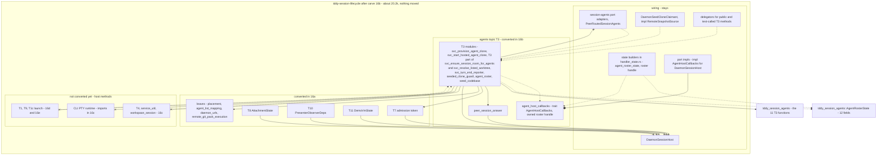

# Changeset: `tddy-session-lifecycle`'s agent topic (T3) runs over `AgentRosterState` and an `AgentHostCallbacks` port, in place

**Date**: 2026-09-26
**Status**: 🚧 Implemented, pending lifecycle baseline and /validate-changes
**Type**: Refactor (in-place port restructure; no crate moves; no behaviour change)
**Stack**: `#carve` 17/21, branch `feature/carve/lifecycle-ports-agents`, on top of `#carve` 16
(`feature/carve/lifecycle-ports`, #531). Plan label **16b** (M4)

Nodes are named by their plan label: 16a–16e are the five in-place conversion nodes (`#carve`
16–20), and 17 is the move node (`#carve` 21).

## Affected Packages

- **`tddy-session-lifecycle`**: every T3 `impl DaemonSessionHost` method is converted in place onto
  the agents state and its owned handle. The `AgentHostCallbacks` trait is defined in a T3 ports
  module and implemented once on the host in a wiring file. The session-agents port adapters are
  re-pointed. Public API and facades are unchanged.
- **`tddy-session-agents`**: `AgentRosterState` (created there by `#carve` 15) gains two fields,
  `session_admissions` and `model_registry`. Nothing else in the crate changes, and nothing moves
  into it.
- **Consumers** (`tddy-daemon-rpc`, `tddy-daemon`, `tddy-telegram-control`, `tddy-desktop`): **none
  is edited.**

## Related Feature Documentation

None: this is a behaviour-preserving restructure. There is no PRD.

## Summary

T3 is the daemon's agent-clone and roster topic: provisioning and tearing down agent clones, the
roster, the hosted clones and their codebase access, the session room for agents, and agent-def
resolution (2,054 production lines at `9d464a8e`). Today every one of those bodies is an
`impl DaemonSessionHost` method, so none can leave `tddy-session-lifecycle` (`E0116`).

This node converts T3 **in place**:
- its bodies read the host's fields through `tddy_session_agents::AgentRosterState` (widened by two
  fields) or its owned handle;
- the four host capabilities that are not fields go through a new callback trait,
  `AgentHostCallbacks` = {`worktree_snapshot`, `run_exec_tool_locally`, `local_exec_tools`} (approved)
  + `session_room_roster` (D2, awaiting approval);
- the five `self.clone()` hand-offs clone the owned roster handle instead;
- the session-agents port adapters call T3 through the handle.

After it, no T3 module names `DaemonSessionHost`, a wiring module, or any topic above it (T4, T1,
T9, T1c, CLI). Node 17 can then move T3 into `tddy-session-agents` as a plain module move.

## Background

`#carve` shrinks `tddy-session-lifecycle` into a wiring crate. `#carve` 14 destructured it,
`#carve` 15 moved the host-free leaves out and created `AgentRosterState` with the 11 T3 functions
(`clone_readiness`, `agent_clone_lookup`, `spawn_agent_def`, `hosted_clone_start`, …) in
`tddy-session-agents`. Its pilot showed that the rest of T3 cannot be moved by the engine: each
method's head, its host calls and its `self.clone()` hand-offs bind it to the host.

On 2026-09-26 the developer split the remaining work into an in-place conversion, reviewed as a
restructure and guarded by the baseline, and a move node. The conversion is cut by topic into five
linear nodes, leaves first:
- 16a: the port-free cuts and the leaf topics (T7 admission token, T8 attachments, T10 presenter,
  T11 demo VM);
- **16b (this): T3 agents**;
- 16c: T4 split, `service_util`, `workspace_session`;
- 16d: T9 stack spawns and the jail and CLI-spawn half of T1;
- 16e: the start/resume half of T1 and T1c.

## Responsibility

- Convert every T3 `impl DaemonSessionHost` method (the files in "Technical changes"), in place, onto
  `AgentRosterState` and its owned handle (D1).
- Widen `tddy_session_agents::AgentRosterState` by `session_admissions` and `model_registry`, and
  extend lifecycle's `agent_roster_state()` builder to fill them.
- Define `AgentHostCallbacks` once, in a T3 ports module (`agent_host_callbacks`), with the approved
  methods plus `session_room_roster` if D2 is approved; implement it once on `DaemonSessionHost` in
  the wiring ports file.
- Define the owned roster handle and turn T3's five `self.clone()` hand-offs into handle clones.
- `extract_module` the wiring part of `agent_roster.rs` (`impl RemoteSnapshotSource for
  DaemonSessionHost`, `DaemonSeedCloneClaimant`) out of the T3 file, and make `DaemonSeedCloneClaimant`
  hold the agents handle (D3).
- Re-point the session-agents port adapters (15 call sites) to the handle; keep a delegator, in a
  wiring file, for every public or test-called T3 host method (`agent_clone_divergences`,
  `agent_clone_worktree_path`, `agent_def_for_spawn`, `resolvable_agent_defs`,
  `session_room_participant_identities`, and the `pub(crate)` `local_agent_codebase_access`,
  `resolve_specialized_agent_defs`, `seeded_roster_records` that in-`src` unit tests call).
- Hold the baseline, and the acceptance checks for 16a's topics plus T3.

## Boundaries

- **No crate moves.** Nothing leaves `tddy-session-lifecycle`, and no module is re-exported from
  another crate. Moving is node 17's (`#carve 21`), and only with the `tddy-tools restructure` engine: a refusal
  means stop and ask; hand edits after a move are build corrections only, with a todo per new cause.
- **No behaviour change.** The node holds the baseline on its own: 575 passed, the same 22 failures by
  name, 1 ignored (see "Baseline").
- **Public `tddy_session_lifecycle::…` paths stay reachable.** No consumer crate is edited
  (`tddy-daemon-rpc`, `tddy-daemon`, `tddy-telegram-control`, `tddy-desktop`). The exception is a
  test that reads lifecycle source by path.
- **No receiver may depend on lifecycle, and each stays at or under 10k** production lines (checked
  in node 17; nothing is added to a receiver here beyond what this node's Scope names).
- **No new crate edges.** A new edge needs the developer's approval; none is added in this node.
- **`PeerRouted*`, the port adapters, the terminal adapter and bridge stay** in lifecycle as wiring.
- **The engine is used where it can do the extraction.** Hand conversion is allowed, because this
  node **is** the restructure. It is still restricted:
  - it may re-point a field read (`self.x` → `state.x`) or a host call (`self.m(…)` →
    `host.m(…)` or a topic function);
  - it may change a signature to take the state and port, and turn a host hand-off into a handle clone;
  - it never re-types logic, never reorders statements and never drops a comment.
- **No deduplication and no functional refactor.** DRY #1 (the shared jail launch) stays deferred.
- **Receiver edit limited to `AgentRosterState`'s two new fields** (and its constructors). No new crate
  is created.
- **Not in 16b:** T4, `service_util`, `workspace_session` and the CLI imports (16c); T9 and the jail and
  CLI-spawn half of T1 (16d); the start/resume half of T1 and T1c (16e). Their host methods stay host
  methods; where they call T3 they go through the handle the host builds. `SplitHost` and
  `LaunchHost` are **not defined** here.
- **Not re-done here:** 16a's M0 cuts, re-parenting and leaf topics.

## Dependencies

What each parent PR delivers that this PR consumes. These surfaces are **theirs to create**.
Implementing one here collides with the PR that owns it.

| Parent node | What it delivers | How this PR consumes it | This PR does NOT |
|---|---|---|---|
| **16a** `#carve` 16, lifecycle-ports (#531, `feature/carve/lifecycle-ports`) | M0: the free `mint_first_admission_token` over `config` and `session_admissions`, the free `split_forward_deadline` and `session_dir_for` (host methods kept as wiring delegators); the T3 module `peer_session_answer` holding `peer_has_no_such_session`, `split_pairing`, `resolve_worktree_root_for_session`, `resolve_exec_tool_worktree`; `daemon_urls` with `advertise_daemon_url`; `svc_turn_end_reporter.rs` no longer parents `jail_env_builders` (re-parented); `ExecToolRoute` beside `LocalExecTools`. M3: T8's `AttachmentState` | T3 bodies call the three free functions, `peer_session_answer` and `daemon_urls` directly, and never through the host | re-do any M0 cut, re-parent a file, convert T7/T8/T10/T11, or touch `SessionStdioEndpoint` / `ExecToolRoute` |
| `#carve` 15 lifecycle-split (#526) | `tddy_session_agents::AgentRosterState<'a>` (10 fields), lifecycle's `agent_roster_state()` builder, and the 11 T3 functions in `tddy-session-agents` | T3 bodies call the 11 functions with the (widened) state | move a function into `tddy-session-agents`, or change the 11 functions' signatures |

## What 16a and #584 delivered (verified in the tree at stage B3, 2026-10-05)

16a (#531) landed M0.2 (the `daemon_urls` module), M0.3, M0.5, M1, M2 and M3 and **deferred four items to
the engine** (the developer's decision, 2026-10-04). #584 (`cb50ab5c`, the engine's `move_item` and
`reparent_module`) then did them in this tree. This node's plan below was written before either landed;
where a row below disagrees with this table, this table is right.

| 16a item | State now | What it means for this node |
|---|---|---|
| **M0.1** the `peer_session_answer` T3 module | **Delivered by #584.** `connection_service/peer_session_answer.rs` (71 lines) holds `peer_has_no_such_session`, `split_pairing`, `resolve_worktree_root_for_session` and the free `resolve_exec_tool_worktree` over (`config`, `user_resolver`, `tddy_data_dir`, `req`). `workspace_session.rs:266` re-exports `resolve_worktree_root_for_session` from it | T3 callers reach all four there. **One upward edge is left:** `peer_session_answer.rs:8` imports `workspace_session::resolve_worktree_root_in_session_dir` (T3 to `workspace_session`, A3). `conversation_worktree_op.rs:230` names it too. See Open items, E4 |
| **M0.6** the `seeded_clone_guard.rs` split | **Delivered by #584.** `SessionStdioEndpoint` is in `svc_start_claude_cli_session.rs:247` (T1); `ExecToolRoute` is in `local_exec_tools.rs:393`, beside `LocalExecTools`; `seeded_clone_guard.rs` (106 lines) holds the guard and its release | The `seeded_clone_guard` row of the inventory is corrected below. `ExecToolRoute` moves with `LocalExecTools` (D7), not with T3 |
| **M0.4** re-parent the mixed parent/child files (D8) | **Delivered by #584 for seven modules**, each now under its own topic: `svc_host_builders` (under `connection_service`, no longer under `svc_resolve_tddy_tools_path`), `jail_env_builders` (under `svc_start_sandboxed_claude_cli_session`), `session_room_opening` (under `svc_ensure_session_room_for_agents`), `local_exec_tool_dispatch` (under `local_exec_tools`), `session_attachment_materialization` (under `svc_materialize_staged_attachment`), `split_claude_cli_start` (under `split_start`), `presenter_observer_spawn` (under `presenter_observer_task`). **Two parent/child edges that T3 reaches remain**, and the developer has not consented to re-parent either: `first_admission_token` (T7) under wiring's `svc_host_builders`, and `session_dir_lookup` (T3) under `svc_resolve_listed_worktree` (a T1/T3 mixed parent) | Still blocking for node 17. `svc_provision_agent_clone.rs` imports both. See Open items, E1 and E2 |
| the "group `write_claude_hooks_settings` and `resolve_start_session_claude_binary` with T4" half of **M0.2** | Skipped (not contiguous); moves with T4 in 16c | None here |

What 16a delivered, and this node consumes: the free `mint_first_admission_token(config, session_admissions,
session_id, owning_daemon_instance_id)` in `connection_service/svc_host_builders/first_admission_token.rs`,
`daemon_urls` (`connection_service/hooks_and_urls/daemon_urls.rs`), and the free `split_forward_deadline`
(`svc_spawn_split_agent.rs:417`) and `session_dir_for` (`svc_resolve_listed_worktree/session_dir_lookup.rs`).

**Baseline.** This document's baseline was 562 passed, measured on #526's old base. Master has since landed #571,
#573 and others, so the figures here are updated to the baseline on the current tree: **575 passed, the same 22
failures by name, 1 ignored**.

## Draft PR contract

This is a mechanical restructure, the first of the pr-stack skill's two named exceptions ("a purely
mechanical rename / move / extraction with no behaviour change"). The draft is this plan. There are
no new failing tests. The contract is:
- the baseline, re-run after every milestone of this node at the same numbers by name;
- the 16b acceptance checks A1–A9 (see "Acceptance graph — after this node").

Those checks are greps plus a scripted run. They become a shape test only if the developer reverses
the 2026-09-25 "no shape tests" decision (D11).

## Green wave

**Wave:** after 16a.
**Greenable independently:** **no.** T3's converted bodies call 16a's free admission-token function
and the `peer_session_answer` group; without 16a they would have to call the host (A1 fails). Its
baseline is the one 16a holds.
**Concurrent with:** nothing.
**Blocks:** 16c (T4's `start_split_claude_cli_session` resolves defs through the agents state, and
`SplitHost: AgentHostCallbacks` extends this node's trait), and through it 16d, 16e and 17.

Real dependency edges: `16a → 16b → 16c → 16d → 16e → 17`.

## Prerequisites

The scan followed `deferred-work/references/planning-cross-check.md`. No record in
`packages/tddy-session-lifecycle/docs/code-issues/` carries `Claimed by:`. The rows below are those
that touch T3.

| Item | Verdict | What this change does about it |
|---|---|---|
| [lifecycle files over the 400-line target](../todo/2026-09-24-lifecycle-files-over-the-400-line-target.md) | ⚠ **During** | Conversions add a few lines per file. No file may reach 500. `svc_provision_agent_clone.rs` (382) is the largest T3 file |
| [restructure has no operation to read a method's fields through a state parameter](../todo/2026-09-25-restructure-has-no-operation-to-read-a-methods-fields-through-a-state-parameter.md) | ℹ **Answered** | This node does that edit by hand, as the restructure. The todo stays open as an engine capability |
| [restructure has no signature operations](../todo/2026-09-24-restructure-has-no-signature-operations.md) | ⚠ **During** | Every conversion changes a signature (or, under Recipe B, an `impl` header) by hand. Each change is listed in the commit |
| [move-to-crate reads an import reaching the destination as an edge](../todo/2026-09-25-restructure-move-to-crate-reads-an-import-reaching-the-destination-as-an-edge.md) | ⛔ **Blocking for node 17**; mitigated here | It blocked three T3 methods in #526's pilot. **Check A4** makes every T3 module import foundations and lower topics by their defining crate, so node 17's move does not present that shape. Done in stage B3 (30 lines, by hand: [`2026-10-05-restructure-cannot-re-point-an-import-through-a-facade-to-its-defining-crate`](../todo/2026-10-05-restructure-cannot-re-point-an-import-through-a-facade-to-its-defining-crate.md)) |
| [extract drops comments and writes clippy-failing signatures](../todo/2026-09-24-restructure-extract-drops-comments-and-writes-clippy-failing-signatures.md) | ⚠ **During** | Where the engine extracts, comments are restored and signatures reshaped. Hand conversion keeps every comment |
| [apply leaves the lint gate red](../todo/2026-09-24-restructure-apply-leaves-the-lint-gate-red.md) | ⚠ **During** | clippy `-D warnings` and `fmt --check` on lifecycle and `tddy-session-agents` after the milestone |
| [extract-method: a return before a unit-`if` tail](../todo/2026-09-25-restructure-extract-method-accepts-a-return-before-a-unit-if-tail.md), [function-local `use` left behind](../todo/2026-09-25-restructure-extract-method-leaves-a-function-local-use-behind.md), [extract-variable hoists a borrowed field by value](../todo/2026-09-25-restructure-extract-variable-hoists-a-borrowed-field-by-value.md), [extract-variable waits for ever on `&`](../todo/2026-09-25-restructure-extract-variable-waits-forever-on-a-range-opening-with-a-borrow.md) | ⚠ **During** | Known engine traps (the pilot hit the early-return one on `report_shadowed_agent_def`). Avoided or corrected; no new todo unless a new cause appears |
| [topic files to fold into siblings](../todo/2026-09-24-lifecycle-topic-files-to-fold-into-existing-siblings.md) | — Unrelated | `roster_replacement` stays beside its sibling in T3; folding is not needed for correctness |
| [restructure verify cannot exit zero for an extract module](../todo/2026-09-18-restructure-verify-cannot-exit-zero-for-an-extract-module.md) | ⚠ **During** | `verify --against` is accounted by hand (the `agent_roster.rs` wiring extract) |

**Packages without `docs/code-issues/`:** `tddy-session-agents` has none. Run `/analyze-code-issues`
on it once node 17 lands T3 there.

## Scope

- [x] **M4.1 state and port**: add `session_admissions` and `model_registry` to `AgentRosterState`
  and its builder; define the owned roster handle (D1) and `AgentHostCallbacks` (approved three +
  `session_room_roster`, D2) in `connection_service/agent_host_callbacks.rs`; implement the trait on
  `DaemonSessionHost` in the wiring ports file. Done in the end as four methods, `ensure_session_room` in place of `session_room_roster` (Decisions taken)
- [x] **M4.2 wiring extract**: `extract_module` `agent_roster.rs`'s wiring part (44 lines:
  `impl RemoteSnapshotSource for DaemonSessionHost`, `DaemonSeedCloneClaimant`) into a wiring file;
  `DaemonSeedCloneClaimant` holds the agents handle (D3). Done with the engine's `move_item`, into `svc_agent_roster_wiring.rs`
- [x] **M4.3 convert** the T3 files in the inventory below: `svc_provision_agent_clone`,
  `svc_ensure_session_room_for_agents` (T3 part), `svc_start_hosted_agent_clone`,
  `svc_resolve_listed_worktree` (T3 part) with `session_dir_lookup` and `session_room_opening`,
  `svc_turn_end_reporter`, `seeded_clone_guard` (`SeededCloneRelease.service` → the handle). 37 methods now on `impl AgentRoster` (stages B1 and B2)
- [x] **M4.4 hand-offs**: the five `self.clone()` sites become handle clones
- [x] **M4.5 re-point** the session-agents adapters (`svc_session_agent_ports.rs`,
  `svc_peer_routed_session_agents.rs`, `svc_session_agent_port_adapters.rs`) and
  `session_agent_clone::clone_worktree_path`; keep the delegators listed in Responsibility, in wiring
- [x] **M4.6 imports**: every T3 file names foundations by their defining crate (A4); the free T3 files
  (`agent_roster` T3 part, `seed_codebase`, `roster_replacement`, `peer_session_answer`) get imports only. Done for every converted file whose path went through a facade; the T1-only names in the mixed import of `svc_resolve_listed_worktree.rs` wait for 16e
- [ ] **Baseline** after the milestone: 575 / 22 / 1, the same 22 by name; `tddy-session-agents` 72
  passed. clippy and fmt clean on lifecycle and `tddy-session-agents`. `cargo check --all-targets`
  clean on lifecycle, `tddy-session-agents`, `tddy-daemon-rpc`, `tddy-daemon`, `tddy-telegram-control`.
  **Not done:** the lifecycle suite is not yet re-run on this tree (the orchestrator runs it once). Run in B3: the scoped
  check, clippy and fmt (green), and `tddy-session-agents` at 75 passed (see Validation results, stage B3)
- [~] **Acceptance checks** A1–A9 for 16a's topics plus T3: run literally in stage B3. A4, A6, A7, A9 pass; A1, A2, A3, A5 have
  hits, each classified in Validation results; the real residual edges are Open items E1 to E6
- [~] `restructure verify --against <16a tip>`: accounted stage by stage (B3: `--against 1ad0b0f7`, "every statement
  accounted for"). Against `8c849211` (before the node's code) the tool reports 76 statements lost and 209 gained: the hand `impl`
  retargets and receiver re-points the engine has no operation for

**Status indicators**: `[ ]` not started · `[~]` in progress · `[x]` complete ✅

## Technical changes

### State A (16a's tip)

- `tddy-session-lifecycle` at about 20.1k production lines. T7, T8, T10, T11 and the host-free leaves
  are converted; the M0 cuts are in; T3 is still `impl DaemonSessionHost` methods.
- `AgentRosterState<'a>` has 10 fields: `config`, `tddy_data_dir`, `user_resolver`, `peer_routing`,
  `room_roster`, `session_rooms`, `session_agent_rosters`, `session_agent_clones`,
  `hosted_agent_clones`, `roster_keepalive_interval`.
- No callback trait exists.

### State B (after this node)

About 20.2k production lines (+~100: the handle, the trait, its impl, the delegators). The layout is the
acceptance graph below. **As built (stage B3):**
- `AgentRoster` (the owned handle, `agent_host_callbacks.rs`) carries 37 T3 methods across five files:
  `svc_provision_agent_clone.rs` 12, `svc_start_hosted_agent_clone.rs` 9, `svc_ensure_session_room_for_agents.rs` 6,
  `svc_resolve_listed_worktree.rs` 6, `svc_turn_end_reporter.rs` 4; plus `AgentRoster::state()`.
- `AgentHostCallbacks` has four methods (`worktree_snapshot`, `run_exec_tool_locally`, `local_exec_tools`,
  `ensure_session_room`), implemented once in `svc_agent_host_ports.rs`.
- Wiring kept on the host: `ensure_session_room` (`svc_ensure_session_room_for_agents/session_room_opening.rs`, the
  terminal-bridge wiring), seven delegators (`svc_agent_roster_delegators.rs`), `DaemonSeedCloneClaimant` and
  `impl RemoteSnapshotSource` (`svc_agent_roster_wiring.rs`), `agent_roster()` (`handler_state.rs`) and
  `seed_clone_claimant()` (`svc_host_builders.rs`).
- Three T3 modules still name a wiring or higher module: Open items E1 to E6 (Validation results, stage B3).

### Per-file inventory: T3 → `tddy-session-agents` (2,054 lines)

The columns are:
- **This node**: what this node does. It names the state the body reads and the callback methods it
  calls. "No change" means the file is already free of the host.
- **Node 17**: the engine operation in the move node (`#carve 21/21`).
- **Blockers**: what stands in the way.

Abbreviations: **LS** `LaunchState`, **AR** `AgentRosterState` (with its owned handle), **SS**
`SplitState`, **AS** `AttachmentState`; **LH** `LaunchHost`, **AHC** `AgentHostCallbacks`, **SH**
`SplitHost`. Paths are under `packages/tddy-session-lifecycle/src/`, and `cs/` is
`connection_service/`. Line counts are production lines at `9d464a8e` (any line of a `src/` file
outside an inline `#[cfg(test)] mod x { … }` block; `connection_service/*_tests.rs` files count as
test code).

| File | Lines | This node | Node 17 | Blockers |
|---|---:|---|---|---|
| `cs/svc_provision_agent_clone.rs` | 382 (393 now) | 12 methods → AR:<br>• `provision_agent_clone` → `peer_routing.common_room_slot`, `mint_first_admission_token` (free fn over `config` and `session_admissions`), `split_forward_deadline` (free) and `daemon_urls::advertise_daemon_url`;<br>• `delete_clone_on_peer` and `tear_down_agent_clone` use `peer_session_answer`;<br>• `hosted_clone_for` and `run_hosted_clone_tool` → **AHC `local_exec_tools`** ✅ | cluster → session-agents | #526's pilot import refusal (A4 done). **Three residual edges** to wiring and T4 modules: `svc_host_builders::first_admission_token`, `svc_resolve_listed_worktree::session_dir_lookup`, `svc_spawn_split_agent::split_forward_deadline` (Open items E1 to E3) |
| `cs/svc_ensure_session_room_for_agents.rs` (T3 part) | 366 | 6 methods → AR:<br>• `claim_agent_clone`: `self.clone()` into `tokio::spawn`;<br>• `claim_co_located_seed_clones`: `self.clone()` into `SeededCloneGuard`;<br>both become an owned-handle clone; `ensure_session_room_for_agents` reaches the room through `AgentHostCallbacks::ensure_session_room`. The file's T4 part (`provision_workspace_tool_sandbox`, 27) and T1 part (`index_workspace_worktree`, 22) stay host methods: 16c and 16e | in the cluster | `self.clone()` (D1); mixed file |
| `cs/svc_start_hosted_agent_clone.rs` | 334 | 9 methods → AR:<br>• `owned_`/`local_agent_codebase_access`: `'static` closures holding `self.clone()` → owned handle; they call **AHC `run_exec_tool_locally`** ✅ and `local_exec_tools` ✅, and `resolve_exec_tool_worktree` is the free fn over AR fields;<br>• the `start_hosted_agent_clone` head's `workspace_session` call → T3's own `resolve_worktree_root_for_session` | in the cluster | `self.clone()` (D1) |
| `cs/svc_resolve_listed_worktree.rs` (T3 part) | 248 | `report_shadowed_agent_def`, `resolvable_agent_defs` (method and free fn), `agent_def_for_spawn`, `resolve_specialized_agent_defs`, `seeded_roster_records`, `roster_session_dir` → AR (+ `model_registry`). The T1 part (`ensure_project_available_for_start`, `spawn_project_clone`, 185) stays: 16e | in the cluster | the engine refused `report_shadowed_agent_def` (early return); hand conversion is fine here; mixed file |
| `cs/svc_resolve_listed_worktree/session_dir_lookup.rs` | 23 (18 now) | `session_dir_for` is already a free fn over `tddy_data_dir` (16a); the host method was removed as dead. **Child of `svc_resolve_listed_worktree.rs`, a T1/T3 mixed parent** (M0.4 not consented) | in the cluster | E2 |
| `cs/svc_ensure_session_room_for_agents/session_room_opening.rs` (a submodule of `svc_ensure_session_room_for_agents`, re-parented by #584) | 41 | **Not converted, by decision (stage B2, option b).** It holds the host's `ensure_session_room` (room roster plus the host's `SessionTerminalBridge`), which stays a wiring method; T3 reaches it through **AHC `ensure_session_room`**. The whole file is wiring | stays in lifecycle; E5 | the file is wiring under a T3 parent: A1 and A5 hits (by design) |
| `cs/svc_turn_end_reporter.rs` | 158 | 4 methods → AR. `remote_roster_record_for` → `peer_routing.common_room_slot` and `.eligible_instance_ids` | in the cluster | — (its T1 child `jail_env_builders` was re-parented under `svc_start_sandboxed_claude_cli_session` by #584) |
| `cs/agent_roster.rs` (T3 part) | 198 (168 now) | free functions: no change except imports. The wiring part (44) is extracted (M4.2) into `svc_agent_roster_wiring.rs` | in the cluster | — |
| `cs/seeded_clone_guard.rs` | ~115 (106 now) | `SeededCloneRelease.service: DaemonSessionHost` → the owned handle. `SessionStdioEndpoint` is in T1's `svc_start_claude_cli_session.rs` and `ExecToolRoute` beside `LocalExecTools` (M0.6, #584) | in the cluster | — |
| `cs/seed_codebase.rs` | 98 | imports only (B3: its T3 siblings named by module path) | in the cluster | — |
| `cs/roster_replacement.rs` | 24 | no change | in the cluster | — |
| `cs/peer_session_answer.rs` (#584: `peer_has_no_such_session`, `split_pairing`, `resolve_worktree_root_for_session`, `resolve_exec_tool_worktree`) | 46 (71 now) | imports only (A4 done) | in the cluster | upward edge to `workspace_session::resolve_worktree_root_in_session_dir` (E4) |

Wiring touched (stays in lifecycle):

| File | Lines | This node |
|---|---:|---|
| `cs/svc_session_agent_ports.rs` + `cs/svc_session_agent_ports/svc_peer_routed_session_agents.rs` + `…/svc_session_agent_port_adapters.rs` | 113 + 307 + 319 | the adapters' T3 host calls (`claim_agent_clone`, `open_local_agent_session`, …) → re-pointed to the agents handle (five adapters hold it; field `connection` → `roster`) |
| `cs/handler_state.rs` | 189 | `agent_roster()` builds the owned handle (`agent_roster_state()` was removed as dead); the two new fields come from it |
| `cs/svc_agent_roster_wiring.rs` (the wiring part of `agent_roster.rs`) | 72 | `impl RemoteSnapshotSource for DaemonSessionHost` (the AHC `worktree_snapshot` source); `DaemonSeedCloneClaimant` holds the agents handle |
| `cs/svc_resolve_os_user/local_exec_tool_dispatch.rs`, `cs/local_exec_tools.rs` | 25 + 231 | unchanged: the AHC `run_exec_tool_locally` and `local_exec_tools` sources (D7) |
| `cs/svc_session_files_ports.rs` | 200 | unchanged: `session_room_roster` (a host method, no longer a callback) |
| `session_agent_clone.rs` | 31 | nothing to re-point: `clone_worktree_path` already calls `peer_session_answer::resolve_worktree_root_for_session` and nothing calls it |
| `cs/svc_agent_host_ports.rs` (new) + `cs/svc_agent_roster_delegators.rs` (new) | 56 + 81 | `impl AgentHostCallbacks for DaemonSessionHost`; the seven one-line delegators |

### `AgentRosterState` and `AgentHostCallbacks`

Every field and callback below comes from grepping the bodies for `self.<field>`, `self.<method>(`,
and the same through a cloned handle (`service.…`, `self.service.…`, across line breaks). ✅ approved,
❌ not approved.

| | Content |
|---|---|
| Fields today (10) | `config`, `tddy_data_dir`, `user_resolver`, `peer_routing`, `room_roster`, `session_rooms`, `session_agent_rosters`, `session_agent_clones`, `hosted_agent_clones`, `roster_keepalive_interval` |
| Fields the bodies also read (added here) | **`session_admissions`** (`tear_down_agent_clone`, and the admission-token fn) and **`model_registry`** (`resolvable_agent_defs`, `agent_def_for_spawn`; #526's pilot hoisted it as a parameter) |
| Owned variant | needed. `claim_agent_clone` (`tokio::spawn`), `claim_co_located_seed_clones` (`SeededCloneGuard`), `owned_`/`local_agent_codebase_access` (`'static` closures) and `ensure_session_room` (room-roster closure) hand `self.clone()` to something `'static`. A borrowed state cannot go there (D1) |
| AHC `local_exec_tools` ✅ | `hosted_clone_for`, `run_hosted_clone_tool` |
| AHC `run_exec_tool_locally` ✅ | `local_agent_codebase_access`'s closure |
| AHC `worktree_snapshot` ✅ | **no T3 body calls it.** The caller is T4's `join_split_livekit_room` (16c), through `SplitHost: AgentHostCallbacks`. Defined here so the trait is complete; implemented from `impl RemoteSnapshotSource for DaemonSessionHost` |
| AHC `session_room_roster` ❌ **new** | `ensure_session_room` (`|| Arc::new(self.clone()).session_room_roster()`). The service-entry list is wiring (D2) |

The **seven further host methods** #526's pilot listed are not callbacks. Six are state reads or free
functions of state fields, and the seventh reduces to `session_room_roster`:

| Pilot's candidate | Call sites | Becomes |
|---|---|---|
| `common_room_slot` ❌ | `provision_agent_clone`, `delete_clone_on_peer`, `tear_down_agent_clone`, `forward_open_…`, `forward_cancel_…`, `remote_roster_record_for` | `state.peer_routing.common_room_slot(…)`. The host method is a one-line delegation |
| `eligible_instance_ids` ❌ | `refuse_departed_daemon`, `remote_roster_record_for` | `state.peer_routing.eligible_instance_ids()` |
| `session_dir_for` ❌ | `agent_clone_for`, `roster_session_dir` | the free fn over `tddy_data_dir` (16a) |
| `mint_first_admission_token` ❌ | `provision_agent_clone` | the free fn over `config` and `session_admissions` (16a). `session_admissions` joins the state |
| `split_forward_deadline` ❌ | `provision_agent_clone` | the free fn over `config` (16a). The host method stays: a lifecycle test calls it |
| `resolve_exec_tool_worktree` ❌ | `local_agent_codebase_access` | the free fn (`config`, `user_resolver`, `tddy_data_dir`: all in the state), in `peer_session_answer` |
| `ensure_session_room` ❌ | `ensure_session_room_for_agents`, and T1c's `connect_…` | a T3 function over the state, whose only host need is **`session_room_roster`** |

### Cross-topic calls this node must leave

| From | To | Allowed after 16b |
|---|---|---|
| T3 | T7 (`mint_first_admission_token`), `daemon_urls`, `peer_session_answer`, `placement`, `agent_list_mapping`, the 11 `tddy_session_agents` functions | ✔ (all below T3) |
| T3 | T4 / `service_util` / `workspace_session` / T1 / T9 / T1c / CLI | ✗ must not exist |
| T3 | wiring (`common_room_slot`, `eligible_instance_ids`, `resolve_exec_tool_worktree`, `session_dir_for`) | → state reads or free fns |
| T3 | wiring (`local_exec_tools`, `run_exec_tool_locally`, `session_room_roster`) | → **AHC** |
| wiring (adapters) | T3 | ✔ 15 calls, through the handle |
| T1 / T1c / T4 host methods (not converted yet) | T3 | ✔ they call the T3 handle's methods, built by the host |

### Conversion recipe

1. **Define the topic's state** (borrowed, plus an owned variant or handle where a hand-off needs
   `'static`) **and its callback trait**, in a ports module of that topic. They are hand-written.
2. **Implement the trait on `DaemonSessionHost`** in the wiring ports file (one file for every
   callback-trait impl), and **add the builder** to `connection_service/handler_state.rs`.
3. **Convert each method.** Try the engine first (`extract_method` over the `self`-free tail, then
   `extract_variable` hoists). Otherwise convert by hand under Boundaries' edit rule:
   - `self.<field>` → `state.<field>` (or, under D1's Recipe B, `self.<field>` on the handle,
     unchanged);
   - a routing delegation → `state.peer_routing.<m>(…)`;
   - a cross-topic host call → the topic function with its state;
   - a wiring capability → `host.<callback>(…)`;
   - `self.clone()` into a task → a handle clone.
4. **Re-point wiring callers** (adapters, `SessionHandler`) to the topic function. Keep a
   `DaemonSessionHost` delegator, in a wiring file, only where a consumer or a test calls the method.
5. **Re-point imports** to defining crates (A4).
6. **Gates:** `cargo check --all-targets` on lifecycle, `tddy-session-agents`, `tddy-daemon-rpc`,
   `tddy-daemon` and `tddy-telegram-control`; clippy (`-D warnings`) and `fmt --check` on lifecycle;
   the baseline; the acceptance checks for the topics converted so far; `restructure verify`.

### Callers and visibility

| | |
|---|---|
| External importers | none change. No path moves here |
| Facade | none added. Existing `pub use` lines are untouched |
| Delegators kept | `agent_clone_divergences`, `agent_clone_worktree_path`, `agent_def_for_spawn`, `resolvable_agent_defs`, `session_room_participant_identities` (consumers); `local_agent_codebase_access`, `resolve_specialized_agent_defs`, `seeded_roster_records` (in-`src` unit tests). Each is a one-line forward to the handle, in a wiring file |
| Visibility | nothing widens across a crate except the two new `AgentRosterState` fields, which are `pub` like the other ten. Inside lifecycle, a T3 function another topic calls may need `pub(crate)` where the host method was `pub(in crate::connection_service)`; each widening is listed in the commit |

### Baseline

Recorded on 16a's tip, and the acceptance criterion after the milestone:

```bash
./dev cargo test -p tddy-session-lifecycle --no-fail-fast -- --test-threads=1 \
  --skip sandboxed_bash_pty_action_streams_output
```

Expected: **575 passed, 22 failed, 1 ignored**, the same 22 by name. The flaky
`session_room_acceptance::the_first_connect_makes_the_sessions_terminal_drivable_over_livekit`
passes when re-run alone, so it is not a regression.

| Suite | Known red (macOS) | Cause |
|---|---|---|
| `sandbox_behavior_acceptance` (5) | `sandboxed_session_streams_demo_tui_dimensions_in_terminal`, `sandboxed_session_spawn_manifest_records_session_channel_egress`, `sandboxed_session_relays_claude_llm_egress_via_session_channel`, `sandboxed_session_denies_direct_outbound_network_from_jail`, `sandboxed_session_child_is_alive_after_demo_tui_start` | `sandbox RPC bridge not installed — runtime must call install_sandbox_rpc_bridge` |
| `sandboxed_claude_cli_acceptance` (5) | `sandboxed_claude_cli_start_persists_metadata_and_empty_livekit`, `sandboxed_claude_cli_connect_session_returns_empty_livekit`, `sandboxed_claude_cli_terminal_io_round_trips`, `sandboxed_claude_cli_tool_exec_via_ipc_reads_host_worktree`, `sandboxed_claude_cli_start_wires_specialized_agents_env_and_metadata` | same |
| `sandboxed_cursor_cli_acceptance` (4) | `sandboxed_cursor_cli_start_persists_metadata_and_empty_livekit`, `sandboxed_cursor_cli_connect_session_returns_empty_livekit`, `sandboxed_cursor_cli_terminal_io_round_trips`, `sandboxed_cursor_cli_start_wires_specialized_agents_env_and_metadata` | same |
| `sandboxed_session_lifecycle_acceptance` (2) | `delete_sandbox_session_stops_child_and_removes_directory`, `resume_sandbox_session_respawns_and_updates_pid` | same |
| `session_sync_livekit_acceptance` (6) | `mirrors_a_file_the_agent_wrote_without_a_commit`, `mirrors_an_edit_to_an_existing_file`, `removes_a_file_the_agent_deleted`, `mirrors_binary_content_byte_for_byte`, `follows_the_session_head_when_the_agent_commits`, `restores_a_mirror_that_was_corrupted_by_hand` | `tddy-remote-git-repo is not built`, then `Once instance has previously been poisoned` |

Also run: `./dev cargo test -p tddy-session-agents` (72 passed on #526's base; any test this stack adds
there is counted on top).

**What the baseline cannot guard.** The 16 sandboxed failures above never execute the sandboxed
start, relaunch and delete paths on macOS. Where this node converts one of them, its preservation is
argued from:
- compiling;
- the edit rule (Boundaries);
- **Linux CI's run** of the same suites (`scripts/ci-status.sh --failures` on the PR).

## Acceptance graph — after this node

Lifecycle's module layout after 16b. Nothing has moved crate. Edge legend: `-->` direct call
(allowed); `-.->` through a state or port; `--o` implements; `--x` **must not exist**.


```mermaid
graph TD
  subgraph lc["tddy-session-lifecycle after carve 16b - about 20.2k, nothing moved"]
    subgraph W["wiring - stays"]
      host["DaemonSessionHost"]
      builders["state builders in handler_state.rs - agent_roster_state, roster handle"]
      impls["port impls - impl AgentHostCallbacks for DaemonSessionHost"]
      adapters["session-agents port adapters, PeerRoutedSessionAgents"]
      claimant["DaemonSeedCloneClaimant, impl RemoteSnapshotSource"]
      dele["delegators for public and test-called T3 methods"]
    end

    subgraph A["agents topic T3 - converted in 16b"]
      a_ports["agent_host_callbacks - trait AgentHostCallbacks, owned roster handle"]
      a_t3["T3 modules - svc_provision_agent_clone, svc_start_hosted_agent_clone, T3 part of svc_ensure_session_room_for_agents and svc_resolve_listed_worktree, svc_turn_end_reporter, seeded_clone_guard, agent_roster, seed_codebase"]
      a_psa["peer_session_answer"]
    end

    subgraph DONE["converted in 16a"]
      t7["T7 admission token"]
      t8["T8 AttachmentState"]
      t10["T10 PresenterObserverDeps"]
      t11["T11 DemoVmState"]
      leaves["leaves - placement, agent_list_mapping, daemon_urls, remote_git_pack_execution"]
    end

    subgraph TODO["not converted yet - host methods"]
      t4["T4, service_util, workspace_session - 16c"]
      cli["CLI PTY runtime - imports in 16c"]
      t1["T1, T9, T1c launch - 16d and 16e"]
    end
  end

  ars["tddy_session_agents::AgentRosterState - 12 fields"]
  agfns["tddy_session_agents - the 11 T3 functions"]

  impls --o a_ports
  builders -.-> ars
  builders -.-> a_ports
  adapters -.-> a_t3
  claimant -.-> a_t3
  dele -.-> a_t3
  a_t3 -.-> a_ports
  a_t3 -.-> ars
  a_t3 --> agfns
  a_t3 --> a_psa
  a_t3 --> t7
  a_t3 --> leaves
  t4 -.-> a_t3
  t1 -.-> a_t3

  a_t3 --x host
  a_psa --x host
  a_t3 --x t4
  a_t3 --x t1
  a_t3 --x cli
  a_t3 --x adapters
  t7 --x host
  t8 --x host
  t10 --x host
  t11 --x host
```

`a_t3 --x adapters` means no T3 module names a wiring module (A2): the adapters call T3, never the
reverse. `t4 -.-> a_t3` and `t1 -.-> a_t3` are the not-yet-converted host methods calling T3 through
the handle the host builds.

### Acceptance criteria for 16b, and how each is checked

The **converted file set** is 16a's (T7, T8, T10, T11, the leaves) plus T3's: every T3 file in the
inventory, and the T3 parts of `svc_ensure_session_room_for_agents.rs` and
`svc_resolve_listed_worktree.rs` (the other topics' methods in those two mixed files are excluded by
item range until 16c and 16e convert them).

| # | Criterion: what must **not** exist | How to check |
|---|---|---|
| A1 | No file in 16a's topics or T3 names `DaemonSessionHost`, as a type, an `impl` or a method call. Delegators live only in wiring files | `grep -n 'DaemonSessionHost' <files> \| grep -v '^\S*:\s*//'` is empty |
| A2 | No file in 16a's topics or T3 names a wiring module: `connection_service`'s own items, `svc_*_ports`, `handler_state`, `svc_host_builders`, `rpc_families`, `PeerRouted*`, `DaemonRpcHandler`, or `test_util` outside `#[cfg(test)]` | a grep of each file for `super::(super::)?(DaemonRpcHandler\|PeerRouted\|handler_state\|svc_host_builders\|…)`, `crate::rpc_families` and `crate::test_util` outside test modules; empty |
| A3 | No upward topic edge: T3 ↛ T4 / `service_util` / `workspace_session` / T1 / T9 / T1c / CLI; T7, T8, T10, T11 and the leaves ↛ any other topic (T10 → `session_notification_publishing` allowed) | a scripted grep: for each converted topic's files, collect `crate::…`, `super::…` and `crate::connection_service::…` module targets, map each to its topic by the inventory, and fail on any pair outside the allowed DAG. Optionally `cargo modules dependencies --lib -p tddy-session-lifecycle`, if installed |
| A4 | Files in 16a's topics or T3 name foundations and receivers **by their defining crate** (`tddy_daemon_kernel::config::…`, `tddy_daemon_livekit::session_room::…`), never through a lifecycle facade; a lower topic is named by its own module path | `grep -nE 'crate::(config\|relay_idle\|livekit_peer_discovery\|session_room\|peer_routing\|session_admission_service\|context_files\|context_sync\|session_attachments\|session_reader\|session_deletion\|user_sessions_path\|session_agent_[a-z]+\|project_storage\|branch_intent\|pty_runtime\|host_session_service)\b' <files>` is empty |
| A5 | No file in 16a's topics or T3 clones the host. Hand-offs clone the topic's owned handle | follows from A1, plus `grep -n 'Arc::new(self.clone())'` in those files is empty |
| A6 | `AgentHostCallbacks` is defined once, in `agent_host_callbacks`, and implemented once, on `DaemonSessionHost`, in the wiring ports file. It holds exactly {`worktree_snapshot`, `run_exec_tool_locally`, `local_exec_tools`} + `session_room_roster` if D2 is approved. `SplitHost` and `LaunchHost` do not exist yet | `grep -rn 'trait AgentHostCallbacks'` gives one hit; `grep -rn 'impl .*AgentHostCallbacks for DaemonSessionHost'` gives one hit, in wiring; the trait's method list matches; `grep -rn 'trait SplitHost\|trait LaunchHost'` is empty |
| A7 | The public API is unchanged: no consumer edit, and every facade still resolves | `git diff <base> -- packages/tddy-daemon-rpc packages/tddy-daemon packages/tddy-telegram-control packages/tddy-desktop` is empty, and `cargo check --all-targets` is clean on lifecycle, `tddy-session-agents`, `tddy-daemon-rpc`, `tddy-daemon` and `tddy-telegram-control` (`tddy-desktop` on CI: it embeds the web bundle) |
| A8 | Behaviour: the baseline | 575 passed, the same 22 by name, 1 ignored, after M4; `tddy-session-agents` at its count. `restructure verify --against <base>` accounted |
| A9 | `AgentRosterState` has exactly the 12 fields, and `tddy-session-agents` changed nowhere else | `git diff <base> --stat -- packages/tddy-session-agents` lists only `agent_roster_state.rs` (plus any in-crate test constructing it); `./dev cargo test -p tddy-session-agents` at 72 passed |

## Decisions & trade-offs

Settled by the developer (2026-09-26), carried here:
- The work is cut into five in-place conversion nodes, 16a–16e (`#carve` 16–20), and one move node,
  17 (`#carve` 21). Node 17 could be cut one receiver per node later.
- Engine moves only across crates, and a refusal means stop and ask.
- New edges need approval. No receiver may depend on lifecycle.
- Each crate stays at or under 10k. Consumers stay unedited. Facades are kept.
- `AgentHostCallbacks` = {`worktree_snapshot`, `run_exec_tool_locally`, `local_exec_tools`} is
  approved. The seven further methods the pilot listed are not.
- `PeerRouted*` stays.

### Decisions taken (2026-10-05, the developer's go-ahead)

- **D1 = Recipe B**: methods on the owned `AgentRoster` handle (`connection_service/agent_host_callbacks.rs`), fields named as the host's, built per call by `DaemonSessionHost::agent_roster()`; `state()` lends `AgentRosterState`.
- **D2 approved, then amended (stage B2, 2026-10-05, the developer chose option (b))**: `AgentHostCallbacks` = {`worktree_snapshot`, `run_exec_tool_locally`, `local_exec_tools`, `ensure_session_room`}, implemented once on the host in `svc_agent_host_ports.rs`. `ensure_session_room` replaces `session_room_roster`: the host's own `ensure_session_room` (room roster + the host's `SessionTerminalBridge`) stays a wiring method and the topic reaches it through the callback, so D2 stays at four methods and the handle needs neither the roster nor the bridge. The earlier `session_room_roster` text elsewhere in this plan is superseded.
- **D3**: `DaemonSeedCloneClaimant` holds the handle (stage A kept the host until `claim_co_located_seed_clones` became a handle method; done in stage B2).
- **D7 = A**: `LocalExecTools` stays in lifecycle, reached through the callbacks.
- Stage A done: M4.1, and M4.2 (engine `move_item` into `svc_agent_roster_wiring.rs`).

### Open decisions this node needs

- **D1: how the conversion is shaped, and the `self.clone()`-to-task hand-offs.** Twelve methods in
  the whole conversion hand the whole host to something `'static`:
  - T3: `claim_agent_clone`, `claim_co_located_seed_clones`, `owned_agent_codebase_access`,
    `local_agent_codebase_access`, `ensure_session_room`;
  - T4: `join_split_livekit_room` ×2, `session_files_of_this_daemon`;
  - T1: three spawn handlers and the host-session socket;
  - T1c: `stream_start_session`.

  Two options:
  - **Recipe A:** free functions over a borrowed state (`AgentRosterState<'a>`, #526's pilot shape),
    plus an owned handle (Arc clones, a `DaemonConfig` clone and `Arc<dyn …Callbacks>`) for hand-offs.
    It adds `state` and `host` parameters to every function, and it **worsens two code issues**
    (`resume_claude_cli_session`, `spawn_split_agent`: 9 → 11 parameters).
  - **Recipe B (recommended):** methods on a per-topic **owned handle** whose fields have the host's
    names, for example `impl AgentRoster { … }`. Moving a method from `impl DaemonSessionHost` to
    the handle's `impl` changes only the `impl` header. `self.config` stays `self.config`, and
    `let service = self.clone(); tokio::spawn(…)` stays **textually identical**, because the handle
    is `Clone`. Parameter counts are unchanged. Node 17 moves the type with its methods (no `E0116`).

  Recipe B's cost is building a handle per call: a `DaemonConfig` clone, which a host `self.clone()`
  already does today. Two ways to avoid even that: (i) the host keeps the handles as fields, but the
  `with_*`/`set_*` builders mutate `room_roster`, `session_rooms`, `staging_base_dir`, …, so each
  builder must update the handle too (a behaviour risk); (ii) the host's `config` becomes
  `Arc<DaemonConfig>`, a field-type change across the host.

  **Recommended: B, built per call.** Once decided for the stack's first node, every later node
  follows the same recipe.
- **D2: `AgentHostCallbacks`.** Add **one** method, `session_room_roster` (for `ensure_session_room`).
  The other six of the pilot's seven are state reads or free functions (see "`AgentRosterState` and
  `AgentHostCallbacks`"). That needs `AgentRosterState` widened by `session_admissions` and
  `model_registry`. Is that preferable to widening the trait? **Recommended: yes.** The seventh,
  `ensure_session_room`, becomes T3's own function.
- **D3 (the part this node needs): `DaemonSeedCloneClaimant`.** It holds the agents handle and moves
  with T3 in node 17, so the launch topic's future `LaunchHost` stays at {`sandbox_rpc_handler`,
  `pr_stack`}. The alternative is a `LaunchHost::seed_clone_claimant` callback in 16d.
  **Recommended: the claimant holds the handle.**
- **D7: `LocalExecTools`.**
  - **A (the default under the approved callbacks):** it stays in lifecycle (+231 wiring), reached
    through AHC `local_exec_tools` and `run_exec_tool_locally`.
  - **B:** it moves to `tddy-session-agents` in node 17, taking `ExecToolRoute` with it. Agents gains
    `tddy-daemon-sandbox`, `tddy-sandbox-runner`, `tddy-tool-engine` and `tddy-task` (new edges), and
    the two callbacks become unnecessary.
  - This node is the same under both: it uses the two callbacks. **Recommended: A** here; B is node
    17's to decide with its edges.
- **D11: shape tests.** The acceptance checks are greps by default, honouring the 2026-09-25 "no
  shape tests". A shape test would make them regressions CI catches. Recommended: keep greps; revisit
  if a later node regresses an earlier node's check.

**Edge approvals:** none needed. This node adds no crate edge; `AgentRosterState`'s two new field
types are already named by `tddy-session-agents` or its existing dependencies (check at M4.1: if
either type needs a new dependency, stop and ask).

## Validation results

### Stage B1 (2026-10-05): the three T3 files whose methods need no `self.clone()` hand-off

**Moved** from `impl DaemonSessionHost` to `impl AgentRoster` (Recipe B; header only, no body re-typed, no comment dropped):
- `svc_provision_agent_clone.rs`: all 12 (`provision_agent_clone`, `delete_clone_on_peer`, `tear_down_agent_clone`, `tear_down_every_agent_clone`, `publish_roster_change`, `broadcast_roster`, `session_room_participant_identities`, `agent_clone_worktree_path`, `agent_clone_divergences`, `agent_clone_for`, `hosted_clone_for`, `run_hosted_clone_tool`);
- `svc_turn_end_reporter.rs`: all 4 (`forward_cancel_agent_conversation`, `roster_record_for_agent_id`, `roster_record_for`, `remote_roster_record_for`);
- `svc_resolve_listed_worktree.rs` (T3 part): 6 (`report_shadowed_agent_def`, `resolvable_agent_defs`, `agent_def_for_spawn`, `resolve_specialized_agent_defs`, `seeded_roster_records`, `roster_session_dir`); `ensure_project_available_for_start` stays a host method (T1).

**Host calls that are not fields, and what each became** (resolution order 1, a free function or state read; none needed order 2 beyond `local_exec_tools`):
`common_room_slot` / `eligible_instance_ids` -> `self.peer_routing.*`; `session_dir_for` -> `session_dir_lookup::session_dir_for(&self.tddy_data_dir, ..)`; `mint_first_admission_token` -> `first_admission_token::mint_first_admission_token(&self.config, &self.session_admissions, ..)`; `split_forward_deadline` -> `svc_spawn_split_agent::split_forward_deadline(&self.config)`; `agent_roster_state()` -> `self.state()`; `local_exec_tools()` -> `self.host.local_exec_tools()` (callback). Layering note: the T3 file now imports `svc_host_builders::first_admission_token` and `svc_spawn_split_agent` (wiring and T4 modules, the M0.4 re-parent being deferred); node 17's move must carry or re-point them (A4).

**Delegators left on the host**, all in the wiring file `svc_agent_roster_delegators.rs`: `session_room_participant_identities`, `agent_clone_worktree_path`, `agent_clone_divergences`, `resolvable_agent_defs`, `agent_def_for_spawn`, `resolve_specialized_agent_defs`, `seeded_roster_records`. Every other caller (ensure_session_room, delete-session, the session-agents adapters, `svc_start_hosted_agent_clone`, `session_agent_ports`) calls `self.agent_roster().<m>(..)`. Removed as dead: host `mint_first_admission_token`, host `session_dir_for`.

**Engine vs hand:** 0 engine operations, 22 methods by hand. The engine has no operation that retargets an `impl` (probe: `change_param_type` on `self` -> "`self` is not a parameter of the function the anchor names") or re-points a call's receiver; see the two 2026-10-05 todos on that. The one plan-shaped edit, splitting `svc_resolve_listed_worktree.rs`'s mixed impl, is also by hand.

### Stage B2 (2026-10-05): done — the whole T3 claim chain, the claimant, and the callback swap

**Moved** from `impl DaemonSessionHost` to `impl AgentRoster` (header and receiver paths only):
- `svc_start_hosted_agent_clone.rs`: all 9 (`start_hosted_agent_clone`, `refuse_unready_clone`, `refuse_departed_daemon`, `forward_open_agent_conversation`, `open_local_agent_session`, `open_owned_agent_session`, `owned_agent_codebase_access`, `local_agent_codebase_access`, `note_agent_activity`). `local_agent_codebase_access` runs the tool through `service.host.run_exec_tool_locally` (the callback) and resolves the worktree through the free `peer_session_answer::resolve_exec_tool_worktree` over the handle's fields.
- `svc_ensure_session_room_for_agents.rs`: `ensure_session_room_for_agents` (reaches the room through `self.host.ensure_session_room`), `claim_agent_clone`, `unwind_agent_clone_claim`, `seed_session_agent_roster`, `claim_co_located_seed_clones`, `unwind_seeded_roster` (6). `index_workspace_worktree` (T1) and `provision_workspace_tool_sandbox` (T4) stay on the host; the file is handle / host / handle.
- `SeededCloneRelease.service` and `SeededCloneGuard::claiming` take the `AgentRoster`; the guard's `Drop` spawns over it. `DaemonSeedCloneClaimant` holds the handle (`seed_clone_claimant()` builds it from `agent_roster()`); its `TODO(stage B)` is gone.
- All five session-agent port adapters that only needed T3 hold the handle (`DefsResolvableFromThisDaemon`, `ClonesClaimedOnOwningPeers`, `TheSessionsOwnRoom`, `TurnLoopsThisDaemonCanOpen`, `ConversationsForwardedOverTheCommonRoom`); field `connection` -> `roster`. Four renames by the engine; the fifth by hand (see Engine vs hand).

**The layering stop, and the developer's decision.** `ensure_session_room` calls `SessionRoomRegistry::ensure_open(&hosting, roster, terminal)` where `terminal: &dyn SessionTerminalBridge` is `self` — `impl SessionTerminalBridge for DaemonSessionHost` serves the PTY through `self.claude_cli_manager` (CLI). A handle method could not reach it without a fifth capability. Options were (a) a fifth callback / supertrait, or (b) keep `ensure_session_room` on the host and replace `session_room_roster` by one callback `ensure_session_room`. The developer chose (b). `ensure_session_room` stays a host method (still called by `session_coordinate_handlers.rs:215`); `svc_agent_host_ports.rs` forwards the callback to it; `session_room_roster` is no longer a callback (it stays a host method, called by `ensure_session_room`).

**`AgentHostCallbacks` allowances:** the trait-level `#[allow(dead_code)]` is gone; `worktree_snapshot` keeps one, `TODO(#carve 18/21)` (caller: T4 `join_split_livekit_room`). No other allowance remains.

**Removed as dead:** host `eligible_instance_ids`, host `agent_roster_state` (and its import). **Tests touched:** `jail_relaunch_unit_tests.rs` and `workspace_sandbox_roster_dispatch_unit_tests.rs` each call `local_agent_codebase_access` on `self.service.agent_roster()` (no test-only delegator; accepted by the developer). **`session_agent_clone::clone_worktree_path`:** nothing to re-point — a free function, unreferenced. **Delegators:** none added, none removed (the seven of B1 stay).

**Engine vs hand:** 4 engine operations (`rename_symbol` on four adapter fields, `check --deep` "no findings", "applied 4 of 4"). The fifth rename (`ClonesClaimedOnOwningPeers.connection`) was planned for the engine: `check --deep` answered "no findings", then `apply` did not return (10 min, then a 150 s retry) and was killed; renamed by hand — see `docs/dev/todo/2026-10-05-restructure-apply-did-not-return-after-a-clean-deep-check.md`. Every `impl` retarget and receiver re-point is by hand (the two earlier 2026-10-05 todos).

### Stage B3 (2026-10-05): acceptance checks run literally, A4 imports, residual edges probed

**Converted file set** (paths under `packages/tddy-session-lifecycle/src/`). T3, whole files: `connection_service/{agent_host_callbacks, agent_roster, peer_session_answer, roster_replacement, seed_codebase, seeded_clone_guard, svc_provision_agent_clone, svc_start_hosted_agent_clone, svc_turn_end_reporter}.rs`, `…/svc_ensure_session_room_for_agents/session_room_opening.rs`, `…/svc_resolve_listed_worktree/session_dir_lookup.rs`. T3, mixed files: `svc_ensure_session_room_for_agents.rs` (excluding lines 17 and 174-243: the T4 `provision_workspace_tool_sandbox` and T1 `index_workspace_worktree` impl and its `use super::DaemonSessionHost`) and `svc_resolve_listed_worktree.rs` (excluding lines 15, 17-131 and 293-403: T1's `ensure_project_available_for_start`, `ProjectClone`, `spawn_project_clone`). 16a's topics: `svc_host_builders/first_admission_token.rs` (T7); `svc_materialize_staged_attachment.rs` and its `session_attachment_materialization.rs` (T8); `presenter_observer_task.rs`, `presenter_observer_task/presenter_observer_spawn.rs`, `presenter_intent_client.rs`, `session_notifications.rs`, `session_notifications/session_notification_publishing.rs` (T10); `connection_service/{demo_vm_coordinate_handlers, activity_hub, svc_demo_vm_ports}.rs` (T11); the leaves `connection_service/placement.rs`, `agent_list_mapping.rs`, `connection_service/hooks_and_urls/daemon_urls.rs`, `remote_git_pack_execution.rs`.

**The checks, as scripted in "Acceptance criteria"** (a shell loop of `grep -n` over that set, comment lines dropped, the excluded line ranges filtered out):

| # | Command (shape) | Output | Verdict |
|---|---|---|---|
| A1 | `grep -n 'DaemonSessionHost' <files> \| grep -v '^[0-9]*:\s*//'` | `svc_ensure_session_room_for_agents/session_room_opening.rs:1: use super::super::DaemonSessionHost;` and `:9: impl DaemonSessionHost {`; `svc_demo_vm_ports.rs:13: use super::{activity_hub, DaemonSessionHost};`, `:22: pub fn new(host: Arc<DaemonSessionHost>) -> Self {`, `:53: impl DaemonSessionHost {` | **By design, both.** `session_room_opening.rs` holds the host's `ensure_session_room`, kept on the host by the developer's stage-B2 decision (b); the file is wiring under a T3 parent (E5). `svc_demo_vm_ports.rs` is T11's 53-line adapter plus 8 lines of wiring (`demo_vm_entry`, `DemoVmServiceImpl::new(host)`), which 16a's plan keeps as wiring; the converted part (`DemoVmState`) names no host |
| A2 | `grep -nE 'super::\|crate::\|self::'` over the set, plus the grouped `use` blocks read in full | hits to a wiring module: `svc_provision_agent_clone.rs:17: use crate::connection_service::svc_host_builders::first_admission_token;` (E1); `agent_host_callbacks.rs:33: use super::LocalExecTools;` (E6); `seed_codebase.rs` named `super::SeededCloneGuard` and `super::session_enforces_a_withdrawal` through the `connection_service` root's glob re-exports (fixed in this stage, `953e8cb9`); the `DaemonSessionHost` hits of A1; none to `handler_state`, `svc_*_ports`, `rpc_families`, `PeerRouted*`, `DaemonRpcHandler`, `test_util` | **E1 and E6 are real; the A1 hits are by design.** The `seed_codebase.rs` pair was a facade path, now direct |
| A3 | a script that lists every `crate::`, `super::`, `self::` module target of the set (comments and `#[cfg(test)]` tails dropped) and classifies it by the inventory | upward or wiring edges from T3: `svc_provision_agent_clone.rs:17` to `svc_host_builders` (wiring, E1); `:18` to `svc_resolve_listed_worktree::session_dir_lookup` (T3 child of a T1/T3 parent, E2); `:19` to `svc_spawn_split_agent` (T4, E3); `peer_session_answer.rs:8` to `workspace_session` (E4); `agent_host_callbacks.rs:33` to `LocalExecTools` (E6). Every other target is T3 to T3, T3 to a lower leaf (`daemon_urls`), or inside a T1/T4 range of a mixed file. 16a's topics: `presenter_observer_spawn.rs` to its parent `presenter_observer_task` and `session_notifications::session_notification_publishing` (T10 internal); `session_attachment_materialization.rs` to its parent's `AttachmentState` (T8 internal); `demo_vm_coordinate_handlers.rs` to `activity_hub` (T11 internal). No 16a topic names another topic | **Violations: E1 to E4 and E6, listed below with the engine plans.** `cargo modules` was not run (not installed here: unverified) |
| A4 | `grep -nE 'crate::(config\|relay_idle\|livekit_peer_discovery\|session_room\|peer_routing\|session_admission_service\|context_files\|context_sync\|session_attachments\|session_reader\|session_deletion\|user_sessions_path\|session_agent_[a-z]+\|project_storage\|branch_intent\|pty_runtime\|host_session_service)\b'` | before the stage, 14 hits in 5 files: `peer_session_answer.rs:7,63`, `svc_provision_agent_clone.rs:359,370,379`, `svc_start_hosted_agent_clone.rs:12,210,252,302,303,336,354`, `session_room_opening.rs:3`, `svc_resolve_listed_worktree.rs:8`. After `125f1899`: **empty** | **Pass.** The regex is blind to a facade named inside a grouped `use crate::{…}` (four more, in `svc_provision_agent_clone.rs`, `svc_start_hosted_agent_clone.rs`, `svc_turn_end_reporter.rs`, `svc_ensure_session_room_for_agents.rs`) and to facades it does not list (`session_file_upload`, `session_attachment_staging`, `host_documents`, `session_list_enrichment`, `session_notifications`'s re-exports). All were fixed; a second scan over every `pub use tddy_…` name in `lib.rs` (grouped uses included) is empty except `svc_resolve_listed_worktree.rs:3-5`, whose `project_storage` and `repos_base_for_user` are T1's (16e) |
| A5 | `grep -n 'Arc::new(self.clone())'` over the set | `session_room_opening.rs:36: || std::sync::Arc::new(self.clone()).session_room_roster(),` | **By design:** it is the host's `ensure_session_room`, which stays (E5). Every `self.clone()` left in a T3 method (`svc_start_hosted_agent_clone.rs:252,282`, `svc_ensure_session_room_for_agents.rs:84,352`) clones the `AgentRoster` handle |
| A6 | `grep -rn 'trait AgentHostCallbacks'`; `grep -rn 'impl .*AgentHostCallbacks for DaemonSessionHost'`; `grep -rn 'trait SplitHost\|trait LaunchHost'` | `agent_host_callbacks.rs:39`; `svc_agent_host_ports.rs:19`; empty. The trait holds `worktree_snapshot`, `run_exec_tool_locally`, `local_exec_tools`, `ensure_session_room` | **Pass**, with D2 as amended (`ensure_session_room` in place of `session_room_roster`) |
| A7 | `git diff --stat origin/master..HEAD -- packages/tddy-daemon-rpc packages/tddy-daemon packages/tddy-telegram-control packages/tddy-desktop` | empty. `cargo check --all-targets` clean (below). `tddy-desktop` is **not compiled** here: it embeds the web bundle, so it is CI's | **Pass** for the four compiled packages; `tddy-desktop` unverified |
| A8 | the lifecycle baseline | **not run** (the orchestrator runs it once) | open |
| A9 | `git diff --stat 8c849211..HEAD -- packages/tddy-session-agents`; fields of `AgentRosterState` | `agent_roster_state.rs \| 6 ++++++`; 12 `pub` fields (10, plus `session_admissions` and `model_registry`); `./dev ./test -p tddy-session-agents`: 47 + 3 + 25 = **75 passed** (the plan's 72 predates tests this stack added) | **Pass** |

**A4: engine vs hand.** Hand: 12 files, 30 lines (`125f1899`). The engine has no operation that edits a path or re-points a `use` through a facade (read from the operation table in `plan-schema.md`; none was probed, since no operation names an import). New cause, filed: [`2026-10-05-restructure-cannot-re-point-an-import-through-a-facade-to-its-defining-crate`](../todo/2026-10-05-restructure-cannot-re-point-an-import-through-a-facade-to-its-defining-crate.md). Each path went to its defining crate or to the crate the facade re-exports from, the way `tddy-session-agents` already names them: `config` and `user_sessions_path` to `tddy_daemon_kernel::{config, user_paths}`; `livekit_peer_discovery` to `tddy_daemon_livekit`; `session_agent_clone`/`session_agent_status` to `tddy_session_agents`; the three `tddy_session_files` modules; `session_list_enrichment` and the two `session_notifications` items to `tddy_session_activity`. Own modules stayed (`connection_service::*`, `workspace_session`, `session_notifications::session_notification_publishing`, `session_agent_clone` as a module name where the facade is only its glob). Comments untouched; `cargo check --all-targets -p tddy-session-lifecycle` clean after the edit. One further hand edit, `dea39ed7`: `svc_provision_agent_clone.rs`'s grouped `use crate::connection_service::{…}` is split to one `use` per path, because the engine refuses to re-point a moved module named inside a nested group (already filed in [`2026-10-04-restructure-move-item-does-not-widen-fields-or-impl-members`](../todo/2026-10-04-restructure-move-item-does-not-widen-fields-or-impl-members.md)); without it E1 and E2 are refused (below).

**Residual edges, probed with `restructure check <plan> --deep` only** (a warm index daemon; the check writes nothing and prints no list of touched files, so each blast radius below is read from a grep of the callers, not from the engine). Anchors are as `restructure anchors <file> --items <name>` emits them, fingerprints elided.

| # | Edge | Proposed plan line | `--deep` verdict | Blast radius |
|---|---|---|---|---|
| E1 | `svc_provision_agent_clone.rs:17` to wiring's `svc_host_builders::first_admission_token` (M0.4, T7 child of a wiring parent) | `{"op":"reparent_module","anchor":<svc_host_builders.rs --items first_admission_token>,"to":"tddy_session_lifecycle::connection_service","reexport":"outside"}` | before the one-use-per-path edit: `this seam cannot be cut here: … names a moved item inside a nested group`. After: **`no findings`** | the module file moves to `connection_service/first_admission_token.rs`; its `mod` declaration leaves `svc_host_builders.rs:376`; one caller is re-pointed, `svc_provision_agent_clone.rs`. No other file names it; no facade needed (no outside caller) |
| E2 | `svc_provision_agent_clone.rs:18` to `svc_resolve_listed_worktree::session_dir_lookup` (T3 child of the T1/T3 mixed parent) | `{"op":"reparent_module","anchor":<svc_resolve_listed_worktree.rs --items session_dir_lookup>,"to":"tddy_session_lifecycle::connection_service","reexport":"outside"}` | same refusal before, **`no findings`** after | the module file moves to `connection_service/session_dir_lookup.rs`; `mod` declaration leaves `svc_resolve_listed_worktree.rs:396`; callers re-pointed: `svc_provision_agent_clone.rs` and `svc_resolve_listed_worktree.rs:284` |
| E3 | `svc_provision_agent_clone.rs:19` to T4's `svc_spawn_split_agent::split_forward_deadline` | `{"op":"move_item","anchor":<svc_spawn_split_agent.rs --items split_forward_deadline>,"to":"tddy_session_lifecycle::connection_service::agent_roster","reexport":"outside"}` (the destination is a choice: `agent_roster` is the T3 free-function module) | **`no findings`** | the function leaves `svc_spawn_split_agent.rs:417`; callers re-pointed: `svc_provision_agent_clone.rs:106` and `handler_state.rs:109` (the host's delegator). `handler_state.rs:107` carries a doc link to the old path, which the engine does not re-point (unverified: not applied); `tests/remote_managed_worktree_acceptance.rs` calls the host method, not the function, so it needs no facade |
| E4 | `peer_session_answer.rs:8` to `workspace_session::resolve_worktree_root_in_session_dir` (T3 to `workspace_session`; not on the developer's list of three) | `{"op":"move_item","anchor":<workspace_session.rs --items resolve_worktree_root_in_session_dir>,"to":"tddy_session_lifecycle::connection_service::peer_session_answer","reexport":"outside"}` | **`no findings`** | the function leaves `workspace_session.rs:269`; callers re-pointed: `peer_session_answer.rs:37` and `conversation_worktree_op.rs:230`. `workspace_session.rs:266` (`pub use … peer_session_answer::resolve_worktree_root_for_session`) stays valid and the module cycle between the two files is gone |
| E5 | the host's `ensure_session_room` sits in a file under a T3 parent (A1, A5 hits) | `{"op":"reparent_module","anchor":<svc_ensure_session_room_for_agents.rs --items session_room_opening>,"to":"tddy_session_lifecycle::connection_service::svc_agent_host_ports","reexport":"outside"}` | **`no findings`** | the file moves under `svc_agent_host_ports/`; `mod session_room_opening;` leaves `svc_ensure_session_room_for_agents.rs:1` and is declared in `svc_agent_host_ports.rs`; no caller names the module. This makes A1 and A5 literally empty |
| E6 | `agent_host_callbacks.rs:33` names `LocalExecTools` (wiring) in `AgentHostCallbacks::local_exec_tools`, and its doc links `LocalExecTools::run_exec_tool_locally` | **no plan: a decision.** T3 calls two of its methods, `hosted_clone_for` and `run_hosted_clone_tool` (`svc_provision_agent_clone.rs:370,381`) | not probed | under D7 = A the trait cannot move into `tddy-session-agents` while it names a lifecycle type: either `LocalExecTools` moves with it (D7 = B, four new edges on `tddy-session-agents`) or the callback is narrowed to what T3 calls. Node 17's call; it is a blocker for moving the trait |

Nothing was moved or re-parented: the five plans were only checked, and none is applied. E1 to E4 are the plans that would turn the A2 and A3 hits into passes; they need the developer's consent (M0.4 and a destination for E3).

**Comment-line multiset** (every `//` line, trimmed, over the 34 `.rs` files `git diff --name-only 8c849211..HEAD -- '*.rs'` names; before `8c849211`, after the working tree): before 1444, after 1492. Lost 8, gained 56 (new module docs and the trait's docs). The eight, each justified: seven are the docs of three host methods removed as dead (`agent_roster_state`: two lines; `mint_first_admission_token`: three lines, "The first admit …", "[`first_admission_token::…`]), over this host's config and", "admission registry."; `session_dir_for`: two lines, "Where a session this daemon serves keeps its `.session.yaml` (see" and "[`session_dir_lookup::session_dir_for`]), under this host's data dir."); the eighth is `[`DaemonSessionHost::unwind_seeded_roster`] swallows: …`, retargeted to `[`AgentRoster::unwind_seeded_roster`]` (`seeded_clone_guard.rs:26`). Trailing `//` comments: 1 before, 1 after. The first scan lost 11 lines, not eight: three were two doc links that the stage-B1 and B2 retargets had changed without need (`seeded_roster_records`'s doc named `DaemonSessionHost::seed_session_agent_roster`, now on `AgentRoster`; `unwind_seeded_roster`'s caller doc named `AgentRoster::unwind_seeded_roster`). Both read `Self::…` again, as at `8c849211` (`03941096`). No unjustified loss remains.

**Gates (scoped; none is workspace-wide):**

```
./dev cargo check --all-targets -p tddy-session-lifecycle -p tddy-session-agents -p tddy-daemon-rpc -p tddy-daemon -p tddy-telegram-control
    Finished `dev` profile [unoptimized + debuginfo] target(s) in 20.50s        (no warnings)
./dev cargo clippy -p tddy-session-lifecycle -p tddy-session-agents --all-targets -- -D warnings
    Finished `dev` profile [unoptimized + debuginfo] target(s) in 17.86s        (no warnings)
./dev cargo fmt --check                                                          (no output, exit 0)
./dev ./test -p tddy-session-agents     (.verify-result.txt)  47 passed + 3 passed + 25 passed = 75 passed, 0 failed
tddy-tools restructure verify --against 1ad0b0f7
    355252 statements before, 355251 after
    verify: 19 statement(s) re-pointed through a module qualifier, 78 cfg(test) gate line(s) excused
    every statement accounted for
```

The lifecycle suite (A8) was **not run** in this stage.

## TODO

- [x] Create changeset: this document
- [x] USER REVIEW: D1, D2, D3 (claimant), D7 (decided 2026-10-05; see "Decisions taken")
- [ ] Rebase onto 16a once it is green
- [ ] Record the baseline on 16a's tip
- [x] Implementation M4.1–M4.6 (stages A, B1, B2, B3)
- [ ] Developer's call on the residual edges E1 to E6 (Validation results, stage B3)
- [ ] `/validate-changes`
- [ ] `/pr-wrap`
- [ ] Wrap documentation (`/wrap-context-docs`)

## Final Checklist

Tasks executed at wrap:

**16b acceptance**
- [ ] A1: no 16a-topic or T3 file names `DaemonSessionHost` (grep empty) — **not green**: 5 hits, all by design (the host's `ensure_session_room` file, T11's wiring half); empty after E5
- [ ] A2: no 16a-topic or T3 file names a wiring module (grep empty) — **not green**: E1 (`svc_host_builders`), E6 (`LocalExecTools`)
- [ ] A3: T3 names no topic above it; 16a's topics still name no other topic (scripted grep; `cargo modules` if available) — **not green**: E1 to E4 and E6; 16a's topics are clean; `cargo modules` not run
- [x] A4: 16a-topic and T3 files name foundations by their defining crate (grep empty)
- [ ] A5: no host clone in a T3 file; the five hand-offs clone the roster handle (grep empty) — **not green**: one hit, the host's `ensure_session_room` (by design; empty after E5). The hand-offs clone the handle
- [x] A6: `AgentHostCallbacks` defined once, implemented once on the host in wiring, approved methods only (D2 as amended); no `SplitHost` / `LaunchHost` yet
- [x] A7: no consumer edit (`git diff` empty); `cargo check --all-targets` clean on lifecycle, `tddy-session-agents`, `tddy-daemon-rpc`, `tddy-daemon`, `tddy-telegram-control` (`tddy-desktop` not compiled here: CI's)
- [ ] A8: baseline 575 / 22 / 1, the same 22 by name; `restructure verify` accounted — **lifecycle suite not yet run**; `verify --against 1ad0b0f7` accounted
- [x] A9: `AgentRosterState` has 12 fields and `tddy-session-agents` changed nowhere else; its tests at 75 passed (the plan said 72)

**Documentation**
- [ ] `packages/tddy-session-lifecycle/docs/module-layout.md`: the T3 ports module and the extracted wiring file (via the changeset workflow)
- [ ] `packages/tddy-session-agents/docs/`: the two new `AgentRosterState` fields
- [ ] Release-note entry in `packages/tddy-session-lifecycle/docs/changesets/` with the before and after numbers

## Successor PRs

Forward link only (parent → child):
- **16c** `#carve 18/21`, `feature/carve/lifecycle-ports-split`: [2026-09-26-carve-lifecycle-ports-split.md](./2026-09-26-carve-lifecycle-ports-split.md), T4 split + `service_util` + `workspace_session` over `SplitState` / `SplitHost`
