# Changeset: `tddy-session-lifecycle`'s stack spawns (T9) and its jail and CLI-spawn launches run over `LaunchState` and a `LaunchHost` port, in place

**Date**: 2026-09-26
**Status**: 📋 Planned. Awaiting the developer's review of D1, D3 (`LaunchHost`, `StackParentHost`) and D10
**Type**: Refactor (in-place port restructure; no crate moves; no behaviour change)
**Stack**: `#carve` 19/21, branch `feature/carve/lifecycle-ports-launch-spawns`, on top of `#carve` 18
(`feature/carve/lifecycle-ports-split`). Plan label **16d** (M6 + M7a)

Nodes are named by their plan label: 16a–16e are the five in-place conversion nodes (`#carve`
16–20), and 17 is the move node (`#carve` 21).

## Affected Packages

- **`tddy-session-lifecycle`**: the launch topic's ports are created (`LaunchState`, the owned launch
  handle, `LaunchHost`), and two parts of the launch topic are converted onto them in place: T9 (stack,
  child and conversation spawns, PR-stack links) and **M7a**, the jail starts, the relaunch and the CLI
  spawns of T1. Public API and facades are unchanged.
- **Receivers**: none touched.
- **Consumers** (`tddy-daemon-rpc`, `tddy-daemon`, `tddy-telegram-control`, `tddy-desktop`): **none
  is edited.**

## Related Feature Documentation

None: this is a behaviour-preserving restructure. There is no PRD.

## Summary

The launch topic (T1 agent launch 5,500 lines, T9 stack spawns 902, T1c coordinate handlers 766, at
`9d464a8e`) is the top of the daemon's session graph and the last host-bound part of
`tddy-session-lifecycle`. It is converted in two nodes. This one takes the half that the start path
calls into:
- **M6, T9 (902 lines)**: the stack-parent, stack-child and conversation spawn handlers and the
  PR-stack links. `impl StackParentHost` moves off the host onto the launch handle, and the three
  handler structs hold the launch handle instead of `DaemonSessionHost`;
- **M7a, the jail and CLI-spawn half of T1 (3,742 lines, ~1.5k of them imports only)**: the sandboxed
  Claude and Cursor jail starts, the sandboxed relaunch and resume, the jail env builders, the Claude
  CLI start with its three spawn hand-offs, the free Claude/Cursor CLI spawn functions, and the
  managed-workflow helpers the jails call.

It creates the launch topic's ports, used by both halves:
- `LaunchState` with the seven host fields these bodies read, and the owned launch handle (it also
  holds the roster handle and `AttachmentState`) for the three spawn hand-offs;
- `LaunchHost` = {`sandbox_rpc_handler`, `pr_stack`}, exactly the plan's two, implemented once on the
  host.

After it, no T9 or M7a module names `DaemonSessionHost` or a wiring module. The start/resume half
of T1 and T1c (16e) are still host methods; they call this node's functions through the handle the
host builds.

## Background

`#carve` shrinks `tddy-session-lifecycle` into a wiring crate. `#carve` 14 destructured it and
`#carve` 15 moved the host-free leaves out. The rest was host-bound: each method's head, its host
calls and its `self.clone()` hand-offs bind it to `DaemonSessionHost`.

On 2026-09-26 the developer split the remaining work into an in-place conversion, reviewed as a
restructure and guarded by the baseline, and a move node. The conversion is cut by topic into five
linear nodes, leaves first:
- 16a: the port-free cuts and the leaf topics (T7, T8, T10, T11);
- 16b: T3 agents (`AgentRosterState`, `AgentHostCallbacks`);
- 16c: T4 split, `service_util`, `workspace_session` (`SplitState`, `SplitHost`);
- **16d (this): T9 and the jail and CLI-spawn half of T1**;
- 16e: the start/resume half of T1 and T1c.

**How T1 is split between 16d and 16e.** The plan named the halves ("the jail and CLI-spawn half",
"the start/resume half") without a file list. They are defined here from the per-file inventory and
**checked against the call graph at `9d464a8e`**: no 16d body calls a 16e host method. Two files
were pulled into 16d by that check: `svc_start_claude_cli_session.rs` (the jail starts call its
`conversation_spawn_handler_for`) and `svc_pr_status_for_caller.rs`'s T1 part (the jail starts call
its `prepare_managed_workflow`; the file's other part is T9, also here). 16e keeps
`svc_start_session_core` and its children, the Claude CLI resume, the T1 half of `hooks_and_urls`, the
project-provisioning methods and `index_workspace_worktree`.

## Responsibility

- Define the launch topic's ports in `connection_service/launch_ports.rs`: `LaunchState` (seven
  fields), the owned launch handle (D1) holding it plus the roster handle and `AttachmentState`, and
  `trait LaunchHost` = {`sandbox_rpc_handler`, `pr_stack`}; implement `LaunchHost` once on
  `DaemonSessionHost` in the wiring ports file; add the builder to `handler_state.rs`.
- **M6**: convert T9 onto the launch handle; move `impl StackParentHost for DaemonSessionHost` onto
  the handle; make `StackChildSpawnHandler`, `GrillMeConversationSpawnHandler` and
  `conversation_spawn_handler` hold the handle.
- **M7a**: convert the jail starts, relaunch, sandboxed resume, jail env builders and the Claude CLI
  start (its three `self.clone()` hand-offs become handle clones); `extract_module`
  `resume_sandboxed_claude_cli_session` out of `svc_split_context_from_codebase_host.rs` into a T1
  module; re-point the free CLI spawn files' imports (A4).
- Convert the three sandboxed launches **identically, line for line** (DRY #1 stays deferred).
- Re-point the 16e host methods that call into this node (`cli_branch_starts`, the Claude CLI resume)
  to build the launch handle from the host; keep a delegator in wiring for any public or test-called
  method.
- Hold the baseline, and the acceptance checks for everything converted so far plus T9 and M7a.

## Boundaries

- **No crate moves.** Nothing leaves `tddy-session-lifecycle`, and no module is re-exported from
  another crate. Moving is node 17's (`#carve 21`), and only with the `tddy-tools restructure` engine: a refusal
  means stop and ask; hand edits after a move are build corrections only, with a todo per new cause.
- **No behaviour change.** The node holds the baseline on its own: 562 passed, the same 22 failures by
  name, 1 ignored (see "Baseline").
- **Public `tddy_session_lifecycle::…` paths stay reachable.** No consumer crate is edited
  (`tddy-daemon-rpc`, `tddy-daemon`, `tddy-telegram-control`, `tddy-desktop`). The exception is a
  test that reads lifecycle source by path.
- **No receiver may depend on lifecycle, and each stays at or under 10k** production lines (checked
  in node 17; nothing is added to a receiver here beyond what this node's Scope names).
- **No new crate edges.** A new edge needs the developer's approval; none is added in this node.
- **`PeerRouted*`, the port adapters, the terminal adapter and bridge stay** in lifecycle as wiring.
- **The engine is used where it can do the extraction.** Hand conversion is allowed, because this
  node **is** the restructure. It is still restricted:
  - it may re-point a field read (`self.x` → `state.x`) or a host call (`self.m(…)` →
    `host.m(…)` or a topic function);
  - it may change a signature to take the state and port, and turn a host hand-off into a handle clone;
  - it never re-types logic, never reorders statements and never drops a comment.
- **No deduplication and no functional refactor.** DRY #1 (the shared jail launch) stays deferred.
- **No receiver edit.** No new crate is created (`tddy-agent-launch` is node 17's).
- **Not in 16d:** the start/resume half of T1 (`svc_start_session_core` and its children, the Claude CLI
  resume's T1 part, `hooks_and_urls`'s T1 part, `ensure_project_available_for_start`,
  `spawn_project_clone`, `index_workspace_worktree`) and T1c: 16e. Their host methods stay host methods
  and call this node's functions through the launch handle the host builds. The `SessionHandler` /
  `SessionService` impls are not re-pointed here. `LaunchState` carries only the fields this node's
  bodies read.
- **Not changed here:** `AgentHostCallbacks`, `SplitHost` and their handles; 16a's cuts.
- **The three sandboxed launches are converted identically**, line for line; no shared jail launch.

## Dependencies

What each parent PR delivers that this PR consumes. These surfaces are **theirs to create**.
Implementing one here collides with the PR that owns it.

| Parent node | What it delivers | How this PR consumes it | This PR does NOT |
|---|---|---|---|
| **16c** `#carve` 18, lifecycle-ports-split (`feature/carve/lifecycle-ports-split`) | T4, `service_util` and `workspace_session` converted: `SplitState`, the split handle, `trait SplitHost: AgentHostCallbacks` and its host impl; `attached_initial_prompt` in T4; `resume_split_wiring` extracted into T4; the CLI files' imports re-pointed | `stack_seed_validation` calls `service_util::project_repo_root` directly; the CLI spawn files name the PTY runtime by its re-pointed paths | change `SplitHost`, the split handle, or any T4/SU/WS/CLI file |
| **16b** `#carve` 17, lifecycle-ports-agents | T3 converted: the roster handle, `AgentHostCallbacks`, `DaemonSeedCloneClaimant` holding the roster handle; T3 functions `claim_co_located_seed_clones`, `seeded_roster_records`, `resolve_specialized_agent_defs` | the launch handle holds the roster handle; the jail starts and `warm_up_jail_agents` call T3 through it | change the roster handle, `AgentRosterState` or `AgentHostCallbacks`; add a `LaunchHost::seed_clone_claimant` |
| **16a** `#carve` 16, lifecycle-ports (#531) | `AttachmentState` (T8); `jail_env_builders` re-parented off the T3 file; `SessionStdioEndpoint` moved to T1; `daemon_urls` with `local_daemon_hook_url` (imported by `cursor_cli_spawn/chat.rs`) | `StackChildSpawnHandler` calls `prepare_session_attachments` with `AttachmentState`; `jail_env_builders` is converted in place | re-parent a file, or convert T8 |

## Draft PR contract

This is a mechanical restructure, the first of the pr-stack skill's two named exceptions ("a purely
mechanical rename / move / extraction with no behaviour change"). The draft is this plan. There are
no new failing tests. The contract is:
- the baseline, re-run after every milestone of this node at the same numbers by name;
- the 16d acceptance checks A1–A9 (see "Acceptance graph — after this node").

Those checks are greps plus a scripted run. They become a shape test only if the developer reverses
the 2026-09-25 "no shape tests" decision (D11).

## Green wave

**Wave:** after 16c.
**Greenable independently:** **no.** The jail starts call T3 through 16b's roster handle, and the launch
handle embeds it; without 16b and 16c those calls would go through the host (A1 fails). T9 alone
depends only on 16a, but it shares the launch ports with M7a, and splitting them further would leave
the ports half-used.
**Concurrent with:** nothing.
**Blocks:** 16e (the start path calls the jail starts and T9 through the launch handle, and extends
`LaunchState`), and 17.

Real dependency edges: `16a → 16b → 16c → 16d → 16e → 17`.

## Prerequisites

The scan followed `deferred-work/references/planning-cross-check.md`. No record in
`packages/tddy-session-lifecycle/docs/code-issues/` carries `Claimed by:`. The rows below touch T9 or
M7a.

### Code issues (`packages/tddy-session-lifecycle/docs/code-issues/`)

| Item | Verdict | What this change does about it |
|---|---|---|
| `complexity-cursor-cli-spawn-spawn-cursor-cli-session-inner.md` (244 lines) | ⚠ **During** | Already a free function, so it is not converted. Only imports are re-pointed (A4). It must not grow. Node 17 moves it into `tddy-agent-launch` and re-measures |
| `complexity-svc-start-sandboxed-claude-cli-session-start-sandboxed-claude-cli-session.md` (342, **never executed on macOS**) | ⚠ **During**, unguarded | Converted here. Its suites are in the baseline's known-red 22 (the sandbox RPC bridge is never installed), **so the local baseline cannot see a regression in it.** Its preservation rests on compiling, on the token-only edit rule and on Linux CI's sandboxed suites (`scripts/ci-status.sh`). See D10 |
| `crap-svc-start-sandboxed-cursor-cli-session.md` (CRAP 1,722, **"Restructure: no — tests first"**) | ⚠ **During**, conflicts with the record | The record forbids restructuring it before a test enters it. Converting it anyway (Recipe B's header-only edit), adding characterisation tests first, or leaving it host-bound (which blocks all of T1's move) is **the developer's call: D10** |

### TODOs (`docs/dev/todo/`)

| Item | Verdict | What this change does about it |
|---|---|---|
| [lifecycle files over the 400-line target](../todo/2026-09-24-lifecycle-files-over-the-400-line-target.md) | ⚠ **During** | No file may reach 500. `svc_start_sandboxed_claude_cli_session.rs` (493) has **7 lines of headroom**; `svc_start_sandboxed_cursor_cli_session.rs` and `cursor_cli_spawn.rs` (445 each) are re-measured |
| [lifecycle functions still over 150 lines](../todo/2026-09-24-lifecycle-functions-still-over-150-lines.md) | ⚠ **During** | None may grow. `relaunch_sandboxed_runner` (149) is 1 line under and is re-measured; `start_sandboxed_claude_cli_session` (342) and `start_sandboxed_cursor_cli_session` (414) must not grow |
| [shared sandboxed jail launch needs coverage first](../todo/2026-09-24-lifecycle-shared-sandboxed-jail-launch-needs-coverage-first.md) | ⚠ **During** | DRY #1 is not done here. The three copies (Claude, Cursor, relaunch) are converted **identically**, so the later merge still compares like with like |
| [topic files to fold into siblings](../todo/2026-09-24-lifecycle-topic-files-to-fold-into-existing-siblings.md) | — Unrelated | `stack_child_spawn`, `conversation_spawn` and `stack_seed_validation` stay beside their T9 siblings; folding is not needed for correctness |
| [restructure has no operation to read a method's fields through a state parameter](../todo/2026-09-25-restructure-has-no-operation-to-read-a-methods-fields-through-a-state-parameter.md), [no signature operations](../todo/2026-09-24-restructure-has-no-signature-operations.md) | ℹ / ⚠ **During** | Done by hand here, as the restructure; each signature or `impl` header change listed in the commit |
| [move-to-crate reads an import reaching the destination as an edge](../todo/2026-09-25-restructure-move-to-crate-reads-an-import-reaching-the-destination-as-an-edge.md) | ⛔ **Blocking for node 17**; mitigated here | **Check A4** makes every T9 and M7a module import by the defining crate |
| [extract drops comments…](../todo/2026-09-24-restructure-extract-drops-comments-and-writes-clippy-failing-signatures.md), [apply leaves the lint gate red](../todo/2026-09-24-restructure-apply-leaves-the-lint-gate-red.md), [verify cannot exit zero for an extract module](../todo/2026-09-18-restructure-verify-cannot-exit-zero-for-an-extract-module.md) | ⚠ **During** | The one `extract_module` (`resume_sandboxed_claude_cli_session`) meets them; clippy and fmt after each milestone; `verify` accounted by hand |

## Scope

- [ ] **M6.1 ports**: `LaunchState` {`config`, `tddy_data_dir`, `claude_cli_manager`, `task_registry`,
  `sandbox_manager`, `session_stdio`, `agent_activity_hub`}, the owned launch handle (+ roster handle,
  `AttachmentState`) and `trait LaunchHost` in `connection_service/launch_ports.rs`; `impl LaunchHost for
  DaemonSessionHost` in the wiring ports file (`sandbox_rpc_handler` → the host's, `pr_stack` →
  `rpc_families()?.pr_stack_handler()`); the builder in `handler_state.rs`
- [ ] **M6.2 T9**: convert `svc_pr_status_for_caller.rs` (T9 part), move `impl StackParentHost` onto the
  handle, and make `child_spawn_handler`, `stack_child_spawn` and `conversation_spawn_handler` hold the
  handle; the free T9 files (`conversation_spawn`, `stack_seed_validation`) get imports only
- [ ] **M7a.1 jails**: convert `svc_start_sandboxed_claude_cli_session` (+ `jail_launch_steps`,
  `jail_worktree`), `svc_start_sandboxed_cursor_cli_session`, `svc_relaunch_sandboxed_runner` (+
  `relaunch_jail_steps`), `jail_env_builders`; `jail_session_files` and `relaunch_jail_dirs` imports only
- [ ] **M7a.2 sandboxed resume**: `extract_module` `resume_sandboxed_claude_cli_session` (62) out of
  `svc_split_context_from_codebase_host.rs` into a T1 module; convert it
- [ ] **M7a.3 CLI spawns**: convert `svc_start_claude_cli_session.rs` (its three `self.clone()`
  hand-offs become launch-handle clones) and `svc_pr_status_for_caller.rs`'s T1 part
  (`prepare_managed_workflow`, `managed_resume_goal`, `owned_branch_conflict`); `claude_cli_spawn`,
  `claude_cli_spawn_steps`, `cursor_cli_spawn` (+ `chat`, `resume`), `managed_launch`, `worktree_source`
  imports only (A4)
- [ ] **M7a.4 callers**: 16e's host methods that call these (`cli_branch_starts`'s two sandboxed calls,
  `resume_claude_cli_session`'s sandboxed resume) build the handle from the host; delegators kept in
  wiring where a consumer or a test calls a converted method
- [ ] **Baseline** after each of M6 and M7a: 562 / 22 / 1, the same 22 by name; `tddy-session-agents`
  at its count. clippy and fmt clean on lifecycle. `cargo check --all-targets` clean on lifecycle,
  `tddy-session-agents`, `tddy-daemon-rpc`, `tddy-daemon`, `tddy-telegram-control`. **Linux CI's
  sandboxed suites** green on the PR (`scripts/ci-status.sh --failures`)
- [ ] **Acceptance checks** A1–A8 for everything converted so far plus T9 and M7a
- [ ] `restructure verify --against <16c tip>`: every statement accounted for

**Status indicators**: `[ ]` not started · `[~]` in progress · `[x]` complete ✅

## Technical changes

### State A (16c's tip)

T7, T8, T10, T11, the leaves, T3, T4/SU/WS are converted, and the CLI's imports are re-pointed.
`AgentHostCallbacks` and `SplitHost` exist with their host impls. The whole launch topic (T1, T9, T1c)
is host methods or free files. `impl StackParentHost for DaemonSessionHost` exists.

### State B (after this node)

About 20.35k production lines (+~70: `LaunchState`, the handle, `LaunchHost`, its impl, the
`StackParentHost` impl moved). No T9 or M7a module names the host. The layout is the acceptance graph
below.

### Per-file inventory: T9 → `tddy-agent-launch` (902 lines)

The columns are:
- **This node**: what this node does. It names the state the body reads and the callback methods it
  calls. "No change" means the file is already free of the host.
- **Node 17**: the engine operation in the move node (`#carve 21/21`).
- **Blockers**: what stands in the way.

Abbreviations: **LS** `LaunchState`, **AR** `AgentRosterState` (with its owned handle), **SS**
`SplitState`, **AS** `AttachmentState`; **LH** `LaunchHost`, **AHC** `AgentHostCallbacks`, **SH**
`SplitHost`. Paths are under `packages/tddy-session-lifecycle/src/`, and `cs/` is
`connection_service/`. Line counts are production lines at `9d464a8e` (any line of a `src/` file
outside an inline `#[cfg(test)] mod x { … }` block; `connection_service/*_tests.rs` files count as
test code).

| File | Lines | This node | Node 17 | Blockers |
|---|---:|---|---|---|
| `cs/svc_pr_status_for_caller.rs` (T9 part) | 226 | `resolve_chain_base_ref_status`, `link_stack_node_to_spawned_branch` and `record_spawn_on_stack_node` → LS, plus **LH `pr_stack`** (they read `rpc_families()?.pr_stack_handler()`) | with T1 | — |
| `cs/stack_parent.rs` | 255 | free functions stay. **`impl StackParentHost for DaemonSessionHost`** becomes an impl on the owned launch handle, since its two delegations are T9's own | with T1 | trait impl on the host (moves off it) |
| `cs/child_spawn_handler.rs` | 131 | `StackChildSpawnHandler::spawn_child` reads `service` (the host): `prepare_session_attachments` (T8, through AS), `claude_cli_manager`, `config`, `tddy_data_dir` → the owned handle | with T1 | `self.clone()` hand-off (D1) |
| `cs/stack_child_spawn.rs` | 35 | the struct's `service: DaemonSessionHost` → the owned launch handle | with T1 | — |
| `cs/conversation_spawn.rs` | 64 | no change (free); imports | with T1 | — |
| `cs/conversation_spawn_handler.rs` | 87 | `stack_parent_host: Arc<host>` → the handle | with T1 | — |
| `cs/stack_seed_validation.rs` | 104 | no change (free; calls `project_repo_root`, which is `service_util`); imports | with T1 | — |

### Per-file inventory: M7a, the jail and CLI-spawn half of T1 → `tddy-agent-launch` (3,742 lines)

| File | Lines | This node | Node 17 | Blockers |
|---|---:|---|---|---|
| `cs/svc_start_sandboxed_claude_cli_session.rs` | 493 | `start_sandboxed_claude_cli_session` (342), `jail_runner_env` → LS. It calls T3 `claim_co_located_seed_clones` (roster handle) and T9 stack links | with T1 | **untested on macOS** (D10); 7 lines of headroom under 500 |
| `…/jail_launch_steps.rs` | 221 | 4 methods → LS. `launch_jail` calls `sandbox_rpc_handler` (LH). `warm_up_jail_agents` calls T3 through the roster handle | with T1 | untested on macOS |
| `…/jail_session_files.rs` | 104 | no change (free); imports | with T1 | — |
| `…/jail_worktree.rs` | 136 | 3 methods → LS. They call T9 (`resolve_chain_base_ref_status`, `record_spawn_on_stack_node`) | with T1 | — |
| `cs/svc_start_sandboxed_cursor_cli_session.rs` | 445 | `start_sandboxed_cursor_cli_session` (414) → LS, LH `sandbox_rpc_handler`, roster handle | with T1 | **crap record: "tests first"** (D10) |
| `cs/svc_relaunch_sandboxed_runner.rs` | 213 | `relaunch_sandboxed_runner` (149) → LS | with T1 | 1 line under 150 |
| `…/relaunch_jail_dirs.rs` | 73 | no change (free); imports | with T1 | — |
| `…/relaunch_jail_steps.rs` | 229 | 5 methods → LS. LH `sandbox_rpc_handler` | with T1 | — |
| `jail_env_builders.rs` (re-parented off the T3 file in 16a) | 71 | 3 methods → LS (`config`) | with T1 | — |
| `svc_split_context_from_codebase_host.rs` (T1 part) → a T1 module | 62 | `resume_sandboxed_claude_cli_session` → LS (`sandbox_manager`); it calls `relaunch_sandboxed_runner`. Extracted (M7a.2) | `extract_module` here | the file's T4 part is 16c's |
| `cs/svc_start_claude_cli_session.rs` | 236 | 3 methods → LS. **3 × `self.clone()`**: `StackChildSpawnHandler`, `GrillMeConversationSpawnHandler` (`conversation_spawn_handler_for`, which the jails call) and the host-session socket (`spawn_host_session_socket`) each get the owned launch handle | with T1 | `self.clone()` to tasks (D1) |
| `cs/svc_pr_status_for_caller.rs` (T1 part) | 104 | `managed_resume_goal`, `prepare_managed_workflow` (the jails and relaunch call it), `owned_branch_conflict` → LS | with T1 | — |
| `cs/managed_launch.rs` | 95 | no change (free: `prepare_managed_workflow_inner`); imports | with T1 | — |
| `cs/worktree_source.rs` | 40 | no change (free: `session_worktree_source`, `sandbox_claude_passthrough_args`); imports | with T1 | — |
| `cs/claude_cli_spawn.rs` | 285 | no change: already free. Imports re-pointed (A4) | with T1 | — |
| `cs/claude_cli_spawn/claude_cli_spawn_steps.rs` | 300 | no change (free) | with T1 | — |
| `cursor_cli_spawn.rs` | 445 | no change (free) | with T1 | code issue (244) |
| `cursor_cli_spawn/chat.rs` | 94 | imports only (`local_daemon_hook_url` already from `daemon_urls`, 16a) | with T1 | — |
| `cursor_cli_spawn/resume.rs` | 96 | no change (free) | with T1 | — |

Sum 3,742; of which 1,532 are free files (imports only), so the converted diff is ~2.2k, plus T9's
~0.7k converted.

### `LaunchState` / `LaunchHost` (the part this node creates)

| | Content |
|---|---|
| Fields this node's bodies read (7) | `config`, `tddy_data_dir`, `claude_cli_manager`, `task_registry`, `sandbox_manager`, `session_stdio`, `agent_activity_hub` (grepped over the T9 and M7a files at `9d464a8e`, including through `service.…` and `self.service.…`) |
| Fields added by 16e (9, not here) | `hosted_agent_clones`, `peer_routing`, `rpc_activity`, `session_admissions`, `session_agent_inference`, `session_rooms`, `spawn_client`, `user_resolver`, `workspace_sandboxes`: only the start/resume path and T1c read them. Adding them here would be fields nothing reads |
| Handles | the roster handle (T3) and `AttachmentState` (T8). The split handle and `PresenterObserverDeps` are added by 16e (only the start path calls T4 and T10) |
| `LH::sandbox_rpc_handler` ✅ (plan) | `launch_jail`, `bridge_relaunched_jail`, `start_sandboxed_cursor_cli_session` |
| `LH::pr_stack` ✅ (plan) | `resolve_chain_base_ref_status`, `record_spawn_on_stack_node` (`rpc_families()?.pr_stack_handler()`) |
| `seed_clone_claimant` | **not a callback**: `DaemonSeedCloneClaimant` holds the roster handle (16b) and moves with T3. `LaunchHost` stays at the plan's two |
| Owned variant | needed. Three hand-offs here: `StackChildSpawnHandler`, `GrillMeConversationSpawnHandler` and the host-session socket. The fourth (`stream_start_session_at_session_coordinate`'s task) is 16e's. `impl StackParentHost` moves onto it |

`LaunchHost` is complete after this node; 16e adds no method to it.

### Cross-topic calls this node must leave

| From | To | Allowed after 16d |
|---|---|---|
| T9, M7a | T4/SU/WS (`service_util::project_repo_root`), CLI, T3 (roster handle), T8 (AS), T7, `daemon_urls`, leaves | ✔ (all below) |
| T9, M7a | wiring (`sandbox_rpc_handler`, `rpc_families` / `pr_stack`) | → **LH** |
| T9, M7a | the start/resume half of T1 or T1c host methods | ✗ (none exists at `9d464a8e`; A1 keeps it so) |
| M7b / T1c host methods (not converted yet) | M7a, T9 | ✔ through the launch handle the host builds |
| every lower topic | T9, M7a | ✗ (held since 16a–16c) |

### Conversion recipe

1. **Define the topic's state** (borrowed, plus an owned variant or handle where a hand-off needs
   `'static`) **and its callback trait**, in a ports module of that topic. They are hand-written.
2. **Implement the trait on `DaemonSessionHost`** in the wiring ports file (one file for every
   callback-trait impl), and **add the builder** to `connection_service/handler_state.rs`.
3. **Convert each method.** Try the engine first (`extract_method` over the `self`-free tail, then
   `extract_variable` hoists). Otherwise convert by hand under Boundaries' edit rule:
   - `self.<field>` → `state.<field>` (or, under D1's Recipe B, `self.<field>` on the handle,
     unchanged);
   - a routing delegation → `state.peer_routing.<m>(…)`;
   - a cross-topic host call → the topic function with its state;
   - a wiring capability → `host.<callback>(…)`;
   - `self.clone()` into a task → a handle clone.
4. **Re-point wiring callers** (adapters, `SessionHandler`) to the topic function. Keep a
   `DaemonSessionHost` delegator, in a wiring file, only where a consumer or a test calls the method.
5. **Re-point imports** to defining crates (A4).
6. **Gates:** `cargo check --all-targets` on lifecycle, `tddy-session-agents`, `tddy-daemon-rpc`,
   `tddy-daemon` and `tddy-telegram-control`; clippy (`-D warnings`) and `fmt --check` on lifecycle;
   the baseline; the acceptance checks for the topics converted so far; `restructure verify`.

### Callers and visibility

| | |
|---|---|
| External importers | none change. No path moves here |
| Facade | none added. Existing `pub use` lines (`connection_service::*`, `claude_cli_session`, `pr_stack_rpc`) untouched |
| Delegators kept | any converted method a consumer or a lifecycle test calls, as a one-line forward in wiring. `rpc_families` stays a wiring accessor (lifecycle tests call it) |
| Visibility | nothing widens across a crate. `pub(crate)` where a 16e host method calls a converted function that was `pub(in crate::connection_service)`; each widening listed in the commit |

### Baseline

Recorded on 16c's tip, and the acceptance criterion after M6 and after M7a:

```bash
./dev cargo test -p tddy-session-lifecycle --no-fail-fast -- --test-threads=1 \
  --skip sandboxed_bash_pty_action_streams_output
```

Expected: **562 passed, 22 failed, 1 ignored**, the same 22 by name. The flaky
`session_room_acceptance::the_first_connect_makes_the_sessions_terminal_drivable_over_livekit`
passes when re-run alone, so it is not a regression.

| Suite | Known red (macOS) | Cause |
|---|---|---|
| `sandbox_behavior_acceptance` (5) | `sandboxed_session_streams_demo_tui_dimensions_in_terminal`, `sandboxed_session_spawn_manifest_records_session_channel_egress`, `sandboxed_session_relays_claude_llm_egress_via_session_channel`, `sandboxed_session_denies_direct_outbound_network_from_jail`, `sandboxed_session_child_is_alive_after_demo_tui_start` | `sandbox RPC bridge not installed — runtime must call install_sandbox_rpc_bridge` |
| `sandboxed_claude_cli_acceptance` (5) | `sandboxed_claude_cli_start_persists_metadata_and_empty_livekit`, `sandboxed_claude_cli_connect_session_returns_empty_livekit`, `sandboxed_claude_cli_terminal_io_round_trips`, `sandboxed_claude_cli_tool_exec_via_ipc_reads_host_worktree`, `sandboxed_claude_cli_start_wires_specialized_agents_env_and_metadata` | same |
| `sandboxed_cursor_cli_acceptance` (4) | `sandboxed_cursor_cli_start_persists_metadata_and_empty_livekit`, `sandboxed_cursor_cli_connect_session_returns_empty_livekit`, `sandboxed_cursor_cli_terminal_io_round_trips`, `sandboxed_cursor_cli_start_wires_specialized_agents_env_and_metadata` | same |
| `sandboxed_session_lifecycle_acceptance` (2) | `delete_sandbox_session_stops_child_and_removes_directory`, `resume_sandbox_session_respawns_and_updates_pid` | same |
| `session_sync_livekit_acceptance` (6) | `mirrors_a_file_the_agent_wrote_without_a_commit`, `mirrors_an_edit_to_an_existing_file`, `removes_a_file_the_agent_deleted`, `mirrors_binary_content_byte_for_byte`, `follows_the_session_head_when_the_agent_commits`, `restores_a_mirror_that_was_corrupted_by_hand` | `tddy-remote-git-repo is not built`, then `Once instance has previously been poisoned` |

Also run: `./dev cargo test -p tddy-session-agents` (72 passed on #526's base; any test this stack adds
there is counted on top).

**What the baseline cannot guard.** The 16 sandboxed failures above never execute the sandboxed
start, relaunch and delete paths on macOS. Where this node converts one of them, its preservation is
argued from:
- compiling;
- the edit rule (Boundaries);
- **Linux CI's run** of the same suites (`scripts/ci-status.sh --failures` on the PR).

## Acceptance graph — after this node

Lifecycle's module layout after 16d. Nothing has moved crate. Edge legend: `-->` direct call
(allowed); `-.->` through a state or port; `--o` implements; `--x` **must not exist**.

```mermaid
graph TD
  subgraph lc["tddy-session-lifecycle after carve 16d - about 20.35k, nothing moved"]
    subgraph W["wiring - stays"]
      host["DaemonSessionHost"]
      builders["state builders in handler_state.rs - roster, split, launch"]
      impls["port impls - AgentHostCallbacks, SplitHost, LaunchHost for DaemonSessionHost"]
      fam["rpc_families, sandbox RPC bridge"]
    end

    subgraph L["launch topic - partly converted"]
      l_ports["launch_ports - LaunchState 7 fields, launch handle, trait LaunchHost"]
      l_t9["T9 - converted in 16d - stack_parent, child and conversation spawn, PR-stack links"]
      l_jail["M7a jails - converted in 16d - sandboxed Claude and Cursor starts, relaunch, sandboxed resume, jail env"]
      l_cli["M7a CLI spawns - converted in 16d - svc_start_claude_cli_session, claude_cli_spawn, cursor_cli_spawn, managed workflow"]
      l_start["M7b start and resume - NOT converted, 16e - svc_start_session_core, resume_claude_cli_session"]
      l_t1c["T1c coordinate handlers - NOT converted, 16e"]
    end

    s_t4["split topic - 16c"]
    c_m["CLI PTY runtime - 16c"]
    a_t3["agents topic T3 - 16b"]
    small["T7, T8, T10, T11, leaves - 16a"]
  end

  impls --o l_ports
  builders -.-> l_ports
  impls --> fam
  l_t9 -.-> l_ports
  l_jail -.-> l_ports
  l_cli -.-> l_ports
  l_jail --> l_t9
  l_jail --> l_cli
  l_cli --> l_t9
  l_jail --> a_t3
  l_t9 --> s_t4
  l_t9 --> small
  l_cli --> c_m
  l_start -.-> l_jail
  l_start -.-> l_cli
  l_start -.-> s_t4
  l_t1c -.-> l_start

  l_t9 --x host
  l_jail --x host
  l_cli --x host
  l_t9 --x fam
  l_jail --x fam
  l_jail --x l_start
  l_cli --x l_start
  l_t9 --x l_start
  l_jail --x l_t1c
  s_t4 --x l_t9
  s_t4 --x l_jail
  a_t3 --x l_jail
  c_m --x l_cli
```



`l_t9 --x fam` / `l_jail --x fam`: the PR-stack handler and the sandbox RPC handler are reached only
through `LaunchHost`. `l_jail --x l_start`: no converted 16d body calls a 16e host method (true at
`9d464a8e`; A1 keeps it so). `l_start -.-> …` are the not-yet-converted host methods calling this
node's functions through the handle the host builds.

### Acceptance criteria for 16d, and how each is checked

The **converted file set** is 16a's (T7, T8, T10, T11, the leaves), 16b's (T3), 16c's (T4/SU/WS, CLI)
and now T9 and M7a: every file in this node's two inventory tables (the T1 part of
`svc_pr_status_for_caller.rs` included). The 16e files (`svc_start_session_core` and its children,
the T1 part of `svc_resume_claude_cli_session.rs`, `hooks_and_urls.rs`, the T1 parts of
`svc_resolve_listed_worktree.rs` and `svc_ensure_session_room_for_agents.rs`, `session_coordinate_handlers`
and its children) are excluded.

| # | Criterion: what must **not** exist | How to check |
|---|---|---|
| A1 | No file in 16a's topics, T3, T4/SU/WS, CLI, T9 or M7a names `DaemonSessionHost`, as a type, an `impl` or a method call. Delegators live only in wiring files | `grep -n 'DaemonSessionHost' <files> \| grep -v '^\S*:\s*//'` is empty |
| A2 | No file in 16a's topics, T3, T4/SU/WS, CLI, T9 or M7a names a wiring module: `connection_service`'s own items, `svc_*_ports`, `handler_state`, `svc_host_builders`, `rpc_families`, `PeerRouted*`, `DaemonRpcHandler`, or `test_util` outside `#[cfg(test)]` | a grep of each file for `super::(super::)?(DaemonRpcHandler\|PeerRouted\|handler_state\|svc_host_builders\|…)`, `crate::rpc_families` and `crate::test_util` outside test modules; empty |
| A3 | No upward topic edge: T9 and M7a ↛ the start/resume half of T1 or T1c (they may name every lower topic); T4/SU/WS ↛ T1 / T9 / T1c; CLI ↛ any topic; T3 ↛ T4 / SU / WS / T1 / T9 / T1c / CLI; T7, T8, T10, T11 and the leaves ↛ any other topic | a scripted grep: for each converted topic's files, collect `crate::…`, `super::…` and `crate::connection_service::…` module targets, map each to its topic by the inventory, and fail on any pair outside the allowed DAG. Optionally `cargo modules dependencies --lib -p tddy-session-lifecycle`, if installed |
| A4 | Files in 16a's topics, T3, T4/SU/WS, CLI, T9 or M7a name foundations and receivers **by their defining crate** (`tddy_daemon_kernel::config::…`, `tddy_daemon_livekit::session_room::…`), never through a lifecycle facade; a lower topic is named by its own module path | `grep -nE 'crate::(config\|relay_idle\|livekit_peer_discovery\|session_room\|peer_routing\|session_admission_service\|context_files\|context_sync\|session_attachments\|session_reader\|session_deletion\|user_sessions_path\|session_agent_[a-z]+\|project_storage\|branch_intent\|pty_runtime\|host_session_service)\b' <files>` is empty |
| A5 | No file in 16a's topics, T3, T4/SU/WS, CLI, T9 or M7a clones the host. Hand-offs clone the topic's owned handle | follows from A1, plus `grep -n 'Arc::new(self.clone())'` in those files is empty |
| A6 | `LaunchHost` is defined once, in `launch_ports`, and implemented once, on `DaemonSessionHost`, in the wiring ports file, with exactly {`sandbox_rpc_handler`, `pr_stack`}. `impl StackParentHost` is on the launch handle, not on the host. `AgentHostCallbacks` and `SplitHost` are unchanged since 16c | `grep -rn 'trait LaunchHost'` gives one hit; `grep -rn 'impl .*LaunchHost for DaemonSessionHost'` one hit, in wiring; `grep -rn 'impl .*StackParentHost for DaemonSessionHost'` is empty; `git diff <16c tip> -- <agent_host_callbacks file> <split_ports file>` is empty |
| A7 | The public API is unchanged: no consumer edit, and every facade still resolves | `git diff <base> -- packages/tddy-daemon-rpc packages/tddy-daemon packages/tddy-telegram-control packages/tddy-desktop` is empty, and `cargo check --all-targets` is clean on lifecycle, `tddy-session-agents`, `tddy-daemon-rpc`, `tddy-daemon` and `tddy-telegram-control` (`tddy-desktop` on CI: it embeds the web bundle) |
| A8 | Behaviour: the baseline | 562 passed, the same 22 by name, 1 ignored, after M6 and after M7a; `tddy-session-agents` at its count. `restructure verify --against <base>` accounted |
| A9 | The three sandboxed launches stay parallel, and the size lines hold | `svc_start_sandboxed_claude_cli_session.rs` < 500 lines; `relaunch_sandboxed_runner` ≤ 150; `start_sandboxed_claude_cli_session` ≤ 342 and `start_sandboxed_cursor_cli_session` ≤ 414 (the counter); Linux CI's sandboxed suites green on the PR (`scripts/ci-status.sh --failures`) |

## Decisions & trade-offs

Settled by the developer (2026-09-26), carried here:
- The work is cut into five in-place conversion nodes, 16a–16e (`#carve` 16–20), and one move node,
  17 (`#carve` 21). Node 17 could be cut one receiver per node later.
- Engine moves only across crates, and a refusal means stop and ask.
- New edges need approval. No receiver may depend on lifecycle.
- Each crate stays at or under 10k. Consumers stay unedited. Facades are kept.
- `AgentHostCallbacks` = {`worktree_snapshot`, `run_exec_tool_locally`, `local_exec_tools`} is
  approved. The seven further methods the pilot listed are not.
- `PeerRouted*` stays.

### Open decisions this node needs

- **D1: how the conversion is shaped, and the `self.clone()`-to-task hand-offs.** Twelve methods in
  the whole conversion hand the whole host to something `'static`:
  - T3: `claim_agent_clone`, `claim_co_located_seed_clones`, `owned_agent_codebase_access`,
    `local_agent_codebase_access`, `ensure_session_room`;
  - T4: `join_split_livekit_room` ×2, `session_files_of_this_daemon`;
  - T1: three spawn handlers and the host-session socket;
  - T1c: `stream_start_session`.

  Two options:
  - **Recipe A:** free functions over a borrowed state (`AgentRosterState<'a>`, #526's pilot shape),
    plus an owned handle (Arc clones, a `DaemonConfig` clone and `Arc<dyn …Callbacks>`) for hand-offs.
    It adds `state` and `host` parameters to every function, and it **worsens two code issues**
    (`resume_claude_cli_session`, `spawn_split_agent`: 9 → 11 parameters).
  - **Recipe B (recommended):** methods on a per-topic **owned handle** whose fields have the host's
    names, for example `impl AgentRoster { … }`. Moving a method from `impl DaemonSessionHost` to
    the handle's `impl` changes only the `impl` header. `self.config` stays `self.config`, and
    `let service = self.clone(); tokio::spawn(…)` stays **textually identical**, because the handle
    is `Clone`. Parameter counts are unchanged. Node 17 moves the type with its methods (no `E0116`).

  Recipe B's cost is building a handle per call: a `DaemonConfig` clone, which a host `self.clone()`
  already does today. Two ways to avoid even that: (i) the host keeps the handles as fields, but the
  `with_*`/`set_*` builders mutate `room_roster`, `session_rooms`, `staging_base_dir`, …, so each
  builder must update the handle too (a behaviour risk); (ii) the host's `config` becomes
  `Arc<DaemonConfig>`, a field-type change across the host.

  **Recommended: B, built per call.** Once decided for the stack's first node, every later node
  follows the same recipe.
- **D3 (the part this node needs): `LaunchHost` and `StackParentHost`.**
  - `DaemonSeedCloneClaimant` holds the roster handle and moves with T3 (16b), so `LaunchHost` stays
    at the plan's `{sandbox_rpc_handler, pr_stack}`. The alternative is `LaunchHost::seed_clone_claimant`.
  - `impl StackParentHost` moves from the host onto the launch handle, since both its delegations
    are T9's own. **Recommended.**
- **D10: converting the unexecuted sandboxed paths.**
  - `crap-svc-start-sandboxed-cursor-cli-session.md` says "tests first", and
    `start_sandboxed_claude_cli_session` is never executed on macOS either.
  - The options:
    - (a) convert them under Recipe B's header-only edit, with Linux CI's sandboxed suites as the
      evidence;
    - (b) write characterisation tests first, which is the jail-launch todo's work and a node of its
      own (it would sit before this one);
    - (c) leave them host-bound, which blocks T1's move in node 17 and the size target.
  - **Recommended: (a).** Under Recipe A the edit is no longer header-only, and (a) is weaker.
- **D11: shape tests.** The acceptance checks are greps by default, honouring the 2026-09-25 "no
  shape tests". A shape test would make them regressions CI catches. Recommended: keep greps; revisit
  if a later node regresses an earlier node's check.

**Edge approvals:** none needed. This node adds no crate edge. (`tddy-agent-launch`'s 22 edges, including
`tddy-pr-stack` for `LaunchHost::pr_stack`'s type and `tddy-host-service` for the host-session socket,
are node 17's to approve.)

## Validation results

(Empty. Filled per milestone during `/green`.)

## TODO

- [x] Create changeset: this document
- [ ] USER REVIEW: D1, D3 (`LaunchHost`, `StackParentHost`), D10
- [ ] Rebase onto 16c once it is green
- [ ] Record the baseline on 16c's tip
- [ ] Implementation M6.1–M6.2, then M7a.1–M7a.4
- [ ] Linux CI's sandboxed suites read on the PR
- [ ] `/validate-changes`
- [ ] `/pr-wrap`
- [ ] Wrap documentation (`/wrap-context-docs`)

## Final Checklist

Tasks executed at wrap:

**16d acceptance**
- [ ] A1: no converted file (16a–16c topics, T9, M7a) names `DaemonSessionHost` (grep empty)
- [ ] A2: none of them names a wiring module; the PR-stack and sandbox RPC handlers are reached only through `LaunchHost` (grep empty)
- [ ] A3: T9 and M7a name no 16e module; the earlier edges still hold (scripted grep; `cargo modules` if available)
- [ ] A4: T9 and M7a files, the free CLI spawn files included, name foundations by their defining crate (grep empty)
- [ ] A5: no host clone in a T9 or M7a file; the three hand-offs clone the launch handle (grep empty)
- [ ] A6: `LaunchHost` = {`sandbox_rpc_handler`, `pr_stack`} defined once, implemented once on the host in wiring; `StackParentHost` implemented on the handle; `AgentHostCallbacks` and `SplitHost` unchanged
- [ ] A7: no consumer edit (`git diff` empty); `cargo check --all-targets` clean on lifecycle, `tddy-session-agents`, `tddy-daemon-rpc`, `tddy-daemon`, `tddy-telegram-control`
- [ ] A8: baseline 562 / 22 / 1, the same 22 by name, after M6 and after M7a; `restructure verify` accounted
- [ ] A9: the sandboxed launches' size lines hold, and Linux CI's sandboxed suites are green

**Documentation**
- [ ] `packages/tddy-session-lifecycle/docs/module-layout.md`: the launch ports module, the extracted sandboxed-resume module, `StackParentHost` on the handle (via the changeset workflow)
- [ ] The three code issues re-measured (`start_sandboxed_claude_cli_session`, the Cursor crap record, `spawn_cursor_cli_session_inner`); `svc_start_sandboxed_claude_cli_session.rs` < 500; `relaunch_sandboxed_runner` ≤ 150
- [ ] Release-note entry in `packages/tddy-session-lifecycle/docs/changesets/` with the before and after numbers

## Successor PRs

Forward link only (parent → child):
- **16e** `#carve 20/21`, `feature/carve/lifecycle-ports-launch-start`: [2026-09-26-carve-lifecycle-ports-launch-start.md](./2026-09-26-carve-lifecycle-ports-launch-start.md), the start/resume half of T1 and the T1c coordinate handlers
