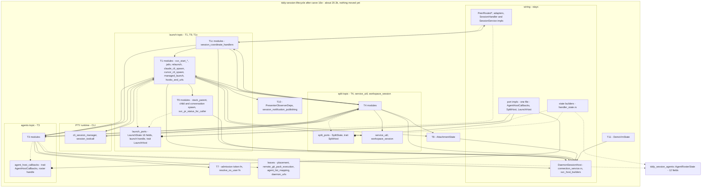

# Changeset: `tddy-session-lifecycle`'s session start, resume and coordinate handlers run over the launch ports, completing the in-place conversion

**Date**: 2026-09-26
**Status**: 📋 Planned. Awaiting the developer's review of D1
**Type**: Refactor (in-place port restructure; no crate moves; no behaviour change)
**Stack**: `#carve` 20/21, branch `feature/carve/lifecycle-ports-launch-start`, on top of `#carve` 19
(`feature/carve/lifecycle-ports-launch-spawns`). Plan label **16e** (M7b + M8)

Nodes are named by their plan label: 16a–16e are the five in-place conversion nodes (`#carve`
16–20), and 17 is the move node (`#carve` 21).

## Affected Packages

- **`tddy-session-lifecycle`**: the last host-bound topic code is converted in place onto the launch
  ports: **M7b**, the start/resume half of T1 (`start_session_core` and its branches, the Claude CLI
  resume, project provisioning), and **M8**, the T1c session coordinate handlers (list, start,
  stream-start, connect, resume, signal, delete, snapshot). The `SessionHandler` / `SessionService`
  impls and the `SplitHost` impl re-point to the launch handle. Public API and facades are unchanged.
- **Receivers**: none touched.
- **Consumers** (`tddy-daemon-rpc`, `tddy-daemon`, `tddy-telegram-control`, `tddy-desktop`): **none
  is edited.**

## Related Feature Documentation

None: this is a behaviour-preserving restructure. There is no PRD.

## Summary

This node finishes the in-place conversion of `tddy-session-lifecycle`. It converts the top of the
launch topic (2,521 production lines at `9d464a8e`):
- **M7b (1,755 lines)**: `start_session_core` (358) and its CLI-branch, request-check, tool-spawn and
  workspace-branch children; `resume_claude_cli_session` (the T1 part); `ensure_project_available_for_start`
  and `spawn_project_clone`, extracted into a T1 module; `index_workspace_worktree`, extracted; the free
  T1 half of `hooks_and_urls` (imports only);
- **M8 (766 lines)**: `session_coordinate_handlers` and its `svc_resume_session` and
  `svc_signal_delete_session` children, including `stream_start_session_at_session_coordinate`'s
  task hand-off and the `session_entry_from_listing` lift.

`LaunchState` gains the nine fields only these bodies read, and the launch handle gains the split
handle and `PresenterObserverDeps`. `LaunchHost` does not change.

After it, **no `impl DaemonSessionHost` block remains outside the wiring files**, every topic module
names no `DaemonSessionHost`, no wiring module and no topic above it, and the three callback traits
are each defined once and implemented once on the host. That is the state node 17 moves from.

## Background

`#carve` shrinks `tddy-session-lifecycle` into a wiring crate. `#carve` 14 destructured it and
`#carve` 15 moved the host-free leaves out. The rest was host-bound: each method's head, its host
calls and its `self.clone()` hand-offs bind it to `DaemonSessionHost`.

On 2026-09-26 the developer split the remaining work into an in-place conversion, reviewed as a
restructure and guarded by the baseline, and a move node. The conversion is cut by topic into five
linear nodes, leaves first:
- 16a: the port-free cuts and the leaf topics (T7, T8, T10, T11);
- 16b: T3 agents (`AgentRosterState`, `AgentHostCallbacks`);
- 16c: T4 split, `service_util`, `workspace_session` (`SplitState`, `SplitHost`);
- 16d: T9 stack spawns and the jail and CLI-spawn half of T1 (`LaunchState`, `LaunchHost`);
- **16e (this): the start/resume half of T1 and T1c**.

The T1 halves were defined from the per-file inventory and checked against the call graph at
`9d464a8e`: no jail or CLI-spawn body calls a start/resume host method, so 16d converted its half
first and this node's methods called it through the launch handle meanwhile.

## Responsibility

- Add the nine remaining fields to `LaunchState` and the split handle and `PresenterObserverDeps` to
  the launch handle; extend the builder.
- **M7b**: convert `svc_start_session_core.rs` and its children, the T1 part of
  `svc_resume_claude_cli_session.rs`; `extract_module` the T1 methods out of
  `svc_resolve_listed_worktree.rs` (`ensure_project_available_for_start`, `spawn_project_clone`) and
  `svc_ensure_session_room_for_agents.rs` (`index_workspace_worktree`) into T1 modules and convert them;
  re-point `hooks_and_urls.rs`'s imports.
- **M8**: convert the five coordinate handlers and their two children; `stream_start_…`'s
  `self.clone()` becomes a launch-handle clone; lift `session_entry_from_listing` as a free function.
- Re-point the wiring callers: the nine `SessionHandler` / `SessionService` entries
  (`svc_session_lifecycle_ports.rs`) and the `SplitHost` impl's `start_workspace_session` and
  `delete_session` go to the launch handle.
- Leave **no** `impl DaemonSessionHost` method outside wiring, except delegators a consumer or a test
  calls, which live in wiring files.
- Hold the baseline, and the full acceptance set A1–A8 over every topic.

## Boundaries

- **No crate moves.** Nothing leaves `tddy-session-lifecycle`, and no module is re-exported from
  another crate. Moving is node 17's (`#carve 21`), and only with the `tddy-tools restructure` engine: a refusal
  means stop and ask; hand edits after a move are build corrections only, with a todo per new cause.
- **No behaviour change.** The node holds the baseline on its own: 562 passed, the same 22 failures by
  name, 1 ignored (see "Baseline").
- **Public `tddy_session_lifecycle::…` paths stay reachable.** No consumer crate is edited
  (`tddy-daemon-rpc`, `tddy-daemon`, `tddy-telegram-control`, `tddy-desktop`). The exception is a
  test that reads lifecycle source by path.
- **No receiver may depend on lifecycle, and each stays at or under 10k** production lines (checked
  in node 17; nothing is added to a receiver here beyond what this node's Scope names).
- **No new crate edges.** A new edge needs the developer's approval; none is added in this node.
- **`PeerRouted*`, the port adapters, the terminal adapter and bridge stay** in lifecycle as wiring.
- **The engine is used where it can do the extraction.** Hand conversion is allowed, because this
  node **is** the restructure. It is still restricted:
  - it may re-point a field read (`self.x` → `state.x`) or a host call (`self.m(…)` →
    `host.m(…)` or a topic function);
  - it may change a signature to take the state and port, and turn a host hand-off into a handle clone;
  - it never re-types logic, never reorders statements and never drops a comment.
- **No deduplication and no functional refactor.** DRY #1 (the shared jail launch) stays deferred.
- **No receiver edit.** No new crate is created.
- **`LaunchHost` is not changed.** No callback is added to any trait; the `SplitHost` impl only
  re-points its bodies, in wiring.
- **Not changed here:** 16d's T9 and jail/CLI-spawn functions, 16c's T4 functions, 16b's T3 functions,
  16a's leaf topics.
- **Nothing is moved:** the receivers are filled only in node 17.

## Dependencies

What each parent PR delivers that this PR consumes. These surfaces are **theirs to create**.
Implementing one here collides with the PR that owns it.

| Parent node | What it delivers | How this PR consumes it | This PR does NOT |
|---|---|---|---|
| **16d** `#carve` 19, lifecycle-ports-launch-spawns (`feature/carve/lifecycle-ports-launch-spawns`) | `launch_ports`: `LaunchState` (7 fields), the owned launch handle (with the roster handle and `AttachmentState`), `trait LaunchHost` = {`sandbox_rpc_handler`, `pr_stack`} and its host impl; T9 and the jail/CLI-spawn half of T1 converted (`start_sandboxed_claude_cli_session`, `start_sandboxed_cursor_cli_session`, `resume_sandboxed_claude_cli_session`, `start_claude_cli_session`, `prepare_managed_workflow`, the stack links); `impl StackParentHost` on the handle | `cli_branch_starts` and `resume_claude_cli_session` call those functions on the handle directly (no longer via the host); this node adds fields and handles to `LaunchState` / the handle | add or re-sign a `LaunchHost` method; convert or re-shape a T9 or jail/CLI-spawn function; merge the three sandboxed launches |
| **16c** `#carve` 18, lifecycle-ports-split | `SplitState`, the split handle, `trait SplitHost: AgentHostCallbacks` and its host impl; `resume_split_wiring`, `provision_workspace_tool_sandbox`, `start_sandboxed_codebase_session`, `start_split_claude_cli_session`, `delete_paired_codebase_session`, `attached_initial_prompt` as T4 functions | `start_session_core`, `resume_claude_cli_session`, `resume_session_at_session_coordinate` and `delete_session_at_session_coordinate` call T4 through the split handle; the `SplitHost` impl's two launch re-entries re-point to this node's functions | change the `SplitHost` trait or a T4 function |
| **16b** `#carve` 17, lifecycle-ports-agents | the roster handle and the T3 functions (`agent_def_for_spawn`, `seeded_roster_records`, `unwind_seeded_roster`, `seed_session_agent_roster`, `start_hosted_agent_clone`, `ensure_session_room`, `tear_down_every_agent_clone`); `DaemonSeedCloneClaimant` on the roster handle | the start path and the handlers call T3 through the roster handle | change the roster handle or `AgentHostCallbacks` |
| **16a** `#carve` 16, lifecycle-ports (#531) | `AttachmentState` (T8), `PresenterObserverDeps` (T10), `SessionStdioEndpoint` in T1 | `tool_session_spawn` calls T8 and T10 through them | convert T8 or T10 |

## Draft PR contract

This is a mechanical restructure, the first of the pr-stack skill's two named exceptions ("a purely
mechanical rename / move / extraction with no behaviour change"). The draft is this plan. There are
no new failing tests. The contract is:
- the baseline, re-run after every milestone of this node at the same numbers by name;
- the 16e acceptance checks A1–A9, the whole conversion (see "Acceptance graph — after this node").

Those checks are greps plus a scripted run. They become a shape test only if the developer reverses
the 2026-09-25 "no shape tests" decision (D11).

## Green wave

**Wave:** after 16d.
**Greenable independently:** **no.** It extends 16d's `LaunchState` and handle, and its bodies call 16d's
converted launch functions; without 16d they would call the host.
**Concurrent with:** nothing.
**Blocks:** 17, which moves only what 16a–16e made movable.

Real dependency edges: `16a → 16b → 16c → 16d → 16e → 17`.

## Prerequisites

The scan followed `deferred-work/references/planning-cross-check.md`. No record in
`packages/tddy-session-lifecycle/docs/code-issues/` carries `Claimed by:`. The rows below touch M7b or
T1c.

### Code issues (`packages/tddy-session-lifecycle/docs/code-issues/`)

| Item | Verdict | What this change does about it |
|---|---|---|
| `complexity-svc-start-session-core-start-session-core.md` (358, fully covered) | ⚠ **During** | Converted here. It must not grow. Fully covered, so the baseline guards it |
| `complexity-svc-resume-claude-cli-session-resume-claude-cli-session.md` (119, **9 parameters**) | ⚠ **During**, at risk | **Recipe A (free functions) adds a `state` and a `host` parameter: 9 → 11, which worsens the record.** Recipe B (a method on the launch handle) keeps 9. See D1 |
| `complexity-svc-resume-session-resume-session-at-session-coordinate.md` (137) | ⚠ **During** | Converted in M8. It must not grow |
| `complexity-svc-resolve-listed-worktree-ensure-project-available-for-start.md` (99, nesting 8) | ⚠ **During**; ℹ **Answered** | **Reclassified T3 → T1** (its only caller is `provision_project_for_start`, T1). Extracted into a T1 module and converted here. The pilot's "`tddy-spawn` edge on session-agents" blocker disappears: it goes to `tddy-agent-launch` in node 17, which needs `tddy-spawn` anyway |
| `complexity-daemon-rpc-handler-handle-rpc.md` | — Unrelated | Wiring that stays. Not touched |

### TODOs (`docs/dev/todo/`)

| Item | Verdict | What this change does about it |
|---|---|---|
| [`session_entry_from_listing` not started](../todo/2026-09-24-lifecycle-session-entry-from-listing-not-started.md) | ✅ **RESOLVED HERE** if M8 lands it | M8 converts `list_sessions_at_session_coordinate`. The mapping reads nothing from `self`, so it is lifted as the free function the todo names. The todo is deleted at wrap |
| [lifecycle functions still over 150 lines](../todo/2026-09-24-lifecycle-functions-still-over-150-lines.md) | ⚠ **During** | `start_session_core` (358) must not grow |
| [lifecycle files over the 400-line target](../todo/2026-09-24-lifecycle-files-over-the-400-line-target.md) | ⚠ **During** | `svc_start_session_core.rs` (455) and `session_coordinate_handlers.rs` (414) re-measured; none may reach 500 |
| [restructure has no operation to read a method's fields through a state parameter](../todo/2026-09-25-restructure-has-no-operation-to-read-a-methods-fields-through-a-state-parameter.md), [no signature operations](../todo/2026-09-24-restructure-has-no-signature-operations.md) | ℹ / ⚠ **During** | Done by hand here; each signature or `impl` header change listed in the commit |
| [move-to-crate reads an import reaching the destination as an edge](../todo/2026-09-25-restructure-move-to-crate-reads-an-import-reaching-the-destination-as-an-edge.md) | ⛔ **Blocking for node 17**; mitigated here | **Check A4** over every topic, now complete |
| [extract drops comments…](../todo/2026-09-24-restructure-extract-drops-comments-and-writes-clippy-failing-signatures.md), [apply leaves the lint gate red](../todo/2026-09-24-restructure-apply-leaves-the-lint-gate-red.md), [verify cannot exit zero for an extract module](../todo/2026-09-18-restructure-verify-cannot-exit-zero-for-an-extract-module.md) | ⚠ **During** | The two `extract_module` runs meet them; clippy and fmt after each milestone; `verify` accounted by hand |

## Scope

- [ ] **M7b.1 state**: `LaunchState` gains `hosted_agent_clones`, `peer_routing`, `rpc_activity`,
  `session_admissions`, `session_agent_inference`, `session_rooms`, `spawn_client`, `user_resolver`,
  `workspace_sandboxes` (16 in total); the launch handle gains the split handle and
  `PresenterObserverDeps`; the builder fills them
- [ ] **M7b.2 extract**: `extract_module` `ensure_project_available_for_start` + `spawn_project_clone`
  (185) out of `svc_resolve_listed_worktree.rs`, and `index_workspace_worktree` (22) out of
  `svc_ensure_session_room_for_agents.rs`, into T1 modules
- [ ] **M7b.3 convert** `svc_start_session_core.rs` and `cli_branch_starts`, `start_request_checks`,
  `tool_session_spawn`, `workspace_branch_start`; the T1 part of `svc_resume_claude_cli_session.rs`;
  the two extracted modules. `tool_spawn_plan` and `hooks_and_urls.rs`'s T1 part: imports only
- [ ] **M7b.4 re-point** the `SplitHost` impl's `start_workspace_session` to the launch handle's
  `start_session_core`
- [ ] **M8.1 convert** `session_coordinate_handlers.rs` (5 methods), `svc_resume_session.rs`,
  `svc_signal_delete_session.rs`; `stream_start_…`'s `self.clone()` → a launch-handle clone; lift
  `session_entry_from_listing`
- [ ] **M8.2 re-point** the `SessionHandler` / `SessionService` impls (`svc_session_lifecycle_ports.rs`)
  and the `SplitHost` impl's `delete_session` to the launch handle
- [ ] **M8.3 sweep**: `grep -rn 'impl DaemonSessionHost'` lists only wiring files; every remaining
  method there is a builder, an accessor, a port impl or a delegator a consumer or test calls
- [ ] **Baseline** after each of M7b and M8: 562 / 22 / 1, the same 22 by name; `tddy-session-agents`
  at its count. clippy and fmt clean on lifecycle. `cargo check --all-targets` clean on lifecycle,
  `tddy-session-agents`, `tddy-daemon-rpc`, `tddy-daemon`, `tddy-telegram-control`
- [ ] **Acceptance checks** A1–A9 over every topic
- [ ] `restructure verify --against <16d tip>`: every statement accounted for

**Status indicators**: `[ ]` not started · `[~]` in progress · `[x]` complete ✅

## Technical changes

### State A (16d's tip)

Everything but the start/resume half of T1 and T1c is converted. `AgentHostCallbacks`, `SplitHost` and
`LaunchHost` exist with their host impls; `LaunchState` has seven fields. The `SessionHandler` /
`SessionService` impls and the `SplitHost` impl's two launch re-entries still call host methods.

### State B (after this node): the end of the in-place conversion

About **20.3k–20.4k** production lines: the 20,041 of `#carve` 15's close plus ~300 of state, traits,
impls and handle plumbing across 16a–16e, measured at wrap. No module outside wiring names
`DaemonSessionHost`. The topic files keep their paths, except the four re-parented in 16a and the
modules 16a–16e created (`peer_session_answer`, `daemon_urls`, `session_notification_publishing`,
`agent_host_callbacks`, `split_ports`, `launch_ports`, and the extracted T4 and T1 modules).

### Per-file inventory: M7b, the start/resume half of T1 → `tddy-agent-launch` (1,755 lines)

The columns are:
- **This node**: what this node does. It names the state the body reads and the callback methods it
  calls. "No change" means the file is already free of the host.
- **Node 17**: the engine operation in the move node (`#carve 21/21`).
- **Blockers**: what stands in the way.

Abbreviations: **LS** `LaunchState`, **AR** `AgentRosterState` (with its owned handle), **SS**
`SplitState`, **AS** `AttachmentState`; **LH** `LaunchHost`, **AHC** `AgentHostCallbacks`, **SH**
`SplitHost`. Paths are under `packages/tddy-session-lifecycle/src/`, and `cs/` is
`connection_service/`. Line counts are production lines at `9d464a8e` (any line of a `src/` file
outside an inline `#[cfg(test)] mod x { … }` block; `connection_service/*_tests.rs` files count as
test code).

| File | Lines | This node | Node 17 | Blockers |
|---|---:|---|---|---|
| `cs/svc_start_session_core.rs` | 455 | `start_session_core` (358) → LS. It calls T3 (`agent_def_for_spawn`, `seeded_roster_records`, `unwind_seeded_roster`) through the roster handle, T4 (`start_sandboxed_codebase_session`, `start_split_claude_cli_session`, `provision_workspace_tool_sandbox`) through the split handle, and T8 (`prepare_session_attachments`) through AS. `seed_clone_claimant` comes from the roster handle | cluster move with T1 | code issue (358) |
| `cs/svc_start_session_core/cli_branch_starts.rs` | ~200 | 6 methods → LS (`attached_initial_prompt` already moved to T4 in 16c). Its sandboxed calls go to 16d's functions on the handle | with T1 | — |
| `cs/svc_start_session_core/start_request_checks.rs` | 98 | 4 methods → LS (`config`, `peer_routing`, `tddy_data_dir`) | with T1 | — |
| `cs/svc_start_session_core/tool_session_spawn.rs` | 228 | `spawn_tool_session`, `spawn_tddy_coder` → LS (`spawn_client`). It calls T10 through `PresenterObserverDeps` and T8 through AS | with T1 | — |
| `cs/svc_start_session_core/tool_spawn_plan.rs` | 67 | no change (free); imports | with T1 | — |
| `cs/svc_start_session_core/workspace_branch_start.rs` | 122 | 3 methods → LS. It calls T3 (`seed_session_agent_roster`, `start_hosted_agent_clone`, …) and `workspace_session` (split topic) | with T1 | — |
| `cs/svc_resume_claude_cli_session.rs` (T1 part; the T4 part left in 16c) | 172 | `resume_claude_cli_session` (119) → LS. It calls T4 `resume_split_wiring` through the split handle and 16d's `resume_sandboxed_claude_cli_session` | with T1 | code issue (9 params, D1) |
| `cs/hooks_and_urls.rs` (T1 part) | ~186 | no change (free: `effective_spawn_branch`, `claude_cli_participant_metadata`, `spawned_branch_of_session`, `resolve_resume_session_claude_binary`); imports | with T1 | `effective_spawn_branch` is read by `tddy-daemon-rpc` through the facade (kept) |
| `svc_resolve_listed_worktree.rs` (T1 part) → a T1 module | 185 | `ensure_project_available_for_start` (99), `spawn_project_clone` → LS (`spawn_client`, `peer_routing`); extracted (M7b.2) | `extract_module` here | code issue (99, nesting 8) |
| `svc_ensure_session_room_for_agents.rs` (T1 part) → a T1 module | 22 | `index_workspace_worktree` → LS; extracted (M7b.2) | `extract_module` here | — |

(`cli_branch_starts.rs` was 220 at `9d464a8e`; ~20 lines of `attached_initial_prompt` left for T4 in
16c. The 1,755 total counts it at 220.)

### Per-file inventory: T1c, session coordinate handlers → `tddy-agent-launch` (766 lines)

| File | Lines | This node | Node 17 | Blockers |
|---|---:|---|---|---|
| `cs/session_coordinate_handlers.rs` | 414 | 5 methods → LS:<br>• `list_sessions_…` (129: `agent_activity_hub`, `session_agent_inference`), plus the `session_entry_from_listing` lift;<br>• `connect_…`, which calls T3 `ensure_session_room`;<br>• `get_worktree_snapshot_…`, which calls `resolve_exec_tool_worktree` and `rpc_served_by_peer` (both become state reads);<br>• `stream_start_…`: `self.clone()` into a task, which becomes a handle clone;<br>• `start_…` | with T1 | `self.clone()` (D1) |
| `…/svc_resume_session.rs` | 166 | `resume_session_at_session_coordinate` (137) → LS. It calls T1, T3 (roster handle), T4 (split handle) and T10 | with T1 | code issue (137) |
| `…/svc_signal_delete_session.rs` | 186 | `signal_…` (87) → LS. `delete_…` (72) → LS; it reads `hosted_agent_clones`, `sandbox_manager`, `session_admissions`, `session_agent_inference`, `session_rooms` and `workspace_sandboxes`, and calls T3 `tear_down_every_agent_clone` and T4 `delete_paired_codebase_session` | with T1 | — |

### Wiring re-pointed (stays in lifecycle)

| File | Lines | This node |
|---|---:|---|
| `cs/svc_session_lifecycle_ports.rs` | 166 | the nine `SessionHandler` / `SessionService` entries → the launch handle |
| the wiring ports file | — | `impl SplitHost for DaemonSessionHost`: `start_workspace_session` → the handle's `start_session_core`; `delete_session` → the handle's `delete_session_at_session_coordinate` |
| `cs/handler_state.rs` | 114 | the launch builder fills 16 fields and the two new handles |

### `LaunchState` / `LaunchHost` (complete after this node)

| | Content |
|---|---|
| Fields (16) | from 16d: `config`, `tddy_data_dir`, `claude_cli_manager`, `task_registry`, `sandbox_manager`, `session_stdio`, `agent_activity_hub`; **added here**: `hosted_agent_clones`, `peer_routing`, `rpc_activity`, `session_admissions`, `session_agent_inference`, `session_rooms`, `spawn_client`, `user_resolver`, `workspace_sandboxes` |
| Handles | roster handle and `AttachmentState` (16d); **added here**: the split handle (`SplitState` + `SplitHost`) and `PresenterObserverDeps` |
| `LH::sandbox_rpc_handler`, `LH::pr_stack` | unchanged from 16d |
| Owned variant | the fourth hand-off, `stream_start_session_at_session_coordinate`'s task, clones it |

The nine added fields were grepped over the M7b and T1c files at `9d464a8e` (`self.<field>`,
including across line breaks). Re-grep at M7b.1; a field nothing reads is not added.

### Cross-topic calls this node must leave

| From | To | Allowed after 16e |
|---|---|---|
| T1 / T9 / T1c | CLI, T4/SU/WS (split handle), T3 (roster handle), T8 (AS), T10 (`PresenterObserverDeps`), T7, leaves | ✔ (all below) |
| T1 / T9 / T1c | wiring (`sandbox_rpc_handler`, `pr_stack`) | → **LH** |
| T1 / T9 / T1c | wiring (routing delegations) | → state reads |
| wiring (`SessionHandler` / `SessionService`, 9) | T1c | ✔ through the launch handle |
| wiring (`SplitHost` impl) | T1, T1c | ✔ (wiring may call any topic) |
| every lower topic | T1 / T9 / T1c | ✗ must not exist |

### Conversion recipe

1. **Define the topic's state** (borrowed, plus an owned variant or handle where a hand-off needs
   `'static`) **and its callback trait**, in a ports module of that topic. They are hand-written.
2. **Implement the trait on `DaemonSessionHost`** in the wiring ports file (one file for every
   callback-trait impl), and **add the builder** to `connection_service/handler_state.rs`.
3. **Convert each method.** Try the engine first (`extract_method` over the `self`-free tail, then
   `extract_variable` hoists). Otherwise convert by hand under Boundaries' edit rule:
   - `self.<field>` → `state.<field>` (or, under D1's Recipe B, `self.<field>` on the handle,
     unchanged);
   - a routing delegation → `state.peer_routing.<m>(…)`;
   - a cross-topic host call → the topic function with its state;
   - a wiring capability → `host.<callback>(…)`;
   - `self.clone()` into a task → a handle clone.
4. **Re-point wiring callers** (adapters, `SessionHandler`) to the topic function. Keep a
   `DaemonSessionHost` delegator, in a wiring file, only where a consumer or a test calls the method.
5. **Re-point imports** to defining crates (A4).
6. **Gates:** `cargo check --all-targets` on lifecycle, `tddy-session-agents`, `tddy-daemon-rpc`,
   `tddy-daemon` and `tddy-telegram-control`; clippy (`-D warnings`) and `fmt --check` on lifecycle;
   the baseline; the acceptance checks for the topics converted so far; `restructure verify`.

### Callers and visibility

| | |
|---|---|
| External importers | none change. No path moves here |
| Facade | none added. Existing `pub use` lines untouched |
| Delegators kept | every public host method a consumer calls (`demo_vm_entry`, the accessors, builders and service entries), and `split_forward_deadline`, `sandbox_sessions`, `rpc_families` (lifecycle's own tests), in wiring files |
| Visibility | nothing widens across a crate. Node 17 does the `pub(crate)` → `pub` widening that crossing a crate requires |

### Baseline

Recorded on 16d's tip, and the acceptance criterion after M7b and after M8:

```bash
./dev cargo test -p tddy-session-lifecycle --no-fail-fast -- --test-threads=1 \
  --skip sandboxed_bash_pty_action_streams_output
```

Expected: **562 passed, 22 failed, 1 ignored**, the same 22 by name. The flaky
`session_room_acceptance::the_first_connect_makes_the_sessions_terminal_drivable_over_livekit`
passes when re-run alone, so it is not a regression.

| Suite | Known red (macOS) | Cause |
|---|---|---|
| `sandbox_behavior_acceptance` (5) | `sandboxed_session_streams_demo_tui_dimensions_in_terminal`, `sandboxed_session_spawn_manifest_records_session_channel_egress`, `sandboxed_session_relays_claude_llm_egress_via_session_channel`, `sandboxed_session_denies_direct_outbound_network_from_jail`, `sandboxed_session_child_is_alive_after_demo_tui_start` | `sandbox RPC bridge not installed — runtime must call install_sandbox_rpc_bridge` |
| `sandboxed_claude_cli_acceptance` (5) | `sandboxed_claude_cli_start_persists_metadata_and_empty_livekit`, `sandboxed_claude_cli_connect_session_returns_empty_livekit`, `sandboxed_claude_cli_terminal_io_round_trips`, `sandboxed_claude_cli_tool_exec_via_ipc_reads_host_worktree`, `sandboxed_claude_cli_start_wires_specialized_agents_env_and_metadata` | same |
| `sandboxed_cursor_cli_acceptance` (4) | `sandboxed_cursor_cli_start_persists_metadata_and_empty_livekit`, `sandboxed_cursor_cli_connect_session_returns_empty_livekit`, `sandboxed_cursor_cli_terminal_io_round_trips`, `sandboxed_cursor_cli_start_wires_specialized_agents_env_and_metadata` | same |
| `sandboxed_session_lifecycle_acceptance` (2) | `delete_sandbox_session_stops_child_and_removes_directory`, `resume_sandbox_session_respawns_and_updates_pid` | same |
| `session_sync_livekit_acceptance` (6) | `mirrors_a_file_the_agent_wrote_without_a_commit`, `mirrors_an_edit_to_an_existing_file`, `removes_a_file_the_agent_deleted`, `mirrors_binary_content_byte_for_byte`, `follows_the_session_head_when_the_agent_commits`, `restores_a_mirror_that_was_corrupted_by_hand` | `tddy-remote-git-repo is not built`, then `Once instance has previously been poisoned` |

Also run: `./dev cargo test -p tddy-session-agents` (72 passed on #526's base; any test this stack adds
there is counted on top).

**What the baseline cannot guard.** The 16 sandboxed failures above never execute the sandboxed
start, relaunch and delete paths on macOS. Where this node converts one of them, its preservation is
argued from:
- compiling;
- the edit rule (Boundaries);
- **Linux CI's run** of the same suites (`scripts/ci-status.sh --failures` on the PR).

## Acceptance graph — after this node

The end of the in-place conversion: lifecycle's module layout, every topic converted, nothing moved
crate. Edge legend: `-->` direct call (allowed); `-.->` through a port or state; `--o` implements;
`--x` **must not exist**.



### Acceptance criteria for 16e, and how each is checked

The **converted file set** is now every topic file: T1 (M7a and M7b), T9, T1c, T4/SU/WS, CLI, T3, T8,
T7, T10, T11 and the leaves. Wiring files are the only ones excluded.

| # | Criterion: what must **not** exist | How to check |
|---|---|---|
| A1 | No file in any topic names `DaemonSessionHost`, as a type, an `impl` or a method call. Delegators live only in wiring files | `grep -n 'DaemonSessionHost' <files> \| grep -v '^\S*:\s*//'` is empty |
| A2 | No file in any topic names a wiring module: `connection_service`'s own items, `svc_*_ports`, `handler_state`, `svc_host_builders`, `rpc_families`, `PeerRouted*`, `DaemonRpcHandler`, or `test_util` outside `#[cfg(test)]` | a grep of each file for `super::(super::)?(DaemonRpcHandler\|PeerRouted\|handler_state\|svc_host_builders\|…)`, `crate::rpc_families` and `crate::test_util` outside test modules; empty |
| A3 | No upward topic edge: T3 ↛ T4 / SU / WS / T1 / T9 / T1c / CLI; T4/SU/WS ↛ T1 / T9 / T1c; CLI ↛ any topic; T7, T8, T10, T11 and the leaves ↛ any other topic (T10 → `session_notification_publishing` allowed) | a scripted grep: for each converted topic's files, collect `crate::…`, `super::…` and `crate::connection_service::…` module targets, map each to its topic by the inventory, and fail on any pair outside the allowed DAG. Optionally `cargo modules dependencies --lib -p tddy-session-lifecycle`, if installed |
| A4 | Files in any topic name foundations and receivers **by their defining crate** (`tddy_daemon_kernel::config::…`, `tddy_daemon_livekit::session_room::…`), never through a lifecycle facade; a lower topic is named by its own module path | `grep -nE 'crate::(config\|relay_idle\|livekit_peer_discovery\|session_room\|peer_routing\|session_admission_service\|context_files\|context_sync\|session_attachments\|session_reader\|session_deletion\|user_sessions_path\|session_agent_[a-z]+\|project_storage\|branch_intent\|pty_runtime\|host_session_service)\b' <files>` is empty |
| A5 | No file in any topic clones the host. Hand-offs clone the topic's owned handle | follows from A1, plus `grep -n 'Arc::new(self.clone())'` in those files is empty |
| A6 | The three callback traits are each defined once, in their topic's ports module, and implemented once, on `DaemonSessionHost`, in the wiring ports file: `AgentHostCallbacks` (16b), `SplitHost: AgentHostCallbacks` (16c) and `LaunchHost` = {`sandbox_rpc_handler`, `pr_stack`} (16d), each with only its approved methods and unchanged by this node | `grep -rn 'trait AgentHostCallbacks\|trait SplitHost\|trait LaunchHost'` gives one hit each; `grep -rn 'impl .*\(AgentHostCallbacks\|SplitHost\|LaunchHost\) for DaemonSessionHost'` gives one hit each, all in wiring; `git diff <16d tip> -- <the three ports files' trait blocks>` is empty |
| A7 | The public API is unchanged: no consumer edit, and every facade still resolves | `git diff <base> -- packages/tddy-daemon-rpc packages/tddy-daemon packages/tddy-telegram-control packages/tddy-desktop` is empty, and `cargo check --all-targets` is clean on lifecycle, `tddy-session-agents`, `tddy-daemon-rpc`, `tddy-daemon` and `tddy-telegram-control` (`tddy-desktop` on CI: it embeds the web bundle) |
| A8 | Behaviour: the baseline | 562 passed, the same 22 by name, 1 ignored, after M7b and after M8; `tddy-session-agents` at its count. `restructure verify --against <base>` accounted |
| A9 | No `impl DaemonSessionHost` block outside wiring | `grep -rln 'impl DaemonSessionHost\|impl .* for DaemonSessionHost' packages/tddy-session-lifecycle/src` lists only wiring files (the "stays" set: `connection_service.rs`, `handler_state.rs`, `svc_host_builders*`, the `svc_*_ports` and adapter files, the wiring ports file, `svc_resolve_os_user.rs`'s wiring part, `local_exec_tool_dispatch.rs`, the `agent_roster` wiring file, `daemon_rpc_handler.rs`, `svc_shut_down_children.rs`) |

## Decisions & trade-offs

Settled by the developer (2026-09-26), carried here:
- The work is cut into five in-place conversion nodes, 16a–16e (`#carve` 16–20), and one move node,
  17 (`#carve` 21). Node 17 could be cut one receiver per node later.
- Engine moves only across crates, and a refusal means stop and ask.
- New edges need approval. No receiver may depend on lifecycle.
- Each crate stays at or under 10k. Consumers stay unedited. Facades are kept.
- `AgentHostCallbacks` = {`worktree_snapshot`, `run_exec_tool_locally`, `local_exec_tools`} is
  approved. The seven further methods the pilot listed are not.
- `PeerRouted*` stays.

### Open decisions this node needs

- **D1: how the conversion is shaped, and the `self.clone()`-to-task hand-offs.** Twelve methods in
  the whole conversion hand the whole host to something `'static`:
  - T3: `claim_agent_clone`, `claim_co_located_seed_clones`, `owned_agent_codebase_access`,
    `local_agent_codebase_access`, `ensure_session_room`;
  - T4: `join_split_livekit_room` ×2, `session_files_of_this_daemon`;
  - T1: three spawn handlers and the host-session socket;
  - T1c: `stream_start_session`.

  Two options:
  - **Recipe A:** free functions over a borrowed state (`AgentRosterState<'a>`, #526's pilot shape),
    plus an owned handle (Arc clones, a `DaemonConfig` clone and `Arc<dyn …Callbacks>`) for hand-offs.
    It adds `state` and `host` parameters to every function, and it **worsens two code issues**
    (`resume_claude_cli_session`, `spawn_split_agent`: 9 → 11 parameters).
  - **Recipe B (recommended):** methods on a per-topic **owned handle** whose fields have the host's
    names, for example `impl AgentRoster { … }`. Moving a method from `impl DaemonSessionHost` to
    the handle's `impl` changes only the `impl` header. `self.config` stays `self.config`, and
    `let service = self.clone(); tokio::spawn(…)` stays **textually identical**, because the handle
    is `Clone`. Parameter counts are unchanged. Node 17 moves the type with its methods (no `E0116`).

  Recipe B's cost is building a handle per call: a `DaemonConfig` clone, which a host `self.clone()`
  already does today. Two ways to avoid even that: (i) the host keeps the handles as fields, but the
  `with_*`/`set_*` builders mutate `room_roster`, `session_rooms`, `staging_base_dir`, …, so each
  builder must update the handle too (a behaviour risk); (ii) the host's `config` becomes
  `Arc<DaemonConfig>`, a field-type change across the host.

  **Recommended: B, built per call.** Once decided for the stack's first node, every later node
  follows the same recipe.
- **D11: shape tests.** The acceptance checks are greps by default, honouring the 2026-09-25 "no
  shape tests". A shape test would make them regressions CI catches. Recommended: keep greps; revisit
  if a later node regresses an earlier node's check.

No other open decision gates this node: `LaunchHost` was settled in 16d, and the `SplitHost` impl
re-point is wiring.

**Edge approvals:** none needed. This node adds no crate edge. Every edge node 17 needs is decided
there.

## Validation results

(Empty. Filled per milestone during `/green`.)

## TODO

- [x] Create changeset: this document
- [ ] USER REVIEW: D1
- [ ] Rebase onto 16d once it is green
- [ ] Record the baseline on 16d's tip
- [ ] Implementation M7b.1–M7b.4, then M8.1–M8.3
- [ ] `/validate-changes`
- [ ] `/pr-wrap`
- [ ] Wrap documentation (`/wrap-context-docs`)

## Final Checklist

Tasks executed at wrap:

**16e acceptance (the whole conversion)**
- [ ] A1: no topic module names `DaemonSessionHost` (grep empty)
- [ ] A2: no topic module names a wiring module (grep empty)
- [ ] A3: no upward topic edge anywhere (scripted grep over the inventory's topic sets; `cargo modules` if available)
- [ ] A4: every topic module names foundations and receivers by their defining crate (grep empty)
- [ ] A5: no host clone in any topic module; the four launch hand-offs clone the launch handle (grep empty)
- [ ] A6: the three callback traits defined once and implemented once on the host in wiring, approved methods only
- [ ] A7: no consumer edit (`git diff` empty); `cargo check --all-targets` clean on lifecycle, `tddy-session-agents`, `tddy-daemon-rpc`, `tddy-daemon`, `tddy-telegram-control`
- [ ] A8: baseline 562 / 22 / 1, the same 22 by name, after M7b and after M8; `restructure verify` accounted
- [ ] A9: no `impl DaemonSessionHost` outside wiring files

**Documentation**
- [ ] `packages/tddy-session-lifecycle/docs/module-layout.md`: the full topic and ports layout after the conversion (via the changeset workflow)
- [ ] The four M7b/M8 code issues re-measured; `resume_claude_cli_session` parameters unchanged under Recipe B
- [ ] `docs/dev/todo/2026-09-24-lifecycle-session-entry-from-listing-not-started.md` deleted if M8 landed the lift
- [ ] Release-note entry in `packages/tddy-session-lifecycle/docs/changesets/` with the before and after numbers

## Successor PRs

Forward link only (parent → child):
- **17** `#carve 21/21`, `feature/carve/lifecycle-moves`: [2026-09-26-carve-lifecycle-moves.md](./2026-09-26-carve-lifecycle-moves.md), every converted topic moved into its receiver with the engine; lifecycle wiring-only
