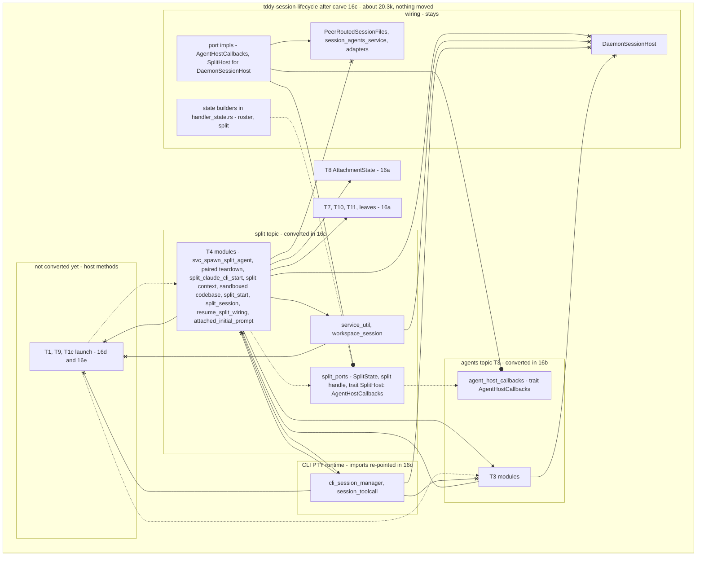

# Changeset: `tddy-session-lifecycle`'s split topic (T4, `service_util`, `workspace_session`) runs over `SplitState` and a `SplitHost` port, in place

**Date**: 2026-09-26
**Status**: 📋 Planned. Awaiting the developer's review of D1, D3 (`SplitHost`) and D5
**Type**: Refactor (in-place port restructure; no crate moves; no behaviour change)
**Stack**: `#carve` 18/21, branch `feature/carve/lifecycle-ports-split`, on top of `#carve` 17
(`feature/carve/lifecycle-ports-agents`). Plan label **16c** (M5)

Nodes are named by their plan label: 16a–16e are the five in-place conversion nodes (`#carve`
16–20), and 17 is the move node (`#carve` 21).

## Affected Packages

- **`tddy-session-lifecycle`**: every T4 `impl DaemonSessionHost` method (split agents, paired
  codebase teardown, split context, sandboxed codebase sessions) is converted in place onto a new
  `SplitState` and a `SplitHost` callback port; `service_util` and `workspace_session` join the split
  topic; the PTY runtime (`cli_session_manager` and its children, `session_toolcall`) gets its
  imports re-pointed. Public API and facades are unchanged.
- **Receivers**: none touched.
- **Consumers** (`tddy-daemon-rpc`, `tddy-daemon`, `tddy-telegram-control`, `tddy-desktop`): **none
  is edited.**

## Related Feature Documentation

None: this is a behaviour-preserving restructure. There is no PRD.

## Summary

T4 is the daemon's split-session topic: a paired agent on a sandboxed codebase, its LiveKit room,
split context from the codebase host, and teardown. With `service_util` and `workspace_session`
(which T4 and the launch topic both use, and which name `PairedAgentSession`) it is 3,044 production
lines at `9d464a8e`, all but the free files `impl DaemonSessionHost` methods.

This node converts that topic **in place**:
- its bodies read the host's fields through `SplitState` (and its owned handle, for the three
  `self.clone()` hand-offs);
- the host capabilities that are not fields go through `SplitHost: AgentHostCallbacks`:
  `start_workspace_session` and `delete_session` (the two upward re-entries into the launch topic,
  cut here), `session_files` and `session_agents` (the two wiring services, D3), and the inherited
  `worktree_snapshot` and `session_room_roster`;
- `attached_initial_prompt` moves **down** from the launch topic into T4, so T4 does not call up;
- the PTY runtime (CLI), which T4 names and which must sit below it, gets its imports re-pointed to
  defining crates.

After it, no T4 / `service_util` / `workspace_session` module names `DaemonSessionHost`, a wiring
module, or the launch topic (T1, T9, T1c); no CLI module names any topic. Node 17 can then move the
split topic into a new `tddy-session-split`, and the CLI into its own crate.

## Background

`#carve` shrinks `tddy-session-lifecycle` into a wiring crate. `#carve` 14 destructured it and
`#carve` 15 moved the host-free leaves out. The rest was host-bound: each method's head, its host
calls and its `self.clone()` hand-offs bind it to `DaemonSessionHost`, so the engine could not move
it.

On 2026-09-26 the developer split the remaining work into an in-place conversion, reviewed as a
restructure and guarded by the baseline, and a move node. The conversion is cut by topic into five
linear nodes, leaves first:
- 16a: the port-free cuts and the leaf topics (T7, T8, T10, T11);
- 16b: T3 agents, over `AgentRosterState` and `AgentHostCallbacks`;
- **16c (this): T4 split, `service_util`, `workspace_session`**;
- 16d: T9 stack spawns and the jail and CLI-spawn half of T1;
- 16e: the start/resume half of T1 and T1c.

## Responsibility

- Convert every T4 host method (files in "Technical changes"), in place, onto `SplitState` (D1).
- Define `SplitState`, its owned handle and `trait SplitHost: AgentHostCallbacks` in a T4 ports
  module (`split_ports`); implement `SplitHost` once on `DaemonSessionHost` in the wiring ports
  file; add the builder to `handler_state.rs`.
- Cut the four remaining wrong-way edges from T4 to the launch topic:
  - `start_session_core` → `SplitHost::start_workspace_session`;
  - `delete_session_at_session_coordinate` → `SplitHost::delete_session`;
  - `attached_initial_prompt` → moved into T4 (it needs `AttachmentState`, from 16a);
  - `workspace_session::PairedAgentSession` → `workspace_session` belongs to the split topic (D5).
- `extract_module` the T4 halves out of two mixed files: `resume_split_wiring` and
  `split_withdrawals_from_codebase_host` from `svc_resume_claude_cli_session.rs`;
  `provision_workspace_tool_sandbox` from `svc_ensure_session_room_for_agents.rs`.
- Re-point the free T4 files (`split_session`, `split_start`, `split_session/*`,
  `svc_resolve_tddy_tools_path`'s free fns, `service_util`, `workspace_session`, the two
  `hooks_and_urls` helpers 16a grouped with T4) and the CLI files to defining crates (A4).
- Keep a delegator, in a wiring file, for every public or test-called T4 host method
  (`split_forward_deadline` already has one), and every facade (`resolve_tddy_tools_path`,
  `service_util`'s two `pub use`, `workspace_session` through the facade `tddy-daemon` uses).
- Hold the baseline, and the acceptance checks for 16a's topics, T3, and now T4/SU/WS and CLI.

## Boundaries

- **No crate moves.** Nothing leaves `tddy-session-lifecycle`, and no module is re-exported from
  another crate. Moving is node 17's (`#carve 21`), and only with the `tddy-tools restructure` engine: a refusal
  means stop and ask; hand edits after a move are build corrections only, with a todo per new cause.
- **No behaviour change.** The node holds the baseline on its own: 562 passed, the same 22 failures by
  name, 1 ignored (see "Baseline").
- **Public `tddy_session_lifecycle::…` paths stay reachable.** No consumer crate is edited
  (`tddy-daemon-rpc`, `tddy-daemon`, `tddy-telegram-control`, `tddy-desktop`). The exception is a
  test that reads lifecycle source by path.
- **No receiver may depend on lifecycle, and each stays at or under 10k** production lines (checked
  in node 17; nothing is added to a receiver here beyond what this node's Scope names).
- **No new crate edges.** A new edge needs the developer's approval; none is added in this node.
- **`PeerRouted*`, the port adapters, the terminal adapter and bridge stay** in lifecycle as wiring.
- **The engine is used where it can do the extraction.** Hand conversion is allowed, because this
  node **is** the restructure. It is still restricted:
  - it may re-point a field read (`self.x` → `state.x`) or a host call (`self.m(…)` →
    `host.m(…)` or a topic function);
  - it may change a signature to take the state and port, and turn a host hand-off into a handle clone;
  - it never re-types logic, never reorders statements and never drops a comment.
- **No deduplication and no functional refactor.** DRY #1 (the shared jail launch) stays deferred.
- **No receiver edit.** No new crate is created (`tddy-session-split` and `tddy-cli-sessions` are
  node 17's).
- **Not in 16c:** T9 and the jail and CLI-spawn half of T1 (16d); the start/resume half of T1 and T1c
  (16e). Their host methods stay host methods, and they call T4 through the split handle the host
  builds. `LaunchHost` is **not defined** here. The CLI files get imports only, no conversion.
- **Not changed here:** 16b's `AgentHostCallbacks` and roster handle, 16a's cuts and leaf topics.
- **The PTY runtime is not deduplicated or re-shaped;** only its `use` lines change.

## Dependencies

What each parent PR delivers that this PR consumes. These surfaces are **theirs to create**.
Implementing one here collides with the PR that owns it.

| Parent node | What it delivers | How this PR consumes it | This PR does NOT |
|---|---|---|---|
| **16b** `#carve` 17, lifecycle-ports-agents (`feature/carve/lifecycle-ports-agents`) | T3 converted: `trait AgentHostCallbacks` (`worktree_snapshot`, `run_exec_tool_locally`, `local_exec_tools`, + `session_room_roster` if D2 approved) and its host impl; the owned roster handle; `AgentRosterState` with `session_admissions` and `model_registry`; `resolve_specialized_agent_defs` as a T3 function | `SplitHost: AgentHostCallbacks` extends the trait; `start_split_claude_cli_session` and `split_withdrawals_from_codebase_host` resolve defs through the roster handle; `join_split_livekit_room` uses the inherited `worktree_snapshot` and `session_room_roster` | add, remove or re-sign an `AgentHostCallbacks` method; change the roster handle or `AgentRosterState`; convert any T3 method |
| **16a** `#carve` 16, lifecycle-ports (#531) | the free `split_forward_deadline` (host method kept as a wiring delegator); `write_claude_hooks_settings` and `resolve_start_session_claude_binary` grouped with T4, and the URL trio in `daemon_urls`; `peer_has_no_such_session`, `split_pairing` and `resolve_worktree_root_for_session` moved to T3's `peer_session_answer`; `split_claude_cli_start` re-parented off the T8 file and `svc_host_builders` off `svc_resolve_tddy_tools_path.rs`; the host-constructing inline test moved out of `svc_split_context_from_codebase_host.rs`; T8's `AttachmentState` | T4 calls the free fns and `daemon_urls` directly; `attached_initial_prompt` takes `AttachmentState` | re-do a cut, re-parent a file, or convert T8 |

## Draft PR contract

This is a mechanical restructure, the first of the pr-stack skill's two named exceptions ("a purely
mechanical rename / move / extraction with no behaviour change"). The draft is this plan. There are
no new failing tests. The contract is:
- the baseline, re-run after every milestone of this node at the same numbers by name;
- the 16c acceptance checks A1–A8 (see "Acceptance graph — after this node").

Those checks are greps plus a scripted run. They become a shape test only if the developer reverses
the 2026-09-25 "no shape tests" decision (D11).

## Green wave

**Wave:** after 16b.
**Greenable independently:** **no.** `SplitHost` extends 16b's `AgentHostCallbacks`, and T4's bodies
resolve agent defs through 16b's roster handle; without 16b they would call the host (A1 fails).
**Concurrent with:** nothing.
**Blocks:** 16d (the jail starts call T4 through `SplitState`), 16e (`start_session_core` calls T4, and
the `SplitHost` impl re-points to the launch handle there), and 17.

Real dependency edges: `16a → 16b → 16c → 16d → 16e → 17`.

## Prerequisites

The scan followed `deferred-work/references/planning-cross-check.md`. No record in
`packages/tddy-session-lifecycle/docs/code-issues/` carries `Claimed by:`. The rows below touch T4,
`service_util`, `workspace_session` or the CLI.

### Code issues (`packages/tddy-session-lifecycle/docs/code-issues/`)

| Item | Verdict | What this change does about it |
|---|---|---|
| `complexity-split-claude-cli-start-start-split-claude-cli-session.md` (**146** lines) | ⚠ **During**, near the line | Converted here. **At 146 it has 4 lines of headroom under the 150 budget.** Re-pointing `self.x` → `state.x` can make `cargo fmt` re-wrap lines. Re-measure, and **stop and ask** if it crosses 150 |
| `complexity-svc-paired-codebase-teardown-delete-paired-codebase-session.md` (95) | ⚠ **During** | Converted here. Its `delete_session_at_session_coordinate` call becomes `host.delete_session(…)` (`SplitHost`). It must not grow |
| `complexity-svc-spawn-split-agent-spawn-split-agent.md` (110, **9 parameters**) | ⚠ **During**, at risk | **Recipe A (free functions) adds a `state` and a `host` parameter: 9 → 11, which worsens the record.** Recipe B (a method on the split handle) keeps 9. See D1 |

### TODOs (`docs/dev/todo/`)

| Item | Verdict | What this change does about it |
|---|---|---|
| [lifecycle files over the 400-line target](../todo/2026-09-24-lifecycle-files-over-the-400-line-target.md) | ⚠ **During** | No file may reach 500. `svc_spawn_split_agent.rs` (445), `split_session.rs` (409) and `svc_split_context_from_codebase_host.rs` (409 T4 part) are re-measured |
| [lifecycle functions still over 150 lines](../todo/2026-09-24-lifecycle-functions-still-over-150-lines.md) | ⚠ **During** | `start_split_claude_cli_session` (146) is just under the line and is re-measured |
| [restructure has no operation to read a method's fields through a state parameter](../todo/2026-09-25-restructure-has-no-operation-to-read-a-methods-fields-through-a-state-parameter.md) | ℹ **Answered** | Done by hand here, as the restructure. The todo stays open as an engine capability |
| [restructure has no signature operations](../todo/2026-09-24-restructure-has-no-signature-operations.md) | ⚠ **During** | Every conversion's signature (or `impl` header) change is listed in the commit |
| [move-to-crate reads an import reaching the destination as an edge](../todo/2026-09-25-restructure-move-to-crate-reads-an-import-reaching-the-destination-as-an-edge.md) | ⛔ **Blocking for node 17**; mitigated here | The same shapes (`super::` paths, imports through lifecycle re-exports) are all over T4. **Check A4** makes every T4 and CLI module import by the defining crate |
| [check misses a body path to a module staying behind](../todo/2026-09-25-restructure-check-misses-a-body-path-to-a-module-staying-behind.md) | ⚠ **During** (for node 17) | Checks A2/A4 are the manual version of the body-path check for T4 and CLI |
| [extract drops comments and writes clippy-failing signatures](../todo/2026-09-24-restructure-extract-drops-comments-and-writes-clippy-failing-signatures.md), [apply leaves the lint gate red](../todo/2026-09-24-restructure-apply-leaves-the-lint-gate-red.md), [extract-method traps](../todo/2026-09-25-restructure-extract-method-accepts-a-return-before-a-unit-if-tail.md), [function-local `use` left behind](../todo/2026-09-25-restructure-extract-method-leaves-a-function-local-use-behind.md) | ⚠ **During** | The two `extract_module` runs (the mixed files) meet them; corrected as before, clippy and fmt after the milestone |
| [restructure verify cannot exit zero for an extract module](../todo/2026-09-18-restructure-verify-cannot-exit-zero-for-an-extract-module.md) | ⚠ **During** | `verify --against` accounted by hand |

## Scope

- [ ] **M5.1 state and port**: `SplitState` (fields below), its owned handle (D1) and
  `trait SplitHost: AgentHostCallbacks` in `connection_service/split_ports.rs`; `impl SplitHost for
  DaemonSessionHost` in the wiring ports file (`start_workspace_session` → the host's
  `start_session_core`, `delete_session` → `delete_session_at_session_coordinate`, `session_files` →
  `PeerRoutedSessionFiles`, `session_agents` → `session_agents_service()`); the builder in
  `handler_state.rs`
- [ ] **M5.2 extract**: `extract_module` `resume_split_wiring` + `split_withdrawals_from_codebase_host`
  (100) out of `svc_resume_claude_cli_session.rs`, and `provision_workspace_tool_sandbox` (27) out of
  `svc_ensure_session_room_for_agents.rs`, each into a T4 module
- [ ] **M5.3 move down**: `attached_initial_prompt` from `svc_start_session_core/cli_branch_starts.rs`
  into T4 (D3); the launch topic's caller calls it there
- [ ] **M5.4 convert** the T4 files in the inventory below; the three `self.clone()` hand-offs become
  split-handle clones or `SplitHost` calls
- [ ] **M5.5 imports**: T4's free files, `service_util`, `workspace_session`, and the CLI files
  (`cli_session_manager` and its nine children, `session_toolcall`) name foundations by their defining
  crate (A4): `crate::pty_runtime` → `tddy_terminal_rpc::pty_runtime`, `crate::session_deletion` →
  `tddy_session_activity::…`
- [ ] **M5.6 re-point wiring callers** of T4 host methods; keep the delegators (Responsibility)
- [ ] **Baseline** after the milestone: 562 / 22 / 1, the same 22 by name; `tddy-session-agents`
  at its count. clippy and fmt clean on lifecycle. `cargo check --all-targets` clean on lifecycle,
  `tddy-session-agents`, `tddy-daemon-rpc`, `tddy-daemon`, `tddy-telegram-control`
- [ ] **Acceptance checks** A1–A8 for 16a's topics, T3, T4/SU/WS and CLI
- [ ] `restructure verify --against <16b tip>`: every statement accounted for

**Status indicators**: `[ ]` not started · `[~]` in progress · `[x]` complete ✅

## Technical changes

### State A (16b's tip)

T7, T8, T10, T11, the leaves and T3 are converted. `AgentHostCallbacks` exists with its host impl.
T4, `service_util`, `workspace_session` and everything in the launch topic are host methods or free
files that still import through lifecycle's facades.

### State B (after this node)

About 20.3k production lines (+~120: `SplitState`, the handle, `SplitHost`, its impl, delegators). No
T4/SU/WS module names the host or the launch topic. The layout is the acceptance graph below.

### Per-file inventory: T4, `service_util`, `workspace_session` → `tddy-session-split` (2,485 + 293 + 266)

The columns are:
- **This node**: what this node does. It names the state the body reads and the callback methods it
  calls. "No change" means the file is already free of the host.
- **Node 17**: the engine operation in the move node (`#carve 21/21`).
- **Blockers**: what stands in the way.

Abbreviations: **LS** `LaunchState`, **AR** `AgentRosterState` (with its owned handle), **SS**
`SplitState`, **AS** `AttachmentState`; **LH** `LaunchHost`, **AHC** `AgentHostCallbacks`, **SH**
`SplitHost`. Paths are under `packages/tddy-session-lifecycle/src/`, and `cs/` is
`connection_service/`. Line counts are production lines at `9d464a8e` (any line of a `src/` file
outside an inline `#[cfg(test)] mod x { … }` block; `connection_service/*_tests.rs` files count as
test code).

| File | Lines | This node | Node 17 | Blockers |
|---|---:|---|---|---|
| `cs/svc_spawn_split_agent.rs` | 445 | 8 methods → SS:<br>• `spawn_split_agent` (110);<br>• `spawn_split_agent_process` reads `claude_cli_manager`;<br>• `join_split_livekit_room`: **2 × `self.clone()`**, for `RemoteCheckout::new(Arc::new(self.clone()))` (becomes AHC `worktree_snapshot`, through `SplitHost`) and the room-roster closure (becomes `session_room_roster`);<br>• `agent_session_token_for` and two sites read `session_tokens()` (an SS field and a refusal fn);<br>• `split_forward_deadline` is the free fn (16a);<br>• `write_split_agent_metadata` is free.<br>It names `CliSessionManager::start_with_options` and `PtyHandle` (CLI, below) | cluster → `tddy-session-split` | code issue (110, 9 params) |
| `cs/svc_spawn_split_agent/svc_paired_codebase_teardown.rs` | 178 | `tear_down_codebase_session`, `delete_paired_codebase_session` (95) → SS, **`SH::delete_session`** (it re-enters `delete_session_at_session_coordinate`, T1c) | in the cluster | code issue (95) |
| `split_claude_cli_start.rs` (re-parented off the T8 file in 16a, under the T4 group) | 178 | `start_split_claude_cli_session` (146) → SS. It calls T3 `resolve_specialized_agent_defs` through the roster handle and `split_forward_deadline` (free) | in the cluster | code issue (146, near 150) |
| `cs/svc_split_context_from_codebase_host.rs` (T4 part) | 409 | `split_context_from_codebase_host` (132) → SS. `context_manifest_of`, `context_file_batch_of` and `session_files_of_this_daemon` hand `Arc::new(self.clone()).session_files_service()` (`PeerRoutedSessionFiles`, wiring) → **`SH::session_files`** (D3). The file's T1 part (`resume_sandboxed_claude_cli_session`, 62) stays a host method: 16d | in the cluster | mixed file (the T1 part is extracted in 16d) |
| `cs/svc_start_sandboxed_codebase_session.rs` | 267 | 4 methods → SS. `start_sandboxed_codebase_session` calls `start_session_core` → **`SH::start_workspace_session`** (the T1↔T4 cut). `reprovision_colocated_checkout_jail` calls `provision_workspace_tool_sandbox` (T4) | in the cluster | — |
| `cs/split_start.rs` | 125 | no change except imports. It names `workspace_session::PairedAgentSession` (so `workspace_session` goes to split, D5) | in the cluster | — |
| `cs/svc_resolve_tddy_tools_path.rs` | 51 | `agent_tool_socket_for_embedded_host`, `resolve_tddy_tools_path` → free fns over `tddy_data_dir`/`config`. **No `SplitHost::agent_tool_socket`** | in the cluster | `resolve_tddy_tools_path` is a public facade (kept) |
| `split_session.rs` | 400 | no change (free); imports | in the cluster | — |
| `split_session/agent_argv.rs`, `split_session/agent_credentials.rs` | 176, 113 | no change (free). `agent_argv` calls T3's `roster_replacement_pairs` (below: allowed) | in the cluster | — |
| `cs/svc_resume_claude_cli_session.rs` (T4 part) → a T4 module | 100 | `resume_split_wiring`, `split_withdrawals_from_codebase_host` → SS, **`SH::session_agents`** (`session_agents_service()`, wiring). Extracted (M5.2). The T1 part (172) stays: 16e | `extract_module` here; with the cluster in node 17 | mixed file |
| `cs/svc_ensure_session_room_for_agents.rs` (T4 part) → a T4 module | 27 | `provision_workspace_tool_sandbox` → SS (`workspace_sandboxes`, `workspace_sandbox_provisioner`). Extracted (M5.2) | `extract_module` here | mixed file |
| `attached_initial_prompt` (from `cli_branch_starts.rs`) | ~20 | moved into T4 (M5.3), over `AttachmentState` and `stack_doc_attachments` | in the cluster | T4 → T1 edge, cut by the move |
| T4's `hooks_and_urls` group (`write_claude_hooks_settings`, `resolve_start_session_claude_binary`, from 16a) | 16 + 3 | imports only | in the cluster | — |
| `cs/service_util.rs` | 293 | no change (free); imports | in the cluster | its two `pub use` (`spawn_blocking_with_timeout`, `await_supervised_with_timeout`) are read by `tddy-daemon-rpc`; the facade is kept |
| `workspace_session.rs` | 266 | no change (free; `resolve_worktree_root_for_session` left for T3 in 16a); imports | in the cluster | `tddy-daemon` reaches it through the facade |

### Per-file inventory: CLI PTY runtime (1,709 lines, imports only)

**Why it is its own topic:** T4 names `CliSessionManager`, its `start_with_options`, and `PtyHandle`
(`svc_spawn_split_agent.rs:221,424`). Split must sit below the launch topic, so the PTY runtime must
sit below split. It cannot go into `tddy-terminal-rpc`: it names `session_toolcall`
(`tddy-daemon-sandbox`, `tddy-stdio`) and `session_deletion::signal_pid` (`tddy-session-activity`).
It is converted in no node (it is host-free); this node re-points its imports because T4 is the
first topic that must name it from below.

| File | Lines | This node | Node 17 |
|---|---:|---|---|
| `cli_session_manager.rs` | 173 | no change. Imports re-pointed (A4) | `move_cluster_to_crate` → `tddy-cli-sessions` (D4), with its 9 children and `session_toolcall` |
| `cli_session_manager/{argv, control_lease, launch, livekit_bridge, livekit_terminals, pty_handle, pty_spawn, relaunch, terminals}.rs` | 83, 89, 179, 230, 99, 117, 216, 70, 206 | `pty_handle` and `pty_spawn` name `crate::pty_runtime` → `tddy_terminal_rpc::pty_runtime`; `terminals` names `crate::session_deletion` → `tddy_session_activity::…` | in the cluster |
| `session_toolcall.rs` | 247 | no change | in the cluster |

### `SplitState` / `SplitHost`

Every field and callback comes from grepping the bodies for `self.<field>`, `self.<method>(`, and the
same through a cloned handle. ✅ approved (in the original plan), ❌ not approved.

| | Content |
|---|---|
| Plan's fields | `config`, `tddy_data_dir`, `session_rooms`, `workspace_sandboxes` |
| Fields the bodies read | plan's four + **`workspace_sandbox_provisioner`**, **`claude_cli_manager`** (`spawn_split_agent_process`), **`session_tokens`** (three sites via `session_tokens()`), **`peer_routing`** (`common_room_slot` at two sites); plus the roster handle (`resolve_specialized_agent_defs`, T3) and `AttachmentState` (`attached_initial_prompt`) |
| Owned variant | needed: `join_split_livekit_room` ×2 and `session_files_of_this_daemon` hand `self.clone()` to something `'static` (D1) |
| `SH::start_workspace_session` ✅ (plan) | `start_sandboxed_codebase_session` → `start_session_core` |
| `SH::delete_session` ✅ (plan) | `delete_paired_codebase_session` → `delete_session_at_session_coordinate` |
| `SH::session_room_services` ✅ (plan) = `session_room_roster` | `join_split_livekit_room`. **Inherited** from `AgentHostCallbacks` if D2 added it there in 16b; otherwise a `SplitHost` method |
| `SH::agent_tool_socket` (plan) | **not needed**: `agent_tool_socket_for_embedded_host` is a 4-line function of `tddy_data_dir`, and it stays with T4 |
| `SH::session_files` ❌ **new** | `context_manifest_of`, `context_file_batch_of` (via `session_files_of_this_daemon` → `PeerRoutedSessionFiles`, wiring) |
| `SH::session_agents` ❌ **new** | `split_withdrawals_from_codebase_host` (calls `session_agents_service()`, wiring) |
| `SH::attached_initial_prompt` ❌ **new**, or move it | `spawn_split_agent` calls the launch topic's `attached_initial_prompt`. **Recommended: move it into T4** (the launch topic → split is the right direction), and no callback |
| remote snapshot | `RemoteCheckout::new(Arc::new(self.clone()))` → AHC `worktree_snapshot` ✅, through `SplitHost: AgentHostCallbacks` |

**The `SplitHost` impl and 16e.** `start_workspace_session` and `delete_session` delegate to host
methods that are still host methods after this node (`start_session_core`, T1;
`delete_session_at_session_coordinate`, T1c). 16e converts those and re-points the impl, in wiring,
to the launch handle. The trait does not change.

### Cross-topic calls this node must leave

| From | To | Allowed after 16c |
|---|---|---|
| T4/SU/WS | CLI (`PtyHandle`, `start_with_options`), T3 (`resolve_specialized_agent_defs`, `roster_replacement_pairs`), T8 (`AttachmentState`), `daemon_urls`, `split_forward_deadline` (free) | ✔ (all below) |
| T4/SU/WS | T1, T9, T1c | ✗ must not exist: `start_session_core` → `SH::start_workspace_session`; `delete_session_…` → `SH::delete_session`; `attached_initial_prompt` → moved down; the hooks helpers → grouped with T4 (16a); `PairedAgentSession` → `workspace_session` is split's |
| T4/SU/WS | wiring (`session_agents_service`, `session_files_service`, `session_room_roster`, remote snapshot) | → **SH** |
| CLI | any topic | ✗ must not exist |
| T3 | T4/SU/WS | ✗ (held since 16a/16b) |
| launch topic host methods (not converted yet) | T4 | ✔ through the split handle the host builds |

### Conversion recipe

1. **Define the topic's state** (borrowed, plus an owned variant or handle where a hand-off needs
   `'static`) **and its callback trait**, in a ports module of that topic. They are hand-written.
2. **Implement the trait on `DaemonSessionHost`** in the wiring ports file (one file for every
   callback-trait impl), and **add the builder** to `connection_service/handler_state.rs`.
3. **Convert each method.** Try the engine first (`extract_method` over the `self`-free tail, then
   `extract_variable` hoists). Otherwise convert by hand under Boundaries' edit rule:
   - `self.<field>` → `state.<field>` (or, under D1's Recipe B, `self.<field>` on the handle,
     unchanged);
   - a routing delegation → `state.peer_routing.<m>(…)`;
   - a cross-topic host call → the topic function with its state;
   - a wiring capability → `host.<callback>(…)`;
   - `self.clone()` into a task → a handle clone.
4. **Re-point wiring callers** (adapters, `SessionHandler`) to the topic function. Keep a
   `DaemonSessionHost` delegator, in a wiring file, only where a consumer or a test calls the method.
5. **Re-point imports** to defining crates (A4).
6. **Gates:** `cargo check --all-targets` on lifecycle, `tddy-session-agents`, `tddy-daemon-rpc`,
   `tddy-daemon` and `tddy-telegram-control`; clippy (`-D warnings`) and `fmt --check` on lifecycle;
   the baseline; the acceptance checks for the topics converted so far; `restructure verify`.

### Callers and visibility

| | |
|---|---|
| External importers | none change. No path moves here |
| Facade | none added. Existing `pub use` lines (`resolve_tddy_tools_path`, `service_util`'s two, `workspace_session`) untouched |
| Delegators kept | `split_forward_deadline` (a lifecycle test calls it; 16a's), and any T4 host method a consumer or an in-`src` test calls, as a one-line forward in wiring |
| Visibility | nothing widens across a crate. A T4 function the launch topic calls may need `pub(crate)` where the host method was `pub(in crate::connection_service)`; each widening listed in the commit |

### Baseline

Recorded on 16b's tip, and the acceptance criterion after the milestone:

```bash
./dev cargo test -p tddy-session-lifecycle --no-fail-fast -- --test-threads=1 \
  --skip sandboxed_bash_pty_action_streams_output
```

Expected: **562 passed, 22 failed, 1 ignored**, the same 22 by name. The flaky
`session_room_acceptance::the_first_connect_makes_the_sessions_terminal_drivable_over_livekit`
passes when re-run alone, so it is not a regression.

| Suite | Known red (macOS) | Cause |
|---|---|---|
| `sandbox_behavior_acceptance` (5) | `sandboxed_session_streams_demo_tui_dimensions_in_terminal`, `sandboxed_session_spawn_manifest_records_session_channel_egress`, `sandboxed_session_relays_claude_llm_egress_via_session_channel`, `sandboxed_session_denies_direct_outbound_network_from_jail`, `sandboxed_session_child_is_alive_after_demo_tui_start` | `sandbox RPC bridge not installed — runtime must call install_sandbox_rpc_bridge` |
| `sandboxed_claude_cli_acceptance` (5) | `sandboxed_claude_cli_start_persists_metadata_and_empty_livekit`, `sandboxed_claude_cli_connect_session_returns_empty_livekit`, `sandboxed_claude_cli_terminal_io_round_trips`, `sandboxed_claude_cli_tool_exec_via_ipc_reads_host_worktree`, `sandboxed_claude_cli_start_wires_specialized_agents_env_and_metadata` | same |
| `sandboxed_cursor_cli_acceptance` (4) | `sandboxed_cursor_cli_start_persists_metadata_and_empty_livekit`, `sandboxed_cursor_cli_connect_session_returns_empty_livekit`, `sandboxed_cursor_cli_terminal_io_round_trips`, `sandboxed_cursor_cli_start_wires_specialized_agents_env_and_metadata` | same |
| `sandboxed_session_lifecycle_acceptance` (2) | `delete_sandbox_session_stops_child_and_removes_directory`, `resume_sandbox_session_respawns_and_updates_pid` | same |
| `session_sync_livekit_acceptance` (6) | `mirrors_a_file_the_agent_wrote_without_a_commit`, `mirrors_an_edit_to_an_existing_file`, `removes_a_file_the_agent_deleted`, `mirrors_binary_content_byte_for_byte`, `follows_the_session_head_when_the_agent_commits`, `restores_a_mirror_that_was_corrupted_by_hand` | `tddy-remote-git-repo is not built`, then `Once instance has previously been poisoned` |

Also run: `./dev cargo test -p tddy-session-agents` (72 passed on #526's base; any test this stack adds
there is counted on top).

**What the baseline cannot guard.** The 16 sandboxed failures above never execute the sandboxed
start, relaunch and delete paths on macOS. Where this node converts one of them, its preservation is
argued from:
- compiling;
- the edit rule (Boundaries);
- **Linux CI's run** of the same suites (`scripts/ci-status.sh --failures` on the PR).

## Acceptance graph — after this node

Lifecycle's module layout after 16c. Nothing has moved crate. Edge legend: `-->` direct call
(allowed); `-.->` through a state or port; `--o` implements; `--x` **must not exist**.



`s_t4 --x routed`: T4 reaches `PeerRoutedSessionFiles` and `session_agents_service()` only through
`SH::session_files` / `SH::session_agents`, whose impls are wiring. `t1 -.-> s_t4` is the
not-yet-converted launch topic calling split through the handle the host builds.

### Acceptance criteria for 16c, and how each is checked

The **converted file set** is 16a's (T7, T8, T10, T11, the leaves), 16b's (T3), and now T4, `service_util`,
`workspace_session` and CLI: every file in this node's two inventory tables. The T1 part of
`svc_split_context_from_codebase_host.rs` (`resume_sandboxed_claude_cli_session`) is excluded by item
range until 16d extracts it.

| # | Criterion: what must **not** exist | How to check |
|---|---|---|
| A1 | No file in 16a's topics, T3, T4/SU/WS or CLI names `DaemonSessionHost`, as a type, an `impl` or a method call. Delegators live only in wiring files | `grep -n 'DaemonSessionHost' <files> \| grep -v '^\S*:\s*//'` is empty |
| A2 | No file in 16a's topics, T3, T4/SU/WS or CLI names a wiring module: `connection_service`'s own items, `svc_*_ports`, `handler_state`, `svc_host_builders`, `rpc_families`, `PeerRouted*`, `DaemonRpcHandler`, or `test_util` outside `#[cfg(test)]` | a grep of each file for `super::(super::)?(DaemonRpcHandler\|PeerRouted\|handler_state\|svc_host_builders\|…)`, `crate::rpc_families` and `crate::test_util` outside test modules; empty |
| A3 | No upward topic edge: T4/SU/WS ↛ T1 / T9 / T1c; CLI ↛ any topic; T3 ↛ T4 / SU / WS / T1 / T9 / T1c / CLI; T7, T8, T10, T11 and the leaves ↛ any other topic | a scripted grep: for each converted topic's files, collect `crate::…`, `super::…` and `crate::connection_service::…` module targets, map each to its topic by the inventory, and fail on any pair outside the allowed DAG. Optionally `cargo modules dependencies --lib -p tddy-session-lifecycle`, if installed |
| A4 | Files in 16a's topics, T3, T4/SU/WS or CLI name foundations and receivers **by their defining crate** (`tddy_daemon_kernel::config::…`, `tddy_daemon_livekit::session_room::…`), never through a lifecycle facade; a lower topic is named by its own module path | `grep -nE 'crate::(config\|relay_idle\|livekit_peer_discovery\|session_room\|peer_routing\|session_admission_service\|context_files\|context_sync\|session_attachments\|session_reader\|session_deletion\|user_sessions_path\|session_agent_[a-z]+\|project_storage\|branch_intent\|pty_runtime\|host_session_service)\b' <files>` is empty |
| A5 | No file in 16a's topics, T3, T4/SU/WS or CLI clones the host. Hand-offs clone the topic's owned handle | follows from A1, plus `grep -n 'Arc::new(self.clone())'` in those files is empty |
| A6 | `SplitHost` is defined once, in `split_ports`, as `trait SplitHost: AgentHostCallbacks`, and implemented once, on `DaemonSessionHost`, in the wiring ports file. It holds exactly {`start_workspace_session`, `delete_session`} + the D3-approved {`session_files`, `session_agents`} (+ `session_room_services` only if D2 left `session_room_roster` off `AgentHostCallbacks`). `AgentHostCallbacks` is unchanged since 16b. `LaunchHost` does not exist yet | `grep -rn 'trait SplitHost'` gives one hit; `grep -rn 'impl .*SplitHost for DaemonSessionHost'` gives one hit, in wiring; the method list matches; `git diff <16b tip> -- <agent_host_callbacks file>` is empty; `grep -rn 'trait LaunchHost'` is empty |
| A7 | The public API is unchanged: no consumer edit, and every facade still resolves | `git diff <base> -- packages/tddy-daemon-rpc packages/tddy-daemon packages/tddy-telegram-control packages/tddy-desktop` is empty, and `cargo check --all-targets` is clean on lifecycle, `tddy-session-agents`, `tddy-daemon-rpc`, `tddy-daemon` and `tddy-telegram-control` (`tddy-desktop` on CI: it embeds the web bundle) |
| A8 | Behaviour: the baseline | 562 passed, the same 22 by name, 1 ignored, after M5; `tddy-session-agents` at its count. `restructure verify --against <base>` accounted |

## Decisions & trade-offs

Settled by the developer (2026-09-26), carried here:
- The work is cut into five in-place conversion nodes, 16a–16e (`#carve` 16–20), and one move node,
  17 (`#carve` 21). Node 17 could be cut one receiver per node later.
- Engine moves only across crates, and a refusal means stop and ask.
- New edges need approval. No receiver may depend on lifecycle.
- Each crate stays at or under 10k. Consumers stay unedited. Facades are kept.
- `AgentHostCallbacks` = {`worktree_snapshot`, `run_exec_tool_locally`, `local_exec_tools`} is
  approved. The seven further methods the pilot listed are not.
- `PeerRouted*` stays.

### Open decisions this node needs

- **D1: how the conversion is shaped, and the `self.clone()`-to-task hand-offs.** Twelve methods in
  the whole conversion hand the whole host to something `'static`:
  - T3: `claim_agent_clone`, `claim_co_located_seed_clones`, `owned_agent_codebase_access`,
    `local_agent_codebase_access`, `ensure_session_room`;
  - T4: `join_split_livekit_room` ×2, `session_files_of_this_daemon`;
  - T1: three spawn handlers and the host-session socket;
  - T1c: `stream_start_session`.

  Two options:
  - **Recipe A:** free functions over a borrowed state (`AgentRosterState<'a>`, #526's pilot shape),
    plus an owned handle (Arc clones, a `DaemonConfig` clone and `Arc<dyn …Callbacks>`) for hand-offs.
    It adds `state` and `host` parameters to every function, and it **worsens two code issues**
    (`resume_claude_cli_session`, `spawn_split_agent`: 9 → 11 parameters).
  - **Recipe B (recommended):** methods on a per-topic **owned handle** whose fields have the host's
    names, for example `impl AgentRoster { … }`. Moving a method from `impl DaemonSessionHost` to
    the handle's `impl` changes only the `impl` header. `self.config` stays `self.config`, and
    `let service = self.clone(); tokio::spawn(…)` stays **textually identical**, because the handle
    is `Clone`. Parameter counts are unchanged. Node 17 moves the type with its methods (no `E0116`).

  Recipe B's cost is building a handle per call: a `DaemonConfig` clone, which a host `self.clone()`
  already does today. Two ways to avoid even that: (i) the host keeps the handles as fields, but the
  `with_*`/`set_*` builders mutate `room_roster`, `session_rooms`, `staging_base_dir`, …, so each
  builder must update the handle too (a behaviour risk); (ii) the host's `config` becomes
  `Arc<DaemonConfig>`, a field-type change across the host.

  **Recommended: B, built per call.** Once decided for the stack's first node, every later node
  follows the same recipe.
- **D3 (the part this node needs): `SplitHost` beyond the plan.**
  - `SplitHost` gains `session_files` and `session_agents` (both wiring services). It inherits
    `worktree_snapshot` (and `session_room_roster`, if D2 put it on `AgentHostCallbacks`) through
    `SplitHost: AgentHostCallbacks`, and drops the plan's `agent_tool_socket` (a free fn).
  - `attached_initial_prompt` **moves into T4** rather than becoming a callback. **Recommended.**
  - Needs approval: the two new methods.
- **D4 (informational here): a new crate `tddy-cli-sessions`** for the PTY runtime in node 17. This
  node only treats CLI as its own topic below split and re-points its imports; that is right under
  either answer. The alternative, folding the runtime into `tddy-session-split` (~4.9k), is also
  compatible with this node. Node 17 decides.
- **D5: `service_util` and `workspace_session` belong to the split topic** (→ `tddy-session-split` in
  node 17).
  - Why: both are used by the launch topic above and T4, and `split_start` names
    `workspace_session::PairedAgentSession`.
  - `resolve_worktree_root_for_session` already went to T3 (16a), because agents calls it.
  - The alternative home for `service_util` is `tddy-worktree-service`, which would gain
    `tddy-semantic-index` and `chrono`.
  - **Recommended: the split topic.**
- **D11: shape tests.** The acceptance checks are greps by default, honouring the 2026-09-25 "no
  shape tests". A shape test would make them regressions CI catches. Recommended: keep greps; revisit
  if a later node regresses an earlier node's check.

**Edge approvals:** none needed. This node adds no crate edge. (Node 17's `tddy-session-split` and
`tddy-cli-sessions` edges are listed and decided there.)

## Validation results

(Empty. Filled during `/green`.)

## TODO

- [x] Create changeset: this document
- [ ] USER REVIEW: D1, D3 (`SplitHost` methods, `attached_initial_prompt` move), D5
- [ ] Rebase onto 16b once it is green
- [ ] Record the baseline on 16b's tip
- [ ] Implementation M5.1–M5.6
- [ ] `/validate-changes`
- [ ] `/pr-wrap`
- [ ] Wrap documentation (`/wrap-context-docs`)

## Final Checklist

Tasks executed at wrap:

**16c acceptance**
- [ ] A1: no 16a-topic, T3, T4/SU/WS or CLI file names `DaemonSessionHost` (grep empty)
- [ ] A2: none of them names a wiring module (grep empty)
- [ ] A3: T4/SU/WS name no launch-topic module; CLI names no topic; the 16a/16b edges still hold (scripted grep; `cargo modules` if available)
- [ ] A4: those files, CLI included, name foundations by their defining crate (grep empty)
- [ ] A5: no host clone in a T4 file; the three hand-offs clone the split handle or call `SplitHost` (grep empty)
- [ ] A6: `SplitHost: AgentHostCallbacks` defined once, implemented once on the host in wiring, approved methods only; `AgentHostCallbacks` unchanged; no `LaunchHost` yet
- [ ] A7: no consumer edit (`git diff` empty); `cargo check --all-targets` clean on lifecycle, `tddy-session-agents`, `tddy-daemon-rpc`, `tddy-daemon`, `tddy-telegram-control`
- [ ] A8: baseline 562 / 22 / 1, the same 22 by name; `restructure verify` accounted
- [ ] `start_split_claude_cli_session` ≤ 150 lines; no touched file ≥ 500

**Documentation**
- [ ] `packages/tddy-session-lifecycle/docs/module-layout.md`: the split ports module, the two extracted T4 modules and `attached_initial_prompt`'s new home (via the changeset workflow)
- [ ] The three T4 code issues re-measured (`start_split_claude_cli_session` ≤ 150; `spawn_split_agent` parameters unchanged under Recipe B)
- [ ] Release-note entry in `packages/tddy-session-lifecycle/docs/changesets/` with the before and after numbers

## Successor PRs

Forward link only (parent → child):
- **16d** `#carve 19/21`, `feature/carve/lifecycle-ports-launch-spawns`: [2026-09-26-carve-lifecycle-ports-launch-spawns.md](./2026-09-26-carve-lifecycle-ports-launch-spawns.md), T9 stack spawns and the jail and CLI-spawn half of T1 over `LaunchState` / `LaunchHost`
