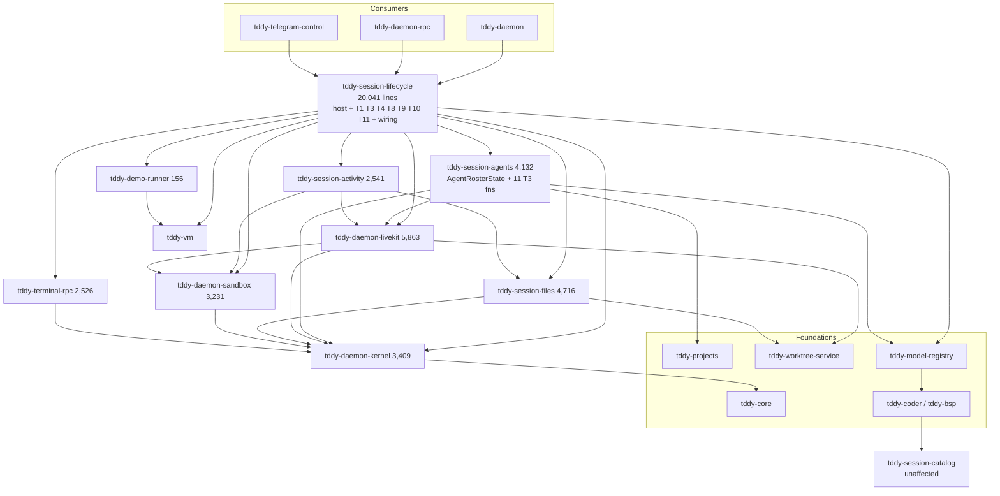
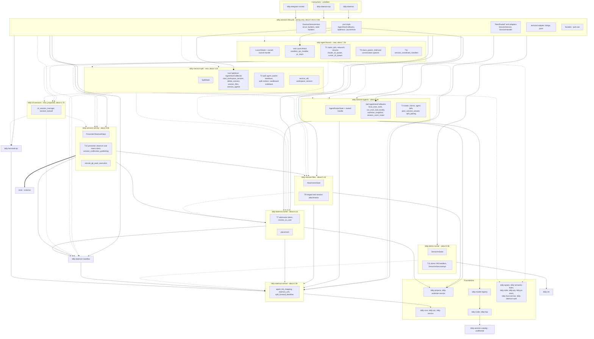
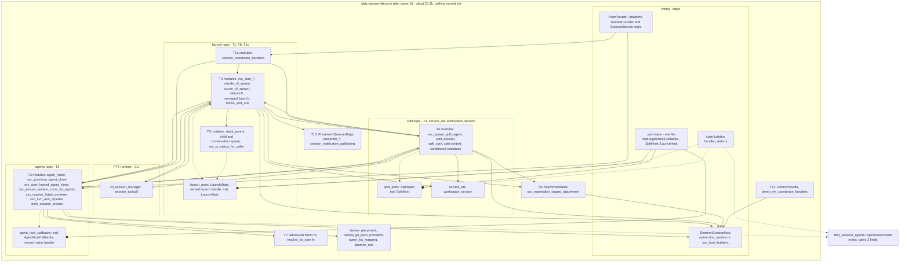
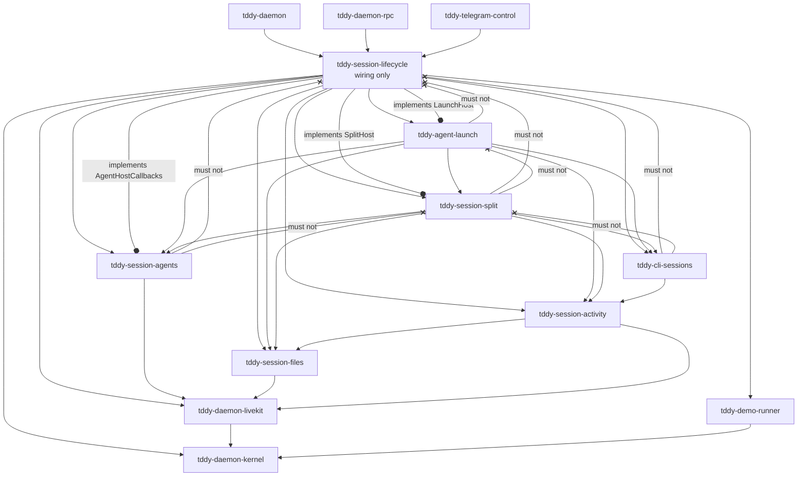

# Changeset: `tddy-session-lifecycle`'s host methods become receiver-shaped functions over per-topic state and callback ports, in place

**Date**: 2026-09-26
**Status**: 📋 Planned. Awaiting the developer's review of the open decisions (see "Decisions & trade-offs")
**Type**: Refactor (in-place port restructure; no crate moves; no behaviour change)
**Stack**: `#carve` 16/17, branch `feature/carve/lifecycle-ports`, on top of `#carve` 15 (#526, `feature/carve/lifecycle-split`)

## Initial Discovery

This node's discovery is the section [Where every part of tddy-session-lifecycle goes](#where-every-part-of-tddy-session-lifecycle-goes)
below. It was built on 2026-09-26 from the code at #526's tip `9d464a8e`, not from the plan. The
plan's premises were wrong about half the time, and they are corrected in place. The crate-wide
survey behind #524 and #526 is
[2026-09-23-carve-lifecycle-wiring-initial-discovery.md](./2026-09-23-carve-lifecycle-wiring-initial-discovery.md).

## Affected Packages

- **`tddy-session-lifecycle`**: every `impl DaemonSessionHost` method outside the wiring is converted,
  in place, into a function over a per-topic state value and a callback port. Public API and
  facades are unchanged.
- **`tddy-session-agents`**: the only receiver touched. `AgentRosterState`, which #526 created there,
  gains two fields (`session_admissions`, `model_registry`). Nothing moves into it.
- **Consumers** (`tddy-daemon-rpc`, `tddy-daemon`, `tddy-telegram-control`): **none is edited.**
  No path changes, because no crate move happens here.

## Related Feature Documentation

None: this is a behaviour-preserving restructure. There is no PRD.

## Summary

After #526, `tddy-session-lifecycle` holds **20,041 production lines**. Almost everything left
outside the wiring is `impl DaemonSessionHost` methods. They cannot leave the crate (`E0116`), and
the engine can extract only their `self`-free tails: the T3 pilot moved 11 methods for −185 lines.

This node converts those methods **in place**. Each topic gets:
- a **state value** holding the host fields its bodies read;
- a **callback trait** for the few host capabilities that are not plain fields (a service entry
  list, a peer-routed service, the start path the split re-enters);
- lifecycle's host **builds** the state and **implements** the trait.

After that, every topic module names no `DaemonSessionHost`, no wiring module and no upward topic.
`#carve 17` then moves each topic into its receiver as a plain module move.

**What stays reachable:** every public `tddy_session_lifecycle::…` path, and every public
`DaemonSessionHost` method that a consumer or a lifecycle test calls, kept as a thin delegator.
Nothing leaves the crate here, so no facade changes.

## Background

`#carve` shrinks `tddy-session-lifecycle` into a wiring crate:
- #524 (`#carve` 14) destructured it in place;
- #526 (`#carve` 15) moved the host-free leaves out.

#526's port-move pilot showed that the rest cannot be moved by the engine as it stands. Each
host method's head, its calls to other host methods and its `self.clone()` hand-offs keep it bound
to the host. On 2026-09-26 the developer split the remaining work into two nodes:
- **`#carve 16`** (this one) converts the host methods in place, reviewed as a restructure and
  guarded by the baseline. It is the "purely mechanical … extraction with no behaviour change"
  exception of the PR boundary contract.
- **`#carve 17`** moves each converted topic with the engine and carries the wiring target.

The work deferred into these two nodes:
- the demo VM (`DemoVmState`);
- T10's presenter observation;
- the host-bound remainders of T3, T7 (`svc_resolve_os_user.rs`) and T8;
- T4 (split, behind `SplitHost`);
- T1 with the stack spawns and the coordinate handlers (`LaunchHost`);
- `workspace_session`.

## Responsibility

- Convert every non-wiring `impl DaemonSessionHost` method, **in place inside lifecycle**, into a
  function (or a method of a per-topic handle, see D1) over that topic's state and callback port.
- Define each topic's state value and callback trait in the lifecycle module that `#carve 17` will
  move. The exception is `AgentRosterState`, which already lives in `tddy-session-agents`.
- Implement every callback trait once, on `DaemonSessionHost`, in a wiring file. Build every state
  from the host's fields.
- Cut every cross-topic edge that points the wrong way for the `#carve 17` crate DAG. The cuts are
  listed in "Cross-topic call matrix".
- Make every topic module **movable**:
  - it names no `DaemonSessionHost` and no wiring module;
  - it names only the topics below it;
  - it names foundations by their defining crate (acceptance checks A1–A6).
- Keep the public API: facades unchanged, and a delegator kept for every public host method a
  consumer or test calls.
- Re-run the baseline after every milestone, with zero new failures by name.

## Boundaries

- **No crate moves.** Nothing leaves `tddy-session-lifecycle`, and no module is re-exported from
  another crate. `#carve 17` does that.
- **No behaviour change.** Every milestone holds the baseline: 562 passed, the same 22 failures by
  name, 1 ignored (see "Baseline"). Code the baseline does not execute is listed in Prerequisites,
  with how its preservation is argued.
- **No consumer crate is edited.** `tddy-daemon-rpc`, `tddy-daemon` and `tddy-telegram-control` keep
  compiling unchanged. The exception is a test that reads lifecycle source by path; none is known
  for the files touched here.
- **No receiver edit except `AgentRosterState`'s two new fields.** No new crate is created.
- **No new crate edges.** Every edge `#carve 17` needs is listed for approval here, but none is added.
- **`PeerRouted*`, the port adapters, the terminal adapter and bridge stay** in lifecycle as wiring.
- **The engine is used where it can do the extraction.** Hand conversion is allowed, because this
  node **is** the restructure. It is still restricted:
  - it may re-point a field read (`self.x` → `state.x`) or a host call (`self.m(…)` →
    `host.m(…)` or a topic function);
  - it may change a signature to take the state and port, and turn a host hand-off into a handle clone;
  - it never re-types logic, never reorders statements and never drops a comment.
- **No deduplication and no functional refactor.** DRY #1 (the shared jail launch) stays deferred,
  so the three sandboxed launches are converted in parallel, line for line.
- **No re-parenting by hand without consent.** The four mixed parent/child files (Prerequisites) are
  the developer's call.

## Dependencies

What each parent PR delivers that this PR consumes. These surfaces are **theirs to create**.
Implementing one here collides with the PR that owns it.

| Parent node | What it delivers | How this PR consumes it | This PR does NOT |
|---|---|---|---|
| `15` lifecycle-split (#526, `feature/carve/lifecycle-split`) | the leaf moves (1a, 2a, 2b, T5a+T5b, host-free T7/T8/T3 parts); `tddy_session_agents::AgentRosterState<'a>` and lifecycle's `agent_roster_state()` builder; the 11 T3 functions in `tddy-session-agents` (`clone_readiness`, `agent_clone_lookup`, `spawn_agent_def`, `hosted_clone_start`, …); the eight engine fixes; the baseline 562 / 22 / 1 | converts on top of that layout; T3's converted bodies call the 11 functions and take `AgentRosterState` | re-run or undo any #526 move, move anything across a crate, or change #526's engine fixes |
| `14` destructure (#524, merged) | every file < 500, no function > 150 except the five filed, DRY #2–#13 | converts the functions #524 laid out | split, deduplicate or re-measure; the #524 todos stay theirs |

## Draft PR contract

This is a mechanical restructure, the first of the pr-stack skill's two named exceptions ("a purely
mechanical rename / move / extraction with no behaviour change"). The draft is this plan. There are
no new failing tests. The contract is:
- the baseline, re-run after every milestone at the same numbers by name;
- the #carve 16 acceptance checks A1–A8 (see "Acceptance graph — after this node").

Those checks are greps plus a scripted run. They become a shape test only if the developer reverses
the 2026-09-25 "no shape tests" decision (D11).

## Green wave

**Wave:** after #526.
**Greenable independently:** **no.** It converts the tree #526 leaves: its T3 bodies call #526's
session-agents functions, and its baseline is #526's 562 / 22 / 1. It can go green only once #526 is
green and this branch is rebased onto it.
**Concurrent with:** nothing.
**Blocks:** `#carve 17`, which moves only what this node made movable.

Real dependency edges: `#526 → #carve 16 → #carve 17`.

## Prerequisites

The scan followed `deferred-work/references/planning-cross-check.md`:
- all 11 records in `packages/tddy-session-lifecycle/docs/code-issues/`;
- every `docs/dev/todo/2026-09-24-lifecycle-*` entry;
- every `*restructure*` entry.

**No record carries `Claimed by:`** (`grep -rl 'Claimed by' packages/tddy-session-lifecycle/docs/code-issues/`
is empty), so there is no claimed-issue fork to ask about.

### Code issues (`packages/tddy-session-lifecycle/docs/code-issues/`)

| Item | Verdict | What this change does about it |
|---|---|---|
| `complexity-cursor-cli-spawn-spawn-cursor-cli-session-inner.md` (244 lines, T) | ⚠ **During** | Already a free function, so it is not converted. Only imports are re-pointed (A4). It must not grow. `#carve 17` moves it into `tddy-agent-launch` and re-measures |
| `complexity-daemon-rpc-handler-handle-rpc.md` (147 lines, nesting 8) | — Unrelated | Wiring that stays (a port impl). Not touched here |
| `complexity-split-claude-cli-start-start-split-claude-cli-session.md` (**146** lines) | ⚠ **During**, near the line | Converted in M5 (T4). **At 146 it has 4 lines of headroom under the 150 budget.** Re-pointing `self.x` → `state.x` can make `cargo fmt` re-wrap lines. The milestone re-measures, and must stop and ask if it crosses 150 |
| `complexity-svc-paired-codebase-teardown-delete-paired-codebase-session.md` (95) | ⚠ **During** | Converted in M5. Its `delete_session_at_session_coordinate` call becomes `host.delete_session(…)` (SplitHost). It must not grow |
| `complexity-svc-resolve-listed-worktree-ensure-project-available-for-start.md` (99, nesting 8) | ⚠ **During**; ℹ **Answered** | **Reclassified T3 → T1.** Its only caller is `provision_project_for_start` (T1). The pilot's "`tddy-spawn` edge on session-agents" blocker disappears: it goes to `tddy-agent-launch`, which needs `tddy-spawn` anyway (`spawn_tddy_coder`) |
| `complexity-svc-resume-claude-cli-session-resume-claude-cli-session.md` (119, **9 parameters**) | ⚠ **During**, at risk | Converted in M7 (T1). **Recipe A (free functions) adds a `state` and a `host` parameter: 9 → 11, which worsens the record.** Recipe B (a method on the topic handle) keeps 9. See D1 |
| `complexity-svc-resume-session-resume-session-at-session-coordinate.md` (137) | ⚠ **During** | Converted in M8 (T1c). It must not grow |
| `complexity-svc-spawn-split-agent-spawn-split-agent.md` (110, **9 parameters**) | ⚠ **During**, at risk | Same parameter risk as `resume_claude_cli_session`, under Recipe A. See D1 |
| `complexity-svc-start-sandboxed-claude-cli-session-start-sandboxed-claude-cli-session.md` (342, **never executed on macOS**) | ⚠ **During**, unguarded | Converted in M7. Its suites are in the baseline's known-red 22 (the sandbox RPC bridge is never installed), **so the local baseline cannot see a regression in it.** Its preservation rests on compiling, on the token-only edit rule and on Linux CI's sandboxed suites (`scripts/ci-status.sh`). See D10 |
| `complexity-svc-start-session-core-start-session-core.md` (358, fully covered) | ⚠ **During** | Converted in M7. It must not grow. Fully covered, so the baseline guards it |
| `crap-svc-start-sandboxed-cursor-cli-session.md` (CRAP 1,722, **"Restructure: no — tests first"**) | ⚠ **During**, conflicts with the record | The record forbids restructuring it before a test enters it. Converting it is a restructure of unexecuted code. Converting it anyway (Recipe B's header-only edit), adding characterisation tests first, or leaving it host-bound (which blocks all of T1's move) is **the developer's call: D10** |

### TODOs (`docs/dev/todo/`)

| Item | Verdict | What this change does about it |
|---|---|---|
| [lifecycle files over the 400-line target](../todo/2026-09-24-lifecycle-files-over-the-400-line-target.md) | ⚠ **During** | Conversions add a few lines per file. No file may reach 500. `svc_start_sandboxed_claude_cli_session.rs` (493) has **7 lines of headroom**, so it is re-measured after M7 |
| [lifecycle functions still over 150 lines](../todo/2026-09-24-lifecycle-functions-still-over-150-lines.md) | ⚠ **During** | None of the five may grow. `relaunch_sandboxed_runner` (149) and `start_split_claude_cli_session` (146) are just under the line and are re-measured |
| [lifecycle modules to re-parent by hand](../todo/2026-09-24-lifecycle-modules-to-re-parent-by-hand.md) | ⛔ **Blocking for `#carve 17`** (resolved here with consent) | Four files are parents of a module from **another topic**. A module move takes its children, so each must be re-parented before `#carve 17`. The engine cannot (`git mv`). Scope item M0.4 and **D8** |
| [`session_entry_from_listing` not started](../todo/2026-09-24-lifecycle-session-entry-from-listing-not-started.md) | ℹ **Answered** | M8 converts `list_sessions_at_session_coordinate`. The mapping reads nothing from `self`, so it is lifted as the free function the todo names, in the same milestone. ✅ RESOLVED HERE if M8 lands it |
| [shared sandboxed jail launch needs coverage first](../todo/2026-09-24-lifecycle-shared-sandboxed-jail-launch-needs-coverage-first.md) | ⚠ **During** | DRY #1 is not done here. The three copies (Claude, Cursor, relaunch) are converted **identically**, so the later merge still compares like with like |
| [topic files to fold into siblings](../todo/2026-09-24-lifecycle-topic-files-to-fold-into-existing-siblings.md) | — Unrelated | All four files land in the same topic as the sibling they belong in (`stack_child_spawn`, `conversation_spawn` and `stack_seed_validation` in T9, `roster_replacement` in T3). They move together, so folding them is not needed for correctness |
| [restructure has no operation to read a method's fields through a state parameter](../todo/2026-09-25-restructure-has-no-operation-to-read-a-methods-fields-through-a-state-parameter.md) | ℹ **Answered** | This node does that edit by hand, as the restructure. The todo stays open as an engine capability |
| [restructure has no signature operations](../todo/2026-09-24-restructure-has-no-signature-operations.md) | ⚠ **During** | Every conversion changes a signature by hand. Each change is listed in the milestone's commit |
| [move-to-crate reads an import reaching the destination as an edge](../todo/2026-09-25-restructure-move-to-crate-reads-an-import-reaching-the-destination-as-an-edge.md) | ⛔ **Blocking for `#carve 17`**; mitigated here | It blocked three T3 methods in the pilot. The same shapes (`super::` paths, module imports through lifecycle re-exports) are all over T4 and T1. **Acceptance check A4** makes every topic module import foundations and lower topics by their defining crate or its own path, so `#carve 17`'s moves do not present that shape. The engine fix itself is not in scope |
| [extract drops comments and writes clippy-failing signatures](../todo/2026-09-24-restructure-extract-drops-comments-and-writes-clippy-failing-signatures.md) | ⚠ **During** | Where the engine extracts (P, Q), comments are restored and signatures reshaped, as #524 did. Hand conversion keeps every comment |
| [apply leaves the lint gate red](../todo/2026-09-24-restructure-apply-leaves-the-lint-gate-red.md) | ⚠ **During** | clippy `-D warnings` and `fmt --check` on lifecycle after every milestone |
| [extract-method: a return before a unit-`if` tail](../todo/2026-09-25-restructure-extract-method-accepts-a-return-before-a-unit-if-tail.md), [function-local `use` left behind](../todo/2026-09-25-restructure-extract-method-leaves-a-function-local-use-behind.md), [extract-variable hoists a borrowed field by value](../todo/2026-09-25-restructure-extract-variable-hoists-a-borrowed-field-by-value.md), [extract-variable waits for ever on `&`](../todo/2026-09-25-restructure-extract-variable-waits-forever-on-a-range-opening-with-a-borrow.md) | ⚠ **During** | Known engine traps when the engine is used here. Each is avoided or corrected as #526 did. No new todo unless a new cause appears |
| [check misses a body path to a module staying behind](../todo/2026-09-25-restructure-check-misses-a-body-path-to-a-module-staying-behind.md), [check misses a module name the destination already has](../todo/2026-09-25-restructure-check-misses-a-module-name-the-destination-already-has.md) | ⚠ **During** (for `#carve 17`) | Checks A2/A4 are the manual version of the body-path check. The collision survey is in "New crate edges". Only `session_notifications` collides, and M2 renames the half that moves |
| [glob facade re-exports a name the origin shadows](../todo/2026-09-25-restructure-glob-facade-re-exports-a-name-the-origin-shadows.md), [destination's own extern name](../todo/2026-09-25-restructure-move-to-crate-leaves-the-destinations-own-extern-name.md), [follows a facade back](../todo/2026-09-25-restructure-move-to-crate-follows-a-facade-back-to-the-destination.md), [crate named only in a body path](../todo/2026-09-25-restructure-move-to-crate-misses-a-crate-named-only-in-a-body-path.md), [nested module's parent glob dangling](../todo/2026-09-25-restructure-move-to-crate-leaves-a-nested-modules-parent-glob-dangling.md), [test module's use lines](../todo/2026-09-25-restructure-move-to-crate-skips-the-use-lines-of-the-moved-files-test-module.md), [test binary cannot see through a glob facade](../todo/2026-09-25-restructure-test-binary-move-cannot-see-through-a-glob-facade.md) | — for this node; ⚠ for `#carve 17` | Cross-crate move defects. None applies to an in-place conversion. `#carve 17` will meet them as known build corrections |
| [restructure defects from the first cross-crate move](../todo/2026-09-09-restructure-defects-from-the-first-cross-crate-move.md) (item 3: `pub(crate)` → `pub`) | ⚠ for `#carve 17` | This node keeps `pub(crate)` visibilities as they are. `#carve 17` widens what crosses a crate |
| [restructure verify cannot exit zero for an extract module](../todo/2026-09-18-restructure-verify-cannot-exit-zero-for-an-extract-module.md) | ⚠ **During** | `verify --against` is accounted by hand per milestone |
| [restructure snapshot cannot rebase a stale plan](../todo/2026-09-24-restructure-snapshot-cannot-rebase-a-stale-plan.md) | — Unrelated | Plans are written after the milestone before them lands |
| [2026-09-09 macro expansion as an operation](../todo/2026-09-09-macro-expansion-as-a-restructure-operation.md), [2026-09-09 defects from the connection-service split](../todo/2026-09-09-restructure-defects-from-the-connection-service-split.md) | — Unrelated | Research and an earlier run's findings; nothing here depends on them |
| [2026-09-09 untested complexity hotspots](../todo/2026-09-09-tddy-daemon-untested-complexity-hotspots.md) | ⚠ **During** (carried from #526) | Re-measured per owning crate after `#carve 17` |

**Packages without `docs/code-issues/`:** `tddy-session-agents` has none. So will the new crates of
`#carve 17`. Run `/analyze-code-issues` on each once code lands there.

## Scope

- [ ] **M0: baseline and cuts.** Record the baseline, then cut the six wrong-way cross-topic edges that
  need no port. The other five in "Cross-topic call matrix" are cut by `SplitHost` and by placement
  in M5:
  - [ ] M0.1 move the free predicates `peer_has_no_such_session` and `split_pairing`, and the free
    function `resolve_worktree_root_for_session`, into T3 modules (`extract_module`, in lifecycle);
  - [ ] M0.2 group the daemon-URL trio (`advertise_daemon_url`, `local_daemon_hook_url`,
    `claude_hook_daemon_url`) into a `daemon_urls` module. Group `write_claude_hooks_settings` and
    `resolve_start_session_claude_binary` with T4;
  - [ ] M0.3 turn `split_forward_deadline`, `session_dir_for` and `mint_first_admission_token` into
    free functions of the fields they read. The host methods stay as delegators;
  - [ ] M0.4 re-parent the four mixed parent/child files (**consent needed, D8**);
  - [ ] M0.5 move `svc_split_context_from_codebase_host.rs`'s host-constructing inline test out to a
    `connection_service/*_tests.rs` sibling that stays in lifecycle (D9);
  - [ ] M0.6 split `seeded_clone_guard.rs`: move `SessionStdioEndpoint` to T1 and `ExecToolRoute` beside
    `LocalExecTools`.
- [ ] **M1: T11 demo VM**: `DemoVmState`. `DemoVmServiceImpl` holds it instead of `Arc<DaemonSessionHost>`
- [ ] **M2: T10 presenter**: `PresenterObserverDeps`. Lifecycle's `session_notifications` publishing half
  (`SessionNotificationPublishing`, `resolve_session_label`) moves into a non-colliding module,
  `session_notification_publishing`, behind the existing facade
- [ ] **M3: T7 and T8**: the admission-token function (no state struct, D6). `AttachmentState` for the two
  attachment files
- [ ] **M4: T3 agents**: `AgentRosterState` gains two fields, plus an owned handle for tasks and
  `AgentHostCallbacks` = {3 approved + `session_room_roster` (D2)}. The port adapters re-point
- [ ] **M5: T4 split, with `service_util` and `workspace_session`**: `SplitState`, `SplitHost` (D3)
- [ ] **M6: T9 stack spawns**: the owned launch handle. `StackParentHost` is implemented on it, not on the host
- [ ] **M7: T1 launch**: `LaunchState`, `LaunchHost` = {`sandbox_rpc_handler`, `pr_stack`}
- [ ] **M8: T1c coordinate handlers**: `SessionHandler`/`SessionService` re-point to the launch handle; the
  `session_entry_from_listing` lift
- [ ] **Leaves and the PTY runtime** (`placement`, `remote_git_pack_execution`, `agent_list_mapping`,
  `split_session`, `cli_session_manager/*`, `session_toolcall`, the CLI spawn free functions): no
  conversion. Imports re-pointed to their defining crates only (A4), in the milestone of the topic
  they belong to
- [ ] **Baseline** after every milestone: 562 / 22 / 1, the same 22 by name. clippy and fmt clean on
  lifecycle. `cargo check --all-targets` clean on lifecycle, `tddy-session-agents`, `tddy-daemon-rpc`,
  `tddy-daemon` and `tddy-telegram-control`
- [ ] **Acceptance checks** A1–A8 pass (see "Acceptance graph — after this node")
- [ ] `restructure verify --against <milestone base>`: every statement accounted for

**Status indicators**: `[ ]` not started · `[~]` in progress · `[x]` complete ✅

## Where every part of tddy-session-lifecycle goes

### How lines were counted

This uses the discovery's definition of a **production line**: any line of a `src/` file outside an
inline `#[cfg(test)] mod x { … }` block. A file whose module is declared behind `#[cfg(test)]` (the 18
`connection_service/*_tests.rs` files) counts as test code in full. Brace depth is tracked from the
`#[cfg(test)]` line to the closing brace of the module it gates.

It reproduces **20,041** production lines at `9d464a8e`, **exactly #526's closing figure**, across 128
`.rs` files: 110 carry production code, and 25,592 lines in total. Method-level splits of mixed files
count each method from its `fn` line to its closing brace. Test modules are excluded, and the rest
of the file goes to the file's main topic.

### Headline: where each topic ends

| Topic | Production lines | Final crate (after `#carve 17`) |
|---|---:|---|
| **T1** agent launch: CLI start/resume, sandboxed jail starts, relaunch, tool spawn, managed launch, hooks | **5,500** | `tddy-agent-launch` (new) |
| **T9** stack, child and conversation spawns; PR-stack links | 902 | `tddy-agent-launch` |
| **T1c** session coordinate handlers: list, start, stream-start, connect, resume, signal, delete, snapshot | 766 | `tddy-agent-launch` |
| **CLI** PTY runtime: `cli_session_manager` (10 files), `session_toolcall` | 1,709 | **`tddy-cli-sessions`** (new, **proposed**, D4) |
| **T4** split and sandboxed-codebase sessions | 2,485 | `tddy-session-split` (new) |
| `service_util` | 293 | `tddy-session-split` (D5) |
| `workspace_session` (all but `resolve_worktree_root_for_session`) | 266 | `tddy-session-split` (D5) |
| **T3** agent clones, roster, agent-def resolution | 2,054 | `tddy-session-agents` |
| `local_exec_tools` (`LocalExecTools`) | 231 | **stays** (approved callbacks), or `tddy-session-agents` (D7) |
| **T8** attachments (host half) | 370 | `tddy-session-files` |
| **T10** presenter observation | 265 | `tddy-session-activity` |
| lifecycle's `session_notifications` | 96 | publishing half (~70) → `tddy-session-activity`; facade (~26) stays |
| `remote_git_pack_execution` (host-free leaf; in no plan) | 86 | `tddy-session-activity` |
| **T7** admission token, `resolve_os_user` free fn | 58 | `tddy-daemon-livekit` |
| `placement` (host-free leaf) | 155 | `tddy-daemon-livekit` |
| kernel leaves: `agent_list_mapping`, the daemon-URL trio | 48 | `tddy-daemon-kernel` |
| **T11** demo VM | 313 | `tddy-demo-runner` (D12) |
| `test_util` | 366 | gated behind a feature, or moved to a testkit (`#carve 17`) |
| **W** wiring: host struct, builders, port impls, `PeerRouted*`, adapters, `SessionService`/`SessionHandler`, `daemon_rpc_handler`, terminal adapter and bridge, facades | 4,078 | **stays** |
| **Total** | **20,041** | |

### Per-file inventory

The columns are:
- **#16**: what this node does. It names the state the body reads and the callback methods it calls.
  "No change" means the file is already free of the host.
- **#17**: the engine operation in the next node.
- **Blockers**: what stands in the way.

The column abbreviations are:
- **LS** `LaunchState`, **AR** `AgentRosterState` (with its owned handle), **SS** `SplitState`,
  **AS** `AttachmentState`;
- **LH** `LaunchHost`, **AHC** `AgentHostCallbacks`, **SH** `SplitHost`.

Paths are under `packages/tddy-session-lifecycle/src/`, and `cs/` is `connection_service/`.

#### T1: agent launch → `tddy-agent-launch` (5,500 lines, plus 902 in T9 and 766 in T1c)

| File | Lines | #16 | #17 | Blockers |
|---|---:|---|---|---|
| `cs/svc_start_session_core.rs` | 455 | `start_session_core` (358) → LS. It calls T3 (`agent_def_for_spawn`, `seeded_roster_records`, `unwind_seeded_roster`) through AR, T4 (`start_sandboxed_codebase_session`, `start_split_claude_cli_session`, `provision_workspace_tool_sandbox`) through SS, and T8 (`prepare_session_attachments`) through AS. `seed_clone_claimant` comes from the agents handle (D3) | cluster move with T1 | code issue (358, E4 guards) |
| `cs/svc_start_session_core/cli_branch_starts.rs` | 220 | 6 methods → LS. `attached_initial_prompt` is also called by T4, so it moves to split (D3) | with T1 | T4 → T1 edge, cut by moving `attached_initial_prompt` |
| `cs/svc_start_session_core/start_request_checks.rs` | 98 | 4 methods → LS (`config`, `peer_routing`, `tddy_data_dir`) | with T1 | — |
| `cs/svc_start_session_core/tool_session_spawn.rs` | 228 | `spawn_tool_session`, `spawn_tddy_coder` → LS (`spawn_client`). It calls T10 through `PresenterObserverDeps` and T8 through AS | with T1 | — |
| `cs/svc_start_session_core/tool_spawn_plan.rs` | 67 | no change | with T1 | — |
| `cs/svc_start_session_core/workspace_branch_start.rs` | 122 | 3 methods → LS. It calls T3 (`seed_session_agent_roster`, `start_hosted_agent_clone`, …) and `workspace_session` (split) | with T1 | — |
| `cs/svc_start_claude_cli_session.rs` | 236 | 3 methods → LS. **3 × `self.clone()`**: `StackChildSpawnHandler`, `GrillMeConversationSpawnHandler` and the host-session socket each get the owned launch handle | with T1 | `self.clone()` to tasks (D1) |
| `cs/claude_cli_spawn.rs` | 285 | no change: already free. Imports re-pointed (A4) | with T1 | code issue (255, T) |
| `cs/claude_cli_spawn/claude_cli_spawn_steps.rs` | 300 | no change (free) | with T1 | — |
| `cursor_cli_spawn.rs` | 445 | no change (free) | with T1 | code issue (244) |
| `cursor_cli_spawn/chat.rs` | 94 | imports only: `local_daemon_hook_url` → `daemon_urls` (M0.2) | with T1 | — |
| `cursor_cli_spawn/resume.rs` | 96 | no change (free) | with T1 | — |
| `cs/svc_start_sandboxed_claude_cli_session.rs` | 493 | `start_sandboxed_claude_cli_session` (342), `jail_runner_env` → LS. It calls T3 `claim_co_located_seed_clones` and T9 stack links | with T1 | **untested on macOS** (D10); 7 lines of headroom under 500 |
| `cs/svc_start_sandboxed_claude_cli_session/jail_launch_steps.rs` | 221 | 4 methods → LS. `launch_jail` calls `sandbox_rpc_handler` (LH). `warm_up_jail_agents` calls T3 through AR | with T1 | untested on macOS |
| `…/jail_session_files.rs` | 104 | no change (free) | with T1 | — |
| `…/jail_worktree.rs` | 136 | 3 methods → LS. They call T9 (`resolve_chain_base_ref_status`, `record_spawn_on_stack_node`) | with T1 | — |
| `cs/svc_start_sandboxed_cursor_cli_session.rs` | 445 | `start_sandboxed_cursor_cli_session` (414) → LS, LH `sandbox_rpc_handler`, AR | with T1 | **crap record: "tests first"** (D10) |
| `cs/svc_relaunch_sandboxed_runner.rs` | 213 | `relaunch_sandboxed_runner` (149) → LS | with T1 | 1 line under 150 |
| `…/relaunch_jail_dirs.rs` | 73 | no change (free) | with T1 | — |
| `…/relaunch_jail_steps.rs` | 229 | 5 methods → LS. LH `sandbox_rpc_handler` | with T1 | — |
| `cs/svc_resume_claude_cli_session.rs` | 272 | **mixed.** T1 (172): `resume_claude_cli_session` (119) → LS, which calls T4 `resume_split_wiring` through SS. T4 (100): `resume_split_wiring`, `split_withdrawals_from_codebase_host` → SS, `SH::session_agents` | T1 part with T1. T4 part moves in M5 via `extract_module` into a T4 module | code issue (9 params, D1) |
| `cs/svc_turn_end_reporter/jail_env_builders.rs` | 71 | 3 methods → LS (`config`) | with T1 | **child of a T3 file** (D8) |
| `cs/managed_launch.rs` | 95 | no change (free) | with T1 | — |
| `cs/worktree_source.rs` | 40 | no change (free) | with T1 | — |
| `cs/hooks_and_urls.rs` | 227 | **mixed.** The T1 part (~186) stays. The URL trio (22) goes to `daemon_urls` → kernel. `write_claude_hooks_settings` (16) and `resolve_start_session_claude_binary` (3) go to T4 | with T1 | T3 → T1 (`advertise_daemon_url`) and T4 → T1 (hooks, URLs): cut in M0.2 |
| `cs/svc_pr_status_for_caller.rs` (T1 part) | 104 | `managed_resume_goal`, `prepare_managed_workflow`, `owned_branch_conflict` → LS | with T1 | the file is mixed with T9, and both go to the same crate |
| `cs/svc_resolve_listed_worktree.rs` (T1 part) | 185 | `ensure_project_available_for_start` (99), `spawn_project_clone` → LS (`spawn_client`, `peer_routing`) | `extract_module` in M7 into a T1 module, then with T1 | the file is mixed with T3 |
| `cs/svc_split_context_from_codebase_host.rs` (T1 part) | 62 | `resume_sandboxed_claude_cli_session` → LS (`sandbox_manager`) | `extract_module` in M7 | the file is mixed with T4 |
| `cs/svc_ensure_session_room_for_agents.rs` (T1 part) | 22 | `index_workspace_worktree` → LS | `extract_module` | the file is mixed with T3 |

#### T9: stack spawns → `tddy-agent-launch` (902 lines)

| File | Lines | #16 | #17 | Blockers |
|---|---:|---|---|---|
| `cs/svc_pr_status_for_caller.rs` (T9 part) | 226 | `resolve_chain_base_ref_status`, `link_stack_node_to_spawned_branch` and `record_spawn_on_stack_node` → LS, plus **LH `pr_stack`** (they read `rpc_families()?.pr_stack_handler()`) | with T1 | — |
| `cs/stack_parent.rs` | 255 | free functions stay. **`impl StackParentHost for DaemonSessionHost`** becomes an impl on the owned launch handle, since its two delegations are T9's own | with T1 | trait impl on the host (moves off it) |
| `cs/child_spawn_handler.rs` | 131 | `StackChildSpawnHandler::spawn_child` reads `service` (the host): `prepare_session_attachments` (T8), `claude_cli_manager`, `config`, `tddy_data_dir` → the owned handle | with T1 | `self.clone()` hand-off (D1) |
| `cs/stack_child_spawn.rs` | 35 | the struct's `service: DaemonSessionHost` → the owned launch handle | with T1 | — |
| `cs/conversation_spawn.rs` | 64 | no change (free) | with T1 | — |
| `cs/conversation_spawn_handler.rs` | 87 | `stack_parent_host: Arc<host>` → the handle | with T1 | — |
| `cs/stack_seed_validation.rs` | 104 | no change (free; calls `project_repo_root`, which is `service_util`) | with T1 | — |

#### T1c: session coordinate handlers → `tddy-agent-launch` (766 lines)

| File | Lines | #16 | #17 | Blockers |
|---|---:|---|---|---|
| `cs/session_coordinate_handlers.rs` | 414 | 5 methods → LS:<br>• `list_sessions_…` (129: `agent_activity_hub`, `session_agent_inference`), plus the `session_entry_from_listing` lift;<br>• `connect_…`, which calls T3 `ensure_session_room`;<br>• `get_worktree_snapshot_…`, which calls `resolve_exec_tool_worktree` and `rpc_served_by_peer` (both become state reads);<br>• `stream_start_…`: `self.clone()` into a task, which becomes a handle clone;<br>• `start_…` | with T1 | `self.clone()` (D1) |
| `…/svc_resume_session.rs` | 166 | `resume_session_at_session_coordinate` (137) → LS. It calls T1, T3 (AR), T4 (SS) and T10 | with T1 | code issue (137) |
| `…/svc_signal_delete_session.rs` | 186 | `signal_…` (87) → LS. `delete_…` (72) → LS; it reads `hosted_agent_clones`, `sandbox_manager`, `session_admissions`, `session_agent_inference`, `session_rooms` and `workspace_sandboxes`, and calls T3 `tear_down_every_agent_clone` and T4 `delete_paired_codebase_session` | with T1 | — |

#### CLI: PTY runtime → `tddy-cli-sessions` (new, proposed; 1,709 lines)

**Why a crate of its own:** T4 (split) names `CliSessionManager`, its `start_with_options`, and
`PtyHandle` (`svc_spawn_split_agent.rs:221,424`). Split must sit below `tddy-agent-launch`, so the
PTY runtime must sit below split. It cannot go into `tddy-terminal-rpc`: it names `session_toolcall`
(`tddy-daemon-sandbox`, `tddy-stdio`) and `session_deletion::signal_pid` (`tddy-session-activity`),
which would drag the sandbox stack into `tddy-coder`.

| File | Lines | #16 | #17 | Blockers |
|---|---:|---|---|---|
| `cli_session_manager.rs` | 173 | no change. Imports re-pointed (A4) | `move_cluster_to_crate` → `tddy-cli-sessions` (anchor), with its 9 children and `session_toolcall` | new crate needs approval (D4) |
| `cli_session_manager/{argv, control_lease, launch, livekit_bridge, livekit_terminals, pty_handle, pty_spawn, relaunch, terminals}.rs` | 83, 89, 179, 230, 99, 117, 216, 70, 206 | no change. `pty_handle` and `pty_spawn` name `crate::pty_runtime` → `tddy_terminal_rpc::pty_runtime`; `terminals` names `crate::session_deletion` → `tddy_session_activity::…` (A4) | in the cluster | — |
| `session_toolcall.rs` | 247 | no change | in the cluster | — |

#### T4: split, `service_util`, `workspace_session` → `tddy-session-split` (2,485 + 293 + 266)

| File | Lines | #16 | #17 | Blockers |
|---|---:|---|---|---|
| `cs/svc_spawn_split_agent.rs` | 445 | 8 methods → SS:<br>• `spawn_split_agent` (110);<br>• `spawn_split_agent_process` reads `claude_cli_manager`;<br>• `join_split_livekit_room`: **2 × `self.clone()`**, for `RemoteCheckout::new(Arc::new(self.clone()))` (becomes `SH` / AHC `worktree_snapshot`) and the room-roster closure (becomes `SH::session_room_roster`);<br>• `agent_session_token_for` and two sites read `session_tokens()` (becomes an SS field and a refusal fn);<br>• `split_forward_deadline` becomes a free fn (M0.3);<br>• `write_split_agent_metadata` is free | cluster → `tddy-session-split` | code issue (110, 9 params) |
| `cs/svc_spawn_split_agent/svc_paired_codebase_teardown.rs` | 178 | `tear_down_codebase_session`, `delete_paired_codebase_session` (95) → SS, **`SH::delete_session`** (it re-enters `delete_session_at_session_coordinate`, T1c) | in the cluster | code issue (95) |
| `cs/svc_materialize_staged_attachment/split_claude_cli_start.rs` | 178 | `start_split_claude_cli_session` (146) → SS. It calls T3 `resolve_specialized_agent_defs` through AR and `split_forward_deadline` (free) | in the cluster | code issue (146 near 150); **child of a T8 file** (D8) |
| `cs/svc_split_context_from_codebase_host.rs` (T4 part) | 409 | `split_context_from_codebase_host` (132) → SS. `context_manifest_of`, `context_file_batch_of` and `session_files_of_this_daemon` hand `Arc::new(self.clone()).session_files_service()` (`PeerRoutedSessionFiles`, wiring) → **`SH::session_files`** (new, D3) | in the cluster | inline test constructs `DaemonSessionHost` (M0.5, D9) |
| `cs/svc_start_sandboxed_codebase_session.rs` | 267 | 4 methods → SS. `start_sandboxed_codebase_session` calls `start_session_core` → **`SH::start_workspace_session`** (the T1↔T4 cut). `reprovision_colocated_checkout_jail` calls `provision_workspace_tool_sandbox` (T4) | in the cluster | — |
| `cs/split_start.rs` | 131 | T4 (125) no change, except it names `workspace_session::PairedAgentSession` (so `workspace_session` goes to split, D5). `peer_has_no_such_session` (6) → T3 (M0.1) | in the cluster | T3 → T4 edge (cut in M0.1) |
| `cs/svc_resolve_tddy_tools_path.rs` | 51 | `agent_tool_socket_for_embedded_host`, `resolve_tddy_tools_path` → free fns over `tddy_data_dir`/`config`. **The plan's `SplitHost::agent_tool_socket` is not needed** | in the cluster | **parent of wiring's `svc_host_builders`** (D8); `resolve_tddy_tools_path` is a public facade |
| `split_session.rs` | 409 | T4 (400) no change (free). `split_pairing` (9) → T3 (M0.1): `agent_roster.rs:230` calls it | in the cluster | T3 → T4 edge (cut in M0.1) |
| `split_session/agent_argv.rs`, `split_session/agent_credentials.rs` | 176, 113 | no change (free). `agent_argv` calls T3's `roster_replacement_pairs` | in the cluster | — |
| `cs/svc_resume_claude_cli_session.rs` (T4 part) | 100 | see T1 | `extract_module` in M5 | — |
| `cs/svc_ensure_session_room_for_agents.rs` (T4 part) | 27 | `provision_workspace_tool_sandbox` → SS (`workspace_sandboxes`, `workspace_sandbox_provisioner`) | `extract_module` | — |
| `cs/hooks_and_urls.rs` (`write_claude_hooks_settings`, `resolve_start_session_claude_binary`) | 16 + 3 | grouped with T4 (M0.2) | in the cluster | — |
| `cs/service_util.rs` | 293 | no change (free) | in the cluster | its two `pub use` (`spawn_blocking_with_timeout`, `await_supervised_with_timeout`) are read by `tddy-daemon-rpc`, and the facade must be kept |
| `workspace_session.rs` | 279 | 266 no change (free). `resolve_worktree_root_for_session` (13) → T3 (M0.1): T3, T7's `resolve_exec_tool_worktree`, `session_agent_clone` and `tddy-daemon/src/runtime.rs` call it | in the cluster | T3 → WS edge (cut in M0.1); `tddy-daemon` reaches it through the facade |

#### T3: agents → `tddy-session-agents` (2,054 lines)

| File | Lines | #16 | #17 | Blockers |
|---|---:|---|---|---|
| `cs/svc_provision_agent_clone.rs` | 382 | 12 methods → AR:<br>• `provision_agent_clone` → `peer_routing.common_room_slot`, `mint_first_admission_token` (free fn over `config` and `session_admissions`), `split_forward_deadline` (free) and `daemon_urls::advertise_daemon_url`;<br>• `delete_clone_on_peer` and `tear_down_agent_clone` use `peer_session_answer` (M0.1);<br>• `hosted_clone_for` and `run_hosted_clone_tool` → **AHC `local_exec_tools`** ✅ | cluster → session-agents | the pilot's import refusal (A4 mitigates) |
| `cs/svc_ensure_session_room_for_agents.rs` (T3 part) | 366 | 6 methods → AR:<br>• `claim_agent_clone`: `self.clone()` into `tokio::spawn`;<br>• `claim_co_located_seed_clones`: `self.clone()` into `SeededCloneGuard`;<br>both become an owned-handle clone | in the cluster | `self.clone()` (D1) |
| `cs/svc_start_hosted_agent_clone.rs` | 334 | 9 methods → AR:<br>• `owned_`/`local_agent_codebase_access`: `'static` closures holding `self.clone()` → owned handle; they call **AHC `run_exec_tool_locally`** ✅ and `local_exec_tools` ✅, and `resolve_exec_tool_worktree` becomes a free fn over AR;<br>• the `start_hosted_agent_clone` head's `workspace_session` call → T3's own `resolve_worktree_root_for_session` (M0.1) | in the cluster | `self.clone()` (D1) |
| `cs/svc_resolve_listed_worktree.rs` (T3 part) | 248 | `report_shadowed_agent_def`, `resolvable_agent_defs` (method and free fn), `agent_def_for_spawn`, `resolve_specialized_agent_defs`, `seeded_roster_records`, `roster_session_dir` → AR (+ `model_registry`) | in the cluster | the engine refused `report_shadowed_agent_def` (early return); hand conversion is fine here |
| `cs/svc_resolve_listed_worktree/session_dir_lookup.rs` | 23 | `session_dir_for` → a free fn over `tddy_data_dir` (M0.3) | in the cluster | — |
| `cs/svc_resolve_listed_worktree/session_room_opening.rs` | 41 | `ensure_session_room` → AR (`config`, `session_rooms`), **AHC `session_room_roster`** (new, D2) for `Arc::new(self.clone()).session_room_roster()` | in the cluster | unapproved callback |
| `cs/svc_turn_end_reporter.rs` | 158 | 4 methods → AR. `remote_roster_record_for` → `peer_routing.common_room_slot` and `.eligible_instance_ids` | in the cluster | **parent of T1's `jail_env_builders`** (D8) |
| `cs/agent_roster.rs` (T3 part) | 198 | free functions: no change. `session_enforces_a_withdrawal` → T3's `split_pairing` (M0.1) | in the cluster | wiring part (44) stays, see W |
| `cs/seeded_clone_guard.rs` | 136 | `SeededCloneRelease.service: DaemonSessionHost` → the owned handle. `SessionStdioEndpoint` (~8, T1) and `ExecToolRoute` (~13) move out (M0.6) | in the cluster | mixed file |
| `cs/seed_codebase.rs` | 98 | no change (`SeedCodebase`, `SeededAgentClones` trait) | in the cluster | — |
| `cs/roster_replacement.rs` | 24 | no change | in the cluster | — |
| `cs/split_start.rs` (`peer_has_no_such_session`), `split_session.rs` (`split_pairing`), `workspace_session.rs` (`resolve_worktree_root_for_session`), `cs/svc_resolve_os_user.rs` (`resolve_exec_tool_worktree` free fn, 18) | 6, 9, 13, 18 | grouped into T3 modules (M0.1) | in the cluster | — |

#### T8, T7, T10, T11 and host-free leaves

| File | Lines | Topic → final crate | #16 | #17 | Blockers |
|---|---:|---|---|---|---|
| `cs/svc_materialize_staged_attachment.rs` | 245 | T8 → `tddy-session-files` | 4 methods → **AS** {`config`, `tddy_data_dir`, `staging_base_dir`, `peer_routing`}. `classify_daemon_route` and `common_room_slot` become `peer_routing.…` reads. **No callback** | `move_module_to_crate` | **parent of T4's `split_claude_cli_start`** (D8); new edge session-files → `tddy-daemon-livekit` (`PeerRoute`, `local_instance_id_for_config`) |
| `cs/svc_resolve_os_user/session_attachment_materialization.rs` | 125 | T8 → session-files | `prepare_session_attachments`, `materialize_session_attachments` → AS | with T8 | **child of the wiring's `svc_resolve_os_user.rs`** (D8) |
| `cs/svc_resolve_tddy_tools_path/svc_host_builders/first_admission_token.rs` | 46 | T7 → `tddy-daemon-livekit` | `mint_first_admission_token` → free fn over `config` and `session_admissions`. **No `AdmissionState` struct** (D6): only these two fields are read, and the planned `OsUserResolver` name collides with activity's type alias | `move_module_to_crate` | nested under wiring's builders; moves individually |
| `cs/svc_resolve_os_user.rs` (`resolve_os_user` free fn) | 12 | T7 → livekit | grouped into a module (`extract_module`) | with T7 | public facade `connection_service::resolve_os_user` |
| `cs/svc_resolve_tddy_tools_path/svc_host_builders/presenter_observer_spawn.rs` | 47 | T10 → `tddy-session-activity` | `maybe_spawn_presenter_observer` → **`PresenterObserverDeps`** {`tddy_data_dir`, `presenter_event_sink`, `session_notification_bus`}, exactly as planned | cluster with T10 | nested under wiring's builders |
| `presenter_observer_task.rs` | 120 | T10 → activity | imports `SessionNotificationPublishing` from the new `session_notification_publishing` (M2) | cluster → activity | needs `tonic` on activity (approved) |
| `presenter_intent_client.rs` | 98 | T10 → activity | no change | in the cluster | — |
| `session_notifications.rs` | 96 | T10 → activity (publishing half) | `SessionNotificationPublishing`, `resolve_session_label` → new `session_notification_publishing` (`extract_module`). The facade keeps `crate::session_notifications::X` | move the new module | **name collision** with activity's `session_notifications`, avoided by the new name |
| `cs/demo_vm_coordinate_handlers.rs` | 241 | T11 → `tddy-demo-runner` | 3 methods → **`DemoVmState`** {`demo_vm_state` (vms), `tddy_data_dir`, `user_resolver`, `rpc_activity`, **`config`**}. `config` is new vs the plan: `os_user_for_github` | `move_cluster_to_crate` | new edges on demo-runner (D12) |
| `cs/activity_hub.rs` | 19 | T11 → demo-runner | no change (`DemoVmHandle`) | in the cluster | — |
| `cs/svc_demo_vm_ports.rs` | 61 | T11 (53) / W (8) | `DemoVmServiceImpl` holds an owned `DemoVmState`, not `Arc<DaemonSessionHost>`. `demo_vm_entry` (wiring) builds it | in the cluster; `demo_vm_entry` stays | `tddy-daemon/src/runtime.rs` names `DemoVmServiceImpl` and `demo_vm_entry()`; the facade is kept |
| `cs/placement.rs` | 155 | leaf → `tddy-daemon-livekit` | no change (host-free; names only `livekit_peer_discovery`) | `move_module_to_crate` | public facade `connection_service::*` (daemon-rpc tests) |
| `remote_git_pack_execution.rs` | 86 | leaf → `tddy-session-activity` | no change (`session_reader`, `project_storage` and `worktree_service` are all activity's already) | `move_module_to_crate` | none: zero edges. **In no plan until now** |
| `agent_list_mapping.rs` | 26 | leaf → `tddy-daemon-kernel` | no change | `move_module_to_crate` | zero edges (`tddy-discovery`, `tddy-service` are the kernel's) |
| `cs/hooks_and_urls.rs` (URL trio) | 22 | leaf → kernel | grouped into `daemon_urls` (M0.2) | `move_module_to_crate` | `effective_spawn_branch` stays in T1, and daemon-rpc reads it through the facade |

#### W: wiring that stays (4,078 lines), and `test_util`, `local_exec_tools`

| File | Lines | #16 | #17 |
|---|---:|---|---|
| `connection_service.rs` | 490 | host struct (34 fields), `mod` declarations, `DaemonRpcHandler`, the two `const _: assert!`, `activity_delta_frames`. Gains the ports-module declarations | gains facade lines |
| `cs/handler_state.rs` | 114 | 12 accessors, `local_exec_tools()`, `agent_roster_state()`. **Gains the state builders** (SS, LS, AS, `DemoVmState`, `PresenterObserverDeps`, the owned handles) | unchanged |
| `cs/svc_resolve_tddy_tools_path/svc_host_builders.rs` + `rpc_activity.rs` | 367 + 8 | `new`, `with_*`/`set_*`, `routing_view`. `seed_clone_claimant` re-pointed (D3) | re-parented (D8) |
| `cs/svc_activity_ports.rs` | 384 | `PeerRoutedActivity` (~155) and the activity adapters. Unchanged | stays |
| `cs/svc_session_agent_ports.rs` + `…/svc_peer_routed_session_agents.rs` + `…/svc_session_agent_port_adapters.rs` | 113 + 278 + 277 | the adapters call 15 T3 host methods (`claim_agent_clone`, `open_local_agent_session`, …) → **re-pointed** to the agents handle (or delegators, D1) | stays |
| `cs/svc_session_files_ports.rs` + `…/svc_peer_routed_session_files.rs` | 200 + 358 | `session_room_roster` (every service entry; the source of `AHC`/`SH::session_room_roster`), `session_context_scope`. Unchanged | stays |
| `cs/svc_session_lifecycle_ports.rs` | 166 | the `SessionHandler`/`SessionService` impls → re-pointed to the launch handle (M8) | stays |
| `cs/svc_terminal_ports.rs`, `terminal_session_adapter.rs`, `cs/terminal_bridge_impl.rs` | 176 + 213 + 59 | unchanged (T6c) | stay; name `tddy_cli_sessions::CliSessionManager` after `#carve 17` |
| `cs/svc_resolve_os_user.rs` (wiring part) | 157 | 8 one-line delegations to `PeerRouting` and the free fns, plus `context_globs_for_session`. `PeerRouted*` still use them | stays; re-parent its T8 child (D8) |
| `cs/svc_resolve_os_user/local_exec_tool_dispatch.rs` | 25 | `run_exec_tool_locally`: the AHC impl source | stays |
| `cs/agent_roster.rs` (wiring part) | 44 | `impl RemoteSnapshotSource for DaemonSessionHost` (the AHC `worktree_snapshot` source), `DaemonSeedCloneClaimant` → holds the agents handle (D3) | `extract_module` in M4, so the T3 part can move |
| `cs/daemon_rpc_handler.rs`, `cs/family_proto_bridge.rs`, `cs/svc_shut_down_children.rs` | 165 + 14 + 32 | unchanged | stay |
| `lib.rs`, `handler.rs`, `service.rs`, `rpc_families.rs`, `pr_stack_rpc.rs`, `claude_cli_session.rs`, `session_agent_clone.rs` | 158 + 61 + 101 + 66 + 7 + 6 + 31 | unchanged. `session_agent_clone::clone_worktree_path` re-points to T3's `resolve_worktree_root_for_session` | gain named facades |
| `cs/local_exec_tools.rs` | 231 | unchanged. It is the approved AHC `local_exec_tools` source | stays (D7) |
| `test_util.rs` | 366 | unchanged | gated or moved to a testkit |

### State structs and callback traits

Every field and callback below comes from grepping the bodies for `self.<field>`,
`self.<method>(`, and the same through a cloned handle (`service.…`, `self.service.…`, across line
breaks). ✅ marks approved, ❌ not approved, **new** means not in the plan.

#### `AgentRosterState` (exists, `tddy-session-agents`) and `AgentHostCallbacks` (T3)

| | Content |
|---|---|
| Fields today (10) | `config`, `tddy_data_dir`, `user_resolver`, `peer_routing`, `room_roster`, `session_rooms`, `session_agent_rosters`, `session_agent_clones`, `hosted_agent_clones`, `roster_keepalive_interval` |
| Fields the bodies also read | **`session_admissions`** (`tear_down_agent_clone`, and the admission-token fn) and **`model_registry`** (`resolvable_agent_defs`, `agent_def_for_spawn`; the pilot hoisted it as a parameter) |
| Owned variant | needed. `claim_agent_clone` (`tokio::spawn`), `claim_co_located_seed_clones` (`SeededCloneGuard`), `owned_`/`local_agent_codebase_access` (`'static` closures) and `ensure_session_room` (room-roster closure) hand `self.clone()` to something `'static`. A borrowed state cannot go there. See D1 |
| AHC `local_exec_tools` ✅ | `hosted_clone_for`, `run_hosted_clone_tool` |
| AHC `run_exec_tool_locally` ✅ | `local_agent_codebase_access`'s closure |
| AHC `worktree_snapshot` ✅ | **no T3 body calls it.** The caller is T4's `join_split_livekit_room` (`RemoteCheckout` needs a `RemoteSnapshotSource`). Kept, and `SplitHost` inherits it |
| AHC `session_room_roster` ❌ **new** | `ensure_session_room` (`|| Arc::new(self.clone()).session_room_roster()`). The service-entry list is wiring |

The **seven further host methods** the pilot listed are not callbacks. Six are state reads or free
functions of state fields, and the seventh reduces to `session_room_roster`:

| Pilot's candidate | Call sites | Becomes |
|---|---|---|
| `common_room_slot` ❌ | `provision_agent_clone`, `delete_clone_on_peer`, `tear_down_agent_clone`, `forward_open_…`, `forward_cancel_…`, `remote_roster_record_for` | `state.peer_routing.common_room_slot(…)`. The host method is a one-line delegation (`svc_resolve_os_user.rs`) |
| `eligible_instance_ids` ❌ | `refuse_departed_daemon`, `remote_roster_record_for` | `state.peer_routing.eligible_instance_ids()` |
| `session_dir_for` ❌ | `agent_clone_for`, `roster_session_dir` | a free fn over `tddy_data_dir` (M0.3) |
| `mint_first_admission_token` ❌ | `provision_agent_clone` | a free fn over `config` and `session_admissions` (T7, M0.3). `session_admissions` joins the state |
| `split_forward_deadline` ❌ | `provision_agent_clone` (and T4's `start_split_claude_cli_session`) | a free fn over `config` (M0.3). `PEER_FORWARD_TIMEOUT` is already the kernel's. The host method stays: a lifecycle test calls it |
| `resolve_exec_tool_worktree` ❌ | `local_agent_codebase_access` | the existing free fn (`config`, `user_resolver`, `tddy_data_dir`: all in the state), grouped with `resolve_worktree_root_for_session` in T3 |
| `ensure_session_room` ❌ | `ensure_session_room_for_agents`, and T1c's `connect_…` | a T3 function over the state, whose only host need is **`session_room_roster`** |

So the decision reduces to **one new callback** (`session_room_roster`) instead of seven (**D2**).

#### `SplitState` / `SplitHost` (T4, new crate `tddy-session-split`)

| | Content |
|---|---|
| Plan's fields | `config`, `tddy_data_dir`, `session_rooms`, `workspace_sandboxes` |
| Fields the bodies read | plan's four + **`workspace_sandbox_provisioner`**, **`claude_cli_manager`** (`spawn_split_agent_process`), **`session_tokens`** (three sites via `session_tokens()`), **`peer_routing`** (`common_room_slot` at two sites); plus a handle to the agents state (`resolve_specialized_agent_defs`, T3) |
| `SH::start_workspace_session` ✅ (plan) | `start_sandboxed_codebase_session` → `start_session_core` |
| `SH::delete_session` ✅ (plan) | `delete_paired_codebase_session` → `delete_session_at_session_coordinate` |
| `SH::session_room_services` ✅ (plan) = `session_room_roster` | `join_split_livekit_room` |
| `SH::agent_tool_socket` (plan) | **not needed**: `agent_tool_socket_for_embedded_host` is a 4-line function of `tddy_data_dir`, and it moves with T4 |
| `SH::session_files` ❌ **new** | `context_manifest_of`, `context_file_batch_of` (via `session_files_of_this_daemon` → `PeerRoutedSessionFiles`, wiring) |
| `SH::session_agents` ❌ **new** | `split_withdrawals_from_codebase_host` (calls `session_agents_service()`, wiring) |
| `SH::attached_initial_prompt` ❌ **new**, or move it | `spawn_split_agent` calls T1's `attached_initial_prompt`. **Recommended: move it into T4** (T1 → split is the right direction; it needs `AttachmentState` and `stack_doc_attachments`), and no callback |
| remote snapshot | `RemoteCheckout::new(Arc::new(self.clone()))` → AHC `worktree_snapshot` ✅, through `SplitHost: AgentHostCallbacks` |

#### `LaunchState` / `LaunchHost` (T1 + T9 + T1c, new crate `tddy-agent-launch`)

| | Content |
|---|---|
| Fields the bodies read (16) | `agent_activity_hub`, `claude_cli_manager`, `config`, `hosted_agent_clones`, `peer_routing`, `rpc_activity`, `sandbox_manager`, `session_admissions`, `session_agent_inference`, `session_rooms`, `session_stdio`, `spawn_client`, `task_registry`, `tddy_data_dir`, `user_resolver`, `workspace_sandboxes` |
| Handles | the agents handle (AR + AHC), `SplitState` + `SplitHost`, `AttachmentState`, `PresenterObserverDeps` |
| `LH::sandbox_rpc_handler` ✅ (plan) | `launch_jail`, `bridge_relaunched_jail`, `start_sandboxed_cursor_cli_session` |
| `LH::pr_stack` ✅ (plan) | `resolve_chain_base_ref_status`, `record_spawn_on_stack_node` (`rpc_families()?.pr_stack_handler()`) |
| `seed_clone_claimant` | **not a callback** if `DaemonSeedCloneClaimant` holds the agents handle and moves with T3. Otherwise `LH::seed_clone_claimant` ❌ **new** (D3) |
| Owned variant | needed. There are 4 hand-offs: `stream_start_session_at_session_coordinate` (task), `StackChildSpawnHandler`, `GrillMeConversationSpawnHandler` and the host-session socket. `impl StackParentHost` moves onto it |

#### The small states

| State | Fields (read by the bodies) | Callbacks | vs plan |
|---|---|---|---|
| `AttachmentState` (T8) | `config`, `tddy_data_dir`, `staging_base_dir`, `peer_routing` | none | exactly as planned. The plan's "calls T7 directly" is really `peer_routing` |
| `AdmissionState` (T7) | only `config` and `session_admissions` | none | **recommend no struct** (D6). The plan's five fields and `OsUserResolver` are not read, and the name collides |
| `DemoVmState` (T11) | `demo_vm_state`, `tddy_data_dir`, `user_resolver`, `rpc_activity`, **`config`** | none | + `config` |
| `PresenterObserverDeps` (T10) | `tddy_data_dir`, `presenter_event_sink`, `session_notification_bus` | none | exactly as planned |

### Cross-topic call matrix

Host-method calls between topics, from the call graph at `9d464a8e`, plus free-function and type
references. **↑** marks an edge that points up the `#carve 17` DAG and must be cut. **W** is wiring.

| Caller ↓ / callee → | T1/T9/T1c | CLI | T4/SU/WS | T3 | T8 | T7 | T10 | T11 | W |
|---|---|---|---|---|---|---|---|---|---|
| **T1/T9/T1c** | — | fields `claude_cli_manager` | 6 calls (`start_sandboxed_codebase_session`, `start_split_claude_cli_session`, `provision_workspace_tool_sandbox` ×2, `resume_split_wiring`, `delete_paired_codebase_session`) | 17 calls (seed, claim, unwind, defs, `ensure_session_room`, `tear_down_every_agent_clone`, `start_hosted_agent_clone`) | `prepare_session_attachments` ×4 | — | `maybe_spawn_presenter_observer` ×2 | — | `sandbox_rpc_handler` ×3 → **LH**; `pr_stack` → **LH**; `seed_clone_claimant`; routing delegations → state |
| **CLI** | — | — | — | — | — | — | — | — | — |
| **T4/SU/WS** | ↑ `start_session_core` → **SH**; ↑ `delete_session_…` → **SH**; ↑ `attached_initial_prompt` → move down; ↑ `write_claude_hooks_settings`, `claude_hook_daemon_url`, `local_daemon_hook_url`, `resolve_start_session_claude_binary` (free, `hooks_and_urls`) → move down (M0.2) | `PtyHandle`, `start_with_options` ✔ (CLI is below) | — | `resolve_specialized_agent_defs` ×2 ✔ | — | — | — | — | `common_room_slot` → state; `session_agents_service`, `session_files_service`, `session_room_roster`, remote snapshot → **SH** |
| **T3** | ↑ `advertise_daemon_url` (free, `hooks_and_urls`) → `daemon_urls` (M0.2) | — | ↑ `split_forward_deadline` → free fn (M0.3); ↑ `peer_has_no_such_session` (free, `split_start`) → T3 (M0.1); ↑ `split_pairing` (free, `split_session`) → T3 (M0.1); ↑ `resolve_worktree_root_for_session` (free, `workspace_session`) → T3 (M0.1) | — | — | `mint_first_admission_token` ✔ (livekit is below) | — | — | `common_room_slot`, `eligible_instance_ids`, `resolve_exec_tool_worktree`, `session_dir_for` → state; `local_exec_tools`, `run_exec_tool_locally`, `session_room_roster` → **AHC** |
| **T8** | — | — | — | — | — | — | — | — | `common_room_slot`, `classify_daemon_route` → state |
| **T10**, **T11**, **T7** | — | — | — | — | — | — | — | — | T11 `record_rpc_activity` → state (`rpc_activity`) |
| **W** | 9 `SessionHandler`/`SessionService` → T1c | — | — | 15 adapter calls → T3 | — | — | — | — | — |

**Are the planned cuts enough? No.** The plan named four cuts. Two are already done or need no
work:
- T1 ↔ T3 needs no work: agent-def resolution is in T3, and no T3 body calls T1 any more (#526's
  `spawn_agent_def`);
- T3 → T2 and T4 → T2 become state reads plus AHC/SH.

The other two hold as planned: T1 ↔ T4 via `SH::start_workspace_session`, and T3 → T4's
`split_forward_deadline`.

The code needs **eight more**:
1. T3 → T4 `peer_has_no_such_session` (the free predicate in `split_start.rs`). This is the
   pilot's refusal shape.
2. T3 → T4 `split_pairing` (`agent_roster.rs:230` → `split_session`).
3. T3 → WS `resolve_worktree_root_for_session`.
4. T3 → T1 `advertise_daemon_url`.
5. T4 → T1 the `hooks_and_urls` helpers.
6. T4 → T1 `attached_initial_prompt`.
7. T4 → T1c `delete_session_at_session_coordinate` (`SH::delete_session`, which the plan had).
8. T4 → WS `PairedAgentSession`. It is solved by putting `workspace_session` in split, not in launch.

The PTY runtime also needs its own crate below split (D4). Otherwise split → launch closes a cycle.

### Receiver budget

The projection is this node's topic lines, plus about 1 % for module headers, plus the state and
trait definitions. #526's whole-module moves came in at ~1:1: T5 −960/+968, livekit −455/+454.

| Receiver | Production lines now | Arrives in `#carve 17` | State/port defs (est.) | Projected | ≤ 10k |
|---|---:|---:|---:|---:|---|
| `tddy-session-agents` | 4,132 | 2,054 (+231 if D7 moves `LocalExecTools`) | ~80 | **~6.3k** (~6.5k) | ✅ |
| `tddy-session-split` (new) | 0 | 3,044 (T4 2,485 + SU 293 + WS 266) | ~120 | **~3.2k** | ✅ |
| `tddy-agent-launch` (new) | 0 | 7,168 (T1 5,500 + T9 902 + T1c 766) | ~150 | **~7.3k** | ✅, 2.7k headroom |
| `tddy-cli-sessions` (new, proposed) | 0 | 1,709 | 0 | **~1.7k** | ✅ |
| `tddy-session-files` | 4,716 | 370 | ~25 | **~5.1k** | ✅ |
| `tddy-session-activity` | 2,541 | ~421 (T10 265 + publishing ~70 + `remote_git_pack_execution` 86) | ~15 | **~3.0k** | ✅ |
| `tddy-daemon-livekit` | 5,863 | 213 (T7 58 + `placement` 155) | 0 | **~6.1k** | ✅ |
| `tddy-daemon-kernel` | 3,409 | ~53 (48 + `split_forward_deadline`) | 0 | **~3.5k** | ✅ |
| `tddy-demo-runner` | 156 | 313 | ~20 | **~0.5k** | ✅ |
| `tddy-vm` (the alternative for T11) | 7,233 | 313 | ~20 | ~7.6k | ✅, but not recommended (D12) |

**If D4 is declined and the PTY runtime folds into split,** split becomes ~4.9k (✅). Folding it into
agent-launch instead (~9.0k) is **impossible**: split → launch is a cycle.

### Lifecycle's projected end state (after `#carve 17`)

| What stays | Lines |
|---|---:|
| Ports: `svc_activity_ports` 384, session-agents ports 113 + 278 + 277, session-files ports 200 + 358, `svc_session_lifecycle_ports` 166, `svc_terminal_ports` 176, `demo_vm_entry` 8 | 1,960 |
| Builders: `svc_host_builders` 367, `rpc_activity` 8, `handler_state` 114 | 489 |
| Host struct and `mod` declarations: `connection_service.rs` | 490 |
| `lib.rs` 158, `handler` 61, `service` 101, `daemon_rpc_handler` 165, `rpc_families` 66 | 551 |
| Terminal adapter 213 and bridge 59 | 272 |
| Routing delegations and `context_globs` 157, `local_exec_tool_dispatch` 25, `agent_roster` port impls 44, `svc_shut_down_children` 32, `family_proto_bridge` 14, facades (`session_agent_clone` 31, `pr_stack_rpc` 7, `claude_cli_session` 6) | 316 |
| **Wiring as it is today** | **4,078** |
| + `session_notifications` facade residue | ~26 |
| + this node's new wiring: state builders (~90), three callback-trait impls (~110), delegators kept for public or test-called methods (~70), handle plumbing (~30) | ~300 |
| + `LocalExecTools` if D7 keeps it | 231 |
| − `test_util` gated or moved to a testkit | −366 → 0 |
| **Projected end** | **~4.4k** (D7 moves it) to **~4.6k** (D7 keeps it) |

**The ~3.4k target cannot be reached with `PeerRouted*` staying.** The code says so:
- Wiring alone is **4,078 today**, before this node's ports.
- #526's floor table counted ports at ~1.5k; they are **1,960**, because `svc_session_lifecycle_ports`
  and `svc_terminal_ports` were not counted.
- It counted the struct at ~0.3k; `connection_service.rs` is **490**.
- It left out 316 lines of routing delegations and facades.

The two further rows of #526's table are what reaches it:
- `PeerRouted*` behind a forwarding port: `PeerRoutedSessionAgents` 278 + `PeerRoutedSessionFiles`
  358 + `PeerRoutedActivity` ~155 ≈ −0.8k → **~3.6k–3.8k**;
- plus the port adapters as receiver-side impls (−277) → **~3.3k–3.5k**.

The developer ruled `PeerRouted*` stays (2026-09-25), so the target is the developer's to restate
(**D13**).

### New crate edges (all for `#carve 17`; none is added here)

The cycle check ran over `cargo metadata --offline` at `9d464a8e`: the workspace's normal-dependency
graph, with every edge below added. **The graph stays acyclic.** Each edge was checked individually:
none has its target reaching its source.

| From | To | Status |
|---|---|---|
| `tddy-session-lifecycle` | `tddy-agent-launch`, `tddy-session-split` | **new crates planned in #526** (plan approved); edges need approval with them |
| `tddy-session-lifecycle` | `tddy-cli-sessions` | **needs approval** (new crate, D4) |
| `tddy-agent-launch` | `tddy-session-split`, `tddy-cli-sessions`, `tddy-session-agents`, `tddy-session-files`, `tddy-session-activity`, `tddy-daemon-livekit`, `tddy-daemon-kernel`, `tddy-daemon-sandbox`, `tddy-spawn`, `tddy-host-service` (`HostSessionService`), `tddy-pr-stack` (`LH::pr_stack`'s type), `tddy-core`, `tddy-projects`, `tddy-worktree-service`, `tddy-semantic-index`, `tddy-stdio`, `tddy-sandbox`, `tddy-discovery`, `tddy-workflow-recipes`, `tddy-task`, `tddy-rpc`, `tddy-service` (22) | **needs approval**. All are already lifecycle's, so no binary's graph grows |
| `tddy-session-split` | `tddy-cli-sessions`, `tddy-session-agents`, `tddy-session-files`, `tddy-session-activity`, `tddy-daemon-livekit`, `tddy-daemon-kernel`, `tddy-daemon-sandbox`, `tddy-daemon-auth` (`SessionTokens`), `tddy-github`, `tddy-livekit`, `tddy-core`, `tddy-projects`, `tddy-worktree-service`, `tddy-semantic-index` (`service_util`), `tddy-sandbox`, `tddy-sandbox-recipes`, `tddy-discovery`, `tddy-workflow-recipes`, `tddy-task`, `tddy-rpc`, `tddy-service` (21) | **needs approval** |
| `tddy-cli-sessions` | `tddy-terminal-rpc`, `tddy-session-activity` (`signal_pid`), `tddy-daemon-sandbox` (`SessionScopedResource`), `tddy-stdio`, `tddy-pty`, `tddy-livekit`, `tddy-core`, `tddy-task`, `tddy-rpc`, `tddy-service` (10) | **needs approval** |
| `tddy-session-files` | `tddy-daemon-livekit` | **needs approval** (named in State B for T8, never decided) |
| `tddy-demo-runner` | `tddy-daemon-kernel`, `tddy-core`, `tddy-rpc`, `tddy-service` | **needs approval** (D12) |
| `tddy-session-agents` | `tddy-daemon-sandbox`, `tddy-sandbox-runner`, `tddy-tool-engine`, `tddy-task` | **needs approval, only if D7 moves `LocalExecTools`** |
| `tddy-session-activity` | `tonic` | ✅ approved (2026-09-25, for T10) |
| `tddy-session-agents` | T3 needs **no new edge** once M0.1 moves the three free items down. `tddy-spawn`, the pilot's blocker, is not needed (`ensure_project_available_for_start` is T1) | — |
| `tddy-daemon-livekit`, `tddy-daemon-kernel` | none: `placement`, T7, `agent_list_mapping` and the URL trio name only what they already have | — |

**Module-name collisions** in the receivers:
- the only one is lifecycle's `session_notifications` vs activity's own, avoided by M2's new name;
- none of the modules arriving in agents, files, livekit or kernel shares a name with the ones they
  already have. Checked against each `lib.rs`: agents' `ports`, the kernel's `agent_tool_socket` and
  `peer_forwarding` were the near-misses.

**The `tddy-bsp` note.** Two things:
- `tddy-session-agents` → `tddy-model-registry` (approved) → `tddy-coder` → `tddy-bsp`. So every crate
  above agents (split, agent-launch, cli-sessions only via split's users) carries `tddy-coder` and
  `tddy-bsp` in its graph. Lifecycle already does, so no binary grows. The crates are not light.
- **Lifecycle declares seven normal dependencies that nothing in `src/` or `tests/` names:**
  `tddy-coder`, `tddy-bsp`, `tddy-demo-runner`, `tddy-lsp`, `tddy-lsp-executor`,
  `tddy-screen-sharing`, `tddy-actions`. `tddy-connectrpc` and `tddy-session-sync` are named only by
  tests. Removing them is manifest hygiene, outside a behaviour-preserving restructure. See D14.

## Final design — dependency graph

### Current state (after #526)



### Final design, after `#carve 17`: `tddy-session-lifecycle` as only a wiring node

Edge legend:
- `-->` existing;
- `==>` new and **approved**;
- `-.->` new and **needs approval**;
- `--o` "implements" (lifecycle's host implements a receiver's callback trait).

There is deliberately **no edge into `tddy-session-lifecycle` from any receiver**.



`activity ==> tonic` is the one approved new edge, and `tonic` is external. Lines inside the boxes are
the budget projections above.

**Acyclic.** `cargo metadata` plus every edge below, checked as described in "New crate edges".
Every receiver's topological position is below lifecycle, and within the receivers:
`agent-launch` > `split` > `cli-sessions`; `split` > `agents`; and `agents`, `files` and `activity` >
`livekit` > `sandbox` > `kernel` > `core`.

| From | To | Status |
|---|---|---|
| `tddy-daemon`, `tddy-daemon-rpc`, `tddy-telegram-control` | `tddy-session-lifecycle` | existing |
| `tddy-session-lifecycle` | agents, files, activity, livekit, kernel, sandbox, terminal-rpc, demo-runner | existing |
| `tddy-session-lifecycle` | `tddy-agent-launch`, `tddy-session-split` | new; crates planned in #526, edges need approval |
| `tddy-session-lifecycle` | `tddy-cli-sessions` | new, needs approval (D4) |
| `tddy-agent-launch` | the 22 listed under "New crate edges" | new, needs approval |
| `tddy-session-split` | the 21 listed under "New crate edges" | new, needs approval |
| `tddy-cli-sessions` | the 10 listed under "New crate edges" | new, needs approval |
| `tddy-session-agents` | livekit, kernel, model-registry, projects, core, worktree-service | existing (model-registry and projects approved and added in #526) |
| `tddy-session-agents` | sandbox, sandbox-runner, tool-engine, task | new, needs approval, **only under D7-B** |
| `tddy-session-files` | kernel, core, worktree-service, workflow, sandbox | existing |
| `tddy-session-files` | `tddy-daemon-livekit` | new, needs approval |
| `tddy-session-activity` | files, livekit, sandbox, kernel, core, projects, worktree-service, telegram | existing (added in #526) |
| `tddy-session-activity` | `tonic` (external) | new, approved (2026-09-25) |
| `tddy-daemon-livekit` | sandbox, kernel, host-service, worktree-service, core | existing |
| `tddy-daemon-kernel` | core, discovery, sandbox, livekit, rpc, service, task, github | existing (task and github approved in #526) |
| `tddy-demo-runner` | `tddy-vm`, `tddy-workflow-recipes` | existing |
| `tddy-demo-runner` | kernel, core, rpc, service | new, needs approval (D12) |
| `tddy-terminal-rpc` | `tddy-daemon-kernel` | existing (added in #526) |
| `tddy-model-registry` | `tddy-coder` (→ `tddy-bsp`) | existing |
| any receiver | `tddy-session-lifecycle` | **must not exist**, normal or dev |

## Acceptance graph — after this node

After `#carve 16` there are no crate moves. This is **lifecycle's module layout**:
- the per-topic modules;
- the state and callback trait each defines;
- the host implementing each trait;
- the allowed topic-to-topic edges, direct or through a port.

Edge legend:
- `-->` direct call (allowed);
- `-.->` a call through a port or state;
- `--o` implements;
- `--x` **must not exist** (acceptance).



### Acceptance criteria for `#carve 16`, and how each is checked

The topic file sets are the per-file inventory's groups. A shape test is possible for every row, but
by default each is a grep (D11).

| # | Criterion: what must **not** exist | How to check |
|---|---|---|
| A1 | No topic module names `DaemonSessionHost`, whether as a type, an `impl` or a method call. Delegators live only in wiring files | `grep -n 'DaemonSessionHost' <topic files> \| grep -v '^\S*:\s*//'` is empty |
| A2 | No topic module names a wiring module: `connection_service`'s own items, `svc_*_ports`, `handler_state`, `svc_host_builders`, `rpc_families`, `PeerRouted*`, `DaemonRpcHandler`, or `test_util` outside `#[cfg(test)]` | a grep of each topic file for `super::(super::)?(DaemonRpcHandler\|PeerRouted\|handler_state\|svc_host_builders\|…)`, `crate::rpc_families` and `crate::test_util` outside test modules; empty |
| A3 | No upward topic edge:<br>• T3 ↛ T4/SU/WS/T1/T9/T1c/CLI;<br>• T4/SU/WS ↛ T1/T9/T1c;<br>• CLI ↛ any topic;<br>• T7, T8, T10, T11 and the leaves ↛ any other topic (T10 → its publishing module is allowed) | a scripted grep: for each topic's files, collect `crate::…`, `super::…` and `crate::connection_service::…` module targets, map each to its topic by the inventory, and fail on any pair outside the allowed DAG. Optionally `cargo modules dependencies --lib -p tddy-session-lifecycle`, if installed |
| A4 | Topic modules name foundations and receivers **by their defining crate** (`tddy_daemon_kernel::config::…`, `tddy_daemon_livekit::session_room::…`), never through a lifecycle facade (`crate::config`, `crate::session_room`, `crate::user_sessions_path`, …). A lower topic is named by its own module path, never through a parent's re-export glob | `grep -nE 'crate::(config\|relay_idle\|livekit_peer_discovery\|session_room\|peer_routing\|session_admission_service\|context_files\|context_sync\|session_attachments\|session_reader\|session_deletion\|user_sessions_path\|session_agent_[a-z]+\|project_storage\|branch_intent\|pty_runtime\|host_session_service)\b' <topic files>` is empty. This is what keeps `#carve 17` clear of the import-reaching-the-destination refusal |
| A5 | No topic module clones the host: no `self.clone()` or `Arc::clone(self)` whose value is a `DaemonSessionHost`. Hand-offs clone the topic's owned handle | follows from A1, plus `grep -n 'Arc::new(self.clone())'` in topic files is empty |
| A6 | Callback traits hold only approved methods. Each trait is defined once, in its topic module, and implemented once, on `DaemonSessionHost`, in a wiring file | `grep -rn 'trait AgentHostCallbacks\|trait SplitHost\|trait LaunchHost'` gives one hit each. The method lists match "State structs and callback traits" as decided. `grep -rn 'impl .*\(AgentHostCallbacks\|SplitHost\|LaunchHost\) for DaemonSessionHost'` gives one hit each, all in wiring |
| A7 | The public API is unchanged: no consumer edit, and every facade still resolves | `git diff <base> -- packages/tddy-daemon-rpc packages/tddy-daemon packages/tddy-telegram-control` is empty, and `cargo check --all-targets` is clean on all three plus lifecycle and `tddy-session-agents` |
| A8 | Behaviour: the baseline | 562 passed, the same 22 by name, 1 ignored, after every milestone. `restructure verify --against <base>` accounted |

## Planned: #carve 17 acceptance graph

For copying into `#carve 17`'s own changeset when that node is created. This is the crate-level
view of "Final design" above.



| # | `#carve 17` acceptance criterion | How to check |
|---|---|---|
| B1 | No receiver depends on lifecycle, normal or dev | `cargo tree -i tddy-session-lifecycle -e normal,dev --workspace` lists only `tddy-daemon`, `tddy-daemon-rpc`, `tddy-desktop`, `tddy-telegram-control` (and the existing dev users `tddy-model-registry`, `tddy-tool-engine`, `tddy-worktree-service`) |
| B2 | The edge set is the approved table, and nothing more | the new crates' `Cargo.toml` diffed against "New crate edges" |
| B3 | No reverse edge between receivers: split ↛ agent-launch; agents ↛ split / agent-launch / cli-sessions; cli-sessions ↛ split / agent-launch / agents; files ↛ agents / split / agent-launch | `cargo tree -p <receiver> -e normal,dev` per receiver, grepped for the forbidden names |
| B4 | Every receiver ≤ 10k production lines, and no file ≥ 500 | the counter in "How lines were counted", run per crate |
| B5 | Lifecycle meets the wiring definition (no function beyond construction, delegation and port impls) at the size the developer restates in D13 | counter, plus a review of the remaining files against the "stays" table |
| B6 | Every public `tddy_session_lifecycle::…` path resolves, and consumers are unedited | `git diff` on the three consumers is empty; `cargo check --all-targets` is clean on them |
| B7 | Baseline, moved tests accounted | lifecycle's count falls by exactly the tests that moved, and each receiver's rises by the same, same names |

## Technical changes

### State A

At `9d464a8e`:
- `tddy-session-lifecycle` holds 20,041 production lines in 110 production files;
- **202 `impl DaemonSessionHost` methods**, of which 52 are `pub`;
- the host struct has 34 fields.

Host methods called from outside the crate:
- by consumers: `agent_clone_divergences`, `agent_clone_worktree_path`, `agent_def_for_spawn`,
  `resolvable_agent_defs`, `session_room_participant_identities`, `demo_vm_entry`, plus the
  accessors, builders and service entries;
- by lifecycle's own tests: `split_forward_deadline`, `sandbox_sessions`, `rpc_families`;
- by in-`src` unit tests: `local_agent_codebase_access`, `resolve_specialized_agent_defs`,
  `seeded_roster_records` and `specialized_subagent_env`, all four `pub(crate)`.

### State B (after this node)

The same crate, about **20.3k–20.4k** production lines: +~300 of state, traits, impls and handle
plumbing, all still inside lifecycle. It is measured at wrap. The layout is the acceptance graph
above. The topic files keep their paths, except the four re-parented with consent (D8) and the new
modules M0 and M2 create:
- `peer_session_answer`, T3's group for `split_pairing` and `resolve_worktree_root_for_session`;
- `daemon_urls`;
- `session_notification_publishing`;
- the ports modules.

### Conversion recipe (per milestone)

1. **Define the topic's state** (borrowed, plus an owned variant or handle where a hand-off needs
   `'static`) **and its callback trait**, in a ports module of that topic. They are hand-written, as
   #526's "hand-written ports" decision allows.
2. **Implement the trait on `DaemonSessionHost`** in the wiring ports file, and **add the builder**
   to `handler_state.rs`.
3. **Convert each method.** Try the engine first (`extract_method` over the `self`-free tail, then
   `extract_variable` hoists). Otherwise convert by hand under Boundaries' edit rule:
   - `self.<field>` → `state.<field>`;
   - a routing delegation → `state.peer_routing.<m>(…)`;
   - a cross-topic host call → the topic function with its state;
   - a wiring capability → `host.<callback>(…)`;
   - `self.clone()` into a task → a handle clone.
4. **Re-point wiring callers** (adapters, `SessionHandler`) to the topic function. Keep a
   `DaemonSessionHost` delegator only where a consumer or a test calls the method.
5. **Re-point imports** to defining crates (A4).
6. **Gates:** `cargo check --all-targets` on the five crates, clippy and fmt on lifecycle, the
   baseline, A1–A6 for the topics converted so far, and `verify`.

### Milestones and the proposed PR cut

Leaves first, one topic per milestone:

| Milestone | Topic | Lines converted or touched | Depends on |
|---|---|---:|---|
| M0 | baseline, the six port-free cuts, re-parenting, test relocation, `seeded_clone_guard` split | ~300 | — |
| M1 | T11 demo VM | 321 | M0 |
| M2 | T10 presenter + `session_notifications` split | 361 | M0 |
| M3 | T7 + T8 | 428 | M0 |
| M4 | T3 agents | ~2,100 (+ adapters) | M0, M3 (admission fn) |
| M5 | T4 + `service_util` + `workspace_session` | ~3,050 | M4 (defs through AR), M3 (AS) |
| M6 | T9 stack spawns | ~900 | M3 |
| M7 | T1 launch | ~5,500 | M4, M5, M6, M2 |
| M8 | T1c coordinate handlers | ~770 | M7 |

⚠ **This node is too large to review as one PR.** It touches ~13k production lines across ~70 files.
Even as a mechanical diff, that is well past what one review can check line by line. The proposal is
a **capability cut by topic, as linear siblings** (D15):
1. **16a** M0–M3, leaves and cuts, ~1.4k;
2. **16b** M4 T3, ~2.1k;
3. **16c** M5 T4, ~3.1k;
4. **16d** M6 + the jail and CLI-spawn half of M7, ~3.5k;
5. **16e** the start/resume half of M7 + M8, ~2.9k.

Each holds the baseline on its own, and each one's acceptance is A1–A8 restricted to the topics
converted so far. `#carve 17` could be cut the same way, one receiver per node. That cut is cheaper,
since moves review faster than conversions.

### Callers

| | |
|---|---|
| External importers | none change. No path moves here |
| Facade | none added. Existing `pub use` lines are untouched |
| Consequence | no consumer file in the diff (A7). Lifecycle's own in-`src` unit tests keep compiling through the delegators kept for the four `pub(crate)` methods they call, or are re-pointed mechanically to the topic function (listed per milestone) |

### Visibility

This node widens nothing across a crate. Within lifecycle, a topic function that another topic calls
may need `pub(crate)` where the host method was `pub(in crate::connection_service)` or `pub(super)`.
Each widening is recorded per milestone in the restructure reference's table. `#carve 17` does the
`pub(crate)` → `pub` widening that crossing a crate requires.

### Baseline

Recorded before M0, and the acceptance criterion after every milestone:

```bash
./dev cargo test -p tddy-session-lifecycle --no-fail-fast -- --test-threads=1 \
  --skip sandboxed_bash_pty_action_streams_output
```

Expected: **562 passed, 22 failed, 1 ignored**, the same 22 by name. The flaky
`session_room_acceptance::the_first_connect_makes_the_sessions_terminal_drivable_over_livekit`
passes when re-run alone, so it is not a regression.

| Suite | Known red (macOS) | Cause |
|---|---|---|
| `sandbox_behavior_acceptance` (5) | `sandboxed_session_streams_demo_tui_dimensions_in_terminal`, `sandboxed_session_spawn_manifest_records_session_channel_egress`, `sandboxed_session_relays_claude_llm_egress_via_session_channel`, `sandboxed_session_denies_direct_outbound_network_from_jail`, `sandboxed_session_child_is_alive_after_demo_tui_start` | `sandbox RPC bridge not installed — runtime must call install_sandbox_rpc_bridge` |
| `sandboxed_claude_cli_acceptance` (5) | `sandboxed_claude_cli_start_persists_metadata_and_empty_livekit`, `sandboxed_claude_cli_connect_session_returns_empty_livekit`, `sandboxed_claude_cli_terminal_io_round_trips`, `sandboxed_claude_cli_tool_exec_via_ipc_reads_host_worktree`, `sandboxed_claude_cli_start_wires_specialized_agents_env_and_metadata` | same |
| `sandboxed_cursor_cli_acceptance` (4) | `sandboxed_cursor_cli_start_persists_metadata_and_empty_livekit`, `sandboxed_cursor_cli_connect_session_returns_empty_livekit`, `sandboxed_cursor_cli_terminal_io_round_trips`, `sandboxed_cursor_cli_start_wires_specialized_agents_env_and_metadata` | same |
| `sandboxed_session_lifecycle_acceptance` (2) | `delete_sandbox_session_stops_child_and_removes_directory`, `resume_sandbox_session_respawns_and_updates_pid` | same |
| `session_sync_livekit_acceptance` (6) | `mirrors_a_file_the_agent_wrote_without_a_commit`, `mirrors_an_edit_to_an_existing_file`, `removes_a_file_the_agent_deleted`, `mirrors_binary_content_byte_for_byte`, `follows_the_session_head_when_the_agent_commits`, `restores_a_mirror_that_was_corrupted_by_hand` | `tddy-remote-git-repo is not built`, then `Once instance has previously been poisoned` |

Also run after every milestone: `./dev cargo test -p tddy-session-agents` (72 passed on #526's base)
once M4 widens `AgentRosterState`.

**What the baseline cannot guard.** The 16 sandboxed failures above never execute the sandboxed
start, relaunch and delete paths on macOS. Those paths are converted in M4, M5 and M7, so their
preservation there is argued from:
- compiling;
- the edit rule;
- **Linux CI's run** of the same suites (`scripts/ci-status.sh --failures` on the PR).

## Decisions & trade-offs

Settled by the developer (2026-09-26), carried here:
- Two nodes. This one converts in place, and `#carve 17` moves.
- Engine moves only across crates, and a refusal means stop and ask.
- New edges need approval. No receiver may depend on lifecycle.
- Each crate stays at or under 10k. Consumers stay unedited. Facades are kept.
- `AgentHostCallbacks` = {`worktree_snapshot`, `run_exec_tool_locally`, `local_exec_tools`} is
  approved. The seven further methods are not.
- `PeerRouted*` stays.
- The ~3.4k target.

### Open decisions for the developer

- **D1: how the conversion is shaped, and the `self.clone()`-to-task hand-offs.** Twelve methods hand
  the whole host to something `'static`:
  - T3: `claim_agent_clone`, `claim_co_located_seed_clones`, `owned_agent_codebase_access`,
    `local_agent_codebase_access`, `ensure_session_room`;
  - T4: `join_split_livekit_room` ×2, `session_files_of_this_daemon`;
  - T1: three spawn handlers and the host-session socket;
  - T1c: `stream_start_session`.

  Two options:
  - **Recipe A (as the developer phrased it):** free functions over a borrowed state
    (`AgentRosterState<'a>`, the pilot's shape), plus an owned handle (Arc clones, a `DaemonConfig`
    clone and `Arc<dyn …Callbacks>`) for hand-offs. It adds `state` and `host` parameters to every
    function, and it **worsens two code issues** (`resume_claude_cli_session`, `spawn_split_agent`:
    9 → 11 parameters).
  - **Recipe B (recommended):** methods on a per-topic **owned handle** whose fields have the host's
    names, for example `impl AgentRoster { … }`. Moving a method from `impl DaemonSessionHost` to
    `impl AgentRoster` changes only the `impl` header. `self.config` stays `self.config`, and
    `let service = self.clone(); tokio::spawn(…)` stays **textually identical**, because the handle
    is `Clone`. Parameter counts are unchanged, so the conversion diff is mostly `impl` lines and
    callback call sites. `#carve 17` moves the type with its methods (no `E0116`).

  Recipe B's cost is building a handle per call: a `DaemonConfig` clone, which a host `self.clone()`
  already does today. Two ways to avoid even that:
  - (i) the host keeps the handles as fields. But the `with_*`/`set_*` builders mutate
    `room_roster`, `session_rooms`, `staging_base_dir`, …, so each builder must update the handle
    too, a behaviour risk;
  - (ii) the host's `config` becomes `Arc<DaemonConfig>`, a field-type change across the host.

  **Recommended: B, built per call.** The clone cost matches today's hand-offs.
- **D2: `AgentHostCallbacks`.** Add **one** method, `session_room_roster` (for `ensure_session_room`).
  The other six of the seven are state reads or free functions (see "State structs and callback
  traits"). That needs `AgentRosterState` widened by `session_admissions` and `model_registry`. Is
  that preferable to widening the trait? Recommended: yes. The seventh, `ensure_session_room`,
  becomes T3's own function.
- **D3: `SplitHost` and `LaunchHost` beyond the plan.**
  - `SplitHost` gains `session_files` and `session_agents` (both wiring services). It inherits
    `worktree_snapshot` through `SplitHost: AgentHostCallbacks`, and drops the plan's
    `agent_tool_socket` (a free fn).
  - `attached_initial_prompt` **moves into T4** rather than becoming a callback (recommended).
  - `DaemonSeedCloneClaimant` holds the agents handle and moves with T3, so `LaunchHost` stays at the
    plan's `{sandbox_rpc_handler, pr_stack}`. The alternative is `LaunchHost::seed_clone_claimant`.
  - `impl StackParentHost` moves from the host onto the launch handle.
- **D4: a new crate `tddy-cli-sessions`** for the PTY runtime (`cli_session_manager` and its 9
  children, `session_toolcall`; 1,709 lines).
  - Why it is needed: split names `CliSessionManager` and `PtyHandle`, and split sits below launch.
  - The alternative: fold the runtime into `tddy-session-split` (~4.9k). It is simpler, but a
    split-session crate owning the daemon's PTY runtime is a misleading home.
  - `tddy-terminal-rpc` is not an option: it would drag the sandbox stack and activity into
    `tddy-coder`.
- **D5: `service_util` and `workspace_session` → `tddy-session-split`.**
  - Why: both are used by T1 above and T4, and `split_start` names `workspace_session::PairedAgentSession`.
  - `resolve_worktree_root_for_session` goes to T3, because agents calls it.
  - The alternative home for `service_util` is `tddy-worktree-service`, which would gain
    `tddy-semantic-index` and `chrono`.
- **D6: no `AdmissionState` struct.** The admission-token function takes `config` and
  `session_admissions` directly. This also avoids the `OsUserResolver` name collision with
  activity's alias.
- **D7: `LocalExecTools`.**
  - **A (the default under the approved callbacks):** it stays in lifecycle (+231 wiring).
  - **B:** it moves to `tddy-session-agents`, taking `ExecToolRoute` with it. Agents gains
    `tddy-daemon-sandbox`, `tddy-sandbox-runner`, `tddy-tool-engine` and `tddy-task`, and the
    `local_exec_tools` and `run_exec_tool_locally` callbacks become unnecessary.
- **D8: re-parent four files by hand** (`git mv` plus `mod` edits; the engine cannot). A module move
  takes its children, so `#carve 17` needs these apart:

  | Parent (topic) | Child (topic) |
  |---|---|
  | `svc_resolve_tddy_tools_path.rs` (T4) | `svc_host_builders` and its three children (W / T7 / T10) |
  | `svc_materialize_staged_attachment.rs` (T8) | `split_claude_cli_start` (T4) |
  | `svc_resolve_os_user.rs` (W) | `session_attachment_materialization` (T8) |
  | `svc_turn_end_reporter.rs` (T3) | `jail_env_builders` (T1) |

  The alternative is `#carve 17` moving each nested module individually, where the engine allows it,
  and leaving the parents' declarations. That is untested for a parent that itself moves.
- **D9: relocate `svc_split_context_from_codebase_host.rs`'s inline test.** It constructs a
  `DaemonSessionHost`, so it must stay in lifecycle when T4 moves. It becomes a
  `connection_service/split_context_from_codebase_host_tests.rs` sibling. This is a move of test
  code within the crate.
- **D10: converting the unexecuted sandboxed paths.**
  - `crap-svc-start-sandboxed-cursor-cli-session.md` says "tests first", and
    `start_sandboxed_claude_cli_session` is never executed on macOS either.
  - The options:
    - (a) convert them under Recipe B's header-only edit, with Linux CI as the evidence;
    - (b) write characterisation tests first, which is the jail-launch todo's work and a node of its
      own;
    - (c) leave them host-bound, which blocks T1's move and the target.
  - Recommended: (a).
- **D11: shape tests.** A1–A6 are greps by default, honouring the 2026-09-25 "no shape tests". A
  shape test would make them regressions CI catches.
- **D12: T11's receiver.** `tddy-demo-runner` (156 lines today) needs `tddy-daemon-kernel`,
  `tddy-core`, `tddy-rpc` and `tddy-service`. `tddy-vm` (7.2k, a low-level crate that `tddy-vm-build`
  and `-testkit` consume) would push daemon-kernel into their graphs. Recommended: demo-runner.
- **D13: the size target.**
  - The code says **~4.4k–4.6k** with `PeerRouted*` staying. ~3.4k needs `PeerRouted*` behind a
    forwarding port (→ ~3.6k–3.8k) plus the adapters as receiver-side impls (→ ~3.3k–3.5k).
  - The choice: accept ~4.5k as `#carve 17`'s target, or approve those two moves (as a later node).
- **D14: lifecycle's unused dependencies.**
  - Seven normal dependencies are unused: `tddy-coder`, `tddy-bsp`, `tddy-demo-runner`, `tddy-lsp`,
    `tddy-lsp-executor`, `tddy-screen-sharing` and `tddy-actions`.
  - Two are test-only: `tddy-connectrpc` and `tddy-session-sync`.
  - The choice: drop them in `#carve 17`, file a todo, or leave them.
  - After `#carve 17`, lifecycle may also no longer need `tddy-vm`, `tddy-semantic-index`,
    `tddy-stdio` and others.
- **D15: cut this node into five linear siblings** (16a–16e), or keep one PR. Recommended: cut.

### Carried from the plan, corrected by the code

- `ensure_project_available_for_start` is **T1, not T3**. It moves to agent-launch, so no session-agents
  → `tddy-spawn` edge is needed.
- `remote_git_pack_execution` is a host-free leaf that no plan placed. It goes to
  `tddy-session-activity`, with zero edges.
- `split_session` (698 lines) is entirely host-free. It waits only for `tddy-session-split` to exist.
- `DemoVmState` needs `config`. `AttachmentState` and `PresenterObserverDeps` are exactly as planned.
- The plan's `SplitHost::agent_tool_socket` is not needed.
- The four planned cycle cuts are not enough: eight more are listed in the matrix.

## Validation results

(Empty. Filled per milestone during `/green`.)

## TODO

- [x] Inventory, port design, budget, graphs, from the code at `9d464a8e`
- [x] Create changeset: this document
- [ ] USER REVIEW: D1–D15, the edge approvals, and the PR cut
- [ ] Rebase onto #526 once it is green
- [ ] Record the baseline (M0)
- [ ] Implementation M0–M8 (or 16a–16e)
- [ ] `/validate-changes`
- [ ] `/pr-wrap`
- [ ] Wrap documentation (`/wrap-context-docs`)

## Final Checklist

Tasks executed at wrap:

**#carve 16 acceptance (the "Acceptance graph — after this node" criteria)**
- [ ] A1: no topic module names `DaemonSessionHost` (grep empty)
- [ ] A2: no topic module names a wiring module (grep empty)
- [ ] A3: no upward topic edge (scripted grep over the inventory's topic sets; `cargo modules` if available)
- [ ] A4: topic modules name foundations and receivers by their defining crate, never through a lifecycle facade (grep empty)
- [ ] A5: no host clone inside a topic module (grep empty)
- [ ] A6: each callback trait is defined once, implemented once on the host in wiring, and holds only approved methods
- [ ] A7: no consumer edit; `cargo check --all-targets` clean on lifecycle, `tddy-session-agents`, `tddy-daemon-rpc`, `tddy-daemon`, `tddy-telegram-control`
- [ ] A8: baseline 562 / 22 / 1, the same 22 by name, after every milestone; `restructure verify` accounted

**#carve 17 acceptance (copied into `#carve 17`'s changeset; checked there)**
- [ ] B1: `cargo tree -i tddy-session-lifecycle -e normal,dev` shows no receiver
- [ ] B2: the edge set matches the approved table
- [ ] B3: no reverse edge between receivers
- [ ] B4: every receiver ≤ 10k, and no file ≥ 500
- [ ] B5: lifecycle meets the wiring definition at the target D13 restates
- [ ] B6: public paths resolve; consumers unedited
- [ ] B7: baseline with moved tests accounted

**Documentation**
- [ ] `packages/tddy-session-lifecycle/docs/module-layout.md`: the topic modules, ports modules and the four re-parented files (via the changeset workflow)
- [ ] `packages/tddy-session-lifecycle/docs/changesets/2026-09-26-carve-lifecycle-ports.md`: release-note entry with the before and after numbers
- [ ] `packages/tddy-session-agents/docs/`: the two new `AgentRosterState` fields
- [ ] Every code issue above: re-measured, then narrowed or closed; `2026-09-24-lifecycle-session-entry-from-listing-not-started.md` deleted if M8 landed it
- [ ] `/analyze-code-issues` on `tddy-session-agents` (it has no `docs/code-issues/`)
