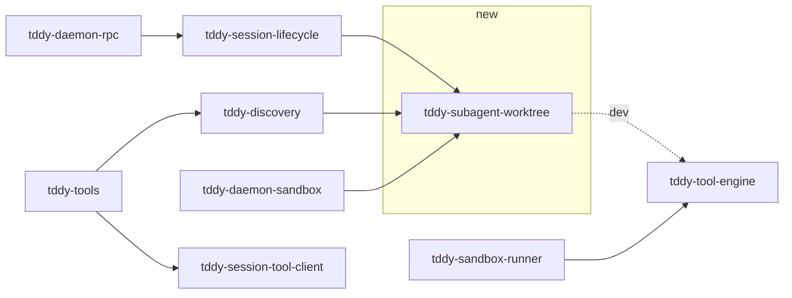

# Changeset: A subagent edits its own worktree, commits every change, and hands the result back

**Date**: 2026-09-30
**Status**: 🚧 In Progress
**Type**: Feature
**Stack**: `#agent-worktree` 1/4 — branch `feature/agent-worktree/isolated-edits`, base `master`
**PR**: [#560](https://github.com/uppin/tddy-coder/pull/560)

## Initial Discovery

[2026-09-30-agent-worktree-isolated-edits-initial-discovery.md](./2026-09-30-agent-worktree-isolated-edits-initial-discovery.md)

## Responsibility

The **conversation worktree** as a whole working capability, for the in-process subagent loop in
`tddy-tools` running with Managed access:

- lazy creation on the first mutating call, cut from the caller's `HEAD` plus its uncommitted state
  as one inherited commit;
- routing every tool call of the conversation to it once it exists;
- one commit per mutating call that changed files, and the change facts (`worktreeChange`) on that
  call's summary;
- `subagent_end` (pull base..tip 3-way into the caller as uncommitted changes, then remove) and
  `subagent_cancel` (remove without pulling).

It owns the new crate `tddy-subagent-worktree`, `ExecuteToolRequest.conversation_id`, the
`ExecToolService/ConversationWorktree` RPC with its `Pull` and `Remove` operations, the jail relay of
both, and the fail-closed read-only tool classifier.

## Boundaries

- **No reset on rewind** — `resetWorktree`, the `Reset` operation and `worktreeReset` belong to
  `feature/agent-worktree/rewind-reset`.
- **No diff tool** — the `Diff` operation and `subagent_diff` belong to `feature/agent-worktree/diff`.
- **No ranges and no ledger** — `Pull` here always applies base..tip as one diff and takes no commit
  list; `subagent_pull`, `subagent_end`'s `from`/`to` and the pulled-commit ledger belong to
  `feature/agent-worktree/range-pull`. Do not add optional range fields "for later".
- **No daemon-run conversations.** `open_local`, `open_owned` and `RemoteAgentSession` keep today's
  root. `local_agent_codebase_access` is not edited.
- **No peer-clone changes.** `session_agent_clone.rs`, `run_hosted_clone_tool` and the roster PRD's
  non-goals are untouched.

## Dependencies

None — this is the root node, cut from `master`.

## Draft PR contract

Published as this PR's second commit — the interface this PR goes on to implement, not its
deliverable; the PR must not merge in that state:

- `packages/tddy-subagent-worktree` — `ConversationId::parse`, `UnsafeConversationId`,
  `ConversationWorktrees::{new, path_of, branch_of, existing, ensure}`,
  `ConversationWorktree::{root, branch, base, caller, commit_changes, pull_into_caller, remove}`,
  `WorktreeChange`, `FileCounts {created, updated, removed}`, `LineCounts {added, removed}`,
  `PullOutcome`, `WorktreeError`, `ToolEffect::of`, `run_in_conversation`, `ConversationRun`,
  `with_worktree_change`, `SUBAGENT_WORKTREES_DIR`; every behaviour body
  `todo!()` under `// TODO(isolated-edits): implement`;
- `exec_tools.proto` — `ExecuteToolRequest.conversation_id = 6`, `ConversationWorktreeRequest`
  (`oneof op { PullOp pull = 10; RemoveOp remove = 11; }`), `ConversationWorktreeResponse`, the
  `ConversationWorktree` RPC; the hand-kept tonic adapter supplement; regenerated
  `packages/tddy-web/src/gen/exec_tools_pb.ts`; `conversation_id: String::new()` at the 40 existing
  request literals;
- `ExecToolHandler::conversation_worktree` + the service adapter; `ExecToolRpcHandler` answering
  `Unimplemented`; `tddy_tool_engine::IN_JAIL_RELAYABLE_EXEC_TOOLS`;
- `tddy_sandbox_runner::HostToolHandler::execute(session_id, conversation_id, tool, args)` — the new
  parameter at all seven implementations; the jail relay's `call_tool(conversation_id, …)` and the host
  relay still dropping it (`TODO`);
- `tddy_session_tool_client::{dispatch_conversation_tool, conversation_worktree,
  ConversationWorktreeOp}` in `src/conversation.rs`;
- `tddy_discovery::subagent::MessageDescriptor::worktree_change` (serialized `worktreeChange`),
  re-exported `WorktreeChange` / `FileCounts` / `LineCounts`; the transcript entry field, never set yet;
- `tddy-tools`' `subagent_end` module — definition and handler, **not routed**, so its advertisement
  test fails until green routes it;
- the failing tests listed below.

## Green wave

**Wave:** 1 of 3
**Greenable independently:** yes — nothing it tests depends on another node
**Concurrent with:** none (it is wave 1 alone)
**Blocks:** `feature/agent-worktree/rewind-reset`, `feature/agent-worktree/diff`,
`feature/agent-worktree/range-pull` — each drives a conversation worktree this node creates

Real dependency edges, as opposed to the branch line:

    n1 → n2, n3, n4      n2 → n4

## Dependency graph after this node



| Edge | Status | Check |
|---|---|---|
| `tddy-discovery → tddy-subagent-worktree` | new (published here) | `cargo tree -p tddy-discovery -i tddy-subagent-worktree` |
| `tddy-session-lifecycle`, `tddy-daemon-sandbox` `→ tddy-subagent-worktree` | new (green) | same, per crate |
| `tddy-daemon-rpc → tddy-session-lifecycle → tddy-subagent-worktree` | no direct edge: the shared `Pull` / `Remove` operation lives in `tddy-session-lifecycle` (`connection_service/conversation_worktree_op.rs`), which both the token path (`daemon-rpc`'s handler) and the jail bridge arm call | `cargo tree -p tddy-daemon-rpc -i tddy-subagent-worktree` shows it only through `tddy-session-lifecycle` |
| `tddy-subagent-worktree → any tddy-* crate` (normal deps) | **must not exist** — a leaf | `grep -c 'path = "../tddy-' packages/tddy-subagent-worktree/Cargo.toml` under `[dependencies]` is 0 |
| `tddy-sandbox-runner → tddy-subagent-worktree` | **no direct edge, and the runner never calls the crate or runs git** — git runs only on the host. The crate is linked *transitively*, through `tddy-discovery`'s re-export of `WorktreeChange` (`runner → tool-engine → worktree-service → daemon-kernel → discovery → SW`, and `runner → discovery`), so `cargo tree -p tddy-sandbox-runner -i tddy-subagent-worktree` **succeeds** and cannot be the check. The check is that no `use tddy_subagent_worktree` appears under `packages/tddy-sandbox-runner/src/` and the runner's `Cargo.toml` has no `tddy-subagent-worktree` line; `conversation_root.rs` re-states the directory name and `tddy-daemon-sandbox` pins the two equal in a test | `grep -rn tddy_subagent_worktree packages/tddy-sandbox-runner/src packages/tddy-sandbox-runner/Cargo.toml` prints nothing |
| `tddy-discovery → tddy-tool-engine` (normal) | **must not exist** — unchanged | `cargo tree -p tddy-discovery -e normal -i tddy-tool-engine` fails |

## Prerequisites

Open items this change runs into. No code issue in any touched package carries `Claimed by:`.
`tddy-git` has no `docs/code-issues/` and has not been analyzed; this change does not edit it.

### ⚠ DURING — A jail rebuild can re-run a tool call that already executed — [`2026-09-26-a-jail-rebuild-can-re-run-a-tool-call-that-already-executed.md`](../todo/2026-09-26-a-jail-rebuild-can-re-run-a-tool-call-that-already-executed.md)

A re-run `Write` or `Shell` now runs in the conversation worktree, and the commit follows the second
run, so the at-least-once property becomes visible as *one* commit holding both effects (a `Write`
is idempotent; a `Shell` side effect is not). Recorded, not fixed here: the accepted-risk decision
stands, and the commit makes it easier to see, not worse.

### ℹ ANSWERED — A conversation id is not bound to the session that opened it — [`2026-09-26-a-conversation-id-is-not-bound-to-the-session-that-opened-it.md`](../todo/2026-09-26-a-conversation-id-is-not-bound-to-the-session-that-opened-it.md)

The gap does not transfer to the new RPC **on the token path**: the conversation worktree is resolved
**under the token-resolved session worktree**, so a foreign conversation id can only ever name a
directory inside the caller's own session. The entry's own gap in `SessionAgentService` stays open.

This holds for the token path only. The **jail bridge arm** binds `session_id` from the runner's own
environment (`bind_to_this_session`) and the host takes it as given: nothing host-side checks it
against the session the jail was built for, and the session directory is looked up as
`tddy_data_dir/sessions/<id>` rather than through `sessions_base_for_user`. Deferred, MEDIUM — filed as
[`2026-10-01-a-jail-can-name-another-sessions-conversation-worktree-over-the-host-bridge.md`](../todo/2026-10-01-a-jail-can-name-another-sessions-conversation-worktree-over-the-host-bridge.md).
⚠ **AWAITING developer consent** for the deferral.

### ⚠ DURING — A turn's message list can overflow the chunk-framing threshold — [`2026-09-26-a-turns-message-list-can-overflow-the-chunk-framing-threshold.md`](../todo/2026-09-26-a-turns-message-list-can-overflow-the-chunk-framing-threshold.md)

`worktreeChange` adds a bounded ~120-byte object to each mutating tool-role descriptor. It rides only
the MCP path in this node (daemon-run conversations are out of scope), which does not frame. Keep it
bounded — no path lists in the per-call facts.

### ⚠ DURING — Seven files over budget — [`2026-09-26-seven-files-over-budget-deferred-by-the-subagent-turn-control-change.md`](../todo/2026-09-26-seven-files-over-budget-deferred-by-the-subagent-turn-control-change.md)

`tddy-tools/src/server.rs`, `tddy-discovery/src/subagent.rs`, `tddy-sandbox-runner/src/runner.rs`
and `tddy-session-tool-client/src/lib.rs` are over 500 lines (code issues
`packages/tddy-tools/docs/code-issues/oversized-file-server.md`,
`packages/tddy-discovery/docs/code-issues/oversized-file-subagent.md`,
`packages/tddy-sandbox-runner/docs/code-issues/oversized-file-runner.md`,
`packages/tddy-session-tool-client/docs/code-issues/oversized-file-lib.md`). New logic goes into new
modules — `subagent_end` into its own module under `tddy-tools/src/`, the per-conversation dispatch
into its own module of `tddy-session-tool-client`.

**"Grows only by its wiring line(s)" did not hold.** Re-measured 2026-10-01 against `master`
(production lines): `tddy-session-tool-client/src/lib.rs` **+60** (1,047 → 1,107, the
`dispatch_request_via_*` split — a request-taking variant of each transport's dispatch so a
conversation's call can reuse it); `tddy-sandbox-runner/src/runner.rs` **+28** (2,611 → 2,639);
`tddy-daemon-sandbox/src/sandbox_session.rs` +1 (916 → 917, after `execute` was made to always call
`execute_in_conversation`); `tddy-sandbox-runner/src/host_relay.rs` **+10** (939 → 949, a file with
no record until now); `tddy-tools/src/server.rs` +10; `tddy-discovery/src/subagent.rs` +3;
`tddy-discovery/src/roster/conversation.rs` +4; `workspace_tool_sandbox.rs` +2;
`handle_rpc` +3 lines (one more arm). Each has a dated row in its code-issue record; `host_relay.rs`
and `tddy-session-agents/src/session_agent_clone.rs` (not edited here) got new records. The
`lib.rs` extraction of the transport helpers (seam B) is deferred. ⚠ **AWAITING developer consent**
for the deferral.

### ⚠ DURING — `stream_execute_tool` complexity — `packages/tddy-daemon-rpc/docs/code-issues/complexity-exec-tool-ports-stream-execute-tool.md`

Unclaimed; nesting 5. `conversation_id` must not add a branch inside it: the conversation root is
resolved in the shared route (`run_exec_tool_locally`) that both `execute_tool` and
`stream_execute_tool` already reach.

## Affected Packages

- **tddy-subagent-worktree** (new): README + `docs/conversation-worktree.md` — the git mechanics
- **tddy-service**: [README.md](../../packages/tddy-service/README.md) — `exec_tools.proto`
- **tddy-tool-engine**: [README.md](../../packages/tddy-tool-engine/README.md) — `ExecToolHandler::conversation_worktree`, service adapter
- **tddy-daemon-rpc**: [README.md](../../packages/tddy-daemon-rpc/README.md) — the handler
- **tddy-session-lifecycle**: [README.md](../../packages/tddy-session-lifecycle/README.md) — the exec-tool route resolves the conversation root
- **tddy-sandbox-runner**: [README.md](../../packages/tddy-sandbox-runner/README.md) — relays `conversation_id` and `ConversationWorktree`
- **tddy-session-tool-client**: [README.md](../../packages/tddy-session-tool-client/README.md) — per-conversation dispatch and the `ConversationWorktree` call
- **tddy-discovery**: [roster-and-subagent-runtime.md](../../packages/tddy-discovery/docs/roster-and-subagent-runtime.md) — `worktree_change` on the descriptor and in `prompt_outcome_json`
- **tddy-tools**: [README.md](../../packages/tddy-tools/README.md) — `subagent_end`, `subagent_cancel` removes, the Managed closure carries the conversation id
- **tddy-sandbox-recipes**: allowlists `mcp__tddy-tools__subagent_end`
- **tddy-daemon-sandbox**: [README.md](../../packages/tddy-daemon-sandbox/README.md) — `DaemonToolHandler` runs a conversation's call through `run_in_conversation`
- **tddy-web**: regenerated `src/gen/exec_tools_pb.ts` (no UI change)
- **tddy-sandbox-app**, **tddy-testing-commons**, **tddy-integration-tests**: the new `HostToolHandler::execute` parameter on their handlers

## Related Feature Documentation

- [PRD-2026-09-30-agent-worktree-isolated-edits.md](../../ft/coder/1-WIP/PRD-2026-09-30-agent-worktree-isolated-edits.md)
- [managed-codebase-subagents.md](../../ft/coder/managed-codebase-subagents.md)

## Summary

A subagent conversation gets its own branch and worktree inside the session worktree, created on its
first mutating tool call and seeded with the caller's uncommitted state. Each mutating call that
changes files is committed there, and its summary reports the files and lines it created, updated and
removed with the commit's short hash. `subagent_end` hands the result to the caller as uncommitted
changes; `subagent_cancel` discards it.

## Background

See the PRD. In short: today the subagent and its caller write the same tree, a summary cannot say
what changed on disk, and nothing can be taken back.

## Scope

- [ ] **Package Documentation**: new crate README + docs; updated READMEs for the packages above
- [x] **Implementation**: mechanics crate, wire, daemon route, jail relay, subagent loop, MCP tools
- [ ] **Testing**: all acceptance tests below passing — ticked per package once verified; verified 2026-10-01 for `tddy-subagent-worktree`, `tddy-discovery`, `tddy-session-tool-client`; the `tddy-tools` and `tddy-daemon-rpc` suites were not re-run in this pass
- [ ] **Integration**: an in-jail subagent's write lands in its conversation worktree end-to-end — **not verified**: no test runs a real jail on this host (the jail route is covered at the request seam only)
- [x] **Technical Debt**: TODOs filed for daemon-run conversations and the orphan sweep (and, 2026-10-01, the jail-bridge session binding)
- [x] **Code Quality**: scoped clippy/fmt per touched package (2026-10-01: clean for `tddy-subagent-worktree`, `tddy-session-lifecycle`, `tddy-discovery`, `tddy-sandbox-runner`, `tddy-session-tool-client`, `tddy-daemon-sandbox --lib`; `tddy-daemon-sandbox`'s `sandbox_stdio_seatbelt_acceptance` does not compile on `master`)

## Technical Changes

### State A (Current)

- `CodebaseAccess::Managed` (`tddy-discovery/src/subagent.rs:211`) dispatches each call through
  `tddy_session_tool_client::dispatch_session_tool(tool, args)` →
  `ExecuteTool{session_token, session_id, tool_name, args_json, daemon_instance_id}`
  (`exec_tools.proto:52`). No conversation id travels.
- The jail's relay forwards only `tool_name` and `args_json` (`tddy-sandbox-runner/src/runner.rs:79`).
- The daemon resolves the root from `.session.yaml` `repo_path` (`resolve_exec_tool_worktree`) and
  runs the tool on `HostWorktree` or in the workspace `Jail` (`local_exec_tools.rs:100-166`). The jail
  mounts only the session worktree (`workspace_tool_sandbox.rs:226`).
- Results: `Write` → `{bytes_written}`, `StrReplace` → `{replaced, matchedOccurrences, bytes_written,
  edited_region, edited_line}`, `Delete` → `{deleted}`, `Shell` → `{stdout, stderr, exit_code}`.
- `ResultSummary` (`subagent/result_summary.rs`) has no file/line/commit facts; `MessageDescriptor`
  (`subagent/transcript.rs:107`) has no change field.
- Two read-only classifiers disagree: `SubagentTool::is_mutating` (`agent_def.rs:46`) and the
  fail-closed `agent_tool_reads_the_clone` (`tddy-session-lifecycle/.../agent_roster.rs:154`).
- `subagent_cancel` (`tddy-tools/src/server.rs:2065`) retires the conversation; nothing on disk.
- Git helpers exist only privately (`session_room::write_wip_tree_within`, `diff_between`,
  `git_output`) or for other purposes (`tddy-session-sync::Mirror::apply`,
  `tddy-worktree-service::parse_git_diff_numstat`, `tddy-git::worktree`).

### State B (Target)

```
tddy-tools (in jail)                             facilitating daemon
 subagent loop ──Managed(conv)──► ExecuteTool{…, conversation_id} ──► exec route
                                                                     │ ToolEffect::of(tool)
                                                                     │ ConversationWorktrees::existing / ensure
                                                                     │ run tool at root = conv worktree
                                                                     │ commit_changes → WorktreeChange
                                                                     ▼ result_json + "worktreeChange"
 subagent_end ──► ConversationWorktree{Pull} then {Remove}  ──► pull_into_caller (3-way) / remove
 subagent_cancel ──► ConversationWorktree{Remove}
```

- **`tddy-subagent-worktree`** (git CLI, `std::process::Command`, `GIT_OPTIONAL_LOCKS=0`, null stdin,
  fixed committer identity `tddy-subagent <tddy-subagent@tddy.invalid>`):
  - `ConversationId::parse(&str) -> Result<ConversationId, UnsafeConversationId>` —
    `[A-Za-z0-9._-]{1,64}`, no leading `.`.
  - `ConversationWorktrees::new(session_worktree, session_id)`; `existing(&id) -> Option<…>`;
    `ensure(&id) -> Result<ConversationWorktree, WorktreeError>` — on first call: add
    `/tmp/subagent-worktrees/` to `<common dir>/info/exclude` if absent; snapshot the caller's
    uncommitted state through a scratch `GIT_INDEX_FILE` (seeded from the caller's index, `add -A`
    excluding `tmp/subagent-worktrees/`, `write-tree`, `commit-tree -p HEAD`) when it differs from
    `HEAD`; `git worktree add -b tddy/subagent/<session>/<conv> <path> <base>`.
  - `ConversationWorktree::{root, base, commit_changes(subject) -> WorktreeChange,
    pull_into_caller() -> PullOutcome, remove()}`. `commit_changes` stages everything, derives the
    facts from `diff --cached --name-status` + `--numstat` (A = created, M/T = updated, D = removed,
    R = one removed + one created; binary `-` counts no lines) and commits only when non-empty.
    `pull_into_caller` runs `git diff --binary base..tip | git apply --3way` in the caller's worktree
    and reports conflicted paths. `remove` = `git worktree remove --force` + `git branch -D`.
  - `ToolEffect::of(tool_name) -> ToolEffect::{ReadOnly, Mutating}` — `ReadOnly` for exactly
    `Read | Glob | Grep | SemanticSearch | ReadLints`, `Mutating` for everything else.
  - `run_in_conversation(worktrees, &id, tool_name, execute) -> String` — the whole per-call rule:
    read-only before creation → session root; mutating → `ensure`; run `execute(root)`; mutating →
    `commit_changes` and merge `"worktreeChange"` into the result object.
- **Wire**: `ExecuteToolRequest.conversation_id = 6` (empty = today's behaviour);
  `rpc ConversationWorktree(ConversationWorktreeRequest) returns (ConversationWorktreeResponse)` with
  `session_token, session_id, daemon_instance_id, conversation_id, oneof op { PullOp pull = 10;
  RemoveOp remove = 11; }` and `result_json`.
- **Daemon**: `run_exec_tool_locally` wraps the route in `run_in_conversation` when
  `conversation_id` is set; `ExecToolRpcHandler::conversation_worktree` authorizes like
  `execute_tool`, resolves the session worktree, and runs `Pull` / `Remove`.
- **Jail relay**: `SandboxSessionRelay::call_tool` carries `conversation_id`; the runner forwards
  `ConversationWorktree` to the host.
- **Discovery**: `MessageDescriptor::worktree_change: Option<WorktreeChange>` read from the tool
  result's `worktreeChange` at the append site; serialized by `prompt_outcome_json` as
  `worktreeChange`.
- **tddy-tools**: the Managed closure is built per conversation and passes its id;
  `subagent_end{sessionId}` (own module) refuses while a turn is pending, sends `Pull` then `Remove`,
  retires the conversation, answers `{ended, pulled}`; `subagent_cancel` sends `Remove` after
  retiring.

### Delta (What's Changing)

#### tddy-subagent-worktree (new)
- Crate, README, docs; dev-deps `tempfile`, `tddy-testing-commons`, `tddy-tool-engine`, `tokio`.

#### tddy-service
- `exec_tools.proto` fields and RPC above; regenerated bindings (and `tddy-rust-typescript-tests` if
  the TS bindings include `exec_tools`).

#### tddy-tool-engine
- `ExecToolHandler::conversation_worktree`; `ExecToolServiceImpl` dispatch.

#### tddy-daemon-rpc
- `ExecToolRpcHandler::conversation_worktree`.

#### tddy-session-lifecycle
- `run_exec_tool_locally` routes through `run_in_conversation`; `agent_tool_reads_the_clone`
  delegates to `ToolEffect::of` (one classifier).

#### tddy-sandbox-runner
- `call_tool(conversation_id, tool, args)`; `ConversationWorktree` forwarded.

#### tddy-session-tool-client
- `dispatch_conversation_tool(conversation, tool, args)` and `conversation_worktree(conversation,
  op)` in a new module.

#### tddy-discovery
- `MessageDescriptor::worktree_change`; `prompt_outcome_json` emits it.

#### tddy-tools
- `subagent_end` module; `subagent_cancel` removes; per-conversation Managed closure.

#### tddy-sandbox-recipes
- `mcp__tddy-tools__subagent_end` beside `subagent_cancel` in the subagent tool list.

## Implementation Milestones

- [x] `ConversationId`, `ToolEffect` and their unit tests green
- [x] `ensure` creates the worktree with the inherited commit and exclude entry
- [x] `commit_changes` facts green for create / update / delete / rename / binary / no-op
- [x] `pull_into_caller` clean and conflicted cases green; `remove` green
- [x] `run_in_conversation` routing green with the real tool engine
- [x] Wire + daemon handler + jail relay green — the lifecycle / runner / jail-route unit tests are verified (2026-10-01); `tddy-daemon-rpc`'s `conversation_worktree_exec_tool_acceptance` (7) and `conversation_worktree_host_bridge_acceptance` (2) pass (2026-10-01)
- [ ] Discovery descriptor + MCP `subagent_end` / `subagent_cancel` green — discovery verified (2026-10-01); the `tddy-tools` MCP suite was not re-run (the crate is untouched by the validation fixes)
- [ ] Allowlists updated

## Testing Plan

**Levels.** The mechanics are pure git and are tested against real temporary repositories — no
doubles, because a git double would test nothing. The per-call rule is tested with the **real**
`tddy_tool_engine::execute_tool` as the executor, so a `Write` really writes. The daemon handler is
tested in `tddy-daemon-rpc`'s existing exec-tool acceptance style. The subagent loop is tested with
the established wiremock provider plus a Managed closure answering with a real-shaped result. The MCP
surface is tested over the real `tddy-tools --mcp` stdio wire.

**Options weighed.** A single end-to-end test through a jail would prove the relay but costs a
sandbox per run and was rejected as the primary proof; the relay gets a focused test instead
(`conversation_id` survives `call_tool`), which is the one field the discovery shows is dropped today.

### Acceptance Tests

Every test below fails on this branch for this node's missing implementation. The two marked
**guard** pass by design: they pin the unchanged path (no conversation id → today's behaviour) so the
implementation cannot break it.

#### tddy-subagent-worktree — `packages/tddy-subagent-worktree/tests/conversation_worktree_acceptance.rs` (19)
Fixture: `tests/support/mod.rs` — `a_caller_worktree()` builder over real repositories
(`with_committed_file`, `with_staged_edit`, `with_unstaged_edit`, `with_untracked_file`,
`with_ignored_file`, `in_a_linked_worktree`).
- `looking_up_a_conversation_that_never_wrote_creates_nothing`
- `the_worktree_is_cut_from_the_callers_head_on_its_own_branch`
- `the_callers_uncommitted_and_untracked_changes_become_one_commit_on_the_subagent_branch`
- `the_inherited_commit_leaves_out_ignored_files`
- `cutting_the_worktree_leaves_the_callers_index_branch_and_files_untouched`
- `the_conversation_worktree_never_shows_in_the_callers_status`
- `a_linked_session_worktree_gets_its_conversation_worktree_in_its_own_tmp`
- `ensuring_twice_finds_the_same_worktree_and_base`
- `two_sessions_can_hold_conversations_of_the_same_name`
- `a_change_is_committed_with_its_created_updated_and_removed_counts`
- `each_commit_is_named_after_the_tool_that_made_it`
- `a_call_that_changed_nothing_makes_no_commit`
- `a_binary_file_counts_as_a_file_and_adds_no_lines`
- `the_subagents_commits_are_not_attributed_to_the_developer`
- `pulling_applies_everything_since_the_base_as_uncommitted_changes`
- `pulling_does_not_reapply_the_callers_own_inherited_changes`
- `a_pull_over_the_callers_own_edit_leaves_conflict_markers_and_names_the_path`
- `pulling_never_moves_the_callers_head`
- `removing_deletes_the_worktree_and_its_branch`

#### tddy-subagent-worktree — `packages/tddy-subagent-worktree/tests/run_in_conversation_acceptance.rs` (9)
Executor: the real `tddy_tool_engine::execute_tool`.
- `a_read_before_any_write_reads_the_session_worktree_and_creates_nothing`
- `a_write_lands_in_the_conversation_worktree_and_reports_its_commit`
- `a_read_after_a_write_sees_the_subagents_own_write`
- `a_shell_call_that_creates_files_reports_them`
- `a_delete_reports_a_removed_file`
- `await_is_treated_as_mutating_and_commits_what_the_background_job_wrote`
- `a_read_only_call_carries_no_worktree_change`
- `a_mutating_call_that_changed_nothing_reports_zero_counts_without_a_commit`
- `the_tool_result_itself_is_passed_through_unchanged`

#### tddy-daemon-rpc — `packages/tddy-daemon-rpc/tests/conversation_worktree_exec_tool_acceptance.rs` (7)
- `an_execute_tool_carrying_a_conversation_id_writes_to_that_conversations_worktree`
- `an_execute_tool_without_a_conversation_id_writes_to_the_session_worktree` — **guard**
- `an_unsafe_conversation_id_is_refused_before_any_tool_runs`
- `pull_hands_the_conversations_changes_to_the_session_worktree`
- `pulling_a_conversation_that_never_wrote_pulls_nothing`
- `remove_deletes_the_conversation_worktree`
- `a_conversation_worktree_call_with_an_unverifiable_token_is_refused`

#### tddy-daemon-sandbox — unit test in `packages/tddy-daemon-sandbox/src/sandbox_session.rs`
- `a_conversations_call_runs_in_the_conversations_worktree` — the SandboxIpc route
  (`DaemonToolHandler`), which never enters `run_exec_tool_locally`

#### tddy-sandbox-runner
- `src/runner.rs` unit: `the_jail_relay_keeps_the_conversation_of_a_tool_call`
- `src/runner.rs` unit: `forwards_a_conversation_worktree_call_to_the_host_as_an_rpc_request`
- `tests/host_relay_dispatch.rs`: `hands_the_conversation_of_a_jails_tool_call_to_the_handler`
  (new fixture mode `Mode::PushConversationToolRequest` in `tests/common/mod.rs`)

#### tddy-session-tool-client — unit tests in `packages/tddy-session-tool-client/src/conversation.rs`
- `a_conversation_tool_call_names_its_conversation_on_the_wire`
- `a_pull_names_its_conversation_and_asks_for_a_pull`
- `a_remove_asks_for_a_remove`

#### tddy-discovery — `packages/tddy-discovery/tests/worktree_change_summary_acceptance.rs` (4)
- `a_mutating_call_reports_its_worktree_change_in_the_turn_outcome`
- `a_mutating_call_that_changed_nothing_reports_counts_without_a_commit`
- `the_worktree_change_is_serialized_beside_the_result_summary`
- `a_read_reports_no_worktree_change` — **guard**

#### tddy-tools — `packages/tddy-tools/tests/subagent_end_mcp_acceptance.rs` (4)
- `subagent_end_is_advertised_beside_subagent_cancel`
- `ending_a_conversation_that_never_wrote_pulls_nothing`
- `ending_a_conversation_with_a_turn_running_is_refused`
- `an_ended_conversation_can_no_longer_be_prompted`

#### tddy-sandbox-recipes — unit test in `packages/tddy-sandbox-recipes/src/claude_cli.rs`
- `subagent_end_is_allowlisted_wherever_subagent_cancel_is`

### Unit tests (tddy-subagent-worktree)
- `src/conversation_id.rs` (table-driven, 14 cases) — accepted shape and length limit, `/`, `..`, leading `.`, empty, length +1, space, and the git-ref rules: `a..b`, trailing `.`, `.lock` suffix
- `src/tool_effect.rs` (5) — the five read-only names, the four writers, `Await`, unknown, case
- `src/change_facts.rs` (8) — created, updated (M/T), removed, rename, summed lines, binary, empty;
  plus `a_change_without_a_commit_serializes_without_the_commit_key`, which **passes** on the
  surface's serde derive — it pins the wire shape the other suites assert through
- `src/run.rs` (2) — `with_worktree_change` merges beside the tool's fields; a non-object is wrapped
- added in validation fixes, in `tests/conversation_worktree_acceptance.rs`: `a_deleted_worktree_directory_is_recreated_on_its_surviving_branch`, `a_surviving_branch_whose_base_was_lost_starts_the_conversation_afresh`, `two_concurrent_ensures_of_one_conversation_create_it_once`, `two_concurrent_commits_in_one_conversation_both_succeed_and_keep_every_file`, `a_developers_post_commit_hook_does_not_run_for_a_subagents_commit`; in `tests/run_in_conversation_acceptance.rs`: `a_commit_that_fails_after_the_tool_ran_still_returns_the_tools_output`
- `tddy-session-lifecycle` unit tests, `connection_service/conversation_worktree_jail_route_unit_tests.rs` (2): `a_read_before_the_conversations_first_write_is_sent_to_the_jail_for_the_session_root`, `a_call_after_the_conversations_first_write_is_sent_to_the_jail_for_its_worktree`

### Not covered by a red test — gaps, and what closed them
- **The host bridge arm** — now covered by
  `packages/tddy-daemon-rpc/tests/conversation_worktree_host_bridge_acceptance.rs`.
- **The workspace jail route** — now covered by
  `tddy-session-lifecycle`'s `conversation_worktree_jail_route_unit_tests` (see above). That is a
  unit test at the seam where the request reaches the jail — `LocalExecTools::run_exec_tool_locally`
  with a jail double that records the `conversation_id` it is handed — because a real jail needs a
  sandbox this macOS host cannot start for the `workspace_tool_sandbox_*` suites. It proves what
  reaches the jail (no id before the first write, the id after); the runner's side of the contract
  (`conversation_root::tool_root`) is covered in `tddy-sandbox-runner`. No test runs a real jail
  end-to-end, so the **Integration** item stays open.

## Technical Debt & Production Readiness

### Baseline (recorded before this node's work)
- `cargo check --all-targets` over the nine packages first in scope: green, zero warnings.
- ❌ **Pre-existing, not this node's:** `packages/tddy-daemon-sandbox/tests/sandbox_stdio_seatbelt_acceptance.rs`
  (macOS-only) does not compile on `master` — it names `SandboxHandle` without importing it. This node
  only adds the new `_conversation_id` parameter to its fake handler. Every other
  `tddy-daemon-sandbox` target compiles and lints clean.

### Discovered while publishing the surface
- **Two in-jail routes, not one.** An in-jail `tddy-tools` reaches mutations either over the sandbox
  session channel (`SandboxIpc` → runner → host relay → `DaemonToolHandler`, which runs the tool engine
  directly) or over `ExecuteTool` (`DaemonUds` / `DaemonHttp` / LiveKit → `run_exec_tool_locally`).
  Both wrap in `run_in_conversation`.
- **Both relay halves dropped the id.** The jail side rebuilt the request from `tool_name` /
  `args_json` with `..Default::default()`; the host side called `HostToolHandler::execute(session,
  tool, args)`. The trait gained a `conversation_id` parameter — seven implementations — rather than a
  defaulted second method, which would have been a silent fallback.

## Decisions & Trade-offs

- **Worktree inside the session worktree** (developer choice): it is the one directory every route —
  host and jail — can already reach. Cost: it relies on `info/exclude` to stay out of the caller's
  status, and it is deleted with the session worktree.
- **Branch name carries the session id**: sessions of one project share the common git dir, and the
  caller chooses conversation ids.
- **Git runs on the daemon host** — the jail may not see the common dir a linked worktree points at.
- **Typed RPC over reserved tool names** (developer choice) — costs a relay entry, buys a typed op.
- **3-way with conflict markers** (developer choice) over refuse-and-keep.
- **Pull at the end only** in this node (developer choice); mid-conversation pulls are 4/4.
- **Fail-closed classifier** — one list of read-only tools, everything else commits.
- **Automatic commits skip hooks and signing** — every git call this crate makes runs with
  `core.hooksPath=/dev/null` and `commit.gpgsign=false`, and the commit itself uses `--no-verify`:
  they are automatic snapshots of a subagent's work, not developer commits, and no developer
  post-commit / post-checkout hook may run on the host on a subagent's behalf (nor a signing prompt
  block a call). Cost: a repository whose policy relies on a hook seeing every commit does not see
  these. ⚠ **AWAITING developer consent** — chosen by the implementer, not yet approved.
- **One conversation's git steps are serialised** — `ensure`, `commit_changes` and `remove` take a
  per-worktree async lock (process-wide, keyed by the worktree path, since `ConversationWorktrees`
  is built per call), so two concurrent mutating calls cannot race on creation or on `index.lock`.
- **A commit that fails after the tool ran does not drop the tool's output** —
  `ConversationRun::commit_error` carries it and `ConversationRun::merge` puts
  `"worktreeChange": {"error": …}` on the result; the tool's effects are on disk, uncommitted.
- **The root `run_in_conversation` chose decides what a jail is sent** — a call that runs at the
  session root (a read before the conversation's first write) reaches the jail with no
  `conversation_id`, so the jail does not look for a worktree directory that does not exist yet.

## Refactoring Needed

### From /validate-changes
### From /validate-tests
### From /validate-prod-ready
### From /analyze-clean-code

## Validation Results

### /validate-changes
### /validate-tests
### /validate-prod-ready
### /analyze-clean-code

## Successor PRs

- `feature/agent-worktree/rewind-reset` — a rewind resets the worktree
- `feature/agent-worktree/diff` — `subagent_diff`
- `feature/agent-worktree/range-pull` — `subagent_pull` and ranges

## TODO

- [x] Record initial discovery (`2026-09-30-agent-worktree-isolated-edits-initial-discovery.md`)
- [x] Cross-check `packages/*/docs/code-issues/` and `docs/dev/todo/` for items this change touches (Step 2b)
- [x] Create/update PRD documentation
- [x] Create changeset (this document)
- [x] Create failing acceptance tests
- [x] Run acceptance tests (verify they fail)
- [x] USER REVIEW — acceptance tests (approved 2026-09-30)
- [x] TDD Red — write failing unit/integration tests
- [ ] TDD Green — implement with quality code
- [ ] Update documentation with progress
- [ ] Repeat Red→Green→Update cycle until feature complete
- [ ] Run scoped tests per touched package; full workspace on CI
- [ ] Validate changes (/validate-changes)
- [ ] Refactor issues from change validation
- [ ] USER REVIEW — development complete
- [ ] Validate tests (/validate-tests)
- [ ] Refactor test issues
- [ ] Validate production readiness (/validate-prod-ready)
- [ ] Refactor production readiness issues
- [ ] Analyze code quality (/analyze-clean-code)
- [ ] Refactor code quality issues
- [ ] Final validation (/validate-changes)
- [ ] Linting and formatting (scoped `cargo clippy -p <pkg> -- -D warnings`, `cargo fmt`)
- [ ] Wrap documentation (/wrap-context-docs) — also deletes the initial-discovery companion
- [ ] USER REVIEW — work complete, decide next steps
