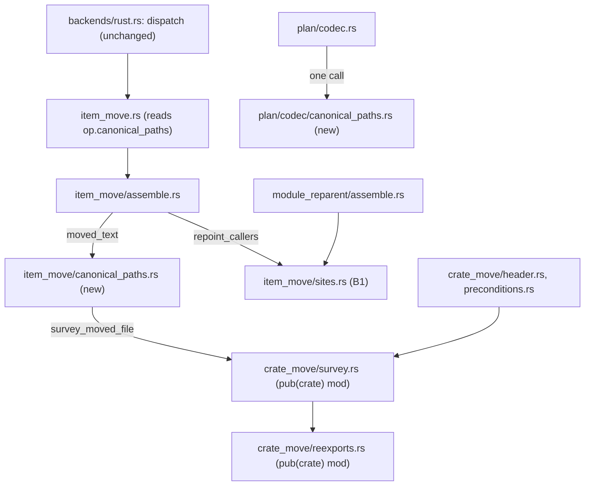

# Changeset: `move_item` and `reparent_module` write what a reader of the result would have written

**Date**: 2026-10-05
**Status**: 🚧 In Progress
**Type**: Feature (engine output fidelity; three behaviours, one shared resolver made reachable)
**Stack**: `#sharpen` 2/8, branch `feature/sharpen/move-fidelity`, on top of `feature/sharpen/tidy-engine-files` (1/8). Draft PR: [#589](https://github.com/uppin/tddy-coder/pull/589).
Title: `feat(code-restructuring): move_item re-points a caller's import and a facade path, and doc links follow the item (#sharpen 2/8)`

## Initial Discovery

Full codebase exploration that grounded this plan: [initial-discovery.md](./2026-10-05-sharpen-move-fidelity-initial-discovery.md).

State A below is distilled from that file. Do not duplicate grep traces or file dumps here.

## Prerequisites

The scan followed `deferred-work/references/planning-cross-check.md`. Package in scope: `tddy-code-restructuring` (five records under
`docs/code-issues/`, no live `Claimed by:`: the one hit, `broken-restructure-anchors-empty-outline.md`, claims `none`, #537 merged).
The four entries below that are **not on master** live on PR #532 (branch `feature/carve/lifecycle-ports-agents`); each is named by branch and file in backticks
because a relative link would point at nothing. **This entry exists only on that branch; whichever of that PR and this node lands second deletes it at wrap.**
Two of them link a todo that #540 deleted; its replacement is `packages/tddy-code-restructuring/docs/path-survey.md`.

### ✅ RESOLVED HERE (B1) — `move_item` writes a caller re-point as a full path — `feature/carve/lifecycle-ports-agents:docs/dev/todo/2026-10-05-restructure-move-item-writes-a-caller-re-point-as-a-full-path.md`

Closed by M2 and the B1 tests (`a_module_qualified_call_keeps_its_qualifier_and_gains_an_import_of_the_new_module`, …). Promoted to ✅ when those pass.

### ✅ RESOLVED HERE (B2) — `move_item` copies a moved signature's facade path — `feature/carve/lifecycle-ports-agents:docs/dev/todo/2026-10-05-restructure-move-item-copies-a-moved-signature-s-facade-path.md`

The todo asks for an option (`canonical_paths: true`) *or* a note listing the paths. Both are delivered, as decided under O1 (developer-approved 2026-10-05): the plan field, off by default, plus a note naming every path rewritten or left. Closed by M4.

### ⚠ DURING → ✅ conditional (B3) — `move_item` leaves intra-doc links to the old path — `feature/carve/lifecycle-ports-agents:docs/dev/todo/2026-10-05-restructure-move-item-leaves-intra-doc-links-to-the-old-path.md`

Claimed only if M5 ends with `a_doc_link_to_the_moved_item_follows_it` green. If the probe (M1) sends B3 to a follow-up node (O2), the entry stays ⚠ and is narrowed to what remains.

### ℹ NOTED — adjacent entry, **not claimed here** — `feature/carve/lifecycle-ports-agents:docs/dev/todo/2026-10-05-restructure-cannot-re-point-an-import-through-a-facade-to-its-defining-crate.md`

That is `repoint-facade` (K=8)'s. This node delivers the shared resolver it reuses; the grouped-`use` splitting (`header::repointed_header` refuses a group needing different qualifiers) is **not** done here.

### ⚠ DURING — [`2026-10-04-restructure-move-item-copies-the-whole-use-header.md`](../todo/2026-10-04-restructure-move-item-copies-the-whole-use-header.md)

B1 inserts an import into **callers**, not the destination header; it must not widen the header copy, and a run stopped early (`--stop-after`) leaves the old `use` as an unused import (the tidy only runs on a complete run).

### ⚠ DURING — [`2026-10-04-restructure-reexport-outside-limits.md`](../todo/2026-10-04-restructure-reexport-outside-limits.md), [`2026-10-04-restructure-reparent-module-first-cut-limits.md`](../todo/2026-10-04-restructure-reparent-module-first-cut-limits.md), [`2026-10-05-restructure-same-crate-moves-limits-found-moving-lifecycle.md`](../todo/2026-10-05-restructure-same-crate-moves-limits-found-moving-lifecycle.md)

None is widened or closed here. B3 adds doc links to the `reparent_module` behaviour page (`docs/same-crate-moves.md`) at wrap.

### ⚠ DURING — [`2026-10-05-restructure-engine-files-past-the-500-line-budget.md`](../todo/2026-10-05-restructure-engine-files-past-the-500-line-budget.md)

`tidy-engine-files` (K=1) resolves it. This node adds one field (`RefactorOp.canonical_paths`, O1 decided) and one codec call to `plan.rs` / `plan/codec.rs` on the post-tidy files; neither may end over 500.

### ⚠ DURING — `packages/tddy-code-restructuring/docs/code-issues/oversized-file-backends-rust.md` (2,852 production lines)

This node expects to add **0** lines to `backends/rust.rs` (the `canonical_paths` flag is read inside `item_move.rs`). If wiring forces one, a measurement-history row is appended.

### ⚠ DURING — [`2026-10-03-restructure-leftovers-of-the-live-plan-carve-and-tooling-pass.md`](../todo/2026-10-03-restructure-leftovers-of-the-live-plan-carve-and-tooling-pass.md) § 6 (`verify` reflow noise)

`restructure verify` pairs a re-point that only deletes lowercase module qualifiers and treats `use` items as scaffolding. B1 (`old::f()` becomes `new::f()`) and B2 (`crate::config::X` becomes `kernel::config::X`) are both of those shapes; B3 edits comments, which `verify` does not read. The comment-line multiset (acceptance check A6) is the by-hand account for B3.

### ℹ NOTED

- Open draft PR #586 edits `.agents/skills/code-restructuring/SKILL.md` and `run-index-daemon`: this node does **not** touch `SKILL.md` (behaviour notes go in `references/plan-schema.md`, the feature doc and the package docs); a SKILL line, if wanted, is a wrap-time edit after #586 lands.
- `docs/dev/1-WIP/2026-09-17-restructure-refusal-truth-and-authoring-gates.md` (all milestones `[x]`): looks unwrapped; not this stack's to wrap.
- `packages/tddy-lsp` has no `docs/code-issues/`; it is not touched.

## Affected Packages

- **`tddy-code-restructuring`**: [README.md](../../../packages/tddy-code-restructuring/README.md) — module table (`item_move/canonical_paths.rs`, `doc_links.rs` if B3 needs one), the `crate_move` row
  - [same-crate-moves.md](../../../packages/tddy-code-restructuring/docs/same-crate-moves.md) — `sites.rs` row (module-qualified callers), `canonical_paths`, doc links, `reparent_module` limits
  - [path-survey.md](../../../packages/tddy-code-restructuring/docs/path-survey.md) — the survey now has a second consumer (`move_item`)
  - [facades.md](../../../packages/tddy-code-restructuring/docs/facades.md) — only if a facade path rule changes (not expected)
- **`.agents/skills/code-restructuring/references/plan-schema.md`**: the `canonical_paths` row and the three behaviours (edited in this PR, as #584 did; `SKILL.md` is not).
- **`docs/ft/coder/rust-code-restructuring.md`**: § Same-crate moves (callers, imports), § Moved code that changes meaning one module deeper, § Known limitations.
- **`tddy-tools`, `tddy-index-daemon`, `tddy-daemon-rpc`**: not edited. They name `RefactorOp` only through the crate; no consumer builds a `RefactorOp` literal (all 80 textual `RefactorOp {` sites, 20 of them full struct literals, are inside `tddy-code-restructuring`).

## Related Feature Documentation

- [Rust code restructuring](../../ft/coder/rust-code-restructuring.md)
- [PRD: move_item and reparent_module output fidelity](../../ft/coder/1-WIP/PRD-2026-10-05-sharpen-move-fidelity.md)

## Summary

Three defects in what `move_item` writes, all found moving `tddy-session-lifecycle`: a caller that reached the item through `use crate::old;` gets a full `crate::new::f()` inlined instead of the short form and an import (B1); a path in the moved text that goes through a `pub use` facade travels as written, so the module cannot later leave its crate (B2); and an intra-doc link to the moved item keeps pointing at the old path (B3). B2 reuses the `crate_move` path-survey resolver, which is made reachable from `backends/rust`. B3 is gated on one probe: does rust-analyzer return doc-link positions as references?

## Background

`#carve` 17/21 moved items with `move_item` and found each result correct and compiling, and each one longer, uglier or staler than a hand edit: three call sites inlined as `crate::connection_service::agent_roster::…`, `agent_roster.rs:186` still naming `crate::config::DaemonConfig` (a facade that then blocks the move into `tddy-session-agents`), `handler_state.rs:106` linking a path that no longer exists. Each cost a hand edit "after an apply", which the engine's rules allow only as a build correction, so each was left and recorded as a todo. The resolver for B2 already exists in `crate_move` (`survey_moved_file` / `followed`), written for the cross-crate moves and walled in by two private module declarations.

## Responsibility

- **B1.** In `item_move/sites.rs`, when a caller wrote the moved name behind a one-segment module qualifier that a `use` in scope binds, keep that qualifier shape: bind the destination's last segment with a new `use` (reusing `use_insertion` / `scope_of`), rewrite the qualifier to `<last segment>::`, leave the old `use` for the unused-import tidy. Every other qualifier form (`crate::…`, `super::…`, `self::…`, two or more segments) is written as today. `reparent_module` shares the code and keeps its behaviour for the shapes it handles (D3).
- **B2.** Make `crate_move::survey` and `crate_move::reexports` `pub(crate) mod` (no behaviour change), and add `item_move/canonical_paths.rs`: for each `crate::`-headed path in the moved text whose `defined_at` differs from `resolved`, replace it with the defining path; list every path rewritten and every path left. Switched on by `canonical_paths: true` on a `move_item` line; **off by default**, so every existing plan keeps its result (O1, decided).
- **B3.** Run the probe first (M1). Then either fix whichever step drops or mis-edits a returned doc-link site, or add a text pass over `///` and `//!` links; per O2.
- Tests for B1, B2, B3 as specified under Acceptance tests; docs; the two `.config` registrations.

## Boundaries

- **No change to what a plan without the new field does, except B1 and B3** (they change output by design: shorter qualifiers; doc links follow). Every existing `move_item` / `reparent_module` acceptance test stays green and unedited by name.
- **B1 is not a fallback.** Outside its stated trigger (a one-segment module qualifier bound by a `use` in the site's scope, and the destination's last segment not already taken there) the output is exactly today's. The collision case writes today's full path and says so in the notes. If you want a refusal instead, say so (D3).
- **B2 does not split a grouped `use`** and does not rewrite `use` items in moved text: a `crate::{a::b, c}` inside moved text is left as written and named in the notes. That is `repoint-facade`'s (K=8). B2 touches `crate::`-headed paths only (a `super::`/`self::` head is `rebase.rs`'s, rewritten there; a crate-name head is already canonical).
- **B2 applies to `move_item` only.** `reparent_module` carries whole files and runs no `moved_text` pass; a facade path inside a re-parented module is `repoint-facade`'s.
- **No new dependency, no new crate edge.** `item_move` (in `backends/rust`) now reads `crate_move::survey`: both are in the one crate, so this is a module edge inside `tddy-code-restructuring`, recorded here because the survey was written for the cross-crate moves.
- **Shared-file overlaps (recorded, no conflict expected):**
  - `item_move/text.rs`: `use_insertion` and `scope_of` are widened by `retarget-impl` (K=6). B1 adds **no line to `text.rs`**: it consumes both as they are (`sites.rs` already imports them) and keeps its helper in `sites.rs` (or `sites/module_binding.rs`).
  - `plan.rs` and `plan/codec.rs` are restructured by `tidy-engine-files` (K=1, below this node); the `canonical_paths` field and its codec call land on the post-tidy files, in a codec child module (`plan/codec/canonical_paths.rs`, one call in `parse_op`), as `signature_fields.rs` did.
  - `sites.rs` (`rewrite_statement`, `members_of`) and the resolver are read by `repoint-facade` (K=8): they are its inputs.
  - `.agents/skills/code-restructuring/SKILL.md` and `run-index-daemon` are open #586's: not touched.
- **Left alone:** `RefactorKind` handling (no variant is added, so `plan/refactor_kind.rs` is not touched), `facade.rs`/`outside.rs` (facade writing), the `use`-header copy (`imports.rs`), `backends/rust.rs`.

## Dependencies

| Parent node | What it delivers | How this PR consumes it | This PR does NOT |
|---|---|---|---|
| `tidy-engine-files` (K=1, `feature/sharpen/tidy-engine-files`) | `plan.rs`, `plan/codec.rs`, `item_anchor.rs` under 500 production lines, with facades at every old path; `RefactorKind` and its `impl` moved whole to `plan/refactor_kind.rs` (its decision D1, developer-approved 2026-10-05). `RefactorOp` stays in `plan.rs`. **A file-overlap and layout row, not a behavioural one**: this node consumes no signature of it and would green on `master` | adds `RefactorOp.canonical_paths` to `plan.rs` (where `RefactorOp` still lives) and one call in `parse_op` (rule in the new child module `plan/codec/canonical_paths.rs`); relies on the headroom. It adds **no** `RefactorKind` variant, so it never touches `plan/refactor_kind.rs` | restructure any file it lists, or put a rule into `parse_op` itself |
| ancestors beyond K=1 | none exist (K=2 is second on the line) | — | — |

It consumes nothing from `plan-header`, `retarget-impl`, `repoint-call`, `repoint-facade`: they are above it.

## Draft PR contract

The first push of this PR carries the surface below, with the failing tests that specify it. Signatures are the plan's proposal; green may refine one only by recording the change here.

**Visibility (no behaviour change)** — `packages/tddy-code-restructuring/src/crate_move.rs`:
`mod reexports;` (`:284`) becomes `pub(crate) mod reexports;` and `mod survey;` (`:290`) becomes `pub(crate) mod survey;`. Items already `pub(crate)` and now reachable from `backends/rust`:

```rust
// crate_move/survey.rs
pub(crate) fn survey_moved_file(workspace: &Workspace<'_>, text: &str, origin: &Destination, module_path: &[String]) -> Result<PathSurvey>;
pub(crate) struct PathSurvey { pub(crate) paths: Vec<SurveyedPath> }
pub(crate) struct SurveyedPath { written, resolved, defining_crate, defined_at: String, in_test, in_body: bool, site: Position }
// crate_move/reexports.rs
pub(crate) fn followed(workspace: &Workspace<'_>, origin: &Destination, path: &str) -> Result<String>;
```

`followed` has no consumer in this node (`survey_moved_file` calls it); it is widened because the brief makes the resolver land here and `repoint-facade` consumes it directly.

**Plan schema (O1, decided: a plan field, off by default)** — `RefactorOp` (in `plan.rs`) gains, with `#[serde(default, skip_serializing_if = "is_false")]`:

```rust
pub canonical_paths: bool,      // JSON: "canonical_paths": true   — valid only on `op: move_item`
```

`plan/codec/canonical_paths.rs`: `pub(super) fn refuse_canonical_paths_outside_move_item(op: &RefactorOp) -> Result<()>` (one call in `parse_op`; refusal text names the operation). Every full `RefactorOp { … }` struct literal in the crate — **20 in 15 files, all inside `tddy-code-restructuring`** (measured on `a77bca29`: `git grep -n 'RefactorOp {' -- packages | wc -l` prints 80, of which 2 are definitions, 41 are function signatures, 17 end in `..base` and need no edit, and 20 are full literals; cross-check `git grep -n 'order: Vec::new()' -- packages/tddy-code-restructuring | wc -l` prints 20 in 15 files) — gains `canonical_paths: false`. This is the **first commit of this node's code** (M0, pay as you go, developer-approved 2026-10-05), checked with `cargo check -p tddy-code-restructuring --all-targets`.

**Engine (B2)** — new `backends/rust/item_move/canonical_paths.rs`:

```rust
pub(super) struct Rewritten { pub(super) edits: Vec<Edit>, pub(super) notes: Vec<String> }
pub(super) fn defining_paths(moving: &Moving<'_>, moved_text: &str, claimed: &[Range<usize>]) -> Result<Rewritten>;
```

`Moving` gains `pub(super) canonical_paths: bool`; `moved_text` (`assemble.rs:315`) calls `defining_paths` when it is set. **B1** adds no public surface (`edits_for_file`'s signature is unchanged: it is shared with `module_reparent/assemble.rs:153`). **B3** surface is decided by the probe: outcome 2 adds `item_move/doc_links.rs` with `pub(super) fn doc_link_edits(context: &Context<'_>, path: &str, text: &str, moved: &[MovedName]) -> Vec<Edit>`.

**Failing tests the first push carries** (`A` = fails today on the missing behaviour; `pin` = green today, guards a boundary):

| Test | File | Today |
|---|---|---|
| `a_module_qualified_call_keeps_its_qualifier_and_gains_an_import_of_the_new_module` | `tests/move_fidelity_acceptance.rs` | A: writes `crate::answers::f(..)`, no `use crate::answers;` |
| `a_caller_that_already_imports_the_new_module_gets_no_second_import` | same | A: the short qualifier is not written |
| `writes_the_defining_path_for_a_facade_path_in_the_moved_signature` | same | A: the moved text still reads `crate::config::Settings` |
| `names_every_path_it_rewrote_and_every_one_it_left` | same | A: no such note |
| `leaves_a_facade_path_as_written_when_the_defining_module_is_private_and_says_so` | same | A: no note (O3, decided) |
| `a_doc_link_to_the_moved_item_follows_it` and `a_module_doc_link_follows_it` | same | A: link keeps the old path (probe M1 decides the fix) |
| `refuses_canonical_paths_on_extract_module`, `reads_canonical_paths_on_a_move_item` | `src/plan.rs` `mod tests` | A (the second); the first also, until the codec rule exists |
| pins: `keeps_the_old_import_when_it_still_serves_an_item_that_stayed`, `writes_the_full_path_where_the_new_modules_name_is_already_taken`, `keeps_a_facade_path_as_written_when_canonical_paths_is_off`, `leaves_a_path_through_a_module_the_crate_defines_alone`, `leaves_prose_and_fenced_examples_alone` | same | pin: green today |

## Green wave

**Wave:** 1 of 2.
**Greenable independently:** **yes.** It sits above `tidy-engine-files` on the line, but consumes no surface of it; it would green on `master` apart from the file layout.
**Concurrent with:** `feature/sharpen/tidy-engine-files`, `feature/sharpen/spawn-record`, `feature/sharpen/apply-heartbeat`. File overlap with `tidy-engine-files` (one field in `plan.rs`, one call in `plan/codec.rs`) is a merge-order fact, not an edge: the linear stack rebases this node onto it.
**Blocks:** `feature/sharpen/repoint-facade` — it reuses the resolver this node makes reachable: `crate_move::survey` and `crate_move::reexports` become `pub(crate) mod`, exposing `survey_moved_file`, `PathSurvey`, `SurveyedPath` and `followed`.
Real dependency edges (whole stack): `tidy-engine-files -> plan-header, retarget-impl, repoint-call, repoint-facade`; `move-fidelity -> repoint-facade`; `retarget-impl -> repoint-call`. Nothing else is an edge: `spawn-record` and `apply-heartbeat` consume nothing and nothing consumes them (`spawn-record` lands after open draft PR #586, a merge-order fact, not a stack edge).

## Scope

- [x] **M1 probe (B3)**: run 2026-10-05; the answer is recorded under Decisions (P1): rust-analyzer returns no doc-link position, so B3 takes the text-pass route.
- [ ] **B1**: module-qualified callers keep their qualifier and gain an import (in `sites.rs`).
- [x] **Field and literals (M0)**: `RefactorOp.canonical_paths` and `canonical_paths: false` on the 20 full struct literals in 15 files, `cargo check --all-targets`, first commit
- [x] **Resolver reachable**: `pub(crate) mod survey;` and `pub(crate) mod reexports;` (2 lines in `crate_move.rs`).
- [ ] **B2**: `canonical_paths` (a plan field, off by default) rewrites a facade path in the moved text to its defining path and reports every path rewritten or left.
- [ ] **B3**: an intra-doc link to a moved item follows it, for `move_item` and `reparent_module` (route per the probe).
- [ ] **Tests**: the acceptance tests below, red first; a new binary `move_fidelity_acceptance` registered in `.config/rust-e2e.filterset` and the `rust-analyzer` group of `.config/nextest.toml`.
- [ ] **Docs**: `plan-schema.md`, the feature doc; package docs at wrap; the three branch-only todos handled at wrap.
- [ ] **Gate**: scoped baseline held (`./test -p tddy-code-restructuring`), clippy `-D warnings` and `cargo fmt --check` on the package, the dependents' `cargo check --all-targets`.

**Status indicators**: `[ ]` not started · `[~]` in progress · `[x]` complete ✅

## Technical changes

### State A (`master` `a77bca29`)

| Piece | Where | What it does today |
|---|---|---|
| caller qualifier | `item_move/sites.rs:216-239` `requalified` | replaces whatever precedes a moved name by `format!("{qualifier}::")` (`:237`), the full same-crate (or extern) path of the destination; `keeps_its_qualifier` skips only relative paths in moving code |
| call-site loop | `sites.rs:155` | for a site with a qualifier, `requalified`; a bare site gets `use {qualifier}::{name};` (`imports_for`) |
| mask | `sites.rs:95` `masked_to_code(text)` | blanks comments and literals; feeds `use_statements` and `starts_a_path` only; `requalified` reads the raw text |
| moved text | `assemble.rs:315` `moved_text` → `rebase::edits` | edits `self::`/`super::` heads (`rebase.rs:99` `path_edit`), `pub(…)` visibilities; a `crate::` head is never edited |
| resolver | `crate_move/survey.rs:67`, `reexports.rs:37` | `pub(crate)` fns in private modules (`crate_move.rs:284,290`); callers `header.rs:73`, `preconditions.rs:97` |
| doc links | nowhere | no code in `item_move/`, `module_reparent/`, `inline_paths.rs` reads one; sites come from `textDocument/references` (`item_move.rs:131`) with no comment filter |
| plan | `plan.rs` `RefactorOp` (`deny_unknown_fields`) | no `canonical_paths`; 20 full struct literals in 15 files list every field |

Production lines: `sites.rs` 333, `assemble.rs` 429, `rebase.rs` 191, `item_move.rs` 237, `plan.rs` 520 and `plan/codec.rs` 514 (both before the tidy node).

### State B (after this node)

- A caller `use crate::pairing; … pairing::f(code)` of an `f` moved to `answers` reads `use crate::answers; … answers::f(code)`; its old `use crate::pairing;` is pruned by the tidy when nothing else uses it and kept when something does. A caller that wrote `crate::pairing::f(code)` is `crate::answers::f(code)` as today.
- With `"canonical_paths": true`, the moved text's `crate::config::Settings` (where `crate::config` is `pub use kernel::config;`) reads `kernel::config::Settings`; the apply's notes list each rewritten path and each left as written (grouped `use`, private defining module, span that does not read back as written).
- A `[`crate::pairing::f`]` link in a `///` or `//!` line reads `[`crate::answers::f`]` after the move (route per the probe); prose and fenced examples are untouched.
- `crate_move::survey` and `::reexports` are `pub(crate) mod`.

### Delta (What's Changing)

#### `tddy-code-restructuring`
- **Architecture**: `item_move/canonical_paths.rs` (new, about 90 lines), `plan/codec/canonical_paths.rs` (new, about 20), `item_move/doc_links.rs` (only on the probe's outcome 2, about 100). `sites.rs` grows by about 40 lines (to about 375).
- **API**: `RefactorOp.canonical_paths` (O1, decided); no other public change.
- **Implementation**: described under Responsibility.
- **Dependencies**: none.

### Acceptance graph — after this node



Must-not edges (checklist at the gate): `reparent_module` does not call `canonical_paths`; `canonical_paths.rs` does not edit `use` items; `crate_move` does not import anything from `backends/rust` (the edge is one way, `backends/rust` to `crate_move`); `backends/rust.rs` gains no line; `text.rs` gains no line.

## Implementation milestones

- [x] **M0 — the field and its literals (the first commit of code; mechanical, no behaviour).** `RefactorOp.canonical_paths: bool` in `plan.rs` and `canonical_paths: false` on every full struct literal: **20 in 15 files** (list them with `git grep -n 'order: Vec::new()' -- packages/tddy-code-restructuring`; `..base` forms need no edit). Check with `cargo check -p tddy-code-restructuring --all-targets` (a struct field breaks test targets that `cargo build -p` does not compile). No other change in this commit.
- [x] **M1 — the probe (B3).** Done, see P1 under Decisions. Question: does rust-analyzer return intra-doc-link positions from `textDocument/references`?
  - **Run**: a scratch crate in a temp directory (not committed): `a.rs` `pub fn f() {}`; `b.rs` with `//! See [`crate::a::f`].` and, on `pub fn h()`, `/// [`crate::a::f`], [`a::f`] (with `use crate::a;`), [`f`] (with `use crate::a::f;`), [link text](crate::a::f).`. Start the same rust-analyzer the engine uses (record `rust-analyzer --version`), wait until quiescent as `performing_once_settled` does, send `textDocument/references` at the name `f` in `a.rs` with `includeDeclaration: false`, and read whether any returned location lies on `b.rs`'s doc lines. Do it through a throwaway `#[ignore]` test over `tddy_lsp::LspClient` (the style of `packages/tddy-lsp/tests/client_roundtrip_test.rs`) or by hand over raw LSP; also run the todo's own reproduction through `move_item` with `--dry-run` and read the edits it proposes for `b.rs`.
  - **Outcomes** (the brief's two, corrected by the code reading in the discovery: the mask does not hide a returned site from `requalified`):

    | Probe answer | What it means | What B3 becomes |
    |---|---|---|
    | **returns the link positions** (all four forms, or the qualified ones) | today's `edits_for_file` should already re-point a returned qualified site, and would add a spurious `use` for a bare one. If the todo's dry-run still leaves the link, a returned site is dropped or mis-edited somewhere (`starts_a_path` over the mask, the `handled` set, `keeps_its_qualifier`) | **find that step and fix it** (small, in `sites.rs`); keep the mask for statement reading; add a guard so a doc-only bare mention does not get an import |
    | **returns none** (or only some forms) | no engine path can see the link | **add a text pass**, `item_move/doc_links.rs`, over `///` / `//!` lines for the forms rust-analyzer misses (O2 bounds it) |

  - Record the answer, the rust-analyzer version and the forms tried in the discovery file (Exploration 3) and tick this box before M5 starts.
- [ ] **M2 — B1.** Red: the B1 tests. Green: in `sites.rs`, detect a one-segment qualifier bound by a `use` leaf in the site's scope (the leaves come from `items_of_module` over `scope_of(text, chain)`, the reading `bindings.rs` already makes), choose the destination's last segment as the new qualifier unless that name is already bound or declared in the scope, insert `use <qualifier>;` once per scope (reusing `use_insertion`; skip when a `use` of it is already there), and rewrite the qualifier. Gate: the existing `move_item_acceptance` and `reparent_module_acceptance` binaries pass unchanged.
- [ ] **M3 — the contract commit.** `pub(crate) mod survey;` / `pub(crate) mod reexports;`; `plan/codec/canonical_paths.rs` and its one call; `Moving.canonical_paths`; the B1-B3 tests red. (The field and the 20 literal edits are already in by M0.)
- [ ] **M4 — B2.** `defining_paths`: read the origin with `Destination::read(root, <package dir>)`, survey the moved region's text at the source module path, and for each `crate::`-headed surveyed path with `defined_at != resolved` whose written text reads back exactly at its `site` (else: left, in the notes), replace it with `defined_at` (a path defined in the same crate is spelled `crate::…`). Skip `in_use` paths that sit in a grouped `use` (left, in the notes) and spans `rebase` claims. Per O3, leave a path whose defining module is not nameable from the destination. `moved_text` calls it when `moving.canonical_paths`.
- [ ] **M5 — B3**, by the probe's route.
- [ ] **M6 — registration and docs.** Add `binary(move_fidelity_acceptance)` to the `package(tddy-code-restructuring)` list in `.config/rust-e2e.filterset` and to the `rust-analyzer` group filter in `.config/nextest.toml` (check `scripts/nextest-serial-groups.test.ts`'s rule: every named binary must exist); `plan-schema.md`; feature doc; list the package-doc edits for wrap.
- [ ] **M7 — gate.** Scoped baseline (`./test -p tddy-code-restructuring`, the failing set equal to the baseline's by name); `cargo clippy -p tddy-code-restructuring --all-targets -- -D warnings`; `cargo fmt --check`; `cargo check -p tddy-daemon-rpc -p tddy-index-daemon -p tddy-tools --all-targets`. The whole workspace is CI's.

## Testing plan

### Testing strategy

**Primary test approach: live rust-analyzer acceptance with `cargo check` as the assertion, plus library-level unit tests for the pure text rewrites.**

- **Test level**: integration (a fixture crate written to a temp dir, a live rust-analyzer, `cargo check`), the style of `move_item_acceptance.rs`; unit tests for `canonical_paths.rs`'s rewrite and the codec rule (milliseconds).
- **Why**: B1 and B3 are about what the server reports and what text results; only a compile plus a read of the files distinguishes a correct re-point from a plausible one. B2's rewrite is a function of two texts and a survey, so it also gets unit tests.
- **Fixture style**: `same_crate::an_app_holding(&[…])` (one package `app`) for B1 and B3; **new** `same_crate::an_app_over_a_kernel(app_files, kernel_files)` (a workspace whose `app` depends on a path crate `kernel` and re-exports it with `pub use kernel::config;`) for B2; **new** `assert_docs_resolve(&workspace)` (runs `cargo doc --no-deps` with `-D rustdoc::broken_intra_doc_links`) for B3. Both helpers go in `tests/same_crate/mod.rs`, not in `harness/mod.rs` (2,000+ lines, compiled into every binary).

### Testing options analysis

#### Option 1 — one new live binary, `tests/move_fidelity_acceptance.rs` (chosen)
**Scope**: B1, B2, B3 end to end, plus pins for every boundary. **Cost**: tens of seconds per test (one cold index each); the harness serialises servers. **Registration**: both `.config` lists.
**Assertions**:
- [ ] the caller's text contains the exact short form and exactly one import (`matches("use crate::answers;").count() == 1`), and `assert_compiles_with_its_tests` plus `assert_lints_clean` pass
- [ ] the moved text contains `kernel::config::Settings` and not `crate::config::Settings`, and the workspace compiles
- [ ] the doc line contains the new path, and `assert_docs_resolve` passes

#### Option 2 — add the tests to `move_item_acceptance.rs` (rejected)
Fewer binaries, but the file is already 511 lines, none of the `move_item_*` binaries is registered in the live lists (an existing gap, ℹ), and the new tests need two fixture builders the old ones do not share.

#### Option 3 — unit tests only (rejected for B1/B3)
`edits_for_file` needs a `Context` and server-produced `Site`s; a unit test would specify the offsets, not the behaviour. Used for B2's rewrite and the codec rule, where the inputs are texts.

### Coverage requirements

- [ ] **Happy path**: B1 short form, B2 facade path, B3 link follow.
- [ ] **Error scenarios**: `canonical_paths` on a non-`move_item` operation is refused at parse (so at a static `check`, no server).
- [ ] **Edge cases**: name already imported (E0252), name taken in the caller's scope, old `use` still needed, grouped `use` in moved text, private defining module, a path whose text does not read back, a doc link in a fenced example, `//!` module docs.
- [ ] **Actual effects**: file contents after the run, `cargo check`, `cargo doc`, the apply's notes.

## Acceptance tests

Every name reads as a behaviour. Fixture: `an_app_holding` (`app`) unless stated. **Today** says what the test fails on.

### `tddy-code-restructuring` — `packages/tddy-code-restructuring/tests/move_fidelity_acceptance.rs` (live; new binary)

**B1**
- [ ] `a_module_qualified_call_keeps_its_qualifier_and_gains_an_import_of_the_new_module`: `handler.rs` has `use crate::pairing;` and `pairing::peer_has_no_such_session(code)`; move it into `answers` (`reexport` absent). Expect `use crate::answers;` and `answers::peer_has_no_such_session(code)`, no inline `crate::answers::peer_has_no_such_session(`, tree compiles. **Today**: the call reads `crate::answers::peer_has_no_such_session(code)` and no import is added.
- [ ] `a_caller_that_already_imports_the_new_module_gets_no_second_import`: the caller also has `use crate::answers;`. Expect one such line (no `E0252`) and the short qualifier. **Today**: fails on the short qualifier.
- [ ] `keeps_the_old_import_when_it_still_serves_an_item_that_stayed` (pin): the handler also calls `pairing::unrelated()`. Expect `use crate::pairing;` kept, compiles, lint-clean. **Today**: passes.
- [ ] `writes_the_full_path_where_the_new_modules_name_is_already_taken` (pin): the caller declares its own `answers`. Expect `crate::answers::…` as today and a note saying why. **Today**: the path is as expected; the note is absent, so the test asserts the path and the compile, and the note is asserted once M2 writes it.
- Unchanged and named as the guard that a full inline path stays: `move_item_acceptance.rs::re_points_a_use_import_and_an_inline_qualified_path_in_other_files`; and every test of `reparent_module_acceptance.rs` (shared code).

**B2** (fixture `an_app_over_a_kernel`)
- [ ] `writes_the_defining_path_for_a_facade_path_in_the_moved_signature`: `lib.rs` has `pub use kernel::config;`, `a.rs` has `pub fn f(c: &crate::config::Settings) -> u32`; move `f` to `b` with `"canonical_paths": true`. Expect `kernel::config::Settings` in `b.rs`, none of `crate::config::Settings`, compiles. **Today**: the text is `crate::config::Settings`.
- [ ] `keeps_a_facade_path_as_written_when_canonical_paths_is_off` (pin): the same move without the field. Expect byte-identical moved text to today's. **Today**: passes.
- [ ] `leaves_a_path_through_a_module_the_crate_defines_alone`: `crate::own::Thing` where `own` is a real module of `app`. Expect unchanged under `canonical_paths`. **Today**: passes (pin until B2 exists, then guards over-rewriting).
- [ ] `leaves_a_facade_path_as_written_when_the_defining_module_is_private_and_says_so` (O3): `kernel` has `mod inner;` and `pub use inner::Thing;`. Expect `crate::…Thing` kept, compiles, and the notes name it. **Today**: no note.
- [ ] `names_every_path_it_rewrote_and_every_one_it_left`: a moved item with one rewritable path, one in a grouped `use`, one unreadable span; run with `applying_the_plan_with` and a progress sink. Expect one note line per path, each with `written` and `defined_at`. **Today**: no notes.

**B3** (new helper `assert_docs_resolve`)
- [ ] `a_doc_link_to_the_moved_item_follows_it`: `b.rs` has ``/// See [`crate::pairing::peer_has_no_such_session`].``; move into `answers`. Expect the link reads `crate::answers::…` and `cargo doc` resolves it. **Today**: the link keeps `crate::pairing::…` (broken).
- [ ] `a_module_doc_link_follows_it`: the link is in a `//!` line. Same expectation.
- [ ] `leaves_prose_and_fenced_examples_alone`: the old path appears in a doc line as plain prose and inside a ```` ```rust ```` fence. Expect both byte-identical. **Today**: passes (pin).
- [ ] `a_reparented_modules_doc_link_follows_it`: a ``[`crate::host::attachments::materialize`]`` link; `reparent_module` of `attachments` under `split`. **Today**: the link keeps `host`.

### `tddy-code-restructuring` — `packages/tddy-code-restructuring/src/plan.rs` (`mod tests`; library, milliseconds)
- [ ] `reads_canonical_paths_on_a_move_item`: **Today**: the field is unknown (`deny_unknown_fields`).
- [ ] `refuses_canonical_paths_on_extract_module`: refusal names `move_item` as the only operation that honours it. **Today**: refused as an unknown field, for the wrong reason; the assertion is on the reason.
- [ ] `does_not_write_canonical_paths_when_it_is_off`: `to_jsonl` round trip omits the key. **Today**: n/a until the field exists.

### `tddy-code-restructuring` — `src/backends/rust/item_move/canonical_paths.rs` (unit, `#[cfg(test)]`)
- [ ] `replaces_a_crate_headed_path_with_the_defining_path_the_survey_gives`, `leaves_a_path_whose_written_text_does_not_read_back`, `leaves_a_use_item_in_a_group_and_names_it`, `spells_a_path_defined_in_the_same_crate_from_crate`.

### Acceptance checks run literally at the gate
- [ ] **A1** `./test -p tddy-code-restructuring`: failing set equals the baseline's by name.
- [ ] **A2** no full `RefactorOp` literal is left without `canonical_paths:`: `cargo check -p tddy-code-restructuring --all-targets` compiles, and the edit touched exactly the 20 literals in 15 files that `git grep -n 'order: Vec::new()' -- packages/tddy-code-restructuring` lists.
- [ ] **A3** `backends/rust.rs` and `item_move/text.rs` have no diff.
- [ ] **A4** `reparent_module` does not call `canonical_paths` (grep).
- [ ] **A5** `restructure verify --against <base>` over a B1 and a B2 run reads "every statement accounted for".
- [ ] **A6** comment-line multiset of a B1/B2 run unchanged; of a B3 run changed only on the intended link lines.

## Decisions & Trade-offs

**Taken by the developer (2026-10-05):**
- *"8-node decomposition approved."*
- *"Log-history fix is its own PR #586 — NOT in this stack."* (Why `SKILL.md` is untouched here.)
- **O1 (DECIDED, developer-approved 2026-10-05) — `canonical_paths` is a plan field, off by default.** `RefactorOp.canonical_paths: bool` (`#[serde(default, skip_serializing_if = "is_false")]`), valid only on `move_item`: existing plans keep their results byte for byte, and a path whose defining module is private to its crate is left as written and noted (see O3 below). The options weighed:

  | Option | For | Against |
  |---|---|---|
  | (a) default on | no schema growth; the todo's A4 check is clean without a flag | changes every existing `move_item` result; may rewrite to a path no outside file may name, turning a working move into a refused one |
  | (b) **plan field, default false (chosen)** | no existing plan changes; the author asks for it; matches the todo's own suggestion; refused on other operations | a public `RefactorOp` field: 20 full struct literals in 15 files (measured, see below) must gain `canonical_paths: false`, and `retarget-impl` (`to_type`) and `repoint-call` (`callee`) each edit them again for their own fields; overlaps `plan.rs`/`plan/codec.rs` with the tidy node |
  | (c) reuse `variant: "canonical_paths"` | no schema growth, no literal edits | `variant` means "which of several actions"; a boolean modifier there closes the door on a real variant |

  **Literal count, measured** on `a77bca29` — `git grep -n 'RefactorOp {' -- packages | wc -l` prints 80; reading each brace body, 2 are definitions, 41 are function signatures, 17 end in `..base` (struct update, no edit) and **20 are full struct literals in 15 files**; cross-check `git grep -n 'order: Vec::new()' -- packages/tddy-code-restructuring | wc -l` prints 20 in 15 files. The earlier "80 in 22 files" counted every textual match. Per the developer's decision on `RefactorOp` fields (pay as you go; recorded in `tidy-engine-files` D7), these 20 edits are this node's **own first commit** (M0), checked with `cargo check -p tddy-code-restructuring --all-targets`.

- **O3 (DECIDED with O1, developer-approved 2026-10-05; the approval's own wording is "a path whose defining module is private to its crate is left as written and noted") — what B2 does when the defining module is not nameable from the destination.** `followed` ignores visibility (`pub use inner::Thing;` over a private `mod inner;`). Chosen: read the `mod` visibilities along `defined_at` (in the defining crate's own sources, as `source_scan` already reads `mod` declarations) and leave the path as written, with a note, when any is not `pub` (about 40 lines). The test `leaves_a_facade_path_as_written_when_the_defining_module_is_private_and_says_so` is written for it. **Still to verify at M4 before committing to the 40 lines:** whether `source_scan` exposes a `mod`'s visibility (read it first). If it does not, say so and ask: that would change the cost, not the decision.

**Settled by this plan (reversible; say if you disagree):**
- **D2 — the resolver is `survey_moved_file`, not `followed` alone.** `survey_moved_file` already resolves every path in a text through `followed` and returns spans (`site`); only the two `mod` lines are private. `followed` is widened too (the brief) but has no consumer here.
- **D3 — B1 adds a `use` and leaves pruning to the tidy**, instead of rewriting the old `use` in place and scanning for other users of it. This differs from the brief's wording ("rewrite that `use` … keep the old `use` if it also serves unmoved items"): the tidy already removes unused imports on the compiler's evidence, a text scan for "also serves unmoved items" would duplicate the compiler badly, and it keeps `use`-statement editing (grouped, aliased, nested: all refused today) out of this node. Cost: a run stopped early (`--stop-after`) leaves the old `use` as a warning. Collision (the destination's last segment already taken): today's full path, with a note. **Please confirm D3**: the alternative is rewrite-in-place, about 40 more lines and the grouped-`use` problem `repoint-facade` owns.

**Taken while publishing the surface (record, reversible):**
- **P1 — the M1 probe answered (2026-10-05, rust-analyzer `2026-03-30`).** A scratch crate (`a.rs` `pub fn f() {}`; `b.rs` with `//! See [`crate::a::f`].`, `use crate::a; use crate::a::f;`, and on `pub fn h()` the doc line ``/// [`crate::a::f`], [`a::f`], [`f`], [link text](crate::a::f).`` plus three real calls `crate::a::f()`, `f()`, `a::f()`), driven over `tddy_lsp::LspClient::request_raw("textDocument/references", …, includeDeclaration: false)` at the name in `a.rs` after the index settled. It returned **four** locations, all in `b.rs`: line 4 (the `use`), lines 8-10 (the three calls) and **none on line 1 (`//!`) or line 6 (the doc line)**: not the qualified link, not the module-relative one, not the bare one, not the `(path)` one. Outcome row 2 of M1: no engine path can see a link, so B3 is **a text pass** (`item_move/doc_links.rs`), under O2. The live tests `a_doc_link_to_the_moved_item_follows_it` and `a_module_doc_link_follows_it` agree: the move applies and the link keeps the old path. The probe was a throwaway test and is not committed.
- **P2 — `canonical_paths` on `move_item` is refused until B2 is implemented.** `defining_paths` and the pure `rewrite` it will call return `RestructureError::UnsupportedOp` naming this node, never an empty `Rewritten`. Consequence for the table under "Failing tests the first push carries": `leaves_a_path_through_a_module_the_crate_defines_alone` (listed there as a pin that is green today) fails today, on that refusal, because it asks for `canonical_paths`; it becomes the over-rewriting guard once B2 exists. The only pin that does not ask for the field, `keeps_a_facade_path_as_written_when_canonical_paths_is_off`, is green.
- **P3 — a pure seam for the unit tests.** The four unit tests of `canonical_paths.rs` drive `rewrite(moved_text, &PathSurvey, claimed, own_crate) -> Result<Rewritten>` (private to `item_move`), because a `Moving` needs a workspace; `defining_paths` will survey the text and hand the survey to it. Not in the changeset's contract; green may fold it back if it prefers.
- **P4 — the three `plan.rs` tests are green at publication.** The contract publishes the field and the codec rule, so `reads_canonical_paths_on_a_move_item`, `refuses_canonical_paths_on_extract_module` and `does_not_write_canonical_paths_when_it_is_off` pass; they guard the surface rather than specify missing behaviour.
- **P5 — placement of the field.** `RefactorOp` still lives in `plan.rs` on this branch (`tidy-engine-files` moves `RefactorKind` only when it greens); the field sits there. `plan.rs` is 1,679 lines with its tests; the production part grew by 8 lines (past the 500 budget `tidy-engine-files` owns: its move carries the field).
- **P6 — `moved_text` gains a `notes` parameter** (`assemble.rs`), so a pass that reports can reach the run's account. `notes` was declared after `moved_text`; it is now declared before it. No behaviour change.

### OPEN decisions

- **O2 (OPEN) — B3 if the probe says rust-analyzer returns nothing: how big a text pass, and in this node?** The pass must find `[…]` link targets in `///` / `//!` lines (forms: ``[`P`]``, `[P]`, `[text](P)`, `[x]: P`; skip fenced blocks), resolve `P` against the file's module (`crate::`, `self::`, `super::`, and a bare or module-relative path through the file's `use`), compare with the moved item's old path, and respell. Options: (i) fully-qualified and `crate::`/`self::`/`super::` forms only, in this node (about 100 lines, one module, unit-tested as text); (ii) all forms including bare and relative; (iii) cut B3 into a follow-up node (the whole-work discovery's advice if a text pass is needed), which makes the stack nine nodes and the line linear anyway. **Recommendation: (i) here; (ii) and bare links stay a recorded limitation; (iii) only if the pass passes about 150 lines.**

## Technical Debt & Production Readiness

(Empty; populated during development.)

## Refactoring Needed

(Empty; populated by each validation phase.)

### From @ft-dev (Acceptance Test Creation)
### From @red (TDD Red Phase)
### From @validate-changes (Change Validation)
### From @validate-tests (Test Quality)
### From @prod-ready (Production Readiness)
### From @analyze-clean-code (Code Quality)
### From @refactor (Completed Refactorings)

## Validation Results

(Empty; populated by each validation command.)

### Change Validation (@validate-changes)
### Test Validation (@validate-tests)
### Production Readiness (@prod-ready)
### Code Quality (@analyze-clean-code)

## Successor PRs

Forward links only; a child never links back. `feature/sharpen/repoint-facade` consumes the resolver (`crate_move::survey` and `crate_move::reexports` as `pub(crate) mod`). `feature/sharpen/retarget-impl` widens `item_move/text.rs` (`use_insertion`, `scope_of`), which B1 reads: an order-only overlap, no edge and no conflict expected, because B1 adds nothing to `text.rs`.

## TODO

- [x] Record initial discovery (`2026-10-05-sharpen-move-fidelity-initial-discovery.md`)
- [x] Cross-check `packages/*/docs/code-issues/` and `docs/dev/todo/` for items this change touches (Step 2b)
- [x] Create/update PRD documentation (`docs/ft/coder/1-WIP/PRD-2026-10-05-sharpen-move-fidelity.md`; the reference line in `docs/ft/coder/1-OVERVIEW.md` is added at wrap, not now: eight nodes would conflict on that shared file)
- [x] Create changeset (this document)
- [x] Create failing acceptance tests
- [x] Run acceptance tests (verify they fail)
- [ ] USER REVIEW — acceptance tests
- [x] TDD Red — write failing unit/integration tests
- [ ] TDD Green — implement with quality code
- [ ] Update documentation with progress
- [ ] Repeat Red→Green→Update cycle until feature complete
- [ ] Run all tests (`./test`) — verify 100% pass (scoped: `./test -p tddy-code-restructuring`; the whole workspace is CI's)
- [ ] Validate changes (/validate-changes)
- [ ] Refactor issues from change validation
- [ ] USER REVIEW — development complete
- [ ] Validate tests (/validate-tests)
- [ ] Refactor test issues
- [ ] Validate production readiness (/validate-prod-ready)
- [ ] Refactor production readiness issues
- [ ] Analyze code quality (/analyze-clean-code)
- [ ] Refactor code quality issues
- [ ] Final validation (/validate-changes)
- [ ] Linting and formatting (`cargo clippy -p tddy-code-restructuring --all-targets -- -D warnings`, `cargo fmt`)
- [ ] Wrap documentation (/wrap-context-docs) — when the PR is set ready for review; also deletes `2026-10-05-sharpen-move-fidelity-initial-discovery.md`; add the PRD reference to `docs/ft/coder/1-OVERVIEW.md`; delete the three branch-only todos if #532 has not
- [ ] USER REVIEW — work complete, decide next steps

## References

- Todos (branch `feature/carve/lifecycle-ports-agents`): the three B-todos above, and the facade-import one `repoint-facade` owns.
- `packages/tddy-code-restructuring/docs/path-survey.md`, `docs/same-crate-moves.md`.
