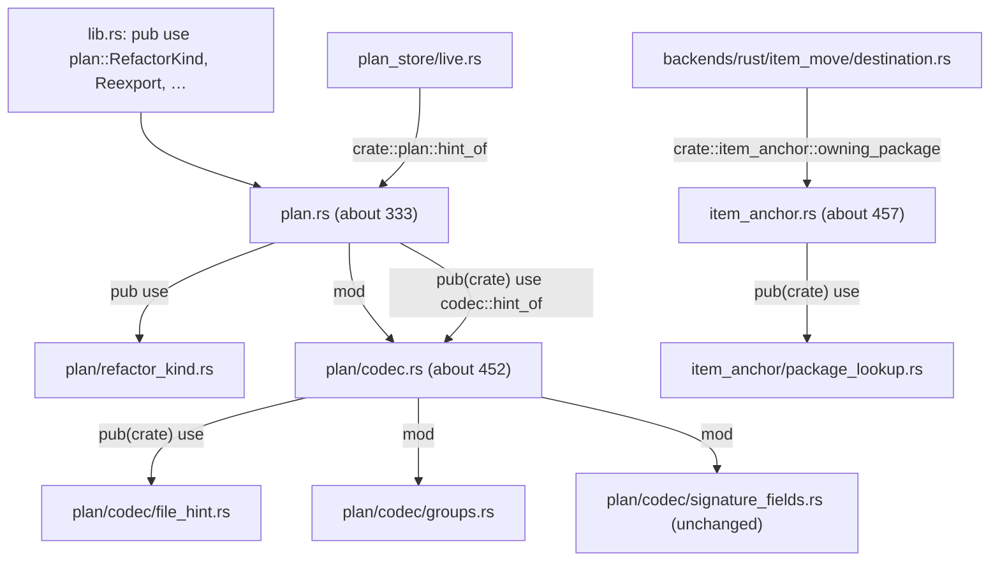

# Changeset: three `tddy-code-restructuring` files back under the 500-production-line budget, by the engine's own moves

**Date**: 2026-10-05
**Status**: 🚧 In Progress
**Type**: Refactor (mechanical; engine moves only; no behaviour change)
**Stack**: `#sharpen` 1/8, branch `feature/sharpen/tidy-engine-files`, based on `master` (`a77bca29`).
Title: `refactor(code-restructuring): bring plan.rs, plan/codec.rs and item_anchor.rs under the 500-line budget (#sharpen 1/8)`

## Initial Discovery

Full codebase exploration that grounded this plan: [initial-discovery.md](./2026-10-05-sharpen-tidy-engine-files-initial-discovery.md).

State A below is distilled from that file. Do not duplicate grep traces or file dumps here.

## Prerequisites

The scan followed `deferred-work/references/planning-cross-check.md`. Packages in scope: `tddy-code-restructuring`
(five records in `docs/code-issues/`; no live `Claimed by:`, the one hit, `broken-restructure-anchors-empty-outline.md`,
claims `none`: #537 merged). No other package is edited; `tddy-tools`, `tddy-index-daemon` and `tddy-daemon-rpc`
depend on this crate and are only compiled (see Testing plan).

### ✅ RESOLVED HERE — three files past the 500-line budget — [`2026-10-05-restructure-engine-files-past-the-500-line-budget.md`](../todo/2026-10-05-restructure-engine-files-past-the-500-line-budget.md)

**Claimed 2026-10-06**: the closing measurement (`restructure check <measuring plan> --budget 500`, milestone M5) printed
`budget: every file the plan names is within 500 production lines`, with `plan.rs` **333**, `plan/codec.rs` **455** and
`item_anchor.rs` **458** production lines — all at or under 500. `/wrap-context-docs` deletes the todo file for this
✅ verdict.

### ⚠ DURING — `FileHint.modified` is written and never read — `packages/tddy-code-restructuring/docs/code-issues/dead-code-plan-filehint-modified.md`

`hint_of` moves verbatim to `plan/codec/file_hint.rs`. No second writer of `modified` is added, and the field is not
deleted here (that is "ordinary work, not a `/code-restructuring` job" per the record). The record names
`plan/codec.rs:219`; M6 appends one measurement-history row naming the new location. Code-issue records are the one
place `packages/*/docs/` is edited directly.

### ⚠ DURING — `extract_module` drops comments and cannot see sibling seams — [`2026-09-18-extract-module-cannot-see-sibling-seams-in-one-plan.md`](../todo/2026-09-18-extract-module-cannot-see-sibling-seams-in-one-plan.md), [`2026-09-24-restructure-extract-drops-comments-and-writes-clippy-failing-signatures.md`](../todo/2026-09-24-restructure-extract-drops-comments-and-writes-clippy-failing-signatures.md)

The plans use `move_item` with `name` (byte-range copy, comments arrive as written), not `extract_module`
(see Decisions D2). The comment-line multiset check (acceptance C3) is how this node proves nothing was dropped.

### ⚠ DURING — `move_item` copies the whole `use` header — [`2026-10-04-restructure-move-item-copies-the-whole-use-header.md`](../todo/2026-10-04-restructure-move-item-copies-the-whole-use-header.md)

Each new child gets the parent's whole `use` header; the unused-import tidy at the end of a **complete** run removes
what it does not use. So no plan is run with `--stop-after`, and a run that stops early is rolled back, not committed.

### ⚠ DURING — a compiling apply can still leave the lint gate red — [`2026-09-24-restructure-apply-leaves-the-lint-gate-red.md`](../todo/2026-09-24-restructure-apply-leaves-the-lint-gate-red.md)

`cargo clippy -p tddy-code-restructuring --all-targets -- -D warnings` and `cargo fmt --check` run after every plan
(scoped to the one package). One lint is predicted (D4, `rfc3339`'s facade).

### ℹ NOTED — records and todos considered, not touched

- `packages/tddy-code-restructuring/docs/code-issues/oversized-file-backends-rust.md` (2,852 production lines): this
  node adds **0** lines to `backends/rust.rs`; its record is not touched. It is the op nodes' ⚠ DURING.
- [`2026-10-03-restructure-rust-backend-grows-with-every-live-plan-node.md`](../todo/2026-10-03-restructure-rust-backend-grows-with-every-live-plan-node.md): unrelated to this node.
- `docs/dev/1-WIP/2026-09-17-restructure-refusal-truth-and-authoring-gates.md` (every milestone `[x]`, introduced `snapshot`):
  looks unwrapped rather than active; not this stack's to wrap, ask whether it is stale before any wrap.
- `packages/tddy-code-restructuring/README.md:123-124` lists `runner/tidy.rs` as over the budget; by the budget rule it has
  36 production lines (its first `#[cfg(test)] mod` opens at line 37). A wrap-time correction (M6).
- Open draft PR #586 edits `run-index-daemon`, `.agents/skills/code-restructuring/SKILL.md` and a todo; this node touches none of them.
- `packages/tddy-lsp` has no `docs/code-issues/` and is not touched.

## Affected Packages

- **`tddy-code-restructuring`**: [README.md](../../../packages/tddy-code-restructuring/README.md) — the "Where the code lives" table and the
  over-budget sentence (lines 123-128) are corrected at wrap.
  - [item-anchors.md](../../../packages/tddy-code-restructuring/docs/item-anchors.md) — the `item_anchor.rs` row gains the package-lookup child
  - [signature-assists.md](../../../packages/tddy-code-restructuring/docs/signature-assists.md) (line 13), [signature-rewrites.md](../../../packages/tddy-code-restructuring/docs/signature-rewrites.md) (line 14),
    [same-crate-moves.md](../../../packages/tddy-code-restructuring/docs/same-crate-moves.md) (line 62) — name `plan.rs` as the home of `RefactorKind` and its predicates; stale once `RefactorKind` moves (D1, decided)
  - [code-issues/dead-code-plan-filehint-modified.md](../../../packages/tddy-code-restructuring/docs/code-issues/dead-code-plan-filehint-modified.md) — one history row
- **`tddy-tools`, `tddy-index-daemon`, `tddy-daemon-rpc`**: **not edited.** They are compiled in the closing gate to show the public paths survive.

## Related Feature Documentation

None: this is a behaviour-preserving restructure. There is no PRD.

## Summary

`plan.rs` (520), `plan/codec.rs` (514) and `item_anchor.rs` (517) crossed the 500-production-line budget when the
same-crate moves landed, and the developer deferred the split with consent. This node splits each along the seam the
growth made, with the engine's own `move_item` into new child modules, leaving a `pub use` facade at every old path so no
other file in the repository changes.

## Background

`restructure check --budget 500` found the three files at the end of the same-crate-moves change
([the todo](../todo/2026-10-05-restructure-engine-files-past-the-500-line-budget.md)). The `#sharpen` stack then adds
four operations and two header paths to exactly these files: `plan-header` edits `plan/codec.rs`; `retarget-impl`,
`repoint-call` and `repoint-facade` each add a `RefactorKind` variant, `RefactorOp` fields and a codec call. Landing those
on files already over the line, or leaving them a few lines under it, would re-open the todo at once. On 2026-10-05 the
developer decided to add this mechanical node first, against the recommendation to decline. It is also the engine's second
real use on a codebase that has it.

## Responsibility

- Bring `src/item_anchor.rs`, `src/plan/codec.rs` and `src/plan.rs` to **500 production lines or fewer** (the
  `check --budget` rule), each with the headroom D1 (decided) and D6 discuss, by moving contiguous runs of items into new child modules.
- Use only the engine: `tddy-tools restructure` with `move_item` (with `name`), one plan per file, `check --deep` before each apply.
- Leave a facade at each old path (`reexport: named` where something outside the new module reaches the item, `none`
  where only the source file does), so the public paths (`tddy_code_restructuring::{RefactorKind, Reexport, …}`,
  `item_anchor::owning_package`, `plan::hint_of`) and every consumer file are unchanged.
- Record the three measured numbers, and resolve the todo only if all three are at or under 500.

## Boundaries

- **No behaviour change.** No function body, signature, doc comment or test changes. The only text added to the three
  files is `mod` and `pub use` lines; the only new files are the child modules.
- **Engine moves only.** A refusal from `check --deep` or `apply` **stops and asks the developer** (a refusal means consent
  is needed). Hand edits after an apply are build or lint corrections only, each with a `TODO(sharpen)` and a line under
  Technical debt. No `git mv`.
- **Consumers are not edited.** `git diff --stat <base>..HEAD` names the three source files, their new children, the
  code-issue record and this node's documents, and nothing else under `packages/` (acceptance C4).
- **Left alone:**
  - `parse_op` (198 raw, 137 code lines, `codec.rs:295-492`) and the `impl Plan` block: an `impl` member cannot move alone,
    and `parse_op` is under the 150-line function budget.
  - `RefactorOp`, `Anchor`, `Plan`, `FileHint`, `OpId`, `OrderKey` (kept in `plan.rs`; D1 moves `RefactorKind` and its `impl` only, so every later `RefactorOp` field is still added in `plan.rs`).
  - `RefactorOp`'s construction: no `Default` derive, no migration of the struct literals (D7, decided).
  - `backends/rust.rs` (2,852; its own record), `crate_move/test_binary.rs` (967; its own record), `backends/rust/item_path.rs` (490, inside the budget).
  - Test modules: `plan.rs`'s 1,159 test lines stay where they are (the budget counts production lines).
- **No new test binary, no new test.** The acceptance is the existing suite, unchanged by name, plus the length gate.
- **No new crate edge, no dependency.**

## Dependencies

| Parent node | What it delivers | How this PR consumes it | This PR does NOT |
|---|---|---|---|
| none | This is `#sharpen` 1/8; its base is `master` `a77bca29`. No ancestor in the stack exists. | — | — |

## Draft PR contract

This is a mechanical restructure, the first of the pr-stack skill's two named exceptions ("a purely mechanical rename /
move / extraction with no behaviour change"). **There is no contract commit and there are no red tests**: the draft is this
plan. What the draft pins, and what green must then satisfy:

- the baseline: `./test -p tddy-code-restructuring`, recorded once at M0 (counts and names), re-run at M5 with the same
  failing set by name (expected: none; any pre-existing failure is recorded by name at M0, not fixed here);
- acceptance checks C1-C6 (see Acceptance tests): the length gate, the comment-line multiset, the file-set check, the
  dependents' `cargo check --all-targets`, the facade-only visibility check, and `restructure verify`.

The surface wave 2 inherits is a **layout**, not a signature (D1, decided): `RefactorKind` and its `impl` (the variants and the predicates) in `plan/refactor_kind.rs`, with `RefactorOp` still in `plan.rs`; the codec helpers in `plan/codec/{file_hint,groups}.rs`, `owning_package` in
`item_anchor/package_lookup.rs`; every path they had before still resolves.

## Green wave

**Wave:** 1 of 2.
**Greenable independently:** **yes.** It needs nothing from another node: its base is `master`, the engine it uses is the one on `master`.
**Concurrent with:** `feature/sharpen/move-fidelity`, `feature/sharpen/spawn-record`, `feature/sharpen/apply-heartbeat`. `move-fidelity` adds `RefactorOp.canonical_paths` to `plan.rs` and one call to `plan/codec.rs` (its decision O1, decided: a plan field): different hunks, a merge-order overlap only, and the stack is linear, so it rebases onto this node.
**Blocks:** `feature/sharpen/plan-header`, `feature/sharpen/retarget-impl`, `feature/sharpen/repoint-call`, `feature/sharpen/repoint-facade` (they edit `plan.rs` / `plan/codec.rs`; this node gives them the headroom, and `RefactorKind`'s new home).
Real dependency edges (whole stack): `tidy-engine-files -> plan-header, retarget-impl, repoint-call, repoint-facade`; `move-fidelity -> repoint-facade`; `retarget-impl -> repoint-call`. Nothing else is an edge: `spawn-record` and `apply-heartbeat` consume nothing and nothing consumes them (`spawn-record` lands after open draft PR #586, a merge-order fact, not a stack edge).

## Scope

- [x] **M0 baseline**: `./test -p tddy-code-restructuring` once; counts and failing names recorded under Validation results.
- [x] **Seam 1 — `item_anchor.rs`**: `owning_package`, `repo_root_hint`, `collect_package_files` into `item_anchor/package_lookup.rs`,
  facade `pub(crate) use package_lookup::owning_package;`. Predicted 517 to about 457.
- [x] **Seam 2 — `plan/codec.rs`**: `hint_of` and `rfc3339` into `plan/codec/file_hint.rs` (facade `named`); `refuse_split_groups` into
  `plan/codec/groups.rs` (`none`). Predicted 514 to about 452.
- [x] **Seam 3 — `plan.rs`**: D1 (decided): `RefactorKind` and `impl RefactorKind` whole into `plan/refactor_kind.rs`, facade `pub use refactor_kind::RefactorKind;`.
  Predicted 520 to about 333.
- [x] **Length gate**: `restructure check <measuring plan> --budget 500` prints `budget: every file the plan names is within 500 production lines` for the three files; the three numbers are recorded.
- [x] **Final gate**: `cargo fmt --check`; `cargo clippy -p tddy-code-restructuring --all-targets -- -D warnings`; `./test -p tddy-code-restructuring` (failing set equals the baseline's by name);
  the comment-line multiset; `restructure verify --against <base>` read for its report; `cargo check -p tddy-daemon-rpc -p tddy-index-daemon -p tddy-tools --all-targets`.
- [x] **Records**: the todo claimed (✅) or narrowed; the code-issue history row; wrap-time corrections listed (README, three docs).

**Status indicators**: `[ ]` not started · `[~]` in progress · `[x]` complete ✅

## Technical changes

### State A (`master` `a77bca29`)

Production lines by the `check --budget` rule (`runner/budget.rs:production_lines`), measured with `wc -l` and the test-module offsets:

| File | Lines | Test module opens | Production | What the todo says grew it |
|---|---:|---|---:|---|
| `src/plan.rs` | 1,679 | line 521 | **520** | the two `RefactorKind`s, `Reexport::Outside`, a helper |
| `src/plan/codec.rs` | 514 | none | **514** | the codec rules for `move_item`, `reparent_module`, `outside` |
| `src/item_anchor.rs` | 979 | line 518 | **517** | the repo-root hint on `owning_package` |

Seams (all line numbers on `a77bca29`):

| File | Run | Lines | Outside reach | Facade form |
|---|---|---|---|---|
| `item_anchor.rs` | `owning_package`, `repo_root_hint`, `collect_package_files` | 76-138 (63) | `owning_package`: `item_move/destination.rs:12,26`; the other two: none | `named` (`pub(crate) use package_lookup::owning_package;`) |
| `plan/codec.rs` | `hint_of`, `rfc3339` | 212-254 (43) | `hint_of`: `plan.rs:502` then `plan_store/live.rs:19,144`; `rfc3339`: `plan.rs` tests (`:524,:1522,:1529`) | `named` (`pub(crate) use file_hint::{hint_of, rfc3339};`) |
| `plan/codec.rs` | `refuse_split_groups` | 271-294 (24) | none (`parse_ops:267`, same file) | `none` (caller re-pointed) |
| `plan.rs` | `RefactorKind` + `impl RefactorKind` | 136-325 (190) | `lib.rs:36` and every user of the kind | `named` (`pub use refactor_kind::RefactorKind;`) |

Existing precedents in the same files: `plan.rs:122-124` (`mod item_path; pub(crate) use …; pub use …;`) and
`plan/codec.rs:494` (`mod signature_fields;`, 131 lines, one call in `parse_op`).

### State B (after this node)

| File | Predicted production lines | Headroom to 500 | New child |
|---|---:|---:|---|
| `item_anchor.rs` | about 457 | about 43 | `item_anchor/package_lookup.rs` (about 64) |
| `plan/codec.rs` | about 452 | about 48 | `plan/codec/file_hint.rs` (about 46), `plan/codec/groups.rs` (about 26) |
| `plan.rs` | about 333 | about 167 | `plan/refactor_kind.rs` (about 192) |

The predictions are the removed line ranges plus two or three `mod`/`pub use` lines each. **The measurement is the gate, not this table.**
Public paths are unchanged. Nothing outside the three files and their children differs.

### Delta (What's Changing)

#### `tddy-code-restructuring`
- **Architecture**: four new child modules (above). Each old path keeps a facade line.
- **API**: none. `tddy_code_restructuring::{RefactorKind, Reexport, …}`, `item_anchor::owning_package` (`pub(crate)`) and `plan::hint_of` (`pub(crate)`) resolve as before.
- **Implementation**: moved verbatim by byte range. The one text change inside moved bytes the engine may make is a visibility spelling it widens as far as a caller needs (reported in the apply's notes; each is listed in the commit message).
- **Dependencies**: none.

### Acceptance graph — after this node



Must-not edges (each a checklist line in M5): no file outside the three and their children names `plan::refactor_kind`,
`codec::file_hint`, `codec::groups` or `item_anchor::package_lookup` (`grep -rn` returns only the facade lines); no `use` of a new child
module appears in `tddy-tools`, `tddy-index-daemon` or `tddy-daemon-rpc`; `signature_fields.rs` is byte-identical.

## Implementation milestones

All plans are authored with `restructure anchors <file> --items <names>` (never a hand-counted range), proved with `check --deep`
against a warm index (`eval $(./run-index-daemon | grep '^export ')`; six to ten minutes cold, seconds after), applied without
`--stop-after`, and committed one plan at a time (a failure then bisects to one move). `.restructure/` is cleared between plans.
A refusal at any step stops the node and asks.

- [x] **M0 — baseline.** `./test -p tddy-code-restructuring` (every target runs, `--no-fail-fast`); write the pass count and every failing test name into Validation results. Warm the index.
- [x] **M1 — `item_anchor.rs`** (the smallest, one seam, the first use of the engine here).
  - Anchor: `tddy-tools restructure anchors packages/tddy-code-restructuring/src/item_anchor.rs --items owning_package,repo_root_hint,collect_package_files`.
  - Plan (1 line): `move_item`, `to: "tddy_code_restructuring::item_anchor"`, `name: "package_lookup"`, `reexport: "named"`.
  - `check --deep` clean; apply; `cargo fmt`-clean as the apply leaves it; commit `refactor(code-restructuring): item_anchor package lookup into a child module (#sharpen 1/8)`.
  - Measure: `item_anchor.rs` at or under 500 (predicted about 457).
- [x] **M2 — `plan/codec.rs`** (two seams, one plan: D5 says when to split it).
  - Anchors: `--items hint_of,rfc3339` and `--items refuse_split_groups` (two `items` anchors, one file).
  - Plan (2 lines): `move_item` `to: "tddy_code_restructuring::plan::codec"`, `name: "file_hint"`, `reexport: "named"`; and `name: "groups"`, `reexport: "none"`.
  - Expect D4 (the `rfc3339` facade lint) here. Commit `refactor(code-restructuring): plan codec hints and group rule into child modules (#sharpen 1/8)`.
  - Measure: `plan/codec.rs` at or under 500 (predicted about 452).
- [x] **M3 — `plan.rs`** (D1, decided: `RefactorKind` whole).
  - Anchor: `--items RefactorKind,<RefactorKind>` (the enum and its inherent `impl`, adjacent: only a blank line between them).
  - Plan (1 line): `move_item` `to: "tddy_code_restructuring::plan"`, `name: "refactor_kind"`, `reexport: "named"`.
  - **Probe first (P1):** `check --deep` must accept an `impl` block inside a `move_item` run; no test exercises that today (`impl_item_anchor_acceptance.rs` does it for `extract_module`). A refusal stops the node and asks: the alternatives D1 weighed (`Reexport` alone, or `Reexport` plus the predicates) or `extract_module` with the comment check each need the developer's word, because D1 was decided for the whole move.
  - Commit `refactor(code-restructuring): RefactorKind into plan/refactor_kind.rs (#sharpen 1/8)`.
  - Measure: `plan.rs` at or under 500 (predicted about 333).
- [x] **M4 — final gate** (once, after the last plan): `cargo fmt --check`; `cargo clippy -p tddy-code-restructuring --all-targets -- -D warnings`;
  `./test -p tddy-code-restructuring`; the comment-line multiset (C3); `restructure verify --against <base>` (read its report: it is not trusted for its exit code on an extract); dependents' `cargo check --all-targets` (C4).
  A failure is fixed forward in a new commit; the per-plan commits are how the move is found.
- [x] **M5 — length gate and must-not edges.** Write the throwaway measuring plan (below), run `check --budget 500`, record the three numbers; run the
  must-not-edge greps; tick C1-C6. Then claim or narrow the todo.
- [x] **M6 — records.** `dead-code-plan-filehint-modified.md` gets one history row (new location of `hint_of`); the todo is claimed (✅) or narrowed; the wrap-time corrections are listed under Technical debt:
  README lines 123-128, `item-anchors.md`, `signature-assists.md:13`, `signature-rewrites.md:14`, `same-crate-moves.md:62`; the PRD reference line for `docs/ft/coder/1-OVERVIEW.md` does not apply (no PRD).

**The measuring plan** (not committed; the three applied plans are consumed, so a fresh one is written):

```
{"v":1,"snapshot":{}}
{"op":"rename_symbol","anchor":{"kind":"symbol","file":"packages/tddy-code-restructuring/src/plan.rs","path":"plan"},"name":"x"}
{"op":"rename_symbol","anchor":{"kind":"symbol","file":"packages/tddy-code-restructuring/src/plan/codec.rs","path":"codec"},"name":"x"}
{"op":"rename_symbol","anchor":{"kind":"symbol","file":"packages/tddy-code-restructuring/src/item_anchor.rs","path":"item_anchor"},"name":"x"}
```

`tddy-tools restructure check <it> --budget 500` (no `--deep`: nothing is resolved, no server starts). `check --budget` reports the files a plan's anchors name,
and prints the budget lines after the findings whatever the findings are (`check_plan`), so the lines are read even if a static finding is reported for these throwaway
ops. **Not run while planning** (the tree was read-only): if the CLI rejects the throwaway plan, fall back to the same rule applied by `awk` over the three files
(count the lines before the first `#[cfg(test)]` whose next non-blank line opens a `mod`) and say so in Validation results.

## Testing plan

### Testing strategy

**Primary test approach: the existing suite, unchanged, as the oracle for a behaviour-preserving move, plus one structural gate.**

- **Test level**: integration (the crate's own acceptance binaries, which boot a live rust-analyzer for most of them) and unit (`plan.rs`'s 74 `#[test]`s, which read `RefactorKind`, `Reexport`, the codec and `hint_of`).
- **Why**: a move cannot change what a test observes unless it changed behaviour; a *new* test of a moved function would specify where it lives, not what it does.
- **Approach**: record the baseline by name at M0, re-run `./test -p tddy-code-restructuring` once at M4, compare failing sets by name.

### Testing options analysis

#### Option 1 — existing suite + the length gate + structural checks (chosen)
**Test level**: integration + unit.
**Scope**: every moved item is exercised by an existing test: `hint_of` by `plan_store_acceptance.rs` / `live_plans_acceptance.rs` and the v2-header tests of `plan.rs`; `rfc3339` by `plan.rs::a_timestamp_is_written_as_rfc_3339_utc` and `a_time_before_the_epoch_is_left_out_rather_than_written_as_1970`; `refuse_split_groups` by `plan.rs::non_consecutive_members_of_one_group_are_refused`;
`owning_package` / `repo_root_hint` by `tests/anchors_package_relative_path.rs` (`names_the_repo_root_path_when_given_one_relative_to_a_package`, `still_refuses_it_rather_than_resolving_it_silently`); `RefactorKind` and `Reexport` by the 74 unit tests and every acceptance binary that builds a `RefactorOp`.
**Assertions**:
- [ ] **Same failing set**: the failing test names at M4 equal those at M0 (expected: the empty set).
- [ ] **Same pass count**: no test was added or removed, so the total equals M0's.
- [ ] **Length**: three numbers at or under 500 from `check --budget 500`.
- [ ] **Comments intact**: the `//` comment-line multiset across the touched files equals before (C3).
**Reliability considerations**: the live suites boot rust-analyzer and are load-sensitive (one server at a time, the harness lock and the nextest `rust-analyzer` group): run the package once, not per plan.
**Implementation location**: no new file.

#### Option 2 — a shape test pinning the new layout (rejected)
A test asserting `plan/refactor_kind.rs` exists would specify this node's layout and fail the first time wave 2 re-arranges it. The 2026-09-25 carve decision was "no shape tests"; the same applies. The must-not-edge greps are a checklist, not a test.

### Coverage requirements

- [ ] **Happy path**: the three plans apply, the tree compiles, the suite matches.
- [ ] **Error scenarios**: a refusal stops the node (D1, P1); a failing compile gate rolls back.
- [ ] **Edge cases**: the `rfc3339` facade lint (D4); a plan whose `check --deep` is clean and whose apply fails to compile (the sibling-seam defect: D5).
- [ ] **Actual effects**: line counts from the tool, `git diff --stat`, the comment multiset.

## Acceptance tests

No new test. The acceptance checks, each run literally at M4/M5 and ticked with its output:

### `tddy-code-restructuring` (existing suite, unchanged by name)
- [x] **C1 — the three files are within the budget**: `tddy-tools restructure check <measuring plan> --budget 500` prints `budget: every file the plan names is within 500 production lines` (instrument: `packages/tddy-code-restructuring/src/runner/budget.rs`). Fails today: it would print `budget: 3 of 3 file(s) over 500 production lines` with `plan.rs … 520 production lines, 20 over`, `item_anchor.rs … 517, 17 over`, `plan/codec.rs … 514, 14 over`. — ✓ 2026-10-06: prints exactly that line; measured `plan.rs` **333**, `plan/codec.rs` **455**, `item_anchor.rs` **458** production lines.
- [x] **C2 — the suite is unchanged by name**: `./test -p tddy-code-restructuring` has the M0 failing set and pass count (`packages/tddy-code-restructuring/tests/*.rs`, `src/**` unit tests). Passes today (it is the baseline); the check is that it still does. — ✓ 2026-10-06: **1,136 passed, 0 failed** across **55** targets, exit 0 — the same pass count and the empty failing set as M0.
- [x] **C3 — no comment was lost**: for the three files plus their new children, the sorted multiset of lines matching `^\s*//` is equal before and after, with `git show <base>:<file> | grep -E '^\s*//' | sort | uniq -c` against the working tree's. — ✓ 2026-10-06: **561** `//` lines before, all present after (nothing only-before); the after-tree has **564**, the three extra being the recorded `TODO(sharpen)` lint-correction markers (below), not lost comments.
- [x] **C4 — nothing else changed, and the dependents still build**: `git diff --name-only <base>..HEAD -- packages` lists only the three source files, the four children and `docs/code-issues/dead-code-plan-filehint-modified.md`; `cargo check -p tddy-daemon-rpc -p tddy-index-daemon -p tddy-tools --all-targets` is clean (scoped; the workspace-wide run is CI's). — ✓ 2026-10-06: the diff names the three sources, four children and the code-issue record and nothing else under `packages/`; dependents check clean (1m14s).
- [x] **C5 — the old paths resolve through facades only**: `grep -rn 'refactor_kind\|codec::file_hint\|codec::groups\|package_lookup' packages --include='*.rs'` returns the `mod`/`pub use` lines and the children themselves. — ✓ 2026-10-06: returns only `plan.rs:136,314` (facade + `mod`), `codec.rs:213,215,216` (facades + the `none` re-point), `item_anchor.rs:12,78` (facade + `mod`); no consumer file names a child.
- [x] **C6 — `restructure verify --against <base>`** reports every statement accounted for (read the report; the exit code is not trusted for a move that leaves a facade). — ✓ 2026-10-06: `355256 statements before, 355259 after`; `tokens lost: none`; the three gained statements are the recorded `TODO(sharpen)` comment lines. The tool exits non-zero on any gain, so its exit code is not the verdict — the report is: **nothing lost**.

## Decisions & Trade-offs

**Taken by the developer (2026-10-05):**
- *"8-node decomposition approved."*
- *Prep node: "ADD the mechanical node first (the developer overrode the recommendation to decline)."* (The recommendation was to avoid spending review budget on a prep node when child modules per new op would avoid growth; the developer chose to add it.)
- *The todo's own decision (the developer, 2026-10-05, deferring from the same-crate-moves change): split "with the engine's own operations". A second real use of the operations on a codebase that has them.*
- **D1 (DECIDED, developer-approved 2026-10-05) — move `RefactorKind` whole** (its definition and its `impl`) out of `plan.rs` into `plan/refactor_kind.rs`, the old path kept by `pub use refactor_kind::RefactorKind;`. `plan.rs` goes from 520 to about 333 production lines. The options weighed:

  | Option | Moves | `plan.rs` after (predicted) | Headroom | Wave 2 (+~48) |
  |---|---|---:|---:|---|
  | (a) | `Reexport` + `impl Reexport` (33 lines) | about 489 | about 11 | back over by the second kind |
  | (b) | (a) + `impl RefactorKind` (the predicates, 41 lines) | about 449 | about 51 | at 497: three lines under, brittle |
  | (c) **chosen** | `RefactorKind` whole with its `impl` (190 lines) | about 333 | about 167 | about 381 in `plan.rs`; the variants land in `refactor_kind.rs` (about 192 + 40) |

  **Consequence for every later node.** A new operation kind (`RetargetImpl`, `RepointCall`, `RepointFacadeImports`) is a variant added in `plan/refactor_kind.rs`, and a new predicate for it would go in the `impl RefactorKind` there. `RefactorOp` is **not** moved: it stays in `plan.rs`, so a new `RefactorOp` field (`canonical_paths`, `to_type`, `callee`) is still added in `plan.rs`. The cost accepted: the largest text move (190 lines, every one a pure move, visible with `git diff --color-moved`), `RefactorKind` leaves the todo's literal list (`Reexport`, predicates), and the `impl`-in-a-run probe (P1) must pass.
- **D7 (DECIDED, developer-approved 2026-10-05) — `RefactorOp`'s new fields are paid for by the node that adds them; this node stays a pure file-length restructure.** No `Default` derive and no migration of the struct literals here. Each of `move-fidelity` (`canonical_paths`), `retarget-impl` (`to_type`) and `repoint-call` (`callee`) edits every `RefactorOp` struct literal in **its own first commit**, checked with `cargo check -p tddy-code-restructuring --all-targets` (`cargo build -p` does not compile the test targets that hold most of them). **Measured on `a77bca29`:** `git grep -n 'RefactorOp {' -- packages | wc -l` prints 80, all in `tddy-code-restructuring`. Classified by reading each brace body: 2 definitions (`struct RefactorOp`, `impl RefactorOp`), 41 function signatures that return it, 17 literals that end in `..base` (struct update; they need no edit), and **20 full struct literals in 15 files** (5 files in `src/`, 10 in `tests/`) that list every field. Cross-check: `git grep -n 'order: Vec::new()' -- packages/tddy-code-restructuring | wc -l` prints 20 and `git grep -l` of it lists 15 files, the same set (the one hit outside the crate, in `tddy-discovery`, is an unrelated struct). The "80 sites in 22 files" of an earlier draft counted every textual `RefactorOp {`; only the 20 need an edit.

**Settled by this plan (reversible; say if you disagree):**
- **D2 — the engine operation is `move_item` with `name`, not `extract_module`.** `move_item` copies the moved items by byte range, so comments arrive unchanged (`move_item_acceptance.rs::keeps_the_doc_comment_the_attribute_and_the_inner_comment_of_the_moved_item`); `extract_module` carries two open defect records that matter here (drops comments; blind to sibling seams in one plan). The todo wrote "`extract_module` with `to_file`, then `move_item`"; this plan does the first half with `move_item` because the new module is a child of the file's own module, which `name` creates (`<module dir>/<name>.rs`). Cost: the whole `use` header is copied and the end-of-run tidy prunes it (the todo above). If `check --deep` refuses `move_item` over an `impl` (P1), `extract_module` with `to_file` is the fallback, and C3 then matters most.
- **D3 — facade form.** `named` where something outside the new module reaches the item (`pub(crate) use` or `pub use` at the old path, the `item_path` precedent); `none` for `refuse_split_groups`, which only its own file calls. `none` or `outside` on `owning_package`/`hint_of`/`RefactorKind` would re-point 30-plus files, which is the opposite of mechanical, and would need the engine to widen the new modules to `pub(crate)`.
- **One commit per plan**, as the skill's testing cadence says; the single full test run is at the end.

### OPEN decisions

- **D4 (OPEN, decided only if it fires) — `rfc3339`'s facade line is unused outside tests.** `plan.rs`'s test module is the only outside user (`:524,:1522,:1529`), so `pub(crate) use file_hint::{hint_of, rfc3339};` is likely reported as an unused import (`-D warnings`) in a non-test build. Not verified. Options: (i) hand-edit the one line to `#[cfg(test)] pub(crate) use file_hint::rfc3339;` plus `hint_of` on its own line, with `TODO(sharpen)`: a lint correction, allowed after an apply; (ii) leave `rfc3339` in `codec.rs` and move only `hint_of`: not possible, `hint_of` calls it; (iii) move the two `rfc3339` unit tests into `file_hint.rs`: a hand edit of tests, beyond a build correction. **Recommendation: (i), with your word at that point.**
- **D5 (OPEN, minor) — one plan per file or per seam for `plan/codec.rs`.** The brief says one plan per file; `codec.rs` has two seams (`file_hint`, `groups`) that reference nothing of each other, so the sibling-seam defect should not apply. If `check --deep` is clean and the apply still fails the compile gate, that is the defect's signature: roll back and run one plan per seam. **Recommendation: one plan, split on the first sign.**
- **D6 (OPEN, minor) — headroom floor.** The todo asks only for "under 500". This plan states about 43 to 167 lines of headroom as a prediction, not a requirement; the requirement is at or under 500 with the measured number recorded. If you want a floor (for example at most 460, which `item_anchor.rs` and `plan/codec.rs` meet in the predictions), it becomes a line in C1. **Recommendation: no floor beyond 500; the measured numbers are the record.**

**Risks and probes (each a stop-and-ask, none a silent fallback):** P1 — `move_item` over an `impl` block in the run (M3); P2 — `named` facade for a `pub(crate)` item (M1, M2); P3 — `none` re-point of a private function whose caller is a top-level free function in the source file (M2, `refuse_split_groups`); P4 — the apply's compile gate with a facade whose only user is `cfg(test)` (D4).

## Technical Debt & Production Readiness

### Lint corrections after the apply (three `TODO(sharpen)` markers)

`move_item` copies the source file's whole `use` header into each child, and the engine's end-of-run
unused-import tidy is unreachable on a resumed run, so the copied-but-unused imports were pruned by hand
in the same commits as the moves. Three `TODO(sharpen)` comment lines mark them, and each is a build/lint
correction allowed by the Boundaries ("hand edits after an apply are build or lint corrections only"):

- `plan/codec/file_hint.rs:1` and `plan/codec/groups.rs:1` — the unused copied-header imports;
- `plan/codec.rs:212` — D4 fired: `rfc3339`'s only outside user is `plan.rs`'s test module, so its facade
  line is gated `#[cfg(test)]` (option (i), the developer's word taken 2026-10-06).

These are the three statements C6 reports as *gained* and the three lines by which C3's after-multiset
exceeds the before-multiset. They are comments only; no code was added.

### Wrap-time corrections (packages/*/docs — not editable here)

Listed for `/wrap-context-docs`; `packages/*/docs/` is not edited directly (the code-issue record above is
the one exception, and it is done):

- `packages/tddy-code-restructuring/README.md:123-128` — the "Where the code lives" table and the
  over-budget sentence; add the four children and correct `runner/tidy.rs` (36 production lines by the
  budget rule, not over the line as the README's sentence implies).
- `packages/tddy-code-restructuring/docs/item-anchors.md` — the `item_anchor.rs` row gains the
  `package_lookup.rs` child.
- `packages/tddy-code-restructuring/docs/signature-assists.md:13`,
  `docs/signature-rewrites.md:14`, `docs/same-crate-moves.md:62` — each names `plan.rs` as the home of
  `RefactorKind` and its predicates; stale now that `RefactorKind` lives in `plan/refactor_kind.rs`.

## Refactoring Needed

(Empty; populated by each validation phase.)

### From @ft-dev (Acceptance Test Creation)
### From @red (TDD Red Phase)
### From @validate-changes (Change Validation)
### From @validate-tests (Test Quality)
### From @prod-ready (Production Readiness)
### From @analyze-clean-code (Code Quality)
### From @refactor (Completed Refactorings)

## Validation Results

The node's own gates (M0, M4/M5) are recorded below; the `@validate-*` sections fill at their commands.

### Baseline (M0)

`./test -p tddy-code-restructuring` (2026-10-06, `--no-fail-fast`, 55 test targets): **1,136 passed, 0 failed**.
Failing set by name: **none** — the expected empty set. (One environment fix before the run: a stale, gitignored
fixture repo from an earlier killed run at
`packages/tddy-tool-engine/tests/fixtures/buildbox-root/home/dev/repo/.worktrees/sess` made the SSH-exec fixture's
`git init` fail with a template-copy EEXIST; the directory was removed and recreated by the fixture script itself.)

### Final gate and length gate (M4/M5)

Run 2026-10-06 against base `d6b369b7` (the branch's merge base with `master`), scoped to the one package:

| Check | Command | Result |
|---|---|---|
| Format | `./dev cargo fmt --check` | `FMT_OK` |
| Lint | `./dev cargo clippy -p tddy-code-restructuring --all-targets -- -D warnings` | `CLIPPY_OK` |
| Dependents | `./dev cargo check -p tddy-daemon-rpc -p tddy-index-daemon -p tddy-tools --all-targets` | clean, 1m14s |
| C1 length | `tddy-tools restructure check .restructure/m5-measure.jsonl --budget 500` | `budget: every file the plan names is within 500 production lines` |
| C2 suite | `./test -p tddy-code-restructuring` | 1,136 passed, 0 failed, 55 targets, exit 0 — same as M0 |
| C3 comments | multiset of `^\s*//` before vs after | 561 before, all present; 564 after (3 recorded `TODO(sharpen)`) |
| C4 file set | `git diff --name-only d6b369b7..HEAD -- packages` | three sources, four children, the code-issue record |
| C5 facades | `grep -rn 'refactor_kind\|codec::file_hint\|codec::groups\|package_lookup' packages` | facade/`mod` lines only |
| C6 verify | `tddy-tools restructure verify --against d6b369b7` | 355256 before, 355259 after; **tokens lost: none** |

**Measured production lines** (the budget rule, `runner/budget.rs`): `plan.rs` **333** (from 520),
`plan/codec.rs` **455** (from 514), `item_anchor.rs` **458** (from 517). All at or under 500, so the
todo's ✅ verdict holds and its file is deleted at wrap.

**Decisions that fired during the moves:**

- **P1 passed** — `check --deep` accepted an `impl` block inside a `move_item` run (M3), so `RefactorKind`
  moved whole (D1) with no fallback.
- **D4 fired** — `rfc3339`'s facade line was unused outside `plan.rs`'s test module; option (i) taken
  (`#[cfg(test)]` on that line), the developer's word 2026-10-06. See Technical debt.
- **D5 did not fire** — one plan for `plan/codec.rs`'s two seams applied and compiled; no split needed.
- **D6** — no headroom floor beyond 500; the three measured numbers are the record.

### Change Validation (@validate-changes)
### Test Validation (@validate-tests)
### Production Readiness (@prod-ready)
### Code Quality (@analyze-clean-code)

## Successor PRs

Forward links only; a child never links back. Branches that edit the files this node restructures and depend on its layout:
`feature/sharpen/plan-header`, `feature/sharpen/retarget-impl`, `feature/sharpen/repoint-call`, `feature/sharpen/repoint-facade`.
(`feature/sharpen/move-fidelity` is the next node on the line; it has no behavioural dependency on this one.)

## TODO

- [x] Record initial discovery (`2026-10-05-sharpen-tidy-engine-files-initial-discovery.md`)
- [x] Cross-check `packages/*/docs/code-issues/` and `docs/dev/todo/` for items this change touches (Step 2b)
- [x] Create/update PRD documentation (none: mechanical restructure, no PRD)
- [x] Create changeset (this document)
- [x] Create failing acceptance tests (none: no new tests; acceptance is C1-C6)
- [x] Run acceptance tests (verify they fail) (C1 fails today by construction: 3 of 3 files over)
- [ ] USER REVIEW — acceptance tests
- [x] TDD Red — write failing unit/integration tests (none)
- [x] TDD Green — implement with quality code (M1-M3, by the engine)
- [x] Update documentation with progress
- [x] Repeat Red→Green→Update cycle until feature complete
- [x] Run all tests (`./test`) — verify 100% pass (scoped: `./test -p tddy-code-restructuring`; the whole workspace is CI's)
- [ ] Validate changes (/validate-changes)
- [ ] Refactor issues from change validation
- [ ] USER REVIEW — development complete
- [ ] Validate tests (/validate-tests)
- [ ] Refactor test issues
- [ ] Validate production readiness (/validate-prod-ready)
- [ ] Refactor production readiness issues
- [ ] Analyze code quality (/analyze-clean-code)
- [ ] Refactor code quality issues
- [ ] Final validation (/validate-changes)
- [x] Linting and formatting (`cargo clippy -p tddy-code-restructuring --all-targets -- -D warnings`, `cargo fmt`)
- [ ] Wrap documentation (/wrap-context-docs) — when the PR is set ready for review; also deletes `2026-10-05-sharpen-tidy-engine-files-initial-discovery.md`
- [ ] USER REVIEW — work complete, decide next steps

## References

- The todo this resolves: [`2026-10-05-restructure-engine-files-past-the-500-line-budget.md`](../todo/2026-10-05-restructure-engine-files-past-the-500-line-budget.md)
- The restructuring skill: `.agents/skills/code-restructuring/SKILL.md` (testing cadence, "Prove before you pay")
