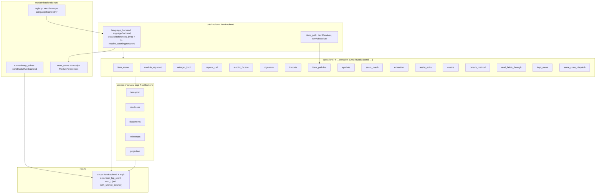

# Changeset: `RustBackend`'s operations become functions over a session — `detach_method`, and the backend restructured with it

**Date**: 2026-10-09
**Status**: 🚧 In Progress
**Type**: Feature (one new restructure operation, one `verify` declaration) + Refactor (behaviour-preserving, engine-driven conversion of the Rust backend)
**Stack**: `#reshape` 18/19, branch `feature/reshape/backend-session`, green wave 4. PR title:
`feat(code-restructuring): detach_method, and RustBackend's operations become session functions (#reshape 18/19)`.
Base in the linear stack: `feature/reshape/rust-backend-split` (K=17). **Real edges**: in, `rust-backend-split → backend-session`
(K=17: the modules this node converts) and `methods-leave-type → backend-session` (K=6: self-mode text rewrite, R-rebind).
Out: none. Next in the line is `feature/reshape/fn-sizes-backend` (K=19), sequential only.

> **Decided 2026-10-09 (developer, PRD review):** F1 = (c), `detach_method` inside this node (the stack stays at 19);
> F3 = the dispatcher seam is deferred to stack 2 as a todo; F2 and F4–F11 as recommended. F11 is resolved against node 17's
> changeset (§ Decisions).

## Initial Discovery

Full codebase exploration that grounded this plan: [initial-discovery.md](./2026-10-09-reshape-backend-session-initial-discovery.md)
(Exploration 1 is the whole-work discovery; Exploration 2 is this node's: the inherent surface, the dispatch, and the engine
routes from method to function).

State A below is distilled from that file. Grep traces and file dumps are not repeated here.

## Prerequisites

`grep -rl 'Claimed by:'` over `packages/tddy-code-restructuring/docs/code-issues/` finds one record. It is
`broken-restructure-anchors-empty-outline.md`, claimed by none and owned by `#reshape` 12. No record names `RustBackend`'s
inherent members, the dispatcher or `verify`'s declarations. **No claimed issue is in the path, so there is no
wait-or-proceed fork.**

This node claims no backlog entry. It is a prerequisite of stack 2.

| Item | Verdict | What this change does about it |
|---|---|---|
| [2026-10-08-split-tddy-code-restructuring-into-wiring-and-engine-crates.md](../todo/2026-10-08-split-tddy-code-restructuring-into-wiring-and-engine-crates.md) (stack 2) | partial (prerequisite only; stack 2 claims it) | Its first blocker goes: no operation is an inherent member any more. It also answers the entry's open question "is `backends/rust.rs` a dispatcher into every operation?" Yes, and its trait impl pins the dispatcher to the type's crate. That last seam is written up as a new todo, `2026-10-09-the-rust-backend-trait-impls-pin-every-operation-to-the-crate-of-the-type.md` (F3). The entry itself is not edited |
| `packages/tddy-code-restructuring/docs/code-issues/oversized-file-backends-rust.md` ([record](../../../packages/tddy-code-restructuring/docs/code-issues/oversized-file-backends-rust.md)) | ⚠ **DURING** (closed by `rust-backend-split`'s wrap) | Every file touched stays within 500 production lines, held by the file-budget shape test that node 17 leaves with no exemption. A detach adds one line per function (the `session` parameter) and removes the block's header and braces |
| [2026-10-03-restructure-rust-backend-grows-with-every-live-plan-node.md](../todo/2026-10-03-restructure-rust-backend-grows-with-every-live-plan-node.md) | ⚠ **DURING** (closed by `rust-backend-split`'s wrap) | Wiring only, in the dispatcher module: `mod detach_method;`, one `SUPPORTED` entry, one `check` arm and one `resolve` arm |
| Function-size list (whole-work discovery, Exploration 3; owned by `fn-sizes-backend`) | ⚠ **DURING** | No function on the list grows by logic. A detached body keeps its lines; `self` → `session` can rewrap a line rustfmt then breaks (F10). `resolve_opening` gains the one `resolve` arm of the new operation (3 lines), as nodes 6 and 13 add theirs. All new logic is in new functions of at most 60 lines |
| [2026-10-02-rust-backend-locate-symbol-waits-on-an-empty-outline-with-no-deadline.md](../todo/2026-10-02-rust-backend-locate-symbol-waits-on-an-empty-outline-with-no-deadline.md) | — Unrelated | `locate_symbol` becomes a free function with an unchanged body. Its fix is unaffected. The entry's location reference is updated at wrap |
| [2026-10-09-restructure-dead-pub-wrappers-are-not-reported.md](../todo/2026-10-09-restructure-dead-pub-wrappers-are-not-reported.md) | — Unrelated | `detach_method` leaves no wrapper |
| Other `docs/code-issues/*` (`broken-restructure-anchors-empty-outline.md`, `complexity-rust-facade-lines.md`, `dead-code-plan-filehint-modified.md`, `oversized-file-test-binary.md`) | — | Not in the path |

## Affected Packages

- **`tddy-code-restructuring`**: [README.md](../../../packages/tddy-code-restructuring/README.md).
  - Plan surface:
    - `src/plan/refactor_kind.rs`: the `DetachMethod` variant;
    - `src/plan/codec.rs`: one `mod` and one call;
    - new `src/plan/codec/detach_fields.rs`;
    - `src/plan.rs`: doc line on `name`; **no new field**.
  - Operation:
    - new `src/backends/rust/detach_method.rs` with children `detach_method/{text,calls,typing}.rs`;
    - wiring in the dispatcher module (`src/backends/rust/language_backend.rs` after node 17).
  - Visibility only: `src/backends/rust/retarget_impl/outline.rs` (`read`, `Run`, `Member`), node 6's
    `src/backends/rust/read_fields_through/{range,edits,typing}.rs` (the self-mode text functions and `field_type`).
  - Verify: new `src/verify/detach.rs`, `src/verify/retarget.rs` (`Declared.detaches`, `with_detaches`), `src/verify.rs`
    (pass order and re-export).
  - Front end: `src/restructure_args.rs` (`--detach`), `src/runner/options.rs`, `src/runner/comparison.rs`.
  - The restructure: every `src/backends/rust/**` module holding an `impl RustBackend` block other than `rust.rs`,
    `transport.rs`, `readiness.rs`, `documents.rs`, `references.rs` and `projection.rs`. That is about 20 modules after node 17, listed
    under State B. Callers are re-pointed in the trait-impl modules (`language_backend.rs`, `item_path.rs`) and in
    one another.
  - New `tests/detach_method_plan_lines.rs`, `tests/detach_method_acceptance.rs` (live), `tests/verify_accounts_for_a_detach.rs`,
    `tests/rust_backend_session_shape.rs`.
- **`tddy-index-daemon`**: [README.md](../../../packages/tddy-index-daemon/README.md). `proto/code_index.proto`
  (`VerifyRequest.detaches = 6`), `src/cli.rs` and `src/queries.rs` (pass-through), `tests/dual_transport_acceptance.rs`.
- **`tddy-tools`**: `src/index_client.rs` carries `detaches`.
- **Config**: `.config/nextest.toml` (`rust-analyzer` group) and `.config/rust-e2e.filterset` gain `detach_method_acceptance`.
- **Docs at wrap**:
  - new `packages/tddy-code-restructuring/docs/detach-method.md`;
  - [rust-code-restructuring.md](../../ft/coder/rust-code-restructuring.md): `## Rust operations (v1)`, `## Verify`, `## CLI`;
  - [plan-schema.md](../../../.agents/skills/code-restructuring/references/plan-schema.md) and `SKILL.md`: the operation
    count goes up by one, and a recipe line ("method out of a type: `detach_method`, then move the function");
  - the package README's source-layout table: the session modules and the free operations.

## Related Feature Documentation

- [PRD-2026-10-09-reshape-backend-session.md](../../ft/coder/1-WIP/PRD-2026-10-09-reshape-backend-session.md) (this PRD)
- [Rust code restructuring](../../ft/coder/rust-code-restructuring.md): `## Rust operations (v1)`, `## Verify`, `## CLI`

## Summary

**`detach_method`** turns the members of one inherent `impl` block into free functions over a named parameter, in the
same module and with the same visibility:
- `self` becomes the parameter and `Self` becomes the type;
- every caller the server reports is rewritten: `x.m(a)` → `m(x, a)` / `M::m(x, a)`, and `Self::m(a)` → `m(a)`;
- nothing is left on the type, and a block the run empties is removed.

**`verify --detach TYPE=NAME`** accounts for the result.

**The Rust backend is restructured with it.** `RustBackend` keeps:
- its construction surface in `rust.rs`;
- the transport, readiness, document and reference members in the four session modules;
- its five trait impls.

Every operation becomes `fn …(session: &mut RustBackend, …)`. The registry's `Box<dyn LanguageBackend>` and the runner's
construction are untouched.

## Background

Stack 2 splits this crate into engine crates (`docs/dev/todo/2026-10-08-split-…`). E0116 keeps every `impl RustBackend`
block in the type's crate, and every operation of the Rust backend is such a block: 79 members in 11 blocks today
(discovery § 1), and 88 at this node's base. So the backend cannot span crates.

The brief's recipe is node 6's self mode (`let session = self;`) followed by `extract_method`. That converts the body
and leaves a forwarding method plus every caller untouched (discovery § 7):
- `inline_method` binds every non-name argument with `let`, and copies `let session = self;` into each caller, where it
  moves `self` (E0382 at the next `self.`). It leaves the emptied block, and no live test pins its output.
- `repoint_call` with `add_call_arg` is exact, but costs two plan lines per caller (about 140) and leaves dead forwarders.
  No operation deletes an item.

A forwarder on the type is the very edge the split must cut. Hence the new operation. It takes node 6's self-mode text
rewrite and R-rebind, so the `6→18` edge is consumed as code. It also takes the shape of `retarget_impl`'s member reading
and of `repoint_call`'s reference classification.

## Responsibility

- New `RefactorKind::DetachMethod` (`detach_method`), its codec rules, and its `SUPPORTED`/`check`/`resolve` wiring. Its own
  resolver is a free function from the start.
- The function text, the caller rewrite, the block removal, every refusal below before any write, and the run note.
- `verify`: the R-detach rule and the `--detach` declaration through the library, the CLI, `tddy-tools` and the daemon.
- The Rust backend's conversion: every inherent member outside the construction surface and the session modules, detached
  by plan, plus the rename of `repoint_receivers`'s parameter to `session`.
- `tests/rust_backend_session_shape.rs`, which pins the end state, and registration of the one new live binary.
- The todos: the dispatcher seam (F3), `inline_method`'s unpinned output, and `detach_method`'s first-cut limits.

## Plan-line schema and the rules (the contract)

### `detach_method`

```jsonl
{"op":"detach_method","anchor":{"kind":"items","file":"packages/tddy-code-restructuring/src/backends/rust/retarget_impl.rs","items":["tddy_code_restructuring::backends::rust::RustBackend::retarget_impl","tddy_code_restructuring::backends::rust::RustBackend::retarget_range"],"fingerprints":["sha256:…","sha256:…"]},"name":"session"}
{"op":"detach_method","anchor":{"kind":"item","item":"app::host::Host::bump","file":"src/host.rs","fingerprint":"sha256:…"},"name":"session"}
```

| Field | Required | Meaning |
|---|---|---|
| `anchor` | yes | An `items` anchor over a contiguous run of members of **one inherent** `impl`, or one `item` anchor on one member. This is `retarget_impl`'s anchor, lowered and read by the same `outline::read`. A `symbol` or `range` anchor is refused (DP2) |
| `name` | yes | The parameter the receiver becomes: one identifier, not `self`, not a keyword (DP1) |
| `id`, `group` | as on every op | — |

`to`, `to_type`, `variant`, `expr`, `callee`, `type`, `order`, `reexport`, `also`, `to_file`, `canonical_paths` and
`with_private_deps` are not defined, so each is refused (DP3).

**Refusals, `plan is malformed:` class** (plain `check`, `check --deep`, `apply`):

| # | Message stem |
|---|---|
| DP1 | `` `detach_method` needs `name`: the parameter the receiver becomes `` / `` `name` must be one identifier other than `self`; `{name}` is not `` |
| DP2 | `` `detach_method` anchors on members of one inherent `impl` (an `items` or `item` anchor): `{kind}` names no members `` |
| DP3 | `` `{field}` is not a field of `detach_method` `` |

**Refusals, `this seam cannot be cut here:` class.** All are raised before any edit is built, by `check --deep` and
`apply`. One refusal lists every offending member or site with its file and line:

| # | Message stem | Read from |
|---|---|---|
| DS1 | `` `{T}::{m}` takes `self` by value: a function over a reference cannot take it. Construction stays a method `` | member signature |
| DS2 | `` the `impl` at line {n} carries generic parameters or a `where` clause, which a free function would have to restate `` | block header |
| DS3 | `` `{m}` is a member of `impl {Trait} for {T}`: trait members stay methods `` | outline / header |
| DS4 | `` `{T}::{m}` is `pub` and may have callers outside the workspace, which this run cannot rewrite `` | visibility |
| DS5 | `` `{T}::{m}` is an associated const or type: there is nothing to detach `` | member |
| DS6 | `` `{name}` is already written at line {n} of `{m}`: the parameter would shadow it `` | node 6's lexical shadow rule, whole body, masked |
| DS7 | `` `{module}` already declares or imports `{m}`: the function would be E0428/E0255 `` | module text |
| DS8 | `` the call at {file}:{line} has receiver `{r}` of type `{U}`, which is neither `{T}` nor a reference to it `` | hover on the receiver |
| DS9 | `` the reference at {file}:{line} is inside a macro invocation, which this run does not rewrite `` | masked caller text |
| DS10 | `` {file} binds `{M}` to something other than the module `{path}`: the call cannot be written `M::{m}` `` | caller module text |

A hover with no `name: Type` line in its code block is reported as `rust-analyzer's answer was unusable:` (node 6's `field_type`).
A receiver written `self` inside a method whose receiver is `&self` or `&mut self` is known to be a reference and is not
hovered.

**Edit** (one `FileEdit::Change` per touched file, as minimal edits):

1. **Function text**, for each member, in member order:
   - its attached trivia (doc comments, attributes, comments), byte for byte;
   - the header from the visibility to the parameter list, byte for byte;
   - the receiver: `&mut self` → `name: &mut T`, `&self` → `name: &T`, `&'a mut self` → `name: &'a mut T`, `self: &mut Self`
     → `name: &mut T`; a member with no receiver keeps its parameters;
   - every `self` token in masked code becomes `name` (node 6's `self_sites` + `rebound`);
   - every `Self` token in masked code, in the signature and the body, becomes `T` as the block's header writes it;
   - re-indented by the block's member indentation, except lines that start inside a string literal (masked text decides).
2. **Placement:** the functions follow the block's closing `}`, separated by one blank line. A block left with no member is
   removed, header to `}`, and the functions take its place.
3. **Callers:** `sites_of` returns every reference to every member, in every file. References inside the members' own
   bodies are rewritten in the function text.
   - **Method call** `R.m(args)` becomes `<callee>(<R'>, args)`, with the arguments byte for byte, and `(R')` when there
     are none. `R'` is `R` when `R` is a reference, and `&mut R` or `&R` (by the member's receiver) when it is a place of
     type `T`.
   - **Path call** `Self::m(args)`, `T::m(args)` or `<path>::T::m(args)` becomes `<callee>(args)`.
   - **Path value** `T::m` becomes `<callee>`.
   - `<callee>` is `m` in the function's own module. Elsewhere it is `M::m`, with `M` the last segment of the module's
     path, plus `use crate::<path to M>;` at the file's `use_insertion` point when the file does not bind `M`.
   - A comment naming the member is not edited, and is counted in the note.
4. Anything outside the members, the block and the call sites is byte-identical.

**Visibility is never changed.** An inherent method's visibility is relative to the module of its block. The function is
written in that module with the same visibility, so it is reached by exactly the callers that reached the method.

**Note** (`Resolution.notes`, printed by `apply` and `check --deep`):
`detach_method: RustBackend::retarget_impl, RustBackend::retarget_range became functions over `session`; 3 calls in 2 files re-pointed (1 `use` added, 1 comment left naming the method); the block was emptied and removed`.

**Limits (written in the docs; todo `2026-10-09-restructure-detach-method-first-cut-limits.md`):** generic impls (DS2), `pub`
members (DS4), smart-pointer receivers (DS8) and calls inside macros (DS9) are refused rather than handled. A borrow
conflict the rewrite introduces is left to the compile gate, as with every authored operation. This one is unexpected:
`m(R, args)` reborrows `R` exactly where `R.m(args)` did.

### `verify --detach TYPE=NAME`

- `verify::Detach { type_name, name }`, from `TYPE=NAME` (`TYPE` one path segment, `NAME` one identifier other than
  `self`). `Declared.detaches`. Repeatable.
- It **implies `--rebind NAME`** (node 6's R-rebind), because a detached body is a rebound body.
- **R-detach** (`verify/detach.rs`) runs after R-rebind. The following pair 1:1 into `repointed`:
  - a lost signature statement whose receiver is `&mut self` / `&self` / `&'a mut self`, with a gained one equal to it
    after the receiver is written `NAME: &mut TYPE` / `NAME: &TYPE` / `NAME: &'a mut TYPE` and `Self` is written `TYPE`;
  - a lost statement holding `R.m(args)`, with a gained one equal to it after each such call is written `m(R, args)`,
    `M::m(R, args)`, `m(&mut R, args)` or `m(&R, args)`, where `m` is a name some excused signature declares;
  - `Self::m(args)` / `TYPE::m(args)` with `m(args)` / `M::m(args)`;
  - a lost `impl TYPE {` header with no gained counterpart, once per emptied block.
- **Still reported:** a detach nobody declared; a call whose arguments changed; a receiver changed other than by the borrow;
  a gained function whose name no lost method had.
- **Carriers:**
  - `RestructureVerifyArgs.detach: Vec<String>` (`--detach`, `value_name = "TYPE=NAME"`);
  - `runner::Options.detaches`;
  - `runner/comparison.rs`;
  - `VerifyRequest.detaches = 6`;
  - `tddy-tools` `index_client.rs::verify`;
  - daemon `cli.rs` / `queries.rs`.
- **Honest limit:** `verify` proves that the differences have the shape the declaration produces. It does not prove that
  the plan produced them.

### The Rust backend's end state (the restructure's contract)

- **Stays a method, by rule (F4):**
  - the construction surface in `rust.rs` (node 17's block #1): `new`, `from_lsp_client`, `with_progress`,
    `with_cancellation`, `with_spawn_recorder`, `with_trace`, `with_wait_heartbeat`, and node 10's `with_silence_bounds`;
  - every inherent member written in a session module, whatever its name: `transport.rs`, `readiness.rs`,
    `documents.rs`, `references.rs`, and node 2's `projection.rs` (`stage_projection`, `open_staged_projection`: document
    staging, which `documents.rs`'s `did_open` calls, so detaching it would make a session module reach an operation
    module). A helper that `fn-sizes-backend` later extracts out of `start` or `request` stays legal.
- **Stays, by language:** the five trait impls, with signatures unchanged.
- **Becomes a free function over `session: &mut RustBackend` (or `session: &RustBackend`):** every other inherent member.
  State B lists them.
- **Dispatch is unchanged:** each trait member calls `closing_what_it_opens(|backend| x_opening(backend, …))` or the free
  resolver directly. `module_references`, `item_resolver` and `item_locator` still return `Some(self)`. `crate_move::resolve`
  and `span_of` take `session` where they took `self`.

## Boundaries

- No new `RefactorOp` field, so none of the 22 struct literals is edited.
- No session type is introduced, and `RustBackend` keeps all its fields (F2). The type split that stack 2 needs is
  deferred, as a todo (F3).
- `read_fields_through`, `extract_method`, `inline_method`, `retarget_impl` and `repoint_call` are not changed. Two modules
  are widened for reuse, and nothing else.
- No behaviour of any existing operation changes: refusal text, notes and report lines are byte-identical, as the baseline
  by name and `verify` pin.
- No function on the nodes 16/19 lists grows by logic. Every new function is at most 60 lines, and every file at most 500.
- Only the one new live binary is registered (the pre-existing unregistered suites are node 1's).
- No file outside `tddy-code-restructuring` is edited, except the `--detach` carriers in `tddy-index-daemon` and `tddy-tools`.
  No new dependency.
- Moves are engine-driven only (`tddy-tools restructure`). A hand edit only fixes the build after an engine move, and each
  one gets a `docs/dev/todo/` entry listed in the Final Checklist. A refusal stops the run, which is rolled back, and the
  developer is asked. Never `git mv`.

## Dependencies

| Parent node | What it delivers | How this PR consumes it | This PR does NOT |
|---|---|---|---|
| **`rust-backend-split`** (K=17, `feature/reshape/rust-backend-split`) | `backends/rust.rs` keeps the type and its constructors; members and trait impls are in child modules (`language_backend`, `assists`, `transport`, `assist_edits`, `extraction`, `seam_reach`, `references`, `symbols`, `handshake`, plus existing `readiness`, `documents`, `signature_rewrites`, `return_type`, `imports`); the session modules reach no operation module (its shape check) | The plans anchor on the modules node 17 creates; the session-module rule (F4) is node 17's line; node 17's edge check keeps holding | move a member between modules, re-split a file node 17 left, or duplicate node 17's checks. Reconciled with node 17's changeset (State B and plans A–K): `workspace_root`, `take_id` → `transport`; `inference_ready_at` → `assists` (detached here); `unresolved_names` → `extraction` (detached here); `settled_outline`, `outline_is_the_servers_answer` → `documents`; `references_outside`, `references_at` → `references` (F11) |
| **`methods-leave-type`** (K=6, `feature/reshape/methods-leave-type`) | `read_fields_through` self mode: `self_sites`, `rebound` (every `self` token in masked code → a name), the RS4 shadow rule, `field_type` (hover `name: Type` reader); `verify --rebind NAME` and R-rebind | The function text's `self` rewrite, DS6, receiver typing (DS8), and `--detach` implying `--rebind`. `read_fields_through`'s own resolver is one of the members this node detaches | change `read_fields_through`'s behaviour; it widens three of its functions to `pub(in crate::backends::rust)` and nothing else |

Nodes 1, 2, 4 and 13 also land first and add inherent members (discovery § 1). That is a textual overlap absorbed by
retaking the inventory, not a behaviour this node consumes, so it is not an edge.

## Draft PR contract

The first push of this PR publishes this **owned surface** (exact signatures) and the failing tests below:

- `RefactorKind::DetachMethod` (serde `detach_method`), in `plan/refactor_kind.rs`.
- `plan::codec::detach_fields::refuse_a_detach_it_cannot_honour(op: &RefactorOp) -> Result<()>` (`pub(super)`).
- `backends::rust::detach_method`:
  - `pub(super) fn findings(op: &RefactorOp, workspace: &Workspace<'_>) -> Result<Vec<String>>`
  - `pub(super) fn detach_method(session: &mut RustBackend, op: &RefactorOp, workspace: &Workspace<'_>) -> Result<Resolution>`
  - `text`:
    - `pub(super) enum Receiver { Unique, Shared, Absent }`
    - `pub(super) fn receiver_of(signature: &str) -> Result<Receiver>` (DS1)
    - `pub(super) fn refuse_undetachable(header: &str, members: &[(&str, &str)]) -> Result<()>` (DS1-DS5)
    - `pub(super) fn function_text(member_text: &str, name: &str, self_type: &str, indent: usize) -> Result<String>`
  - `calls`:
    - `pub(super) enum Reached { MethodCall { receiver: std::ops::Range<usize>, open: usize }, PathCall { path: std::ops::Range<usize> }, PathValue { path: std::ops::Range<usize> } }`
    - `pub(super) fn reached_at(masked: &str, offset: usize, name: &str) -> Result<Reached>` (DS9)
    - `pub(super) fn call_text(text: &str, reached: &Reached, callee: &str, borrow: Option<&str>) -> String`
    - `pub(super) fn callee_from(caller_module: &[String], function_module: &[String], name: &str) -> (String, Option<String>)`
  - `typing`:
    - `pub(super) enum ReceiverType { Reference, Place, Other(String) }`
    - `pub(super) fn receiver_type(hover_type: &str, self_type: &str) -> ReceiverType`
- `verify`:
  - `pub struct Detach { pub type_name: String, pub name: String }`, `impl FromStr for Detach`
  - `Declared.detaches: Vec<Detach>`
  - `Declared::with_detaches<'a>(self, detaches: impl IntoIterator<Item = &'a String>) -> Result<Declared, String>`
  - re-exported as `verify::Detach`.
- `RestructureVerifyArgs.detach: Vec<String>`, `runner::Options.detaches: Vec<String>`, the `--detach` arm in `Options`
  parsing; `tddy-index-daemon` `VerifyRequest.detaches` (field 6).
- Bodies compile and return `UnsupportedOp`, so every test fails on its assertion, not on a panic.

Failing tests: acceptance tests 1-19 and 21-22 below are red on the first push. Tests 20, 23 and 24 are green pins.

## Green wave

**Wave:** 4 of 4.
**Greenable independently:** yes, once `feature/reshape/rust-backend-split` and `feature/reshape/methods-leave-type` are on
its base.
**Concurrent with:** `feature/reshape/fn-sizes-backend` (K=19). It cuts six of the functions this node detaches
(`resolve_opening`, `assisted_edit`, `move_items`, `offered_assist`, `retarget_impl`, `next_import`). Its F5 already orders
those after this node. Under F4, three of its "nine methods" (`start`, `request`, `check`) stay methods, so they need not
wait (F10).
**Blocks:** nothing by real edge.
Real dependency edges (whole stack): `1→13`, `5→14`, `1→15`, `2→15`, `3→15`, `4→16`, `13→17`, `2→17`, `3→17`, `17→18`,
`6→18`, `4→19`, `17→19` (node 17 adds `1→17`).

## Successor PRs

- None by real edge.
- `feature/reshape/fn-sizes-backend` is next in the line (sequential). It cuts the detached functions on its list after
  rebasing, where an extraction in a free function writes a free helper, and it can cut `start`, `request` and `check` at
  once.
- **Motivation, not a successor:** stack 2, the crate split
  (`docs/dev/todo/2026-10-08-split-tddy-code-restructuring-into-wiring-and-engine-crates.md`). It moves these functions
  with the existing moves, after it builds the dispatcher seam this node writes up as a todo.

## Scope

- [ ] **Plan surface**: variant, `detach_fields.rs` (DP1-DP3)
- [ ] **Function text**: receiver, `self`/`Self`, re-indent, placement, block removal, DS1-DS7
- [ ] **Callers**: survey, classification, receiver typing, call text, module path and `use`, DS8-DS10, the note
- [ ] **`verify`**: R-detach, `Detach`, carriers through the CLI, `tddy-tools` and the daemon
- [ ] **Registration**: `detach_method_acceptance` in `.config/rust-e2e.filterset` and the `rust-analyzer` group of `.config/nextest.toml`
- [ ] **Restructure**: baseline; inventory at base; plans P1-P13; `verify --detach … --against`; shape test green
- [ ] **Package documentation** at wrap (list under Affected Packages)
- [ ] **Testing**: `./test -p tddy-code-restructuring -p tddy-index-daemon -p tddy-tools` (scoped); CI for the rest
- [ ] **Code quality**: `cargo check --all-targets` on the three packages, scoped clippy `-D warnings`, `cargo fmt`; files at most 500, new functions at most 60

**Status indicators**: `[ ]` not started · `[~]` in progress · `[x]` complete ✅

## Technical changes

### State A (Current, on `master` at `4a5c42b1b`; node 17 moves the files, not the members)

- 79 inherent members in 11 blocks over 10 files (discovery § 1):
  - 7 construction (node 10 adds `with_silence_bounds`);
  - 27 that node 17 places in the session modules (`inference_ready_at` goes to `assists.rs`);
  - 45 operations, of which node 12 deletes 2 (`anchor_opening`, `module_outline`, with the dead `anchor_for` path), so 43.
  Nodes 1, 4, 6 and 13 add 7 operations; node 2's 2 members land in `projection.rs`, a session module (F4). One operation is already free: `repoint_call/sites.rs:29`
  `repoint_receivers(backend: &mut RustBackend, …)`.
- The dispatcher `resolve_opening` (`rust.rs:1245-1408`) calls the operations as methods (`self.move_items`,
  `self.retarget_impl`, …) and one associated function as `Self::rewrite_signature` (`:1351`).
- Trait impls: `Drop` `rust.rs:1095`, `LanguageBackend` `:1104-1226`, `ModuleReferences` `:1233-1241`, `ItemResolver`
  `item_path.rs:334`, `ItemAtResolver` `:340`. Entry points go through `closing_what_it_opens(|backend| …)`
  (`documents.rs:39-47`).
- Registry: `Vec<Box<dyn LanguageBackend>>` (`registry.rs:111-114`). Runner: `RustBackend` only at
  `runner/entry_points.rs:8,95,133`.
- No operation moves a method out of its type. `inline_method` has no live test. No operation deletes an item.
- Reusable:
  - `retarget_impl/outline.rs:56` `read` (members of one block, `pub(super)`);
  - `retarget_impl.rs:185` `member_text`;
  - `item_move.rs:144` `sites_of`;
  - `repoint_call/sites.rs:118,197` (`classify_sites`, `is_a_method_call`);
  - `item_move/text.rs:209` `use_insertion`, `:173` `enclosing_modules`;
  - `early_return.rs:271` `masked_to_code`;
  - node 6's self-mode text functions and `field_type`.

### State B (Target)

Inherent members of `RustBackend` sit only in `rust.rs` (construction) and the session modules. Every operation is a free
function. The plans, by node 17's module (sizes and placement retaken at base):

| Plan | Module (after node 17) | Members detached (one plan line per block) |
|---|---|---|
| P1 | `repoint_facade.rs`, `repoint_call.rs`, `retarget_impl.rs` | `repoint_facade_imports`; `repoint_call`; `retarget_impl`, `retarget_range` |
| P2 | `item_path.rs` | `outline_of`, `resolve_item_opening`, `item_enclosing_opening` |
| P3 | `imports.rs` | `restore_imports`, `next_import`, `offered_imports`, `first_offer_that_resolves`, `reconstructed`, `unresolved_after`, `unresolved_the_seam_lost` |
| P4 | `item_move.rs`, `module_reparent.rs` | `move_items`, `range_of`, `sites_of`, `reached_by_the_move` (node 1's, replacing `reached_by_the_moved_code`); `reparent_module`, `callers_of_the_module`, `reached_by_the_tree` (node 1) |
| P5 | `signature_rewrites.rs`, `return_type.rs`, `signature.rs` | `rewrite_signature` (no receiver); `wrap_or_unwrap_return_type`; `name_converted_struct`, `rename_introduced` |
| P6 | `symbols.rs` | `anchor_range`, `locate_symbol`, `rename_symbol` |
| P7 | `seam_reach.rs` | `survey_moved_items`, `survey_impl_members`, `reach_of` |
| P8 | `extraction.rs`, node 4's `extracted_fn.rs` | `assisted_edit`, `extract`, `rename_placeholder`, `prune_assist_imports`, `unresolved_names`; `cleaned_extraction`, `verified_narrowings`, `respelled_signature_types` |
| P9 | `assist_edits.rs` | `edit_for`, `chain_module_to_file`, `multi_file_assist` |
| P10 | `assists.rs` | `inference_ready_at`, `assist`, `offered_assist` |
| P11 | node 6's `read_fields_through.rs`, node 13's `impl_move.rs` | `read_fields_through`; `move_impl_members` |
| P12 | `language_backend.rs` | `resolve_opening`, `outside_references_opening` (callers also rewritten in node 13's `same_crate_dispatch.rs`) |
| P13 | `repoint_call/sites.rs` | `rename_symbol` of the parameter `backend` → `session` in `repoint_receivers` |

The order runs from the operations to the dispatcher. It is not forced, because a detach rewrites a caller whether that
caller is still a method or already a function, but each plan's caller set is then known when it runs. P1 is the pilot:
its first line (`repoint_facade_imports`, one member, one caller) is the first detach on the real tree.



**Edges that must NOT exist** (each checked by `tests/rust_backend_session_shape.rs`, a text check over `src/`, unless noted):

| From | Must not reach / hold | Why | Checked by |
|---|---|---|---|
| any file under `src/backends/rust/` other than `rust.rs`, `transport.rs`, `readiness.rs`, `documents.rs`, `references.rs`, `projection.rs` | an inherent `impl RustBackend {` block | an inherent block pins its module to the type's crate | acceptance 19 |
| `rust.rs`'s inherent block | a member outside the construction surface | construction is the type's API; the rest is session or operation | acceptance 20 |
| any `impl RustBackend` block, anywhere | a member whose name is in the operation inventory (State B) | no forwarder: a method that forwards to a detached function keeps the type → operation edge | acceptance 22 |
| a session module | an operation module, or a detached function | the session is the bottom of the backend | node 17's `tests/engine_module_edges_shape.rs` ("the session modules reach no operation module"), unchanged |
| `src/runner/**` | any `backends::rust::` item other than `RustBackend`, `ProgressSink`, `discard`, `WAIT_HEARTBEAT`, `human_delta` | the runner reaches the backend by construction and through the trait object only | acceptance 23 (green pin) |
| the five trait impls | removal or a second impl | dispatch stays through the trait object | acceptance 24 (green pin) |

### Delta (dependency order)

1. Plan surface: variant, `detach_fields.rs`, the `parse_op` call (one line).
2. `detach_method/text.rs`: receiver, `self`/`Self`, re-indent, DS1-DS7; unit tests over text.
3. `detach_method/calls.rs` and `typing.rs`: classification, call text, callee and `use`, DS8-DS10; the resolver and block
   removal in `detach_method.rs`; wiring (`SUPPORTED`, `check` arm, `resolve` arm).
4. `verify/detach.rs`, `Declared.detaches`, pass order; the carriers in the three packages.
5. Visibility: `retarget_impl::outline` and node 6's functions to `pub(in crate::backends::rust)`.
6. The restructure, P1-P13 (State B).

## Implementation milestones

- [x] **M0** Record the developer's F1-F11 decisions in this changeset (2026-10-09: F1 = (c), F3 deferred, the rest as recommended)
- [ ] **M1** Plan surface; tests 1-4
- [ ] **M2** Function text and placement (unit); tests 8, 9 at library level where possible
- [ ] **M3** Callers, live; tests 5-13
- [ ] **M4** `verify --detach` and the carriers; tests 14-18
- [ ] **M5** Register the live binary; scoped gate green for M1-M4
- [ ] **M6** Baseline at base: `./test -p tddy-code-restructuring -p tddy-index-daemon -p tddy-tools`, failing set recorded by name; `./run-index-daemon`; inventory retaken with `restructure anchors <file> --items …` over every block outside the session modules; State B corrected
- [ ] **M7** Plans P1-P12. For each: `check --deep`, `apply --dry-run`, `apply`, `restructure verify --detach RustBackend=session --against HEAD`, commit. Stop and ask on a refusal
- [ ] **M8** P13 (parameter rename); final gate: fmt, clippy, the baseline by name, `verify --detach RustBackend=session --against <ref before P1>`, comment-line multiset; shape tests 19-22 green

## Testing plan

### Testing Strategy

- **Library level, no server:** plan lines through `RestructurePlan::parse` and `RustBackend::check`; `verify::compare_with`
  over before/after maps; the text functions (`receiver_of`, `function_text`, `reached_at`, `call_text`, `callee_from`,
  `receiver_type`) as unit tests in their modules, strings in and strings out.
- **One thin live binary** applies through the runner, with `assert_compiles_with_its_tests` / `assert_lints_clean` as the
  oracle. It is the only place where the reference survey, receiver typing, the compile gate and the note are exercised
  together.
- **The restructure** has no acceptance tests of its own (restructure-changeset rule). It is held by the baseline by name,
  `verify --detach`, the comment multiset, and the shape test that pins the end state.

#### Option 1 (chosen): library tests in `tests/detach_method_plan_lines.rs` and `tests/verify_accounts_for_a_detach.rs`
Fast and exact on text. They do not prove that the tree compiles.

#### Option 2 (chosen, thin): `tests/detach_method_acceptance.rs` (new, live)
Fixture `same_crate::an_app_holding` (`tests/same_crate/mod.rs:32`), extended with a `Host` impl, a sibling module calling
it, a closure caller and a test module caller.

#### Option 3 (rejected): prove the recipe of node 6's ops + `inline_method` live
It would pin rust-analyzer's `let`-binding of arguments, which is the very output this node avoids.

### Coverage Requirements

- [ ] Happy: `&mut self`, `&self`, no receiver; same-module, other-module (with `use`), closure and test callers; owned
  receiver borrowed; `Self` in the body; two members calling each other; an emptied block removed; doc comments,
  attributes and visibility kept.
- [ ] Refusals: DP1-DP3, DS1-DS10.
- [ ] Untouched: comments naming the method; text outside members, block and call sites.
- [ ] Parity: static `check` and `check --deep` against `apply`.
- [ ] Actual effects: bytes on disk; `cargo check --all-targets`; clippy `-D warnings`.

## Acceptance tests

Names read as behaviour specifications. 1-19 and 21-22 are **red on the base**: `detach_method` is an unknown variant, `--detach`
is an unexpected argument, `VerifyRequest` has no `detaches`, and `RustBackend` still has inherent operation members in
about 20 modules. 20, 23 and 24 are **green pins**.

### `tddy-code-restructuring` — `packages/tddy-code-restructuring/tests/detach_method_plan_lines.rs` (new; library, no server)

1. `a_detach_method_line_parses_and_reads_back_without_its_defaults`
2. `a_detach_method_without_a_name_or_with_self_a_keyword_or_two_words_as_its_name_is_malformed` (DP1)
3. `a_symbol_or_a_range_anchor_names_no_members_to_detach` (DP2)
4. `every_field_detach_method_does_not_define_is_refused_naming_it`: a table of `to`, `to_type`, `variant`, `expr`,
   `callee`, `type`, `order`, `reexport`, `also`, `to_file`, `canonical_paths`, `with_private_deps` (DP3).

### `tddy-code-restructuring` — `packages/tddy-code-restructuring/tests/detach_method_acceptance.rs` (new; **live**; register in `.config/nextest.toml` `rust-analyzer` group and `.config/rust-e2e.filterset`)

5. `a_detached_method_becomes_a_function_over_the_session_and_every_caller_calls_it`: `Host::bump(&mut self, by: u32)` is
   called from another `Host` method, from `fn tick(host: &mut Host)` in a sibling module and from a closure
   `|h: &mut Host| h.bump(1)`. Afterwards there is `fn bump(session: &mut Host, by: u32)` after the block, the callers read
   `bump(self, 1)`, `host::bump(host, 2)` (with `use crate::host;` added) and `host::bump(h, 1)`, `Host` has no `bump`, and
   both `assert_compiles_with_its_tests` and `assert_lints_clean` pass.
6. `a_shared_receiver_becomes_a_shared_reference_and_an_associated_function_keeps_its_parameters`: `&self` →
   `session: &Host`; `fn pure(x: u32)` called as `Self::pure(x)` → `pure(x)`.
7. `self_the_type_is_written_as_the_type_and_an_owned_receiver_is_borrowed_at_the_call`: a body naming `Self::LIMIT`
   becomes `Host::LIMIT`; `let mut h = Host::default(); h.bump(1)` → `host::bump(&mut h, 1)`.
8. `doc_comments_attributes_and_visibility_travel_and_the_emptied_block_is_removed`: a `pub(super)` member called from the
   parent module compiles with no widening, and the file holds no `impl Host {`.
9. `members_detached_together_call_each_other_as_functions` (an `items` anchor over `a` and `b`; `self.a()` inside `b`
   becomes `a(session)`).
10. `a_comment_naming_the_method_is_byte_identical_and_counted_in_the_note`.
11. `refuses_a_by_value_receiver_a_generic_impl_a_trait_member_a_pub_member_and_an_associated_const_naming_each` (DS1-DS5;
    tree byte-identical).
12. `refuses_a_name_the_body_writes_a_name_the_module_binds_a_boxed_receiver_and_a_call_inside_a_macro_naming_each`
    (DS6-DS9; tree byte-identical).
13. `a_deep_check_reports_the_refusal_an_apply_gives_and_the_note_an_apply_prints`: one DS1 plan and one clean plan; the
    refusal text and the note lines are equal in both.

### `tddy-code-restructuring` — `packages/tddy-code-restructuring/tests/verify_accounts_for_a_detach.rs` (new; library, `verify::compare_with`)

14. `a_declared_detach_accounts_for_the_signatures_the_calls_the_rebound_bodies_and_the_emptied_block`.
15. `without_the_declaration_the_detach_is_reported_and_with_it_a_changed_argument_or_receiver_still_is`.
16. `a_detach_declaration_names_one_type_and_one_identifier_other_than_self`.

### `tddy-index-daemon` — `packages/tddy-index-daemon/tests/dual_transport_acceptance.rs` (existing; already in `.config/rust-e2e.filterset`)

17. `verify_carries_a_declared_detach_through_the_cli_and_the_daemon_and_both_render_the_same_lines`.
18. (unit, `packages/tddy-index-daemon/src/cli.rs`) `verify_carries_the_detaches_it_is_told_of_beside_the_rebinds`.

### `tddy-code-restructuring` — `packages/tddy-code-restructuring/tests/rust_backend_session_shape.rs` (new; library, text over `src/`)

19. `an_inherent_impl_of_rust_backend_sits_only_in_the_type_file_and_the_session_modules`: the allowed files are `rust.rs`,
    `transport.rs`, `readiness.rs`, `documents.rs`, `references.rs` and `projection.rs`. *Red: about 20 modules hold one.*
20. `the_type_file_keeps_only_the_construction_surface` (the eight builders and constructors of node 17's block #1). *A pin:
    node 17 leaves exactly that block; kept so a later node cannot grow it.*
21. `every_operation_resolver_is_a_function_whose_first_parameter_is_the_session`: a table of
    `language_backend::resolve_opening`, `item_move::move_items`, `module_reparent::reparent_module`,
    `retarget_impl::retarget_impl`, `repoint_call::repoint_call`, `repoint_facade::repoint_facade_imports`,
    `signature::name_converted_struct`, `read_fields_through::read_fields_through`, `impl_move::move_impl_members`,
    `detach_method::detach_method`; each matches `fn <name>(\s*session: &mut RustBackend`. *Red: all but the last are methods.*
22. `no_method_of_rust_backend_carries_a_name_of_the_operation_inventory` (State B's names). *Red: they are all methods.*
23. **Green pin:** `the_runner_reaches_the_backend_only_through_construction_and_the_shared_sinks`.
24. **Green pin:** `the_five_trait_impls_stay_on_rust_backend_once_each`.

The baseline by name, which every existing suite holds unchanged, pins the public construction API
(`tests/harness/mod.rs`, `cancellation_acceptance`, `facade_imports`, `spawn_record_acceptance`, `workspace_root_acceptance`,
`wait_heartbeat_acceptance`) and every operation's behaviour.

## Technical Debt & Production Readiness

(empty; populated during development). Expected entries: one `docs/dev/todo/` per post-move hand fix (0 planned, since a
detach keeps visibility and qualifies its calls); the three todos proposed by this node (§ Decisions F3, and the two
below).

## Decisions & Trade-offs

**Binding (brief, 2026-10-09):** engine-driven moves only; a hand edit only fixes the build after an engine move, with a
todo; a refusal stops the run and the developer is asked; no function on the nodes 16/19 lists grows; this node registers
only its own live binary.

**Decided 2026-10-09** (developer, PRD review): F1 = (c), F3 = (a) deferred, and every other recommendation (F2, F4–F11)
taken. The rejected options are kept below for the record.

- **F1 — ✅ decided 2026-10-09: (c) —** **the route from method to function: a new operation, `detach_method`, inside this
  node; the stack stays at 19 nodes.** One plan line per block, no hand edit expected; it reuses node 6's self-mode rewrite
  and R-rebind, `retarget_impl`'s member reading, `sites_of` and `repoint_call`'s classification. *Rejected:* (a) node 6
  self mode + `extract_method` + `inline_method` (`let`-bound arguments, `let session = self;` moving `self` into callers,
  emptied blocks, E0603 across modules, no test pins it); (b) the same + `repoint_call`/`add_call_arg` per caller (about
  190 + 140 plan lines, about 50 dead forwarders and about 20 empty blocks no operation deletes); (d) the operation as a
  separate node (a 20-node stack).
- **F2 — ✅ decided 2026-10-09: recommendation taken —** **the session handle is the existing `RustBackend`, behind `&mut`,
  named `session`.** Engine-only; `repoint_receivers` is the precedent; no consumer changes. *Rejected:* a new
  `RustSession` struct (a hand edit that is not a build fix; a type rename would edit 7 consumer files and the re-export).
- **F3 — ✅ decided 2026-10-09: (a) deferred —** **the dispatcher seam goes to stack 2**, recorded as
  `2026-10-09-the-rust-backend-trait-impls-pin-every-operation-to-the-crate-of-the-type.md`. *Rejected:* building the
  wrapper here (about 80 hand-written lines, consumer churn through a rename).
- **F4 — ✅ decided 2026-10-09: recommendation taken —** **members stay methods by file:** the construction surface in
  `rust.rs` plus every inherent member of the session modules. Reconciled with node 17's changeset, the session modules are
  `transport`, `readiness`, `documents`, `references` and node 2's `projection` (document staging that `documents.rs`'s
  `did_open` calls; node 17's must-not list for session modules does not name it as an operation module either).
  **`projection.rs` as the sixth session module confirmed by the developer 2026-10-09:** `stage_projection` and
  `open_staged_projection` stay methods. *Rejected:* a fixed name allow-list; only construction and trait impls staying.
- **F5 — ✅ decided 2026-10-09: recommendation taken —** **the parameter is `session`**; P13 renames `repoint_receivers`'
  `backend` to match. *Rejected:* `backend` (written in `resolve_opening`, `rust.rs:1252`, so DS6 refuses it).
- **F6 — ✅ decided 2026-10-09: recommendation taken —** **the functions follow the block they left; an emptied block is
  replaced in place.** *Rejected:* end of file.
- **F7 — ✅ decided 2026-10-09: recommendation taken —** **from another module a call is `M::m(recv, …)`, with
  `use crate::<path to M>;` added when the file does not bind `M`.** *Rejected:* importing the function; a fully qualified
  path.
- **F8 — ✅ decided 2026-10-09: recommendation taken —** **`--detach TYPE=NAME` implies `--rebind NAME`.** *Rejected:* two
  flags passed together.
- **F9 — ✅ decided 2026-10-09: recommendation taken —** **a reference receiver is passed as is, an owned place is borrowed
  by the member's receiver kind, anything else is refused (DS8).** *Rejected:* refusing every non-reference receiver.
- **F10 — ✅ decided 2026-10-09: recommendation taken —** **node 19 is told that `start`, `request` and `check` stay methods
  under F4 and can be cut in its first batch; a rustfmt rewrap of a detached body line is accepted as not growth by logic;
  node 19 re-measures after rebasing.** *Rejected:* keeping every line count exactly by hand reflow.
- **F11 — ✅ decided and resolved 2026-10-09 —** **node 17's layout.** Reconciled with node 17's changeset (State B, plans
  A–K). Matches: `workspace_root`/`take_id` → `transport`; `keep_waiting`/`beat`/`waited_on`/`incomplete_index` →
  `readiness`; `settled_outline`/`outline_is_the_servers_answer` → `documents`; `references_*` → `references`; every
  operation module as planned. Differences, folded into State B and the inventory: `inference_ready_at` lands in
  `assists.rs` (detached in P10, not session); `unresolved_names` lands in `extraction.rs` (P8); `anchor_opening` and
  `module_outline` are deleted by node 12 before node 17 (not in the inventory); node 10's `with_silence_bounds` joins the
  construction surface; node 4's three members sit in `extracted_fn.rs` (P8); node 2's `projection.rs` is a session module
  (F4). The inventory is still retaken at base (M6) as a check, not as an open question.
- **Settled here, not open:** `pub` members are refused (DS4). No `RustBackend` member is `pub` apart from the
  construction surface, so no plan line hits it.

**Proposed todos (written in this node's `todo/`):**

- `2026-10-09-the-rust-backend-trait-impls-pin-every-operation-to-the-crate-of-the-type.md` (F3).
- `2026-10-09-restructure-inline-method-output-is-unpinned.md`: no live test; argument `let`-binding, `self` moved into a
  caller's `let`, an emptied block left, no widening across modules.
- `2026-10-09-restructure-detach-method-first-cut-limits.md`: generic impls, `pub` members, smart-pointer receivers,
  calls inside macros.

## Refactoring Needed

### From @ft-dev (Acceptance Test Creation)
(empty)

### From @red (TDD Red Phase)
(empty)

### From @validate-changes (Change Validation)
(empty)

### From @validate-tests (Test Quality)
(empty)

### From @prod-ready (Production Readiness)
(empty)

### From @analyze-clean-code (Code Quality)
(empty)

### From @refactor (Completed Refactorings)
(empty)

## Validation Results

(empty; populated by `/validate-changes`, `/validate-tests`, `/validate-prod-ready`, `/analyze-clean-code`)

## TODO

- [x] Record initial discovery (`2026-10-09-reshape-backend-session-initial-discovery.md`)
- [x] Cross-check `packages/*/docs/code-issues/` and `docs/dev/todo/` for items this change touches (Step 2b)
- [x] Create/update PRD documentation (`docs/ft/coder/1-WIP/PRD-2026-10-09-reshape-backend-session.md`)
- [x] Create changeset (this document)
- [ ] Add the PRD reference to `docs/ft/coder/1-OVERVIEW.md` **at wrap** (a shared append point, not edited while planning)
- [ ] Create failing acceptance tests
- [ ] Run acceptance tests (verify they fail)
- [ ] USER REVIEW — acceptance tests
- [ ] TDD Red — write failing unit/integration tests
- [ ] TDD Green — implement with quality code
- [ ] Update documentation with progress
- [ ] Repeat Red→Green→Update cycle until feature complete
- [ ] Run the scoped tests (`./test -p tddy-code-restructuring -p tddy-index-daemon -p tddy-tools`) and verify 100% pass; CI answers for the rest of the workspace
- [ ] Validate changes (/validate-changes)
- [ ] Refactor issues from change validation
- [ ] USER REVIEW — development complete
- [ ] Validate tests (/validate-tests)
- [ ] Refactor test issues
- [ ] Validate production readiness (/validate-prod-ready)
- [ ] Refactor production readiness issues
- [ ] Analyze code quality (/analyze-clean-code)
- [ ] Refactor code quality issues
- [ ] Final validation (/validate-changes)
- [ ] Linting and formatting (`cargo clippy -p tddy-code-restructuring -p tddy-index-daemon -p tddy-tools --all-targets -- -D warnings`, `cargo fmt`)
- [ ] Wrap documentation (/wrap-context-docs) — when the PR is set ready for review. It also deletes `2026-10-09-reshape-backend-session-initial-discovery.md`, updates the `locate_symbol` entry's location, and commits the three proposed todos
- [ ] USER REVIEW — work complete, decide next steps

## Final Checklist

- [ ] `RustBackend` has inherent blocks only in `rust.rs`, `transport.rs`, `readiness.rs`, `documents.rs`, `references.rs`, `projection.rs` (acceptance 19)
- [ ] `rust.rs`'s inherent block holds only `new`, `from_lsp_client` and the `with_*` builders, `with_silence_bounds` included (20)
- [ ] Every operation resolver is `fn …(session: &mut RustBackend, …)` (21); no `impl RustBackend` member carries an operation-inventory name, so there is no forwarder (22)
- [ ] The session modules reach no operation module (node 17's edge check, unchanged and green)
- [ ] The runner names only `RustBackend`, `ProgressSink`, `discard`, `WAIT_HEARTBEAT`, `human_delta` from the backend (23); the five trait impls are on the type once each (24)
- [ ] The Mermaid graph above matches the tree (`grep -n "^impl\|^pub(super) fn\|^fn\|^use" ` over `src/backends/rust/**`, recorded in Validation Results)
- [ ] Every move applied by `tddy-tools restructure`; zero `git mv`; every hand fix has a todo entry, listed here: (none yet)
- [ ] `restructure verify --detach RustBackend=session --against <ref before P1>` holds; comment-line multiset unchanged
- [ ] Failing set of `./test -p tddy-code-restructuring -p tddy-index-daemon -p tddy-tools` equals the baseline's by name
- [ ] Every production file of the crate at most 500 lines (node 15/17's budget test, no exemption); no function on the nodes 16/19 lists grew by logic
- [ ] The three proposed todos committed; the stack-2 entry is untouched and the dispatcher-seam todo links it
