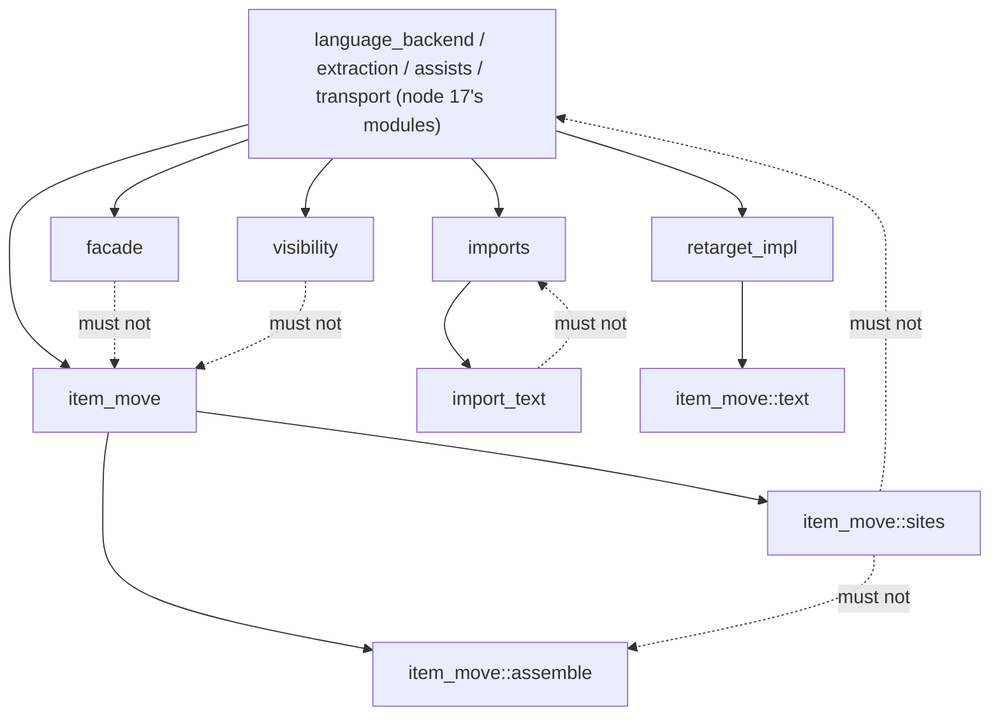

# Changeset: no backend function runs past 60 lines, cut by the crate's own `extract_method`

**Date**: 2026-10-09
**Status**: 🚧 In Progress
**Type**: Refactor (behaviour-preserving; engine-driven function extractions) + the function-length gate extended to `backends/`
**Stack**: `#reshape` 19/19, branch `feature/reshape/fn-sizes-backend`, wave 4. PR title:
`refactor(code-restructuring): cut the sixteen backend functions past 60 lines (#reshape 19/19)`.
Base in the linear stack: `feature/reshape/backend-session` (K=18). **Real edges**: in `extract-method-clean -> fn-sizes-backend`
(K=4: comment carry, lint-clean signatures, respelling, guard lift, tail position) and `rust-backend-split -> fn-sizes-backend`
(K=17: the seven `rust.rs` functions are cut where node 17 puts them); out: none.

## Initial Discovery

Full codebase exploration that grounded this plan: [initial-discovery.md](./2026-10-09-reshape-fn-sizes-backend-initial-discovery.md)
(Exploration 1 is the whole-work discovery, whose Exploration 3 measured the function sizes; Exploration 2 is this node's:
the sixteen functions, their seams, parameter counts, the claimed nesting record, and the `Result`-alias gap).

State A below is distilled from that file. Do not duplicate grep traces or file dumps here.

## Prerequisites

`grep -rl 'Claimed by:'` over `packages/tddy-code-restructuring/docs/code-issues/` finds one record with the field
(`broken-restructure-anchors-empty-outline.md`, "none", node 12's) and none on the files this node edits: **no claimed
issue in flight is in the path, no wait-or-proceed fork.**

| Item | Verdict | What this change does about it |
|---|---|---|
| [../../../packages/tddy-code-restructuring/docs/code-issues/complexity-rust-facade-lines.md](../../../packages/tddy-code-restructuring/docs/code-issues/complexity-rust-facade-lines.md) | ✅ **RESOLVED HERE** | `facade_lines` (58 lines, nesting 5 by the record's indentation measure) loses its `named` arm body and tier closure to two functions; re-measured and **deleted at wrap** with the final measurement in its history (F6). The wrap first sets `**Claimed by:**` to this PR |
| The sixteen functions > 60 lines under `backends/` (whole-work discovery, Exploration 3; no todo or code-issue record exists for them) | ✅ **RESOLVED HERE** | Cut to ≤ 60 by `extract_method`; pinned by the gate (acceptance test 1) |
| The 71 functions at 41–60 lines (whole-work discovery, Exploration 3; no record) | ✅ **RESOLVED HERE** (as a deferral) | New backlog entry `2026-10-09-functions-of-41-to-60-lines-in-tddy-code-restructuring.md` lists them and why they wait; `facade_lines` leaves the band here |
| [../../../packages/tddy-code-restructuring/docs/code-issues/oversized-file-backends-rust.md](../../../packages/tddy-code-restructuring/docs/code-issues/oversized-file-backends-rust.md), [2026-10-03-restructure-rust-backend-grows-with-every-live-plan-node.md](../todo/2026-10-03-restructure-rust-backend-grows-with-every-live-plan-node.md), [2026-09-16-backends-rust-rs-is-4500-production-lines.md](../todo/2026-09-16-backends-rust-rs-is-4500-production-lines.md) | ⚠ **DURING** (claimed by `rust-backend-split`) | The files node 17 creates grow by the new signatures (≈ +4 to +8 lines per seam). Each stays within the 500-line file cap; re-measured before cutting into one that node 17 leaves near it |
| [2026-10-09-restructure-has-no-operation-to-introduce-a-parameter-struct.md](../todo/2026-10-09-restructure-has-no-operation-to-introduce-a-parameter-struct.md) | — Unrelated (evidence added) | `edits_for_file` is a second instance (F2). The wrap adds it to that entry's evidence. It also corrects the entry's guess: `resolve_opening` and `assisted_edit` cut within 7 parameters |
| [2026-09-24-restructure-extract-drops-comments-and-writes-clippy-failing-signatures.md](../todo/2026-09-24-restructure-extract-drops-comments-and-writes-clippy-failing-signatures.md) | — Unrelated (consumed) | Resolved by `extract-method-clean`. A defect of that kind found here gets a new todo, and the entry is not reopened |
| [2026-09-19-the-file-length-gate-stops-at-the-first-cfg-test-use.md](../todo/2026-09-19-the-file-length-gate-stops-at-the-first-cfg-test-use.md) | — Unrelated | The file-length gate (node 15's). The function gate reads `#[cfg(test)]` per item |
| [2026-10-09-restructure-check-budget-does-not-report-function-lengths.md](../todo/2026-10-09-restructure-check-budget-does-not-report-function-lengths.md) | — Unrelated | Stays open; the gate is a test, not a `check` line |

## Affected Packages

- **`tddy-code-restructuring`**: the files holding the sixteen functions after `rust-backend-split` — node 17 moves the
  seven `rust.rs` ones to `src/backends/rust/language_backend.rs` (`resolve_opening`, `check`), `extraction.rs`
  (`assisted_edit`), `assists.rs` (`assist_for`, `offered_assist`) and `transport.rs` (`start`, `request`) — and
  `src/backends/rust/item_move/sites.rs`, `src/backends/rust/item_move/assemble.rs` (`visibilities` in
  `item_move/visibility.rs` after node 15), `src/backends/rust/item_move.rs`, `src/backends/rust/retarget_impl.rs`,
  `src/backends/rust/visibility.rs`, `src/backends/rust/import_text.rs`, `src/backends/rust/imports.rs`), and
  `src/backends/rust/facade.rs`: new private functions in the same files and `impl` blocks only, plus the F2 struct in
  `item_move/sites.rs`. `tests/function_length_budget.rs` (the exclusion removed; tests 1 and 5 replaced; one boundary test added).
  Docs at wrap: the code-issue record deleted;
  [README.md](../../../packages/tddy-code-restructuring/README.md) / package docs (the gate covers the whole crate, one
  sentence).
- **`tddy-tools`, `tddy-index-daemon`**: no source change (used to run the plans).

## Related Feature Documentation

- [PRD-2026-10-09-reshape-fn-sizes-backend.md](../../ft/coder/1-WIP/PRD-2026-10-09-reshape-fn-sizes-backend.md) (this PRD)
- [Rust code restructuring](../../ft/coder/rust-code-restructuring.md) — `## Known limitations` (`extract_method`)

## Summary

Sixteen production functions under `src/backends/` (`resolve_opening` 163, `assisted_edit` 124, `assist_for` 93,
`edits_for_file` 91, `start` 87, `assemble` 82, `move_items` 73, `visibilities` 71, `offered_assist` 71, `retarget_impl`
70, `restore_visibility` 66, `rewrite_statement` 66, `check` 66, `choose_import` 65, `request` 64, `next_import` 62) are
cut to ≤ 60 lines by `extract_method` plans run with `tddy-tools restructure`. `facade_lines` is cut to close its nesting
record. The function-length gate covers the whole crate. The 41–60 band gets a backlog entry.

## Background

`/analyze-clean-code` says > 60 lines must be refactored. The developer added function sizes to `#reshape` (2026-10-09)
and ordered the engine work first, so that this costs engine operations, not hand edits. Node 16 cut the nine outside
`backends/` and wrote the gate with a `backends/` exclusion; this node removes it. `backends/` waits for node 17 because
`rust.rs` (2,983 production lines) is split there first.

## Responsibility

- Re-measure on the post-node-18 base with the gate; re-read every seam (nodes 1, 3, 4, 6, 11, 13, 15, 17, 18 edit these
  functions first).
- One restructure plan per function (four for `resolve_opening`), each `check --deep` clean before `apply`.
- Seams of ≤ 7 parameters counting the receiver (≤ 5 preferred), never holding a mid-range `return` other than a run of
  error guards node 4 lifts, never an outer-loop `break`/`continue`, never a closure local, never returning a borrow from
  two borrowed inputs.
- `tests/function_length_budget.rs` covering `src/backends/`.
- The `facade_lines` record closed by measurement.
- The deferral entry for the 41–60 band.
- A todo entry per hand edit made after an engine operation; a stop-and-ask on every engine refusal.

## Boundaries

- **Engine-driven only.** Every cut is a `tddy-tools restructure apply` of an `extract_method` line. Hand edits are
  allowed only to make the tree build or pass clippy after an operation; each gets a todo entry naming the plan, the
  operation and the edit. A refusal stops the work and the developer is asked. The F2 struct is the one hand design
  edit, **only with consent**, marked `TODO(reshape-19)`.
- **No behaviour change**: messages, refusals, progress lines, output and public signatures are byte-identical. No
  existing test is edited except the gate file's two tests that pin the exclusion.
- **No module structure change**: no new file or `mod`, no moved item, no added `use` line. New functions are private,
  in the function's own file and `impl` block.
- **Not outside `backends/`** (node 16), **not file sizes** (nodes 15, 17), **not 41–60** (deferred), **not node 18's
  session conversion** (this node cuts what it leaves).
- **No engine change.** A missing engine capability becomes a todo.
- **New logic of nodes 1–18 is not moved here**: a function one of them grew against the binding no-growth rule is cut
  like the rest and reported (F8).

## Dependencies

| Parent node | What it delivers | How this PR consumes it | This PR does NOT |
|---|---|---|---|
| **`extract-method-clean`** (K=4, `feature/reshape/extract-method-clean`) | `extract_method` keeps the range's comments (P), writes `&Path`/`&str`/`&[T]`, `Ok(())` tails, shorthand fields (Q), respells an unimported signature type (K), probes past a leading `{`/comment (R), renames a `let`-initializer extraction (S); the guard lift (rule 12: a run of `return Err(..)` → `Result<()>` + `?`, also when the run holds `?`), tail position one level down (rule 13), and the caller's one-argument `Result` spelling for the return type of **every** extracted function (rule 14, `extracted_fn/return_type.rs`); the tidy removes `unused_mut` | Every extraction: comments in `restore_visibility`, `choose_import`, `resolve_opening`, `assisted_edit` survive; the guard lift for `retarget_impl`'s already-retargeted refusal; rule 14 for every seam that propagates with `?` (≈ 30 here, all files import `crate::Result`) and for `resolve_opening`'s tail chain and `choose_import`'s tier; `let`-initializer seams in `assisted_edit`, `offered_assist`, `restore_visibility`, `rewrite_statement` | edit the engine, hand-fix a clean-up defect silently (a todo each), work around arity with lint allowances (seams are chosen ≤ 7), or respell a return type by hand |
| **`rust-backend-split`** (K=17, `feature/reshape/rust-backend-split`) | `backends/rust.rs` ≤ 500 production lines: the `impl RustBackend` member runs and trait impls moved into modules under `backends/rust/` by node 13's impl-member move, bodies unchanged | The seven `rust.rs` functions are cut where node 17's discovery (E2.8) puts them, bodies unchanged: `resolve_opening` and `check` in `backends/rust/language_backend.rs` (381 lines), `assisted_edit` in `extraction.rs` (231), `assist_for` and `offered_assist` in `assists.rs` (347), `start` and `request` in `transport.rs` (293); `chain_module_to_file` (60) in `assist_edits.rs`. The seams below hold with new paths and lines. `check` moves with the trait impls (node 17's run K); node 13 folds the module dispatch into `same_crate_dispatch.rs`, so `resolve_opening`'s `move_item`/`reparent_module` branches (T4) are re-read on the base | move a function between files, or re-split a file node 17 left; if node 17 cuts any of the seven itself, that function leaves this list |

Node 18 (`backend-session`) is not a row: it is concurrent (wave 4) and nothing of its behaviour is consumed, but it is
this branch's base. It detaches six of these functions into `fn …(session: &mut RustBackend, …)` (its plans P1 `retarget_impl`,
P3 `next_import`, P4 `move_items`, P8 `assisted_edit`, P10 `offered_assist`, P12 `resolve_opening`) and keeps `start`,
`request` (in the session module `transport.rs`) and `check` (a `LanguageBackend` member) as methods (F5). Nodes 1, 3, 6, 11, 13 and 15 land first and edit some of
these functions or files, a textual overlap absorbed by re-measuring. Node 16's gate file is consumed as a file, not a
behaviour, so it is not an edge.

## Draft PR contract

Published with the wave-2 contract commit (the first push of this PR, not its deliverable); **owned surface, all in the
gate file node 16 creates**:

- `packages/tddy-code-restructuring/tests/function_length_budget.rs`: the walk covers all of `src/` (node 16's
  `src/backends/` skip removed); test 1 becomes `no_production_function_runs_past_sixty_lines`; test 5
  (`the_backend_is_left_to_its_own_node`) becomes `a_long_function_under_the_backend_is_reported`; a new boundary test.
- No production signature is owned: the extracted functions are private and named in the plans below.
- Failing tests: acceptance tests 1 and 2 (red: the sixteen functions; the fixture under `backends/` is skipped). Test 3
  is a green pin.

## Green wave

**Wave:** 4 of 4.
**Greenable independently:** yes, once `feature/reshape/extract-method-clean` and `feature/reshape/rust-backend-split` are
on its base. The free functions, `facade_lines`, `start`, `request` and `check` do not wait for node 18. The six it
detaches wait for its conversion to be on the base (F5).
**Concurrent with:** `feature/reshape/backend-session` (K=18), which detaches `resolve_opening`, `assisted_edit`,
`offered_assist`, `move_items`, `retarget_impl` and `next_import` on the same lines.
**Blocks:** none.
Real dependency edges (whole stack): `1→13`, `5→14`, `1→15`, `2→15`, `3→15`, `4→16`, `13→17`, `2→17`, `3→17`, `17→18`,
`6→18`, `4→19`, `17→19`.

## Successor PRs

None. This is the last node of `#reshape`. The crate split of `tddy-code-restructuring` is a later stack, planned after this
one lands.

## Scope

- **In:** the sixteen functions; `facade_lines`; any function that crosses 60 before this node (F8); the gate's coverage of
  `backends/`; the deferral entry; one todo per hand fix; decisions F2–F10 as decided 2026-10-09 (F1 resolved by node 4).
- **Deferred:** the 41–60 band (new todo, 71 functions); a nesting-depth gate (new todo); an operation that introduces a
  parameter struct (node 16's todo, evidence added); deduplicating the five-line server-open sequence shared by
  `move_items` and `retarget_impl` (not a size cut).

## Technical changes

### State A (master `4a5c42b1b`; paths and lines move with nodes 1–18)

| Function | Lines | Why it is long |
|---|---|---|
| `rust.rs:1245 resolve_opening` | 163 | 13 dispatch branches ending in value `return`s, text refusals, server start, the in-place assist |
| `rust.rs:1520 assisted_edit` | 124 | Selection widening, inference wait, relocation surveys, extract, rename, placeholder checks, import passes, facade |
| `rust.rs:289 assist_for` | 93 | Eight 12-line `Assist { … }` literals |
| `rust/item_move/sites.rs:94 edits_for_file` | 91 | Two loops over state derived from four parameters, through two closures |
| `rust.rs:735 start` | 87 | Bridged branch, toolchain pinning, command, spawn, handshake |
| `rust/item_move/assemble.rs:71 assemble` | 82 | Facade names, caller repoint, moved text, destination, doc links, reach, file assembly |
| `rust/item_move.rs:55 move_items` | 73 | Preflight, server open, survey, `Moving`, `Resolution` |
| `rust/item_move/assemble.rs:206 visibilities` | 71 | Moved items' scopes, reached items' widening |
| `rust.rs:1022 offered_assist` | 71 | Polling loop with inference probe |
| `rust/retarget_impl.rs:79 retarget_impl` | 70 | Server open, guard, field check, moved text, `Resolution` |
| `rust/visibility.rs:37 restore_visibility` | 66 | One loop, 29 comment lines |
| `rust/item_move/sites.rs:324 rewrite_statement` | 66 | Single path vs group, through a refusal closure |
| `rust.rs:1124 check` | 66 | Five dispatch `return`s, then range findings |
| `rust/import_text.rs:18 choose_import` | 65 | Three tiers, 31 comment lines |
| `rust.rs:823 request` | 64 | Bridged request with narration and fold; stdio loop |
| `rust/imports.rs:103 next_import` | 62 | Per-name loop with three function `return`s |
| `rust/facade.rs:151 facade_lines` (claimed record) | 58 | Nesting 5 by indentation: `match` → `named` arm → `.map(` closure → `if` |

### State B

Each function ≤ 60 by these seams (master lines; parameters counting the receiver; re-read in wave 2):

| Function | Seams (parameters) | ≈ after | New functions ≈ |
|---|---|---|---|
| `resolve_opening` (F3) | text refusals `:1264-1278` → `refuse_before_a_server` (2); tail chain bottom-up, one plan each: T1 `:1375-1406` → `assisted_resolution`; T2 `:1348-1373`+T1 call → `text_resolution`; T3 `:1319-1346`+T2 call → `crate_move_resolution`; T4 `:1280-1317`+T3 call → `authored_resolution` (6 each) | 26 | 18, 38, 32, 35, 46 |
| `assisted_edit` | widening `:1531-1537` (3); surveys `:1550-1571` (6); extract-and-name `:1573-1594` (7); import passes `:1612-1618` (7); facade tail `:1620-1642` (7, no receiver) | 52 | 10, 26, 26, 12, 28 |
| `assist_for` (F4) | eight `Assist { … }` literals → zero-argument functions | 17 | 14 each |
| `edits_for_file` (F2) | hand: `FileSites` struct replaces the two closures (`TODO(reshape-19)`); engine: statement loop `:122-152` (6), site tail `:154-183` (5) | 30 | 36, 34 |
| `start` | toolchain `:758-771` (1); command `:773-790` (4); handshake tail `:806-820` (2) | 46 | 17, 21, 18 |
| `assemble` | facade names `:82-89` (2); moved names `:100-105` (1); doc links `:118-127` (4); files tail `:135-151` (4) | 47 | 11, 9, 13, 21 |
| `move_items` | `Resolution` tail `:112-126` (2); moved list `:85-89` (1) | 55 | 19, 8 |
| `visibilities` | users' widening `:229-238` (5); reached loop `:257-274` (4) | 45 | 17, 24 |
| `offered_assist` | target `:1030-1037` (2); code actions `:1053-1060` (4); inference probe `:1071-1075` (4) | 53 | 11, 13, 9 |
| `retarget_impl` | guard lift `:96-101` (2); moved text `:121-131` (6); `Resolution` tail `:134-147` (6) | 42 | 9, 18, 21 |
| `restore_visibility` | `VisibilityChange` `:86-94` (1); declaration index `:69-72` (3) | 55 | 12, 8 |
| `rewrite_statement` | regrouped tail `:377-388` (7); alias split `:343-347` (1); replacement `:354-358` (5) | 47 | 22, 9, 11 |
| `check` | `extract_module` name claim `:1168-1186` (5) | 48 (37 with node 4's call) | 24 |
| `choose_import` (F9) | third tier tail `:59-81` (2) | 43 | 28 |
| `request` | narrated bridged request `:830-840` (5) | 55 | 16 |
| `next_import` | aliased declaration `:132-134` (4); bound declaration `:153-155` (4) | 58 | 7, 7 |
| `facade_lines` (F6) | `named` arm `:171-205` (2); in it, the tier line `:193-203` (3) | 24 | 22, 15 |

The 6- and 7-parameter seams (F7): T1–T4, the surveys, extract-and-name, import passes and facade tail of
`assisted_edit`, `retarget_impl`'s moved text and tail, and `rewrite_statement`'s regrouped tail — eleven.

### Delta

New private functions in the same files and `impl` blocks (after node 17: `language_backend.rs`, `extraction.rs`,
`assists.rs`, `transport.rs`, `item_move/{sites,assemble,visibility}.rs`, `item_move.rs`, `retarget_impl.rs`,
`visibility.rs`, `import_text.rs`, `imports.rs`, `facade.rs`); one private struct with two methods in
`item_move/sites.rs` (F2); the gate file edited. No other file.

## Implementation milestones

1. [ ] Gate extended and red, naming the backend functions (acceptance tests 1–3).
2. [ ] Rebase onto `feature/reshape/backend-session` (or, before it is green, onto `feature/reshape/rust-backend-split`
   for milestones 3–7 only); re-measure with the gate; re-read every seam; record the changes here. Build `tddy-tools`
   and `tddy-index-daemon` once, outside `target/` (`TDDY_INDEX_DAEMON_BIN`), and use that build for every plan.
3. [ ] `facade_lines` (two plans, bottom-up); re-measure nesting with the record's measure.
4. [ ] `restore_visibility`, `rewrite_statement`, `visibilities`, `assemble`.
5. [ ] `choose_import` (F9), `assist_for` (F4).
6. [ ] `edits_for_file` per F2 (the `FileSites` hand edit, its todo, then two engine plans).
7. [ ] `request`, `start` (`transport.rs`), `check` (`language_backend.rs`; where the helper lands in a trait impl is
   checked with `check --deep` first). Methods in node 18's end state.
8. [ ] After node 18's conversion is on the base: `next_import`, `retarget_impl`, `move_items`, `offered_assist`.
9. [ ] `assisted_edit` (five plans, bottom-up), `resolve_opening` (refusal seam, then T1 → T4, each anchored on the tree the
   previous apply left).
10. [ ] Gate green; deferral entry, hand-fix todos and the record closure written; validation.

Each plan: `restructure check --deep` → `apply` (compile gate, tidy) → `cargo clippy -p tddy-code-restructuring
--all-targets -- -D warnings` → `./test -p tddy-code-restructuring` → commit naming the plan.

## Testing plan

- **Behaviour:** no new behaviour test; the existing suites are the oracle and run unchanged after every apply:
  `move_item_*` (8 binaries), `retarget_impl_acceptance.rs`, `retarget_impl_plan_lines.rs`, `extract_method_*`,
  `extraction_defects_acceptance.rs`, `import_pass_acceptance.rs`, `move_facades_acceptance.rs`,
  `facade_cycle_acceptance.rs`, `relative_visibility_acceptance.rs`, `escaping_types_acceptance.rs`,
  `wait_heartbeat_acceptance.rs`, `wedged_request_acceptance.rs`, `index_health_acceptance.rs`,
  `check_precondition_parity.rs`, `cancellation_acceptance.rs`, and the unit tests in `item_move/sites.rs`,
  `retarget_impl.rs`, `imports.rs` and the backend module tests.
- **Per apply:** `apply`'s compile gate and tidy, then clippy with `-D warnings` and `./test -p tddy-code-restructuring`.
  Scoped only; CI answers for the workspace.
- **Size:** `tests/function_length_budget.rs`, fluent style, no conditionals in test bodies; pure text, no server, so not
  in the rust-analyzer group or the e2e filterset.
- **Nesting (F6):** measured once at wrap with the record's measure (`/analyze-clean-code` indentation levels), recorded in
  the record's history row before deletion. No test.

## Acceptance tests

All in `packages/tddy-code-restructuring/tests/function_length_budget.rs` (node 16's file; its tests 2–4 are unchanged).

1. `no_production_function_runs_past_sixty_lines` — replaces node 16's
   `no_production_function_outside_the_backend_runs_past_sixty_lines`. Walks all of `src/`, `src/backends/` included,
   and asserts the list of functions over 60 is empty, printing each as `src/<file>:<line> <fn> (<N> lines)`. **Red on
   the base:** lists the sixteen backend functions (or the re-measured list).
2. `a_long_function_under_the_backend_is_reported` — replaces node 16's `the_backend_is_left_to_its_own_node`. A fixture
   tree with a 61-line function in `src/backends/rust/sample.rs` is reported as
   `src/backends/rust/sample.rs:1 sample (61 lines)`. **Red on the base:** the `backends/` skip reports nothing.
3. `a_function_of_exactly_sixty_lines_is_within_the_budget` (new) — a fixture
   with a 60-line and a 61-line function; only the second is reported. Five backend functions sit at exactly 60. Green pin.

Behaviour: every suite listed in the testing plan, unchanged.

## Final Checklist

Module structure does not change: new private functions stay in their files, so the module graph after this node is the
graph node 17 leaves. The modules this node edits and their existing edges are below; the dashed edges must **not** exist:

- [ ] No new `.rs` file and no new `mod` declaration under `src/` — checked by `git diff --diff-filter=A --name-only
  <base>...HEAD -- packages/tddy-code-restructuring/src` being empty and no added `^\s*(pub.*)?mod ` line.
- [ ] No added `use` line in the touched files, so none of the dashed edges appears — checked by the diff having no added
  `^\s*(pub.*\s)?use ` line under `src/backends/` (signature types are respelled by node 4's K, never imported).
- [ ] Every added `fn` is private and sits in the file and `impl` block of the function it came from — checked by the
  diff adding no `pub` item and no `impl` line.
- [ ] Every cut was made by an engine `apply`; every hand edit after one has a todo entry under `docs/dev/todo/`; the F2
  struct carries `TODO(reshape-19)`.
- [ ] Every engine refusal was reported to the developer before going on.
- [ ] `facade_lines` and its two new functions measure nesting ≤ 4 by the record's measure; the record is deleted with that
  number in its history.
- [ ] Every touched file is ≤ 500 production lines (node 15's `engine_file_budget_shape.rs` green).

## Technical Debt & Production Readiness

- Hand fixes after engine operations are debt by definition: each gets a todo naming the plan, the op and the shape, so an
  engine node can remove the class.
- The F2 struct is a hand design edit with consent, marked and recorded.
- The tail chain in `resolve_opening` reads as a pipeline of four stages; a later `match` dispatch is a design choice, not
  debt (F3).
- Eleven functions take 6–7 parameters; `/analyze-clean-code` reports them above 5 (F7).

## Decisions & Trade-offs

All decided by the developer on 2026-10-09 (PRD approved with every recommendation).

- **F1 — `?` ranges under `crate::Result<T>` — resolved by `#reshape` 4.** Rule 14 respells every extracted function's
  return type to the caller's one-argument `Result` (`extracted_fn/return_type.rs`, tests 33–35); no hand fix planned. A
  mis-spelled return type after an apply is a node 4 defect: stop, report, todo.
- **F2 — `edits_for_file` (decided: consented hand edit).** `FileSites` struct (`context`, `path`, `text`, `masked`,
  `base`, `qualifier`; `in_region`, `in_destination` methods), `TODO(reshape-19)`, todo
  `2026-10-09-edits-for-file-site-state-was-grouped-by-hand.md`; then two engine cuts.
- **F3 — `resolve_opening` (decided):** engine-only tail chain; no hand `match` dispatch.
- **F4 — `assist_for` (decided):** eight zero-argument functions.
- **F5 — ordering with node 18 (decided).** First: free functions, `facade_lines`, and `start`, `request`, `check` (node
  18 keeps them as methods). After node 18's conversion is on the base: `resolve_opening`, `assisted_edit`,
  `offered_assist`, `move_items`, `retarget_impl`, `next_import`, re-anchored as free functions over `session`.
- **F6 — closing the nesting record (decided):** cut, re-measure with the record's own measure, delete at wrap; no nesting
  gate here (todo `2026-10-09-no-gate-measures-function-nesting-depth.md`).
- **F7 — parameter cap (decided):** 7 counting the receiver or `session` (hard), 5 preferred; the eleven 6–7 seams accepted.
- **F8 — functions crossing 60 before this node (decided):** in scope; report the node that grew one.
- **F9 — tails rust-analyzer may misprint (decided):** `check --deep` first; a signature that is not the caller's stops the
  work for the developer; prefer the non-tail seams.
- **F10 — exemptions (decided):** none; if forced, node 16's closed shrink-only list with a todo each.
- **One plan per function; `resolve_opening` and `assisted_edit` one plan per seam.** The engine composes extractions
  bottom-up only and does not re-anchor; the tail chain's ranges include the call the previous stage wrote.

## Refactoring Needed

### From @ft-dev (Acceptance Test Creation)
(empty)

### From @red (TDD Red Phase)
(empty)

### From @validate-changes (Change Validation)
(empty)

### From @validate-tests (Test Quality)
(empty)

### From @prod-ready (Production Readiness)
(empty)

### From @analyze-clean-code (Code Quality)
(empty)

### From @refactor (Completed Refactorings)
(empty)

## Validation Results

Not run yet (planning).

## TODO

- [x] Record initial discovery (`2026-10-09-reshape-fn-sizes-backend-initial-discovery.md`)
- [x] Cross-check `packages/*/docs/code-issues/` and `docs/dev/todo/` for items this change touches (Step 2b)
- [x] Create/update PRD documentation (`docs/ft/coder/1-WIP/PRD-2026-10-09-reshape-fn-sizes-backend.md`)
- [x] Create changeset (this document)
- [ ] Add the PRD reference to `docs/ft/coder/1-OVERVIEW.md` **at wrap** (a shared append-point: not edited while planning)
- [ ] Create failing acceptance tests
- [ ] Run acceptance tests (verify they fail)
- [ ] USER REVIEW — acceptance tests
- [ ] TDD Red — write failing unit/integration tests
- [ ] TDD Green — implement with quality code (engine plans, per milestone)
- [ ] Update documentation with progress
- [ ] Repeat Red→Green→Update cycle until feature complete
- [ ] Run the scoped tests (`./test -p tddy-code-restructuring`) — verify 100% pass; CI answers for the rest of the workspace
- [ ] Validate changes (/validate-changes)
- [ ] Refactor issues from change validation
- [ ] USER REVIEW — development complete
- [ ] Validate tests (/validate-tests)
- [ ] Refactor test issues
- [ ] Validate production readiness (/validate-prod-ready)
- [ ] Refactor production readiness issues
- [ ] Analyze code quality (/analyze-clean-code)
- [ ] Refactor code quality issues
- [ ] Final validation (/validate-changes)
- [ ] Linting and formatting (`cargo clippy -p tddy-code-restructuring --all-targets -- -D warnings`, `cargo fmt`)
- [ ] Wrap documentation (/wrap-context-docs) — when the PR is set ready for review; deletes the initial discovery and the
  `facade_lines` record
- [ ] USER REVIEW — work complete, decide next steps
