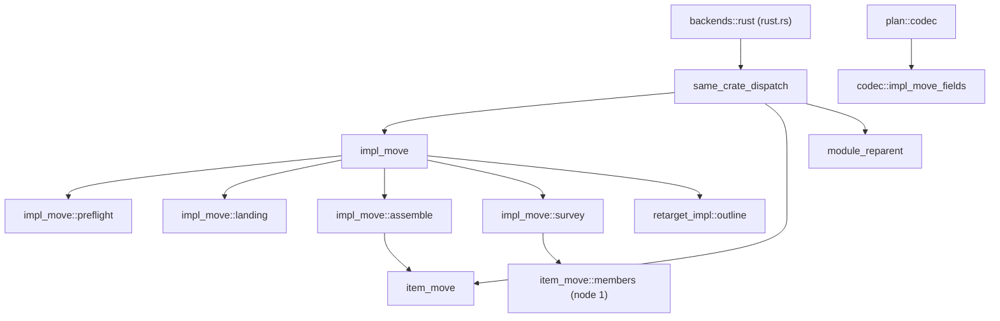

# Changeset: `move_impl_members` moves a run of inherent `impl` members into another module of the same crate

**Date**: 2026-10-09
**Status**: 🚧 In Progress
**Type**: Feature (new restructure operation, engine-authored text edits informed by the server)
**Stack**: `#reshape` 13/19, branch `feature/reshape/move-impl-members`, green wave 2. PR title:
`feat(code-restructuring): move_impl_members moves impl members into another module (#reshape 13/19)`.
Base in the linear stack: `feature/reshape/anchors-outline` (K=12). **Real edges**: `widen-same-crate` (K=1 → 13, the
member widening). Everything else below this node is sequential only for `gh stack`. Textual overlap, with no behaviour
consumed: `item_move/*` (nodes 1, 11), `retarget_impl/*` (node 11), `rust.rs` wiring (every node 1–12), `plan/codec.rs`.

## Initial Discovery

Full exploration: [initial-discovery.md](./2026-10-09-reshape-move-impl-members-initial-discovery.md). Exploration 1 is
the whole-work discovery and Exploration 2 is this node's. State A below is distilled from it.

## Prerequisites

`grep -rl 'Claimed by:' packages/tddy-code-restructuring/docs/code-issues` finds no claim on the files this node edits:
**no 🚧 claimed issue in the path.**

| Item | Verdict | What this change does about it |
|---|---|---|
| [2026-10-03-restructure-leftovers-of-the-live-plan-carve-and-tooling-pass.md](../todo/2026-10-03-restructure-leftovers-of-the-live-plan-carve-and-tooling-pass.md) § 1 (the impl-member seams) | ⚠ **partial** (§ 1 is shared by nodes 13 and 17; node 3 owns the file's items 2 and 7) | Delivers the missing operation and answers § 1's three blockers: the `pub(crate)` that stays (now the narrowest visibility), the probe (`check --deep` resolves the op), the empty-`impl` shell (removed, tested). At wrap § 1 is **narrowed** to "the runs are not yet moved", which `feature/reshape/rust-backend-split` closes |
| [`oversized-file-backends-rust.md`](../../../packages/tddy-code-restructuring/docs/code-issues/oversized-file-backends-rust.md) | ⚠ **DURING** (claimed by node 17) | +1 `SUPPORTED` line; `check` and `resolve_opening` net −3 each (folded dispatch, F5). History row at wrap. All logic in `backends/rust/impl_move/` |
| [2026-10-03-restructure-rust-backend-grows-with-every-live-plan-node.md](../todo/2026-10-03-restructure-rust-backend-grows-with-every-live-plan-node.md) | ⚠ **DURING** (claimed by node 17) | Same: no net growth of `rust.rs` |
| [2026-10-04-restructure-move-item-does-not-widen-fields-or-impl-members.md](../todo/2026-10-04-restructure-move-item-does-not-widen-fields-or-impl-members.md) | — Unrelated here (claimed by node 1) | Consumed: node 1's member widening is called, not re-implemented |
| [2026-10-06-restructure-item-move-assemble-past-500.md](../todo/2026-10-06-restructure-item-move-assemble-past-500.md), code issue `complexity-rust-facade-lines.md` | ⚠ **DURING** (nodes 15, 19) | `item_move/assemble.rs` and `assemble::visibilities` do not grow: their reached-item half is **extracted by the engine** (`extract_method`), which shrinks both |
| `2026-10-09-restructure-moves-do-not-widen-tuple-struct-fields.md` (written by node 7) | — Unrelated | A tuple field read through `self.0` by a moved member outside the struct's module stays a compile-gate failure, as recorded there |
| Others in `docs/code-issues/` and `docs/dev/todo/` | — | Not in the path |

## Affected Packages

- **`tddy-code-restructuring`** ([README.md](../../../packages/tddy-code-restructuring/README.md)):
  - `src/plan/refactor_kind.rs`: the variant;
  - `src/plan/codec.rs`: one `mod` and one call;
  - new `src/plan/codec/impl_move_fields.rs`;
  - `src/backends/rust.rs`: `SUPPORTED`, and the folded same-crate dispatch arm in `check` and `resolve_opening`;
  - new `src/backends/rust/same_crate_dispatch.rs`;
  - new `src/backends/rust/impl_move.rs` and `impl_move/{preflight,landing,assemble,survey}.rs`;
  - visibility only: `src/backends/rust/retarget_impl.rs` (`mod outline`) and `retarget_impl/outline.rs` (the operation
    name in the S1/S2 wording);
  - one engine `extract_method` in `src/backends/rust/item_move/assemble.rs` (the reached-item widening);
  - `.config/rust-e2e.filterset` and `.config/nextest.toml` for the new live binary.
  - Docs at wrap: new `docs/impl-move.md`; [same-crate-moves.md](../../../packages/tddy-code-restructuring/docs/same-crate-moves.md);
    [rust-code-restructuring.md](../../ft/coder/rust-code-restructuring.md);
    [plan-schema.md](../../../.agents/skills/code-restructuring/references/plan-schema.md); `SKILL.md` (operation count and
    a "split an `impl`" recipe).
- **`tddy-tools`, `tddy-index-daemon`, `tddy-lsp`**: no source change.

## Related Feature Documentation

- [PRD-2026-10-09-reshape-move-impl-members.md](../../ft/coder/1-WIP/PRD-2026-10-09-reshape-move-impl-members.md)
- [Rust code restructuring](../../ft/coder/rust-code-restructuring.md): `### Same-crate moves`, `## Known limitations`

## Summary

`move_impl_members` is anchored on a contiguous run of members of one inherent `impl T`. It cuts them out, byte for byte,
and lands them in an `impl T` block of another module of the same crate. That module is `to`, or `name` in `to` when the
line creates it. The members join an identical block if there is exactly one, and get a new block otherwise. The
destination receives the imports the moved text needs. Callers are left as they are, because a method resolves through
its type. Everything the split puts out of reach is widened by as little as it needs, and each widening is reported:
moved private members, plus private stayed members, fields and origin items when the destination is outside the
origin's subtree.

## Background

`rust.rs` keeps 3,008 production lines, and about 1,620 of them are inherent members of `impl RustBackend` (discovery
E2.2). `move_item` refuses a range inside an `impl` (`item_move/outline.rs:108-118`). `extract_module` can lift inherent
members, but only into a **new child module of the file** (`impl_seam.rs:13-21`). It widens every private one to
`pub(crate)` for good (`facade.rs:14-55`), and it depends on the assist's rename. The "an `impl` body cannot hold a
`mod`" refusal (`placeholder_checks.rs:88-110`) comes from that rename missing a call. #567 needed members to join the
existing `signature_rewrites` module, and no operation could do it. Rust needs no rename at all: an inherent `impl` may
sit in any module of the type's crate, and calls resolve through the type.

## Responsibility

- `RefactorKind::MoveImplMembers` (`move_impl_members`), with its codec rules, plain-`check` findings, `SUPPORTED`, and
  the dispatch.
- Read the run with `retarget_impl`'s member-run reader. Refuse a trait impl, members in two blocks, a cut member, and
  non-member code in the run.
- Assemble every changed file as a function of texts: the cut, emptied-block removal, landing, imports, rebase of
  relative paths, and creation of the destination with `name`.
- Survey and widen through node 1's member piece and the extracted reached-item widening, bounded by the ancestor rule
  (E2.3). Report every widening in `Resolution.report`.
- Refuse a reached name the destination binds to something else.
- Register the new live binary in `.config/rust-e2e.filterset` **and** the `rust-analyzer` group.

## Plan-line schema and the rules (the contract)

```jsonl
{"op":"move_impl_members","anchor":{"kind":"items","file":"src/host.rs","items":["app::host::Host::put","app::host::Host::last"],"fingerprints":["sha256:…","sha256:…"]},"to":"app::roster"}
{"op":"move_impl_members","anchor":{"kind":"items","file":"packages/tddy-code-restructuring/src/backends/rust.rs","items":["tddy_code_restructuring::backends::rust::RustBackend::start","tddy_code_restructuring::backends::rust::RustBackend::request"],"fingerprints":["sha256:…","sha256:…"]},"name":"transport","to":"tddy_code_restructuring::backends::rust"}
```

| Field | Meaning |
|---|---|
| `anchor` | An `items` anchor on members `c::m::Type::member` of **one inherent** `impl`, contiguous (only blank lines and comments between them), or one `item` anchor on a single member. These are emitted by `restructure anchors <file> --items 'Type::a,Type::b'` |
| `to` | Required. The destination module, rooted at the package name (`-` read as `_`). With `name`, its **parent** |
| `name` | Optional. Creates module `name` in `to` before the members land (`move_item`'s `creation.rs` rule) |
| `id`, `group` | As for every operation |

Every other field is refused as one the operation cannot honour, before a server starts: `reexport` (no path names a
member, so there is nothing to re-export), `canonical_paths` (F6), `to_type`, `also`, `to_file`, `variant`, `expr`,
`callee`, `type`, `order`, `with_private_deps`.

**R1. The run.** The run is read with `retarget_impl::outline::read` (`retarget_impl/outline.rs:55`). A member is a
method, an associated function or an associated constant. Its span begins at its attached trivia
(`attached_trivia_starts_at`, `rust.rs:2426`). The run is every member whose span begins inside the lowered anchor
range.

**R2. The cut.** The origin loses the lines from the run's first member's trivia to its last member's last line, plus one
adjoining blank line, so no double blank line remains. Comments standing between members travel. A free-standing
comment above the first member stays, which is `retarget_impl`'s rule. When the run is every member of the block
(`Run::whole_block`), the whole block goes, from the block's own attached trivia to its closing `}` (F2).

**R3. Landing.** The header is the text from `impl` to the `{` that opens the body, plus the block's attached
attributes. The **join rule** applies when the destination module (its scope, inline modules included) holds exactly
one inherent `impl` whose header and attributes are token-equal to the origin's. The members are then inserted before
that block's closing `}`, with a blank line between them and the last existing member. Otherwise a new block is
written: attributes, header, `{`, the members re-indented to one level, and `}`. It is inserted by
`placement::insertion` (`item_move/placement.rs:15`), so it lands above a trailing `#[cfg(test)]` module or before an
inline module's closing brace. The members' bytes are unchanged except for the edits in R5 and R6 (F3).

**R4. Imports.** These are `imports::needed` (`item_move/imports.rs:33`), as for `move_item`:
- the origin module's `use` header, heads written from the crate root;
- one `use <origin>::<name>;` for each root item of the origin the moved lines name, as the server confirms it
  (master's `reached_by_the_moved_code`, `item_move.rs:192`, is replaced by `widen-same-crate`'s
  `RustBackend::reached_by_the_move`, which takes `item_move`'s own `Run` and so cannot be called here). The candidates
  come from `item_move::outline::root_items(symbols, text, None)`, which `widen-same-crate` widens. They are filtered by
  `text::identifiers_in` over the moved lines and confirmed by a `references` loop in `impl_move/survey.rs`. The block's
  self type counts among those items when it is defined
  in the origin, because the header names it;
- the names the destination already binds are left out.

The unused surplus is pruned by the tidy of a complete run, in the origin and the destination alike.

**R5. Relative spellings.** `rebase::edits` (`item_move/rebase.rs:36`, `travelling: None`) respells `super::`/`self::`
paths and `pub(super)`/`pub(in …)` visibilities in the moved text, so they keep their meaning.

**R6. Widening.** Each rule is the `Scope::widened_to` fold, and each produces one report line
`` `<Type>::<member>` <from> -> <to> `` (or `` `<item>` `` for a root item):
- (a) A **moved** member that is private, or whose relative visibility no longer covers its users, is widened where it
  lands, to cover every module that references it from outside the moved lines. That includes other files and
  `cfg(test)` modules. The run's members become `members::Member { owner: <self type>, name, position, visibility }`.
  Their `users` are read by this node's own `references` loop in `impl_move/survey.rs` (`sites_of` +
  `module_of_file`/`enclosing_modules`), because `widen-same-crate`'s survey loop is a private method keyed to
  `move_item`'s run. The result is `members::widen_members` with `lands_in` = destination. Members written `pub`,
  `pub(crate)` or with a relative visibility are skipped, as they are there; R5 respells the relative ones.
- (b) A **stayed** private member of `T` that the moved lines name is widened where it is written, to cover the
  destination. It is surveyed only in the impls of `T` written in the origin module or in its ancestors strictly below
  the common ancestor of origin and destination. In the origin file the candidates are
  `members::members_of(symbols, text, …, false)`, minus the run, filtered by `identifiers_in` over the moved lines.
  In an ancestor's file, read by this node (`widen-same-crate` is same-file only), they are `members_of` over that
  file's outline. `widen_members` is called with `lands_in` = the module that holds each member.
- (c) A private **field** of `T` that the moved lines name gets the same treatment, when the struct's module is one of
  those modules.
- (d) A private **root item** of the origin the moved lines name is widened for the destination, by the reached-item
  half of `assemble::visibilities`, extracted.
- A destination inside the origin's subtree makes (b), (c) and (d) empty, with no server request.

**R7. Callers.** None is edited. `self.m()`, `Self::m`, `T::m` and an alias's `A::m` resolve wherever the block is.

**Refused before a server starts** (`plan is malformed:` for codec rules, a finding for workspace ones; plain `check`
reports both):
- P1: `to` missing.
- P2: `to` in another crate. An inherent impl outside the type's crate is `E0116`.
- P3: a destination that does not exist (without `name`).
- P4: with `name`, a parent that does not exist or already declares `name`.
- P5: a destination equal to the origin module.
- P6: a `range` or `symbol` anchor.
- P7: an `item` anchor on `<Type>` or `<Type>#N`. The refusal says "a whole block moves with `move_item`".
- P8: a member path written `<T as Trait>::m`.
- P9: a refused field (above).

**Refused by `check --deep` and `apply` before anything is written** (`this seam cannot be cut here:`):
- S1: members in two `impl` blocks.
- S2: a member cut in half.
- S3: a member of a **trait** `impl`, where a bare path resolved to one. The refusal says "move the whole trait `impl`
  with `move_item`".
- S4: an item inside the run that is not a member (a macro invocation, or an item the outline does not list).
- S5: a name the moved lines reach in the origin that the destination binds to a **different** item: one it declares,
  or one it imports by a crate-rooted path that differs from the origin's.
- S6: an inline destination written on one line (`placement.rs`).

## Boundaries

- **No caller, facade or manifest is edited.** There is no `reexport`.
- **No change to the behaviour of `move_item`, `reparent_module`, `extract_module` or `retarget_impl`.** The shared readers
  change visibility and wording only. Their tests are unchanged and pass.
- **Not in scope:**
  - non-contiguous runs, and members of several blocks, in one line;
  - moving a trait impl (`move_item` does it);
  - ancestor root items other than the origin's own (compile gate, as in `move_item`);
  - `macro_rules!` used by a moved member;
  - turning methods into free functions (`#reshape` 18).
- **Moves of existing code in this PR are engine-driven only** (`tddy-tools restructure`). That is the `extract_method`
  in `item_move/assemble.rs`. Hand edits are made only to fix the build after an engine move, and each one gets a todo
  entry. A refusal stops the work and asks the developer.

## Dependencies

| Parent node | What it delivers | How this PR consumes it | This PR does NOT |
|---|---|---|---|
| `widen-same-crate` (K=1) | `item_move::members` (its draft-PR contract): `Member`, `ReachedMember { member, written_in, lands_in, users }`, `MemberWidening { edits, report }`, `members_of(symbols, text, starting_in, inside)`, the pure `widen_members(text, reached) -> Result<MemberWidening>` and the field-aware `member_visibility_edit`. Also `item_move::outline::{Item, root_items}` and `rebase::visibility_spans` widened to `pub(in crate::backends::rust)`, and `assemble`'s `landing_of` | R6 (a)–(c): this node builds the `ReachedMember`s (run members as M; origin and ancestor members as K, bounded by F4) with its **own** `references` loop, since node 1's survey loop and `reached_by_the_move` are private and take `item_move`'s `Run`. It calls `widen_members` on the origin text, applies M edits to the moved bytes before the copy, and keeps K edits in their files. R4/R6 (d) use `root_items`. The engine `extract_method` of `visibilities`' reached-item half runs on node 1's tree (after its `landing_of`) | Re-implement `widen_members`, `member_visibility_edit`, `Scope` folding or the report format; call or change `reached_by_the_move`; add a member survey to `move_item` |

No other node delivers behaviour this PR consumes.

## Draft PR contract

**Owned surface** (published by the first push of this PR; signatures are fixed here):
- `RefactorKind::MoveImplMembers`, serialised `move_impl_members`.
- `plan::codec::impl_move_fields::rules(op: &RefactorOp) -> Result<()>`.
- `backends::rust::impl_move::findings(op, workspace) -> Result<Vec<String>>`.
- `impl RustBackend { pub(super) fn move_impl_members(&mut self, op, workspace) -> Result<Resolution> }`.
- `impl_move::assemble::assemble(moving: &MovingMembers<'_>) -> Result<Assembled>`, with `MovingMembers` (source
  file and text, `retarget_impl::outline::Run`, destination `Module`, optional created parent and name, reached root
  items, member widenings from node 1) and `item_move::assemble::Assembled` reused.
- `impl_move::landing::block_for(destination_text, scope, header) -> Landing { Join { before: usize } | New }`.

**Failing tests the first push carries**: acceptance tests 1–22 below. They fail on master because the op does not
parse (`unknown variant move_impl_members`), and on the first push because the bodies are `todo!()`-free stubs that
return `UnsupportedOp`.

## Green wave

Wave **2** of 4. It can go green on its own once `widen-same-crate` is green. It runs concurrently with `tests-follow`,
`oversized-files` and `fn-sizes-rest`. It blocks `rust-backend-split`. Real edges: `widen-same-crate → move-impl-members
→ rust-backend-split`.

## Successor PRs

- `feature/reshape/rust-backend-split`: moves the `impl RustBackend` runs out of `rust.rs` with this op, one plan line
  per run (session, transport, resolve, extraction, assist_ops), into child modules of `backends::rust` created with
  `name`.

## Scope

- [ ] Kind, codec rules, plain-`check` findings (P1–P9), folded dispatch
- [ ] Member run with S1–S4, the shared reader's wording parameterised
- [ ] Assembly R2–R5 as a function of texts, emptied-block removal, join/new landing, `name`
- [ ] Widening R6 via node 1, ancestor bound, extracted reached-item widening; S5
- [ ] Live suite registered; `verify` pinned
- [ ] Docs at wrap

## Technical changes

### State A

- No operation moves a member: `move_item` refuses (`item_move/outline.rs:52-55`, `:108-118`). `extract_module` creates
  only a new child module, widens to `pub(crate)` (`facade.rs:27-55`) and depends on the assist rename
  (`placeholder_checks.rs:88-110`).
- The member-run reader exists privately in `retarget_impl/outline.rs:55-120`, behind `mod outline;`
  (`retarget_impl.rs:12`), with retarget wording.
- `move_item`'s imports (`imports.rs:33`), placement (`placement.rs:15`), creation (`creation.rs:36`), rebase
  (`rebase.rs:36`) and reach (`item_move.rs:192`) are reusable. The reached-item widening is inside
  `assemble::visibilities` (`assemble.rs:206-276`, 71 lines).
- `check` (`rust.rs:1124`, 66 lines) and `resolve_opening` (`:1245`, 163 lines) carry one arm per same-crate kind
  (`:1125-1133`, `:1291-1305`).

### State B

- `move_impl_members` is resolved by `impl_move.rs`:
  - preflight;
  - open the origin and settle its outline;
  - read the run;
  - survey (node 1, bounded);
  - read the destination (`landing`);
  - `assemble` (a function of texts).
- It returns `Resolution { edit, report, notes }`. The `notes` say whether the members joined an existing block or opened
  a new one, and name a removed empty block.
- `check` and `resolve_opening` route `MoveItem | ReparentModule | MoveImplMembers` through one arm each, into
  `same_crate_dispatch.rs`.

### Delta

| File | Change |
|---|---|
| `plan/refactor_kind.rs` | `MoveImplMembers` variant and doc |
| `plan/codec.rs`, new `plan/codec/impl_move_fields.rs` | P1, P6–P9 |
| `backends/rust.rs` | `SUPPORTED` 25 → 26; `mod impl_move; mod same_crate_dispatch;`; folded arms (net −3 each in `check` and `resolve_opening`) |
| new `backends/rust/same_crate_dispatch.rs` | `findings` and `resolve` over the three same-crate kinds |
| new `backends/rust/impl_move.rs` + `impl_move/{preflight,landing,assemble,survey}.rs` | the operation; each file ≤ 300 lines, no function > 40 lines |
| `backends/rust/retarget_impl.rs`, `retarget_impl/outline.rs` | `pub(in crate::backends::rust) mod outline`; `read(…, operation: &str)` for the S1/S2 wording. `retarget_impl`'s messages stay byte-identical |
| `backends/rust/item_move/assemble.rs` | engine `extract_method` of the reached-item widening out of `visibilities` (both shrink) |
| `.config/rust-e2e.filterset`, `.config/nextest.toml` | `binary(move_impl_members_acceptance)` |

## Implementation milestones

1. Kind, codec rules and plain-`check` findings; folded dispatch (tests 1–6).
2. Shared run reader; S1–S4 (tests 13–15).
3. Assembly R2–R5 at library level (tests 7–12).
4. Widening R6 and S5 (tests 16–19).
5. The live suite and its registration; `verify` (tests 20–22).
6. Wrap: docs; narrow leftovers § 1; history row in the `rust.rs` record.

## Testing plan

- **Library, no server**: `impl_move/assemble.rs` unit tests over texts (cut, emptied block, join versus new, generic
  header, imports, rebase) and the codec tests in `src/plan.rs`.
- **Live rust-analyzer**: one new binary, `tests/move_impl_members_acceptance.rs`, over `tests/same_crate`
  (`an_app_holding`, `the_impl_blocks_of`, a new `a_move_impl_members_op`). Oracles: `assert_compiles_with_its_tests`
  and `assert_lints_clean`. It is registered in the filterset and the `rust-analyzer` group, since it is load-sensitive.
- **Plan lines**: `tests/move_impl_members_plan_lines.rs`, codec round-trip and refusals, the model being
  `retarget_impl_plan_lines.rs`.
- **Verify**: `tests/verify_accounts_for_a_member_move.rs` at library level.
- Scoped only: `./test -p tddy-code-restructuring`. The rest is CI's.

## Acceptance tests

Every test fails on master: `move_impl_members` is not a variant, so the plan does not parse, and the op does not exist.

**`tests/move_impl_members_plan_lines.rs`** (no server):
1. `reads_a_member_run_line_with_its_destination`: round-trip of both schema examples, normalised.
2. `refuses_a_line_without_a_destination` (P1).
3. `refuses_a_range_or_symbol_anchor` (P6).
4. `refuses_a_whole_block_anchor_and_points_at_move_item` (P7).
5. `refuses_a_trait_member_path` (P8).
6. `refuses_every_field_the_operation_cannot_honour` (P9: `reexport`, `canonical_paths`, `to_type`, `to_file`, `also`,
   `callee`).

**`src/backends/rust/impl_move/assemble.rs`** (unit, function of texts):
7. `cuts_the_run_and_leaves_the_members_around_it_in_one_block`.
8. `removes_a_block_the_run_empties_with_its_doc_comment`.
9. `opens_a_new_block_below_the_last_item_and_above_the_test_module`.
10. `joins_the_one_block_with_the_same_header`.
11. `opens_a_new_block_when_two_blocks_share_the_header`.
12. `keeps_a_generic_header_and_its_where_clause`.

**`tests/move_impl_members_acceptance.rs`** (live rust-analyzer):
13. `refuses_members_of_two_blocks` (S1).
14. `refuses_a_member_of_a_trait_impl` (S3).
15. `refuses_a_macro_invocation_inside_the_run` (S4).
16. `moves_private_methods_a_member_left_behind_calls_into_an_existing_module`: R3 new block; the method becomes
    `pub(super)` (not `pub(crate)`); it is reported as `Host::bump`; it compiles with its tests and lints clean.
17. `widens_the_field_and_stayed_method_for_a_destination_outside_the_origin` (R6 b, c, d), and
    `widens_nothing_but_the_moved_members_for_a_child_destination`.
18. `creates_the_destination_named_on_the_line` (`name`), with the module declared and the members inside.
19. `refuses_a_helper_the_destination_binds_to_another_item` (S5): nothing is written.
20. `appends_to_the_destination_block_of_the_same_type` (R3 join), compiling.
21. `the_inline_tests_still_call_a_moved_associated_function_through_the_type`.

**`tests/verify_accounts_for_a_member_move.rs`** (library):
22. `a_member_run_moved_to_another_file_is_no_difference`, plus `a_dropped_statement_in_the_moved_run_is_still_reported`.

## Technical debt & production readiness

- No fallback: every case the operation cannot answer is a named refusal. S5 replaces a silent wrong binding that
  `move_item` still has (proposed todo).
- `item_move/assemble.rs` and `visibilities` shrink (engine `extract_method`). `rust.rs` has no net growth. No new function
  over 40 lines.

## Decisions & trade-offs

All seven were **decided 2026-10-09**: the developer approved every recommendation.

- **F1. New op or a `move_item` anchor shape?** ✅ **Decided 2026-10-09:** a **new op**. Members have no facade, no callers to re-point and
  no `canonical_paths`, and they have their own refusals and landing rule. Folding them into `move_item` would grow
  `assemble.rs`, which is already over budget. A two-line composition, "split the block in place, then `move_item <T>#N`",
  is **not** viable: item anchors are resolved once at run open (plan-schema § Item anchors), so `<T>#N` would name the
  block that existed before the split.
- **F2. A run that empties a block.** ✅ **Decided 2026-10-09:** **removing the block**. An empty `impl T {}` compiles but is noise, and the
  author anchoring by member names should not need to know the run exhausted the block. Alternative: refuse and point at
  `move_item <T>`.
- **F3. Join or always a new block?** ✅ **Decided 2026-10-09:** **join exactly one token-equal block, otherwise a new block**. That is
  deterministic and keeps node 17's destinations to one block. Always opening a new block is simpler, but it scatters
  `impl` blocks across repeated runs into one module.
- **F4. Ancestor bound for widening (b)–(d).** ✅ **Decided 2026-10-09:** surveying only the origin and its ancestors strictly below the
  common ancestor. That is sound by the visibility rules (E2.3) and costs nothing in node 17's case. A wider survey buys
  nothing.
- **F5. Dispatch in `check`/`resolve_opening`.** ✅ **Decided 2026-10-09:** folding the three same-crate kinds into one arm each, calling
  `same_crate_dispatch.rs` (net −3 lines each), to honour the "do not grow node 16/19 functions" decision. The
  alternative, +3 lines each, is left for node 19 to extract.
- **F6. `canonical_paths`.** ✅ **Decided 2026-10-09:** **refusing it** here (YAGNI). Node 17's destinations are in the same crate. It can
  be added later, since it reuses `move_item`'s pass unchanged.
- **F7. Sharing `retarget_impl`'s reader.** ✅ **Decided 2026-10-09:** **a visibility change in place plus an operation-name parameter**.
  Moving `outline.rs` to a shared parent with `reparent_module` gives it a vaguer home (`backends::rust::outline`) and
  collides textually with node 11.

## Refactoring needed

- Engine `extract_method` of the reached-item widening out of `item_move/assemble.rs::visibilities` (lines 206–276),
  before milestone 4.

## Final Checklist

Modules after this node (new edges only):



Edges that must **not** exist:
- [ ] `item_move` → `impl_move` and `retarget_impl` → `impl_move`. The new op depends on the shared pieces, never the
  reverse. Checked by `grep -rn "impl_move" src/backends/rust/item_move src/backends/rust/retarget_impl` returning
  nothing.
- [ ] `impl_move` → `backends::rust::facade` / `impl_seam` / `placeholder_checks`. No assist path. Same grep over
  `src/backends/rust/impl_move*`.
- [ ] `plan` → `backends`. Checked by `grep -rn "backends" src/plan` returning nothing new.
- [ ] `rust.rs` production lines not above the pre-PR count (the awk to the first inline `#[cfg(test)] mod`);
  `item_move/assemble.rs` below 507; `check` ≤ 66 and `resolve_opening` ≤ 163 lines.
- [ ] The engine `extract_method` is the only move of existing code. Any post-move hand fix gets a todo entry.

## Validation results

Not run yet.

## TODO

- [x] Read the brief, the whole-work discovery and the parent's PRD
- [x] Verify the current code (discovery Exploration 2)
- [x] PRD written
- [x] Changeset written
- [x] Developer review of F1–F7 (all recommendations approved, 2026-10-09)
- [ ] First push: owned surface and failing tests 1–22
- [ ] Green: milestones 1–5
- [ ] `/validate-changes`, `/pr-wrap`: docs, todo narrowing, history row
