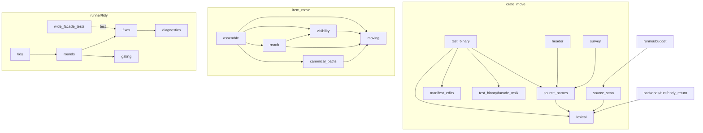

# Changeset: the production-line count skips test-only items, and the engine's oversized files are split by the engine

**Date**: 2026-10-09
**Status**: 🚧 In Progress
**Type**: Refactor (behaviour-preserving splits) + Bug fix (the production-line counter)
**Stack**: `#reshape` 15/19, branch `feature/reshape/oversized-files`, green wave 2. PR title:
`refactor(code-restructuring): engine files fit 500 lines, counted past test-only items (#reshape 15/19)`.
Base in the linear stack: `feature/reshape/tests-follow` (K=14). **Real edges**: `multi-seam-extract → oversized-files`
(K=2), `tidy-facades → oversized-files` (K=3), and — **not in the brief, found here** — `widen-same-crate →
oversized-files` (K=1: the `tidy.rs` and `assemble.rs` seams split private fields and impl members from their users).
**Out of this node**: `oversized-files → feature/reshape/rust-backend-split` (it uses this node's line counter and edits its two shape tests).

## Initial Discovery

Full codebase exploration that grounded this plan: [initial-discovery.md](./2026-10-09-reshape-oversized-files-initial-discovery.md)
(Exploration 1: whole backlog; Exploration 2: this node — the counters, the re-measured list, each file's seams).

State A below is distilled from that file. Do not duplicate grep traces or file dumps here.

## Prerequisites

`grep -rl 'Claimed by:'` over `packages/tddy-code-restructuring/docs/code-issues/` finds no claim on the files this node
touches: **no 🚧 claimed issue is in the path, no wait-or-proceed fork.**

| Item | Verdict | What this change does about it |
|---|---|---|
| [2026-09-19-the-file-length-gate-stops-at-the-first-cfg-test-use.md](../todo/2026-09-19-the-file-length-gate-stops-at-the-first-cfg-test-use.md) | ✅ **RESOLVED HERE** | The robust version it asks for: each test-only item excluded on its own (token-level, strings and comments masked). `check --budget` uses it. `/pr-wrap` step 3.5 calls `restructure lines` instead of its `awk`. Deleted at wrap |
| [oversized-file-test-binary.md](../../../packages/tddy-code-restructuring/docs/code-issues/oversized-file-test-binary.md) | ✅ **RESOLVED HERE** | Four engine moves take 967 to about 394. Its claim that the scanner alone brings the file under budget is wrong (580 left; Exploration 2 §3). Final measurement goes into the change-history entry, then the record is deleted at wrap |
| [2026-09-19-test-binary-rs-is-950-production-lines.md](../todo/2026-09-19-test-binary-rs-is-950-production-lines.md) | ✅ **RESOLVED HERE** | Same split. Deleted at wrap |
| [2026-10-06-restructure-item-move-assemble-past-500.md](../todo/2026-10-06-restructure-item-move-assemble-past-500.md) | ✅ **RESOLVED HERE** | `Moving` and the visibility decisions move out (507 → about 356). Its first candidate (`doc_links.rs`) already exists. Deleted at wrap |
| `runner/tidy.rs` at ~540 real production lines (no record; reassigned to this node by the developer, 2026-10-09) | ✅ **RESOLVED HERE** | The import rounds and the fix application move to `tidy/rounds.rs` and `tidy/fixes.rs` (540 → about 196) |
| [2026-10-03-restructure-leftovers-of-the-live-plan-carve-and-tooling-pass.md](../todo/2026-10-03-restructure-leftovers-of-the-live-plan-carve-and-tooling-pass.md) | ⚠ **partial**: item 3 ✅ here | Item 3 (`test_binary.rs` size). Claimed by `tidy-facades`, which narrows the entry. This node removes item 3 at its own wrap if the entry is still open |
| [oversized-file-backends-rust.md](../../../packages/tddy-code-restructuring/docs/code-issues/oversized-file-backends-rust.md) | — Unrelated (node 17) | Not touched. Its number is corrected to 2,959 by the new count, and `rust-backend-split` uses that count |
| Function-size lists (whole-work discovery, Exploration 3): `assemble` 82, `visibilities` 71, `into_destination` 60, `moved_text` 60 | ⚠ **DURING** (owned by `fn-sizes-backend`) | Moved functions keep their bodies (`visibilities` moves to `item_move/visibility.rs`). No function grows |

## Affected Packages

- **`tddy-code-restructuring`**: [README.md](../../../packages/tddy-code-restructuring/README.md)
  - edited: `src/runner/budget.rs` (`production_lines`), `src/crate_move/source_scan.rs` (new `test_only_spans`), `src/restructure_args.rs` +
    `src/runner/options.rs` + a new `src/runner/entry_points/lines_entry_point.rs` (the `lines` subcommand);
  - moved by `tddy-tools restructure` (no hand-written moved code): `src/crate_move/test_binary.rs` → new `src/lexical.rs`,
    new `src/crate_move/source_names.rs`, new `src/crate_move/test_binary/facade_walk.rs`, `src/crate_move/manifest_edits.rs`;
    `src/runner/tidy.rs` → new `src/runner/tidy/rounds.rs`, `src/runner/tidy/fixes.rs`;
    `src/backends/rust/item_move/assemble.rs` → new `item_move/moving.rs`, `item_move/visibility.rs`;
    re-pointed callers: `crate_move/{source_scan,header,survey}.rs`, `backends/rust/early_return.rs`,
    `item_move/{reach,canonical_paths}.rs`, `backends/rust/item_move.rs`, `runner/tidy/wide_facade_tests.rs`;
  - new tests: `tests/engine_file_budget_shape.rs`, `tests/engine_module_edges_shape.rs`.
  - Docs at wrap: [test-binary-moves.md](../../../packages/tddy-code-restructuring/docs/test-binary-moves.md) and
    [path-survey.md](../../../packages/tddy-code-restructuring/docs/path-survey.md) (the masker's new home),
    [readiness-and-gates.md](../../../packages/tddy-code-restructuring/docs/readiness-and-gates.md) (the budget's count,
    the tidy's module layout), the code-issue record removed.
- **`tddy-tools`**: `src/index_client.rs` — `RestructureCommand::Lines` answered without an index (one arm).
- **`tddy-index-daemon`**: `src/cli.rs` — the matching arm, if its `match` is exhaustive over `RestructureCommand`
  (checked at red time).
- **Dev tooling (not distributed)**: `.agents/commands/pr-wrap.md` step 3.5, `.agents/skills/code-restructuring/SKILL.md:17`,
  `.agents/skills/deferred-work/references/code-issue-record.md:27`.

## Related Feature Documentation

- [PRD-2026-10-09-reshape-oversized-files.md](../../ft/coder/1-WIP/PRD-2026-10-09-reshape-oversized-files.md) (this PRD)
- [Rust code restructuring](../../ft/coder/rust-code-restructuring.md) — the `check` row (`--budget`), a new `lines` row

## Summary

A Rust file's production lines become *all lines minus the lines of each test-only item*. A test-only item is one marked
`#[cfg(test)]` or `#[cfg(all(test, …))]`, counted from its first doc comment or attribute through its last line. This
replaces *the lines before the first `#[cfg(test)] mod`*. `check --budget` and the new `restructure lines` report the
count, and `/pr-wrap` uses `restructure lines`. Re-measured this way, three engine files besides `backends/rust.rs` are
over 500. Each is split by `tddy-tools restructure` plans into modules by responsibility, and every caller is re-pointed
(`reexport: none`), so no facade is left behind. Paths outside the crate are unchanged; everything moved is
`pub(crate)` or narrower.

## Background

`runner/budget.rs:42-55` cuts a file at the first `#[cfg(test)]` whose next line starts a `mod`. An out-of-line
`#[cfg(test)] mod wide_facade_tests;` also matches, so `runner/tidy.rs` reads 36 lines and has 540. The `/pr-wrap` gate
is blinder still: it stops at any `cfg(…test…)` line, `not(test)` included. The backlog's oversized list was taken
with the first counter, so it named three files where there are four (Exploration 2 §2).

The files themselves: `crate_move/test_binary.rs` was created at 950 with consent to defer (#498). Its lexical masker has
since gained three consumers outside it (`source_scan`, `early_return`, `header`), and it is the only reason
`backends/rust/early_return.rs` reaches into `crate_move`. `item_move/assemble.rs` crossed 500 in #589. Two module cycles
run through it (`reach ↔ assemble`, `canonical_paths ↔ assemble`), both because siblings take `Moving` and `users_of` from
it. `runner/tidy.rs` was never flagged at all. The engine-crate split planned after this stack
(`2026-10-08-split-tddy-code-restructuring-into-wiring-and-engine-crates.md`) needs these seams to exist first.

## Responsibility

- **The count.** `crate_move::source_scan::test_only_spans(text) -> Vec<Range<usize>>`: the byte span of every item
  marked by `cfg_test_attribute` (the existing, single definition of a `cfg(test)` marker), from the item's first
  outer doc comment or attribute through its terminating `;` or matching `}`, at any depth, nested spans merged.
  `runner/budget.rs::production_lines` counts the lines not wholly inside one of them.
- **`restructure lines <file>...`.** Prints `<lines>\t<path>` per file, in argument order. A non-`.rs` file counts every
  line. Unreadable → `MalformedPlan`-class refusal naming the path, non-zero exit. Answered in process: no server, no
  daemon, no journal, no spawn record.
- **The `/pr-wrap` gate** calls it for the working-tree file and for the merge-base blob (written to a temp file with
  the same basename). The gate aborts with `GATE ERROR` when `tddy-tools restructure lines` fails or is missing.
- **The splits**, re-measured at the base. Every production file in `src/` except `backends/rust.rs` must end at most 500.
  This covers whatever wave-1 nodes pushed over (F1).
- **Two shape tests** pin the budget and the must-not edges.

## Rules (the contract)

**Counting.** For a `.rs` text: mask strings, chars and comments (`readable_spans`). Tokenise (`source_scan::tokens_of`).
At each token where `cfg_test_attribute` matches, walk back over directly preceding outer attributes (`#[…]`) and doc
comments (`///`, `/** */`, which are masked comments ending immediately above) to the item's start. Walk forward over
further attributes to the item. The item ends at the first `;` at bracket depth 0 if no `{` comes first, otherwise at
the `}` that closes its first `{`. A line counts as test-only when every non-blank byte on it lies inside such a span.
Production lines = total lines − test-only lines. Blank lines outside spans count, as today.

**Not test-only**: `#[cfg(not(test))]`, `#[cfg(any(test, …))]`, `#[cfg_attr(test, …)]`, `#[cfg(feature = "testing")]`.
They build outside tests too, and `source_scan`'s rule already reads them this way.

**Moves.** Moves are engine-driven only (`tddy-tools restructure`). A hand edit is allowed only to fix the build after an
engine move, and every such fix gets a `docs/dev/todo/` entry naming the operation and the error. If `check --deep` or
`apply` refuses, stop: roll back what the run touched and ask the developer. Never work around a refusal by hand, and
never use `git mv`.

## Boundaries

- `backends/rust.rs` — node 17's. Not touched except where a re-pointed caller lives in it (none planned).
- No function body changes in a move; functions on nodes 16/19's lists move whole and do not grow.
- No new behaviour in any operation. No facade written: `reexport: none` throughout, so `crate_move.rs`'s
  `pub use test_binary::*;` keeps re-exporting only what stays in `test_binary`.
- The masker is moved, never duplicated. `source_scan`'s second token-level scanner is not merged with it (proposed
  todo).
- Other crates' shape-test counters keep their own heuristics (proposed todo).
- A file that is wholly an out-of-line test module (`x_tests.rs`) is still counted whole by `lines`/`--budget`. It cannot
  know its parent's attribute. No such file is over 400 today (F5).

## Dependencies

| Parent node | What it delivers | How this PR consumes it | This PR does NOT |
|---|---|---|---|
| `feature/reshape/widen-same-crate` (K=1) | `move_item` widens the private fields and impl members a move splits apart (E0616/E0624) | `Landing`'s six private fields (read in `assemble`, `moved_text`, `leave_behind`), `Report`/`Round`/`UnusedImports` fields and `Report::accept`/`say`, `Round::removes` | widen anything by hand; it re-anchors on node 1's `assemble.rs` (`Moving.reached: &Reach`, `item_move/members.rs`) |
| `feature/reshape/multi-seam-extract` (K=2) | every operation of a run is resolved against the files earlier operations created (projected tree), with `check --deep` parity | each plan here has 2–4 operations, later ones reading modules earlier ones created (e.g. `source_names` imports from the new `lexical`) | rely on rust-analyzer's file watcher, or split plans one operation per apply to dodge it |
| `feature/reshape/tidy-facades` (K=3) | tidy gates test-only imports and globs instead of failing; tidy says when it was skipped; origin `use` runs are not re-sorted by rustfmt | every apply's tidy of the imports the moves orphan (the moved modules carry `#[cfg(test)]`-only imports, e.g. in `tidy`) | touch `tidy/gating.rs` beyond re-measuring it; if node 3 left it over 500 it is split here (F1) |

## Draft PR contract

The first push of this PR (wave 2 of the stack plan) publishes:

- **Owned surface**: `pub(crate) fn test_only_spans(text: &str) -> Vec<Range<usize>>` in `crate_move/source_scan.rs`,
  `pub fn production_lines_of_file(path: &str, text: &str) -> usize` re-exported from `lib.rs` (F4),
  `RestructureCommand::Lines(RestructureLinesArgs { files: Vec<PathBuf> })` and `Command::Lines` in
  `runner/options.rs`, the routing arms in `tddy-tools` / `tddy-index-daemon`. Bodies that compile and answer wrongly
  (today's cut) so every test below fails on its assertion, not on a panic.
- **Failing tests** (acceptance tests 1–10 and 12–13 below): the counting unit tests in `runner/budget.rs`, the `lines`
  parse and run tests, and the two shape tests, red on the base because `test_binary.rs`, `tidy.rs` and `assemble.rs`
  are over budget and the must-not edges exist.

## Green wave

- **Wave 2 of 4.** Greenable once K=1, K=2 and K=3 are green. Concurrent with `move-impl-members` (13), `tests-follow`
  (14) and `fn-sizes-rest` (16). No file overlap with 13. With 14, `wide_facade_tests.rs` is the only shared path: 14
  may move test modules, so re-anchor after rebasing. With 16, functions it extracts in `crate_move/` may sit in files
  moved here, so whichever greens second re-anchors.
- Blocks: `feature/reshape/rust-backend-split` (real edge `15→17`: the counter and both shape tests).
- Real edges into this node: `1→15` (added here), `2→15`, `3→15`. Out of it: `15→17`.

## Successor PRs

- `feature/reshape/rust-backend-split` — **real successor**: measures `backends/rust.rs` with this node's counter (`production_lines_of_file` / `restructure lines`), removes the `src/backends/rust.rs` exemption and its `TODO(#reshape 17)` from `tests/engine_file_budget_shape.rs`, and adds its own edge tests to `tests/engine_module_edges_shape.rs`.
- `feature/reshape/fn-sizes-rest` — next in the line (sequential only). Its anchors in `crate_move/` move files here.
- `feature/reshape/fn-sizes-backend` — re-anchors `assemble`, `visibilities`, `into_destination` and `moved_text` to
  their files after this node.

## Scope

- [ ] **Counter**: `test_only_spans`, `production_lines`, unit tests (acceptance 1–7)
- [ ] **`lines`**: subcommand, routing arms, `/pr-wrap` gate and two docs (acceptance 8–10)
- [ ] **Plan**: re-measure at base; layout fixed; plans written from `restructure anchors`; `check --deep` clean
- [ ] **Apply**: `--dry-run` then apply, one commit per plan; `verify --against HEAD` after each
- [ ] **Baseline**: `./test -p tddy-code-restructuring` failing set equal to the baseline's by name; shape tests green (acceptance 12–13)
- [ ] **Code Quality**: `cargo fmt --check`, `cargo clippy -p tddy-code-restructuring -p tddy-tools -p tddy-index-daemon --all-targets -- -D warnings`
- [ ] **Documentation**: Final Checklist executed at wrap

## Technical changes

### State A

| File | Production lines (items rule) | What it holds |
|---|---:|---|
| `crate_move/test_binary.rs` | 967 | operation ~395 · masker 154 · names/bindings 233 · facade walk 91 · dev-deps 95 |
| `runner/tidy.rs` | 540 (`--budget` says 36) | entry/check/report ~196 · rounds ~230 · fixes ~114 |
| `backends/rust/item_move/assemble.rs` | 507 | `Moving` 23 · visibilities 128 · assembly ~356 |
| `runner/budget.rs:42-55` | — | `production_lines` cuts at the first `#[cfg(test)]` + `mod` line |
| `.agents/commands/pr-wrap.md:121-128` | — | `awk` exits at the first `cfg(…test…)` |

Module edges today that must go: `backends/rust/early_return.rs:6 → crate::crate_move` (masker only);
`crate_move/source_scan.rs:15 → test_binary`; `crate_move/header.rs:12 → test_binary`; `crate_move/survey.rs:20 →
test_binary`; `item_move/reach.rs:13 → assemble` (cycle); `item_move/canonical_paths.rs:16 → assemble` (cycle).

### State B

| Module | Gets | Projected lines | Operation |
|---|---|---:|---|
| `src/lexical.rs` (new, crate root) | `Prose`, `readable_spans`, `block_comment_end`, `literal_end`, `raw_string_hashes`, `string_end`, `character_literal_end` | ~154 | `move_item`, `to: crate`, `name: lexical`, `reexport: none` |
| `crate_move/source_names.rs` (new) | `is_a_built_in_root`, `crate_shaped_heads`, `opens_a_path`, `inside_a_declaration`, `names_bound_in`, `behind_any_visibility`, `use_trees`, `record_names_bound_by`, `name_bound_by`, `grouped_members`, `segment_length`, `modules_declared_in`, `module_declared_by` | ~233 | `move_item`, `to: crate::crate_move`, `name: source_names`, `reexport: none` |
| `crate_move/test_binary/facade_walk.rs` (new child) | `Defining`, `defining_home`, `crate_past_the_facades` | ~91 | `extract_module --to_file` |
| `crate_move/manifest_edits.rs` | + `destination_dev_dependencies`, `dev_dependency_line_for` | 307 → ~402 | `move_item`, `to: crate::crate_move::manifest_edits`, `reexport: none` |
| `crate_move/test_binary.rs` | the operation, its reference re-pointing, `origin_named_paths` | ~394 | — |
| `item_move/moving.rs` (new) | `Moving` | ~25 | `move_item`, `name: moving`, `reexport: none` |
| `item_move/visibility.rs` (new) | `Landing`, `spelled`, `read_scope`, `visibilities`, `users_of` | ~130 | `move_item`, `name: visibility`, `reexport: none` |
| `item_move/assemble.rs` | `Assembled`, `written_from_the_root`, `assemble`, the text passes | ~356 | — |
| `runner/tidy/rounds.rs` (new) | `Report`, `Round`, `Repairs`, `tidy_imports`, `begin`, `Repair`, `MAX_REPAIRS`, `repair`, `undone`, `restore` | ~230 | `move_item`, `to: crate::runner::tidy`, `name: rounds`, `reexport: none` |
| `runner/tidy/fixes.rs` (new) | `UnusedImports`, `unused_imports`, `read_by_a_unit`, `apply_fixes`, `refuse_unappliable` | ~114 | same, `name: fixes` |
| `runner/tidy.rs` | module doc, `Tidying`, `Tidied`, `tidy`, `Checked`, `Failure`, `check`, `errors_of`, `format_touched_files`, `report_remaining_warnings` | ~196 | — |

**Edges that must NOT exist** (each checked by `tests/engine_module_edges_shape.rs`, a text check on `use` lines and
inline paths of the named file):

| From | Must not reach | Why |
|---|---|---|
| `src/lexical.rs` | `crate::crate_move`, `crate::backends`, `crate::runner`, `super::` | a leaf every engine crate can take later |
| `backends/rust/early_return.rs` | `crate::crate_move` | the Rust backend's only reason to reach `crate_move` |
| `crate_move/{source_scan,header,survey,source_names}.rs`, `runner/budget.rs` | `test_binary` | nothing but `crate_move.rs` names the operation's module |
| `item_move/{moving,visibility,reach,canonical_paths}.rs` | `assemble` | the two cycles stay broken |
| `item_move/moving.rs` | any sibling of `item_move` | `Moving` is a plain record |
| `runner/tidy/{fixes,gating,diagnostics,format}.rs` | `rounds` | the loop depends on its parts, not the reverse |

### Delta (dependency order)

1. Counter: `test_only_spans` + `production_lines` (hand-written, new behaviour, tests first).
2. `lines` subcommand + routing + `/pr-wrap` + docs.
3. Plan A (`test_binary.rs`): `lexical` (its callers re-pointed first, since `source_names` and `source_scan` need it),
   then `source_names`, then dev-deps into `manifest_edits`, then `facade_walk`.
4. Plan B (`assemble.rs`): `moving`, then `visibility`.
5. Plan C (`tidy.rs`): `fixes`, then `rounds`.
6. Any file F1 adds (re-measured at base), each its own plan.

### Callers rewritten (blast radius)

`crate_move/source_scan.rs`, `crate_move/header.rs`, `crate_move/survey.rs`, `backends/rust/early_return.rs`,
`backends/rust/item_move.rs`, `item_move/reach.rs`, `item_move/canonical_paths.rs`, `runner/tidy/wide_facade_tests.rs`,
plus any test module that reached a moved item through `use super::*`. No file outside `tddy-code-restructuring` is
re-pointed: every moved item is `pub(crate)` or narrower.

## Implementation milestones

1. Baseline: `./test -p tddy-code-restructuring`; record counts and failing names.
2. Counter green (acceptance 1–7). Commit.
3. `lines` + gate + docs green (8–10). Commit.
4. `./run-index-daemon`; re-measure with `restructure lines` over `src/**/*.rs` at the base; update State B if F1 adds files.
5. Plan A: anchors → `check --deep` → `--dry-run` → apply → `verify --against HEAD`. Commit. Same for B, C.
6. Final gate: fmt, clippy, `./test -p tddy-code-restructuring -p tddy-tools -p tddy-index-daemon`, comment multiset, `verify --against <ref before plan A>`; shape tests green (12–13).

## Testing plan

- Counter: unit tests in `runner/budget.rs`'s `mod tests` (strings in, numbers out, no I/O except the existing
  `measured` tempdir tests).
- `lines`: parse test in `restructure_args.rs`; in-process run test over a tempdir.
- Splits: no acceptance tests of their own (restructure-changeset rule); the recorded baseline by name, `verify`, the
  comment multiset, and the two shape tests that pin the result.
- Scoped only: `./test -p tddy-code-restructuring` (plus `-p tddy-tools -p tddy-index-daemon` for the routing arms);
  CI for the rest. No live rust-analyzer suite is added.

## Acceptance tests

All in `packages/tddy-code-restructuring/`. Red on the base for the reason given.

1. `src/runner/budget.rs` — `keeps_counting_past_an_out_of_line_test_module_declaration`: `fn a() {}\n#[cfg(test)]\nmod a_tests;\nfn b() {}\n` → 2. *Red: the cut stops at line 2 → 1.*
2. `src/runner/budget.rs` — `leaves_out_every_test_only_item_wherever_it_sits`: a `#[cfg(test)] use`, a `#[cfg(test)] fn` block and an inline `mod tests` interleaved with three production items → 3. *Red: cut at the inline module only.*
3. `src/runner/budget.rs` — `a_brace_in_a_string_or_comment_does_not_end_a_test_item`: a `#[cfg(test)] fn` whose body has `"}"` and `// }` → the fn's lines all excluded. *Red: no item rule exists.*
4. `src/runner/budget.rs` — `leaves_out_an_item_marked_cfg_all_test`. *Red.*
5. `src/runner/budget.rs` — `counts_cfg_not_test_and_cfg_any_test_items_as_production`. *Red on the item level (passes today only by accident of no `mod`); written so it asserts the exact count with a test module after them.*
6. `src/runner/budget.rs` — `leaves_out_the_doc_comment_and_attributes_above_a_test_only_item`: `/// helper\n#[allow(dead_code)]\n#[cfg(test)]\nfn h() {}` → 0 of those 4 lines. *Red.*
7. `src/runner/budget.rs` — `leaves_out_a_test_only_member_of_a_production_impl`. *Red.*
8. `src/restructure_args.rs` — `lines_carries_the_files_it_measures`: `parse(&["lines", "a.rs", "b.ts"])` → `Command::Lines` with both paths. *Red: no subcommand.*
9. `src/runner/entry_points/lines_entry_point.rs` — `prints_the_production_lines_of_each_file_in_argument_order` (tempdir, one `.rs` with an out-of-line test module, one `.ts`) and `refuses_a_file_it_cannot_read_naming_it`. *Red: no command.*
10. `src/runner/budget.rs` — `measures_a_file_whose_extracted_test_module_is_declared_at_the_top` via `measured` on a tempdir: the `runner/tidy.rs` shape (doc, `mod a; mod b; #[cfg(test)] mod c_tests;`, 40 production lines, inline tests) → 40 + header lines. *Red: reads the header only.*
11. *(gate, manual at wrap)* `/pr-wrap` step 3.5 run on this branch prints `967 → 394 crate_move/test_binary.rs`-style rows from `restructure lines`, and with `tddy-tools` off `PATH` prints `GATE ERROR`.
12. `tests/engine_file_budget_shape.rs` — `every_production_file_of_the_engine_is_within_500_lines`: walks `src/**/*.rs` through `restructure lines`' library entry (`tddy_code_restructuring::production_lines_of_file`, F4) and asserts none is over 500 except the exemption list `["src/backends/rust.rs"]` (`// TODO(#reshape 17): rust-backend-split empties this list`). *Red: `test_binary.rs` 967, `tidy.rs` 540, `assemble.rs` 507.*
13. `tests/engine_module_edges_shape.rs` — one test per row of the must-not table, e.g. `the_rust_backend_does_not_reach_crate_move_for_the_masker`, `nothing_but_crate_move_names_test_binary`, `item_move_siblings_do_not_import_from_assemble`, `the_lexical_masker_depends_on_no_engine_module`, `tidy_parts_do_not_import_the_rounds`. *Red: `src/lexical.rs` does not exist and the edges are present.*

## Technical Debt & Production Readiness

- The exemption list in acceptance 12 is a `TODO(#reshape 17)`; node 17 empties it.
- Each post-move hand fix is a new `docs/dev/todo/2026-10-xx-…` entry (none planned; expected 0 with K=1 landed).
- Code-issue records measured with the old rules are not re-measured wholesale; each is corrected when next touched.

## Decisions & Trade-offs

**Decided 2026-10-09** (developer, PRD review): every recommendation below, F1–F7, is taken, including consent for F3's routing arms in `tddy-tools` and `tddy-index-daemon`.

- **F1 — ✅ decided 2026-10-09: recommendation taken —** **scope of "oversized"**. (a) Exactly the three files measured on master; (b) every production file of the crate
  except `backends/rust.rs` that is over 500 **at this node's base** (node 14's tip) by the fixed count. **Recommend
  (b)**: `tidy/gating.rs` (479) gains node 3's `to_gate_in_a_repair`, `plan/codec.rs` (478) gains three wave-1 `mod`
  lines and calls. A shape test that exempts them would be a lie. Acceptance 12 enforces (b) anyway.
- **F2 — ✅ decided 2026-10-09: recommendation taken —** **the masker's home**. (a) crate-root `src/lexical.rs`; (b) `crate_move/prose.rs`; (c) inside
  `crate_move/source_scan`. **Recommend (a)**: its consumers span `crate_move`, `backends` and (through `source_scan`)
  `runner`. It depends on nothing else in the crate, and the later engine-crate split needs it outside `crate_move`.
- **F3 — ✅ decided 2026-10-09: recommendation taken —** **the `/pr-wrap` gate**. (a) New `restructure lines` subcommand, which touches `tddy-tools` and
  `tddy-index-daemon` by one routing arm each (**consent given 2026-10-09**); (b) fix only `check --budget`, keep the gate's `awk`,
  and narrow the todo to the gate; (c) a smarter `awk`. **Recommend (a)**: one definition of production lines for the
  gate, the engine and every code-issue record. (c) cannot mask strings, and (b) leaves the todo's own case
  (`connection_service.rs`) unmeasured.
- **F4 — ✅ decided 2026-10-09: recommendation taken —** **exposing the count to the shape test**. `production_lines` is `pub(crate)`. (a) `pub fn
  production_lines_of_file(path, text) -> usize` re-exported from `lib.rs`; (b) the shape test shells out to
  `tddy-tools restructure lines`; (c) the shape test as a unit test inside `budget.rs`. **Recommend (a)**: one tiny public
  function. (b) needs a built binary in a library test, and (c) hides a crate-wide check in a module's tests.
- **F5 — ✅ decided 2026-10-09: recommendation taken —** **whole-file test modules** (`x_tests.rs`). (a) Count them whole, as today; (b) resolve the parent's declaration
  and count 0. **Recommend (a)** and a proposed todo: none is over 400, and (b) needs module resolution in a text
  counter.
- **F6 — ✅ decided 2026-10-09: recommendation taken —** **operation per seam**. `move_item` with `name` and `reexport: none` for multi-consumer seams, `extract_module
  --to_file` only for `facade_walk` (single consumer). **Recommend as stated**: `extract_module` would leave a glob
  facade in `test_binary.rs` and keep `early_return → crate_move` alive.
- **F7 — ✅ decided 2026-10-09: recommendation taken —** **`facade_walk` home**. (a) child of `test_binary`; (b) into `crate_move/module_home.rs` (400 → ~491).
  **Recommend (a)**: (b) is responsibility-correct but leaves `module_home.rs` with no headroom. Revisit when
  `module_home.rs` is next split.

## Refactoring Needed

- The masker and `source_scan`'s token scanner are two lexers over the same masking; merging them is a rewrite, not a
  move (proposed todo).
- `module_home.rs` at 400 is the next file to watch.

## Validation Results

Not yet run.

## TODO

- [x] PRD written and linked
- [x] Changeset written
- [x] Initial discovery written (Exploration 2)
- [x] Prerequisites and claimed entries listed
- [ ] Draft PR contract pushed (failing tests 1–10, 12–13)
- [ ] Baseline recorded
- [ ] Counter and `lines` green
- [ ] Plans A, B, C (and any F1 additions) applied, one commit each
- [ ] Final gate; shape tests green
- [ ] Wrap: feature doc, package docs, code-issue record and todos closed

## Final Checklist

- [ ] Every production file in `packages/tddy-code-restructuring/src` except `backends/rust.rs` ≤ 500 by `restructure lines` (acceptance 12)
- [ ] `src/lexical.rs` reaches no `crate::crate_move` / `crate::backends` / `crate::runner` (acceptance 13)
- [ ] `backends/rust/early_return.rs` reaches no `crate::crate_move` (13)
- [ ] Only `crate_move.rs` names `test_binary` (13)
- [ ] No `item_move` sibling imports from `assemble`; `reach ↔ assemble` and `canonical_paths ↔ assemble` cycles gone (13)
- [ ] `runner/tidy/*` parts do not import `rounds` (13)
- [ ] The Mermaid graph above matches the tree (`grep -n "^use\|super::" ` over the named files, recorded in Validation Results)
- [ ] Every move applied by `tddy-tools restructure`; zero `git mv`; every hand fix has a todo entry, listed here
- [ ] `restructure verify --against <ref before plan A>` holds; comment-line multiset unchanged
- [ ] Failing set of `./test -p tddy-code-restructuring` equals the baseline's by name
- [ ] Code-issue record `oversized-file-test-binary.md` deleted with its final measurement in the change-history entry; three todos deleted; leftovers item 3 removed
