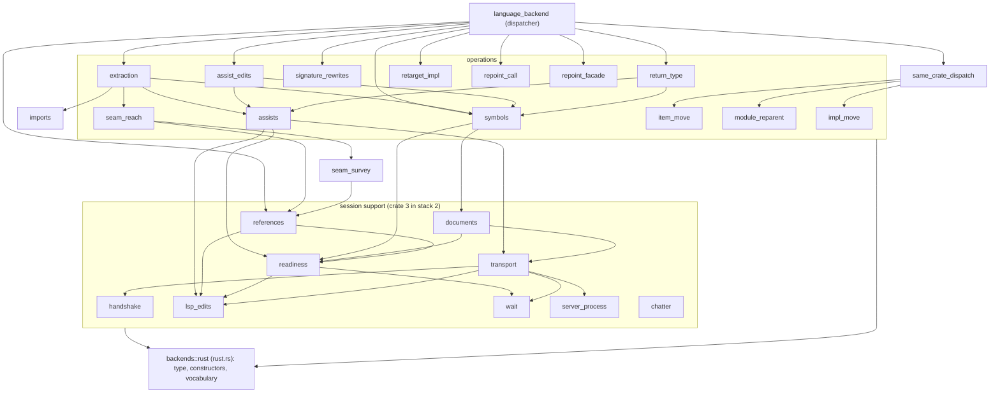

# Changeset: `backends/rust.rs` keeps the type and its constructors, and fifteen child modules hold the Rust backend's responsibilities

**Date**: 2026-10-09
**Status**: 🚧 In Progress
**Type**: Refactor (behaviour-preserving split by the engine; no new behaviour)
**Stack**: `#reshape` 17/19, branch `feature/reshape/rust-backend-split`, green wave 3. PR title:
`refactor(code-restructuring): the Rust backend splits into modules of ≤500 lines (#reshape 17/19)`.
Base in the linear stack: `feature/reshape/fn-sizes-rest` (K=16).

**Real edges in:**
- `move-impl-members → rust-backend-split` (K=13, the member moves);
- `multi-seam-extract → rust-backend-split` (K=2, later operations of a plan see the modules earlier ones created);
- `tidy-facades → rust-backend-split` (K=3, the tidy repair, the gate note, and the `attached_trivia_starts_at` move).

Found here and recorded in the stack table (2026-10-09):
- `widen-same-crate → rust-backend-split` (K=1). `move_item` widens the private fields of `Assist`, `Placeholder`,
  `Produced`, `LspPoint`, `LspEdit` and `PathReached` for their readers (discovery E2.4).
- `oversized-files → rust-backend-split` (K=15). The production-line count and the two shape tests this node edits.

Neither changes the order, because both nodes are already below this one.

**Real edges out:** `rust-backend-split → backend-session` (K=18) and `rust-backend-split → fn-sizes-backend` (K=19).

## Initial Discovery

Full codebase exploration that grounded this plan: [initial-discovery.md](./2026-10-09-reshape-rust-backend-split-initial-discovery.md).
Exploration 1 is the whole-work discovery. Exploration 2 is this node's: the count, the inventory by responsibility with
line counts, contiguity, visibility, the public surface and the risks.

State A below is distilled from that file. Do not duplicate grep traces or file dumps here.

## Prerequisites

`grep -rl 'Claimed by:' packages/tddy-code-restructuring/docs/code-issues/` matches only
`broken-restructure-anchors-empty-outline.md`, which reads `**Claimed by:** none`. **No 🚧 claimed issue is in the path,
so there is no wait-or-proceed fork.**

| Item | Verdict | What this change does about it |
|---|---|---|
| [oversized-file-backends-rust.md](../../../packages/tddy-code-restructuring/docs/code-issues/oversized-file-backends-rust.md) | ✅ **RESOLVED HERE** | 2,958 on master (about 2,850 at the base) to about 425. Its "the free-item seams are cut" is wrong: about 790 lines of free items remain (E2.2). Final measurement goes into the change-history entry, then the record is deleted at wrap |
| [2026-09-16-backends-rust-rs-is-4500-production-lines.md](../todo/2026-09-16-backends-rust-rs-is-4500-production-lines.md) | ✅ **RESOLVED HERE** | Same split. Its "what remains is the clusters inside `impl RustBackend`" is corrected in the history entry. Deleted at wrap |
| [2026-10-03-restructure-rust-backend-grows-with-every-live-plan-node.md](../todo/2026-10-03-restructure-rust-backend-grows-with-every-live-plan-node.md) | ✅ **RESOLVED HERE** | Same split. The growth stops structurally: the dispatcher lives in `language_backend.rs`, and the shape test holds `rust.rs` to one inherent block. Deleted at wrap |
| [2026-10-03-restructure-leftovers-of-the-live-plan-carve-and-tooling-pass.md](../todo/2026-10-03-restructure-leftovers-of-the-live-plan-carve-and-tooling-pass.md) § 1 | ⚠ **partial** (claimed by `tidy-facades`; § 1 is shared with `move-impl-members`, which narrows it to "the runs are not yet moved") | The runs are moved. § 1 is removed at this wrap. Its run table (`session` … `backend_impl`) is not followed (F3) |
| Code issue `complexity-rust-facade-lines.md`, and the >60-line functions `resolve_opening`, `assisted_edit`, `assist_for`, `start`, `offered_assist`, `check`, `request`, `chain_module_to_file` | ⚠ **DURING** (owned by `fn-sizes-backend`) | Each moves whole, body unchanged (E2.8). None grows |
| [2026-10-02-rust-backend-locate-symbol-waits-on-an-empty-outline-with-no-deadline.md](../todo/2026-10-02-rust-backend-locate-symbol-waits-on-an-empty-outline-with-no-deadline.md), [2026-10-02-a-server-that-never-sends-server-status-leaves-settled-outline-waiting.md](../todo/2026-10-02-a-server-that-never-sends-server-status-leaves-settled-outline-waiting.md) | — Unrelated (in the path) | Behaviour untouched. Their `rust.rs:NNNN` location lines are re-pointed at wrap (`symbols.rs`, `documents.rs`) |
| [2026-10-08-split-tddy-code-restructuring-into-wiring-and-engine-crates.md](../todo/2026-10-08-split-tddy-code-restructuring-into-wiring-and-engine-crates.md) | — Unrelated (stack 2) | Answers its open question "Is `backends/rust.rs` a dispatcher into every operation?" (`:39`). After this node it is: the dispatcher is `language_backend.rs`, and the session plumbing is separate (E2.9). Recorded at wrap as a note on that todo |
| Others in `docs/code-issues/` and `docs/dev/todo/` naming `rust.rs` (`2026-10-04-restructure-move-item-does-not-widen-fields-or-impl-members.md` and the other same-crate limits) | — | Claimed by lower nodes; consumed, not changed |

## Affected Packages

- **`tddy-code-restructuring`**: [README.md](../../../packages/tddy-code-restructuring/README.md)
  - Moved by `tddy-tools restructure`, with no hand-written moved code:
    - `src/backends/rust.rs` → new `src/backends/rust/{language_backend,assists,transport,assist_edits,extraction,seam_reach,references,symbols,handshake}.rs`;
    - into existing `src/backends/rust/{readiness,lsp_edits,documents,signature_rewrites,return_type,imports}.rs`.
  - Re-pointed by the engine (`reexport: none`): the `use super::…` lines of about 30 child files under
    `src/backends/rust/` (E2.6), `src/lib.rs:26` (`reexport: outside`), and the inline `mod tests` of `rust.rs`.
  - Edited tests: `tests/engine_file_budget_shape.rs` (exemption removed), `tests/engine_module_edges_shape.rs` (five
    tests added). New test: `tests/rust_backend_public_paths.rs`.
  - Docs at wrap:
    - [README.md](../../../packages/tddy-code-restructuring/README.md) `:186`, `:197`;
    - [assist-output-repairs.md](../../../packages/tddy-code-restructuring/docs/assist-output-repairs.md) `:25`;
    - [readiness-and-gates.md](../../../packages/tddy-code-restructuring/docs/readiness-and-gates.md) `:19`;
    - [signature-rewrites.md](../../../packages/tddy-code-restructuring/docs/signature-rewrites.md) `:26`;
    - [signature-assists.md](../../../packages/tddy-code-restructuring/docs/signature-assists.md) `:15`;
    - [same-crate-moves.md](../../../packages/tddy-code-restructuring/docs/same-crate-moves.md) `:20`;
    - [retarget-impl.md](../../../packages/tddy-code-restructuring/docs/retarget-impl.md) `:20`;
    - [repoint-call.md](../../../packages/tddy-code-restructuring/docs/repoint-call.md) `:22`;
    - [repoint-facade.md](../../../packages/tddy-code-restructuring/docs/repoint-facade.md) `:18`;
    - the code-issue record, removed.
- **`tddy-index-daemon`, `tddy-tools`**: no source change. `tddy-index-daemon` is built and its tests compiled as a gate,
  because it reaches `backends::rust::*` and `client_capabilities`/`server_settings`.

## Related Feature Documentation

- [PRD-2026-10-09-reshape-rust-backend-split.md](../../ft/coder/1-WIP/PRD-2026-10-09-reshape-rust-backend-split.md)
- [Rust code restructuring](../../ft/coder/rust-code-restructuring.md): no section changes

## Summary

The members of the four `impl RustBackend` blocks, the three trait impls and the free items of `backends/rust.rs` move
into one child module of `backends::rust` per responsibility. There are 48 plan lines in 11 plans:
- 17 `move_impl_members` runs;
- one `move_item` run of the trait impls;
- 30 `move_item` runs of free items.

`rust.rs` keeps `struct RustBackend`, its constructors, `ProgressSink`/`discard`, the shared refusal and identifier
helpers, the `mod`/`use` hub and its public re-exports. Every destination is at most 500 production lines. Moved private
code becomes `pub(super)`, and nothing wider. Callers inside the crate are re-pointed. The two `pub` functions other
crates reach keep both of their public paths. No behaviour, output or function body changes.

## Background

The code-issue record has fourteen rows, each adding wiring to `rust.rs`. The split was deferred three times by
stack-overlap stops and once by the missing impl-member seam (#567). That seam is `#reshape` 13's `move_impl_members`.
The file is not only members, though. About 790 lines of free items remain (E2.2), so the plan is three operations, each
where it fits. `extract_module` is not one of them (F1).

## Responsibility

- Re-measure `rust.rs` and every destination at the base with `restructure lines`. Fix the plan from the re-measure.
- Write the 11 plans from `restructure anchors`. Run each plan through `check --deep`, `apply --dry-run`, `apply` and
  `verify --against HEAD`, with one commit per plan.
- Remove `"src/backends/rust.rs"` from the exemption list in `tests/engine_file_budget_shape.rs`, together with its
  `TODO(#reshape 17)`.
- Add the must-not-exist edge tests to `tests/engine_module_edges_shape.rs`, and pin the public paths in
  `tests/rust_backend_public_paths.rs`.
- Record every post-move hand fix as a `docs/dev/todo/` entry, naming the operation and the error.
- At wrap: update the package docs; delete three records with the final measurement; remove leftovers § 1; re-point the
  location lines of the two 2026-10-02 todos.

## Rules (the contract)

**R1. Moves are engine-driven only** (`tddy-tools restructure`). A hand edit is allowed only to fix the build after an
engine move, and every such fix gets a `docs/dev/todo/` entry. If `check --deep` or `apply` refuses, stop: roll back what
the run touched (`git checkout`, then reset the index) and ask the developer. Never work around a refusal by hand, never
re-plan a refused line into another operation without consent, and never use `git mv`.

**R2. Operation per kind of code.**

| Code | Operation | Fields |
|---|---|---|
| a run of members of one inherent `impl RustBackend` | `move_impl_members` | `items` anchor on `…::RustBackend::<member>`; `to`; `name` on the line that creates the module |
| the three trait impls (`:1095-1241`, contiguous) | `move_item` | `items` anchor `['<RustBackend as Drop>', '<RustBackend as LanguageBackend>', '<RustBackend as ModuleReferences>']`; `to` |
| a run of free items | `move_item` | `items`; `to` (or `name` + parent); `reexport: none` |
| `client_capabilities` … `server_settings` (`pub`, reached from `tddy-index-daemon`) | `move_item` | `reexport: outside` |

**R3. One module per responsibility.** Each destination is named in State B. A free item with one user goes to that user's
module: `first_symbol_position` to `readiness`, `IMPORT_PASSES` to `imports`, `CANCEL_CHECK` to `readiness`, and
`SETTLE_POLL` and `CONTENT_MODIFIED*` to `transport`. A free item with users in many modules stays in `rust.rs` (F5).

**R4. Every file at most 500**, by `restructure lines`, after each plan and at the end. A destination that would pass 450
at the base is reported before its plan is applied, so the layout can change (F3).

**R5. No body changes.** A moved function keeps its body byte for byte, except for the path respellings the operations make
(R5 of `move_impl_members`, `move_item`'s re-pointing). No function on the >60-line list grows.

**R6. Public paths unchanged.** These keep resolving:
- `tddy_code_restructuring::backends::rust::{RustBackend, ProgressSink, discard, WAIT_HEARTBEAT, human_delta, ServerChatter, client_capabilities, server_settings}`;
- `tddy_code_restructuring::{client_capabilities, server_settings}`;
- `tddy_code_restructuring::backends::RustBackend`.

No file outside the crate is edited.

## Boundaries

- **Not in scope:**
  - the inline tests of `rust.rs` (about 2,560 lines) and the 46 `#[cfg(test)] use` hub lines that feed them (F6, proposed
    todo);
  - shortening any function (node 19);
  - turning members into free functions (node 18);
  - moving anything across crates (stack 2).
- **No behaviour, output, refusal text or plan format changes.**
- **No new engine code.** If an operation refuses a run, the gap is a todo and a question, never a fix made here.
- **`server_process.rs` is not reorganised.** Its import helpers stay misplaced (proposed todo).
- **Function-size lists:** functions move whole; no new function is written.

## Dependencies

| Parent node | What it delivers | How this PR consumes it | This PR does NOT |
|---|---|---|---|
| `feature/reshape/move-impl-members` (K=13) | `move_impl_members`. It cuts a contiguous run of one inherent `impl` and lands it in a token-equal block of the destination, or in a new block. It removes a block the run empties, writes the imports and widens moved private members to the callers' scope. The module dispatch is folded into `same_crate_dispatch.rs` | 17 runs (State B), including the two that empty block #2 and block #3. Join landings in `readiness.rs` and `documents.rs`; new blocks in `signature_rewrites.rs`, `return_type.rs` and the nine new modules | Re-implement member moves; use `extract_module`'s impl seam; move a member of a trait impl |
| `feature/reshape/multi-seam-extract` (K=2) | Before an operation asks the server anything, the files earlier operations of the same run created or changed are opened with the run's text. This holds for every server-resolved operation, not only `extract_module`, and gives `check --deep` and `apply` parity | Every plan here has 2–8 operations, and later ones survey references into modules earlier ones created (for example, plan C's second run joins `transport.rs`, which its first run created) | Rely on rust-analyzer's file watcher, or apply one operation per run to dodge it |
| `feature/reshape/tidy-facades` (K=3) | The tidy repair gates spans a unit reads (test-only imports), and a failed compile gate says the tidy did not run (`untidied`). Its own engine move takes `attached_trivia_starts_at` out of `rust.rs` | Every apply's end-of-run tidy prunes the origin `use` header copied into each destination. The `untidied` note is read when a gate fails | Use the named-facade rules (no `extract_module` here); touch `runner/tidy*` |
| `feature/reshape/widen-same-crate` (K=1; edge recorded 2026-10-09) | `move_item` widens the private fields and impl members a move splits apart (E0616/E0624) | The fields of `Assist`, `Placeholder`, `Produced`, `LspPoint`, `LspEdit` and `PathReached`, and `LspPoint::read`, widened for readers in sibling modules (E2.4). Also through node 13 for member widening | Widen anything by hand |
| `feature/reshape/oversized-files` (K=15; edge recorded 2026-10-09) | `restructure lines`, `production_lines_of_file`, `tests/engine_file_budget_shape.rs` with its `TODO(#reshape 17)` exemption, and `tests/engine_module_edges_shape.rs` | Measures with it; removes the exemption; adds rows | Change the counter or node 15's rows |

## Draft PR contract

The first push of this PR (wave 2 of the stack plan) publishes:

- **Owned surface:** none in production code. This node adds no API. The surface is the module layout fixed in State B,
  and the test helper `fn names_any_of(file: &str, modules: &[&str]) -> Vec<String>` in
  `tests/engine_module_edges_shape.rs`, if node 15's file has no equivalent. It returns the `use` lines and inline paths
  of `file` that name one of `modules`.
- **Failing tests:** acceptance tests 1–6 below.
  - Test 1 is red because `rust.rs` is about 2,850 lines.
  - Tests 2–6 are red because `rust.rs` holds four inherent blocks and three trait impls, and because the files they read
    do not exist yet. A missing file fails on its assertion, which names the path, never on a panic.
  - Test 7 is a green pin.

## Green wave

- **Wave 3 of 4.** Greenable once K=1, 2, 3, 13 and 15 are green. It is alone in its wave.
- **Textual collisions** (resolved by rebasing in line order): every wave-1 node that edits `rust.rs` wiring, which are
  nodes 2, 3, 4, 6, 7, 10, 12 and 13. Nodes 13 and 15 edit `item_move/assemble.rs` and the shape tests. Node 10 edits
  `readiness.rs`.
- **Blocks:** `feature/reshape/backend-session` (K=18) and `feature/reshape/fn-sizes-backend` (K=19).
- **Real edges:** `13→17`, `2→17`, `3→17`, `1→17`, `15→17`; out `17→18`, `17→19`.

## Successor PRs

- `feature/reshape/backend-session`: turns the `RustBackend` operations into free functions over a session handle. It
  builds the handle out of `transport.rs`, `readiness.rs` and `documents.rs`, and finds the dispatcher alone in
  `language_backend.rs`.
- `feature/reshape/fn-sizes-backend`: re-anchors the eight long functions to `language_backend.rs`, `extraction.rs`,
  `assists.rs`, `transport.rs` and `assist_edits.rs`.

## Scope

- [ ] **Baseline**: failing set by name; `restructure lines` over `src/backends/rust.rs` and `src/backends/rust/*.rs` at the base
- [ ] **Shape tests**: exemption removed, five edge tests, the public-path pin (acceptance 1–7)
- [ ] **Plans A–K**: `anchors`, `check --deep`, `apply --dry-run`, `apply`, `verify --against HEAD`, one commit each
- [ ] **Code quality**: `cargo fmt --check`; `cargo clippy -p tddy-code-restructuring -p tddy-index-daemon --all-targets -- -D warnings`
- [ ] **Gate**: `./test -p tddy-code-restructuring -p tddy-index-daemon` failing set equals the baseline's by name
- [ ] **Documentation**: package docs and records at wrap; Final Checklist executed

## Technical changes

### State A

- `backends/rust.rs`: 5,566 lines, **2,958 production** (E2.1).
  - Four inherent blocks: #1 `:516-1093` (24 members), #2 `:1243-1483`, #3 `:1485-2310` (23 members).
  - Three trait impls `:1095-1241`.
  - About 790 lines of free items in two regions, `:60-423` and `:2311-3007`.
- Node 12 removes about 130 lines and node 3 removes 28 before this node. Wave-1 wiring adds about 45. **About 2,850 at the
  base.**
- `tests/engine_file_budget_shape.rs` (node 15) exempts `src/backends/rust.rs`.
- Children reach `rust.rs` items through `use super::{…}` (30 files, E2.6). Outside the module, the public paths in R6 are
  reached (E2.5).

### State B

| Module | Gets (by plan) | Projected lines |
|---|---|---:|
| `rust.rs` | keeps: doc, `use` header, `mod`/`use` hub, `SYMBOL_KIND_*`, `INDEXING_POLL`, `UNRESOLVED_TOKEN`, `IMPORT_TITLE`, `struct RustBackend`, `ProgressSink`/`discard`, block #1 constructors (`new` … `from_lsp_client`, node 10's `with_silence_bounds`), `visibility_in`, `is_identifier*`, `covers`, `failure`, `seam_refusal`, `server_defect`, `pub use handshake::{client_capabilities, server_settings};` | ~425 |
| `language_backend.rs` (new) | K: `SUPPORTED`; `impl Drop`, `impl LanguageBackend`, `impl ModuleReferences`; block #2 (`resolve_opening`, `outside_references_opening`) | ~385 |
| `assists.rs` (new) | H: `inference_ready_at`, `assist`, `offered_assist`; `Assist`; `titled`; `Placeholder` + impl + `assist_for`; `offered_titles`; `absent_assist`, `incomplete_assist_index`; `context_for` | ~365 |
| `transport.rs` (new) | C: `workspace_root`, `take_id`; `start` … `did_change`; `SETTLE_POLL`; `CONTENT_MODIFIED`, `CONTENT_MODIFIED_RETRIES`; `unsettled` | ~310 |
| `assist_edits.rs` (new) | I: `chain_module_to_file`, `edit_for`, `multi_file_assist`; `convert_change`; `Produced`, `edits_the_parent`; `MOD_KEYWORD`, `caret_at_module`, `whole_word`; `document_changes`, `relative_path`; `edits_in` | ~300 |
| `extraction.rs` (new) | J: `assisted_edit`; `prune_assist_imports`, `unresolved_names`; `extract`, `rename_placeholder` | ~255 |
| `seam_reach.rs` (new) | G: `survey_moved_items`; `survey_impl_members`; `reach_of`; `seam_trace`; `visibility_at` | ~190 |
| `references.rs` (new) | F: `references_outside`; `references_at`; `path_reached_within`, `PathReached`, `collect_path_reached`, `whole_of`, `character_column` | ~180 |
| `symbols.rs` (new) | E: `anchor_range`, `rename_symbol`, `locate_symbol`; `find_symbol` | ~145 |
| `handshake.rs` (new) | B: `client_capabilities`, `BYTE_ENCODING`, `negotiated_encoding`, `server_settings`; `refuse_foreign_encoding` | ~110 |
| `readiness.rs` (303) | D: `keep_waiting`, `beat`, `waited_on`, `incomplete_index` (joined); `CANCEL_CHECK`; `first_symbol_position` | ~400 |
| `lsp_edits.rs` (247) | A: `LspEdit`, `LspPoint`, `<LspPoint>`; `path_of`; `relative_to`; `uri_of` | ~305 |
| `documents.rs` (59) | E: `settled_outline`, `outline_is_the_servers_answer` (joined); `outline_is_empty` | ~120 |
| `signature_rewrites.rs` (175) | I: `rewrite_signature` (new block) | ~205 |
| `return_type.rs` (46) | I: `wrap_or_unwrap_return_type` (new block) | ~100 |
| `imports.rs` (397) | K: `IMPORT_PASSES` | ~411 |

#### Plans (one commit each, in this order; item paths rooted at `tddy_code_restructuring::backends::rust`)

| Plan | Line | Op | Items | `to` / `name` | `reexport` |
|---|---|---|---|---|---|
| A | A1 | `move_item` | `LspEdit`, `LspPoint`, `<LspPoint>` | `…::rust::lsp_edits` | none |
| | A2–A4 | `move_item` | `path_of` · `relative_to` · `uri_of` (one line each) | `…::rust::lsp_edits` | none |
| B | B1 | `move_item` | `client_capabilities`, `BYTE_ENCODING`, `negotiated_encoding`, `server_settings` | `name: handshake`, `to: …::rust` | **outside** |
| | B2 | `move_item` | `refuse_foreign_encoding` | `…::rust::handshake` | none |
| C | C1 | `move_impl_members` | `RustBackend::workspace_root`, `RustBackend::take_id` | `name: transport` | — |
| | C2 | `move_impl_members` | `RustBackend::start` … `RustBackend::did_change` (7) | `…::rust::transport` | — |
| | C3–C5 | `move_item` | `SETTLE_POLL` · `CONTENT_MODIFIED`, `CONTENT_MODIFIED_RETRIES` · `unsettled` | `…::rust::transport` | none |
| D | D1 | `move_impl_members` | `keep_waiting`, `beat`, `waited_on`, `incomplete_index` | `…::rust::readiness` (join) | — |
| | D2–D3 | `move_item` | `CANCEL_CHECK` · `first_symbol_position` | `…::rust::readiness` | none |
| E | E1 | `move_impl_members` | `settled_outline`, `outline_is_the_servers_answer` | `…::rust::documents` (join) | — |
| | E2 | `move_item` | `outline_is_empty` | `…::rust::documents` | none |
| | E3 | `move_impl_members` | `anchor_range`, `rename_symbol`, `locate_symbol` | `name: symbols` | — |
| | E4 | `move_item` | `find_symbol` | `…::rust::symbols` | none |
| F | F1–F2 | `move_impl_members` | `references_outside` (`name: references`) · `references_at` | `…::rust::references` | — |
| | F3 | `move_item` | `path_reached_within`, `PathReached`, `collect_path_reached`, `whole_of`, `character_column` | `…::rust::references` | none |
| G | G1–G3 | `move_impl_members` | `survey_moved_items` (`name: seam_reach`) · `survey_impl_members` · `reach_of` | `…::rust::seam_reach` | — |
| | G4–G5 | `move_item` | `seam_trace` · `visibility_at` | `…::rust::seam_reach` | none |
| H | H1 | `move_impl_members` | `inference_ready_at`, `assist`, `offered_assist` | `name: assists` | — |
| | H2–H7 | `move_item` | `Assist` · `titled` · `Placeholder`, `<Placeholder>`, `assist_for` · `offered_titles` · `absent_assist`, `incomplete_assist_index` · `context_for` | `…::rust::assists` | none |
| I | I1 | `move_impl_members` | `chain_module_to_file`, `edit_for`, `multi_file_assist` | `name: assist_edits` | — |
| | I2–I6 | `move_item` | `convert_change` · `Produced`, `edits_the_parent` · `MOD_KEYWORD`, `caret_at_module`, `whole_word` · `document_changes`, `relative_path` · `edits_in` | `…::rust::assist_edits` | none |
| | I7 | `move_impl_members` | `rewrite_signature` | `…::rust::signature_rewrites` (new block) | — |
| | I8 | `move_impl_members` | `wrap_or_unwrap_return_type` | `…::rust::return_type` (new block) | — |
| J | J1–J3 | `move_impl_members` | `assisted_edit` (`name: extraction`) · `prune_assist_imports`, `unresolved_names` · `extract`, `rename_placeholder` (empties block #3, which is removed) | `…::rust::extraction` | — |
| K | K1 | `move_item` | `SUPPORTED` | `name: language_backend` | none |
| | K2 | `move_item` | `<RustBackend as Drop>`, `<RustBackend as LanguageBackend>`, `<RustBackend as ModuleReferences>` | `…::rust::language_backend` | none |
| | K3 | `move_impl_members` | `resolve_opening`, `outside_references_opening` (all of block #2, which is removed) | `…::rust::language_backend` | — |
| | K4 | `move_item` | `IMPORT_PASSES` | `…::rust::imports` | none |

Two schema-shaped lines:

```jsonl
{"op":"move_impl_members","anchor":{"kind":"items","file":"packages/tddy-code-restructuring/src/backends/rust.rs","items":["tddy_code_restructuring::backends::rust::RustBackend::workspace_root","tddy_code_restructuring::backends::rust::RustBackend::take_id"],"fingerprints":["sha256:…","sha256:…"]},"name":"transport","to":"tddy_code_restructuring::backends::rust"}
{"op":"move_item","anchor":{"kind":"items","file":"packages/tddy-code-restructuring/src/backends/rust.rs","items":["tddy_code_restructuring::backends::rust::client_capabilities","tddy_code_restructuring::backends::rust::BYTE_ENCODING","tddy_code_restructuring::backends::rust::negotiated_encoding","tddy_code_restructuring::backends::rust::server_settings"],"fingerprints":["sha256:…","sha256:…","sha256:…","sha256:…"]},"name":"handshake","to":"tddy_code_restructuring::backends::rust","reexport":"outside"}
```

#### Modules after this node



Edges are "calls or names". Calls between `impl RustBackend` methods in different modules resolve through the type and
are not `use` edges. **Edges that must NOT exist** (each checked by `tests/engine_module_edges_shape.rs`, a text check on
`use` lines and inline paths of the named files):

| From | Must not name | Why |
|---|---|---|
| `backends/rust.rs` | a second `impl RustBackend`, or any `impl … for RustBackend` | the root holds the type, not its operations; growth goes into a module |
| `handshake.rs`, `transport.rs`, `readiness.rs`, `documents.rs`, `references.rs`, `lsp_edits.rs` | `assists`, `assist_edits`, `extraction`, `seam_reach`, `symbols`, `language_backend`, `same_crate_dispatch`, `item_move`, `module_reparent`, `retarget_impl`, `repoint_call`, `repoint_facade`, `impl_move`, `signature`, `signature_rewrites`, `return_type` | the session layer sits below the operations (stack 2's crate 3 vs crate 5) |
| `handshake.rs`, `lsp_edits.rs` | `RustBackend` | free functions only, movable to an engine crate without the type |
| every file under `backends/rust/` | `language_backend` | nothing depends on the dispatcher |
| `assists.rs` | `extraction`, `assist_edits`, `symbols`, `seam_reach`, `language_backend` | the catalogue sits below its users |
| `references.rs` | `seam_reach`, `seam_survey` | the survey consumes reference queries, never the reverse |

### Delta (dependency order)

1. Shape tests (acceptance 1–7), red.
2. Plans A (geometry) and B (handshake): the free leaves that later plans' members name.
3. Plans C (transport) and D (waiting): the session layer.
4. Plans E (outline, symbols) and F (references).
5. Plans G (seam survey) and H (assists).
6. Plans I (assist edits, signature, return type) and J (extraction). J empties block #3.
7. Plan K (dispatcher). K2 is the probe of an impl-only `move_item` run (E2.7). K3 empties block #2.

### Callers rewritten (blast radius)

- About 30 child files' `use super::…` lines (E2.6), `src/lib.rs:26`, and the inline `mod tests` of `rust.rs`.
- Any test module that reached a moved item through `use super::*`.
- No file outside `tddy-code-restructuring`.

## Implementation milestones

1. Baseline: `./test -p tddy-code-restructuring -p tddy-index-daemon`. Record counts and failing names.
2. `./run-index-daemon`. Run `restructure lines` over `rust.rs` and every destination at the base. If any projection is
   off by more than 50 lines, update State B and report it.
3. Shape tests red (1–6), pin green (7). Commit.
4. Plans A–K, in order: anchors, then `check --deep`, then `--dry-run`, then apply, then `verify --against HEAD`. One
   commit per plan. Any hand fix gets a todo entry in the same commit.
5. Final gate:
   - fmt and clippy;
   - `./test -p tddy-code-restructuring -p tddy-index-daemon`, failing set equal to the baseline's by name;
   - `verify --against <ref before plan A>`;
   - the multiset of comment lines;
   - shape tests green.

## Testing plan

- No acceptance tests of behaviour: a restructure node adds no behaviour. What pins the result:
  - the two shape tests (budget and must-not edges);
  - the public-path pin;
  - the recorded baseline by name;
  - `restructure verify` per plan and over the run;
  - the comment-line multiset.
- Tests are library-level and text-level. No live rust-analyzer suite is added, so nothing is registered in
  `.config/rust-e2e.filterset` or the `rust-analyzer` group.
- Scoped only: `./test -p tddy-code-restructuring -p tddy-index-daemon`. The rest is CI's.

## Acceptance tests

All in `packages/tddy-code-restructuring/`. Red on the base for the reason given.

1. `tests/engine_file_budget_shape.rs`: `every_production_file_of_the_engine_is_within_500_lines`, with the exemption
   list and its `TODO(#reshape 17)` removed. *Red: `src/backends/rust.rs` is about 2,850.*
2. `tests/engine_module_edges_shape.rs`: `the_rust_backend_root_keeps_only_the_type_and_its_constructors`. `rust.rs` has
   exactly one line starting `impl RustBackend` and none matching `impl .* for RustBackend`. *Red: four inherent blocks
   and three trait impls.*
3. `tests/engine_module_edges_shape.rs`: `the_session_modules_reach_no_operation_module` (row 2 of the must-not table).
   *Red: `handshake.rs`, `transport.rs` and `references.rs` do not exist; the assertion names each missing file.*
4. `tests/engine_module_edges_shape.rs`: `the_handshake_and_the_lsp_geometry_never_name_the_backend_type`. *Red:
   `handshake.rs` does not exist.*
5. `tests/engine_module_edges_shape.rs`: `nothing_in_the_rust_backend_imports_the_dispatcher` (no file under
   `src/backends/rust/` names `language_backend`), with `the_dispatcher_module_exists`. *Red: `language_backend.rs` does
   not exist.*
6. `tests/engine_module_edges_shape.rs`: `the_assist_catalogue_reaches_none_of_its_users` and
   `reference_queries_do_not_reach_the_seam_survey`. *Red: `assists.rs` and `references.rs` do not exist.*
7. `tests/rust_backend_public_paths.rs`: `the_backends_public_paths_resolve_where_they_did`. It uses every R6 path and
   asserts `client_capabilities()["general"]["positionEncodings"][0] == "utf-8"` through both the crate-root and the
   module path. *A green pin: it fails at compile time if a move drops a public path.*

## Technical Debt & Production Readiness

- No fallback, and no new code path.
- Each post-move hand fix is a new `docs/dev/todo/2026-10-xx-…` entry. None is planned. Expected candidates, if the engine
  misses them, are an unwidened field (node 1's scope) and an import of a child module of `rust.rs` named by a moved trait
  impl.
- The inline tests stay in `rust.rs` (proposed todo `2026-10-09-rust-rs-inline-tests-stay-behind-the-code-they-test.md`).
- A trait-impl-only `move_item` run gets no test of its own here (restructure node; proposed todo).
- Watch list (450–500 after the split): none projected. `imports.rs` (~411), `readiness.rs` (~400) and
  `language_backend.rs` (~385) are the closest.

## Decisions & Trade-offs

**Decided 2026-10-09** (developer, PRD review): every recommendation below, F1–F10, is taken.

- **F1 — ✅ decided 2026-10-09: recommendation taken —** **operation for the free items.**
  - (a) `move_item` (named runs, `reexport: none`);
  - (b) `extract_module` over ranges with a named facade, as the brief assumed;
  - (c) a mix.
  **Recommend (a).** Six groups join existing modules, which `extract_module` cannot target. `extract_module` widens to
  `pub(crate)` (node 2 PRD "Widening is still to `pub(crate)`"). A group's free items sit in up to six places, while
  `extract_module` takes one range. Facade lines stay in `rust.rs` and count. `move_item` is the base `move_impl_members`
  is built on, so one operation family covers the node. Nodes 2 and 3 stay real parents for the projection and the tidy,
  not for `extract_module`.
- **F2 — ✅ decided 2026-10-09: recommendation taken —** **`reexport` per run.**
  - (a) `none` for every private free item, and `outside` for the `pub` `client_capabilities`/`server_settings` run;
  - (b) `named` everywhere, a hub of `pub(super) use x::{…};` lines in `rust.rs` with no child edited;
  - (c) `none` everywhere.
  **Recommend (a).** (b) adds about 15 production lines to `rust.rs` and keeps every child depending on the root, the
  edge stack 2 has to cut. (c) re-points `tddy-index-daemon`'s five tests to a path through `handshake` and forces
  `pub mod handshake` (E2.5).
- **F3 — ✅ decided 2026-10-09: recommendation taken —** **layout.**
  - (a) one module per responsibility: nine new and six joins, 48 plan lines;
  - (b) the leftovers § 1 runs by span (`session`, `transport`, `extraction`, `assist_ops`, `backend_impl`), about 18
    lines.
  **Recommend (a).** (b)'s `assist_ops` mixes six responsibilities (E2.3), and node 18 would split it again. Plan lines
  are cheap once node 2's projection holds. Every module ends between ~100 and ~411.
- **F4 — ✅ decided 2026-10-09: recommendation taken —** **the handshake's home.**
  - (a) a new free-only `handshake.rs`;
  - (b) join `server_process.rs` (92).
  **Recommend (a).** `server_process` is a private module, so `lib.rs`'s `pub use` through it needs its declaration
  widened. That is an existing-destination widening that `move_item` does not promise (only `name` declares with the
  narrowest needed visibility). It already mixes import helpers with the process (proposed todo).
- **F5 — ✅ decided 2026-10-09: recommendation taken —** **the shared vocabulary.**
  - (a) `failure`, `seam_refusal`, `server_defect`, `is_identifier*`, `covers` and `visibility_in` (79 lines) stay in
    `rust.rs`;
  - (b) a new `vocabulary.rs`.
  **Recommend (a).** 39 child files name them. `rust.rs` is about 425 without the move. (b) re-points 39 files for
  budget that is not needed.
- **F6 — ✅ decided 2026-10-09: recommendation taken —** **the inline tests of `rust.rs`.**
  - (a) stay;
  - (b) move by hand to follow their code.
  **Recommend (a)**, with a proposed todo. They are not production lines. No operation splits an inline test module, and
  a hand move breaks R1.
- **F7 — ✅ decided 2026-10-09: recommendation taken —** **plan granularity.**
  - (a) 11 plans, one commit each;
  - (b) one 48-line plan.
  **Recommend (a).** Item-anchored plans cannot `--resume` (plan-schema § Item anchors), so a failure in (b) rolls back
  everything. (a) also gives one reviewable commit per module.
- **F8 — ✅ decided 2026-10-09: recommendation taken —** **constants with one user** (`CANCEL_CHECK`, `SETTLE_POLL`, `CONTENT_MODIFIED*`, `IMPORT_PASSES`).
  - (a) follow their user, four extra lines;
  - (b) stay in `rust.rs` (+27).
  **Recommend (a)**, for cohesion and headroom.
- **F9 — ✅ decided 2026-10-09: recommendation taken —** **record the edges `1→17` and `15→17`.** Recommend recording them in the stack table. No order changes.
- **F10 — ✅ decided 2026-10-09: recommendation taken —** **the trait impls.**
  - (a) one `move_item` run of the three, plus `move_impl_members` for block #2;
  - (b) one `move_item` run over the three impls and `<RustBackend>#2`.
  **Recommend (a).** It keeps each kind on its own operation, as the brief asks. If K2 is refused (E2.7, an impl-only run
  is untested), the run stops and the developer is asked. Keeping the trait impls in `rust.rs` would leave it at about
  575, over budget.

## Refactoring Needed

- `server_process.rs` holds `without_hollow_imports`/`binds_nothing` beside the process (proposed todo).
- The inline tests of `rust.rs` should follow their code (proposed todo).

## Validation Results

Not yet run.

## TODO

- [x] Record initial discovery (`2026-10-09-reshape-rust-backend-split-initial-discovery.md`, Exploration 2)
- [x] Cross-check `packages/*/docs/code-issues/` and `docs/dev/todo/` for items this change touches (Step 2b)
- [x] Create/update PRD documentation
- [x] Create changeset (this document)
- [x] Developer review of F1–F10 (2026-10-09: all recommendations taken)
- [ ] First push: shape tests red (1–6), pin green (7)
- [ ] Baseline recorded; re-measure at base
- [ ] Plans A–K applied, one commit each; hand fixes (if any) each with a todo entry
- [ ] Final gate; shape tests green
- [ ] Validate changes (/validate-changes)
- [ ] Wrap: package docs; three records deleted with the final measurement; leftovers § 1 removed; two 2026-10-02 todo locations re-pointed

## Final Checklist

- [ ] Every production file in `packages/tddy-code-restructuring/src`, `backends/rust.rs` included, is ≤ 500 by `restructure lines`; the exemption list is gone (acceptance 1)
- [ ] `rust.rs` holds one `impl RustBackend` and no `impl … for RustBackend` (2)
- [ ] The session modules name no operation module (3)
- [ ] `handshake.rs` and `lsp_edits.rs` never name `RustBackend` (4)
- [ ] Nothing under `backends/rust/` names `language_backend` (5)
- [ ] `assists.rs` names none of its users; `references.rs` names neither `seam_reach` nor `seam_survey` (6)
- [ ] The Mermaid graph matches the tree (`grep -n "^use\|super::\|crate::backends::rust::"` over the named files, recorded in Validation Results)
- [ ] Public paths resolve (7); `tddy-index-daemon` builds and its tests compile unedited
- [ ] Every move applied by `tddy-tools restructure`; zero `git mv`; every hand fix has a todo entry, listed here
- [ ] No function on the >60-line list grew (brace-scan before and after, recorded)
- [ ] `restructure verify --against <ref before plan A>` holds; comment-line multiset unchanged
- [ ] Failing set of `./test -p tddy-code-restructuring -p tddy-index-daemon` equals the baseline's by name
- [ ] Code-issue record `oversized-file-backends-rust.md` deleted with its final measurement in the change-history entry; two todos deleted; leftovers § 1 removed
