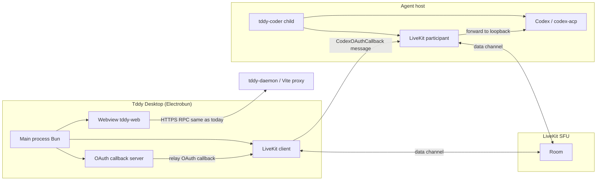

# Tddy desktop app (Electrobun) — design

## Purpose

Ship a **small native desktop shell** (`packages/tddy-desktop`) that:

1. **Embeds or serves `tddy-web`** locally so operators get a first-class app window instead of juggling browser tabs and Vite/daemon ports.
2. **Hosts the Codex OAuth loopback callback** (`http://localhost:<port>/auth/callback` or Codex’s chosen port) so sign-in works when the **browser runs on the same machine as the app**, and so we can **relay** the callback to the **remote `tddy-coder` session** that is waiting on another host.
3. **Uses the existing LiveKit room** (same model as the web terminal) so **`tddy-coder` drives the auth transaction**: it already publishes the **authorize URL** via participant metadata; the desktop app completes the **browser leg** and sends the **callback query** back over LiveKit to the participant that owns the Codex process.

This document is the **WHAT**; implementation lives in `packages/tddy-desktop` and incremental changes in `tddy-web`, `tddy-livekit`, and `tddy-coder` as needed.

## Non-goals (initial phases)

- Replacing the in-browser dashboard for all users (desktop is **optional**).
- Bundling `tddy-daemon` or `tddy-coder` inside the app (they remain separate processes/services).
- Storing long-lived OpenAI tokens in the desktop app (credentials stay where Codex/`tddy-coder` already persist them).

## Actors

| Actor | Role |
|--------|------|
| **Tddy Desktop** | Electrobun **main process** (Bun): window management, optional local static server, **OAuth callback HTTP listener**, LiveKit **client** for auth relay. |
| **tddy-web UI** | Same React app as today; loaded from `file://` bundle, embedded dev server, or proxied `https://` in webview. |
| **LiveKit room** | Shared **presence / RPC** room already used for terminal and participant list (e.g. `tddy-lobby` + session-scoped identities). |
| **tddy-coder** (child) | Publishes **`codex_oauth` metadata** (`pending`, `authorize_url`); runs **Codex** / **codex-acp** which listens on loopback for OAuth callback **on the agent host**. |
| **OpenAI / Codex OAuth** | Browser navigates to `https://auth.openai.com/...`; redirect URI is **fixed by Codex** (typically `http://127.0.0.1:<ephemeral>/auth/callback` on the **machine running Codex**). |

## Problem the desktop app solves

- **Remote agent host**: Codex binds OAuth callback on **its** loopback. A developer’s laptop browser cannot hit that address. Today the mitigations are **SSH `-L`**, **device code**, or **copying `auth.json`** ([Codex auth](https://developers.openai.com/codex/auth/)).
- **UX**: Even locally, a dedicated window + deep links improves discoverability vs “open Vite URL + daemon port”.

The desktop app targets **relay**: laptop runs **desktop + browser**; **callback hits the laptop**; **callback payload is delivered to `tddy-coder` over LiveKit** so Codex on the remote host can complete login (see *Relay variants* below).

## High-level architecture



## LiveKit: auth transaction (design)

### Today (baseline)

- `tddy-coder` + `tddy-livekit` publish participant **metadata** JSON:

  `{"codex_oauth":{"pending":true,"authorize_url":"https://..."}}`

- `tddy-web` **ParticipantList** parses metadata and opens the authorize link.

### Extension (desktop + `tddy-coder`)

Introduce a **signed, session-scoped** message on the existing **data channel** (new topic or RPC method; same security model as `tddy-rpc`):

1. **Desktop** joins the room with identity **`desktop-<session-correlation>`** (or reuse `web-` pattern with a distinct prefix) and subscribes to metadata / events for the **daemon** participant for the active session.
2. When **`codex_oauth.pending`** is true, desktop may:
   - open the **system browser** to `authorize_url`, or
   - embed OAuth in a **secondary webview** only if CSP allows (often blocked; **external browser** remains default).
3. Desktop runs **`http://127.0.0.1:<port>/auth/callback`** (or the port Codex advertises — see *Port negotiation*). On **`GET /auth/callback?code=...&state=...`**:
   - validate **state** against a value obtained from LiveKit (or from metadata envelope),
   - send **`CodexOAuthCallbackDelivered`** (name TBD) over LiveKit to **`tddy-coder`** (destination: daemon participant identity for that session).

4. **`tddy-coder`** (Rust) receives the payload and **injects** it into the Codex loopback listener. Two implementation variants:

   | Variant | Idea | Pros | Cons |
   |--------|------|------|------|
   | **A. Proxy listener** | On agent host, `tddy-coder` opens the loopback port and **proxies** HTTP to/from desktop via LiveKit | Codex still thinks callback is local | More moving parts; latency |
   | **B. IPC / hook** | Codex exposes or we use **`codex_oauth_relay`**-style forwarding to POST equivalent of callback into child stdin or local socket | Smaller HTTP surface | Depends on Codex CLI capabilities; may need upstream hooks |

**Recommendation:** Start design with **Variant A** documented end-to-end; spike **B** if OpenAI/Codex adds official remote callback config.

`packages/tddy-daemon` already has **`codex_oauth_relay`** validation helpers; the desktop path should **reuse** the same parsing/validation rules for **authorize URL** and **callback query** (host allowlist, session correlation).

## OAuth port negotiation

Codex picks an **ephemeral port** (e.g. 1455). The desktop app must learn it:

- **Preferred:** extend metadata JSON to include `callback_origin` / `callback_port` when available from Codex stderr or a small sidecar file written by `tddy-coder` (same session dir as `codex_oauth_authorize.url`).
- **Fallback:** desktop listens on a **fixed** local port and user configures Codex/`~/.codex/config.toml` if upstream supports **`mcp_oauth_callback_url`** or future **ChatGPT login** callback override (verify per Codex version).

## `packages/tddy-desktop` layout (target)

```
packages/tddy-desktop/
  README.md                 # Links to this doc; dev quickstart
  package.json              # electrobun, scripts: dev, build
  src/
    main/                   # Electrobun main process (Bun)
      index.ts              # App bootstrap, window, protocol
      livekit-auth-relay.ts # Join room, send callback payload
      oauth-callback-server.ts
    preload/                # If required by Electrobun security model
  resources/
    web/                      # Optional: copied packages/tddy-web/dist at build time
```

**Workspace:** add `packages/tddy-desktop` to root **`package.json` `workspaces`** when implementation starts; keep **Bun** as the JS toolchain consistent with the repo.

## Electrobun specifics

- **Main process:** Bun + Electrobun APIs for windows and webviews ([Electrobun docs](https://electrobun.dev/docs/)).
- **Renderer:** load **`tddy-web`** build output or **`VITE_URL`** in dev via allowed navigation / devtools policy.
- **Updates:** out of scope for v0; later consider Electrobun’s small delta updates.

## Security

- **Callback traffic** contains **authorization codes** — treat as secret in transit:
  - tunnel **raw TCP** (HTTP bytes) over the **LiveKit data channel** RPC already authenticated by **room JWT**;
  - restrict **destination identities** (only the daemon participant for the session);
  - **never** log full HTTP requests or query strings.
- **Metadata** from LiveKit is **not** trusted for code execution; only **HTTPS** authorize URLs (existing web parser rule).
- **Deep links** (`tddy://…`) optional later; must validate session id.

## Phases

1. **Shell** (implemented): Electrobun app loads **production `tddy-web` dist** from disk or env URL; Connect flow unchanged (RPC via daemon as today).
2. **OAuth discovery** (implemented): Desktop reads **`codex_oauth` metadata**; opens browser; listens on **`127.0.0.1:{callback_port}`** for the browser callback.
3. **Relay MVP** (implemented): **`LoopbackTunnelService.StreamBytes`** (bidirectional) pipes TCP bytes from the operator machine to **`127.0.0.1:{port}`** on the session host where Codex’s loopback listener receives the same HTTP `GET /auth/callback` as a local run.
4. **Polish:** Installer, code signing, auto-update, tray icon.

## Related docs

- [Codex OAuth web relay](../web/codex-oauth-web-relay.md)
- [Codex OAuth relay (daemon)](../daemon/codex-oauth-relay.md)
- [Local web development](../web/local-web-dev.md)
- [Web terminal / LiveKit](../web/web-terminal.md)
