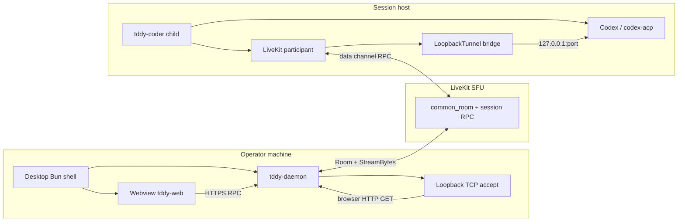

# Tddy desktop app (Electrobun) — design

## Purpose

Ship a **small native desktop shell** (`packages/tddy-desktop`) that:

1. **Embeds or serves `tddy-web`** locally so operators get a first-class app window instead of juggling browser tabs and Vite/daemon ports.
2. **Relies on `tddy-daemon` for the Codex OAuth browser callback on operator loopback** when **`livekit.common_room`** is configured: the daemon binds **`127.0.0.1:<callback_port>`**, bridges raw HTTP over **`loopback_tunnel.LoopbackTunnelService.StreamBytes`**, and opens the authorize URL in the system browser; the **session host** **`LoopbackTunnelService`** dials **`127.0.0.1:<port>`** toward Codex so the callback matches a local run.
3. **Uses the same LiveKit and metadata model as the web terminal**: **`tddy-coder`** publishes **`codex_oauth` participant metadata** on **`daemon-*`** session participants; the daemon reads that metadata from the **common room**. The desktop shell loads **`tddy-web`** and may spawn the daemon; it does **not** join LiveKit for OAuth or call **`Bun.listen`** in production (**`installLiveKitOAuthRelay`** remains for **tests** with injected **`startOAuthTcpTunnel`** stubs).

This document is the **WHAT**; implementation lives in `packages/tddy-desktop` and incremental changes in `tddy-web`, `tddy-livekit`, and `tddy-coder` as needed.

## Non-goals (initial phases)

- Replacing the in-browser dashboard for all users (desktop is **optional**).
- Bundling **`tddy-coder`** inside the app (it remains a separate agent process).
- Windows or Linux desktop bundles for **`tddy-daemon`** (macOS is the first bundled target).
- Storing long-lived OpenAI tokens in the desktop app (credentials stay where Codex/`tddy-coder` already persist them).

## Actors

| Actor | Role |
|--------|------|
| **Tddy Desktop** | Electrobun **main process** (Bun): window management, optional local static server, optional **embedded `tddy-daemon`** spawn on macOS; **no** production OAuth TCP bind or LiveKit client in the main process. |
| **`tddy-daemon` (operator)** | With **`livekit.common_room`**, **OAuth loopback tunnel** supervisor: metadata scan, browser open, **`TcpListener`** on operator loopback, **`StreamBytes`** toward the session **`daemon-*`** identity. |
| **tddy-web UI** | Same React app as today; loaded from `file://` bundle, embedded dev server, or proxied `https://` in webview. |
| **LiveKit room** | Shared **presence / RPC** room already used for terminal and participant list (e.g. `tddy-lobby` + session-scoped identities). |
| **tddy-coder** (child) | Publishes **`codex_oauth` metadata** (`pending`, `authorize_url`); runs **Codex** / **codex-acp** which listens on loopback for OAuth callback **on the agent host**. |
| **OpenAI / Codex OAuth** | Browser navigates to `https://auth.openai.com/...`; redirect URI is **fixed by Codex** (typically `http://127.0.0.1:<ephemeral>/auth/callback` on the **machine running Codex**). |

## Problem the desktop app solves

- **Remote agent host**: Codex binds OAuth callback on **its** loopback. A developer’s laptop browser cannot hit that address. Today the mitigations are **SSH `-L`**, **device code**, or **copying `auth.json`** ([Codex auth](https://developers.openai.com/codex/auth/)).
- **UX**: Even locally, a dedicated window + deep links improves discoverability vs “open Vite URL + daemon port”.

The desktop app targets **relay**: laptop runs **desktop + browser**; **callback hits the laptop’s loopback**; **`tddy-daemon` on the laptop tunnels bytes to `tddy-coder` over LiveKit** so Codex on the remote host can complete login.

## High-level architecture



## LiveKit: OAuth metadata and loopback tunnel

- **`tddy-coder`** publishes **`codex_oauth` JSON** on the session **`daemon-*`** participant metadata (`pending`, **`authorize_url`**, **`callback_port`**, **`state`**, etc.). **`tddy-web`** **ParticipantList** consumes it in the browser; **`tddy-daemon`** parses the same fields from the **common room** for the operator tunnel (**`codex_oauth_participant_metadata`**).
- **Session host** registers **`loopback_tunnel.LoopbackTunnelService`** on the LiveKit **tddy-rpc** surface alongside **TerminalService** (and **TokenService** when API key mode is used). **`StreamBytes`** uses **`TunnelChunk`**: the **first** chunk sets **`open_port`** (Codex loopback port); the server connects to **`127.0.0.1:{open_port}`** and refuses **`open_port < 1024`**.
- **Operator `tddy-daemon`** (when **`livekit.common_room`** is set) runs **`oauth_loopback_tunnel`**: after common-room connect, it supervises TCP listen + **`StreamBytes`** toward the selected **`daemon-*`** identity. **Desktop** production **`index.ts`** only ensures daemon HTTP is up and logs that OAuth TCP runs in the daemon; **`installLiveKitOAuthRelay`** is for **unit/e2e mocks**, not the shipped main-process path.
- **`tddy_daemon::codex_oauth_relay`** remains validation/parsing for **authorize URLs** and callback **URLs** where used; the tunnel path is **byte-transparent** between browser TCP and Codex loopback.

## OAuth port negotiation

Codex picks an **ephemeral port** (e.g. 1455). The desktop app must learn it:

- **Preferred:** extend metadata JSON to include `callback_origin` / `callback_port` when available from Codex stderr or a small sidecar file written by `tddy-coder` (same session dir as `codex_oauth_authorize.url`).
- **Fallback:** desktop listens on a **fixed** local port and user configures Codex/`~/.codex/config.toml` if upstream supports **`mcp_oauth_callback_url`** or future **ChatGPT login** callback override (verify per Codex version).

## `packages/tddy-desktop` layout

```
packages/tddy-desktop/
  README.md                 # Dev quickstart; embedded daemon env
  electrobun.config.ts      # build.copy includes resources/bin/tddy-daemon
  src/bun/
    index.ts                # BrowserWindow, embedded daemon, OAuth env hints (no LiveKit in prod)
    livekit-oauth-relay.ts  # installLiveKitOAuthRelay — tests / injection only
    embedded-daemon.ts      # Resolve config/binary paths; spawn tddy-daemon (macOS)
  resources/bin/            # Release binary from prebuild (gitignored)
```

## Electrobun specifics

- **Main process:** Bun + Electrobun APIs for windows and webviews ([Electrobun docs](https://electrobun.dev/docs/)).
- **Renderer:** load **`tddy-web`** build output or **`VITE_URL`** in dev via allowed navigation / devtools policy.
- **Updates:** out of scope for v0; later consider Electrobun’s small delta updates.

## Security

- **Callback traffic** contains **authorization codes** — treat as secret in transit:
  - tunnel **raw TCP** (HTTP bytes) over the **LiveKit data channel** RPC already authenticated by **room JWT**;
  - restrict **destination identities** (only the daemon participant for the session);
  - **never** log full HTTP requests or query strings.
- **Metadata** from LiveKit is **not** trusted for code execution; only **HTTPS** authorize URLs (existing web parser rule).
- **Deep links** (`tddy://…`) optional later; must validate session id.

## Phases

1. **Shell** (implemented): Electrobun app loads **production `tddy-web` dist** from disk or env URL; Connect flow unchanged (RPC via daemon as today).
2. **OAuth discovery** (implemented): **`tddy-daemon`** reads **`codex_oauth`** from common-room **`daemon-*`** metadata; opens the system browser when pending.
3. **Relay MVP** (implemented): **`LoopbackTunnelService.StreamBytes`** pipes bytes from **daemon-held** operator loopback TCP to **`127.0.0.1:{port}`** on the session host (same HTTP **`GET /auth/callback`** as a local run).
4. **Embedded daemon (macOS)** (implemented): see *Bundled `tddy-daemon` (macOS)* below.
5. **Polish:** Installer, code signing, auto-update, tray icon.

## Bundled `tddy-daemon` (macOS)

The desktop main process may **spawn `tddy-daemon`** so the webview reaches **`/api/config`** and Connect-RPC without a separate terminal. This targets **macOS** first; other desktop OS bundles are out of scope for now.

- **Config:** Daemon loads YAML via **`--config` / `TDDY_DAEMON_CONFIG`** (existing daemon behavior). The app resolves a config path from **`TDDY_DAEMON_CONFIG`**, repo-root **`dev.desktop.yaml`** when unset in dev, and root **`.env`** loading consistent with **`./web-dev`**.
- **Binary resolution (in order):** **`TDDY_DAEMON_BINARY`**, **`resources/bin/tddy-daemon`** (populated by **`prebuild`** / **`build-daemon`**), then workspace **`target/release/tddy-daemon`** or **`target/debug/tddy-daemon`** at the repo root. **`prebuild`** runs **`cargo build --release -p tddy-daemon`** and copies into **`resources/bin/`**; **`electrobun.config.ts`** **`build.copy`** ships the binary inside the app bundle.
- **Lifecycle:** Start when the main process starts (when config and binary resolve); **SIGTERM** / process exit tears down the child so the daemon listen port is released in normal quit paths.
- **Security:** No API keys are embedded in the app; the user YAML remains the trust boundary. A desktop-spawned daemon is a **dev convenience** and runs as the current user—production installs may still use **launchd** or another supervisor with different privileges.

## Related docs

- [Codex OAuth web relay](../web/codex-oauth-web-relay.md)
- [Codex OAuth relay (daemon)](../daemon/codex-oauth-relay.md)
- [Local web development](../web/local-web-dev.md)
- [Web terminal / LiveKit](../web/web-terminal.md)
