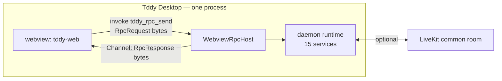

# Tddy desktop app (Tauri) — design

## Purpose

Ship a desktop application that **is** `tddy-daemon` rather than a shell in front of it:

1. **One process.** The Tauri main process hosts the daemon on its own runtime — no child process, no
   binary resolution, no waiting for a port.
2. **No listening socket.** UI↔daemon RPC crosses the host application's IPC bridge, not loopback
   TCP, so nothing else on the machine can reach the daemon's control plane.
3. **Configurable as what it is.** A settings screen reads and writes the daemon's own YAML — see
   [daemon-settings.md](../daemon/daemon-settings.md).

This document is the **WHAT**; the implementation lives in `packages/tddy-desktop/src-tauri`,
`packages/tddy-tauri-rpc` and `packages/tddy-tauri-web`.

> Replaces the Electrobun design ([tddy-desktop-electrobun.md](tddy-desktop-electrobun.md)), removed
> on 2026-09-05.

## Non-goals

- Replacing the browser dashboard. `./web-dev`, the `--headless` daemon install and remote access
  from a browser are unchanged, and the **same** web bundle serves both.
- Windows. The daemon's local socket (SO_PEERCRED) and sandbox runner are unix-only.
- Bundling `tddy-coder`. It remains a separate agent process the daemon spawns.
- Auto-update, code signing, notarization.

## Actors

| Actor | Role |
|---|---|
| **Tddy Desktop** | Tauri main process: forks the spawn worker, assembles the daemon, owns the window, serves RPC over the IPC bridge. |
| **`tddy_daemon::runtime`** | The daemon as a library. One bootstrap, two hosts — the binary and this app get the same roster. |
| **`tddy-tauri-rpc`** | Hosts the roster over a frame channel. Depends on `tddy-rpc` only, never on `tauri`. |
| **tddy-web UI** | The same React app the browser gets; it picks its transport at runtime. |
| **LiveKit room** | Unchanged. A session on *another* daemon is still reached over LiveKit from inside the app. |

## How the UI reaches the daemon

`tddy-rpc` was already transport-agnostic — `rpc_envelope.proto` says so — with flavours for HTTP
(`tddy-connectrpc`), LiveKit data channels (`tddy-livekit`) and process pipes (`tddy-stdio`). The
desktop app adds a fourth: **webview IPC**.

Two commands, and no others:

| Command | Direction | Payload |
|---|---|---|
| `tddy_rpc_connect(channel, client_epoch)` | page → host | registers this page's response channel |
| `tddy_rpc_send(request)` | page → host | one encoded `RpcRequest` as the **raw** invoke body |

Frames cross as bytes, never JSON or base64. A JSON body is refused rather than decoded.

**Why one duplex channel instead of a command per RPC**: it is the same shape the LiveKit flavour
uses, so the browser-side engine (`tddy-rpc-web`) is shared rather than written twice — and the
`client_epoch` rule that stops a previous page's streams from resolving a new page's calls is
identical across flavours.

### The page-reload rule

A request id restarts at 1 whenever a page rebuilds its id space, while the host may still be
streaming for ids the new page is about to hand out. Each page connection is therefore a distinct
engine peer, and registering a new channel **abandons everything the previous page opened**. Without
this, a reload silently resolves calls with another page's frames, decoded as the wrong message type.

## Configuration

Resolved exactly as the Electrobun shell resolved it, so existing setups keep working:

1. Repo-root `.env` is loaded first, **without overriding** already-set variables (the `./web-dev` rule).
2. `TDDY_DAEMON_CONFIG`, else repo-root `dev.desktop.yaml`.
3. `CURRENT_USER` in the YAML is substituted before the daemon reads it.

The app `chdir`s to the workspace root so relative paths in the YAML keep the meaning they had when
the daemon ran as a child process.

## One bundle, two hosts

`tddy-web` chooses its transport at runtime: the webview-IPC flavour when the host application's
bridge is present on `window`, the same-origin `/rpc` Connect transport otherwise. **Both carry the
same interceptor stack** — traffic metering and the auth gate are the same instances, so a desktop
operator cannot silently lose the auth gate.

Client configuration follows the same fork: `GET /api/config` in a browser,
`DaemonConfigService.GetClientConfig` where there is no HTTP origin. That call is deliberately
ungated — it is what tells a page there *is* a daemon to sign in to, and it carries no secrets.

## Security

- **No listening socket.** Verified with `lsof -a -nP -iTCP -sTCP:LISTEN -p <pid>` against the
  running app. (The `-a` matters: without it `lsof` ORs its selectors and proves nothing.)
- **Application commands go through Tauri's ACL** like plugin commands — `build.rs` names them and
  `capabilities/default.json` grants them, scoped to the `main` window.
- **A remote-origin page gets no capabilities**, so the dev page must be relative to `devUrl`.
- The Codex OAuth loopback tunnel is unchanged and still lives in `tddy-daemon`.

## Platforms

macOS and Linux. The macOS `.app` bundle is verified; the `.dmg` step needs Automation permission
for Finder. Linux bundles are unverified — the nix dev shell carries the WebKitGTK inputs for them.

## Related docs

- [Daemon settings](../daemon/daemon-settings.md)
- [Local web development](../web/local-web-dev.md)
- [Codex OAuth relay (daemon)](../daemon/codex-oauth-relay.md)
