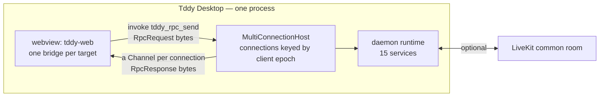

# Tddy desktop app (Tauri) — design

## Purpose

Ship a desktop application that **is** `tddy-daemon` rather than a shell in front of it:

1. **One process.** The Tauri main process hosts the daemon on its own runtime — no child process, no
   binary resolution, no waiting for a port.
2. **No listening socket.** UI↔daemon RPC crosses the host application's IPC bridge, not loopback
   TCP, so nothing else on the machine can reach the daemon's control plane.
3. **Configurable as what it is.** A settings screen reads and writes the daemon's own YAML — see
   [daemon-settings.md](../daemon/daemon-settings.md).

This document is the **WHAT**; the implementation lives in `packages/tddy-desktop/src-tauri`,
`packages/tddy-tauri-rpc` and `packages/tddy-tauri-web`.

> Replaces the Electrobun design ([tddy-desktop-electrobun.md](tddy-desktop-electrobun.md)), removed
> on 2026-09-05.

## Non-goals

- Replacing the browser dashboard. `./web-dev`, the `--headless` daemon install and remote access
  from a browser are unchanged, and the **same** web bundle serves both.
- Windows. The daemon's local socket (SO_PEERCRED) and sandbox runner are unix-only.
- Bundling `tddy-coder`. It remains a separate agent process the daemon spawns.
- Auto-update, code signing, notarization.

## Actors

| Actor | Role |
|---|---|
| **Tddy Desktop** | Tauri main process: forks the spawn worker, assembles the daemon, owns the window, serves RPC over the IPC bridge. |
| **`tddy_daemon::runtime`** | The daemon as a library. One bootstrap, two hosts — the binary and this app get the same roster. |
| **`tddy-tauri-rpc`** | Hosts many addressed connections over frame channels, each reaching the roster its target names. Depends on `tddy-rpc` only, never on `tauri`. |
| **tddy-web UI** | The same React app the browser gets; it picks its transport at runtime. |
| **LiveKit room** | Optional, and for *other* daemons only. A peer host — and a session on it — is still reached over LiveKit from inside the app when a common room is configured. The app's own host never is. |

## How the UI reaches the daemon

`tddy-rpc` was already transport-agnostic — `rpc_envelope.proto` says so — with flavours for HTTP
(`tddy-connectrpc`), LiveKit data channels (`tddy-livekit`) and process pipes (`tddy-stdio`). The
desktop app adds a fourth: **webview IPC**.

Three commands, and no others:

| Command | Direction | Payload |
|---|---|---|
| `tddy_rpc_connect(channel, client_epoch, target)` | page → host | opens one connection to `target`, registering `channel` as the one its answers come back on |
| `tddy_rpc_send(request)` | page → host | one encoded `RpcRequest` as the **raw** invoke body, routed by the epoch it carries |
| `tddy_rpc_disconnect(client_epoch)` | page → host | releases that one connection |

Frames cross as bytes, never JSON or base64. A JSON body is refused rather than decoded.

**Why one duplex channel instead of a command per RPC**: it is the same shape the LiveKit flavour
uses, so the browser-side engine (`tddy-rpc-web`) is shared rather than written twice — and the
`client_epoch` rule that stops a previous page's streams from resolving a new page's calls is
identical across flavours.

### A page holds as many connections as it has things to reach

Over LiveKit a session is a **participant** you address inside a room. Over IPC there was no
equivalent: a page got one connection and that connection reached one thing, the daemon's roster, so
session-scoped work on the desktop fell back to the daemon. The bridge is now **addressed** — a page
opens the daemon connection and, alongside it, one per session it wants to reach, all concurrent and
all independent.

**The client epoch is the connection's identity.** It was already minted per transport on the page
side and stamped on every frame, so making it the key of the host's connection map changed the
container and not the protocol: no frame format change, no version to negotiate. Each connection gets
its own engine peer (`webview-{epoch}`), so the engine releases what it holds for one connection as a
unit, and its own bounded response queue, so **backpressure is per connection** — a page that stops
reading one channel stalls that connection alone.

Two refusals follow from addressing, and both are told to the page rather than papered over. Opening a
connection under an epoch that is already in use is refused, and the incumbent keeps serving: epochs
are minted one per connection, so a collision is the newcomer's mistake and evicting the connection
already there would lose the calls it has in flight for someone else's. A frame naming no open
connection is refused too, because dispatching it onto some other connection would answer it into a
channel that drops it for the epoch mismatch, and the caller would wait forever.

### What a target means

`ConnectionTarget` names `Daemon` or `Session { session_id }` — a **closed** set, not a string.
An open target would invite the LiveKit identity strings (`daemon-{instance}-{session}`) to leak
across the IPC boundary unnoticed; a new kind of peer should be a new variant and a deliberate
decision.

`tddy-tauri-rpc` does not know what a target means. It is handed a `RosterResolver` and asks it, at
connect time, for the service that target reaches — which is what keeps the crate a generic
webview-RPC host and leaves the desktop app the only place that knows how its own addressing works.
The crate refuses an unresolvable target **at connect**, with a reason, rather than accepting the
connection and silently answering nothing: a page that is told can fail, and a page that is not waits
forever.

**The desktop's resolver resolves every target to the daemon's own roster**, so that refusal never
fires here. That is not a stand-in for something better — it is what the embedded daemon *is*. The
daemon serves session-scoped RPC itself and routes it by what the request names rather than by the
connection it arrived on, so the addressing is real everywhere it has to be (own epoch, own engine,
own peer, own backpressure, released independently) while the roster behind every target is the one
daemon. Gating a session target on a live session would mean an async lookup, and resolution is
synchronous; a call naming a session the daemon does not have is therefore answered by the daemon,
with the same error a browser page gets.

The application does not yet open session connections of its own — the dashboard still reaches
everything over its daemon connection. The transport is what exists today; the connection provider
that opens a connection per attached session is separate work.

### One bridge per target

The page side mirrors this. `thisPagesIpcHost().openConnection(target)` hands back the bridge for a
target, opening one the first time it is asked and the same one every time after, so the daemon
connection is opened exactly once per page however many call sites want it and two components
reaching one session share its connection rather than opening two. There is no way to build a bridge
outside that registry, because one built outside would be a second connection to something the page
already reaches, under a second epoch nothing would ever release.

A bridge **owns its epoch**, minted with the bridge and fixed for its lifetime. A page that builds two
transports over one bridge therefore still holds one connection under one epoch — the registration
and the frames can never name different connections, which is the failure that leaves a call
unsettled with no other symptom.

`close()` releases the host side and is idempotent. It resolves the bridge's `closed` promise as it
goes, so calls in flight when a connection is given up settle instead of hanging, and it drops the
registry entry before telling the host — a target reattached while the release is still in flight
opens a fresh connection rather than being handed one whose peer is going away. Leaving `closed`
unresolved was right while a connection lived exactly as long as its page; it is not true of a session
connection, which ends when the session is detached, and without an explicit release every attach
would leak a host-side peer.

### The page-reload rule

A request id restarts at 1 whenever a page rebuilds its id space, while the host may still be
streaming for ids the new page is about to hand out. Each connection is therefore a distinct engine
peer, and **everything the departing page opened is released as the replacing page commits**.

A page owns its connections and nothing else does. When it goes — a reload, or the navigation a
completed sign-in performs — it takes the memory of its epochs with it, so it can no longer release
them, and the host only notices a departed page lazily, when a response it can no longer deliver is
published, which for an idle connection is never. One slot used to make the reap automatic, because
registering a channel overwrote it; a map of connections has to be told.

**Ordering is the whole difficulty**, because the reap fires on the *arriving* page's load, not the
departing one's. It runs at the commit of the new document — before its scripts are injected, and so
before it can invoke anything — and it runs to completion on that thread rather than being spawned,
since a reap still running as the new page starts opening connections would take those with it. It is
scoped to the dashboard window, and it is a no-op before the daemon is assembled, which is where the
very first page load lands.

## Configuration

Resolution splits on the build profile, because a development run and an installed application have
nothing in common about where they stand when they start.

A **development build** resolves it from the checkout, exactly as the Electrobun shell did, so
existing setups keep working:

1. `TDDY_DAEMON_CONFIG`, else repo-root `dev.desktop.yaml` found by walking up from the working
   directory.
2. `CURRENT_USER` in the YAML is substituted before the daemon reads it.

A **release build** reads `~/.tddy/desktop.yaml` and nothing else. There is no `TDDY_DAEMON_CONFIG`,
no `dev.desktop.yaml` and no upward walk: an installed `.app` launched from the Dock has `/` for a
working directory and no checkout above it, so anything found that way would have been found by
accident. When that file is absent the application refuses to start and names `./install --desktop`,
which writes it.

Both profiles then apply the workspace root's `.env` **without overriding** already-set variables
(the `./web-dev` rule), and both `chdir` to the workspace root so relative paths in the YAML keep the
meaning they had when the daemon ran as a child process.

### What the configuration must carry

`listen.web_port` is **required** even though the application serves no HTTP. It is the loopback port
a GitHub sign-in comes back on — the application opens a one-path `/auth/callback` listener on
127.0.0.1 for the duration of a sign-in and closes it again — and it is what the redirect URI handed
to the provider is built from. `redirect_uri` in the configuration is ignored: the application
derives it from this port so the callback reaches the listener it actually opened.

`web_bundle_path` is absent on purpose. The dashboard is embedded in the application at build time,
so there is no directory to serve it from.

An **identity** is three blocks that stand or fall together, and without them the application starts
onto its settings and nothing else — no sessions, no hosts, no screen sharing:

| Block | Why it is required |
|---|---|
| `github:` | Absent, the daemon builds no session-user resolver, and every session service is assembled behind one. |
| `livekit.api_secret` | The only source of the session-token signer. Absent, every token-gated RPC refuses — including the settings service an operator would repair the configuration from. `enabled:` governs the common room alone. |
| `users:` | Which OS user a login runs sessions as. A login with no entry is refused `permission_denied: user not mapped to OS user`; there is no fallback to whoever the daemon runs as. Peers sharing a common room must name the same login on every side. |

## Installing it

`./install --desktop` installs the application for the invoking user. It is a **different deployment**
from `./install --systemd`, not a variant of it — the application's own process *is* a `tddy-daemon`
— so it writes no unit, creates no service user, deploys no web bundle directory and serves no port,
and passing both flags in one run is an error.

| | macOS | Linux |
|---|---|---|
| Application | `Tddy Desktop.app` in `~/Applications` | the binary in `$BIN_DIR`, plus a `.desktop` entry and a hicolor icon under `$XDG_DATA_HOME` |
| `tddy-desktop` on `PATH` | a launcher script that `exec`s the binary *inside* the bundle | the installed binary |
| CLI binaries | `Contents/MacOS` **and** `$BIN_DIR` | `$BIN_DIR` |

The launcher is a script rather than a symlink deliberately: a symlink makes the process's executable
path `$BIN_DIR/tddy-desktop`, which breaks both bundle identity and the sibling-of-`current_exe()`
lookup that resolves `tddy-sandbox-runner` and `tddy-index-daemon`. That same lookup is why the CLI
binaries are installed twice on macOS — inside the bundle for the daemon to find, and in `$BIN_DIR`
for `allowed_tools` and a hand-run `tddy-tools` to resolve.

`./release --desktop` builds everything the install ships, in the one order that works: the CLI
binaries, then the `tddy-web` bundle, then `tauri build`. The application *embeds* the bundle, so
building the app first produces a stale dashboard and no error. `--build` runs that same script, and
without it the install preflights for the artifacts and fails naming it.

It builds one bundle target per platform, the one this install consumes: `--bundles app` on macOS,
`--no-bundle` on Linux, where the binary goes on `PATH` and the `.desktop` entry and icon come from
the source tree. `tauri.conf.json` keeps all four targets because it also describes distribution.
Skipping `dmg` skips `bundle_dmg.sh`, which drives Finder over AppleScript and fails without
Automation permission — after the `.app` is already complete, so it failed a build that had already
succeeded.

A build that fails **after** producing the artifact says so and names it; `./install --desktop` then
installs what is already built.

The configuration is rendered from `desktop.yaml.production` and an existing one is **never**
overwritten, so a reinstall keeps every choice the operator made. Overrides: `INSTALL_TDDY_HOME`,
`INSTALL_BIN_DIR`, `INSTALL_DESKTOP_APP_DIR`, `INSTALL_XDG_DATA_DIR`, `INSTALL_DAEMON_LOG_DIR`,
`INSTALL_AUTH_STORAGE_DIR`. Moving `INSTALL_TDDY_HOME` away from `$HOME/.tddy` warns, because a
release build has no second place to look.

## One bundle, two hosts

`tddy-web` chooses its transport at runtime: the webview-IPC flavour when the host application's
bridge is present on `window`, the same-origin `/rpc` Connect transport otherwise. **Both carry the
same interceptor stack** — traffic metering and the auth gate are the same instances, so a desktop
operator cannot silently lose the auth gate.

On the webview-IPC side the daemon transport takes its bridge from the page's per-target registry,
so the one-connection-to-the-daemon guarantee belongs to the page rather than to a singleton inside
`tddy-web`.

Client configuration follows the same fork: `GET /api/config` in a browser,
`DaemonConfigService.GetClientConfig` where there is no HTTP origin. That call is deliberately
ungated — it is what tells a page there *is* a daemon to sign in to, and it carries no secrets.

## Which wire reaches which host

The app's **own** host is reached over the IPC bridge; **peer** hosts, when a common room is
configured, over LiveKit. Both at once, in one session of the app, with no reload and no mode switch
— reachability is per host and per connection, so the two fall out of one mechanism.

`tddy-web` registers a connection provider for the local host whenever
`daemonTransportFlavour(window)` says this page is running in the host application, which is the same
runtime question that already chose the daemon transport above. A browser answers otherwise and
registers nothing, so its behaviour is unchanged: the desktop machine's host is still reached over
LiveKit from a browser. The guarantee is behavioural rather than structural — there is one bundle, so
the module is present either way and what differs is whether anything registers it.

The local provider is registered **ahead of** the LiveKit one, so the app's own host resolves
in-process even where a common room could also reach that machine. The daemon is in this process; a
round trip out to a media server and back to a roster already in the binary is latency for nothing,
and registration order expresses that without a user-facing preference.

**The IPC path carries RPC only.** No room, participant, token or LiveKit identity appears on it —
not in the provider, not in a session's attachment hint. Video, screen sharing and the participant
roster therefore do not apply to the app's own host and are absent rather than broken; the daemon
*could* publish media into a room to fill the gap, but that would make the desktop app quietly
require the thing this design made optional. The same daemon remains fully media-capable when a
browser reaches it over the common room, which is why capabilities describe a connection rather than
a host.

**With no LiveKit configuration the app is complete on its own host**: no room joined, no token
minted, no `Room` constructed, and a directory that reports `idle` rather than an error for a feature
nobody asked for. **With LiveKit configured, a failure of the common room degrades the peers only** —
the local host stays selectable and usable, and the failure is reported against that source rather
than as a fault of the directory.

## Security

- **No listening socket.** Verified with `lsof -a -nP -iTCP -sTCP:LISTEN -p <pid>` against the
  running app. (The `-a` matters: without it `lsof` ORs its selectors and proves nothing.)
- **Application commands go through Tauri's ACL** like plugin commands — `build.rs` names them and
  `capabilities/default.json` grants them, scoped to the `main` window.
- **A remote-origin page gets no capabilities**, so the dev page must be relative to `devUrl`.
- The Codex OAuth loopback tunnel is unchanged and still lives in `tddy-daemon`.

## Platforms

macOS and Linux. The macOS `.app` bundle is verified; the `.dmg` step needs Automation permission
for Finder. Linux bundles are unverified — the nix dev shell carries the WebKitGTK inputs for them.

## Related docs

- [Addressed webview IPC connections](../../../packages/tddy-desktop/docs/webview-ipc-connections.md)
  — the implementation of the bridge described above
- [The local host over IPC](../../../packages/tddy-web/docs/local-host-ipc.md) — the web side: the
  provider that reaches the app's own host, and why it uses the page's existing daemon transport
- [Daemon settings](../daemon/daemon-settings.md)
- [Local web development](../web/local-web-dev.md)
- [Codex OAuth relay (daemon)](../daemon/codex-oauth-relay.md)
